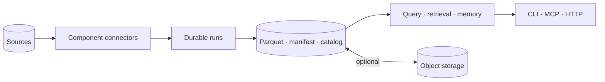

# contextful

A local-first context engine for agents and small teams. It ingests through
sandboxed component connectors, lands versioned Parquet beside a JSON manifest
and a rebuildable catalog, and serves retrieval, memory and derived results over
a CLI, an MCP endpoint and HTTP. A single node runs offline with no external
orchestrator; sync and cloud deployment are optional and ride plain object
storage.



Two internal halves of one engine, compiled from one workspace:

- the **read path** — the store, the catalog, the query face, retrieval, memory,
  admission and enforcement, sync;
- the **run path** — the journal, cursors, schedules, connectors invoked as
  journaled steps, crash-safe replay.

Exactly three contracts cross between them: the connector interface, the
Parquet-and-manifest layout, and capability tokens. That narrowness is what
lets a read replica serve without linking a scheduler or a component host.

## The specification is the source of truth

The design is written first and the implementation is built against it.

| Where | What it holds |
| --- | --- |
| [`spec/00-corpus.md`](./spec/00-corpus.md) | The grammar the corpus obeys — how a fact is addressed, where it lives, and what a file may not contain |
| [`spec/01-topology.md`](./spec/01-topology.md) | The system: its parties, its contracts, its build profiles |
| [`spec/`](./spec/) | Ten contracts across nineteen files, each the sole home of what it owns |
| [`spec/adr/`](./spec/adr/) | Eight principles and one record per shared decision: options, the criterion that decided it, the cost accepted |
| [`spec/status.md`](./spec/status.md) | Generated. Which clauses the tree demonstrates, and which it commits to |
| [`spec/roadmap.md`](./spec/roadmap.md) | The milestone order, each naming the operations it closes |
| [`references/`](./references/) | The literature and practice the design answers to, indexed by operation |

A contract file states behavior and never argues for it; a clause carries its reason
in one short cell or points at a record. No spec file says whether something is
built — that is computed from pins that resolve against the source tree, so a rename
reds the gate where a forgotten edit would not.

```sh
cargo run -q -p contextful-spec -- lint    # the corpus rules
cargo run -q -p contextful-spec -- state   # regenerate spec/status.md from spec/pins.toml
cargo run -q -p contextful-ci -- gate      # the gate's stages, as the pull-request checks run them
```

Code is written test first: every source change carries a test that fails against its
base commit, and every milestone carries an acceptance test before its first clause is
pinned. [`AGENTS.md`](./AGENTS.md) describes the loop.

## License

Apache-2.0. See [`LICENSE`](./LICENSE).
