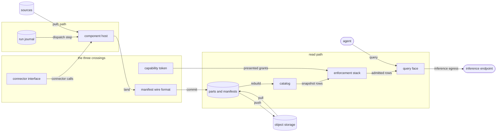
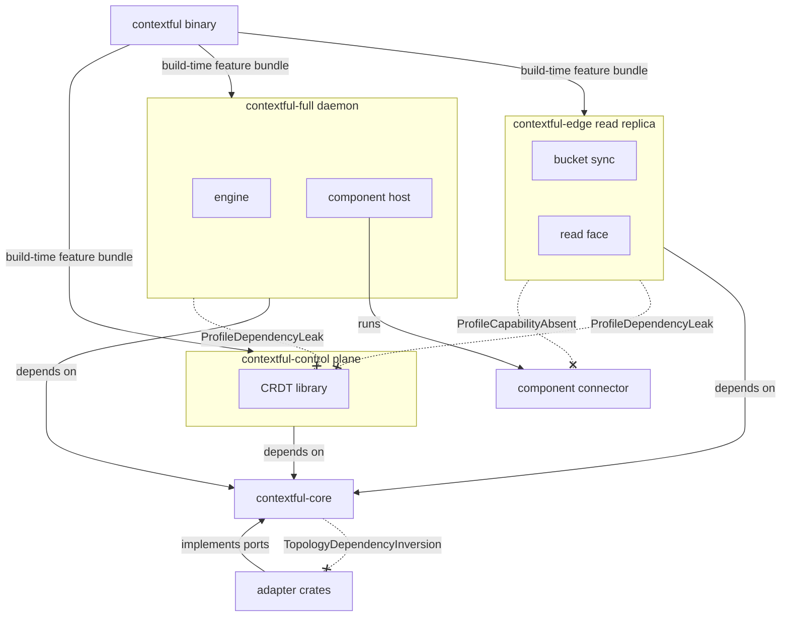
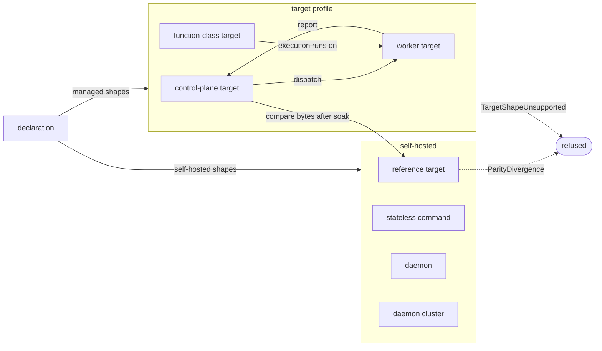
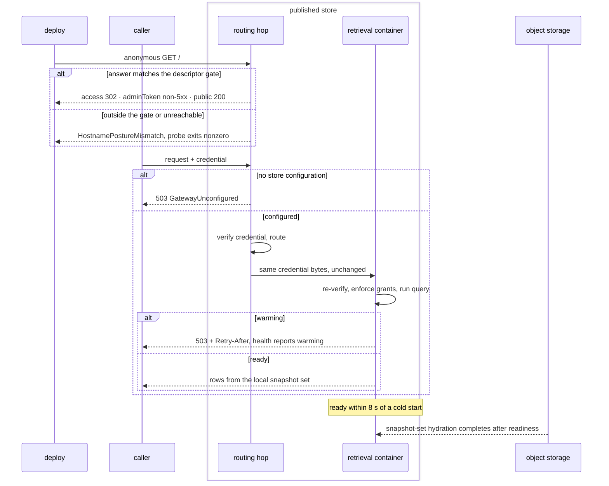
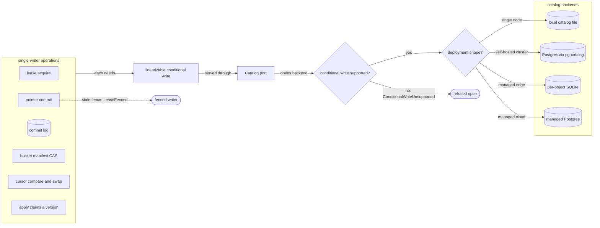

# System topology

The engine is two halves of one workspace — the read path and the run path — joined by
three crossings and compiled into three build profiles. This contract fixes the halves,
the crossings, the profiles, where a build is deployed, how a published hostname declares
its posture, the single-writer operations and the catalog that serializes them, and where
the engine ends and an application begins.

The system: the parties outside it, the components on each half, and the three crossings
joining them.



## compose

The two halves of the engine, the three crossings between them, complete mediation, and the properties holding across both halves.

- `workspace` — One Cargo workspace compiles both halves. Neither half ships as its own binary, package scope or release; "read path" and "run path" name a boundary, not a product.
- `read-path` — The read path holds data at rest and its retrieval: the context store, the catalog, query and ranking, memory queries, bucket sync, and the capability check a record passes before it lands.
- `run-path` — The run path holds execution: the journal, the scheduler, cursor commit, awakeables, and every connector invoked as a journaled step. It owns no store and no ranking.
- `three-crossings` — Exactly three contracts cross between the halves: the connector interface world, the columnar-part-plus-manifest layout, and the capability-token format. No general internal call surface joins the halves.
  *A-topology*
- `crossing-version` — Each crossing carries its own version and a conformance suite both sides run. A member added to a crossing passes a security review before admission.
- `undeclared-crossing` — A run-path crate reaches a read-path crate only through a crate carrying one of the three crossings; {{assurance.gate.crate-graph}} checks every edge.
  *A-topology*
- `run-path-droppable` — A build linking no execution core, scheduler or component host serves reads of data a full daemon produced, over the identical part-and-manifest layout and connector contract.
- `cli-binary` — The system ships one command binary, `contextful`, and one package scope, `@contextful/*`. The smallest deployable build is a profile, not a crate.
- `mediation` — Every function returning or releasing a stored row takes the enforcement stack's admission value as a parameter ({{assurance.gate.row-token}}), so a row path that skips enforcement does not type-check. No operator switch disables mediation.
  *A-topology*
- `enforcement-span` — The enforcement stack spans both halves: capability allowlists and the journal on the run path; the statement guard, visibility semi-join, row and column restriction, masking and the audit chain on the read path.
- `semantic-layer` — Enforcement interprets no content. Retrieval, memory synthesis, the operator console and inference placement interpret content and reach enforcement through the three crossings alone.
- `one-tree` — Laptop through cluster runs from one source tree. A single-node or edge deployment runs no external queue, cache or coordination process; a multi-node deployment adds one shared database.
- `connector-pillar` — A connector is an interface world run in a sandboxed component host that mediates every capability. A native connector, the first-party path for stateful sources, satisfies the same schema, record and cursor contract.
- `open-store` — Table data sits in columnar parts with a JSON manifest and a rebuildable catalog on plain object storage, readable by standard SQL tooling. No proprietary container or opaque blob holds table data.
- `inference-egress` — Model access leaves the process through one operator-configured endpoint speaking OpenAI-compatible HTTP. The one provider-shaped step serializes a tool's parameter schema into the provider's envelope.
  *A-topology*
- `vendor-sdk` — The dependency audit raises `VendorSdkLinked`, naming the crate and the dependency, for a crate declaring a model-vendor SDK or a second outbound path to a model.
  *A-topology*
- `local-first` — Pipelines need no network beyond their sources, and bucket sync is opt-in per deployment. The engine makes no control-plane callback, no license check, and sends no telemetry to its authors.
- `script-runtime` — A JavaScript runtime linked into any profile raises `ScriptRuntimeLinked`. The authoring surface is a build-time compiler emitting a serialized, content-hashed plan.
  *A-run*
- `memory-substrate` — Synthesized memory's episode, fact, entity and preference tables are ordinary store tables, and its synthesis pipeline is an ordinary run-path workflow on the same journal, cursor and retry machinery.
- `two-spines` — The run record answers what happened on the write side and the request ledger on the read side. No third surface merges them.

## package

The domain crate, dependency direction, and the three build profiles with what each links.

- `crate-map` — Eighteen crates compose the workspace. `contextful-cli` is the binary and wires every adapter per profile by dependency injection.
- `crate-map-drift` — A `crates/` package absent from the crate tree under `## Shapes`, or a {{topology.package.crate-map}} count differing from that tree's entries, raises `CrateMapDrift`, naming the package or both counts.
  *because a package added without a map entry otherwise passes every other gate*
- `domain-crate` — `contextful-core` holds the pure domain types and the port traits every adapter implements, performs no I/O, and links into every profile.
  *A-topology*
- `domain-impurity` — `contextful-core` declaring an async runtime, a component host, an HTTP client or a columnar-format implementation raises `DomainCrateImpurity`, naming the dependency and the feature that pulled it.
  *A-topology*
- `dependency-direction` — A dependency edge from `contextful-core` toward an adapter crate raises `TopologyDependencyInversion`, naming both crates and the manifest line.
  *A-topology*
- `profile` — Three profiles compile from the workspace, each a Cargo feature bundle selected at build time: `contextful-edge`, `contextful-full`, `contextful-control`. Each links the dependencies its role names and nothing else.
  *A-topology*
- `fixed-at-build` — No run-time detection widens a running binary into another profile's feature set. Build, release and automation tooling links into no profile.
  *A-topology*
- `profile-leak` — A profile resolving a package outside its role raises `ProfileRoleLeak`, naming the profile and the path: a component host, the run path or the evaluation runner in `contextful-edge` or `contextful-control`; the SQL engine in `contextful-control`; build tooling anywhere.
  *A-topology*
- `capability-absent` — A subcommand reaching a capability its build's profile does not link raises `ProfileCapabilityAbsent`, naming the subcommand and the profile, and acts on nothing; a name no profile defines is a usage error.
  *A-topology*
- `version-profile` — `contextful --version` prints the workspace version and the profile bundle the build selected, `development` for a build selecting none.
- `edge-profile` — `contextful-edge` is the read replica: it syncs parts and manifests from a bucket and serves a read-only SQL replica. It links no scheduler, run path, script runtime or component host.
- `edge-eligibility` — The edge profile is the one profile a function-class target hosts. Execution on such a deployment runs on a worker target.
- `full-profile` — `contextful-full` is the daemon: the durable-execution core, the in-process scheduler, the component host, the SQL query face, transforms, the full-text and vector sidecars and the tool server.
- `control-profile` — `contextful-control` is the self-hosted control plane: team state, the edit-time configuration document and identity. It materializes canonical TOML on apply and is the one profile linking the CRDT library.
  *A-topology*
- `component-host` — A component connector runs where a component host is linked: the full profile and the container or worker shapes built from it.
  *A-topology*
- `host-missing` — Dispatching a component connector on a profile with no component host raises `ComponentHostMissing`, naming the connector and the profile, with no fallback to a similarly named native source.
  *A-topology*
- `crdt-leak` — The CRDT library in the resolved dependency graph of the edge or full profile raises `ProfileDependencyLeak`, naming the profile and the path that pulled it. A daemon or replica reads materialized text.
  *A-topology*
- `store-write-engine-free` — `contextful-context` resolved without its `read` feature, on any target, and reaching `duckdb`, `libduckdb-sys`, `libsqlite3-sys`, an async runtime or an HTTP or TLS stack through a normal dependency raises `StoreWriteLinksEngine`, naming the package and path.
  *because a host that lands, folds or scans a store serves no read and opens no connection, so an engine, runtime or network stack is code it never calls*
- `transport-optional` — `contextful-outbound` resolved without its `transport-ureq` feature and reaching `ureq`, `hyper`, `reqwest`, `rustls` or `curl` through a normal dependency raises `TransportStackLinked`, naming the path that pulled it.
  *A-connector*
- `decode-network-free` — `contextful-decode` reaching `contextful-outbound`, `ureq`, `hyper`, `reqwest`, `rustls`, `curl` or `tokio` through a normal dependency raises `DecodeLinksNetwork`, naming the path that pulled it.
  *A-connector*
- `exchange-optional` — `contextful-policy` links the external-assertion stack, `jsonwebtoken` and `rsa`, only under its non-default `exchange` feature, which only the binary may enable, and only alongside wiring {{authority.exchange.surface}}. Another `crates/` package whose resolved graph reaches either raises `ExchangeDependencyLeak`, naming the path.
  *because an embedder admitting credentials with no identity provider then links no RSA code, and `rsa` carries a timing advisory with no patched release*
- `sqlite-adapter` — `contextful-sqlite` alone declares the SQLite binding as a normal dependency and enables no link feature itself; only `contextful-cli` turns on its `bundled` feature. Any other normal-dependency declaration or enablement raises `SqliteLinkForced`, naming the manifest line.
  *A-store*
- `s3-sync-optional` — `contextful-sync` resolved without its `s3-sync` feature and reaching `ureq`, `hyper`, `reqwest`, `rustls` or `curl` through a normal dependency raises `SyncStackLinked`, naming the path that pulled it.
  *because a host syncing through a filesystem bucket, or embedding the sync package without a bucket, links no network stack*
- `store-sqlite-free` — `contextful-context` reaching `libsqlite3-sys` through a normal dependency, with its default features, on any target, raises `StoreLinksSqlite`, naming the path that pulled it.
  *A-store*
- `interchange-whole` — The edge profile links the columnar interchange crates whole, as the full profile does; no slimmed interchange build exists.
  *because a slimmed build forks the format code an edge replica reads with from the code the full profile writes with*

Profiles, the domain crate they share, and the dependency edges the gates raise on.



unsettled: Does the edge profile pull native connectors through an execution core that links no scheduler? owner: topology affects: topology.package

## deploy

One declaration across providers, deployment roles, self-hosted shapes, the reference target and output parity.

- `unsupported-shape` — A target profile claiming a shape its provider does not provide raises `TargetShapeUnsupported`, naming the shape and the missing primitive.
  *A-topology*
- `wall-clock-cap` — A target capping per-invocation wall clock at 15 min hosts neither a first-time backfill nor a component connector, and its target profile records both exclusions.
- `parity` — One declaration run on every control-plane target produces byte-identical table parts, compared against the reference target inside each target's object store after a 24 h soak.
  *A-topology*
- `parity-divergence` — A byte difference from the reference output raises `ParityDivergence`, naming the target, the table and the first differing part.
  *A-topology*

One declaration, a target profile per provider, the two roles, and the parity check
against the reference target. Each provider's shapes are data under `spec/targets/`, checked by
`corpus.targets`; [`targets.md`](./targets.md) renders each as a role table and a diagram.



unsettled: Which role hosts heavy compute on a provider exposing neither a container primitive nor a long-running function? owner: topology affects: topology.deploy

## publish-hostname

A published hostname's descriptor, gate and posture probe, and the two hops a published store answers through.

- `posture-mismatch` — A probe answer outside its descriptor's gate, or an unreachable hostname, raises `HostnamePostureMismatch` with the hostname, the declared gate and the observed response, and `contextful-ci deploy probe` exits nonzero.
  *A-topology*
- `probe-table` — A probe table entry absent from the descriptor set, or a descriptor with no probe entry, raises `ProbeTableDrift` before any hostname is probed, naming the hostname and the side missing it.
  *A-topology*
- `empty-probe` — An absent descriptor directory, an absent probe table, or a descriptor set naming no hostname raises `ProbeSetEmpty`, naming the path; a passing probe has checked at least one hostname.
  *because a probe that checks nothing and exits zero reads as a proven posture to the pipeline that invoked it.*
- `unknown-field` — A descriptor decodes with excess properties refused; an unmodelled key raises `DescriptorUnknownField`, naming the key and the contract version.
  *P1*
- `unconfigured-gateway` — A routing hop with no store configuration answers `503` on every route and raises `GatewayUnconfigured`.
  *P3*
- `issuer-key` — The engine's HTTP face refuses to start without a verification key that resolves and parses, raising `IssuerKeyUnusable` and naming the input; no generated key substitutes.
  *P3*
- `container-readiness` — A retrieval container reaches readiness within 8 s of a cold start, before its snapshot-set hydration completes.

The deploy-time posture probe, then a request through the two hops.



## coordinate

The conditional-write primitive, every single-writer operation, lease rows with their fence, and the catalog backends.

- `primitive` — Coordination rests on one property: a linearizable conditional write. No component depends on a stronger one, and the tree ships no consensus implementation or external coordination service.
  *A-store*
- `inventory` — The single-writer operations are the lease row, the cursor compare-and-swap, {{store.fold.pointer-commit}}, a lease acquisition, a leased pipeline's commit-log entry, the bucket manifest commit and a configuration apply's version claim. No other operation needs a single writer.
  *A-store*
- `lease-row` — A lease row is keyed by a pipeline, a source partition, a table's compaction or a deployment's cadence, and carries a holder, an expiry instant and a fence taken by one conditional update.
  *A-store*
- `catalog-clock` — The catalog evaluates a lease row's expiry against its own clock, never a caller-supplied instant.
  *A-store*
- `fence-advances` — Each acquisition of a lease row increments its fence, and release keeps the fence, so the fence never repeats for a key.
  *A-store*
- `fenced-commit` — A commit under a lease is a conditional write predicated on the holder's fence; a predicate matching nothing is {{store.lease.stale-fence}}.
  *A-store*
- `cursor-cas` — A cursor compare-and-swap is one conditional update predicated on the stored version, read back by its affected-row count.
  *A-store*
- `cadence-lease-ttl` — A cadence lease is granted for 90 s.
  *A-store*
- `cadence-lease-renewal` — The reconciler renews a cadence lease every 30 s while its applied document schedules a dispatchable unit.
  *A-store*
- `cadence-fallback` — A deployment's fallback cron fires only after taking the cadence lease itself, so one fire holds the current fence.
  *A-store*
- `catalog-port` — Every catalog backend is reached through the `Catalog` port, and code above the port names no backend. Swapping a backend is a wiring change in `contextful-cli`.
  *A-store*
- `backends` — Single-node self-hosting uses a local catalog file owned by one process; a self-hosted cluster uses Postgres via `pg-catalog`, linked into the full profile; a managed edge deployment uses per-object SQLite; a managed cloud deployment uses managed Postgres.
  *A-store*
- `weak-backend` — A catalog backend whose conditional update is not linearizable refuses at open with {{surface.apply.weak-conditional-backend}}.
  *A-store*
- `cluster-availability` — Cluster availability is the shared database's availability. The engine adds no replication and no failover protocol between daemons.
- `air-gap` — Single-node and edge deployments reach no process outside themselves for coordination, and run air-gapped with only their sources reachable.
- `no-clustered-catalog` — Clustered availability behind the `Catalog` port comes from Postgres alone; the tree ships no self-contained clustered catalog.
  *because a clustered catalog of its own rebuilds the replication Postgres provides, for the few operators who refuse to run Postgres*

Every single-writer operation reduces to one linearizable conditional write behind the
`Catalog` port.




## bound-application

Where the engine's contracts end, what an application owns, and the surfaces the commercial layer reaches.

- `restated-case` — A case with neither a generated artifact nor a callable route stays with the application, which restates the engine rule at its site under {{assurance.structure-tree.mirror-exemption}}.
  *because a restatement naming its clause id surfaces when the rule changes, and an adapter for one case costs more than it guards*

## Shapes

The workspace:

```
crates/
  contextful-core/         pure domain types and ports, no I/O
  contextful-fs/           exclusive-create publish the store and the journal share
  contextful-engine/       runner, journal, catalog, awakeables, cancellation
  contextful-outbound/     mediated client, credential resolution, quota metering, inference
  contextful-wasm/         sandboxed component host
  contextful-connectors/   native sources
  contextful-decode/       record decoders: JSON, JSON Lines, delimited text, workbook
  contextful-context/      table parts, query face, snapshot commit, retrieval
  contextful-memory/       deterministic memory synthesis
  contextful-sqlite/       the SQLite adapter behind the catalog and run store ports
  contextful-policy/       predicates, masks, redaction, zones, audit chain, token trait
  contextful-sync/         bucket push and pull
  contextful-agent/        tool server and connector scaffolder
  contextful-eval/         read-path quality harness
  contextful-snapshot/     control snapshot directory: versions, pointer, drafts, receipts
  contextful-control/      control plane; the one CRDT consumer
  contextful-cli/          the `contextful` binary; dependency injection per profile
  acceptance/              black-box suite driving the built binary
contextful.toml            the deployment declaration, identical across providers
```

The three profiles as feature bundles:

```toml
[features]
contextful-edge    = ["read-plane", "transport-ureq", "s3-sync"]
contextful-full    = ["data-plane", "transport-ureq", "s3-sync", "drive", "component-host"]
contextful-control = []
```

A published-hostname descriptor:

```jsonc
{ "contract": 1, "worker": "contextful-docs", "hostname": "docs.example.org",
  "gate": { "_tag": "public", "acknowledged": true } }
```

A lease row and a fenced cursor commit, as the `Catalog` port issues them:

```sql
-- acquire: the catalog's clock decides expiry; the fence only grows
UPDATE leases SET holder = :me, expires_at = now() + :ttl, fence = fence + 1
 WHERE key = :key AND (holder IS NULL OR expires_at < now());

-- commit: one conditional update, predicated on version and on the holder's fence
UPDATE cursors SET position = :pos, version = version + 1
 WHERE stream = :stream AND version = :v
   AND EXISTS (SELECT 1 FROM leases WHERE key = :key AND fence = :fence);
```
