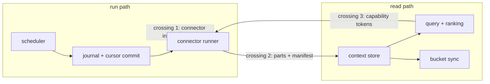
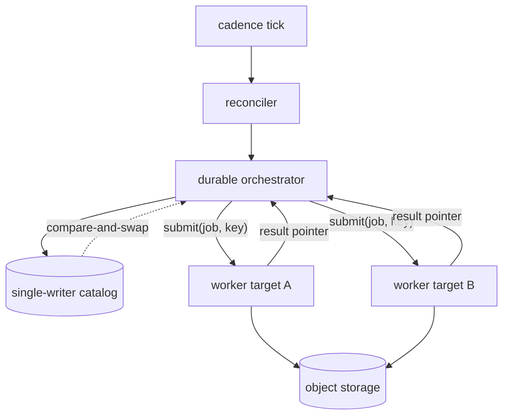
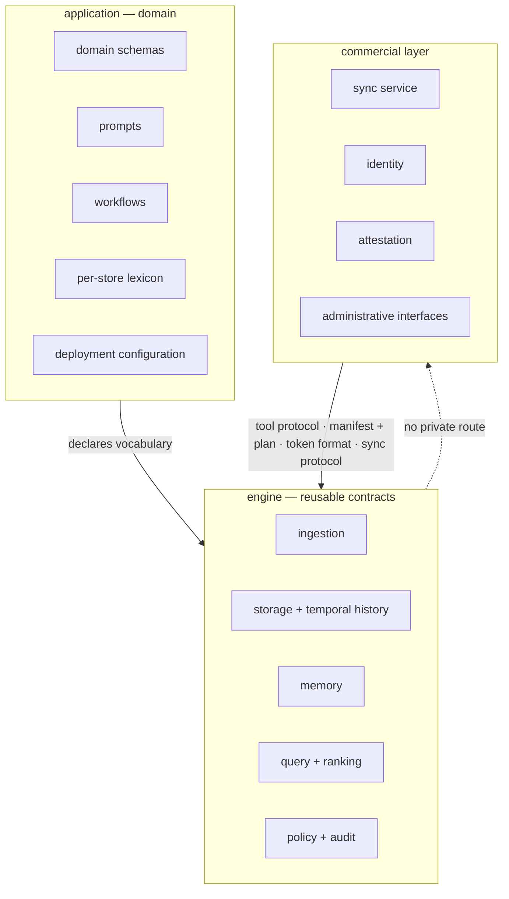

# System topology and boundaries

This file states who the parties are, how the engine is composed and packaged, where it
runs, and where it stops. Every other contract in the corpus constrains behavior inside
one of the halves this file names.

## Parties

| Party | Obligation |
| --- | --- |
| **The workspace** | Compiles both halves of the engine from one source tree, and emits every profile and every target from that tree. |
| **The read path** | Owns data at rest and retrieval, and defines the read side of each of the three crossings. |
| **The run path** | Owns execution, produces into the read path through a crossing, and stays absent from a build that serves reads alone. |
| **The enforcement stack** | Mediates every access to data completely, and interprets no content while doing it. |
| **The build profile** | Links the dependencies its role names and none beyond them, and holds its compressed and idle-resident budget. |
| **The deployment target** | Declares which role it hosts, states the shapes its primitives cannot express, and produces output a reference run reproduces byte for byte. |
| **The catalog** | Supplies linearizable compare-and-swap for the two single-writer operations, on every backend behind its port. |
| **The published hostname** | Carries a descriptor naming the gate it runs behind, and answers an anonymous request the way that descriptor declares. |
| **The application** | Supplies domain schemas, prompts, workflows and deployment configuration, and names its vocabulary in its own lexicon. |
| **The commercial layer** | Reaches the engine through the surfaces every client reaches it through, and adds capability rather than gating what is there. |

## Operations

| Operation | What it governs |
| --- | --- |
| `compose` | The two halves, the three crossings between them, the mediation obligation, and the five pillars the composition holds to. |
| `package` | The crate map, the domain crate and its ports, the three build profiles, their feature bundles, targets, artifacts and budgets. |
| `deploy` | Deployment roles, the self-hosted shapes, the reference target, and the parity that holds a manifest's output identical across targets. |
| `publish-hostname` | A descriptor per published hostname, its declared gate, and the anonymous probe the deploy judges it by. |
| `coordinate` | The one coordination property, the two single-writer operations that need it, and the catalog backends that supply it. |
| `bound-application` | Where the engine's contracts end and an application's vocabulary begins, and what the commercial layer reaches. |

## Clauses — compose

The engine is two internal halves of one tree. `compose` fixes what each half owns, the
narrow set of contracts between them, and the properties that hold across both.

| Clause | Statement | decided-by |
| --- | --- | --- |
| `topology.compose.invariant.workspace` | One Cargo workspace compiles both halves. Neither half is a shippable unit: no separate binary, no separate package scope, no separate release, and the vocabulary "read path" and "run path" names a boundary rather than a product. | |
| `topology.compose.shape.read-path` | The read path holds data at rest and its retrieval: the context store, the catalog, the query and ranking surface, memory queries, bucket sync, and the capability check a record passes before it lands. | |
| `topology.compose.shape.run-path` | The run path holds execution: the journal, the scheduler, cursor commit, awakeables, and every connector invoked as a journaled step. It owns no store and no ranking. | |
| `topology.compose.invariant.crossing` | Exactly three contracts cross between the halves: the connector interface world, the columnar-part-plus-manifest layout, and capability tokens. No fourth contract crosses, and no general internal call surface joins them. | |
| `topology.compose.interface.crossing` | Each crossing carries its own version and a conformance suite that both sides run. A member added to any of the three passes a security review before it is admitted. | |
| `topology.compose.refusal.crossing` | A call path that carries state between the halves outside the three named contracts raises `TopologyUndeclaredCrossing`, naming the two crate endpoints. A feature that appears to need a fourth crossing is a design question. | `0003` |
| `topology.compose.invariant.run-path` | A build linking no execution core, no scheduler and no component host serves reads of data a full daemon produced, honoring the identical part-and-manifest layout and the identical connector contract for native pulls. Droppability of the run path is what the narrow crossing set buys. | |
| `topology.compose.interface.cli-binary` | The system ships one command binary, `contextful`, and one package scope, `@contextful/*`. The pure domain crate is `contextful-core`, and the smallest deployable build is a profile rather than a crate. | |
| `topology.compose.invariant.enforcement-stack` | The enforcement stack is invoked on every access to data. Its name carries complete mediation as an obligation: a reachable path that returns a row without traversing it is a defect rather than a configuration choice. | |
| `topology.compose.refusal.mediation` | A code path that reads or releases a row without entering the enforcement stack raises `MediationBypass` at review and at the dependency audit. An operator switch that disables mediation does not exist. | `0004` |
| `topology.compose.invariant.semantic-layer` | Enforcement and semantics are separate layers. Enforcement records what happened and interprets no content; retrieval, memory synthesis, the analyst surface and inference placement understand content and reach enforcement through the three crossings alone. | |
| `topology.compose.invariant.pillar-one-tree` | Laptop through cluster runs from the same source tree as profile-gated binaries. A single-node or edge deployment carries no external queue, cache or coordination process, and a multi-node deployment adds one shared database rather than a second distributed system. | |
| `topology.compose.invariant.pillar-connector` | A connector is agent-authorable and sandboxed: an interface world plus the component model on a host that mediates every capability it holds. A native connector is a sibling authoring path for first-party stateful sources and satisfies the same schema, record and cursor contract. | |
| `topology.compose.invariant.pillar-store` | The store is inspectable with ordinary tooling: columnar table parts, a JSON manifest, and a rebuildable catalog file on plain object storage with a standard SQL face over them. No proprietary container and no opaque blob holds table data. | |
| `topology.compose.invariant.pillar-inference` | Model access leaves the process through one operator-configured endpoint capability speaking OpenAI-compatible HTTP. No model-vendor SDK links into any crate, and one step is provider-shaped: serializing a tool's parameter schema into that provider's envelope. | |
| `topology.compose.refusal.inference-egress` | A crate declaring a model-vendor SDK, or a second outbound path to a model, raises `VendorSdkLinked` in the dependency audit, naming the crate and the dependency. | `0005` |
| `topology.compose.invariant.pillar-local-first` | Pipelines run with no network beyond their sources, and bucket sync is opt-in per deployment. The engine makes no control-plane callback, performs no license check, and sends no telemetry to its authors. | |
| `topology.compose.refusal.script-runtime` | A JavaScript runtime linked into any profile raises `ScriptRuntimeLinked`. The authoring surface is a build-time compiler that emits a serialized, content-hashed plan, and nothing interprets a script language at run time. | `0006` |
| `topology.compose.shape.pillar` | Five pillars hold across both halves: one tree from laptop to cluster, sandboxed agent-authorable connectors, a store readable by ordinary tooling, provider-agnostic inference through one egress, and a deployment that runs local-first with sync as a choice. | |
| `topology.compose.invariant.enforcement-span` | The enforcement stack spans both halves rather than sitting in one: the host's capability allowlists and the journal on the run path, the statement guard, the visibility semi-join, row and column restriction, masking and the audit chain on the read path. A record passing from one half to the other passes enforcement on both sides of the crossing it uses. | |
| `topology.compose.shape.contract-inventory` | Twenty contracts partition the corpus, listed with their titles, their file lists and their glosses in `spec/terms/contract.toml`. A clause's first segment is one of those twenty entries. | |
| `topology.compose.invariant.memory-substrate` | Synthesized memory is not a parallel store. Its episode, fact, entity and preference tables are ordinary store tables under a stronger schema convention, and the synthesis pipeline above them is an ordinary run-path workflow on the same journal, cursor and retry machinery. | |
| `topology.compose.invariant.introspection` | Each half keeps its own spine of what happened — the run record on the write side, the request ledger on the read side — and no third surface merges them. An operator question spanning both halves is asked against both spines. | |

The order the enforcement stack applies its layers is `spec/41-enforcement.md` § Layer
composition; a semantic component reaching the stack through a crossing inherits that
order without restating it. The boundary that no removable value crosses is
`spec/30-run.md` § The journal, which decides what a replayed step can observe. The
connector interface world's exports and imports are `spec/32-connector.md` § The
interface world; the crossing named here is that world's version, not its call list. The
on-disk shape the second crossing names is `spec/10-store.md` § On-disk layout, which
also fixes what a replica reads. The token format and the delegation profile the third
crossing names are `spec/40-authority.md` § The delegation profile, which decides what a
verification at either end of the crossing accepts.

## Clauses — package

One workspace of thirteen crates, hexagonal, with a pure domain crate at the centre and
three build profiles selected over it.

| Clause | Statement | decided-by |
| --- | --- | --- |
| `topology.package.shape.crate-map` | Thirteen crates compose the workspace. `contextful-cli` is the binary and wires every adapter by dependency injection per profile; the remaining twelve hold domain, execution, data, and governance responsibilities. | |
| `topology.package.invariant.domain-crate` | `contextful-core` holds pure domain types and the port traits every adapter implements, and performs no I/O. It links into all three profiles. | |
| `topology.package.refusal.domain-crate` | `contextful-core` declaring an async runtime, a component host, an HTTP client, or a columnar-format implementation raises `DomainCrateImpurity`, naming the dependency and the feature that pulled it. | `0007` |
| `topology.package.shape.domain-type` | The domain crate defines `Schema`, `Field`, `DataType`, `Batch`, `Record`, `Cursor`, `CursorKind`, the pipeline specification with its JSON Schema derivation, and the typed error enum that crosses every port boundary and both halves. | |
| `topology.package.interface.port-set` | The ports are `Source`, `Destination`, `Transform`, `Catalog`, `Clock`, `LeaseStore`, `RateLimiter` with its local pacer and outbound gate, `EntityCatalog`, `RequestLedgerSink`, and the derive family `Deriver`, `Transcriber` and `LinkReader`. | |
| `topology.package.shape.port-set` | `Source` declares its cursor kind and reads a table at a position; `Destination` prepares a table schema, writes a batch under a run and commits; `Transform` prepares an output schema from an input schema and applies a batch; `Clock` supplies testable time. | |
| `topology.package.invariant.dependency-direction` | Every adapter crate depends on the domain crate and the domain crate depends on none of them. The build enforces the direction, so a port's implementation changes without the port moving. | |
| `topology.package.refusal.dependency-direction` | A dependency edge running from the domain crate toward an adapter crate raises `TopologyDependencyInversion`, naming both crates and the edge's manifest line. | `0007` |
| `topology.package.shape.execution-crate` | `contextful-engine` holds the durable-execution core — the driver trait, the native driver, journal, cursor commit, the awakeable registry and retry schedules. `contextful-runtime` drives connectors inside journaled steps and mediates host capabilities. `contextful-wasm` is the sandboxed component host. `contextful-connectors` holds the native sources. | |
| `topology.package.shape.data-crate` | `contextful-context` holds local-first storage: the catalog, table parts, the query face, atomic snapshot and sidecar commit, and retrieval. `contextful-memory` holds deterministic memory synthesis. `contextful-sync` holds bucket push and pull. `contextful-eval` holds the read-path quality harness and carries no retrieval logic of its own. | |
| `topology.package.shape.governance-crate` | `contextful-policy` holds the pure access-control core: the predicate representation, mask strategies, write-time redaction, inference-zone placement, the audit hash chain and the token trait. `contextful-agent` holds the tool server and the connector scaffolder. `contextful-control` holds the control plane. | |
| `topology.package.shape.profile` | Three profiles compile from the one workspace and are selected at build time by Cargo feature bundle: `contextful-edge`, `contextful-full`, `contextful-control`. Each links the dependencies its role names and nothing else. | |
| `topology.package.invariant.profile-selection` | A profile is fixed when the artifact is built. No run-time detection widens a running binary into another profile's feature set, so an unused heavy dependency links into nothing. | |
| `topology.package.invariant.artifact-content` | A release artifact carries the engine and the dependencies its bundle names. Build, release and automation tooling stays outside every profile and enters no artifact. | |
| `topology.package.invariant.edge-profile` | `contextful-edge` is the read replica. It pulls native connectors, syncs manifest and table parts from a bucket, and serves a read-only SQL replica. It links no scheduler, no script runtime and no component host, and its local catalog file is a materialized cache rather than a source of truth. | |
| `topology.package.invariant.edge-eligibility` | The edge profile is the one profile a function-class target hosts, and its budget pair is what makes that hosting possible. A deployment wanting execution on such a target reaches a worker target instead. | |
| `topology.package.invariant.full-profile` | `contextful-full` is the daemon: the native durable-execution core, the in-process scheduler, the component host, the SQL query face, the transform stages, the full-text sidecar, the vector sidecar and the tool server. It is the profile that runs pipelines and serves agent retrieval. | |
| `topology.package.invariant.control-profile` | `contextful-control` is the self-hosted control plane: team state, the edit-time collaborative configuration document, and identity. It materializes canonical TOML on apply, and it is the one profile linking the CRDT library. | |
| `topology.package.shape.feature-bundle` | Edge takes `duckdb-readonly`, `s3-sync` and `native-connectors`. Full takes `engine`, `scheduler`, `duckdb`, `polars`, `wasmtime`, `tantivy`, `hnsw`, `fastembed`, `mcp-server`, `native-connectors`, `s3-sync`, and `pg-catalog` for cluster availability. Control takes `team-plane`, `crdt-config`, `identity` and `oauth`. | |
| `topology.package.shape.dependency-lattice` | A heavy dependency links into the profiles its bundle names: the SQL engine read-only into edge and fully into full; the transform library, the component host, both sidecars, the embedding backend, the tool server, the execution core and the scheduler into full alone; native connectors and bucket sync into edge and full; the object-store port alone into control. | |
| `topology.package.limit.edge-budget` | `contextful-edge` holds to 50 MiB compressed and 60 MiB idle resident set. | |
| `topology.package.limit.full-budget` | `contextful-full` holds to 150 MiB compressed and 180 MiB idle resident set. | |
| `topology.package.limit.control-budget` | `contextful-control` holds to 60 MiB compressed and 80 MiB idle resident set. | |
| `topology.package.invariant.budget` | The three budget clauses above are the single statement of footprint for the tree. A profile's artifact and its steady-state residency are measured against its own pair and against no other figure. | |
| `topology.package.shape.build-target` | All three profiles cross-compile to `x86_64-unknown-linux-musl` and `aarch64-unknown-linux-musl`. Edge and full additionally build natively for `aarch64-apple-darwin`, `x86_64-apple-darwin` and `x86_64-pc-windows-msvc`. Edge additionally targets `wasm32-wasip2`. | |
| `topology.package.workflow.release-artifact` | Each profile ships its own artifact set: a release archive with a SHA-256 checksum and an SBOM, a package-manager formula whose bare name resolves to the full profile with the smaller profiles as separate formulae, an install script that detects the platform and defaults to full, and an independently tagged container image. | |
| `topology.package.limit.runtime-worker` | The full profile runs a multi-threaded async runtime capped at `min(cores, 8)` workers, below physical cores so query and transform work is not starved. The control profile runs 2 workers for an HTTP server and a bounded socket fanout. | |
| `topology.package.shape.runtime-flavor` | The edge profile runs a current-thread async runtime with default features off, carrying `rt`, `macros`, `io-util` and `time`, since one edge invocation is one read or one sync request. A component guest runs a poll loop and the host around it runs the multi-threaded runtime. | |
| `topology.package.invariant.component-host` | A component connector executes where a component host is linked: the full profile, and a container or delegated worker shape built from it. The edge profile runs native connectors. | |
| `topology.package.refusal.component-host` | A dispatch of a component connector on a profile that links no host raises `ComponentHostMissing`, naming the connector and the profile, rather than falling back to a native source of a similar name. | `0008` |
| `topology.package.invariant.crdt-confinement` | The CRDT library links into `contextful-control` and no other profile, enforced by the dependency audit. Configuration has one owner, and a daemon or a replica reads materialized text rather than a replicated document. | |
| `topology.package.refusal.crdt-confinement` | The CRDT library appearing in the resolved dependency graph of the edge or full profile raises `ProfileDependencyLeak`, naming the profile and the path that pulled it. | `0009` |

Apply, versioning and the materialization step that produces the text a daemon reads are
`spec/50-control-plane.md` § Configuration apply; a profile linking no CRDT library reads
that output and nothing else. The gate step that builds each profile, compresses it and
asserts the pair of numbers above is `spec/61-engineering.md` § Footprint; a budget change
lands here and the gate reads it from here.

## Clauses — deploy

One binary and one declaration reach every provider. A target differs in which primitives
back which role, and the parity gate holds the outputs identical.

| Clause | Statement | decided-by |
| --- | --- | --- |
| `topology.deploy.invariant.deployment-declaration` | The same engine binary and the same `contextful.toml` deploy to every provider. A provider-specific artifact carries configuration and no second copy of the engine's behavior. | |
| `topology.deploy.shape.target-profile` | A target's profile records which primitives back the control loop, which back the read path, and which back heavy compute, derived from the primitives that provider exposes. | |
| `topology.deploy.refusal.target-shape` | A target whose primitives cannot express a shape records the absence in its profile. A profile claiming a shape the target does not provide raises `TargetShapeUnsupported`, naming the shape and the primitive it lacks. | `0010` |
| `topology.deploy.invariant.role` | Deployment splits into two roles and any provider hosts either. A run's control lands on a control-plane target's primitives and its compute lands on a worker target, and the two are separable across providers. | |
| `topology.deploy.shape.control-plane-target` | A control-plane target runs the cadence tick, the reconciler, the durable orchestrator and the single-writer catalog. | |
| `topology.deploy.shape.worker-target` | A worker target accepts a job, runs it to completion, and reports its result back to the control-plane target that dispatched it. | |
| `topology.deploy.workflow.reference-target` | One process is the reference target: an in-process scheduler fires each due pipeline, a crash resumes from the catalog's journal, and a single process is a trivially correct single-writer catalog. State lives under `./.contextful/`, and pointing the sync configuration at an S3-compatible bucket makes that process's output readable from a replica. | |
| `topology.deploy.shape.self-hosted-shape` | Three self-hosted shapes run from the one binary: a stateless command process that exits per invocation with no listener; a long-running daemon with an in-process scheduler, HTTP and tool-protocol faces, a component connector pool and reload on `SIGHUP`; and a multi-node cluster of daemons sharing one catalog. | |
| `topology.deploy.invariant.self-hosted-shape` | Adding capacity to the cluster shape is copying the binary and starting it. A new node registers against the shared catalog and needs no membership protocol of its own. | |
| `topology.deploy.interface.control-plane-daemon` | The control plane ships as a daemon speaking the identical HTTP, socket and sync wire protocol as its managed form, so a client distinguishes them by endpoint alone. It carries an in-process tick, an embedded catalog file holding the canonical document, an embedded checkpointed queue for run durability, and an S3-compatible bucket or a local filesystem for snapshots. | |
| `topology.deploy.invariant.target-adapter` | Each provider integration is an adapter crate behind the domain ports. Substrate-agnostic logic names no provider, so adding a target adds a crate rather than a branch inside the engine. | |
| `topology.deploy.limit.wall-clock-cap` | A target whose per-invocation wall clock caps at 15 min hosts neither a first-time backfill nor a component connector, and its profile records both exclusions. | |
| `topology.deploy.invariant.parity-gate` | One declaration runs on every control-plane target with a managed mapping and produces byte-identical table parts, with the single-process reference as the expected output and each target diffed against it inside that target's own object store. | |
| `topology.deploy.limit.parity-soak` | The parity comparison runs after a 24 h soak on each target, so a difference that appears with accumulated state is inside the comparison rather than outside it. | |
| `topology.deploy.refusal.parity-gate` | A byte difference against the reference output raises `ParityDivergence`, naming the target, the table and the first differing part. A parity-shaped feature that runs on one target is held until it runs on the others or is expressed through a portable abstraction. | `0010` |
| `topology.deploy.interface.telemetry-sink` | Traces and logs default to line-delimited JSON on stderr, with stdout reserved for the data channel — query tables and protocol framing. An OTLP collector receives them over HTTP with protobuf when an endpoint is configured, so a default build pulls no gRPC dependency. The environment surface is the endpoint, collector headers as `k=v` pairs, a service name and resource attributes; filtering applies to both sinks; and the process flushes and shuts its exporters down on every return. | |

The split between an isolate that terminates a request and a container that executes the
query is `spec/50-control-plane.md` § Read-path topology; a serverless target's profile
records which of its primitives backs each side of that split.

## Clauses — publish-hostname

Every hostname this tree publishes carries a descriptor declaring what an anonymous
visitor gets, and the deploy asks the hostname the same question.

| Clause | Statement | decided-by |
| --- | --- | --- |
| `topology.publish-hostname.shape.descriptor` | A published hostname carries a descriptor naming its worker, its hostname, the contract version it was written against, and a required gate valued `access`, `adminToken`, or `public` with `acknowledged: true`. | |
| `topology.publish-hostname.invariant.gate` | A worker's own configuration records none of the three gate values, so a surface left open on purpose and a surface open with nothing attached in front of it read alike in it. The descriptor is what turns a deliberately open surface into a reviewable artifact. | |
| `topology.publish-hostname.workflow.descriptor-emission` | The deploy emits a hostname's provider configuration from its descriptor, so the hostname, its route and its gate leave one artifact together. A hostname with no descriptor is published by no path. | |
| `topology.publish-hostname.workflow.posture-probe` | The deploy asks each declared hostname what an anonymous `GET /` returns and judges the answer against that descriptor's gate. `access` accepts a `302` whose location carries the owning team's login prefix, compared literally so another tenant's login fails. `adminToken` accepts any non-`5xx` response carrying no login in its location. `public` accepts a `200` carrying no login. | |
| `topology.publish-hostname.refusal.posture-probe` | A `200`, `401`, `403` or `5xx` under `access`, and an unreachable hostname under any gate, raise `HostnamePostureMismatch` carrying the hostname, the declared gate and the observed response. An application attached in front of a `public` hostname reds the deploy rather than quietly closing that surface. | `0011` |
| `topology.publish-hostname.invariant.probe-table` | The deploy's probe table and the descriptor set name the same hostname-and-gate pairs, and a type-level test asserts that equality before the deploy runs. The probe table is derived from the descriptors rather than maintained beside them. | |
| `topology.publish-hostname.refusal.probe-table` | A hostname probed under a gate no descriptor names, a declared hostname left unprobed, and a probed hostname no descriptor declares each raise `ProbeTableDrift`, naming the hostname and the side it is missing from. | `0011` |
| `topology.publish-hostname.invariant.wildcard-application` | A wildcard application over a deployment's domain protects no hostname on its own. It carries a reusable bypass policy for hostnames that authenticate their callers with capability tokens, and a reusable bypass policy wins over an application's own allow policy whatever precedence numbers the two carry. A hostname is protected by an application bound to it, or by nothing. | |
| `topology.publish-hostname.refusal.descriptor-field` | A descriptor decodes with excess properties rejected, and an unmodelled key raises `DescriptorUnknownField` naming the key and the contract version. A field silently dropped from the emitted configuration publishes what it was meant to withhold — the flag marking a store loopback-only is the concrete stake. | `0011` |
| `topology.publish-hostname.invariant.reserved-key` | The escape hatch for a configuration key the descriptor does not model is checked against a fixed reserved set rather than against the keys a descriptor happened to emit, so it attaches no custom domain past the refusals. | |

## Clauses — coordinate

Coordination is a property of the catalog behind one port. The tree carries no second
distributed system to operate.

| Clause | Statement | decided-by |
| --- | --- | --- |
| `topology.coordinate.invariant.coordination-primitive` | Coordination needs one property: linearizable compare-and-swap behind the catalog port. Every topology supplies that property, and no component reaches for a stronger one. | |
| `topology.coordinate.shape.single-writer-operation` | Two operations need the primitive and no others: a shard lease keyed by source partition, and a cursor compare-and-swap for an opaque-token or snapshot-id position. | |
| `topology.coordinate.shape.cas-statement` | A cursor compare-and-swap is one conditional update predicated on the stored version, read back through its affected-row count. A shard lease is one row carrying an owner, an expiry instant and a fencing token, taken by the same conditional update. | |
| `topology.coordinate.invariant.shard-lease` | One holder advances a given source partition at a time. A second acquirer takes that partition after the expiry instant the lease row carries, and the fencing token the row advances distinguishes the new holder's writes from a stalled predecessor's. | |
| `topology.coordinate.invariant.cas-statement` | Both operations run at low request rates and hold no interactive transaction open, so a backend supplying a single conditional statement supplies the whole primitive. | |
| `topology.coordinate.interface.catalog-port` | Every backend is reached through the `Catalog` port, and the code above that port names no backend. Swapping a deployment's backend is a wiring change at the binary's injection point. | |
| `topology.coordinate.shape.catalog-backend` | Single-node self-hosting uses a local catalog file owned by one process. A self-hosted cluster points at Postgres behind the `pg-catalog` feature on the full profile. A managed edge deployment uses the platform's per-object SQLite primitive, and a managed cloud deployment uses a managed Postgres. | |
| `topology.coordinate.invariant.cluster-availability` | Availability in the cluster shape is the shared database's availability. The engine adds no replication of its own over it and no failover protocol between daemons. | |
| `topology.coordinate.invariant.consensus-system` | The tree ships no consensus implementation and bundles no external coordination service. A single node owns its catalog directly, and a multi-node deployment points every node at one shared single-writer catalog. | |
| `topology.coordinate.refusal.catalog-backend` | A catalog backend whose conditional update is not linearizable raises `CatalogCasUnsupported` at open, naming the backend. Coordination narrows to a weaker mode by refusal rather than by degradation. | `0012` |
| `topology.coordinate.invariant.air-gap` | Single-node and edge deployments reach no process outside themselves for coordination, so both run fully air-gapped with their sources reachable and nothing else. | |

## Clauses — bound-application

The engine owns contracts. An application owns its domain. The commercial layer owns
neither, and reaches the engine the way every other client does.

| Clause | Statement | decided-by |
| --- | --- | --- |
| `topology.bound-application.invariant.engine-scope` | The engine owns reusable ingestion, storage, memory, query and policy contracts, with temporal history, provenance and governed access built into them. | |
| `topology.bound-application.invariant.application-scope` | An application owns domain schemas, prompts, workflows, rating policies, column bindings, entity aliases and deployment configuration. A context store is the data and the memory served under one store's configuration and access policy. | |
| `topology.bound-application.interface.lexicon` | An application names its own vocabulary in a per-store lexicon rather than in engine code, and the engine's defaults supply structural conventions with no domain meaning attached. A category the lexicon leaves undeclared renders neutral. | |
| `topology.bound-application.refusal.application-scope` | An application's role name, rating schema or category meaning entering engine code raises `ApplicationVocabularyInEngine`, naming the identifier and the crate. A later application inherits no assumption it did not choose. | `0013` |
| `topology.bound-application.invariant.reference-surface` | The reference console and the reference operator surface configure no application store. The store registry arrives as runtime configuration, so a surface build carries no domain deployment inside it. | |
| `topology.bound-application.invariant.console-scope` | The analyst console is one shared interface over engine capabilities plus the metadata an application supplies. Per-application forks of it do not exist: its components, its redactor and its render contract have one owner. | |
| `topology.bound-application.invariant.prediction-shape` | The engine keeps predictions, observations and outcome labels as generic shapes whose evidence and resolution contracts carry evaluation across applications. It prescribes no domain rating schema, no domain judgment, and no tool that registers a prediction during an ordinary question. | |
| `topology.bound-application.invariant.operator-graph` | The operator view derives its pipeline graph from the pipelines a deployment actually configures. An application supplies explicit nodes and pipeline annotations as an overlay, and no application graph is built in. | |
| `topology.bound-application.workflow.shared-abstraction` | A behavior becomes a shared engine abstraction when more than one application requires the same behavior under the same invariants. Until the second consumer exists, the behavior stays with the application that has it. | |
| `topology.bound-application.refusal.shared-abstraction` | An abstraction proposed on similar names or matching output shapes alone raises `PrematureAbstraction`, naming the single consumer it generalizes from. Shape agreement does not establish a shared domain concept. | `0013` |
| `topology.bound-application.invariant.public-surface` | The commercial layer reaches the engine through the surfaces every client reaches it through: the tool protocol, the manifest and plan format, the capability-token format, and the sync protocol. Anything it does, an operator scripts against the bare engine. | |
| `topology.bound-application.refusal.public-surface` | A private route, an undocumented header or a privileged build reserved for the commercial layer raises `PrivateBackChannel`, naming the surface. A capability the commercial layer needs is built as a public engine surface first. | `0014` |
| `topology.bound-application.invariant.litmus` | Behavior that runs with the agent, offline, on a single node, with no signup belongs to the engine. Behavior about people working together, organization identity, who sees what across a team, the editing interface, or anything metered belongs to the commercial layer. | |
| `topology.bound-application.refusal.paid-feature` | A paid feature is net-new — a sync service, identity, attestation, an administrative interface. Gating an existing data-plane capability behind a license check raises `PaywalledDataPlane`, naming the capability. | `0014` |
| `topology.bound-application.invariant.self-service` | A team runs every data-plane capability itself against its own bucket, with no account and no remote check, and loses nothing the engine states in this corpus. | |
| `topology.bound-application.invariant.substrate` | The engine supplies the substrate — erasure, residency-aware placement, the audit chain, redaction, the visibility mirror — and is not itself a certification about any of them, nor an attestation that a deployment operates them correctly. | |

## Shapes

The workspace, one crate per directory:

```
contextful/
  crates/
    contextful-core/         pure domain types and ports, no I/O
    contextful-engine/       driver trait, native driver, journal, cursor, awakeables
    contextful-runtime/      connector drive inside journaled steps, host mediation
    contextful-wasm/         sandboxed component host
    contextful-connectors/   native sources
    contextful-context/      catalog, table parts, query face, snapshot commit, retrieval
    contextful-memory/       deterministic memory synthesis
    contextful-policy/       predicates, masks, redaction, zones, audit chain, token trait
    contextful-sync/         bucket push and pull
    contextful-agent/        tool server and connector scaffolder
    contextful-eval/         read-path quality harness
    contextful-control/      control plane; the one CRDT consumer
    contextful-cli/          the `contextful` binary; dependency injection per profile
  contextful.toml            the deployment declaration, identical across providers
```

The three crossings and the halves they join:



A build profile, as feature bundle over the one workspace:

```toml
[features]
edge    = ["duckdb-readonly", "s3-sync", "native-connectors"]
full    = ["engine", "scheduler", "duckdb", "polars", "wasmtime",
           "tantivy", "hnsw", "fastembed", "mcp-server",
           "native-connectors", "s3-sync"]
cluster = ["full", "pg-catalog"]
control = ["team-plane", "crdt-config", "identity", "oauth"]
```

A published-hostname descriptor:

```jsonc
{
  "contract": 1,
  "worker": "contextful-console",
  "hostname": "console.example.org",
  "gate": { "_tag": "access", "team": "example" }
}
```

```jsonc
{
  "contract": 1,
  "worker": "contextful-docs",
  "hostname": "docs.example.org",
  "gate": { "_tag": "public", "acknowledged": true }
}
```

Deployment roles across two targets:



The catalog backend behind one port, per topology:

```
single-node self-host    local catalog file, one owning process, air-gappable
self-hosted cluster      Postgres via `pg-catalog` on the full profile
managed edge platform    per-object SQLite primitive
managed cloud            managed Postgres
```

The reference target's state directory:

```
./.contextful/
  meta.sqlite            catalog: journal, cursors, run state, leases
  blobs/                 offloaded journal payloads, addressed by content hash
  store/                 table parts, manifests and sidecars
  runs/                  per-run working output before a snapshot commits
```

The two single-writer operations, as the catalog port sees them:

```sql
-- cursor compare-and-swap: one conditional update, read back by affected rows
UPDATE cursors SET position = ?, version = version + 1
 WHERE stream = ? AND version = ?;

-- shard lease: the same conditional update over an owner, an expiry and a fence
UPDATE leases SET owner = ?, expires_at = ?, fence = fence + 1
 WHERE partition = ? AND (owner IS NULL OR expires_at < ?);
```

Where the engine's contracts end:



## Unsettled

unsettled: Does the columnar interchange crate stay whole in the edge profile or ship slimmed? owner: topology affects: topology.package

unsettled: Is a self-contained clustered catalog worth implementing behind the compare-and-swap port, for an operator who wants clustered availability without Postgres? owner: topology affects: topology.coordinate

unsettled: Which role hosts heavy compute on a provider that exposes neither a container primitive nor a long-running function? owner: topology affects: topology.deploy

unsettled: Where does the boundary sit between a surface adapter and a restated contract, where a case has neither a generated artifact nor a callable route? owner: topology affects: topology.bound-application
