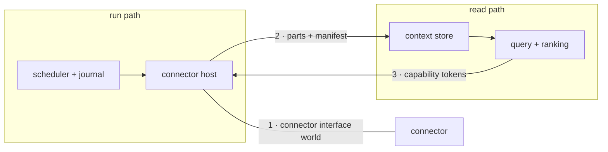

# System topology

The engine is two halves of one workspace — the read path and the run path — joined by
three crossings and compiled into three build profiles. This contract fixes the halves,
the crossings, the profiles, where a build is deployed, how a published hostname declares
its posture, the single-writer operations and the catalog that serializes them, and where
the engine ends and an application begins.

## compose

| Clause | Statement | Why |
| --- | --- | --- |
| `topology.compose.workspace` | One Cargo workspace compiles both halves. Neither half ships as its own binary, package scope or release; "read path" and "run path" name a boundary, not a product. | — |
| `topology.compose.read-path` | The read path holds data at rest and its retrieval: the context store, the catalog, query and ranking, memory queries, bucket sync, and the capability check a record passes before it lands. | — |
| `topology.compose.run-path` | The run path holds execution: the journal, the scheduler, cursor commit, awakeables, and every connector invoked as a journaled step. It owns no store and no ranking. | — |
| `topology.compose.three-crossings` | Exactly three contracts cross between the halves: the connector interface world, the columnar-part-plus-manifest layout, and the capability-token format. No general internal call surface joins the halves. | A-topology |
| `topology.compose.crossing-version` | Each crossing carries its own version and a conformance suite both sides run. A member added to a crossing passes a security review before admission. | — |
| `topology.compose.undeclared-crossing` | A run-path crate reaches a read-path crate only through a crate carrying one of the three crossings; {{assurance.gate.crate-graph}} checks every edge. | A-topology |
| `topology.compose.run-path-droppable` | A build linking no execution core, scheduler or component host serves reads of data a full daemon produced, over the identical part-and-manifest layout and connector contract. | — |
| `topology.compose.cli-binary` | The system ships one command binary, `contextful`, and one package scope, `@contextful/*`. The smallest deployable build is a profile, not a crate. | — |
| `topology.compose.mediation` | Every function returning or releasing a stored row takes the enforcement stack's admission value as a parameter ({{assurance.gate.row-token}}), so a row path that skips enforcement does not type-check. No operator switch disables mediation. | A-connector |
| `topology.compose.enforcement-span` | The enforcement stack spans both halves: capability allowlists and the journal on the run path; the statement guard, visibility semi-join, row and column restriction, masking and the audit chain on the read path. | — |
| `topology.compose.semantic-layer` | Enforcement interprets no content. Retrieval, memory synthesis, the analyst surface and inference placement interpret content and reach enforcement through the three crossings alone. | — |
| `topology.compose.one-tree` | Laptop through cluster runs from one source tree. A single-node or edge deployment runs no external queue, cache or coordination process; a multi-node deployment adds one shared database. | — |
| `topology.compose.connector-pillar` | A connector is an interface world run in a sandboxed component host that mediates every capability. A native connector, the first-party path for stateful sources, satisfies the same schema, record and cursor contract. | — |
| `topology.compose.open-store` | Table data sits in columnar parts with a JSON manifest and a rebuildable catalog on plain object storage, readable by standard SQL tooling. No proprietary container or opaque blob holds table data. | — |
| `topology.compose.inference-egress` | Model access leaves the process through one operator-configured endpoint speaking OpenAI-compatible HTTP. The one provider-shaped step serializes a tool's parameter schema into the provider's envelope. | A-topology |
| `topology.compose.vendor-sdk` | The dependency audit raises `VendorSdkLinked`, naming the crate and the dependency, for a crate declaring a model-vendor SDK or a second outbound path to a model. | A-topology |
| `topology.compose.local-first` | Pipelines need no network beyond their sources, and bucket sync is opt-in per deployment. The engine makes no control-plane callback, no license check, and sends no telemetry to its authors. | — |
| `topology.compose.script-runtime` | A JavaScript runtime linked into any profile raises `ScriptRuntimeLinked`. The authoring surface is a build-time compiler emitting a serialized, content-hashed plan. | A-run |
| `topology.compose.memory-substrate` | Synthesized memory's episode, fact, entity and preference tables are ordinary store tables, and its synthesis pipeline is an ordinary run-path workflow on the same journal, cursor and retry machinery. | — |
| `topology.compose.two-spines` | The run record answers what happened on the write side and the request ledger on the read side. No third surface merges them. | — |



## package

| Clause | Statement | Why |
| --- | --- | --- |
| `topology.package.crate-map` | Thirteen crates compose the workspace. `contextful-cli` is the binary and wires every adapter per profile by dependency injection. | — |
| `topology.package.domain-crate` | `contextful-core` holds the pure domain types and the port traits every adapter implements, performs no I/O, and links into every profile. | A-topology |
| `topology.package.domain-impurity` | `contextful-core` declaring an async runtime, a component host, an HTTP client or a columnar-format implementation raises `DomainCrateImpurity`, naming the dependency and the feature that pulled it. | A-topology |
| `topology.package.dependency-direction` | A dependency edge from `contextful-core` toward an adapter crate raises `TopologyDependencyInversion`, naming both crates and the manifest line. | A-topology |
| `topology.package.profile` | Three profiles compile from the workspace, each a Cargo feature bundle selected at build time: `contextful-edge`, `contextful-full`, `contextful-control`. Each links the dependencies its role names and nothing else. | A-topology |
| `topology.package.fixed-at-build` | No run-time detection widens a running binary into another profile's feature set. Build, release and automation tooling links into no profile. | A-topology |
| `topology.package.edge-profile` | `contextful-edge` is the read replica: it pulls native connectors, syncs parts and manifests from a bucket, and serves a read-only SQL replica. It links no scheduler, script runtime or component host. | — |
| `topology.package.edge-eligibility` | The edge profile is the one profile a function-class target hosts. Execution on such a deployment runs on a worker target. | — |
| `topology.package.full-profile` | `contextful-full` is the daemon: the durable-execution core, the in-process scheduler, the component host, the SQL query face, transforms, the full-text and vector sidecars, the tool server, and `pg-catalog`. | — |
| `topology.package.control-profile` | `contextful-control` is the self-hosted control plane: team state, the edit-time configuration document and identity. It materializes canonical TOML on apply and is the one profile linking the CRDT library. | A-topology |
| `topology.package.component-host` | A component connector runs where a component host is linked: the full profile and the container or worker shapes built from it. The edge profile runs native connectors. | A-topology |
| `topology.package.host-missing` | Dispatching a component connector on a profile with no component host raises `ComponentHostMissing`, naming the connector and the profile, with no fallback to a similarly named native source. | A-topology |
| `topology.package.crdt-leak` | The CRDT library in the resolved dependency graph of the edge or full profile raises `ProfileDependencyLeak`, naming the profile and the path that pulled it. A daemon or replica reads materialized text. | A-topology |

unsettled: Does the columnar interchange crate stay whole in the edge profile or ship slimmed? owner: topology affects: topology.package

## deploy

| Clause | Statement | Why |
| --- | --- | --- |
| `topology.deploy.one-declaration` | The same engine binary and the same `contextful.toml` deploy to every provider. A provider-specific artifact carries configuration only. | A-topology |
| `topology.deploy.target-profile` | A target profile records which provider primitives back the control loop, the read path and heavy compute, and records each shape the provider cannot express. | A-topology |
| `topology.deploy.unsupported-shape` | A target profile claiming a shape its provider does not provide raises `TargetShapeUnsupported`, naming the shape and the missing primitive. | A-topology |
| `topology.deploy.two-roles` | A control-plane target runs the cadence tick, the reconciler, the durable orchestrator and the single-writer catalog. A worker target accepts a job, runs it to completion and reports to its dispatcher. Either role runs on any provider. | — |
| `topology.deploy.reference-target` | One process is the reference target: an in-process scheduler fires each due pipeline, a crash resumes from the catalog's journal, and state lives under `./.contextful/`. | — |
| `topology.deploy.self-hosted-shapes` | The binary runs as a stateless command exiting per invocation; a daemon with scheduler, HTTP and tool-protocol faces, a component pool and reload on `SIGHUP`; or a cluster of daemons sharing one catalog. | — |
| `topology.deploy.add-a-node` | A cluster node joins by starting the binary against the shared catalog. No membership protocol exists. | — |
| `topology.deploy.control-plane-daemon` | The self-hosted control plane speaks the same HTTP, socket and sync protocol as its managed form, with an in-process tick, an embedded catalog, an embedded checkpointed queue, and a bucket or local directory for snapshots. | — |
| `topology.deploy.target-adapter` | Each provider integration is an adapter crate behind the domain ports. Code outside those crates names no provider. | A-topology |
| `topology.deploy.wall-clock-cap` | A target capping per-invocation wall clock at 15 min hosts neither a first-time backfill nor a component connector, and its target profile records both exclusions. | — |
| `topology.deploy.parity` | One declaration run on every control-plane target produces byte-identical table parts, compared against the reference target inside each target's object store after a 24 h soak. | A-topology |
| `topology.deploy.parity-divergence` | A byte difference from the reference output raises `ParityDivergence`, naming the target, the table and the first differing part. | A-topology |

unsettled: Which role hosts heavy compute on a provider exposing neither a container primitive nor a long-running function? owner: topology affects: topology.deploy

## publish-hostname

| Clause | Statement | Why |
| --- | --- | --- |
| `topology.publish-hostname.descriptor` | Each published hostname carries a descriptor naming its worker, hostname, contract version and a gate: `access`, `adminToken`, or `public` with `acknowledged: true`. | A-topology |
| `topology.publish-hostname.emitted-from-descriptor` | The deploy emits a hostname's provider configuration, route and gate from its descriptor. A hostname without a descriptor is not published. | A-topology |
| `topology.publish-hostname.posture-probe` | The deploy sends each hostname an anonymous `GET /`. `access` passes on a `302` to the owning team's login prefix, compared literally; `adminToken` on any non-`5xx` without a login; `public` on a `200` without a login. | A-topology |
| `topology.publish-hostname.posture-mismatch` | A probe answer outside its descriptor's gate, or an unreachable hostname, raises `HostnamePostureMismatch` with the hostname, the declared gate and the observed response, and fails the deploy. | A-topology |
| `topology.publish-hostname.probe-table` | A probe table entry absent from the descriptor set, or a descriptor with no probe entry, raises `ProbeTableDrift` before the deploy runs, naming the hostname and the side missing it. | A-topology |
| `topology.publish-hostname.wildcard-gates-nothing` | A wildcard access application over a domain protects no hostname. Its bypass policy for token-authenticated hostnames wins over any allow policy regardless of precedence. Only an application bound to a hostname protects it. | — |
| `topology.publish-hostname.unknown-field` | A descriptor decodes with excess properties refused; an unmodelled key raises `DescriptorUnknownField`, naming the key and the contract version. | P1 |
| `topology.publish-hostname.reserved-key` | The escape hatch for an unmodelled provider key is checked against a fixed reserved set, and admits no custom domain. | P1 |
| `topology.publish-hostname.two-hops` | A published store answers through a routing hop that verifies the presented credential, routes and caches but runs no query, and a warm retrieval container that runs the query with enforcement inside it. | — |
| `topology.publish-hostname.verify-both-hops` | The routing hop forwards the presented credential unchanged, and the engine re-verifies the same bytes before enforcing grants. The deployment holds no authentication secret. | — |
| `topology.publish-hostname.hop-adds-no-authority` | The routing hop translates no credential and issues nothing of its own. | — |
| `topology.publish-hostname.unconfigured-gateway` | A routing hop with no store configuration answers `503` on every route and raises `GatewayUnconfigured`. | P3 |
| `topology.publish-hostname.issuer-key` | The engine's HTTP face refuses to start without a verification key that resolves and parses, raising `IssuerKeyUnusable` and naming the input; no generated key substitutes. | P3 |
| `topology.publish-hostname.warming` | While a store warms, a data route answers `503` with `Retry-After` and the health route reports `warming`. Warming resolves to ready without intervention; the unconfigured state never does. | — |
| `topology.publish-hostname.hot-set-local` | The retrieval container keeps the current snapshot set on local disk and maps it in place. Object storage is the durable source, not the per-query read path. | — |
| `topology.publish-hostname.container-readiness` | A retrieval container reaches readiness within 8 s of a cold start, before its snapshot-set hydration completes. | — |
| `topology.publish-hostname.keep-warm` | The reconciler keeps a retrieval container warm for each deployment with active traffic. A deployment declining keep-warm takes a cold first query. | — |

unsettled: Does the routing hop hold a short result cache of its own, keyed on the whole enforcement subject? owner: topology affects: topology.publish-hostname

## coordinate

| Clause | Statement | Why |
| --- | --- | --- |
| `topology.coordinate.primitive` | Coordination rests on one property: a linearizable conditional write. No component depends on a stronger one, and the tree ships no consensus implementation or external coordination service. | A-store |
| `topology.coordinate.inventory` | The single-writer operations are the lease row, the cursor compare-and-swap, {{store.fold.pointer-commit}}, {{store.lease.acquire}}, {{store.lease.commit-log}}, {{store.merge.cas-commit}} and {{surface.apply.claims-a-version}}. No other operation needs a single writer. | A-store |
| `topology.coordinate.lease-row` | A lease row is keyed by a pipeline, a source partition, a table's compaction or a deployment's cadence, and carries a holder, an expiry instant and a fence taken by one conditional update. | A-store |
| `topology.coordinate.catalog-clock` | The catalog evaluates a lease row's expiry against its own clock, never a caller-supplied instant. | A-store |
| `topology.coordinate.fence-advances` | Each acquisition of a lease row increments its fence, and release follows {{store.lease.release}}, so the fence never repeats for a key. | A-store |
| `topology.coordinate.fenced-commit` | A commit under a lease is a conditional write predicated on the holder's fence; a predicate matching nothing is {{store.lease.stale-fence}}. | A-store |
| `topology.coordinate.cursor-cas` | A cursor compare-and-swap is one conditional update predicated on the stored version, read back by its affected-row count. | A-store |
| `topology.coordinate.cadence-lease-ttl` | A cadence lease is granted for 90 s. | A-store |
| `topology.coordinate.cadence-lease-renewal` | The reconciler renews a cadence lease every 30 s while its applied document schedules a dispatchable unit. | A-store |
| `topology.coordinate.cadence-fallback` | A deployment's fallback cron fires only after taking the cadence lease itself, so one fire holds the current fence. | A-store |
| `topology.coordinate.catalog-port` | Every catalog backend is reached through the `Catalog` port, and code above the port names no backend. Swapping a backend is a wiring change in `contextful-cli`. | A-store |
| `topology.coordinate.backends` | Single-node self-hosting uses a local catalog file owned by one process; a self-hosted cluster uses Postgres via `pg-catalog`; a managed edge deployment uses per-object SQLite; a managed cloud deployment uses managed Postgres. | A-store |
| `topology.coordinate.weak-backend` | A catalog backend whose conditional update is not linearizable refuses at open with {{surface.apply.weak-conditional-backend}}. | A-store |
| `topology.coordinate.cluster-availability` | Cluster availability is the shared database's availability. The engine adds no replication and no failover protocol between daemons. | — |
| `topology.coordinate.air-gap` | Single-node and edge deployments reach no process outside themselves for coordination, and run air-gapped with only their sources reachable. | — |

unsettled: Is a self-contained clustered catalog worth building behind the `Catalog` port for an operator wanting clustered availability without Postgres? owner: topology affects: topology.coordinate

## bound-application

| Clause | Statement | Why |
| --- | --- | --- |
| `topology.bound-application.engine-scope` | The engine owns reusable ingestion, storage, memory, query and policy contracts, with temporal history, provenance and governed access built in. | A-topology |
| `topology.bound-application.application-scope` | An application owns domain schemas, prompts, workflows, rating policies, column bindings, entity aliases and deployment configuration. Engine code carries no application role name, rating schema or category meaning. | A-topology |
| `topology.bound-application.lexicon` | An application names its vocabulary in a per-store lexicon. Engine defaults carry structural conventions with no domain meaning, and a category the lexicon leaves undeclared renders neutral. | A-topology |
| `topology.bound-application.reference-surface` | The reference console and operator surface configure no application store; the store registry arrives as runtime configuration. The console has one implementation, with no per-application fork. | A-topology |
| `topology.bound-application.prediction-shape` | The engine keeps predictions, observations and outcome labels as generic shapes. It prescribes no domain rating schema and no tool that registers a prediction during an ordinary question. | A-topology |
| `topology.bound-application.operator-graph` | The operator view derives its pipeline graph from the pipelines a deployment configures. An application adds nodes and annotations as an overlay. | A-topology |
| `topology.bound-application.second-consumer` | A behavior becomes an engine abstraction when a second application requires it under the same invariants. Name or output-shape agreement alone does not qualify. | A-topology |
| `topology.bound-application.public-surface` | The commercial layer reaches the engine only through the tool protocol, the manifest and plan format, the capability-token format and the sync protocol. | A-topology |

unsettled: Where does the boundary sit between a surface adapter and a restated contract when a case has neither a generated artifact nor a callable route? owner: topology affects: topology.bound-application

## Shapes

The workspace:

```
crates/
  contextful-core/         pure domain types and ports, no I/O
  contextful-engine/       driver trait, native driver, journal, cursor, awakeables
  contextful-runtime/      connector drive inside journaled steps, host mediation
  contextful-wasm/         sandboxed component host
  contextful-connectors/   native sources
  contextful-context/      catalog, table parts, query face, snapshot commit, retrieval
  contextful-memory/       deterministic memory synthesis
  contextful-policy/       predicates, masks, redaction, zones, audit chain, token trait
  contextful-sync/         bucket push and pull
  contextful-agent/        tool server and connector scaffolder
  contextful-eval/         read-path quality harness
  contextful-control/      control plane; the one CRDT consumer
  contextful-cli/          the `contextful` binary; dependency injection per profile
contextful.toml            the deployment declaration, identical across providers
```

The three profiles as feature bundles:

```toml
[features]
edge    = ["duckdb-readonly", "s3-sync", "native-connectors"]
full    = ["engine", "scheduler", "duckdb", "polars", "wasmtime", "tantivy", "hnsw",
           "fastembed", "mcp-server", "native-connectors", "s3-sync", "pg-catalog"]
control = ["team-plane", "crdt-config", "identity", "oauth"]
```

A published-hostname descriptor:

```jsonc
{ "contract": 1, "worker": "contextful-docs", "hostname": "docs.example.org",
  "gate": { "_tag": "public", "acknowledged": true } }
```

A lease row and a fenced cursor commit, as the `Catalog` port issues them:

```sql
-- acquire: the catalog's clock decides expiry; the fence only grows
UPDATE leases SET holder = :me, expires_at = now() + :ttl, fence = fence + 1
 WHERE key = :key AND (holder IS NULL OR expires_at < now());

-- commit: one conditional update, predicated on version and on the holder's fence
UPDATE cursors SET position = :pos, version = version + 1
 WHERE stream = :stream AND version = :v
   AND EXISTS (SELECT 1 FROM leases WHERE key = :key AND fence = :fence);
```
