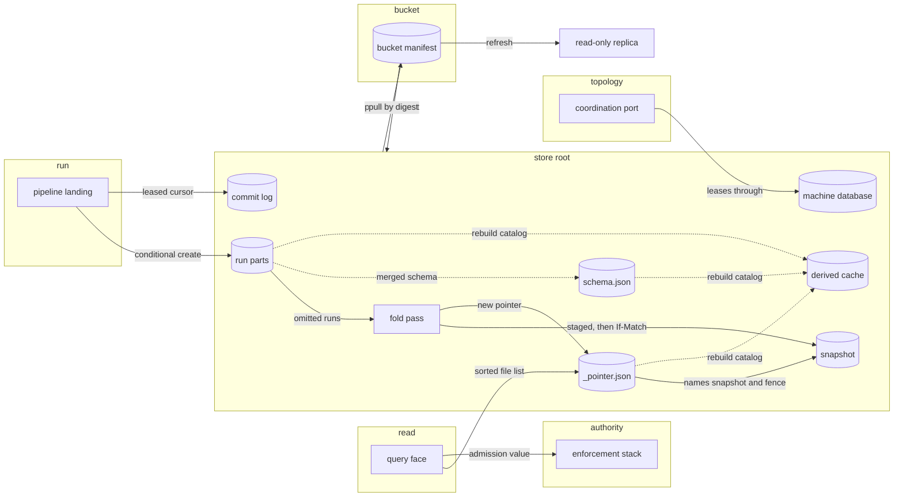
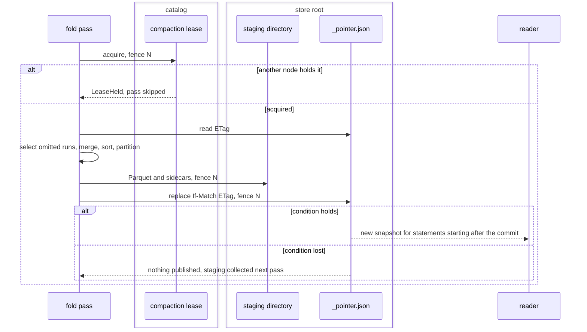
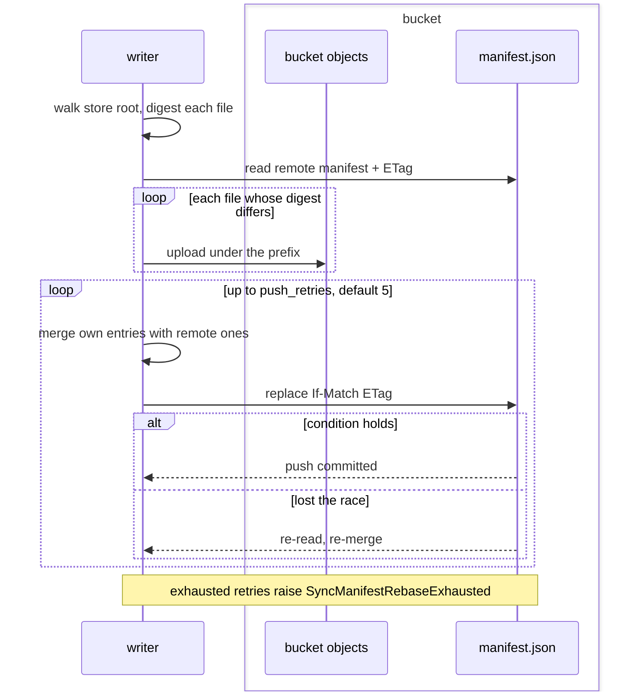
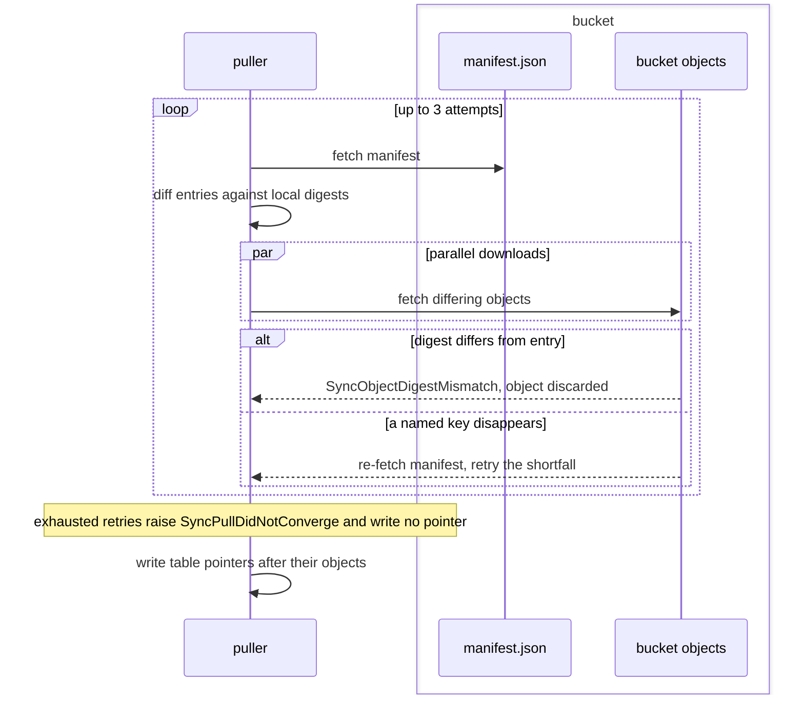
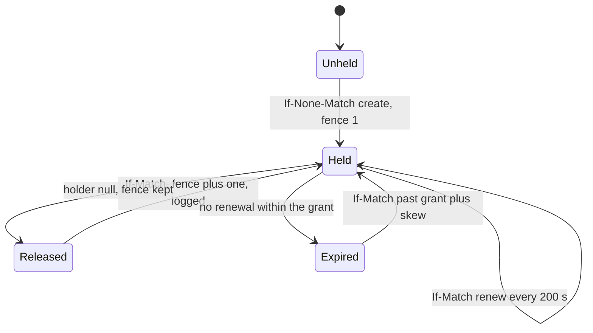

# The store and its sync

The store is the canonical corpus: Parquet a reader opens without the engine, JSON
manifests indexing it, one pointer object per table naming the current snapshot, and two
local SQLite catalogs. An S3-compatible bucket mirrors the tree key for key. Every other
contract reaches rows through the shapes this file fixes.

The store's canonical objects, its two catalogs, the bucket mirror, and the contracts
writing into it and reading from it.



## lay-out

The directory tree, run and snapshot manifests, the table pointer, the two catalogs, and node identity.

- `components` — A store holds Parquet table data, JSON run and snapshot manifests, one pointer object per table, landed blobs, and two SQLite catalogs, `derived.sqlite` and `machine.sqlite`. Parquet, manifests and pointers are canonical.
  *because a catalog that is both a rebuildable cache and a commit point resurrects half-published snapshots on rebuild*
- `store-root` — A project's store sits at `.contextful/context/<project>/`, holding both catalogs, `config.toml`, `cursors/` and one `tables/<t>/` directory per table.
- `table-directory` — A table directory holds `schema.json`, `_pointer.json`, `data/snapshots/<id>/`, `data/runs/<run-id>/<node-id>/` and `requests/`.
- `snapshot-id` — A snapshot id is `snapshot-` followed by a nanosecond value zero-padded to 20 chars, equal to the greater of the commit instant and the previous id plus one.
  *because a wall clock that steps backwards breaks lexical order equalling commit order*
- `part-name` — A data file is `part-<ordinal>.parquet`, the ordinal zero-padded to five digits and unique within its directory.
- `staging` — A fold in flight writes under `data/snapshots/<id>.staging/`, and no file list resolves inside it.
- `run-manifest` — A run commits by conditionally creating `_manifest.json` in its node directory, holding a `lay_out::RunManifest` whose `node_id` equals the enclosing segment.
- `run-replay` — A landing of an unlogged run already committed on its node, with the position its manifest holds and rows rebuilding its parts column for column, writes nothing and answers the committed manifest as a replay.
  *because a retry after a lost acknowledgement cannot tell whether its first landing committed*
- `run-conflict` — Any other landing of a run id already committed on its node raises `StoreRunConflict` and changes nothing.
  *because a logged run's readability rides a commit-log entry a replay cannot vouch for, and other rows under one id are another run*
- `uncommitted-run` — A node directory holding no `_manifest.json` is in flight and its parts join no file list; a leased pipeline's run also waits for its commit-log entry.
  *P4*
- `cursor-in-commit` — A pipeline's committed position is the cursor inside its newest commit: the newest commit-log entry for a leased pipeline, the highest run-manifest cursor otherwise. `machine.sqlite` caches it.
  *because a position committed apart from its rows re-lands the batch after a crash between the two writes*
- `snapshot-manifest` — A snapshot's `_manifest.json` holds a `lay_out::SnapshotManifest`, and each entry of `parts` and `indexes` carries its `key_version`.
- `ancestors` — A snapshot's `_manifest.json` carries `ancestors`: its parent, then the parent's `ancestors`, at most 256 entries; a root carries none, and a parent without `ancestors` leaves the field absent.
  *because retention collects superseded snapshot directories, and a push decides a pointer's descent from the snapshot's own manifest*
- `unrecognised-index-entry` — An `indexes` entry whose kind or fields this build does not read parses as unrecognised: the manifest stays readable, the entry answers no probe, and a rewrite keeps it byte for byte.
  *because a sidecar a newer builder records must neither refuse the table's reads nor vanish when an older build rewrites the manifest*
- `table-pointer` — `tables/<t>/_pointer.json` names the table's current snapshot and the fence that published it. A snapshot is readable only when the pointer or a chain of `parent` links from it reaches it.
  *A-store*
- `manifest-default` — A field added to a manifest carries a default value.
- `manifest-unreadable` — A run manifest or a reachable snapshot manifest that fails to parse raises `StoreManifestUnreadable`, naming the table and the file, and the table answers no read until it parses.
  *P4*
- `schema-file` — A table's schema is `schema.json` in Arrow JSON form; each arriving batch's schema merges into it and the merged result replaces it.
- `immutable-files` — A run file is written once and never edited, a snapshot directory is immutable, and a fold writes a new snapshot.
- `landed-blob` — A body a source lands by reference is the file `blobs/<sha256>` under the store root, named by the SHA-256 of its bytes and written whole through a rename before the run naming it commits.
  *because a row names the bytes it came from, and a committed row naming no stored body answers for content nobody can retrieve*
- `derived-catalog` — `derived.sqlite` is a cache: `contextful context rebuild-catalog` reconstructs it from the pointers, the manifests they reach, every committed run manifest and every `schema.json`. It is never synced and commits nothing.
  *A-store*
- `machine-catalog` — `machine.sqlite` holds one machine's journal, cursor cache and lease rows. It is never synced, never rebuilt and never replaced by a pull.
  *A-store*
- `catalog-ports` — The store reaches `machine.sqlite` through {{topology.coordinate.catalog-port}} and `derived.sqlite` through the `DerivedCatalog` port, both traits in `contextful-core`; `contextful-sqlite` implements both, and a host implements either over its own connection.
  *A-store*
- `unknown-table` — A table name no `schema.json` in the tree declares raises `StoreUnknownTable`, never an empty result.
  *P1*
- `node-segment` — The `<node-id>` run-path segment and the node id in a ledger filename keep two machines writing one logical run id in disjoint files.
- `node-id-order` — A process resolves its node id once: `CONTEXTFUL_NODE_ID`, then `[node] id`, then {{store.lay-out.node-id-project}}.
- `node-id-project` — A project's default node id is `node-<8 hex>` of SHA-256 over the host id and the absolute store root, so two checkouts of one project on one host write as distinct nodes.
  *because a pull treats every key under its own node id as already held, skipping another checkout's run parts of the same project*
- `node-id-state-path` — The host id, a random `node-<8 hex>` generated once, persists under `$CONTEXTFUL_STATE_DIR`, else `$XDG_STATE_HOME/contextful`, else the platform user-state directory, outside the store root.
  *because a copied store carrying its identity makes two machines one holder*
- `node-id-shape` — A node id longer than 64 chars or outside `^[A-Za-z0-9._-]+$` raises `StoreNodeIdInvalid` at process start, before any path, key or lease carries it.
  *P3*
- `node-id-shared` — A `[node]` block in a manifest, and so in every control-plane snapshot, raises `StoreNodeIdShared` ahead of {{run.model.top-level-block}}, naming the file and the store root's `config.toml` as the node id's home.
  *because a control-plane snapshot applies to every machine reconciling it, making one id many holders*
- `node-id-local` — A machine with no writable state directory takes the reserved node id `local`.

unsettled: Does a store re-bind the node id it last derived, so runs landed before its root moved, or under the bare host id an earlier build used, push without `CONTEXTFUL_NODE_ID`? owner: store affects: store.lay-out

unsettled: How does a consumer discover the format version of a run or snapshot manifest, and what does it do with a version newer than it parses? owner: store affects: store.lay-out

## init

A project's declaration file: what `contextful init` writes, what a repeated init does, and how a command given no `--project` finds its project from the working directory.

- `declaration-file` — `contextful init <name>` writes `contextful.toml` in the working directory declaring `[project]` with `name = "<name>"`, and creates the store root {{store.lay-out.store-root}} beside it.
- `store-identity` — An initialized store holds one synced, canonical version-4 UUID in `store-id`; repeated init and clones keep it, while a recreated root receives a new UUID.
  *A-store*
- `identity-invalid` — A malformed `store-id`, or an owner mint naming no initialized store root, raises `StoreIdentityInvalid`.
  *because an ambiguous or absent UUID cannot bind an owner credential*
- `name-shape` — A project name that is not `/`-separated segments of `[A-Za-z0-9._-]`, or that holds a `.` or `..` segment, raises `StoreProjectNameInvalid` before any file is read or written.
  *because the name is interpolated into every project path, and a traversing segment places a store outside its project*
- `repeat` — An init against a `contextful.toml` already declaring the same `[project] name` rewrites nothing but a posture {{store.init.posture}} and a missing {{store.init.store-identity}}, preserves existing store content, and succeeds.
  *because a repeated init converges on the state the first one wrote, so scripts and onboarding run it unconditionally*
- `adopt` — An init against a `contextful.toml` declaring no `project` key appends the `[project]` table and keeps every existing byte of the file.
- `posture` — `contextful init <name> --authoring-posture <posture>` prepends a top-level `authoring_posture = "<posture>"` {{authority.issue.posture-key}} to a `contextful.toml` declaring none, keeping every other byte; a declared posture stands, and an init without the flag writes none.
  *because the posture decides whether a write without a credential lands, so no default chooses it for the operator*
- `name-conflict` — An init against a `contextful.toml` whose `project` key declares another name, or no string `name`, raises `StoreProjectConflict`, naming the declared name when one exists and the init's name, and writes nothing.
  *because renaming a project orphans its store root, which an overwrite hides*
- `discovery` — A command given no `--project` reads the nearest `contextful.toml` in the working directory or an ancestor, takes its `[project] name` as the project, and bases every project path on that file's directory.
- `explicit-project` — A command given `--project` bases every project path on the working directory and runs no discovery.
- `project-paths` — The project paths are the store root, the run state `.contextful/run/<project>/` and the memory pass state `.contextful/memory/<project>/`.
- `default-declaration` — A command given no `--declaration` reads the discovered `contextful.toml`, or `contextful.toml` in the working directory under `--project`.
- `declaration-base` — Under a located project, a relative path its declaration names — a derive binding's `media_root`, a path-form `command[0]` — resolves against the directory its project paths are based on, never the working directory.
  *because one pipeline otherwise reads different media or programs depending on the subdirectory it fires from*
- `undiscovered` — A command given no `--project` whose working directory and ancestors hold no `contextful.toml`, or whose nearest one declares no `[project] name`, raises `StoreProjectUndiscovered`, naming the starting directory.
  *because a store opened at a guessed root splits one project's rows across two trees*

#### Scenarios

- `store.init.repeat`: WHEN `contextful init research` runs twice in one directory, THEN the second run succeeds and `contextful.toml` holds the bytes the first wrote.
- `store.init.name-conflict`: WHEN `contextful init archive` runs beside a `contextful.toml` naming `research`, THEN it raises `StoreProjectConflict` and the file is unchanged.
- `store.init.declaration-base`: WHEN `contextful pipeline run` fires in `notes/` below a `contextful.toml` binding `media_root = "media"`, THEN media resolves under `media/` beside that file, not `notes/media/`.
- `store.init.posture`: WHEN `contextful init research` runs without `--authoring-posture`, THEN a following `contextful context land` raises `AuthoringPostureUndeclared`, and after `contextful init research --authoring-posture per_request` the same land commits.
- `store.init.discovery`: WHEN `contextful context land` runs in `notes/` below a directory where `contextful init research --authoring-posture per_request` ran, THEN the run commits under that directory's `.contextful/context/research/`.

## declare

A table's declaration block: its key, ordering column and write mode, and what a read returns for a withdrawn row.

- `table-block` — A table block declares any of `primary_key`, `order_by`, `write_mode`, `replicate`, `subject_id`, `class`, `policy`, `visibility`, `valid_time`, `cluster_by`, `partition_by`, `retain_runs`, `retain_rows`, `columns`, `indexes`, `agent_description`, `agent_hint`, `example_queries`, `content_hash_column`, `result_cache` and `private`; an unset key is absent from the canonical serialization.
- `erasure-metadata` — An erasure declaration names `erasure_key`, incoming `referenced_by` table/column edges, and `on_erase = "survive"` for retained citing rows; absent fields remain absent in canonical serialization.
  *A-disclosure*
- `retain-rows` — `retain_rows = { column = "<name>", age = "<n>d" }` accepts `_ingested_at` or a declared Timestamp column; another column or null value raises `StoreRetentionColumnInvalid` before landing, and malformed age refuses the declaration.
  *because a sender's clock cannot control the injected arrival time, and a nullable retention clock leaves a row with no expiry*
- `column-types` — `columns` maps a column to a type spelled as {{store.reconcile.typed-landing}} reads it; every landing into the table, a pipeline run included, lands that column in the declared type.
  *because a JSON value alone cannot say it carries bytes or a vector*
- `two-genres` — A table holds items, landed by connectors, or artifacts, synthesized and tagged by an open kind string the engine does not enumerate. Both append, dedupe on content and carry a timestamp.
- `unkeyed-union` — A table declaring no `primary_key` reads as the byte-identical union of its visible committed runs, selected under {{store.declare.replace-frontier}} when replacing.
- `dedup-view` — A table declaring `primary_key` reads through `ROW_NUMBER() OVER (PARTITION BY <pk> ORDER BY <order_by> DESC, _ingested_at DESC, _run_id DESC, _row_seq DESC) = 1` over its current snapshot, if any, unioned with the committed runs that snapshot omits.
  *because a keyed table read as a union before its first fold inflates every aggregate silently*
- `order-by-default` — `order_by` names the column picking the surviving row per key, and defaults to `_ingested_at`.
- `order-by-unknown` — An `order_by` naming a column neither declared nor injected raises `StoreOrderByUnknownColumn` at validation, before the first batch.
  *because an ordering column absent from every file reads as null and picks survivors arbitrarily*
- `key-unknown` — A `primary_key` naming a column neither declared nor injected raises `StoreKeyUnknownColumn` at validation, before the first batch.
  *because a key column absent from every file partitions every row into one group and collapses the table to a single row*
- `nested-key` — A struct, list or map column named by `primary_key`, `order_by`, `cluster_by`, `partition_by` or `valid_time` raises `StoreNestedKeyColumn` at validation, before any Parquet.
  *A-store*
- `write-mode` — `write_mode` is `append`, the default, keeping the last write per key and retiring no key, or `replace`.
- `replace-frontier` — Under `replace`, a read covers the newest run carrying the source's complete state plus every run committed after it.
- `replace-retains` — A replacing run leaves the runs it displaced on disk until `retain_runs` passes, writes no erasure receipt and walks no lineage.
- `empty-run` — A run landing zero rows commits a manifest with no parts; without {{store.declare.empty-replacement}} it replaces nothing. A table with no rows registers as a zero-row relation over its declared and injected columns.
- `empty-replacement` — A complete zero-row `replace` run marks its manifest as a replacement frontier; current reads cover no earlier files, while bounded reads before its commit retain earlier rows within retention.
  *A-store*
- `empty-frontier-preserved` — Sync push, sync pull and fold preserve an empty replacement frontier without writing a data row.
  *A-store*
- `fold-job` — An enabled compaction job covering a table is a `[[job]]` block of kind `fold` carrying a `schedule`, whose `enabled` is absent or true and whose `target` is absent or names the table's destination name.
  *A-store*
- `fold-coverage` — `pipeline validate` warns on stderr, naming the table, where a table declares `primary_key` and no job meeting {{store.declare.fold-job}} covers it; the warning alone fails nothing.
  *A-store*
- `declaration-set` — A project's table blocks are the declaration's and those of every `pipelines/*.toml` and `pipelines/*.json` beside it — a `[pipeline]` table's as named, each specification's under {{run.declare.table-name}}. The read face and every `sync` verb read this set.
  *because a key or `replicate` declared only where `pipeline run` reads it leaves reads, pulls and folds treating the table as unkeyed and replicated*
- `read-side-keys` — A declaration key changes what a read returns and rewrites no committed part; a key added after rows land applies from the next read.
- `view-definition` — `view` holds one `SELECT` naming store tables and other views, admitted by {{read.guard.single-read-only-statement}} at validation; the engine builds it into staging and publishes it as a model through {{run.publish.staging}}.
  *A-store*
- `view-policy` — A `view` reading a table that carries a row policy or column masks declares its own `policy`; one declaring none raises `ViewPolicyUndeclared` at validation.
  *A-store*

unsettled: What retires a key a source stops serving under `append`, given the source-side deletion is invisible in the tree? owner: store affects: store.declare

unsettled: Does a view build fire on input commits since the last build, on an interval, or on either, and what refuses a cycle among views (issue 94)? owner: store affects: store.declare

## reserve

The column and table namespaces the engine holds, the provenance columns it injects, and the request ledger.

- `underscore-namespace` — Column names beginning `_` belong to the engine; the injected set and the reserved optional set are its whole content.
- `injected` — The engine injects `_ingested_at` as a non-null Parquet `TIMESTAMP(UTC, NANOS)`, `_run_id`, `_batch_seq` as int32 where a batch scope exists, `_site_id`, and `_authored_by` where an authenticated subject authorized the write, replacing any producer value.
  *because a string instant does not sort by time once fractions or offsets appear*
- `row-seq` — The engine injects `_row_seq`, a non-null int64 numbering a run's rows from 0 in batch order, replacing any producer value.
  *because a run's rows share `_ingested_at` and `_run_id`, and keeping the last write per key needs an order among them*
- `commit-seq` — The engine injects `_commit_seq`, a non-null int64 its commit assigns above every value the table holds; a run committing after a read carries a value above every row that read returned, whatever its `_ingested_at`.
  *A-topology*
- `commit-order` — Commits of one table serialize from assigning `_commit_seq`, through the part write, to the step that makes the run readable, so the readable runs of a table always hold a prefix of its commit sequence.
  *A-topology*
- `commit-seq-seed` — A commit assigns one above the greatest of the node's counter, every run manifest's `commit_seq` and the current snapshot's, so a store restored by a pull, or holding no counter, never reissues a value.
  *A-topology*
- `no-placeholder` — A path with no batch scope or no authenticated subject omits that column instead of writing nulls.
- `taint` — The engine injects `_taint`, a label under {{connector.infer.provenance-order}}, on each row a model's output lands as, replacing any producer value; a row no model produced omits it.
  *because a label a producer sets is one injected text can forge*
- `optional` — A producer sets any of `_modality`, `_lang`, `_provenance` and `_prompt_hash`, and each surfaces in the provenance envelope where present.
- `modality` — `_modality` takes one of text, image, audio, structured or mixed; another value fails validation of its batch.
- `lang-and-provenance` — `_lang` carries a BCP-47 tag; `_provenance` carries the evidence rows the row derives from, addressed by the identity the source table keys on.
- `prompt-hash` — `_prompt_hash` is `sha256:<hex>` over the prompt template, not the rendered prompt.
- `column-name` — A producer column inside the `_` namespace and outside the optional set raises `StoreReservedColumnName` at reconciliation, before any Parquet.
  *P1*
- `table-namespaces` — The engine reserves two table namespaces: `_runs`, the durable run record, and `_visibility`, under which {{disclosure.mirror.grants-table}} lands each source's mirrored access tables.
- `table-name` — A pipeline declaring a table inside a reserved namespace raises `StoreReservedTableName` when its manifest is assembled, naming the reservation.
  *P1*
- `ledger-suffix` — A table name ending in `__requests` is reserved to request-ledger relations and refuses as {{store.reserve.table-name}}.
- `ledger-path` — A run's request ledger is `requests/<run-id>.<node-id>.parquet`, disjoint per run and per writing node.
- `ledger-append` — Appends to one run's ledger file serialize under a lock on it, and an append returns once its rows and the rename are synced to disk.
- `ledger-fold` — Each fold pass merges a table's committed ledger files into `requests/folded-<snapshot-id>.parquet`, and a replica carries ledgers with their table.
  *because one ledger file per run per node per table grows listing and diff cost without bound*
- `ledger-retention` — A ledger row is collected 365 d after its run committed.

unsettled: Does a replica merging another node's runs renumber `_commit_seq`, or does an export cursor hold one position per writing node? owner: store affects: store.reserve

unsettled: Does a fold backfill `_commit_seq` onto parts landed without the column, and in which order among their runs? owner: store affects: store.reserve

## reconcile

Schema evolution across a table's file set: the type lattice, additive columns, and what a scan may invent.

- `explicit-file-list` — Every read hands `read_parquet` an explicit sorted file list resolved from the pointer and the manifests, never a glob; a stray file joins nothing.
- `union-by-name` — Every read passes `union_by_name=true`; a column resolves to the common supertype of the files carrying it, and the generated relation casts no column but a vector, per {{store.reconcile.half-width}}.
- `lattice` — The type lattice holds one promotion, `Int64` with `Float64` to `Float64`; a JSON type absorbs `Utf8`.
  *A-store*
- `incompatible` — Any other pair of types observed for one column raises `StoreSchemaIncompatible` at the write, naming the column, the stored type and the arriving type.
  *A-store*
- `float-loss` — An `Int64` value above 9007199254740992 loses precision once a `Float64` batch lands on its column.
- `binary-and-vector` — The lattice holds `Binary`, `FixedSizeBinary(n)` and a `FixedSizeList` of `Float32` or `Float16` at dimension n; none takes a promotion, so a width, item or dimension change meets {{store.reconcile.incompatible}}.
  *A-store*
- `typed-landing` — A producer declares these types; a JSON batch carries bytes as padded base64 and a vector as a number array of its dimension, and any other value meets {{store.reconcile.incompatible}}.
  *A-store*
- `nested-lattice` — A struct gains fields additively, a file without a field reading it as null; list items and map values reconcile by {{store.reconcile.lattice}}; a kind change, scalar against nested or list against map, meets {{store.reconcile.incompatible}} naming the column path.
  *A-store*
- `variant` — A declared `variant` column stores each string, Int64, Float64, boolean or padded-base64 bytes value in one Struct with `kind` and a matching field; scalar or tagged input lands losslessly, and conflicting non-null fields meet {{store.reconcile.incompatible}}.
  *A-store*
- `nested-landing` — A producer or declaration types a column `struct<…>`, `list<…>` or `map<utf8, …>`; a JSON batch carries a struct and a map as an object and a list as an array, a struct key naming no field meeting {{store.reconcile.incompatible}}.
  *A-store*
- `stored-type` — A column `schema.json` holds as a binary, vector or nested type lands a later undeclared JSON value in that type, so a run after the first needs no declaration.
  *A-store*
- `half-width` — A `Float16` vector stores each element at half width in Parquet. The engine reads its elements as `FLOAT`, either binary type as `BLOB`, and a vector as an `ARRAY` of its dimension through one relation cast.
  *A-store*
- `key-widening` — A primary-key column takes no `Float64` promotion: the widening batch raises `StoreKeyWidened` before any Parquet, as does a fold meeting a key already reconciled to `Float64`.
  *A-store*
- `additive` — An unseen column joins the merged schema, and files written before it read it as null.
- `no-invented-column` — A scan invents no column: an ordering column absent from every file enters through a zero-row branch, and a column added after a table's first rows projects as a literal null.
- `first-sight` — A destination creates a table on the first schema it sees and merges each later schema into `schema.json`.
- `fold-never-narrows` — A fold backfills nulls and widens types, a struct's fields included; it narrows no type and drops no column or field.
- `no-history` — Reconciliation keeps the current shape alone; a past widening is attributed from the run files.
- `reserved-set-versioned` — Adding an injected column advances the semantics version, whose fingerprint recipe names the column.

unsettled: What dimension caps a fixed-size vector column, given the engine bounds an `ARRAY` width? owner: store affects: store.reconcile

unsettled: Do the linked DuckDB and parquet releases read and write Parquet `VARIANT`, so the variant column's Struct encoding gives way to it (issue 90)? owner: store affects: store.reconcile

## fold

Compaction: pass order, triggers, retention, the compaction lease, and the pointer commit that makes a snapshot readable.

- `pass` — A pass selects the committed runs the current snapshot omits, dedupes by key or unions, reconciles the schema, sorts by `cluster_by`, partitions, writes Parquet and every declared sidecar into staging, then commits by {{store.fold.pointer-commit}}.
- `valid-time-line` — A keyed table declaring `valid_time` partitions on the key together with the valid-time line and keeps one row per line.
- `includes-runs` — A snapshot's `includes_runs` names each run it folded as `<run-id>/<node-id>`, the run's own directory; a run committed afterwards reads on top of it.
- `triggers` — A pass fires at 50 runs committed on a table, 6 h after the table's previous pass, or on `contextful context compact <table>`.
- `retention` — `retain_runs` defaults to 7 d; a folded run, a superseded snapshot and its sidecars are collected once older than the window.
- `row-retention` — A fold removes expired rows from its snapshot and sidecars after keyed winner selection and derived supersession; unkeyed partitions whose footer maximum precedes the cutoff skip row reads, and idle passes publish on expiry under {{store.declare.retain-rows}}.
  *because a time partition follows the sender's clock while the retention clock follows arrival*
- `row-retention-report` — A pass reports the row-age cutoff, expired row count, dropped partition count and directories collected per table; `collect` returns the removed directory paths.
  *because an operator needs evidence of both logical expiry and physical collection*
- `result` — A pass reports each table as folded, nothing-landed or failed, and a nothing-landed table does not stop the pass.
- `collection-failed` — A collection that fails reports its failure: beside `folded` when the pass published, since the snapshot stays published, and as `failed` otherwise; either way the command exits non-zero.
- `unknown-table` — A pass naming a table no `schema.json` declares halts the command with {{store.lay-out.unknown-table}}.
  *P1*
- `compaction-lease` — A pass holds the table's compaction lease and stamps its fence into the snapshot manifest and the pointer.
  *A-store*
- `pointer-commit` — A pass publishes by replacing `_pointer.json` conditioned on the ETag it read at pass start, with `If-Match` on an object store and a version-checked rename on a filesystem.
  *A-store*
- `partial-snapshot` — A reader observes a snapshot and every declared sidecar together or neither; a commit exposing one without the other raises `StorePartialSnapshot`.
  *P4*
- `lost-pointer` — A pass whose pointer replace loses its condition publishes nothing, and its staged snapshot is collected.
- `staging-collected` — A staging directory, and a snapshot directory no pointer chain reaches, are collected by the next pass and read by nobody.
- `non-blocking` — A statement running during a pass reads the snapshot the pointer named when it started; statements starting after the commit read the new one.
- `supersedes` — A new snapshot supersedes the previous one without deleting it, and a bounded read reaches the older one until retention collects it.

A fold pass under the compaction lease, from run selection to the pointer commit.



## index

Sidecar index kinds and identity, clustering, partitioning and the tenant partition.

- `kinds` — Five index kinds exist: Parquet footer zone maps, a sorted-Parquet sparse-map primary-key lookup, an HNSW vector graph, a positional full-text index, and opt-in per-column bloom filters.
- `declaration` — A sidecar is declared per table under `indexes` with a kind, a `column`, an `id_column` and builder parameters; the `vector` kind takes `model`, `dim`, the `cosine` metric, `m` and `ef_construction`, the `fulltext` kind a `tokenizer`.
- `id-column` — A sidecar's `id_column` defaults to a single-column primary key on a table declaring no `valid_time`, and every sidecar of a table shares it, so keyed, composite-key and unkeyed tables each take one.
  *A-store*
- `id-column-unresolved` — A declaration naming no `id_column` on a table without a single-column primary key or declaring `valid_time`, one naming a valid-time table's single key, or two sidecars naming different ones, raises `StoreIndexIdColumnUnresolved` at manifest validation.
  *A-store*
- `id-unique` — A fold meeting one `id_column` value on two rows of the snapshot it stages raises `StoreIndexIdNotUnique`, naming the table, the column and the value, and publishes nothing.
  *A-store*
- `paths` — A vector sidecar sits at `indexes/vec-<col>-<model>/zone=<label>/` and a full-text sidecar at `indexes/fts-<col>-<tokenizer>/`, inside the snapshot directory it indexes.
- `path-collision` — Two sidecar declarations of one table resolving to one path under {{store.index.paths}} raise `StoreIndexPathCollision`, naming both, at manifest validation and before the fold builds either.
  *because a second build overwrites the first sidecar's files, and the manifest then records an entry no reader opens*
- `identity` — A sidecar's identity is `(column, builder, builder-version)`; two builders over one column coexist, the caller picks at query time, and `derived.sqlite` records each builder.
- `rebuild` — Swapping a builder rebuilds the sidecar, leaves the Parquet untouched, and callers on the existing identity read through the cutover.
- `not-in-file-set` — `indexes/` joins no table's file set; a snapshot reader lists only the parts its manifest names.
- `dies-with-snapshot` — Collecting a snapshot collects its sidecars in the same step.
- `candidate-ids` — A sidecar yields candidate `id_column` values, not rows; they re-join through the enforced relation on that column before a top-K is final.
  *P5*
- `vector-by-fold` — The fold builds each declared vector sidecar over the staged rows holding a non-null identifier and a non-zero vector, from the declared model where the table carries `embedding_model`, and records its entry in the snapshot manifest.
  *A-store*
- `graph` — A vector sidecar is an HNSW graph over unit-length `Float32` vectors whose layers draw from a seed of the snapshot id and column, so one staged row set builds one byte-identical graph.
  *because a rebuilt sidecar then differs from its predecessor only where the rows do, and a recall figure replays from its snapshot*
- `fulltext-by-fold` — The fold builds each declared full-text sidecar over the staged rows whose identifier is non-null and whose text yields a term, and records its entry in the snapshot manifest.
  *A-store*
- `postings` — A full-text sidecar is one file holding a sorted term dictionary and, per term, the rows and positions it occurs at, which a reader binary-searches in mapped or decrypted bytes.
  *because one layout then serves a mapped plaintext file and a decrypted sealed one, and a probe reads only its own terms' postings*
- `tokenizer` — A `tokenizer` is `unicode`, the default, indexing each lowercased alphanumeric run as one term, or `cjk`, which indexes each Han, Kana or Hangul stretch of a run as overlapping character bigrams.
  *because an unspaced script puts no boundary inside a sentence, so a word within one is never a whole term*
- `column-absent` — An index over a column, or naming an `id_column`, the reconciled schema lacks raises `StoreIndexColumnAbsent` at the fold, before the pass that builds it stages anything.
  *because an index over a missing column builds empty and reads as no match*
- `column-type` — An `id_column` typed other than text or integer, a vector sidecar's column other than a vector of its `dim`, or a full-text sidecar's other than text raises `StoreIndexColumnType` at manifest validation where `columns` types it, else before any row lands.
  *because a builder reading another width, or an identifier the re-join casts differently, indexes rows no reader finds*
- `clustering` — `cluster_by` sorts rows within a file lexicographically over its columns in declared order; zone maps then skip row groups with no manifest entry and no sidecar.
- `partitioning` — Partitioning is off unless `partition_by` declares it.
- `partition-type` — A `partition_by` column typed binary or vector raises `StorePartitionColumnType` at validation, before any Parquet.
  *because bytes name no directory that keeps two distinct values apart*
- `partition-warnings` — Planning warns, naming the column, where a partition specification projects more than 1000 partitions or a median partition below 16 MiB.
- `tenant-outermost` — A multi-tenant table carries the tenant identifier as its outermost partition column.
  *because a dropped tenant predicate then reads nothing instead of every tenant*
- `tenant-verbatim` — A tenant value is written and compared byte for byte, with no trimming, case folding or Unicode normalization; a percent-escaped directory name is representation alone.

unsettled: Is the on-disk vector graph format stable enough to commit to, and how many incremental extensions precede a full rebuild? owner: store affects: store.index

unsettled: Is a tenant partition value validated against a canonical form, given the build rewrites nothing? owner: store affects: store.index

unsettled: Which filter columns may a sidecar copy for filtered traversal, given a copy sits outside the enforced relation? owner: store affects: store.index

unsettled: What resident bound replaces the stored-vector cap for a memory-mapped plaintext sidecar, and what counts toward it? owner: store affects: read.retrieve

## bound-time

The two clocks a row carries, the parameter bounding each, and what a bounded read resolves to.

- `two-clocks` — Transaction time is `_ingested_at`; valid time is a declared pair of the table's own columns. The engine infers no pair and stamps no second transaction clock.
- `valid-time-declaration` — `[pipeline.tables.valid_time]` declares `from` and an optional `to`; a table declaring `from` alone treats each row as valid from that instant onward.
- `valid-time-type` — A declared valid-time column whose type is not a timestamp raises `StoreValidTimeNotTimestamp` at declaration.
  *P1*
- `instant-comparison` — Every bound compares instants as timestamps, never as strings; a date-only literal resolves, where it is built, to the start of the next day, exclusive.
- `as-of` — `as_of` resolves each table to the newest reachable snapshot created at or before it, plus the committed runs at or before it that snapshot omits, inside the table's FROM-source.
  *because filtering the current files by ingest stamp returns different rows before and after a fold*
- `row-age-cutoff` — A statement reading a table with {{store.declare.retain-rows}} excludes rows older than its wall-clock cutoff, including an `as_of` read of a retained older snapshot; the result cache reuses no such statement.
  *because a historical snapshot does not restore a row after its declared age passes*
- `as-of-unretained` — An `as_of` earlier than the oldest retained snapshot of a table whose history has been collected raises `StoreAsOfUnretained`, naming the oldest answerable instant.
  *P4*
- `valid-as-of` — `valid_as_of` wraps the same inner source with `from <= valid_as_of AND (to IS NULL OR to > valid_as_of)` over the declared pair.
- `valid-time-undeclared` — A `valid_as_of` read against a table declaring no pair raises `StoreValidTimeUndeclared`, naming the table.
  *P1*
- `pin-bound` — A read carrying `as_of` and a build pin resolves each table named by both by {{read.resolve-pin.earlier-bound-wins}}.
- `unbounded-latest` — A read carrying neither bound resolves each table to its current snapshot plus the committed runs it omits.
- `beneath-enforcement` — Both bounds apply beneath the row predicate, the column mask and the tenant filter, narrowing what enforcement admits and widening nothing.
  *P5*
- `covering-versions` — Over an unkeyed table a valid-time bound returns every version whose interval covers the instant.
- `echo` — A bounded read echoes `contextful.bounds` as `{as_of?, valid_as_of?, inclusive}`, each instant in RFC 3339 UTC with nine fractional digits and a `Z` suffix; an unbounded read omits it.

unsettled: How is a set of validity intervals for one key modelled, given one pair of columns holds one interval? owner: store affects: store.bound-time

## encrypt

At-rest encryption of Parquet, sidecars, ledgers, metadata, machine catalogs and node run-state files, with key derivation and forward key rotation.

- `key-binding` — At-rest encryption is per project, off unless `[encryption] key_source` names `env:<NAME>` or a key-management service.
- `key-unbound` — A `key_source` naming a binding the process lacks raises `StoreEncryptionKeyUnbound` at startup, with no cleartext fallback.
  *P3*
- `cipher` — Parquet, footers included, encrypts through Parquet modular encryption; every sidecar and ledger file encrypts with AES-256-GCM under a per-file data key wrapped by the project key.
  *because a cleartext vector graph admits nearest-neighbour search over the embedding space*
- `metadata-envelope` — With a bound key, schema, manifest, pointer, counter and commit-log files hold their canonical JSON or text inside an authenticated versioned envelope; without encryption they retain their canonical bytes.
  *A-store*
- `run-state-envelope` — With a bound key, a node's synced run-state JSON holds its canonical bytes inside an authenticated envelope, and a reader refuses a file sealed under another key.
  *A-store*
- `machine-catalog-sealing` — A bound `machine.sqlite` holds an authenticated SQLite snapshot; each catalog transaction reads it into process memory under a file lock and seals committed bytes before releasing the lock.
  *A-store*
- `password-kdf` — A password-derived project key uses Argon2id with 64 MiB memory, 3 iterations and 4 lanes.
- `transport-separate` — At-rest encryption covers files and TLS covers bucket transport; a cleartext endpoint carries no encrypted-at-rest claim.
- `redacted-index` — An index declared over a column redacted at write time raises `StoreIndexOverRedactedColumn` at manifest validation.
  *A-authority*
- `at-rest-scope` — A stolen bucket credential yields ciphertext Parquet and sidecars, no write-time-redacted content, and no key material.
- `sidecar-reader` — In an unencrypted project a reader memory-maps a sidecar read-only; in an encrypted one it decrypts each sealed sidecar file into anonymous process memory and writes no cleartext to disk.
  *A-store*
- `rotation` — Rotation writes forward: new files take the new key version, published files keep theirs until collected, and a key version retires once no retained file names it.

unsettled: How long does a sidecar decrypted into process memory stay resident across reads, and what evicts it? owner: store affects: store.encrypt

## endpoint

Opening a store's bucket: the endpoint schemes, the transport, request addressing and signing, credentials, and what a backend's answers mean.

- `schemes` — `[sync] endpoint` opens `file://<directory>` as a filesystem bucket, `s3://<region>` as that region's AWS S3 endpoint, `r2://<account-id>` as that account's R2 endpoint at region `auto`, and `https://<host>` at `[sync] region`, default `us-east-1`.
- `unsupported-scheme` — Any other scheme, or an S3 or R2 endpoint in a build without the `s3-sync` feature, raises `SyncEndpointUnsupported`, naming the endpoint.
  *because a bucket the binary cannot reach refuses when it opens, before a push uploads anything*
- `plaintext` — An `http://` endpoint opens on a loopback host alone; any other host raises `SyncEndpointInsecure`, naming it.
  *because objects and signed requests crossing a network in plaintext are readable and replayable by anyone on the path*
- `addressing` — An S3 or R2 bucket addresses each object path-style, `<endpoint>/<bucket>/<key>` with every key segment percent-encoded, and signs every request with AWS Signature Version 4 for service `s3` at the endpoint's region.
- `credentials` — `[sync] access_key_id`, `secret_access_key` and the optional `session_token` each bind `secret://<name>`, hydrated as {{connector.reference.whole-value-reference}}, or `env://NAME`, read whole from the process environment, as the bucket opens.
- `credential-unbound` — An S3 or R2 endpoint whose `[sync]` omits `access_key_id` or `secret_access_key`, binds a credential key to anything but a reference, or names an unset variable raises `SyncCredentialUnbound`, naming the key.
  *because a literal key in `config.toml` sits in plaintext on every disk and backup holding the store root*
- `conditional-answers` — A `412` or `409`, or a `404` naming `NoSuchKey` to an `If-Match` put, answers a failed condition; a `501` answers an unsupported method and a `403` a forbidden credential, both read by {{store.probe.inconclusive}}.
- `missing-bucket` — A `404` naming any code but `NoSuchKey`, `NoSuchBucket` among them, answers no absent object and no failed condition: the get, put, delete or list fails as transport, naming the code.
  *because a mistyped or deleted bucket otherwise reads as an empty bucket, a free lease or a lost compare-and-set*
- `list-pages` — A list follows each continuation token until the backend reports the listing complete, and returns every key under the prefix sorted.

unsettled: Does an S3 bucket whose `[sync]` binds no key sign with the instance or container role's credentials? owner: store affects: store.endpoint

## emit

Planning a push from the store alone: the manifest a push commits, computed from local files without reading or writing the bucket.

- `plan` — `contextful sync manifest --emit` prints, as a bucket manifest in JSON, each key a push of the store commits with its sha256, size and owner, and reads and writes no bucket object.
  *because a pre-push check and a dry run need the commit's content without a credential or a network*
- `plan-scope` — The plan lists every key {{store.push.wire-format}} uploads and each `schema.json` at its local digest; a key another node owns stays out.

## push

Uploading the store to a bucket: the wire format, the bucket manifest, prefix confinement and the manifest write that commits it.

- `prefix-escape` — A key resolving outside the prefix raises `SyncPrefixEscape`, naming the key and the prefix.
  *P3*
- `prefix-unbound` — An unset variable named by `prefix_from` raises `SyncPrefixUnbound` at startup, with no bucket-root fallback.
  *P3*
- `prefix-overspecified` — Declaring `prefix` and `prefix_from` together raises `SyncPrefixOverspecified`.
  *P3*
- `in-flight` — A second push of one store on one machine raises `SyncPushInFlight`, naming the holder of the push guard.
  *A-store*
- `wire-format` — A push uploads each file it owns, or no node owns, whose digest the bucket lacks under `<prefix>/<project>/<path>` by a conditional put; machine catalogs, `config.toml`, locks and staging directories stay local, and table pointers travel by {{store.push.pointer-carry}}.
- `schema-cas` — A table's `schema.json` commits by merging into the bucket's copy through the one-promotion lattice and replacing it on the ETag read; no copy overwrites another.
  *because two nodes landing different columns into one table both keep them*
- `manifest-commit` — A push commits when the bucket manifest, `<prefix>/manifest.json` listing each key's sha256, size and owner, replaces the copy it read under `If-Match` on that copy's ETag.
  *A-store*
- `manifest-format` — The bucket manifest and every generation manifest carry `format`, `1` for this layout; a manifest without `format` reads as `1`.
- `format-unsupported` — A bucket or generation manifest whose `format` exceeds 1 raises `SyncManifestFormatUnsupported`, naming the key and its format, before the push commits or the pull writes a file.
  *because a reader rewriting a manifest it parses only in part drops the fields a newer writer added*
- `generation` — Each manifest commit carries `generation` per {{store.push.generation-floor}} and the project's table pointers as read before it; the push then creates `<prefix>/manifests/gen-<N>.json` holding the committed bytes under `If-None-Match`.
  *because a restore or a pre-push gate names one committed state, and the live manifest and pointers move on*
- `generation-floor` — A commit's `generation` is one past the greater of the read manifest's `generation`, absent reading as 0, and the newest `gen-<N>.json` under the prefix.
  *because a format-1 writer predating the field drops `generation`, and reusing a taken number collides with its immutable copy*
- `generation-heal` — Before each manifest commit, a push finding no `gen-<N>.json` for the generation of the manifest it read creates it from the bytes it read.
  *because a commit of N+1 landing while `gen-<N>.json` is absent leaves a gap no later push sees*
- `generation-conflict` — A push whose create of `gen-<N>.json` meets another commit's bytes raises `SyncGenerationConflict`, naming N, after its manifest commit applied.
  *because the immutable copy keeps the first commit, and a push reporting success names a state `pull --generation` does not restore*
- `run-state` — `sync push` and `sync manifest --emit` first write the node's run state to `nodes/<node-id>/run-state.json`: each pipeline's newest run and each cursor row with its commit marker.
  *because run history and cursors live outside the store root, and a node starting cold otherwise sees neither*
- `control-version` — `sync push` and `sync manifest --emit` record the default local applied control version in each node's run state; a replica uses it only as a verification input.
  *because a cold node needs the version a writer applied, while an unverified snapshot must not arm work*
- `run-state-format` — A run state carries `format`, `1` for this layout; one whose `format` exceeds 1 contributes no run or cursor to a reader.
- `control-artifact` — A push uploads each immutable applied control snapshot and its {{surface.apply.synced-attestation}} receipt under `<project>/control/`, then commits their digests and the project-scoped head in the bucket manifest.
  *A-surface*
- `control-diverged` — A push whose signed control head does not descend from the bucket head raises `SyncControlDiverged`, names both heads and leaves the bucket head unchanged.
  *A-surface*
- `pointer-carry` — After its manifest commit, a push publishes each local table pointer whose snapshot is whole and whose {{store.lay-out.ancestors}} name the bucket pointer's, or the bucket pointer names none, by a conditional put keeping the bucket's fence.
  *because a snapshot a local fold or a build publishes reads on no other node until its pointer reaches the bucket*
- `pointer-leased` — A push publishes no pointer for a table whose compaction lease a holder keeps unexpired; that holder publishes under its fence.
  *because the holder publishes under the fence its acquisition raised, and a publish beside it races that commit*
- `pointer-fenced` — A local pointer carrying a fence below the bucket pointer's stays local, and the push reports it as a warning beside its commit.
  *A-store*
- `pointer-unrooted` — A local pointer whose snapshot's ancestry ends at a collected manifest before reaching the bucket pointer's snapshot or a root stays local, and the push reports it as a warning beside its commit.
  *because a publish over a snapshot it may not descend from drops rows the bucket reaches, and a silent keep leaves every other node reading the older snapshot*
- `pointer-recommit` — A push whose pointer publish the bucket took commits the manifest again, so a generation names a carried pointer only once the bucket's pointer holds it.
  *because a generation naming a pointer the bucket never held restores a state no node read*
- `stranded` — A push names on stderr, per owning node, each local key another node owns that the committed bucket manifest neither lists nor tombstones, with the `CONTEXTFUL_NODE_ID` that pushes it.
  *because a moved store root re-derives the node id, and runs landed under the old one otherwise stay local without a message*
- `after-run` — With `[sync] push_after_run = true`, `run start` and `pipeline run` push the store once the fire's runs close, and a failed push fails the command.
  *because a push spends bucket writes and network on every fire, and an operator syncing on a schedule pays nothing for an undeclared key*

A push: digest, upload, then the bucket-manifest commit by merge and compare-and-set.



unsettled: Which pointer does the bucket keep when a local fold's snapshot descends from none the bucket pointer names? owner: store affects: store.push

#### Scenarios

- `store.push.control-diverged`: WHEN two signed control heads name the same predecessor, THEN the second push refuses and keeps the first head.

## pull

Fetching a bucket into a store: the digest diff, the parallel download, and the pointer written last.

- `digest-mismatch` — A downloaded object whose digest differs from its entry raises `SyncObjectDigestMismatch` and is discarded.
  *P4*
- `identity-conflict` — A pull into a store holding a different {{store.init.store-identity}} raises `StoreIdentityConflict` before downloading files.
  *because importing another UUID lets that store's owner credential read local rows*
- `convergence` — When a named key disappears mid-download, the pull re-fetches the manifest and retries the shortfall, up to 3 attempts.
- `unconverged` — Exhausting those retries raises `SyncPullDidNotConverge`, naming the key that kept moving, and writes no pointer.
  *P4*
- `pointer-last` — A pull writes a table's pointer only after every Parquet part of the snapshot it names is home, so no reader meets a pointer ahead of its data.
  *A-store*
- `tombstone-applied` — A pull deletes the local copy of each key a tombstone names and no entry lists.
  *because a deletion that never reaches a consumer resurrects once its tombstone ages out*
- `pointer-advance` — A pull advances a local pointer only to a bucket pointer carrying a higher fence, or the same fence and a later snapshot, and verifies every advancing table before writing any pointer.
  *A-store*
- `schema-merge` — A pulled `schema.json` differing from the local copy merges into it column by column through {{store.reconcile.incompatible}}'s lattice rather than replacing it.
  *because rows landed locally carry columns the bucket's copy may lack*
- `before-run` — With `[sync] pull_before_run = true`, `run start`, `pipeline run`, `mcp` and `serve` pull every table of the bucket into the store before their first read, and a failed pull stops the command.
  *because a container starting on an empty disk otherwise serves and folds against a store missing every other node's runs*
- `generation` — `contextful sync pull --generation <N>` reads `gen-<N>.json` in place of the bucket manifest, downloads each listed key in scope at its listed digest, and writes exactly that generation's pointers, whatever their fence.
- `generation-absent` — A generation the bucket holds no `gen-<N>.json` for raises `SyncGenerationAbsent`, naming N and the newest generation, and writes nothing.
  *because a restore falling back to another generation reads a state nobody named*
- `generation-diverged` — A generation pull into a store holding a syncable file in scope that the generation does not list raises `SyncGenerationDiverged`, naming the file, and writes nothing.
  *because a kept unlisted run adds rows the generation never held, and deleting it loses unpushed work*
- `generation-schema` — A generation pull takes each `schema.json` as the bucket holds it, merged per {{store.pull.schema-merge}}, never refusing on its generation digest.
  *because the lattice keeps every column an earlier generation carried, and the merged copy replaces the old one in the bucket*
- `generation-run-state` — A generation pull holds no `nodes/<node-id>/run-state.json` to {{store.pull.generation-diverged}}: one the generation does not list stays as it is, and any other unlisted file under `nodes/` meets that refusal.
  *because a run state summarizes history outside the store root, and a restore predating it otherwise refuses every node that pushed since*
- `run-state-cursor` — A run opening where a pulled run state records a commit marker for its pipeline and table newer than every local one resumes from that marker's cursor.
  *because a collected run takes its manifest's cursor out of the bucket, and a cold node otherwise re-reads the source from its start*
- `control-head` — A pull downloads the bucket manifest's project-scoped control head, its snapshot and receipt ancestry under their listed digests, leaving the local applied pointer untouched for {{surface.reconcile.pulled-control}}.
  *A-surface*

A pull converges on the bucket manifest and writes each table pointer last.



unsettled: What recovers a pull whose retries are exhausted by pushes arriving faster than the re-fetch shrinks the shortfall? owner: store affects: store.pull

#### Scenarios

- `store.pull.control-head`: WHEN a cold node pulls a signed control head, THEN its local applied pointer stays absent until reconciliation verifies the head.

## probe

Measuring a backend's conditional-write behavior with a live sentinel, and the coordination mode that outcome resolves.

- `inconclusive` — An unsupported-method response, a forbidden response or a transport error raises `SyncProbeInconclusive` and counts as capability not demonstrated.
  *A-store*
- `unproven` — Declaring `cas` against a backend the probe did not demonstrate raises `SyncCoordinationUnproven` and stops the push.
  *A-store*
- `sentinel` — The probe creates a sentinel under `_contextful/cas-probe/` and demonstrates `cas` when a second create and a stale `If-Match` both fail and a current `If-Match` replaces it, deleting the sentinel after.
- `network-volume` — A filesystem bucket whose mount type is not apfs, hfs, ext4, xfs, btrfs, zfs, tmpfs or overlay resolves `single-writer` without the sentinel, naming the mount type, and a declared `cas` there meets {{store.probe.unproven}}.
  *because the bucket's advisory lock is not a guarantee across the clients of a network share, and a sentinel run from one client cannot observe another*

## merge

Reconciling one bucket manifest between writers: per-entry ownership, tombstones, the rebase loop and the consumer-facing section.

- `tombstone-owner` — A tombstone whose owner differs from the owner of the entry it names raises `SyncTombstoneForeign`, and the merge keeps the entry.
  *A-store*
- `tombstone-ttl` — A tombstone leaves the manifest 30 d after its `deleted_at`.
- `retries` — `[sync] push_retries` bounds the re-commit loop, defaulting to 5 attempts.
- `exhausted` — Exhausting those retries raises `SyncManifestRebaseExhausted`, reports every uploaded object as already in the bucket, and asks for a re-run.
  *A-store*
- `cursor-recency` — Resolving a cursor by whichever copy was written last raises `SyncCursorConflict`; a cursor resolves through its commit.
  *A-run*
- `scoped-union` — A merge takes each local entry this writer owns or no node owns, and from the remote every other entry; a remote entry it owns and no longer holds leaves with a tombstone.
  *A-store*
- `ownership` — A key's owner is read off the key: a run directory's node segment, a request-ledger file's node, a commit log's node directory, or a run state's node directory. Every other key is unowned and propagates no deletion.
  *A-store*

unsettled: Which key signs a tombstone, given a node id carries no key material? owner: store affects: store.merge

## lease

Single-writer exclusion over a pipeline or a table's compaction: two implementations, the fence, and the commit log carrying the cursor.

- `ttl` — A lease is granted for 10 min.
- `renewal` — A holder renews every 200 s by `If-Match` replace on the ETag it holds.
- `clock-skew` — Bucket leasing assumes the clocks of two machines differ by 30 s or less, and every expiry judgment reads the judging machine's monotonic clock.
  *because correctness rests on the fence, and the skew bound only sets how early a holder stops committing*
- `held` — A run finding an unexpired lease raises `LeaseHeld`, naming the holder and the expiry, is skipped, and is attempted again at the next reconciliation tick.
  *A-store*
- `stale-fence` — A commit-log create, pointer replace or catalog `UPDATE` losing its condition to a higher fence raises `LeaseFenced`, and the run or snapshot it carried stays unreadable.
  *A-store*
- `not-held` — Releasing a lease another node holds raises `LeaseNotHeld` and leaves the object untouched.
  *A-store*
- `cursor-kind` — A cursor whose kind takes no lease reaching `cursors/` raises `LeaseCursorKindMismatch`.
  *A-run*
- `local-node` — A bucket lease attempted under the node id `local` raises `LeaseNodeIdLocal`, logging the variable that sets a node id; that machine keeps the machine lease.
  *P3*
- `acquire` — Acquisition creates the lease object under `If-None-Match`, or replaces an expired or released one under `If-Match` on its ETag, the fence one past the object's.
  *A-store*
- `pointer-fence` — Taking a table's compaction lease raises the fence stored in its bucket pointer, so a publish carrying a lower fence loses its condition.
  *A-store*
- `network-volume` — Taking a compaction lease on a bucket {{store.probe.network-volume}} resolves to `single-writer` meets {{store.probe.unproven}} naming the mount type, and writes no lease object and no pointer fence.
  *because a conditional put holding on one machine only lets two machines each take the lease*
- `commit-log` — Under a machine lease, a run commits by creating the next `cursors/<pipeline-id>/<node-id>/<seq>.json`, and an acquisition creates one carrying its fence; a manifest marked `logged` is readable once that log records it.
  *A-store*



## replicate

A consuming replica of the bucket: the refresh diff, what it holds whole, what it declines, and what it rebuilds.

- `write-refused` — A write verb against a replica raises `ReplicaWriteRefused`, naming the canonical store.
  *A-store*
- `partial-parquet` — A replica holding a strict subset of a snapshot's Parquet raises `ReplicaPartialParquet` at refresh and leaves that snapshot unpublished.
  *A-store*
- `missing-index` — A query needing a sidecar or a partition the replica lacks raises `ReplicaMissingIndex`, naming the refresh that supplies it.
  *A-store*
- `sensitive-refused` — A refresh requesting a replicate-off table raises `ReplicaSensitiveTable`; the consumer reads through the proxying face.
  *A-store*

unsettled: Where does a replica advertise the sidecars and partitions it holds, a descriptor beside its catalog or a queryable central row? owner: store affects: store.replicate

## Shapes

Each example names the `contextful_core::store` type it serializes, and reads into that
type and writes back unchanged.

The store tree and its bucket mirror, drawn by `lay_out::TableLayout`:

```
.contextful/context/<project>/          bucket: <prefix>/<project>/
  derived.sqlite                         not synced
  machine.sqlite                         not synced
  config.toml
  cursors/<pipeline-id>/<node-id>/       commit log of a leased pipeline, per node
    <seq>.json
  nodes/<node-id>/run-state.json         newest runs, cursor markers
  tables/<t>/
    schema.json
    _pointer.json
    data/runs/<run-id>/<node-id>/
      part-00000.parquet
      _manifest.json
    data/snapshots/snapshot-01742054400000000000/
      part-00000.parquet
      _manifest.json
      indexes/vec-<col>-<model>/zone=<label>/
      indexes/fts-<col>-<tokenizer>/
    data/snapshots/<id>.staging/
    requests/
      <run-id>.<node-id>.parquet
      folded-<snapshot-id>.parquet

<prefix>/manifest.json                   key -> { sha256, size, owner }
<prefix>/_contextful/cas-probe/<uuid>
<prefix>/leases/<pipeline-id>.json
<prefix>/leases/compact/<table>.json
```

A table declaration, `declare::TableDecl`:

```toml
[[pipeline.tables]]
name         = "filings"
primary_key  = ["document_id", "page"]
order_by     = "revised_at"
write_mode   = "replace"
cluster_by   = ["issuer", "revised_at"]
partition_by = ["tenant"]
retain_runs  = "7d"

[pipeline.tables.valid_time]
from = "effective_from"
to   = "effective_to"

[[pipeline.tables.indexes]]
kind            = "vector"
column          = "embedding"
id_column       = "passage_id"
model           = "e5-small"
dim             = 384
metric          = "cosine"
m               = 16
ef_construction = 200

[[pipeline.tables.indexes]]
kind      = "fulltext"
column    = "body"
id_column = "passage_id"
tokenizer = "cjk"
```

A run manifest, a snapshot manifest and a table pointer, `lay_out::RunManifest`, `lay_out::SnapshotManifest` and `lay_out::Pointer`:

```json
{ "run_id": "run-4815", "table": "filings", "node_id": "ingest-a",
  "parts": [{ "name": "part-00000.parquet", "key_version": 3 }],
  "committed_at": "2025-03-15T15:58:00Z", "pipeline_id": "filings-sync",
  "cursor": { "field": "revised_at", "at": "2025-03-15T15:57:41Z" }, "fence": null }

{ "snapshot_id": "snapshot-01742054400000000000", "parent": "snapshot-01741968000000000000",
  "table": "filings", "created_at": "2025-03-15T16:00:00Z",
  "includes_runs": ["run-4812/ingest-a", "run-4813/ingest-a", "run-4814/ingest-b"],
  "primary_key": ["document_id", "page"], "order_by": "revised_at", "row_count": 128400,
  "valid_time": { "from": "effective_from", "to": "effective_to" }, "fence": 12,
  "parts": [{ "name": "part-00000.parquet", "key_version": 3 }],
  "indexes": [{ "kind": "vector", "path": "indexes/vec-embedding-e5-small/zone=all",
                "table": "filings", "snapshot_id": "snapshot-01742054400000000000",
                "column": "embedding", "id_column": "passage_id", "model": "e5-small", "dim": 384,
                "metric": "cosine", "m": 16, "ef_construction": 200,
                "builder": "contextful-hnsw", "builder_version": 1, "row_count": 128400,
                "key_version": 3 },
              { "kind": "fulltext", "path": "indexes/fts-body-cjk",
                "table": "filings", "snapshot_id": "snapshot-01742054400000000000", "column": "body",
                "id_column": "passage_id", "tokenizer": "cjk",
                "builder": "contextful-postings", "builder_version": 1, "row_count": 128400,
                "term_count": 902113, "key_version": 3 }] }

{ "snapshot_id": "snapshot-01742054400000000000", "fence": 12 }
```

A lease object and a commit-log entry, `lease::BucketLease` and `commit_log::CommitEntry`:

```json
{ "holder": "ingest-a", "acquired_at": "2025-03-15T16:00:00Z", "expires_at": "2025-03-15T16:10:00Z", "fence": 418 }
{ "kind": "commit", "table": "filings", "run_id": "run-4816", "cursor": { "kind": "opaque-token", "value": "eyJwYWdlIjo0Mn0" }, "fence": 418 }
```

A bucket manifest, `sync::BucketManifest`:

```json
{ "format": 1, "generation": 7,
  "entries": { "filings/tables/filings/_pointer.json": { "sha256": "9f2c41d07be3a5c8e6f1d2b4a7c90e3f5d8b1a6c4e7f2d9b0a3c5e8f1d4b7a2c", "size": 74, "owner": "ingest-a" } },
  "tombstones": { "filings/tables/filings/data/runs/run-4811/ingest-a/part-00000.parquet": { "owner": "ingest-a", "deleted_at": "2025-03-15T16:00:00Z" } },
  "pointers": { "filings/tables/filings/_pointer.json": { "snapshot_id": "snapshot-01741968000000000000", "fence": 11 } } }
```

A store's `config.toml`, `config::StoreConfig`:

```toml
[sync]
bucket            = "context-prod"
endpoint          = "r2://<account-id>"
access_key_id     = "secret://sync-access-key-id"
secret_access_key = "secret://sync-secret-access-key"
prefix_from       = "env:CONTEXTFUL_SYNC_PREFIX"
coordination      = "cas"
push_retries      = 5
pull_before_run   = true
push_after_run    = true

[node]
id = "ingest-a"

[encryption]
key_source = "env:CONTEXTFUL_KEY"

[connector]
require_pin = true
```
