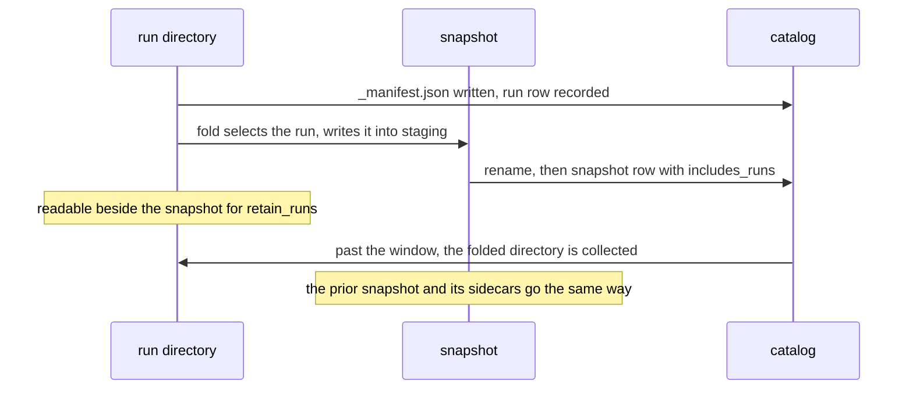
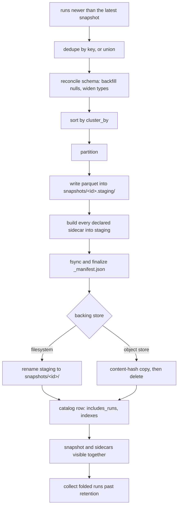
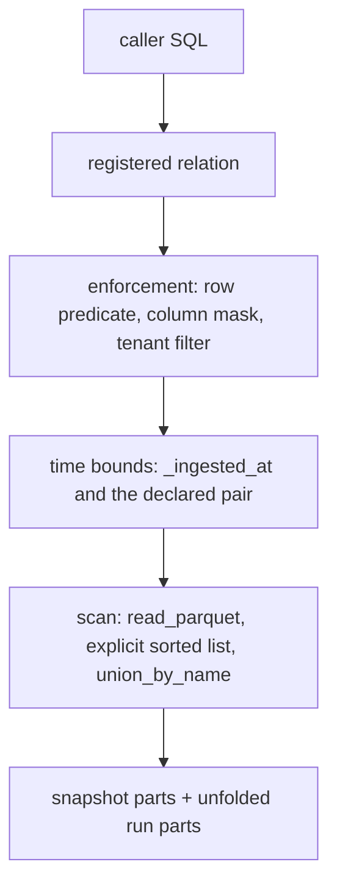

# The context store

The store is the canonical corpus: Parquet files a reader opens without the engine, JSON
manifests that index them, and a catalog derived from both. Every other contract reaches
rows through the shapes this file fixes.

## Parties

| Party | Obligation |
| --- | --- |
| **The store** | Keeps each landed row as Parquet under its table directory, indexes each run and each snapshot with a JSON manifest, and keeps the catalog reconstructible from the file tree alone. |
| **The producer** | Declares a table's key set before its first batch, sets a reserved optional column where it can stand behind the value, and keeps its own names outside the namespaces the engine holds. |
| **The scan** | Resolves a table's file list from the manifests, unifies column types across that list, and places a time bound on the inner source beneath enforcement. |
| **The compactor** | Folds committed runs into one immutable snapshot per table, materializes last-write-wins per key, and makes a snapshot and its sidecars visible in one step. |
| **The operator** | Turns at-rest encryption on per project, rotates its key by snapshot, and points compaction at one owning site. |
| **The reader** | Reads behavior in the clause tables, artifacts in Shapes, and the argument behind a refusal in `spec/decisions/`. |

## Operations

| Operation | What it governs |
| --- | --- |
| `lay-out` | The directory tree, snapshot and run naming, the commit markers, the manifests, and the catalog derived from them. |
| `declare` | A table's declaration block: its key, its ordering column, its write mode, and what a read returns for a row the source stopped serving. |
| `reserve` | The column and table namespaces the engine holds for itself, and the provenance columns it injects into every row. |
| `reconcile` | Schema evolution across a table's file set: the type lattice, additive columns, and what a scan is permitted to invent. |
| `fold` | Compaction: its pass order, its triggers, its retention window, its owner, and the moment a snapshot becomes readable. |
| `index` | Sidecar index kinds and their identity, the physical layout that makes zone maps effective, and partitioning. |
| `bound-time` | The two clocks a row carries, the parameters that bound each, and what a bounded read resolves to. |
| `encrypt` | At-rest encryption of Parquet and its sidecars, key rotation by snapshot, and the column an index is withheld from. |

## Clauses — lay-out

A store is a file tree first and a database second. These clauses fix what is on disk, what
marks a write finished, and which half of the tree survives losing the catalog.

| Clause | Statement | decided-by |
| --- | --- | --- |
| `store.lay-out.invariant.three-components` | A store has three components: Parquet files holding table data, JSON manifests indexing each run and each snapshot, and a SQLite catalog at `meta.sqlite`. The Parquet and the manifests are canonical; the catalog is the one stateful component and derives from them. | |
| `store.lay-out.shape.store-root` | A project's store sits at `.contextful/context/<project>/` and holds `meta.sqlite`, `config.toml` and one `tables/<t>/` directory per table. | |
| `store.lay-out.shape.table-directory` | A table directory holds `schema.json`, `data/snapshots/<id>/`, `data/runs/<run-id>/<node-id>/` and `requests/<run-id>.<node-id>.parquet`. | |
| `store.lay-out.limit.snapshot-id-width` | A snapshot directory is named `snapshot-<nanos>`, the commit instant in nanoseconds left-padded with zeros to 20 chars, so lexical order equals chronological order and the id carries no path-unsafe character. | |
| `store.lay-out.invariant.writer-node-segment` | The `<node-id>` segment inside a run path disjoins the parts two machines write under one logical run id: each lands its own `part-00000.parquet` under its own segment rather than colliding on one name. | |
| `store.lay-out.refusal.unsafe-node-segment` | A resolved node id outside `^[A-Za-z0-9._-]{1,64}$` raises `StoreUnsafeNodeSegment` before a directory is created, since the value is interpolated into a path segment and into a ledger filename. | `0015` |
| `store.lay-out.shape.part-name` | A data file inside a run or snapshot directory is `part-<ordinal>.parquet`, the ordinal left-padded with zeros to five digits and unique inside the directory that holds it. | |
| `store.lay-out.shape.staging-directory` | A pass in flight occupies `data/snapshots/<id>.staging/`, mirroring the published shape of the snapshot it builds, and no file list resolves inside it. | |
| `store.lay-out.shape.run-commit-marker` | A run is committed by writing `_manifest.json` into its node directory carrying `{run_id, table, node_id, parts, committed_at}`, where `node_id` equals the segment the file sits under. | |
| `store.lay-out.invariant.uncommitted-run-is-invisible` | The read path treats a node directory holding no `_manifest.json` as in flight and leaves its parts out of every file list. Presence of Parquet is not a commit signal. | |
| `store.lay-out.shape.snapshot-manifest` | A snapshot's `_manifest.json` carries `{snapshot_id, table, created_at, includes_runs[], primary_key[], order_by, row_count}`, plus `indexes[]` for committed sidecars and the valid-time pair the fold ran under. | |
| `store.lay-out.invariant.manifest-fields-are-additive` | Every field added to a manifest carries a default, and a manifest that fails to parse is skipped. A skipped snapshot manifest demotes its table to an unfolded union over run files. | |
| `store.lay-out.shape.table-schema-file` | A table's schema is `tables/<t>/schema.json` in Arrow JSON form rather than a catalog row. Each incoming batch's schema merges into the stored one and overwrites it in place, so the file holds the current reconciled shape. | |
| `store.lay-out.invariant.runs-append-snapshots-freeze` | Files under `data/runs/` are the raw output of one run, appended and never edited afterwards. Files under `data/snapshots/` are immutable: a fold writes a new snapshot rather than mutating one that exists. | |
| `store.lay-out.workflow.catalog-rebuild` | `contextful context rebuild-catalog` reconstructs `meta.sqlite` by walking every run `_manifest.json`, every snapshot `_manifest.json` and every `schema.json`. A corrupt or deleted catalog is a cache to rebuild. | |
| `store.lay-out.invariant.rebuild-drops-machine-state` | The catalog's derived half comes back from the tree; its bookkeeping half — the tables the run path keys on this machine — does not, so a rebuild is an operator action rather than a per-tick repair. | |
| `store.lay-out.refusal.unknown-table` | A name no `schema.json` in the tree declares raises `StoreUnknownTable` rather than resolving to an empty result, so "landed nothing" and "no such table" stay distinguishable at every surface. | `0016` |

The bucket wire format mirrors this tree key for key, in `spec/11-sync.md` § Wire format;
a replica pulls a table's ledger alongside its table. Node identity resolves in
`spec/11-sync.md` § Node identity; a machine with no writable state directory takes a
reserved name the bucket lease declines. Published-model artifacts sit beneath the table
they publish, in `spec/31-pipeline.md` § Published models; the manifest hashes them as it
hashes any other file.

unsettled: How does a consumer discover which manifest format version a bucket carries, and what does it do with one newer than it reads? owner: store affects: store.lay-out

## Clauses — declare

A table declaration decides the identity of a row, the order that breaks a tie, and what a
read shows once the source stops serving a row.

| Clause | Statement | decided-by |
| --- | --- | --- |
| `store.declare.shape.table-block` | A table block declares `primary_key`, `order_by`, `write_mode`, `replicate`, `subject_id`, `pii_type`, `policy`, `visibility`, `valid_time`, `view`, `agent_description`, `agent_hint` and `example_queries`. Each key is optional and is omitted from the canonical serialization when unset. | |
| `store.declare.shape.two-genres` | One substrate carries two genres: items, which are connector-landed rows, and artifacts, which are synthesized outputs tagged by an open `kind` string the producer sets. The engine enumerates no `kind` value. Both genres append, dedupe on content and carry a timestamp. | |
| `store.declare.invariant.primary-key-is-opt-in` | A table declaring no `primary_key` reads as the byte-identical union over its committed runs and is deduplicated nowhere. Declaring one is what gives the fold an identity to collapse. | |
| `store.declare.shape.dedup-view` | With a key declared and a snapshot committed, a table reads as `ROW_NUMBER() OVER (PARTITION BY <pk> ORDER BY <order_by> DESC, _ingested_at DESC) = 1` over that snapshot unioned with the runs the snapshot does not include. | |
| `store.declare.interface.order-by-default` | `order_by` names the column the fold reads to pick the surviving row per key and defaults to the injected ingest stamp, which every row carries. Absent a declared key the value is inert. | |
| `store.declare.refusal.order-by-unknown-column` | An `order_by` naming a column neither the declaration nor the engine's injected set carries raises `StoreOrderByUnknownColumn` at validation, ahead of the first batch. | `0017` |
| `store.declare.interface.withdrawn-row` | `write_mode` takes `append` or `replace` and governs what a read returns for a row the source withdrew. `append` is the value taken when the key is absent: last-write-wins inside a key, with nothing retiring a key that stops appearing. | |
| `store.declare.invariant.replace-reads-a-frontier` | Under `replace` a read covers the run that landed the source's complete current state plus everything committed after it, so a withdrawn row leaves every read surface at once. | |
| `store.declare.invariant.replacement-supersedes` | A replacing run leaves the runs it displaced on disk for the table's retention window, so a transaction-time read positioned before the replacing run still returns them and the fold drops them physically at its next pass. | |
| `store.declare.invariant.replacement-writes-no-receipt` | Replacement supersedes rather than erases: it emits no erasure receipt and walks no lineage. A compliance claim rests on erasure rather than on a write mode. | |
| `store.declare.invariant.empty-commit-replaces-nothing` | A run landing zero rows leaves a replacing table reading what it read before. A source that has genuinely emptied keeps serving its last non-empty state, since no pull carries a signal separating the two. | |
| `store.declare.invariant.empty-table-is-a-zero-row-relation` | A run that pulls no rows still commits, so a quiet stream leaves a schema, a committed run and no Parquet. That table registers as a zero-row relation over its declared columns plus the injected provenance set. | |
| `store.declare.invariant.keyed-table-needs-a-fold` | Until a keyed table has one committed snapshot it reads as a plain union, counting a re-landed row once per run that landed it. Validation warns per table where a key is declared and no enabled compaction job covers it, naming the table. | |
| `store.declare.invariant.declaration-precedes-the-batch` | A declaration key changes what a read returns rather than what a write accepts, so a key added after rows land takes effect from the next fold onward and rewrites no committed part. | |

Where the declaration block sits inside a pipeline's serialization, and how a destination
table's name derives, are `spec/31-pipeline.md` § Table models; one folded spelling reaches
this contract. Row- and column-level policy keys bind in `spec/41-enforcement.md` § Binding;
a declaration names them and the enforcement layer reads them.

unsettled: What retires a key a source stops serving under the append mode, given the source-side deletion is invisible in the tree? owner: store affects: store.declare

## Clauses — reserve

The engine writes columns of its own onto every row and holds a small set of names against
an application's vocabulary.

| Clause | Statement | decided-by |
| --- | --- | --- |
| `store.reserve.invariant.underscore-namespace` | The leading-underscore column namespace belongs to the engine. A producer's own columns live outside it, and the injected and reserved-optional sets below are its whole content. | |
| `store.reserve.shape.injected-columns` | The engine injects `_ingested_at` as an RFC3339 instant, non-null on every row; `_run_id`; `_batch_seq` as an int32 where a batch scope exists; `_site_id` for the writing site; and `_authored_by` where an authenticated subject authorized the write. | |
| `store.reserve.invariant.injection-is-correct-by-construction` | The engine wrote the row, so the stamped instant and the run identifier are engine knowledge rather than a claim carried in from a source. A producer setting either sees its value replaced. | |
| `store.reserve.invariant.no-null-placeholder-column` | A path holding no batch scope and no authenticated subject carries no null column standing in for one. Absence of the column and a null in the column stay distinguishable under schema union. | |
| `store.reserve.limit.optional-producer-columns` | Four reserved optional columns travel with any row and surface in the provenance envelope where present: `_modality`, `_lang`, `_provenance` and `_prompt_hash`. Nothing outside those 4 entries is accepted in the reserved namespace. | |
| `store.reserve.limit.modality-values` | `_modality` takes one of 5 entries — `text`, `image`, `audio`, `structured`, `mixed` — and a value outside that set fails validation of the batch that carries it. | |
| `store.reserve.shape.language-and-lineage` | `_lang` carries a BCP-47 tag. `_provenance` carries the evidence rows the row derives from, addressed by the same identity the source table keys on. | |
| `store.reserve.invariant.prompt-hash-is-over-the-template` | `_prompt_hash` is `sha256:<hex>` over the prompt template rather than the rendered prompt, so two rows produced from one template over different evidence share a value and a template edit separates them. | |
| `store.reserve.refusal.reserved-column-name` | A producer column spelled inside the reserved namespace and outside the reserved optional set raises `StoreReservedColumnName` at schema reconciliation, ahead of any Parquet. | `0018` |
| `store.reserve.shape.reserved-namespaces` | The engine reserves two table namespaces: the durable run record, and the whole prefix the visibility engine mirrors access data under. | |
| `store.reserve.refusal.reserved-table-name` | A pipeline declaring a table inside a reserved namespace raises `StoreReservedTableName` when the manifest is assembled, naming the reservation it collided with. | `0018` |
| `store.reserve.shape.request-ledger-path` | A run's request ledger is one Parquet file at `tables/<t>/requests/<run-id>.<node-id>.parquet`, disjoint per run and per writing node by its filename. | |
| `store.reserve.invariant.ledger-outlives-its-run` | The ledger is appended, folded by no compaction pass and collected with no run directory, so it outlives the parts it describes and a replica carries it with its table. | |
| `store.reserve.invariant.layout-is-withheld` | A data file's path reaches no query result: paths are relative by construction and the caller-facing surface answers provenance with columns rather than with where the bytes sit. | |

Row authorship is `spec/40-authority.md` § Admission; a run a timer fired lands rows with
no author. The ledger's columns and its child relation are `spec/20-read.md` § Provenance;
a table with no ledger contributes no entry. The run record occupies one reserved name, in
`spec/30-run.md` § Run record; its rows time-travel with every other table.

## Clauses — reconcile

A table's file set spans schemas written months apart. Reconciliation decides what a scan
sees across that set, and which widening stops at the write instead of being absorbed.

| Clause | Statement | decided-by |
| --- | --- | --- |
| `store.reconcile.invariant.explicit-file-list` | Every read hands `read_parquet([...])` an explicit, sorted list of files rather than a glob, so the manifests decide what a table reads and a stray file in the tree joins nothing. | |
| `store.reconcile.invariant.type-unification` | Every read passes `union_by_name=true`. A column resolves across the whole file set to the common supertype of the files that carry it, and a column that widened mid-life reads at the widened type on every row, including rows in files physically written narrower. | |
| `store.reconcile.invariant.no-per-column-cast` | The generated relation carries no per-column cast: the widening happens in the scan's own type resolution, and a projection adding one reproduces the same arithmetic a second time. | |
| `store.reconcile.shape.type-lattice` | The lattice models one promotion, `Int64` with `Float64` to `Float64`, and it is the one pairing that produces physically mixed Parquet. A JSON type absorbs its partner, since both sides land as UTF-8. | |
| `store.reconcile.refusal.incompatible-pair` | Any other pair of observed types for one column raises `StoreSchemaIncompatible` at the write, naming the column, the stored type and the arriving one. | `0019` |
| `store.reconcile.invariant.float-promotion-is-lossy` | Above 9007199254740992 the promotion loses precision: an integer of 9007199254740993 reads back exactly until a `Float64` batch lands on that column, after which it reads 9007199254740992. The loss sits in the lattice rather than in a projection. | |
| `store.reconcile.refusal.key-widening` | A primary-key column takes no `Float64` promotion. Reconciliation raises `StoreKeyWidened` on the widening batch ahead of any Parquet for a key a snapshot declares, and the first fold raises it again on a column already reconciled to `Float64`. A key holding values past that range is emitted as a string. | `0020` |
| `store.reconcile.invariant.columns-are-additive` | A row is a field map rather than a fixed struct, so an unseen column joins the merged schema and files written before it read it as null. A predicate over a column added this way is null-safe. | |
| `store.reconcile.invariant.scan-invents-no-column` | Union by name widens a column some file carries and invents none no file carries. An ordering column absent from every file enters the scan through a zero-row branch, and a column introduced after a table's first rows is projected as a literal null rather than referenced by name. | |
| `store.reconcile.workflow.first-sight-creates` | A destination reconciles an arriving schema against the stored one, creating the table on first sight and merging afterwards. The merged result overwrites `schema.json` in place. | |
| `store.reconcile.invariant.fold-never-narrows` | Reconciliation inside a fold backfills nulls and widens types. It narrows no type and drops no column, so a snapshot's schema is a superset of every run schema it includes. | |
| `store.reconcile.invariant.no-schema-history` | What survives reconciliation is the current reconciled shape rather than the sequence of merges that produced it, so attribution of a past widening comes from the run files themselves. | |
| `store.reconcile.invariant.reserved-set-widens-together` | Adding an injected column moves every store's schema fingerprint, so the addition travels with a semantics version whose recipe names it and a consumer reads a column addition rather than a bare hash mismatch. | |

Relation registration happens per connection, in `spec/20-read.md` § Registration; the
source a relation resolves to comes from the manifests at the moment it is built.

unsettled: Does a schema evolution need to be attributable after the fact, given nothing records the decision a merge made? owner: store affects: store.reconcile

## Clauses — fold

Compaction is the one operation that rewrites what a table reads. It collapses runs into a
snapshot, materializes the winner per key, and publishes data and sidecars together.

| Clause | Statement | decided-by |
| --- | --- | --- |
| `store.fold.workflow.pass-order` | One pass selects the runs newer than the latest snapshot, deduplicates by key or unions for an append table, reconciles the schema, sorts by `cluster_by`, partitions, writes Parquet into staging, builds every declared sidecar into staging, fsyncs and finalizes the manifest, renames, records `includes_runs` and `indexes[]` in the catalog, and collects the folded runs once retention passes. | |
| `store.fold.invariant.last-write-wins-materialized` | The fold is where last-write-wins per key becomes a fact on disk. The deduplicating relation registers over a table holding a committed snapshot, and a keyed table without one reads as a union whose observable defect is an inflated `SUM()`. | |
| `store.fold.invariant.partition-on-the-valid-time-line` | A keyed table carrying a declared valid-time pair holds more than one live row per key by design, so the fold partitions on the key together with the valid-time line and keeps one row per line rather than one per key. | |
| `store.fold.invariant.includes-runs-is-the-boundary` | A snapshot's `includes_runs` decides which run files the deduplicating relation unions beside it: a run named there is folded, and a run committed afterwards reads on top of the snapshot. | |
| `store.fold.interface.triggers` | Three triggers fire a pass: 50 committed runs on a table, the elapsed interval, or an operator running `contextful context compact <table>`. The run count tracks small-file accumulation and the interval bounds staleness of zone maps and sidecars. | |
| `store.fold.limit.compaction-interval` | The interval trigger fires 6 h after the previous pass on a table. | |
| `store.fold.limit.run-retention` | A table's `retain_runs` window defaults to 7 d, and a folded run directory is collected once it falls outside that window. | |
| `store.fold.refusal.nothing-landed` | Folding a table that has landed nothing raises `StoreNothingLanded` for that table and the pass continues to the next one, so a quiet stream does not turn a scheduled pass into a failed command. | `0021` |
| `store.fold.refusal.unknown-table-in-a-pass` | A table name in a pass that resolves to no schema raises `StoreUnknownTable` and halts the command, keeping a misspelled target distinguishable from a stream with no rows yet. | `0016` |
| `store.fold.invariant.atomic-publication` | A pass stages Parquet and every declared sidecar under `snapshots/<id>.staging/` and publishes both with one rename, so a snapshot becomes visible once its data and its indexes are durable. | |
| `store.fold.refusal.partial-snapshot` | Publishing data whose declared sidecars are absent, or sidecars whose data is absent, raises `StorePartialSnapshot`; no half-indexed snapshot is readable at any moment. | `0022` |
| `store.fold.invariant.catalog-row-is-the-commit-point` | On a local filesystem publication is a rename. On an object store, where no rename is atomic, it is a content-hash-keyed copy followed by a delete, and the catalog row decides visibility: a snapshot directory with no matching row is ignored by every reader. | |
| `store.fold.invariant.staging-is-collected` | A crash mid-pass leaves a staging directory the catalog collects on its next sweep, and no reader resolves a file beneath one. | |
| `store.fold.invariant.reads-are-non-blocking` | A statement running while a pass builds continues against the prior snapshot and picks up the new one after publication. No window exists in which a snapshot is current and its indexes are still building. | |
| `store.fold.invariant.one-owning-site` | The fold is the one operation that is not append-only, so exactly one site owns compaction for a store. Two sites folding one table concurrently is the single way committed rows leave the tree. | |
| `store.fold.invariant.network-cost-is-twice-the-table` | A pass reads the table's unfolded run files and writes one snapshot, so a bucket-resident store moves roughly twice the table's bytes per pass. Folding inside the bucket's own region, raising the run-count trigger, or leaving a small table unpartitioned each reduce it. | |
| `store.fold.invariant.snapshot-supersedes-rather-than-deletes` | A new snapshot supersedes the previous one and the runs it includes; both stay readable until retention collects them, so a pass is reversible by reading the prior snapshot until that moment. | |

unsettled: How does a deployment needing transaction-time reconstruction coexist with the fold, given the collapse drops the earlier-stamped rows? owner: store affects: store.fold

## Clauses — index

A sidecar is a derived artifact next to the Parquet it indexes. Clustering and partitioning
are the physical arrangement that makes the cheapest index — the zone map — effective.

| Clause | Statement | decided-by |
| --- | --- | --- |
| `store.index.shape.five-kinds` | Five index kinds exist: zone maps carried inline in Parquet footers, a sorted-Parquet plus sparse-map primary-key lookup, an in-process HNSW vector graph, a Tantivy full-text index, and opt-in per-column bloom filters. | |
| `store.index.shape.declaration` | Each sidecar is declared per table in the manifest with `kind`, `column` and its builder parameters — `model`, `dim`, `metric`, `m` and `ef_construction` for the vector kind. | |
| `store.index.shape.sidecar-paths` | A vector sidecar sits at `snapshots/<id>/indexes/vec-<col>-<model>/zone=<label>/` and a full-text sidecar at `snapshots/<id>/indexes/fts-<col>/`. | |
| `store.index.invariant.identity-is-column-builder-version` | A sidecar's identity is `(column, builder, builder-version)`, so an index over one column built by a different model is a different directory. Both coexist, the caller picks at query time, and the catalog records each builder id. | |
| `store.index.invariant.rebuild-never-touches-parquet` | Swapping a builder is a rebuild of the sidecar; the canonical Parquet is untouched and callers on the existing identity keep reading through a cutover. | |
| `store.index.invariant.sidecar-lives-inside-its-snapshot` | Path-based sidecars live under `indexes/` inside the snapshot directory they index, staged and published by the same rename as the data. | |
| `store.index.invariant.indexes-are-not-in-the-file-set` | `indexes/` never joins a table's file set: a snapshot reader enumerates the top-level `*.parquet` under the snapshot directory, and operator SQL globbing recursively excludes that subtree. | |
| `store.index.invariant.index-dies-with-its-snapshot` | Collecting a snapshot collects its sidecars in the same step, so no index ever points at Parquet that is gone. | |
| `store.index.invariant.candidate-ids-only` | A sidecar sits outside SQL and inherits nothing from a scanned relation, so it yields candidate identifiers rather than rows. Those identifiers re-join through the enforced relation, and enforcement runs before a top-K is finalized. | |
| `store.index.invariant.vector-sidecar-is-a-fold-output` | The fold builds a vector sidecar for a table carrying an embedding column under a single-column primary key, and the same rename publishes that sidecar with the data it indexes. | |
| `store.index.interface.build-telemetry` | An index build emits `contextful.index.*` spans carrying rows indexed, builder duration and embedding request count, so the cost of an index is answerable from the trace. | |
| `store.index.refusal.index-column-absent` | Declaring an index over a column the table's reconciled schema does not carry raises `StoreIndexColumnAbsent` at manifest validation, ahead of the pass that builds it. | `0023` |
| `store.index.interface.clustering` | `cluster_by` sets row order inside a Parquet file so zone maps skip row groups with no explicit index. The sort is lexicographic over the declared columns in their declared order. | |
| `store.index.invariant.zone-maps-need-no-declaration` | Zone maps ride the Parquet footer of every file, so a declared `cluster_by` buys row-group skipping with no index entry in the manifest and no sidecar on disk. | |
| `store.index.interface.partitioning` | Partitioning is opt-in and off when undeclared: a single snapshot serves a table small enough that a partitioned scan adds directories without removing bytes. | |
| `store.index.invariant.partition-count-warning` | Planning warns where a partition specification projects more than 1000 partitions, naming the column that fans out. | |
| `store.index.limit.partition-median-size` | Planning warns where the projected median partition falls below 16 MiB. | |
| `store.index.invariant.tenant-partition-is-the-boundary` | A multi-tenant table carries the tenant identifier as the outermost partition column, written byte for byte as the consumer supplied it, so a dropped predicate reads nothing rather than everyone. | |
| `store.index.invariant.tenant-value-is-never-rewritten` | The build trims no whitespace, folds no case and applies no Unicode normalization to a tenant value. A percent-escaped directory name is representation, and the read-time filter compares the raw value. | |

unsettled: Is the on-disk vector graph format stable enough to commit to, and how many incremental extensions precede a full rebuild? owner: store affects: store.index

unsettled: Should clustering carry a space-filling curve ordering beside the lexicographic sort, and which filter distributions justify it? owner: store affects: store.index

## Clauses — bound-time

A row carries two clocks. One the engine wrote and one the source declared. Each has its own
parameter, and both land on the inner source of a scan.

| Clause | Statement | decided-by |
| --- | --- | --- |
| `store.bound-time.invariant.two-clocks` | Transaction time is the injected ingest stamp, which the engine wrote and therefore knows. Valid time is a pair of the table's own columns, in the source's vocabulary. The engine infers neither pair nor stamps a second column claiming to be the first. | |
| `store.bound-time.interface.valid-time-declaration` | A table declares its clock columns as `[pipeline.tables.valid_time]` with `from` and an optional `to`. A table declaring `from` alone treats every row as valid from that instant onward. | |
| `store.bound-time.invariant.as-of-wraps-the-source` | `as_of` bounds transaction time by wrapping each table's FROM-source in `_ingested_at <= as_of`, so arbitrary caller SQL rewinds with no predicate the caller writes. | |
| `store.bound-time.invariant.valid-as-of-wraps-the-source` | `valid_as_of` applies at the same inner position as its sibling, expanding to `from <= valid_as_of AND (to IS NULL OR to > valid_as_of)` over the declared pair. | |
| `store.bound-time.refusal.undeclared-valid-time` | A `valid_as_of` read against a table carrying no declared pair raises `StoreValidTimeUndeclared` and names the table, rather than answering the transaction-time question in its place. | `0024` |
| `store.bound-time.invariant.unbounded-read-is-latest` | A read carrying neither parameter resolves every named table to its latest state, so bounding is an act a caller takes rather than a posture a store holds. | |
| `store.bound-time.invariant.bounds-sit-beneath-enforcement` | Both bounds compose underneath the row predicate, the column mask and the tenant filter rather than beside them, so a bound narrows what enforcement already narrowed and widens nothing. | |
| `store.bound-time.invariant.comparison-is-lexicographic` | The ingest stamp is stored as UTF-8 and a declared valid-time column is text, so each bound is a string comparison over an RFC3339 spelling rather than an instant comparison. | |
| `store.bound-time.invariant.date-only-resolution` | A date-only literal resolves to the exclusive next date, which is the one literal separating two days for every timestamp spelling either side may use, so `2026-03-01` covers the whole of that day. | |
| `store.bound-time.invariant.normalization-happens-once` | Resolution of a date-only literal happens where the literal is built, so every caller and every table read the same resolved string and two resolutions cannot disagree. | |
| `store.bound-time.invariant.earlier-of-two-upper-bounds` | A named build pin and `as_of` are both upper bounds on transaction time. Where a read carries both, each named table resolves to the earlier of the two. | |
| `store.bound-time.invariant.a-bound-filters` | Over an append-only table a valid-time bound returns every version whose interval covers the instant, since nothing has decided which of two covering rows supersedes the other. Declaring a key and folding is what picks between them. | |
| `store.bound-time.invariant.fold-is-a-one-way-door` | A folded table reads no earlier than its own fold: the rows carrying the earlier ingest stamps are the ones last-write-wins dropped. A deployment reconstructing transaction time leaves the table unfolded. | |
| `store.bound-time.interface.bounds-echo` | Every read echoes the bounds it ran under as `contextful.bounds` carrying `{as_of?, valid_as_of?, inclusive}` in the engine's normalized spelling, and the block is omitted on an unbounded read. | |
| `store.bound-time.invariant.echo-is-a-string-comparison` | A consumer writing derived rows records the echoed instants verbatim, so a later comparison of two derivations is a string comparison rather than a re-parse of each side's literal. | |

Enforcement wraps each scan's FROM-source, in `spec/41-enforcement.md` § Layers; a bound
takes the position inside that wrapper. The pair the memory tables declare is
`spec/21-memory.md` § Fact shape; recall and a bounded read consult one declaration. A row's
own publication date is a ranking tier in `spec/20-read.md` § Ordering; the store injects no
third clock.

unsettled: How is a validity interval set modelled — overlapping endorsements on one policy — given one pair of columns holds one interval? owner: store affects: store.bound-time

unsettled: What does the valid-time predicate cost over a wide table, and does a declared pair need a zone map to match the transaction-time bound? owner: store affects: store.bound-time

## Clauses — encrypt

Encryption covers the canonical bytes and everything derived from them. The qualifier is
the column an index is withheld from.

| Clause | Statement | decided-by |
| --- | --- | --- |
| `store.encrypt.interface.key-binding` | At-rest encryption is per project and off when undeclared, enabled with `[encryption] key_source = "env:CONTEXTFUL_KEY"`. The key derives from a password or from an external key-management service, and Parquet is written through native modular encryption. | |
| `store.encrypt.refusal.key-source-unbound` | A `key_source` naming an environment variable the process does not hold raises `StoreEncryptionKeyUnbound` at startup rather than falling back to writing cleartext. | `0025` |
| `store.encrypt.invariant.transport-is-separate` | At-rest encryption covers files; transport to a bucket endpoint is TLS. Neither substitutes for the other, and a cleartext endpoint carries no encrypted-at-rest claim. | |
| `store.encrypt.invariant.sidecars-share-the-key` | With encryption on, every sidecar — vector graph, identifier map, full-text segments, bloom filters, zone maps — is encrypted under the same key as the Parquet it indexes. A cleartext vector graph alone admits approximate-nearest-neighbour search over the embedding space. | |
| `store.encrypt.refusal.index-over-a-redacted-column` | The manifest validator raises `StoreIndexOverRedactedColumn` for an index declared over a column redacted at write time, so no structure over that column exists on disk in any form. | `0026` |
| `store.encrypt.invariant.at-rest-scope` | A stolen bucket credential reveals encrypted Parquet and encrypted sidecars, and reveals no write-time-redacted content through index structure. It reveals key material nowhere in the tree. | |
| `store.encrypt.workflow.key-rotation` | Keys rotate per snapshot: a new snapshot is written under the new key version, snapshots written earlier stay readable under theirs until collection, and the catalog records the key version each snapshot carries. | |
| `store.encrypt.invariant.rotation-rewrites-nothing` | Rotation writes forward rather than rewriting: no published snapshot changes key version in place, so rotation costs one fold per table rather than a rewrite of the tree. | |

The erasure rewrite reaches a file in place, in `spec/44-accountability.md` § Erasure;
replacement leaves the displaced file readable until retention collects it.

## Shapes

The tree a project's store occupies:

```
.contextful/context/<project>/
  meta.sqlite                                  derived catalog
  config.toml
  tables/<t>/
    schema.json                                Arrow JSON, current reconciled shape
    data/
      runs/<run-id>/<node-id>/
        part-00000.parquet
        _manifest.json                         the run commit marker
      snapshots/snapshot-00000000000000000000/
        part-00000.parquet
        _manifest.json
        indexes/
          vec-<col>-<model>/zone=<label>/
          fts-<col>/
      snapshots/<id>.staging/                  present mid-pass
    requests/<run-id>.<node-id>.parquet         the request ledger
```

A table declaration:

```toml
[[pipeline.tables]]
name         = "filings"
primary_key  = ["document_id", "page"]
order_by     = "revised_at"
write_mode   = "replace"
cluster_by   = ["issuer", "revised_at"]
partition_by = ["tenant"]
retain_runs  = "7d"

[pipeline.tables.valid_time]
from = "effective_from"
to   = "effective_to"
```

A snapshot manifest:

```json
{
  "snapshot_id": "snapshot-00001742054400000000000",
  "table": "filings",
  "created_at": "2026-03-15T12:00:00Z",
  "includes_runs": ["run-4812", "run-4813", "run-4814"],
  "primary_key": ["document_id", "page"],
  "order_by": "revised_at",
  "row_count": 128400,
  "valid_time": { "from": "effective_from", "to": "effective_to" },
  "indexes": [
    { "kind": "vector", "column": "embedding", "model": "e5-small", "dim": 384,
      "metric": "cosine", "m": 16, "ef_construction": 200 },
    { "kind": "fulltext", "column": "body" }
  ]
}
```

The bounds a read echoes:

```json
{
  "contextful.bounds": {
    "as_of": "2026-03-02",
    "valid_as_of": "2026-01-01T00:00:00Z",
    "inclusive": false
  }
}
```

A row as the scan assembles it:

```
document_id  page  body  revised_at  effective_from  effective_to
_ingested_at  _run_id  _batch_seq  _site_id  _authored_by
_modality  _lang  _provenance  _prompt_hash
```

A run commit marker:

```json
{
  "run_id": "run-4814",
  "table": "filings",
  "node_id": "node-9f2c41ab",
  "parts": ["part-00000.parquet", "part-00001.parquet"],
  "committed_at": "2026-03-15T11:58:12Z"
}
```

The relation a keyed table resolves to:

```sql
SELECT * EXCLUDE (_rn) FROM (
  SELECT *,
         ROW_NUMBER() OVER (
           PARTITION BY document_id, page
           ORDER BY revised_at DESC, _ingested_at DESC
         ) AS _rn
  FROM read_parquet(
    [ 'tables/filings/data/snapshots/snapshot-00001742054400000000000/part-00000.parquet',
      'tables/filings/data/runs/run-4815/node-9f2c41ab/part-00000.parquet' ],
    union_by_name = true
  )
) WHERE _rn = 1
```

An unkeyed table resolves to the same scan with no window wrapper.

The catalog, as the tree derives it:

```
meta.sqlite
  tables            name, schema path, declaration digest
  runs              run id, table, node id, parts, committed_at
  snapshots         snapshot id, table, includes_runs, row_count, key_version
  snapshot_indexes  snapshot id, kind, column, builder, builder_version
  partitions        table, column, value, statistics refreshed by the fold
```

Encryption, as a project declares it:

```toml
[encryption]
key_source = "env:CONTEXTFUL_KEY"
```

A partitioned tenant table on disk, with the tenant column outermost:

```
tables/filings/data/snapshots/snapshot-00001742054400000000000/
  tenant=acme%2Feu/region=eu-west/part-00000.parquet
  tenant=acme/region=eu-west/part-00000.parquet
```

`acme%2Feu` and `acme` are two tenants: the directory name is an escaped rendering and the
read-time filter compares the value the consumer supplied.

Retention, from a committed run to a collected directory:



The fold, from selection to visibility:



Where a bound sits relative to enforcement:



Type resolution across one column's files:

```
file A: Int64        file B: Int64        ->  Int64
file A: Int64        file B: Float64      ->  Float64   (lossy past 9007199254740992)
file A: Json         file B: Utf8         ->  Json
file A: Utf8         file B: Int64        ->  StoreSchemaIncompatible
primary key column, Int64 then Float64    ->  StoreKeyWidened
```

## Unsettled

unsettled: Does a replica hold a subset of a snapshot's sidecars and a subset of its partitions, and what does a read needing a missing one resolve to? owner: store affects: store.index

unsettled: Is the tenant partition value validated against a canonical form, given the build rewrites nothing and a path-encoded name is representation? owner: store affects: store.index
