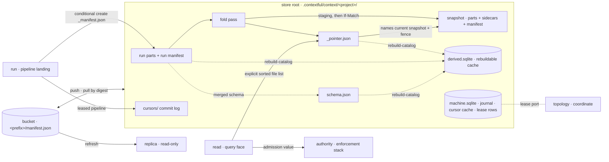
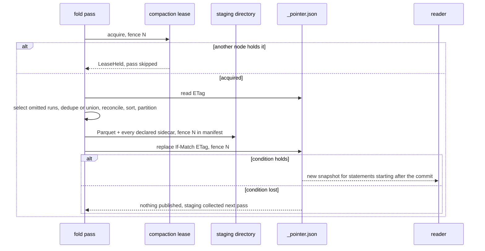
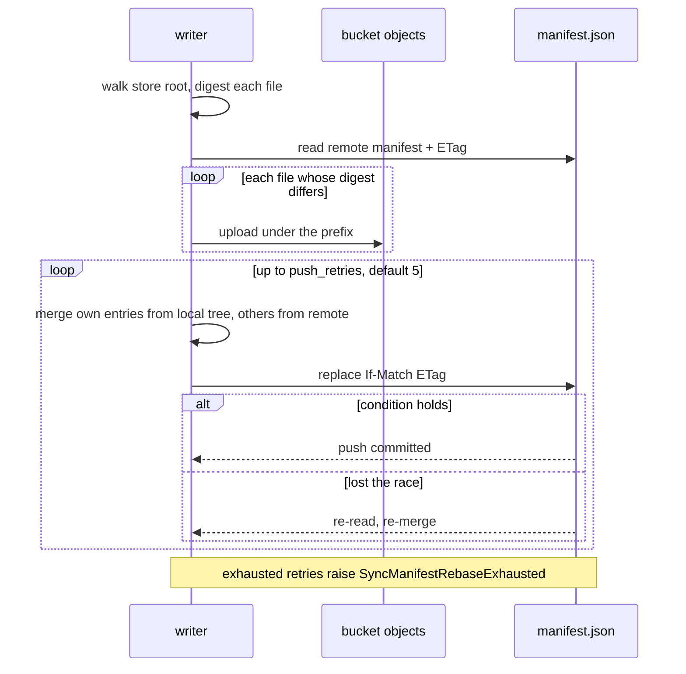
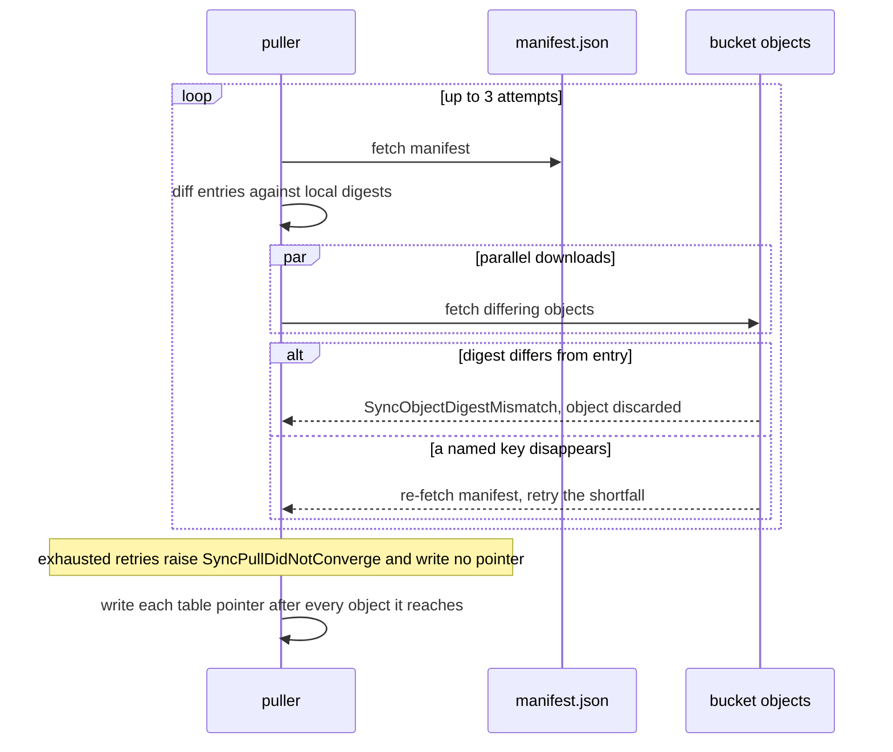
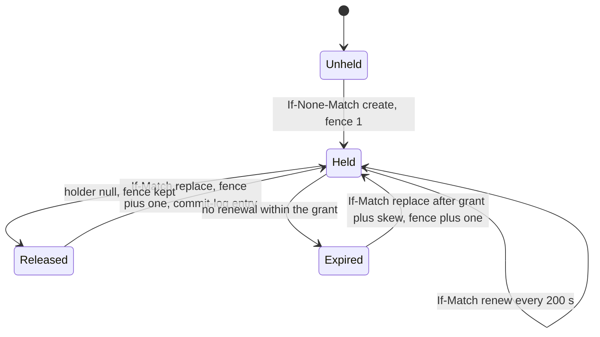

# The store and its sync

The store is the canonical corpus: Parquet a reader opens without the engine, JSON
manifests indexing it, one pointer object per table naming the current snapshot, and two
local SQLite catalogs. An S3-compatible bucket mirrors the tree key for key. Every other
contract reaches rows through the shapes this file fixes.

The store's canonical objects, its two catalogs, the bucket mirror, and the contracts
writing into it and reading from it.



## lay-out

| Clause | Statement | Why |
| --- | --- | --- |
| `store.lay-out.components` | A store holds Parquet table data, JSON run and snapshot manifests, one pointer object per table, and two SQLite catalogs, `derived.sqlite` and `machine.sqlite`. Parquet, manifests and pointers are canonical. | because a catalog that is both a rebuildable cache and a commit point resurrects half-published snapshots on rebuild |
| `store.lay-out.store-root` | A project's store sits at `.contextful/context/<project>/`, holding both catalogs, `config.toml`, `cursors/` and one `tables/<t>/` directory per table. | — |
| `store.lay-out.table-directory` | A table directory holds `schema.json`, `_pointer.json`, `data/snapshots/<id>/`, `data/runs/<run-id>/<node-id>/` and `requests/`. | — |
| `store.lay-out.snapshot-id` | A snapshot id is `snapshot-` followed by a nanosecond value zero-padded to 20 chars, equal to the greater of the commit instant and the previous id plus one. | because a wall clock that steps backwards breaks lexical order equalling commit order |
| `store.lay-out.part-name` | A data file is `part-<ordinal>.parquet`, the ordinal zero-padded to five digits and unique within its directory. | — |
| `store.lay-out.staging` | A fold in flight writes under `data/snapshots/<id>.staging/`, and no file list resolves inside it. | — |
| `store.lay-out.run-manifest` | A run commits by conditionally creating `_manifest.json` in its node directory, carrying `{run_id, table, node_id, parts, committed_at, pipeline_id?, cursor?, fence?}`, where `node_id` equals the enclosing segment. | — |
| `store.lay-out.uncommitted-run` | A node directory holding no `_manifest.json` is in flight and its parts join no file list; a leased pipeline's run also waits for its commit-log entry. | P4 |
| `store.lay-out.cursor-in-commit` | A pipeline's committed position is the cursor inside its newest commit: the newest commit-log entry for a leased pipeline, the highest run-manifest cursor otherwise. `machine.sqlite` caches it. | because a position committed apart from its rows re-lands the batch after a crash between the two writes |
| `store.lay-out.snapshot-manifest` | A snapshot's `_manifest.json` carries `{snapshot_id, parent, table, created_at, includes_runs, primary_key, order_by, row_count, valid_time?, indexes, fence}`, and each entry of `parts` and `indexes` carries its `key_version`. | — |
| `store.lay-out.table-pointer` | `tables/<t>/_pointer.json` names the table's current snapshot and the fence that published it. A snapshot is readable only when the pointer or a chain of `parent` links from it reaches it. | A-store |
| `store.lay-out.manifest-default` | A field added to a manifest carries a default value. | — |
| `store.lay-out.manifest-unreadable` | A run manifest or a reachable snapshot manifest that fails to parse raises `StoreManifestUnreadable`, naming the table and the file, and the table answers no read until it parses. | P4 |
| `store.lay-out.schema-file` | A table's schema is `schema.json` in Arrow JSON form; each arriving batch's schema merges into it and the merged result replaces it. | — |
| `store.lay-out.immutable-files` | A run file is written once and never edited, a snapshot directory is immutable, and a fold writes a new snapshot. | — |
| `store.lay-out.derived-catalog` | `derived.sqlite` is a cache: `contextful context rebuild-catalog` reconstructs it from the pointers, the manifests they reach, every committed run manifest and every `schema.json`. It is never synced and commits nothing. | A-store |
| `store.lay-out.machine-catalog` | `machine.sqlite` holds one machine's journal, cursor cache and lease rows. It is never synced, never rebuilt and never replaced by a pull. | A-store |
| `store.lay-out.unknown-table` | A table name no `schema.json` in the tree declares raises `StoreUnknownTable`, never an empty result. | P1 |
| `store.lay-out.node-segment` | The `<node-id>` run-path segment and the node id in a ledger filename keep two machines writing one logical run id in disjoint files. | — |
| `store.lay-out.node-id-order` | A process resolves its node id once: `CONTEXTFUL_NODE_ID`, then `[node] id`, then a random `node-<8 hex>` generated once and persisted. | — |
| `store.lay-out.node-id-state-path` | A generated node id persists under `$CONTEXTFUL_STATE_DIR`, else `$XDG_STATE_HOME/contextful`, else the platform user-state directory, outside the store root. | because a copied store carrying its identity makes two machines one holder |
| `store.lay-out.node-id-shape` | A node id longer than 64 chars or outside `^[A-Za-z0-9._-]+$` raises `StoreNodeIdInvalid` at process start, before any path, key or lease carries it. | P3 |
| `store.lay-out.node-id-shared` | A node id declared in a control-plane configuration raises `StoreNodeIdShared`. | because a control-plane snapshot applies to every machine reconciling it, making one id many holders |
| `store.lay-out.node-id-local` | A machine with no writable state directory takes the reserved node id `local`. | — |

unsettled: How does a consumer discover the manifest format version a store or bucket carries, and what does it do with a version newer than it parses? owner: store affects: store.lay-out

## declare

| Clause | Statement | Why |
| --- | --- | --- |
| `store.declare.table-block` | A table block declares any of `primary_key`, `order_by`, `write_mode`, `replicate`, `subject_id`, `class`, `policy`, `visibility`, `valid_time`, `view`, `cluster_by`, `partition_by`, `retain_runs`, `agent_description`, `agent_hint` and `example_queries`; an unset key is absent from the canonical serialization. | — |
| `store.declare.two-genres` | A table holds items, landed by connectors, or artifacts, synthesized and tagged by an open kind string the engine does not enumerate. Both append, dedupe on content and carry a timestamp. | — |
| `store.declare.unkeyed-union` | A table declaring no `primary_key` reads as the byte-identical union of its committed runs. | — |
| `store.declare.dedup-view` | A table declaring `primary_key` reads through `ROW_NUMBER() OVER (PARTITION BY <pk> ORDER BY <order_by> DESC, _ingested_at DESC) = 1` over its current snapshot, if any, unioned with the committed runs that snapshot omits. | because a keyed table read as a union before its first fold inflates every aggregate silently |
| `store.declare.order-by-default` | `order_by` names the column picking the surviving row per key, and defaults to `_ingested_at`. | — |
| `store.declare.order-by-unknown` | An `order_by` naming a column neither declared nor injected raises `StoreOrderByUnknownColumn` at validation, before the first batch. | because an ordering column absent from every file reads as null and picks survivors arbitrarily |
| `store.declare.write-mode` | `write_mode` is `append`, the default, keeping the last write per key and retiring no key, or `replace`. | — |
| `store.declare.replace-frontier` | Under `replace`, a read covers the newest run carrying the source's complete state plus every run committed after it. | — |
| `store.declare.replace-retains` | A replacing run leaves the runs it displaced on disk until `retain_runs` passes, writes no erasure receipt and walks no lineage. | — |
| `store.declare.empty-run` | A run landing zero rows commits a manifest with no parts and replaces nothing; a table with no rows registers as a zero-row relation over its declared and injected columns. | — |
| `store.declare.fold-coverage` | Validation warns, naming the table, where a key is declared and no enabled compaction job covers the table. | — |
| `store.declare.read-side-keys` | A declaration key changes what a read returns and rewrites no committed part; a key added after rows land applies from the next read. | — |

unsettled: What retires a key a source stops serving under `append`, given the source-side deletion is invisible in the tree? owner: store affects: store.declare

## reserve

| Clause | Statement | Why |
| --- | --- | --- |
| `store.reserve.underscore-namespace` | Column names beginning `_` belong to the engine; the injected set and the reserved optional set are its whole content. | — |
| `store.reserve.injected` | The engine injects `_ingested_at` as a non-null Parquet `TIMESTAMP(UTC, NANOS)`, `_run_id`, `_batch_seq` as int32 where a batch scope exists, `_site_id`, and `_authored_by` where an authenticated subject authorized the write, replacing any producer value. | because a string instant does not sort by time once fractions or offsets appear |
| `store.reserve.no-placeholder` | A path with no batch scope or no authenticated subject omits that column instead of writing nulls. | — |
| `store.reserve.optional` | A producer sets any of `_modality`, `_lang`, `_provenance` and `_prompt_hash`, and each surfaces in the provenance envelope where present. | — |
| `store.reserve.modality` | `_modality` takes one of text, image, audio, structured or mixed; another value fails validation of its batch. | — |
| `store.reserve.lang-and-provenance` | `_lang` carries a BCP-47 tag; `_provenance` carries the evidence rows the row derives from, addressed by the identity the source table keys on. | — |
| `store.reserve.prompt-hash` | `_prompt_hash` is `sha256:<hex>` over the prompt template, not the rendered prompt. | — |
| `store.reserve.column-name` | A producer column inside the `_` namespace and outside the optional set raises `StoreReservedColumnName` at reconciliation, before any Parquet. | P1 |
| `store.reserve.table-namespaces` | The engine reserves two table namespaces: the durable run record, and the prefix the visibility engine mirrors access data under. | — |
| `store.reserve.table-name` | A pipeline declaring a table inside a reserved namespace raises `StoreReservedTableName` when its manifest is assembled, naming the reservation. | P1 |
| `store.reserve.ledger-path` | A run's request ledger is `requests/<run-id>.<node-id>.parquet`, disjoint per run and per writing node. | — |
| `store.reserve.ledger-fold` | Each fold pass merges a table's committed ledger files into `requests/folded-<snapshot-id>.parquet`, and a replica carries ledgers with their table. | because one ledger file per run per node per table grows listing and diff cost without bound |
| `store.reserve.ledger-retention` | A ledger row is collected 365 d after its run committed. | — |

## reconcile

| Clause | Statement | Why |
| --- | --- | --- |
| `store.reconcile.explicit-file-list` | Every read hands `read_parquet` an explicit sorted file list resolved from the pointer and the manifests, never a glob; a stray file joins nothing. | — |
| `store.reconcile.union-by-name` | Every read passes `union_by_name=true`; a column resolves to the common supertype of the files carrying it, and the generated relation adds no per-column cast. | — |
| `store.reconcile.lattice` | The type lattice holds one promotion, `Int64` with `Float64` to `Float64`; a JSON type absorbs `Utf8`. | A-store |
| `store.reconcile.incompatible` | Any other pair of types observed for one column raises `StoreSchemaIncompatible` at the write, naming the column, the stored type and the arriving type. | A-store |
| `store.reconcile.float-loss` | An `Int64` value above 9007199254740992 loses precision once a `Float64` batch lands on its column. | — |
| `store.reconcile.key-widening` | A primary-key column takes no `Float64` promotion: the widening batch raises `StoreKeyWidened` before any Parquet, as does a fold meeting a key already reconciled to `Float64`. | A-store |
| `store.reconcile.additive` | An unseen column joins the merged schema, and files written before it read it as null. | — |
| `store.reconcile.no-invented-column` | A scan invents no column: an ordering column absent from every file enters through a zero-row branch, and a column added after a table's first rows projects as a literal null. | — |
| `store.reconcile.first-sight` | A destination creates a table on the first schema it sees and merges each later schema into `schema.json`. | — |
| `store.reconcile.fold-never-narrows` | A fold backfills nulls and widens types; it narrows no type and drops no column. | — |
| `store.reconcile.no-history` | Reconciliation keeps the current shape alone; a past widening is attributed from the run files. | — |
| `store.reconcile.reserved-set-versioned` | Adding an injected column advances the semantics version, whose fingerprint recipe names the column. | — |

## fold

| Clause | Statement | Why |
| --- | --- | --- |
| `store.fold.pass` | A pass selects the committed runs the current snapshot omits, dedupes by key or unions, reconciles the schema, sorts by `cluster_by`, partitions, writes Parquet and every declared sidecar into staging, then commits by {{store.fold.pointer-commit}}. | — |
| `store.fold.valid-time-line` | A keyed table declaring `valid_time` partitions on the key together with the valid-time line and keeps one row per line. | — |
| `store.fold.includes-runs` | A snapshot's `includes_runs` names the runs it folded; a run committed afterwards reads on top of it. | — |
| `store.fold.triggers` | A pass fires at 50 committed runs on a table, 6 h after the table's previous pass, or on `contextful context compact <table>`. | — |
| `store.fold.retention` | `retain_runs` defaults to 7 d; a folded run, a superseded snapshot and its sidecars are collected once older than the window. | — |
| `store.fold.result` | A pass reports each table as folded, nothing-landed or failed, and a nothing-landed table does not stop the pass. | — |
| `store.fold.unknown-table` | A pass naming a table no `schema.json` declares halts the command with {{store.lay-out.unknown-table}}. | P1 |
| `store.fold.compaction-lease` | A pass holds the table's compaction lease and stamps its fence into the snapshot manifest and the pointer. | A-store |
| `store.fold.pointer-commit` | A pass publishes by replacing `_pointer.json` conditioned on the ETag it read at pass start, with `If-Match` on an object store and a version-checked rename on a filesystem. | A-store |
| `store.fold.partial-snapshot` | A reader observes a snapshot and every declared sidecar together or neither; a commit exposing one without the other raises `StorePartialSnapshot`. | P4 |
| `store.fold.lost-pointer` | A pass whose pointer replace loses its condition publishes nothing, and its staged snapshot is collected. | — |
| `store.fold.staging-collected` | A staging directory, and a snapshot directory no pointer chain reaches, are collected by the next pass and read by nobody. | — |
| `store.fold.non-blocking` | A statement running during a pass reads the snapshot the pointer named when it started; statements starting after the commit read the new one. | — |
| `store.fold.supersedes` | A new snapshot supersedes the previous one without deleting it, and a bounded read reaches the older one until retention collects it. | — |

A fold pass under the compaction lease, from run selection to the pointer commit.



## index

| Clause | Statement | Why |
| --- | --- | --- |
| `store.index.kinds` | Five index kinds exist: Parquet footer zone maps, a sorted-Parquet sparse-map primary-key lookup, an HNSW vector graph, a Tantivy full-text index, and opt-in per-column bloom filters. | — |
| `store.index.declaration` | A sidecar is declared per table with a kind, a `column` and builder parameters; the vector kind takes model, dimension, metric, `m` and `ef_construction`. | — |
| `store.index.paths` | A vector sidecar sits at `indexes/vec-<col>-<model>/zone=<label>/` and a full-text sidecar at `indexes/fts-<col>/`, inside the snapshot directory it indexes. | — |
| `store.index.identity` | A sidecar's identity is `(column, builder, builder-version)`; two builders over one column coexist, the caller picks at query time, and `derived.sqlite` records each builder. | — |
| `store.index.rebuild` | Swapping a builder rebuilds the sidecar, leaves the Parquet untouched, and callers on the existing identity read through the cutover. | — |
| `store.index.not-in-file-set` | `indexes/` joins no table's file set; a snapshot reader lists only the parts its manifest names. | — |
| `store.index.dies-with-snapshot` | Collecting a snapshot collects its sidecars in the same step. | — |
| `store.index.candidate-ids` | A sidecar yields candidate identifiers, not rows; they re-join through the enforced relation before a top-K is final. | P5 |
| `store.index.vector-by-fold` | The fold builds a vector sidecar for a table carrying an embedding column under a single-column primary key. | — |
| `store.index.column-absent` | An index over a column the reconciled schema lacks raises `StoreIndexColumnAbsent` at manifest validation, before the pass that builds it. | because an index over a missing column builds empty and reads as no match |
| `store.index.clustering` | `cluster_by` sorts rows within a file lexicographically over its columns in declared order; zone maps then skip row groups with no manifest entry and no sidecar. | — |
| `store.index.partitioning` | Partitioning is off unless `partition_by` declares it. | — |
| `store.index.partition-warnings` | Planning warns, naming the column, where a partition specification projects more than 1000 partitions or a median partition below 16 MiB. | — |
| `store.index.tenant-outermost` | A multi-tenant table carries the tenant identifier as its outermost partition column. | because a dropped tenant predicate then reads nothing instead of every tenant |
| `store.index.tenant-verbatim` | A tenant value is written and compared byte for byte, with no trimming, case folding or Unicode normalization; a percent-escaped directory name is representation alone. | — |

unsettled: Is the on-disk vector graph format stable enough to commit to, and how many incremental extensions precede a full rebuild? owner: store affects: store.index

unsettled: Is a tenant partition value validated against a canonical form, given the build rewrites nothing? owner: store affects: store.index

## bound-time

| Clause | Statement | Why |
| --- | --- | --- |
| `store.bound-time.two-clocks` | Transaction time is `_ingested_at`; valid time is a declared pair of the table's own columns. The engine infers no pair and stamps no second transaction clock. | — |
| `store.bound-time.valid-time-declaration` | `[pipeline.tables.valid_time]` declares `from` and an optional `to`; a table declaring `from` alone treats each row as valid from that instant onward. | — |
| `store.bound-time.valid-time-type` | A declared valid-time column whose type is not a timestamp raises `StoreValidTimeNotTimestamp` at declaration. | P1 |
| `store.bound-time.instant-comparison` | Every bound compares instants as timestamps, never as strings; a date-only literal resolves, where it is built, to the start of the next day, exclusive. | — |
| `store.bound-time.as-of` | `as_of` resolves each table to the newest reachable snapshot created at or before it, plus the committed runs at or before it that snapshot omits, inside the table's FROM-source. | because filtering the current files by ingest stamp returns different rows before and after a fold |
| `store.bound-time.as-of-unretained` | An `as_of` earlier than the oldest retained snapshot of a table whose history has been collected raises `StoreAsOfUnretained`, naming the oldest answerable instant. | P4 |
| `store.bound-time.valid-as-of` | `valid_as_of` wraps the same inner source with `from <= valid_as_of AND (to IS NULL OR to > valid_as_of)` over the declared pair. | — |
| `store.bound-time.valid-time-undeclared` | A `valid_as_of` read against a table declaring no pair raises `StoreValidTimeUndeclared`, naming the table. | P1 |
| `store.bound-time.pin-bound` | A read carrying `as_of` and a build pin resolves each table named by both by {{read.resolve-pin.earlier-bound-wins}}. | — |
| `store.bound-time.unbounded-latest` | A read carrying neither bound resolves each table to its current snapshot plus the committed runs it omits. | — |
| `store.bound-time.beneath-enforcement` | Both bounds apply beneath the row predicate, the column mask and the tenant filter, narrowing what enforcement admits and widening nothing. | P5 |
| `store.bound-time.covering-versions` | Over an unkeyed table a valid-time bound returns every version whose interval covers the instant. | — |
| `store.bound-time.echo` | A bounded read echoes `contextful.bounds` as `{as_of?, valid_as_of?, inclusive}`, each instant in RFC 3339 UTC with nine fractional digits and a `Z` suffix; an unbounded read omits it. | — |

unsettled: How is a set of validity intervals for one key modelled, given one pair of columns holds one interval? owner: store affects: store.bound-time

## encrypt

| Clause | Statement | Why |
| --- | --- | --- |
| `store.encrypt.key-binding` | At-rest encryption is per project, off unless `[encryption] key_source` names `env:<NAME>` or a key-management service. | — |
| `store.encrypt.key-unbound` | A `key_source` naming a binding the process lacks raises `StoreEncryptionKeyUnbound` at startup, with no cleartext fallback. | P3 |
| `store.encrypt.cipher` | Parquet, footers included, encrypts through Parquet modular encryption; every sidecar and ledger file encrypts with AES-256-GCM under a per-file data key wrapped by the project key. | because a cleartext vector graph admits nearest-neighbour search over the embedding space |
| `store.encrypt.password-kdf` | A password-derived project key uses Argon2id with 64 MiB memory, 3 iterations and 4 lanes. | — |
| `store.encrypt.transport-separate` | At-rest encryption covers files and TLS covers bucket transport; a cleartext endpoint carries no encrypted-at-rest claim. | — |
| `store.encrypt.redacted-index` | An index declared over a column redacted at write time raises `StoreIndexOverRedactedColumn` at manifest validation. | A-authority |
| `store.encrypt.at-rest-scope` | A stolen bucket credential yields ciphertext Parquet and sidecars, no write-time-redacted content, and no key material. | — |
| `store.encrypt.rotation` | Rotation writes forward: new files take the new key version, published files keep theirs until collected, and a key version retires once no retained file names it. | — |

## push

| Clause | Statement | Why |
| --- | --- | --- |
| `store.push.prefix-escape` | A key resolving outside the prefix raises `SyncPrefixEscape`, naming the key and the prefix. | P3 |
| `store.push.prefix-unbound` | An unset variable named by `prefix_from` raises `SyncPrefixUnbound` at startup, with no bucket-root fallback. | P3 |
| `store.push.prefix-overspecified` | Declaring `prefix` and `prefix_from` together raises `SyncPrefixOverspecified`. | P3 |
| `store.push.in-flight` | A second push of one store on one machine raises `SyncPushInFlight`, naming the holder of the push guard. | A-store |

A push: digest, upload, then the bucket-manifest commit by merge and compare-and-set.



## pull

| Clause | Statement | Why |
| --- | --- | --- |
| `store.pull.digest-mismatch` | A downloaded object whose digest differs from its entry raises `SyncObjectDigestMismatch` and is discarded. | P4 |
| `store.pull.convergence` | When a named key disappears mid-download, the pull re-fetches the manifest and retries the shortfall, up to 3 attempts. | — |
| `store.pull.unconverged` | Exhausting those retries raises `SyncPullDidNotConverge`, naming the key that kept moving, and writes no pointer. | P4 |

A pull converges on the bucket manifest and writes each table pointer last.



unsettled: What recovers a pull whose retries are exhausted by pushes arriving faster than the re-fetch shrinks the shortfall? owner: store affects: store.pull

## probe

| Clause | Statement | Why |
| --- | --- | --- |
| `store.probe.inconclusive` | An unsupported-method response, a forbidden response or a transport error raises `SyncProbeInconclusive` and counts as capability not demonstrated. | A-store |
| `store.probe.unproven` | Declaring `cas` against a backend the probe did not demonstrate raises `SyncCoordinationUnproven` and stops the push. | A-store |

## merge

| Clause | Statement | Why |
| --- | --- | --- |
| `store.merge.tombstone-owner` | A tombstone whose owner differs from the owner of the entry it names raises `SyncTombstoneForeign`, and the merge keeps the entry. | A-store |
| `store.merge.tombstone-ttl` | A tombstone leaves the manifest 30 d after its `deleted_at`. | — |
| `store.merge.retries` | `[sync] push_retries` bounds the re-commit loop, defaulting to 5 attempts. | — |
| `store.merge.exhausted` | Exhausting those retries raises `SyncManifestRebaseExhausted`, reports every uploaded object as already in the bucket, and asks for a re-run. | A-store |
| `store.merge.cursor-recency` | Resolving a cursor by whichever copy was written last raises `SyncCursorConflict`; a cursor resolves through its commit. | A-run |

unsettled: Which key signs a tombstone, given a node id carries no key material? owner: store affects: store.merge

## lease

| Clause | Statement | Why |
| --- | --- | --- |
| `store.lease.ttl` | A lease is granted for 10 min. | — |
| `store.lease.renewal` | A holder renews every 200 s by `If-Match` replace on the ETag it holds. | — |
| `store.lease.clock-skew` | Bucket leasing assumes the clocks of two machines differ by 30 s or less, and every expiry judgment reads the judging machine's monotonic clock. | because correctness rests on the fence, and the skew bound only sets how early a holder stops committing |
| `store.lease.held` | A run finding an unexpired lease raises `LeaseHeld`, naming the holder and the expiry, is skipped, and is attempted again at the next reconciliation tick. | A-store |
| `store.lease.stale-fence` | A commit-log create, pointer replace or catalog `UPDATE` losing its condition to a higher fence raises `LeaseFenced`, and the run or snapshot it carried stays unreadable. | A-store |
| `store.lease.not-held` | Releasing a lease another node holds raises `LeaseNotHeld` and leaves the object untouched. | A-store |
| `store.lease.cursor-kind` | A cursor whose kind takes no lease reaching `cursors/` raises `LeaseCursorKindMismatch`. | A-run |
| `store.lease.local-node` | A bucket lease attempted under the node id `local` raises `LeaseNodeIdLocal`, logging the variable that sets a node id; that machine keeps the machine lease. | P3 |



## replicate

| Clause | Statement | Why |
| --- | --- | --- |
| `store.replicate.write-refused` | A write verb against a replica raises `ReplicaWriteRefused`, naming the canonical store. | A-store |
| `store.replicate.partial-parquet` | A replica holding a strict subset of a snapshot's Parquet raises `ReplicaPartialParquet` at refresh and leaves that snapshot unpublished. | A-store |
| `store.replicate.missing-index` | A query needing a sidecar or a partition the replica lacks raises `ReplicaMissingIndex`, naming the refresh that supplies it. | A-store |
| `store.replicate.sensitive-refused` | A refresh requesting a replicate-off table raises `ReplicaSensitiveTable`; the consumer reads through the proxying face. | A-store |

unsettled: Where does a replica advertise the sidecars and partitions it holds, a descriptor beside its catalog or a queryable central row? owner: store affects: store.replicate

## Shapes

The store tree and its bucket mirror:

```
.contextful/context/<project>/          bucket: <prefix>/<project>/
  derived.sqlite                         not synced
  machine.sqlite                         not synced
  config.toml
  cursors/<pipeline-id>/<seq>.json       commit log of a leased pipeline
  tables/<t>/
    schema.json
    _pointer.json
    data/runs/<run-id>/<node-id>/part-00000.parquet
    data/runs/<run-id>/<node-id>/_manifest.json
    data/snapshots/snapshot-01742054400000000000/part-00000.parquet
    data/snapshots/snapshot-01742054400000000000/_manifest.json
    data/snapshots/snapshot-01742054400000000000/indexes/vec-<col>-<model>/zone=<label>/
    data/snapshots/<id>.staging/
    requests/<run-id>.<node-id>.parquet
    requests/folded-<snapshot-id>.parquet

<prefix>/manifest.json                   key -> { sha256, size, owner }
<prefix>/_contextful/cas-probe/<uuid>
<prefix>/leases/<pipeline-id>.json
<prefix>/leases/compact/<table>.json
```

A table declaration:

```toml
[[pipeline.tables]]
name         = "filings"
primary_key  = ["document_id", "page"]
order_by     = "revised_at"
write_mode   = "replace"
cluster_by   = ["issuer", "revised_at"]
partition_by = ["tenant"]
retain_runs  = "7d"

[pipeline.tables.valid_time]
from = "effective_from"
to   = "effective_to"
```

A run manifest, a snapshot manifest and a table pointer:

```json
{ "run_id": "run-4815", "table": "filings", "node_id": "ingest-a",
  "parts": [{ "name": "part-00000.parquet", "key_version": 3 }],
  "committed_at": "<instant>", "pipeline_id": "filings-sync",
  "cursor": { "field": "revised_at", "at": "<instant>" }, "fence": null }

{ "snapshot_id": "snapshot-01742054400000000000", "parent": "snapshot-01741968000000000000",
  "table": "filings", "created_at": "<instant>",
  "includes_runs": ["run-4812", "run-4813", "run-4814"],
  "primary_key": ["document_id", "page"], "order_by": "revised_at", "row_count": 128400,
  "valid_time": { "from": "effective_from", "to": "effective_to" }, "fence": 12,
  "parts": [{ "name": "part-00000.parquet", "key_version": 3 }],
  "indexes": [{ "kind": "vector", "column": "embedding", "model": "e5-small", "dim": 384,
                "metric": "cosine", "m": 16, "ef_construction": 200, "key_version": 3 }] }

{ "snapshot_id": "snapshot-01742054400000000000", "fence": 12 }
```

A lease object and a commit-log entry:

```json
{ "holder": "ingest-a", "acquired_at": "<instant>", "expires_at": "<instant>", "fence": 418 }
{ "run_id": "run-4816", "cursor": { "kind": "opaque-token", "value": "eyJwYWdlIjo0Mn0" }, "fence": 418 }
```

Sync configuration:

```toml
[sync]
bucket          = "context-prod"
endpoint        = "https://s3.example-region.internal"
prefix_from     = "env:CONTEXTFUL_SYNC_PREFIX"
coordination    = "cas"
push_retries    = 5
pull_before_run = true

[node]
id = "ingest-a"

[encryption]
key_source = "env:CONTEXTFUL_KEY"
```
