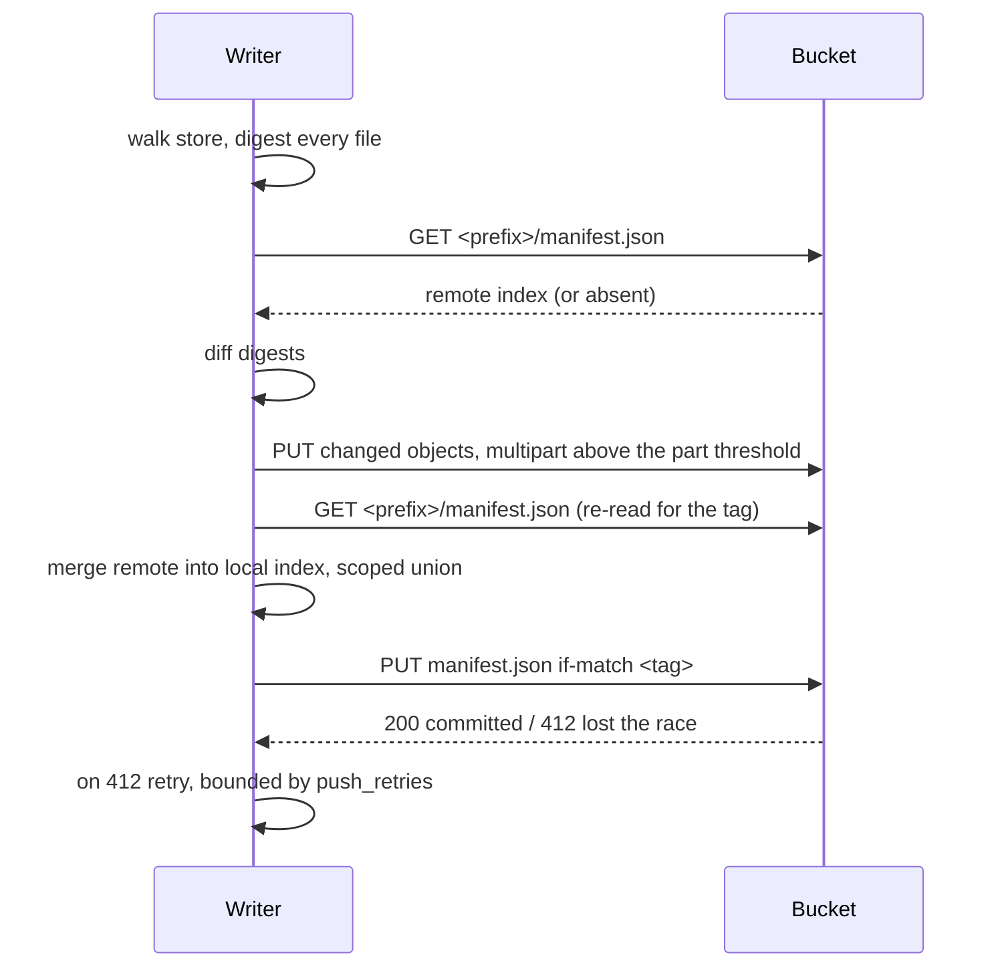
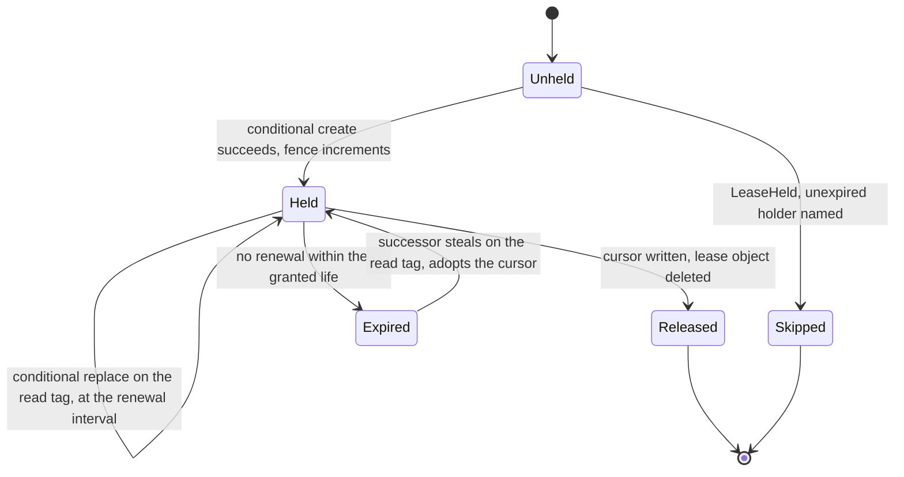

# Sync, leases and replicas

A store reaches an S3-compatible bucket as a mirror of itself. This file carries the wire
format, the ordering of a push and a pull, how a deployment learns what its backend
guarantees, how two writers reconcile one index, the lease that serializes a cursor, and
the read replica.

## Parties

| Party | Obligation |
| --- | --- |
| **The pushing writer** | Uploads every object ahead of the index naming it, confines each key to the deployment's prefix, and commits the index by compare-and-set over a merge of the remote. |
| **The object store** | Demonstrates its conditional-write behavior to a live probe inside that prefix, or stands declared as a single-writer backend. |
| **The pulling machine** | Lands every data object ahead of replacing its catalog, and folds arriving run records forward rather than reconstructing the whole cache. |
| **The lease holder** | Takes one lease per pipeline, renews it for the life of the run, and carries the committed cursor position back to the object beside the lease. |
| **The replica** | Answers from whole Parquet of each snapshot it holds, rebuilds its own run bookkeeping from the file tree, and sends every write to the canonical store. |
| **The operator** | Binds the prefix and the node id in the deployment environment, and names one compaction owner per store. |

## Operations

| Operation | What it governs |
| --- | --- |
| `push` | The bucket wire format, the reserved index, prefix confinement, and the ordering that makes a push a commit. |
| `pull` | Fetching the index, downloading by digest, replacing the catalog, and reconciling before a run. |
| `probe` | Measuring a backend's conditional-write behavior with a live sentinel, and the coordination mode that measurement resolves. |
| `merge` | Reconciling one index between writers: the scoped union, the per-class conflict rules, and the writer node id the ownership arms key on. |
| `lease` | Single-writer exclusion over a pipeline, its two implementations, its fencing token, and the cursor position riding beside it. |
| `replicate` | A consuming replica of the bucket: what it holds whole, what it declines, and what it rebuilds. |

## Clauses — push

A push walks the store, uploads what the bucket lacks, and finishes by writing the index
that makes the new objects visible.

| Clause | Statement | decided-by |
| --- | --- | --- |
| `sync.push.shape.wire-format` | The bucket layout mirrors the store layout one to one: a relative key beneath the prefix equals the relative path beneath the store root, forward-slash separated, carrying no leading separator and no parent reference. | |
| `sync.push.shape.bucket-manifest` | A reserved `manifest.json` at the prefix root maps each relative key to its SHA-256 digest and its byte size. It is the one object a consumer reads to learn what the deployment holds. | |
| `sync.push.invariant.index-is-derived` | The bucket manifest is a pure function of the file tree it describes. Recomputing it over an unchanged tree reproduces the same bytes, so the index is never a second source of truth about what exists. | |
| `sync.push.workflow.upload-sequence` | One push walks the store, computes a digest per file, compares each against the remote bucket manifest, uploads the new and the changed, and writes the bucket manifest last. | |
| `sync.push.invariant.commit-point` | Writing the bucket manifest is the commit point. A consumer that reads it observes a tree every key of which already landed durably, and a push interrupted before that write leaves the previous index intact. | |
| `sync.push.limit.multipart-threshold` | An object larger than 5 MiB uploads as multiple parts; smaller objects upload in one request. | |
| `sync.push.invariant.prefix-confines-a-key` | `[sync] prefix` confines every key a deployment reads and writes to `<prefix>/`, giving that deployment its own bucket manifest and its own listing. Unset, the store lands at the bucket root, which is the single-deployment shape. | |
| `sync.push.invariant.confinement-has-one-implementation` | Prefix confinement is applied once inside the object-store wrapper, so every backend inherits it and a key has one place to fail to be scoped. | |
| `sync.push.refusal.escaping-key` | A key resolving outside the configured prefix raises `SyncPrefixEscape`, naming the key and the prefix it left. | `0027` |
| `sync.push.interface.prefix-binding` | `prefix_from = "env:<NAME>"` binds the prefix from the process environment at start, so one image serves many deployments from one build. | |
| `sync.push.refusal.unbound-prefix` | An unset variable named by `prefix_from` raises `SyncPrefixUnbound` at startup rather than falling back to the bucket root. | `0027` |
| `sync.push.refusal.two-prefix-sources` | Declaring `prefix` and `prefix_from` together raises `SyncPrefixOverspecified`. One value takes one source. | `0027` |
| `sync.push.invariant.unscoped-root-collision` | Deployments sharing a bucket with no distinct prefixes collide on the reserved root index: each push writes an index of its own files alone, the last writer's index hides the other deployments' tables, and their data objects survive under their own keys unlisted. | |
| `sync.push.invariant.bookkeeping-prefixes-carry-no-rows` | `leases/` and `cursors/` sit on the row-free bookkeeping allowlist, so the first lease object written into a bucket leaves a withheld table's push unaffected. | |
| `sync.push.workflow.offline-diagnostics` | `contextful sync diagnose` and `contextful sync manifest` read a file tree and an index and land no row, so neither verifies an ambient credential and neither fails when that credential is the broken thing. | |
| `sync.push.interface.push-line-carries-the-mode` | Every push line prints the resolved coordination mode alongside the object counts it uploaded and skipped. | |
| `sync.push.invariant.digest-decides-an-upload` | An object whose local digest equals the entry the remote index carries is skipped. Size alone never stands in for the digest. | |
| `sync.push.refusal.concurrent-local-push` | Two pushes of one store from one machine raise `SyncPushInFlight`; the second names the holder of the push guard. | `0028` |

A table withheld from the bucket entirely is [`spec/41-enforcement.md` § Redistribution
bound](41-enforcement.md); push applies that exclusion ahead of computing its diff.

## Clauses — pull

A pull is the mirror image with the catalog moved to the end.

| Clause | Statement | decided-by |
| --- | --- | --- |
| `sync.pull.workflow.fetch-diff-download` | A pull fetches the remote bucket manifest, diffs its entries against local digests, and downloads the differing objects in parallel. | |
| `sync.pull.invariant.catalog-lands-last` | The local catalog is replaced after every data object has landed, so a pull interrupted partway leaves a catalog describing a tree that is still wholly present. | |
| `sync.pull.invariant.catalog-arrives-as-a-replacement` | A remote copy of the catalog replaces the local one wholesale and is never merged into it, since the catalog is a cache of one machine's own bookkeeping. | |
| `sync.pull.interface.pull-before-run` | `[sync] pull_before_run` reconciles against the bucket ahead of landing rows. It is on by default wherever the resolved coordination mode is `cas`. | |
| `sync.pull.invariant.reconcile-excludes-the-catalog` | A pull-before-run fetches every object the index names apart from the machine's own catalog file, which holds that machine's journal, cursor and lease state. | |
| `sync.pull.invariant.arriving-runs-read-without-the-catalog` | Run directories arriving from the bucket are queryable the moment they land: the read path discovers a committed run by walking its marker file in the tree rather than by consulting the cache. | |
| `sync.pull.workflow.fold-the-catalog-forward` | After a pull the catalog is folded forward by inserting the walked run records with conflicts ignored. | |
| `sync.pull.refusal.rebuild-inside-a-pull` | A full cache reconstruction invoked as part of a pull raises `SyncCatalogRebuildDuringPull`. A reconstruction drops every cache table, which carries this machine's cursor positions and the lease of whatever sits mid-run on it. | `0029` |
| `sync.pull.invariant.download-is-content-addressed` | An object is fetched when the index entry's digest differs from the local file's digest, and at no other time, so a pull over an unchanged index transfers the index alone. | |
| `sync.pull.refusal.digest-mismatch` | A downloaded object whose computed digest differs from the entry that named it raises `SyncObjectDigestMismatch` and the object is discarded rather than written into the tree. | `0030` |
| `sync.pull.limit.convergence-rounds` | When a key the index named disappears mid-download, the pull re-fetches the index and retries the shortfall, up to 3 attempts. | |
| `sync.pull.refusal.unconverged-pull` | Exhausting the convergence rounds raises `SyncPullDidNotConverge`, naming the key that kept moving, and leaves the local catalog untouched. | `0030` |
| `sync.pull.invariant.pull-is-repeatable` | Running a pull twice against one index produces the same tree as running it once. | |

Cursor kinds, and engine ownership of every advance of a cursor position, are
[`spec/30-run.md` § Cursors](30-run.md); a pipeline's declared kind decides whether it
takes a lease here. The pull that warms a serving container ahead of its first request is
[`spec/50-control-plane.md` § Warm start](50-control-plane.md).

## Clauses — probe

What a backend does with a conditional write is measured against the live endpoint, inside
the prefix the deployment writes to.

| Clause | Statement | decided-by |
| --- | --- | --- |
| `sync.probe.invariant.capability-is-measured` | Whether a backend performs an atomic conditional write is decided by a live probe against the configured endpoint, and by no configuration table, product name or client dialect. | |
| `sync.probe.shape.sentinel-key` | The probe writes its sentinel under `_contextful/cas-probe/` inside the deployment's configured prefix, so the credential exercised is the credential a push uses. | |
| `sync.probe.workflow.probe-sequence` | The probe creates the sentinel, issues a second conditional create and a conditional replace against a fabricated tag, reads the object back, and deletes it. | |
| `sync.probe.limit.losing-writes` | The second create and the tag-mismatched replace both lose, which is 2 attempts the endpoint rejects before the capability counts as demonstrated. | |
| `sync.probe.invariant.bytes-are-read-back` | The sentinel is read back after the losing writes and its bytes are compared against what the winning create wrote. A backend that answers success while ignoring the precondition is caught here and nowhere else. | |
| `sync.probe.refusal.inconclusive-outcome` | An unsupported-method response, a forbidden response from a read-only credential, and a transport error each raise `SyncProbeInconclusive`, and every one of them reads as capability not demonstrated. | `0031` |
| `sync.probe.interface.coordination-setting` | `[sync] coordination` takes `cas` or `single-writer`. Left unset, the resolved mode derives from the probe outcome. | |
| `sync.probe.refusal.declared-cas-undemonstrated` | Naming `cas` against a backend whose probe did not demonstrate the capability raises `SyncCoordinationUnproven` and the push stops rather than degrading to an unserialized write. | `0031` |
| `sync.probe.invariant.single-writer-skips-the-probe` | Declaring `single-writer` performs no probe at all, costing no round trip and requiring no write permission on the probe path. | |
| `sync.probe.invariant.read-only-credential-lands-on-the-machine-lease` | A capable backend reached with a credential that cannot write returns an inconclusive probe, and that deployment coordinates through the per-machine lease instead of the bucket lease. | |
| `sync.probe.invariant.probe-runs-once` | The probe runs once per process at startup and its outcome is held for the life of that process. | |
| `sync.probe.invariant.sentinel-does-not-persist` | The sentinel is deleted at the end of a successful probe, and a sentinel left behind by an interrupted probe is overwritten by the next one rather than read as state. | |
| `sync.probe.interface.resolved-mode-is-reported` | `contextful sync diagnose` reports the resolved mode, the probe outcome that produced it, and whether the setting or the measurement decided. | |

Catalog compare-and-swap as the coordination primitive across the two halves of the
workspace is [`spec/01-topology.md` § Coordination](01-topology.md); a bucket lease is that
same primitive relocated into the object store.

## Clauses — merge

Two writers against one bucket meet at the index. The merge is what a compare-and-set
commits.

| Clause | Statement | decided-by |
| --- | --- | --- |
| `sync.merge.invariant.commit-is-compare-and-set` | The index commit is a compare-and-set over a merge of the remote index. A writer losing the race re-reads, re-merges and re-commits rather than replacing the winner's entries. | |
| `sync.merge.invariant.scoped-union` | The remote contributes an entry to the merged index where this writer has never written, and nowhere else. | |
| `sync.merge.shape.foreign-key-shapes` | Three key shapes count as another writer's: a run directory whose node segment is another node id, a request-ledger filename carrying another node id, and any key outside those trees that this writer's own index does not name. | |
| `sync.merge.invariant.deletion-propagates` | An entry this writer owns and no longer holds locally drops out of the merged index, which is how snapshot garbage collection and run retention reach a consumer. | |
| `sync.merge.limit.commit-retries` | `[sync] push_retries` bounds the re-read-and-re-commit loop at 5 attempts. | |
| `sync.merge.refusal.retries-exhausted` | Exhausting the commit retries raises `SyncManifestRebaseExhausted`, reports that every uploaded object is already in the bucket, and asks for a re-run rather than committing an index it did not rebase. | `0032` |
| `sync.merge.invariant.merge-runs-in-both-modes` | The merge is performed under both coordination modes. The compare-and-set is the part that makes a concurrent commit safe, not the part that makes the union correct. | |
| `sync.merge.invariant.run-objects-union` | Run files and request-ledger files union across writers, their identifiers being unique and their paths or filenames carrying the writing node. | |
| `sync.merge.invariant.snapshot-objects-take-the-local-side` | Snapshot entries resolve to this writer's, one writer owning a table's snapshot tier as a unit and a snapshot being a recomputable fold over run files the union already carries. | |
| `sync.merge.invariant.catalog-resolves-at-the-key` | Catalog entries resolve to this writer's at the key level, the catalog being a cache each machine reconstructs from the tree. | |
| `sync.merge.invariant.schemas-reconcile-on-the-next-write` | Table schema objects carry no merge rule of their own: two writers' schemas reconcile when the next write lands and reconciliation runs over the merged shape. | |
| `sync.merge.refusal.cursor-by-recency` | A cursor entry resolved by whichever copy was written last raises `SyncCursorConflict`. A cursor resolves by its declared kind, which permits no concurrent advance that skips records. | `0033` |
| `sync.merge.invariant.every-owned-tier-has-an-arm` | Each writer-owned tier carries its own ownership arm in the merge. A key shape falling through to the unowned default is one whose local deletion reaches no consumer, so the request ledger spells its node in the filename rather than in a path segment. | |
| `sync.merge.interface.grant-projected-section` | The sync edge projects the per-table section of the bucket manifest by the same table grants as the file list, so a capability-scoped replica reads no other table's contract metadata. | |
| `sync.merge.interface.consumer-reads-the-index-alone` | A bucket consumer asserts contract identity and derives staleness from the bucket manifest against its own clock, with no engine in the loop. | |
| `sync.merge.workflow.offline-manifest-emit` | `contextful sync manifest --emit <path>` writes the same section offline, so a consumer's gate asserts against a producer-generated artifact ahead of any bucket existing. | |
| `sync.merge.invariant.node-id-resolution-order` | A machine's writer node id resolves once per process: `CONTEXTFUL_NODE_ID`, then `[node] id` in the project configuration, then a random `node-<8 hex>` generated once and persisted. | |
| `sync.merge.shape.node-id-state-path` | The generated node id persists at `$CONTEXTFUL_STATE_DIR`, else `$XDG_STATE_HOME/contextful`, else the platform user-state directory for the process owner. | |
| `sync.merge.invariant.node-id-sits-outside-the-store-root` | The node id is persisted outside the store root, so copying a store onto a second machine carries no identity with it and two machines never present one holder. | |
| `sync.merge.limit.node-id-length` | A node id spans 64 chars at most. | |
| `sync.merge.refusal.node-id-shape` | A node id outside `^[A-Za-z0-9._-]{1,64}$` raises `SyncNodeIdInvalid`, the value being interpolated into a directory name and into a filename. | `0034` |
| `sync.merge.refusal.node-id-under-control-plane-config` | A node id declared in a control-plane configuration raises `SyncNodeIdShared`, a control-plane snapshot being applied to every machine reconciling it. | `0034` |
| `sync.merge.invariant.node-segment-disjoins-a-run` | The node id segment inside a run path is what keeps two machines writing one logical run from colliding on identical part filenames. | |

## Clauses — lease

A lease serializes the one operation the data plane cannot absorb twice: advancing a
cursor a source hands out as a token.

| Clause | Statement | decided-by |
| --- | --- | --- |
| `sync.lease.interface.one-port-two-implementations` | Leasing sits behind one port with two implementations, selected by the resolved coordination mode and by whether a bucket is configured. | |
| `sync.lease.invariant.machine-lease-is-the-default` | The default lease is a row in the machine's own catalog, which serializes processes on that machine and nothing beyond it. | |
| `sync.lease.shape.bucket-lease-object` | The bucket lease is a sentinel object at `leases/<pipeline_id>.json` carrying the holder's node id, the acquisition instant, the expiry instant and the fencing token. | |
| `sync.lease.invariant.acquisition-is-a-conditional-create` | A bucket lease is taken with a conditional create, so two machines reaching an unheld pipeline at once produce one holder and one loser. | |
| `sync.lease.invariant.renewal-is-tag-checked` | A renewal and a steal are both a conditional replace against the entity tag just read. The tag check is what makes noticing an expiry and taking the lease one indivisible step between two machines that notice together. | |
| `sync.lease.limit.ttl` | A lease is granted for 10 min and expires without action from anyone. | |
| `sync.lease.limit.renewal-interval` | A holder renews every 200 s, a third of the granted life, so a seed or a backfill running longer than one grant keeps its hold mid-write. | |
| `sync.lease.refusal.held-lease` | A run finding an unexpired lease raises `LeaseHeld`, naming the holder and the expiry instant, is skipped, and is attempted again on the next reconciliation tick. | `0028` |
| `sync.lease.invariant.expiry-frees-a-crashed-holder` | A lease left behind by a machine that stopped expires on its own, so a crash locks nobody out past the granted life. | |
| `sync.lease.shape.fencing-token` | Acquisition yields a fencing token that increases monotonically per pipeline, and the holder stamps it on each object it commits under that pipeline. | |
| `sync.lease.refusal.stale-fence` | A commit whose fencing token is below the one the lease object carries raises `LeaseFenced`, so a holder that paused past its expiry lands nothing after a successor took over. | `0035` |
| `sync.lease.refusal.release-by-a-non-holder` | Releasing a lease whose holder is another node id raises `LeaseNotHeld` and leaves the object untouched. | `0028` |
| `sync.lease.shape.cursor-object` | The committed cursor position rides at `cursors/<pipeline_id>.json` beside the lease it belongs to. | |
| `sync.lease.invariant.cursor-travels-with-the-lease` | A cursor position is written at release and adopted at acquisition, so the next holder resumes from where its predecessor stopped rather than from a private position of its own. | |
| `sync.lease.refusal.wrong-cursor-kind-in-the-prefix` | A cursor value whose kind takes no lease, reaching the `cursors/` prefix, raises `LeaseCursorKindMismatch`; the values that live there are the ones a single writer has to agree on. | `0033` |
| `sync.lease.refusal.unresolved-node-id` | The bucket lease refuses the fallback node id `local` by name, raising `LeaseNodeIdLocal`, keeping that machine on the per-machine lease and logging the environment variable that fixes it. | `0034` |
| `sync.lease.invariant.holder-identity-is-the-node-id` | A lease holder is identified by node id alone, so re-entrancy is scoped to one machine and two machines presenting one identity is the failure the identity rules exclude. | |
| `sync.lease.invariant.one-compaction-owner` | Compaction is the operation that is not append-only, and exactly one machine owns compaction for a store. | |
| `sync.lease.refusal.second-compaction-owner` | A compaction pass started on a machine the store does not name as its compaction owner raises `SyncCompactionNotOwned`. Two machines folding one table at once is the path by which committed rows are lost. | `0036` |
| `sync.lease.invariant.three-mechanisms-for-a-second-writer` | A bucket written from more than one machine holds three mechanisms together: reconcile before a run, a bucket-held write lease, and a rebase of the index on a losing commit. Any one of them alone leaves a writer publishing an index that omits the other's objects. | |
| `sync.lease.invariant.lease-state-stays-local` | Lease and cursor state in the machine's catalog is never overwritten by a reconcile, that file being excluded from the objects a pull-before-run fetches. | |

## Clauses — replicate

A replica consumes the bucket and answers reads from it.

| Clause | Statement | decided-by |
| --- | --- | --- |
| `sync.replicate.invariant.replica-is-read-only` | A replica's catalog is a local materialized cache rather than a source of truth, and every write travels to the canonical store. | |
| `sync.replicate.refusal.write-through-a-replica` | A write verb invoked against a replica raises `ReplicaWriteRefused`, naming the canonical store the deployment configuration points at. | `0037` |
| `sync.replicate.workflow.refresh-is-a-diff` | A refresh fetches the top-level index, diffs it against local digests, downloads the changed snapshot directories together with their sidecars, and swaps the current-snapshot pointer. | |
| `sync.replicate.invariant.absence-costs-one-snapshot` | A replica returning after a long absence fetches one current snapshot per affected table rather than the history in between, the refresh being a diff of content digests rather than a replay of commits. | |
| `sync.replicate.invariant.pointer-swap-is-indivisible` | The current-snapshot pointer moves in one step, and a query already running finishes against the pointer it started on. | |
| `sync.replicate.refusal.partial-parquet` | A replica holding a strict subset of a snapshot's Parquet raises `ReplicaPartialParquet` at refresh. Data files of one snapshot arrive together or the snapshot stays unpublished on that replica. | `0038` |
| `sync.replicate.invariant.sidecar-subset-is-legal` | A replica legitimately holds a subset of a snapshot's sidecar indexes, each sidecar being derivable from the data files beside it. | |
| `sync.replicate.refusal.missing-sidecar` | A query needing an index or a partition the replica does not hold raises `ReplicaMissingIndex` and names the refresh that supplies it, rather than answering from what is present. | `0038` |
| `sync.replicate.invariant.sensitive-tables-are-off-by-default` | A table declaring sensitive columns carries replicate-off by default, so the ordinary refresh moves no copy of it onto a consumer machine. | |
| `sync.replicate.refusal.sensitive-table-direct` | A refresh requesting a replicate-off table raises `ReplicaSensitiveTable`, and a consumer needing those columns reads them through the proxying face instead of holding the files. | `0039` |
| `sync.replicate.interface.proxying-face` | The proxying face answers over the canonical store: it verifies the presented credential, returns projected rows rather than file handles, and records each read. | |
| `sync.replicate.workflow.rebuild-what-is-not-received` | A replica reconstructs its run bookkeeping from the file tree with `contextful context rebuild-catalog`, the read path having discovered each committed run by its marker file already. | |
| `sync.replicate.invariant.replica-loses-nothing-unrebuildable` | Everything a replica does not receive is derivable from the objects it does receive, so a refusal to ship the cache costs a rebuild and no data. | |
| `sync.replicate.interface.object-selection-follows-the-grant` | A replica's object selection is driven by the table patterns its pulling credential carries, the same matcher that decides which tables register as relations for a caller. | |

Column-grain filtering of a replica by the pulling credential, and the redistribution bound
that keeps a table out of the bucket altogether, are
[`spec/41-enforcement.md` § Sync edge](41-enforcement.md); a replica receives the slice its
credential admits. Erasure markers reaching a replicated table are
[`spec/44-accountability.md` § Erasure](44-accountability.md); a refresh carries them like
any other object.

unsettled: Where does a replica advertise the sidecars and partitions it holds — a per-replica descriptor beside its catalog, or a central row making holdings queryable? owner: sync affects: sync.replicate

## Shapes

The bucket beneath one deployment's prefix:

```
<prefix>/
  manifest.json                              key -> { sha256, size }
  _contextful/cas-probe/<uuid>               probe sentinel, deleted on success
  leases/<pipeline-id>.json                  bucket lease object
  cursors/<pipeline-id>.json                 committed cursor position
  <project>/
    config.toml
    meta.sqlite                              excluded from a pull-before-run
    tables/<table>/
      schema.json
      data/runs/<run-id>/<node-id>/…
      data/snapshots/<snapshot-id>/…
      requests/<run-id>.<node-id>.parquet
```

Sync configuration:

```toml
[sync]
bucket        = "context-prod"
endpoint      = "https://s3.example-region.internal"
region        = "example-region"
prefix_from   = "env:CONTEXTFUL_SYNC_PREFIX"
coordination  = "cas"
push_retries  = 5
pull_before_run = true

[node]
# resolution order: CONTEXTFUL_NODE_ID, then this key, then a persisted random id
id = "ingest-a"
```

The bucket manifest, and the per-table section a consumer reads:

```json
{
  "generated_at": "<instant>",
  "node_id": "ingest-a",
  "keys": {
    "acme/tables/filings/data/snapshots/snapshot-00000000001709283262000000000/part-00000.parquet":
      { "sha256": "b7c1…", "size": 4194304 }
  },
  "tables": {
    "filings": {
      "contract_version": "3",
      "schema_fingerprint": "sha256:91af…",
      "build_id": "bld-2f7c",
      "last_built_at": "<instant>",
      "watermark": "<instant>",
      "max_lag": "PT30M",
      "last_build_status": "published"
    }
  }
}
```

The lease object and the cursor object beside it:

```json
{ "holder": "ingest-a", "acquired_at": "<instant>",
  "expires_at": "<instant>", "fence": 418 }
{ "kind": "opaque-token", "value": "eyJwYWdlIjo0Mn0", "committed_at": "<instant>", "fence": 418 }
```

Push, from the walk to the committed index:



Lease acquisition and the cursor riding with it:



## Unsettled

unsettled: What is the recovery path when a pull's convergence rounds are exhausted by pushes arriving faster than the re-fetch shrinks the shortfall? owner: sync affects: sync.pull

unsettled: How does a consumer discover which bucket-manifest format version a prefix carries, and what does it do when that version is ahead of the one it parses? owner: sync affects: sync.merge

unsettled: What does active-active writing look like, given that the data plane is append-only and a second compaction owner is the one path to losing committed rows? owner: sync affects: sync.lease
