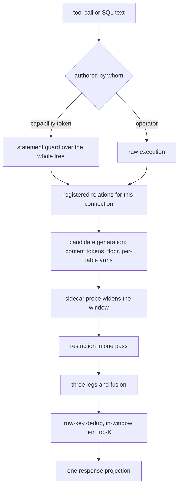

# The read face

Every question a caller asks of a store arrives here: the relations a connection sees, the
statement it sends, the candidates a question generates, their order, and the one envelope
that carries them. A read lands no row and holds no lease. Restriction arrives already
composed into each registered relation; this face consumes index sidecars and builds none.

## register

| Clause | Statement | Why |
| --- | --- | --- |
| `read.register.connection-views` | Ahead of a statement the engine opens a connection and issues one create-or-replace view per table the manifests name, each scanning {{store.reconcile.explicit-file-list}} No view directory exists on disk. | — |
| `read.register.engine` | The executor is an embedded columnar SQL engine, linked into every profile that serves reads, reading Parquet natively in standard SQL. An external process reads the same files with the engine uninstalled. | D47 |
| `read.register.quiet-table` | A quiet table registers as {{store.declare.empty-run}} A read of it returns an empty result, never a missing-relation fault. | P4 |
| `read.register.bare-name` | A bare table name in any read — a caller statement, a template body, a ranking arm, a file preview — resolves to the caller's registered relation, which carries the caller's restriction. | P5 |
| `read.register.tool-set` | The face exposes a closed tool set: `context.describe`, `context.query`, `context.execute_query` for templates, `context.files` and `context.file` over committed data files, and `corpus.retrieve` for ranked reads across a prefix. | D10 |
| `read.register.describe-payload` | `context.describe` returns row count, schema fingerprint, description, per-column hints, declared indexes, partition scheme, `limits.max_rows`, zone label, lexicon and example queries. | — |
| `read.register.advertised-is-enforced` | A table's published `limits` block lists a bound exactly when the engine applies it. | because a published number and a delivered guarantee cannot disagree when one derives from the other |
| `read.register.template-projection` | Every manifest template projects into a tool named by its identifier, whose declared positional parameters form a typed schema with every field required. | — |
| `read.register.file-listing` | `context.files` returns store-root-relative paths for the tables the caller reads, and a table outside that set contributes no path. | P5 |
| `read.register.file-preview-target` | `context.file` resolves a path to its `(table, run_id)` and reads it through that table's registered relation. A snapshot part, a traversal, an absolute path or a ledger file raises `FilePreviewNotATable`. | D10 |
| `read.register.ledger-relation` | Each table's per-run request ledger registers as the child relation `<table>__requests`, holding identifiers, connector, method, host, status and timing of mediated outbound calls. | — |
| `read.register.scoped-ledger` | The child relation registers on the owner read alone. A tenant-scoped token naming it raises `LedgerNotTenantScoped`, stating what closed the relation. | D10 |
| `read.register.lexicon-surface` | The describe payload carries the store's numeric-identifier and badge vocabulary. Aliases, time-window phrases and distillation examples stay on the serving side. | — |
| `read.register.reserved-relation` | The engine's reserved table namespaces register like any other relation, with no privileged path underneath. | P5 |

unsettled: Is a cross-table join worth a first-class retrieval call, or does an operator-defined view plus the describe payload stay the route? owner: read-path affects: read.register

unsettled: What corpus-size and token metadata does the describe payload expose, so a client can choose between a full-context read and a ranked one? owner: read-path affects: read.register

unsettled: Is a tenant-scoped projection of the request ledger worth building, given the tenant dimension has to reach ledger rows first? owner: read-path affects: read.register

## guard

| Clause | Statement | Why |
| --- | --- | --- |
| `read.guard.single-read-only-statement` | Admitted text parses to exactly one read-only SELECT. Attach, copy, install, load, pragma, set, any schema change, any data modification and a piggybacked second statement raise `StatementNotReadOnly`. | D10 |
| `read.guard.engine-own-parse` | The guard walks the syntax tree the engine itself serializes for the statement; read-only-ness is a property of that tree, not a keyword blocklist. | because guard and executor cannot disagree about what a text means when they share one parse |
| `read.guard.relation-allowlist` | Every base relation names a view registered for this caller or a common table expression the statement declares. A bare file path is a base relation and falls under this rule. | D10 |
| `read.guard.whole-tree-walk` | The walk covers the entire tree — select-list subqueries, union arms, pivot sources — and gathers common-table-expression names across the tree before checking any base relation. | — |
| `read.guard.unregistered-relation` | A base relation naming nothing this connection registered is refused by {{authority.refuse.ungranted-table}}, echoing what the statement asked for and no relation of another caller. | D10 |
| `read.guard.table-function` | A table function anywhere in the tree, and a schema-qualified reach into a system catalog, raise `TableFunctionRefused`. | D10 |
| `read.guard.statement-provenance` | Admission binds on who authored the text. Operator text — the local command line, template bodies, engine-composed reads — runs raw; capability-token caller text is gated. The raw surface is reachable from no network face. | D10 |
| `read.guard.quoted-identifiers` | Every schema- or manifest-derived identifier is double-quoted where rendered, admitting any UTF-8 vendor field name as an identifier and never as an expression. | — |
| `read.guard.template-declaration` | A template declares an identifier, one SQL statement, positional parameters written `name:type` over integer, float, string, timestamp and boolean, and an optional row ceiling. | — |
| `read.guard.template-relation-shape` | Manifest validation and face startup refuse a template whose SQL names anything but the store's own tables as plain identifiers, or whose identifier collides with a built-in tool prefix, raising `TemplateNamesForeignRelation`. | D10 |
| `read.guard.template-binding` | A missing, unknown or type-mismatched argument raises `TemplateArgumentRejected` ahead of execution, with no coercion. Placeholders cover exactly the declared parameters. | D10 |
| `read.guard.startup-time-check` | Template checks are caller-independent and run once at startup; a request pays nothing for them. | — |

## respond

| Clause | Statement | Why |
| --- | --- | --- |
| `read.respond.one-projection` | The command line's JSON output, the HTTP face and the tool protocol serialize one projection: `columns`, `rows`, `truncated`, and the optional restriction, resolved-build, provenance, retrieval and time-bound blocks. | because a guarantee landing on one transport and missing on another is worse than a guarantee on none |
| `read.respond.row-ceiling` | A per-table row ceiling published as `limits.max_rows` bounds rows delivered, applied at execution with an over-fetch of 1 rows. It bounds no work performed. | — |
| `read.respond.truncation-is-exact` | `truncated` is set exactly when the over-fetched probe row is present, never by comparing a returned count against a requested limit. | P4 |
| `read.respond.cell-encoding` | SQL NULL is JSON `null` and nothing else is. Non-finite floats are `"NaN"`, `"inf"`, `"-inf"`; temporal values are ISO-8601 strings, intervals ISO-8601 durations; binary is `\xAA` hex; an enum is its label; a container is its text form. | — |
| `read.respond.wide-number-shape` | A column's JSON encoding follows its SQL type alone: integers of 32 bits or fewer, finite floats and decimals of 15 digits or fewer are numbers; wider integers and decimals are exact decimal strings. | because a wire type that varies with the values on one page breaks a typed client on the next |
| `read.respond.type-is-the-cell` | No separate type list rides the envelope; a cell's JSON type is the declaration. | — |
| `read.respond.zero-rows-is-success` | Fewer rows than the requested limit, zero included, is a success. | P2 |
| `read.respond.match-count` | Match counts ride outside the internals opt-in, reporting how many rows the ranker scored as matching in the same call. | — |
| `read.respond.coverage-is-a-count` | A claim that the corpus lacks coverage of a subject comes from a count over the table with no recency truncation, taken after the full-scan fallback, never from a ranked top score. | because min-max normalization pins the best row at 1.0 and IDF lifts one incidental rare-term mention |
| `read.respond.internals-opt-in` | Executed SQL, engine name, applied limit, row count and elapsed milliseconds ride a separate object returned only under `internals: true`, on every read tool and the HTTP face. | — |
| `read.respond.operator-metadata` | Operator-surface table metadata carries column count and backing file list; a row count is an ordinary count query, never a stored field. | P3 |
| `read.respond.in-band-error` | On the tool protocol a refusal arrives in-band, as a protocol error object or a result flagged as an error under transport success. | P2 |
| `read.respond.paths-stay-inside` | An ordinary read's result carries no store path. Provenance arrives as columns naming table, run, connector version, ingestion instant and authoring subject. | D37 |

unsettled: When does a duration ceiling become enforceable, and publishable in the per-table limits block beside the row ceiling? owner: read-path affects: read.respond

unsettled: Does partial-result streaming belong on this surface, or does a full result set stay the one response shape? owner: read-path affects: read.respond

## retrieve

| Clause | Statement | Why |
| --- | --- | --- |
| `read.retrieve.ranked-call` | `corpus.retrieve({prefix, query, query_embedding?, kinds, limit, as_of})` returns the top rows across the item and artifact genres under one prefix, each with a snippet and full provenance. It composes the query surface and memory recall and stores nothing of its own. | — |
| `read.retrieve.relevance-floor` | A row reaches a caller when its lexical score is null, at least the floor, or its vector score exceeds zero. The floor is 2 for three or more content tokens, else 1; a caller minimum overrides it. | — |
| `read.retrieve.content-tokens` | The query text is lowercased and split on non-alphanumeric characters. Stop tokens drop, non-ASCII runs of two or more characters stay, and survivors deduplicate in order. | — |
| `read.retrieve.token-length-floor` | An ASCII run shorter than 2 chars leaves the content-token set. | — |
| `read.retrieve.token-cap` | The content-token set holds at most 12 tokens. An empty set omits the relevance predicate. | — |
| `read.retrieve.script-split-matching` | An all-lowercase-alphanumeric token matches on an ASCII word boundary with an optional plural suffix; a token with any non-ASCII character matches by containment. | because no ASCII word boundary occurs beside an ideograph |
| `read.retrieve.plural-suffix-floor` | A token under 4 chars takes no optional plural suffix. | — |
| `read.retrieve.text-free-table-scores-null` | A table with no snippet-worthy text column scores lexically null, never zero, and its rows enter by vector score alone. | P4 |
| `read.retrieve.candidate-window` | The candidate window is 8 times the requested limit or 200 rows, whichever is larger. Candidates equal to the window report that the ranking saw a recency-ordered slice. | P4 |
| `read.retrieve.reserved-columns-project-null` | Reserved projected columns — modality, language, prompt hash, kind — render null for a table lacking them, and its rows stay in the union. | — |
| `read.retrieve.unsatisfiable-arm-drops` | `filter` binds caller-named columns. A table lacking a named column drops its arm, never emitting it unfiltered. | P4 |
| `read.retrieve.engine-resolved-date` | The engine resolves each table's publication column itself, outside the caller's filter. | — |
| `read.retrieve.filter-budget` | A filter's membership list holds at most 256 entries, with its condition count and total byte size bounded alongside. | — |
| `read.retrieve.filter-budget-refusal` | The budget is checked over the whole filter ahead of building any arm; an oversized or malformed condition raises `FilterBudgetExceeded` for the whole read. | D10 |
| `read.retrieve.row-key-dedup` | A ranked read keeps one row per `(table, row key)`, newest ingestion first. The row key is the declared content-hash column, else null, never a digest over projected values. | — |
| `read.retrieve.row-key-stays-internal` | The row key is absent from the outer projection. | — |
| `read.retrieve.dedup-is-gated` | The deduplicating window function runs under the same condition as the relevance floor, and a browse-shaped read skips it. | — |
| `read.retrieve.snippet` | A snippet concatenates up to three text columns: label-priority columns — title, summary, description, thesis and kin — first, then prose-worthy columns in schema order. | — |
| `read.retrieve.identifiers-never-snippet` | Content hashes, URLs, identifiers and instant-valued columns never qualify for a snippet. | — |
| `read.retrieve.sidecar-generates-candidates` | The vector sidecar arm adds its top results to the recency window, each re-joined by {{authority.compose.vector-arm}}. Per-row scores equal the exact path's. | P5 |
| `read.retrieve.sidecar-oversampling` | One probe requests 4 times the limit or 64 rows, whichever is larger, times 4 again where the request carries restriction context. | — |
| `read.retrieve.sidecar-size-cap` | A sidecar holding more than 64 MiB of stored vectors stays unloaded and the arm takes the exact scan. | — |
| `read.retrieve.sidecar-falls-back` | Any sidecar precondition failure — no snapshot, no matching sidecar, a multi-column or masked key, a dimension or manifest mismatch, an unreadable dump, mixed producers — falls back to the exact scan. | P4 |
| `read.retrieve.gain-never-loss` | For one reader the accelerated arm returns a superset of the exact path's rows. Two readers with one query on one snapshot can recall different rows. | — |

unsettled: What adaptive over-fetch policy holds where rows a reader cannot see cluster near a query point and the visibility estimate under-fills the requested top-K? owner: read-path affects: read.retrieve

## rank

| Clause | Statement | Why |
| --- | --- | --- |
| `read.rank.three-legs` | Ranking runs exact cosine similarity over the candidate set, BM25 over a full-text index, and a weighted fusion of the two. | — |
| `read.rank.fusion` | Fusion computes `w_vec · clamp(cosine, 0, 1) + w_lex · minmax(bm25)` with default weights 0.6 and 0.4. A document absent from one leg scores zero there; ties break by identifier. | — |
| `read.rank.lexical-leg-matches-only` | The BM25 leg ranks a disjunction of should-clauses; a document matching no term is absent. An empty query, candidate set or result yields an empty ranking that falls back to recency order. | — |
| `read.rank.flat-window-full-credit` | A lexical window with no score spread awards every present document full credit. | — |
| `read.rank.question-window-is-a-tier` | A question's timeframe projects a per-row in-window flag against the resolved publication column, and the flag leads the ordering. An out-of-window row sorts down and stays. | P4 |
| `read.rank.window-anchor-tolerance` | A publication instant more than 24 h past the question's anchor sets the in-window flag false. A null or uncastable value sets it false too, and a basis field names which case applied. | — |
| `read.rank.ordering-casts-first` | Ordering compares publication values as `TIMESTAMPTZ` instants, casting a text value before any comparison. | because a text comparison of two date spellings orders strings, not instants |
| `read.rank.retrieval-block` | The `contextful.retrieval` block reports window, candidates_prefloor, candidates, matched, returned, in_window, deduped, padded, floor and since. Each row carries an integer score bounded by the content-token count, the in-window flag and the basis label. | — |
| `read.rank.internal-score-stays-internal` | The lexical engine's own float score never crosses to a caller. | because a corpus-relative number drifts under a consumer's threshold as the corpus changes |
| `read.rank.absent-block` | The retrieval block is omitted from every non-ranked statement and from a build with no ranker, and an absent block differs from one reporting zero matches. | P2 |
| `read.rank.degradation-not-error` | Without the lexical backend linked, ranking substitutes a token fallback scoring each query token over the snippet, recency breaking ties. The result differs in order and still answers. | D03 |
| `read.rank.fallback-counts-tokens` | Under the fallback every matching token contributes, ranking hyphenated, spaced and possessive phrasings equivalently. | — |
| `read.rank.caller-embedding` | A supplied `query_embedding` adds per-row cosine fused with the lexical leg; omitting one leaves every projected column as the lexical-only path. Without the vector backend it scores only rows the recency window recalled. | D03 |
| `read.rank.lexical-index-cache` | The full-text index is keyed on a fingerprint over the candidate documents and cached in a FIFO of 64 entries. A changed snapshot, table set or time bound changes the fingerprint. | — |
| `read.rank.widened-window-statistics` | Lexical term statistics come from the widened candidate window, so an accelerated arm can order rows differently from the exact path. | — |

unsettled: What replaces min-max window normalization as a cross-index score calibration, given one bounded leg and one corpus-relative unbounded leg? owner: read-path affects: read.rank

## cache

| Clause | Statement | Why |
| --- | --- | --- |
| `read.cache.hot-local-parquet` | The retrieval container syncs the current snapshot set to local disk and memory-maps it; object storage stays out of the per-query path. | — |
| `read.cache.cold-start` | A cold retrieval container reaches readiness within 8 s; a container holding no snapshot adds a whole-store pull before its first answer. | — |
| `read.cache.result-key` | A cached result keys on the policy subject (token scope, inference zone, incognito state), the token id and revocation epoch, the resolved snapshot ids, the bounds echo, the pin map and the statement hash. | because a hit crossing a restriction, snapshot, bound or revocation serves rows the caller is not owed |
| `read.cache.cache-is-opt-in` | The result cache is opt-in per table at a short time to live and off for a table tagged private. | — |
| `read.cache.snapshot-invalidates` | A committed snapshot invalidates every entry keyed against the tables it folds. A statement in flight during a fold reads {{store.fold.non-blocking}} | P4 |
| `read.cache.keep-warm-is-per-deployment` | A deployment with active traffic keeps its retrieval container warm; one declining keep-warm takes a cold first read. | — |

## resolve-pin

| Clause | Statement | Why |
| --- | --- | --- |
| `read.resolve-pin.pin-parameter` | `pin` maps a table name to a build identifier and resolves that table to the state the build published. An unnamed table resolves to the latest published state. | — |
| `read.resolve-pin.unknown-build` | An unknown or collected build identifier raises `PinnedBuildUnavailable`, naming the oldest identifier still pinnable. A pin never widens to the latest state. | because a substituted build applied to every remaining query passes the consumer's cross-query comparison and stitches two states |
| `read.resolve-pin.earlier-bound-wins` | A pin and the store's transaction-time bound are upper bounds on one clock; a table named by both resolves to the earlier. | — |
| `read.resolve-pin.resolved-echo` | A response touching a published model carries `contextful.resolved`, mapping each such table to `{build_id, watermark}`, pinned or not. | — |
| `read.resolve-pin.absent-watermark` | The watermark is null for a materialization carrying none, distinct from a watermark of zero. | P4 |
| `read.resolve-pin.consumer-comparison` | A consumer compares resolved build identifiers across every query of one derivation and fails the derivation where two differ. | P4 |

## embed

| Clause | Statement | Why |
| --- | --- | --- |
| `read.embed.default-embedder` | The embedding capability is a port whose default is deterministic and I/O-free: it hashes token term frequencies into an L2-normalized vector, needing no download, key or network call. | — |
| `read.embed.default-embedder-reach` | The default is a lexical-vector baseline: a paraphrase is orthogonal under it and cross-lingual recall is undefined. Semantic reach comes from the learned in-process model or a caller-supplied query embedding. | — |
| `read.embed.model-identifier` | Every stored vector travels beside an `embedding_model` column naming the model that produced it; index identity and provenance resolve from the rows alone. | — |
| `read.embed.build-identity` | The handshake reports the linked retrieval backends (`duckdb`, `fts`, `hnsw`), connector families (`m365`, `s3`, `wasm`) and faces (`http`, `eval`, `otlp`), composed from the same feature declarations the version output reads. | P3 |
| `read.embed.required-face` | A client passing `require: [...]` is refused ahead of its first read with `RequiredFaceAbsent` for any name outside the reported set. An engine reporting no set satisfies no requirement. | D03 |
| `read.embed.absent-read-backend` | Without the embedded SQL engine linked, both read tools raise `ReadBackendAbsent` rather than answering from a narrower path. | D03 |

## Shapes

The registered relation for one table:

```sql
CREATE OR REPLACE VIEW orders AS
SELECT * FROM (
  SELECT *, ROW_NUMBER() OVER (
    PARTITION BY order_id
    ORDER BY updated_at DESC, _ingested_at DESC
  ) AS _rn
  FROM read_parquet(
    [ 'tables/orders/data/snapshots/snapshot-01773100800000000000/part-00000.parquet',
      'tables/orders/data/runs/run-0192/node-9f2c/part-00000.parquet' ],
    union_by_name = true
  )
) WHERE _rn = 1;
```

The response projection, with `total_cents` a `BIGINT` column:

```json
{
  "columns": ["order_id", "total_cents", "placed_at"],
  "rows": [["A-8812", "1299", "2026-02-14T09:31:00Z"], ["A-8813", "9007199254740993", "2026-02-14T09:44:12Z"]],
  "truncated": true,
  "contextful.bounds": { "as_of": "2026-03-01T00:00:00Z", "inclusive": false },
  "contextful.resolved": { "orders": { "build_id": "b-0f31a7", "watermark": "2026-02-14T10:00:00Z" } },
  "contextful.policy.applied": { "rows_dropped": 12, "columns_masked": ["email"], "overfetch_rounds": 1 },
  "contextful.retrieval": {
    "window": 200, "candidates_prefloor": 200, "candidates": 61,
    "matched": 61, "returned": 20, "in_window": 14, "deduped": 3,
    "padded": 0, "floor": 2, "since": "2026-02-07"
  }
}
```

Per-row ranking fields: `{ "_score": 2, "_vscore": 0.71, "_in_window": true, "_date_basis": "published_at" }`.

A template, and the tool it projects as:

```toml
[[query_templates]]
id         = "orders_by_region"
sql        = "SELECT region, sum(total_cents) FROM orders WHERE placed_at >= ? AND region = ? GROUP BY region"
parameters = ["since:timestamp", "region:string"]
max_rows   = 500
```

```json
{ "name": "orders_by_region",
  "inputSchema": { "type": "object",
    "properties": { "since": { "type": "string", "format": "date-time" }, "region": { "type": "string" } },
    "required": ["since", "region"] },
  "limits": { "max_rows": 500 } }
```

The path one ranked read takes:


