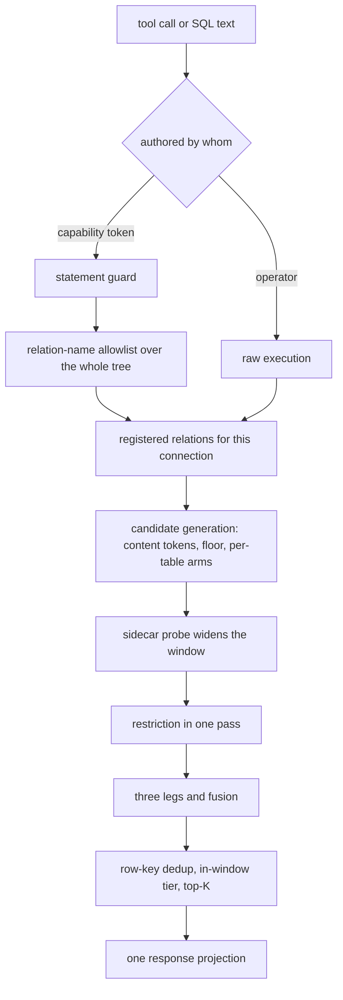
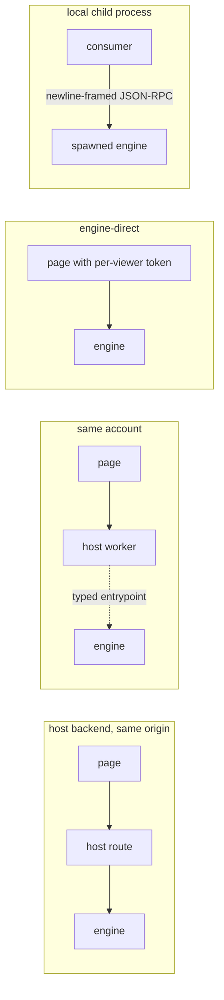

# The read face

Everything a caller can ask of a store arrives through this contract: the relations a
connection sees, the statement it may send, the candidates a question generates, the order
they come back in, and the one envelope that carries them. A read lands no row and holds no
lease.

## Parties

| Party | Obligation |
| --- | --- |
| **The engine** | Registers one relation per readable table for each connection, admits a single read-only statement against those relations, and serializes one projection on every transport. |
| **The caller** | Sends one statement or one tool call per read, and takes truncation, match counts and resolved build state from the response rather than deriving them from the row count. |
| **The operator** | Declares the templates, the per-table row ceiling, the publication column and the lexicon a store publishes. The reviewed manifest is the whole callable surface. |
| **The serving container** | Holds the current snapshot set on local disk, keys a cached result on the full policy subject, and drops the entries a newer snapshot supersedes. |
| **The embedding host** | Injects a store's credential on the server side and exchanges a visitor's verified assertion for a per-viewer token. A page holds no store bearer and no cookie. |

## Operations

| Operation | What it governs |
| --- | --- |
| `register` | The relations, tools and templates one connection sees, and the engine that executes against them. |
| `guard` | Admission of caller-written SQL: what parses, what a base relation names, and whose text runs raw. |
| `respond` | The single response projection: cell encoding, the row ceiling, truncation, counts, and operator-facing metadata. |
| `retrieve` | Candidate generation for a ranked read: content tokens, the relevance floor, per-table arms, dedup, and the snippet. |
| `rank` | Ordering of a candidate set: the three legs, their fusion, the question's timeframe, and the confidence a caller reads. |
| `cache` | Locality of the bytes a read touches, and reuse of a result across requests. |
| `resolve-pin` | Resolution of a named published-model build at read time, and the state each response echoes. |
| `embed` | The client library, its four transports, the handshake's build identity, and the credential each shape carries. |

## Clauses — register

A connection's relations are built, not stored. Registration is where a table name, a
template identifier and a tool listing acquire their meaning for one caller.

A relation arrives carrying its restriction. The layer composition, and the single pass that
runs ahead of the top-K cut, live in [`spec/41-enforcement.md` § Composition](41-enforcement.md);
a source-mirrored permission set joins into that same relation ahead of the tenant filter
under [`spec/42-visibility.md` § Mirrored permissions](42-visibility.md). Grant actions, the
grants a template carries, and the composition of two ceilings live in
[`spec/40-authority.md` § Grants](40-authority.md), and an effective ceiling reaches this
face already resolved. Index identity, an index's placement beside the snapshot it indexes,
and the build that produces a sidecar live in [`spec/10-store.md` § Indexes](10-store.md);
this face consumes a sidecar and builds none.

| Clause | Statement | decided-by |
| --- | --- | --- |
| `read.register.invariant.connection-views` | Ahead of a statement the engine opens a connection and issues one create-or-replace view per table directory the manifests name, each source resolved at that moment. No view directory exists on disk, so nothing regenerates and no fingerprint drifts. | |
| `read.register.invariant.file-list` | A registered relation receives an explicit, sorted list of part files rather than a glob pattern. What a relation reads is decided by the manifests, never by whatever happens to sit in the directory when the scan starts. | |
| `read.register.interface.engine` | The executor is an embedded columnar SQL engine linked into every binary target, reading Parquet natively and speaking standard SQL with no dialect of its own. An external process opened against the same files reads the same bytes with the engine uninstalled. | |
| `read.register.invariant.quiet-table` | The relation a quiet table registers as is {{store.declare.invariant.empty-table-is-a-zero-row-relation}} A caller reading it receives an empty result instead of a missing-relation fault. | |
| `read.register.invariant.bare-name` | A bare table name in any read — a caller statement, a template body, a ranking arm, a file preview — resolves to that caller's registered relation. Restriction lives in the relation rather than in a clause each surface has to remember, which is what makes a later arm safe to add. | |
| `read.register.interface.tool-set` | The read face exposes a closed set: `context.describe` for what is queryable, `context.query` as the one call crossing structured and semantic retrieval, `context.execute_query` for pre-approved templates, `context.files` and `context.file` over committed data files, and `corpus.retrieve` for ranked reads across a prefix. A caller restricted to templates emits no SQL at all. | |
| `read.register.shape.describe-payload` | `context.describe` answers with the row count, the stored schema fingerprint over injected and declared columns, a table-level description, per-column hints, the declared index inventory, the partition scheme, `limits.max_rows`, the zone label, the store's lexicon, and worked example queries — enough to write a working query with no round trip. | |
| `read.register.invariant.advertised-is-enforced` | A bound appears in a table's published `limits` block exactly when the engine applies it. An unenforceable bound is absent from the block rather than advertised, so a published number and a delivered guarantee cannot disagree. | |
| `read.register.interface.template-projection` | Every manifest template projects into a tool: the template identifier becomes the tool name and its declared positional parameters become a typed schema whose fields are all required. Adding a metric is adding a template, with no deploy of the calling application. | |
| `read.register.refusal.ungranted-template` | Tool listing is filtered by the caller's grants, and a template absent from that listing is also unreachable by a guessed identifier, raising `TemplateNotGranted`. A listing therefore discloses no identifier the caller cannot run. | `0040` |
| `read.register.invariant.file-listing` | `context.files` answers with paths relative to the store root for the tables the caller reads, and a table outside that set contributes no path — a listing cannot reveal that a table exists. | |
| `read.register.refusal.file-preview-target` | `context.file` resolves a path to its `(table, run_id)` pair and reads the rows back through that table's registered relation, so row restriction, masks and the zone gate apply to a preview identically. A snapshot part, a traversal, an absolute path and a ledger file resolve to no table and raise `FilePreviewNotATable`. | `0041` |
| `read.register.interface.ledger-relation` | Each table's per-run request ledger registers as the child relation `<table>__requests`, holding identifiers, connector, method, host, status and timing for mediated outbound calls. | |
| `read.register.refusal.scoped-ledger` | The child relation registers on the owner read alone — no grant allowlist, no row predicate, no column mask, no tenant scope. A tenant-scoped token naming it raises `LedgerNotTenantScoped` stating what closed the relation, rather than an empty result reading as no vendor traffic. | `0042` |
| `read.register.shape.lexicon-surface` | A store's declared lexicon reaches a caller through the describe payload. Numeric-identifier and badge vocabulary crosses to a rendering client; aliases, time-window phrases and distillation examples stay on the serving side, where interpretation happens. | |
| `read.register.invariant.reserved-relation` | The engine's own reserved table namespaces register like any other relation and carry no privileged path underneath: a surface reading them reads through the same registration a caller gets. | |

unsettled: Is a cross-table join worth a first-class retrieval call, or does an operator-defined view plus the describe payload stay the route? owner: read-path affects: read.register

## Clauses — guard

Caller-written SQL is untrusted input with one admission point. What that point reads, and
whose text it lets through raw, is fixed here.

| Clause | Statement | decided-by |
| --- | --- | --- |
| `read.guard.refusal.single-read-only-statement` | Admitted text parses to exactly one read-only SELECT. Attach, copy, install, load, pragma, set, every schema change and every data modification, and a piggybacked second statement all raise `StatementNotReadOnly`. | `0043` |
| `read.guard.invariant.engine-own-parse` | The guard walks the abstract syntax tree the engine itself executes, obtained by asking the engine to serialize the statement, so guard and executor cannot disagree about what a text means. Queries alone serialize; read-only-ness is a property of that representation rather than a blocklist someone maintains. | |
| `read.guard.invariant.relation-allowlist` | The decisive half is the relation-name allowlist: every base relation names either a view registered for this caller or a common table expression the statement itself declares. A bare path is an ordinary base relation at parse time and becomes a file read at bind time, so rejecting table-function nodes alone sails past it. | |
| `read.guard.invariant.whole-tree-walk` | The walk covers the entire tree — a scalar subquery inside the select list, a union arm, a pivot source — and gathers common-table-expression names across the tree before checking any base relation, as a relation may reference a name an ancestor node bound. | |
| `read.guard.refusal.unregistered-relation` | A base relation naming nothing this connection registered raises `RelationNotRegistered`. The message names what the statement asked for and echoes no relation belonging to another caller. | `0044` |
| `read.guard.refusal.table-function` | A table function anywhere in the tree, and a schema-qualified reach into a system catalog, raise `TableFunctionRefused`. | `0044` |
| `read.guard.invariant.statement-provenance` | Admission binds on who authored the text, not on how privileged the caller is. Operator-authored text — the local command line, a template body whose caller supplies an identifier and typed arguments, and reads the engine composes for itself — executes raw with table functions available; text a capability-token caller wrote is gated. The raw surface is reachable from nowhere on the network. | |
| `read.guard.invariant.quoted-identifiers` | Every schema- or manifest-derived identifier is double-quoted where it is rendered. A connector copies each vendor key into a column name verbatim, and an unquoted name parses as an expression and executes ungated. Quoting is not a character rule: a quoted identifier expresses any UTF-8 name, so a legitimate vendor field is admitted however it is spelled. | |
| `read.guard.shape.template-declaration` | A template declares an identifier, one SQL statement, positional typed parameters written `name:type` over integer, float, string, timestamp and boolean, and an optional row ceiling. | |
| `read.guard.refusal.template-relation-shape` | Manifest validation and face startup refuse a template whose SQL names anything but the store's own tables as plain identifiers, raising `TemplateNamesForeignRelation`. A plain identifier carries a path separator where a prefixed table name needs one, and carries no dot, no star and no leading separator. | `0045` |
| `read.guard.refusal.template-binding` | Argument binding is strict: a missing, unknown or type-mismatched value raises `TemplateArgumentRejected` ahead of any execution, with no silent coercion. Placeholders cover exactly the declared parameters, and an identifier colliding with a built-in tool prefix is refused at the same two points. | `0046` |
| `read.guard.invariant.startup-time-check` | Template checks are caller-independent and run once at startup, so a reviewer who approves a template approves what it reads and a request pays nothing for the check. | |
| `read.guard.invariant.subject-values-are-parameters` | Values describing the caller reach a statement through parameter slots joined against a session-scoped relation. A principal value containing SQL syntax stays inert, as a parameter slot cannot become syntax. | |

## Clauses — respond

One projection carries every read. A caller reads the ceiling, the flag and the counts from
it rather than inferring any of the three.

The two clocks a read bounds, and where a bound sits relative to the restriction wrapped
around a table, live in [`spec/10-store.md` § Time and bitemporality](10-store.md); the
projection echoes back whichever bounds a read resolved.

| Clause | Statement | decided-by |
| --- | --- | --- |
| `read.respond.interface.one-projection` | The command line's JSON output, the HTTP face and the tool protocol serialize one canonical projection: `columns`, `rows`, `truncated`, and the optional restriction, resolved-build, provenance, retrieval and time-bound blocks. A guarantee cannot land on one transport and be omitted by another. | |
| `read.respond.limit.row-ceiling` | A per-table row ceiling published as `limits.max_rows` bounds a result, applied at execution with an over-fetch of 1 rows. The ceiling bounds rows delivered rather than work performed, so a bounded read over an expensive join still performs the join. | |
| `read.respond.invariant.truncation-is-exact` | `truncated` is set by the presence of the over-fetched probe row, which proves rows exist past the ceiling. It is mandatory and never derived by comparing a returned count against a requested limit, so a deliberately sized read and a capped one stay distinguishable. | |
| `read.respond.shape.cell-encoding` | A cell carries its SQL value exactly. SQL NULL is JSON `null` and nothing else is; booleans are `true` and `false`; integers within ±(2^53−1) are numbers and wider ones exact decimal strings; finite floats are numbers and non-finite ones `"NaN"`, `"inf"` and `"-inf"`; decimals of 15 digits or fewer are numbers and wider ones exact text; dates, times and timestamps are ISO-8601 strings; intervals are ISO-8601 durations; binary is `\xAA`-form hex; an enum is its label; a container renders as its text form. | |
| `read.respond.invariant.wide-number-shape` | Whether an integer column serializes as JSON numbers or as strings is decided once for the whole column from the values one response carries, never cell by cell. The guarantee's scope is that single response, so two pages of one statement can disagree, and a caller wanting a value-independent wire shape casts the column to text in its query. | |
| `read.respond.invariant.type-is-the-cell` | No separate type list rides the envelope: a cell's JSON type is the declaration. A second, independently derived list contradicts it wherever the engine reports two distinct renderings under one physical type. | |
| `read.respond.invariant.zero-rows-is-success` | Returning fewer rows than the requested limit, zero included, is a success rather than an error. That is what lets a caller say the store holds nothing on a subject instead of serving unrelated rows. | |
| `read.respond.interface.match-count` | Match counts ride outside any internals opt-in, so a caller learns how many rows the ranker scored as matching without asking for engine detail and without a second call. | |
| `read.respond.invariant.coverage-is-a-count` | A claim that the corpus lacks coverage of a subject comes from a count over the table with no recency truncation, taken after the full-scan fallback. A ranked result's top score cannot serve it: min-max normalization pins the best row at 1.0, and inverse-document-frequency weighting lifts a single incidental mention of a rare term. | |
| `read.respond.interface.internals-opt-in` | Executed SQL, the engine name, the applied limit, the row count and elapsed milliseconds ride a separate object returned when a call sets `internals: true`. With the flag unset the response echoes none of them, and the split holds across every read tool and the HTTP face. | |
| `read.respond.interface.operator-metadata` | Table metadata on the operator surface carries the column count and the backing file list; a description carries neither. A row count is an ordinary count query rather than a metadata field, as a maintained count is a second source of truth over one set of files. | |
| `read.respond.shape.in-band-error` | On the tool protocol a refusal arrives in-band: a transport success carrying a protocol error object or a result flagged as an error. A caller judges an outcome by the result rather than by transport status. | |
| `read.respond.invariant.paths-stay-inside` | A result of an ordinary read carries no store path. Provenance is answered with columns naming table, run, connector version, ingestion instant and authoring subject, and where bytes sit is withheld deliberately. | |

unsettled: When does a duration ceiling become enforceable, and publishable in the per-table limits block beside the row ceiling? owner: read-path affects: read.respond

## Clauses — retrieve

A ranked read generates its candidates from the question's own content, not from a window
chosen on recency alone. Everything below bounds that generation.

Ordering over recalled memory facts lives in [`spec/21-memory.md` § Recall](21-memory.md);
a ranked read composes that path beneath its own union and re-ranks what comes back.

| Clause | Statement | decided-by |
| --- | --- | --- |
| `read.retrieve.interface.ranked-call` | `corpus.retrieve({prefix, query, kinds, limit, as_of})` answers with the top rows across the item and artifact genres under one prefix, each row carrying a snippet and full provenance. It composes the query surface and the memory recall path beneath itself and adds no storage of its own. | |
| `read.retrieve.invariant.relevance-floor` | A row reaches a caller when its lexical score is null, or is at least the floor, or its vector score exceeds zero. The floor is 2 for a content-token set of three or more members and 1 otherwise; a caller-supplied minimum overrides it, and a minimum of zero restores an unfiltered window. | |
| `read.retrieve.shape.content-tokens` | The query text is lowercased and split on non-alphanumeric characters. Stop tokens drop, non-ASCII runs of two or more characters are kept, and what survives is deduplicated with its order preserved. | |
| `read.retrieve.limit.token-length-floor` | An ASCII run shorter than 2 chars is discarded from the content-token set. | |
| `read.retrieve.limit.token-cap` | The content-token set holds at most 12 tokens. An empty set omits the relevance predicate entirely, leaving a browse-shaped read unaffected. | |
| `read.retrieve.invariant.script-split-matching` | An all-lowercase-alphanumeric token matches on an ASCII word boundary with an optional plural suffix; a token carrying any non-ASCII character matches by containment. An ASCII word boundary cannot occur beside an ideograph, and a single anchoring rule for both scripts silently deletes rows that literally carry the term. | |
| `read.retrieve.limit.plural-suffix-floor` | The optional plural suffix is dropped for a token under 4 chars, so a short term cannot match a longer unrelated word that merely starts with it. | |
| `read.retrieve.invariant.text-free-table-scores-null` | The lexical score is null rather than zero for a table carrying no snippet-worthy text column, so the floor cannot delete an entire table from a search; such a table's rows are admitted by the vector score alone. | |
| `read.retrieve.limit.candidate-window` | The candidate window is 8 times the requested limit or 200 rows, whichever is larger. Candidates equal to the window report that the question's terms matched more rows than the window holds and the ranking saw a recency-ordered slice; a larger requested limit widens it. This is the one truncation a caller cannot otherwise detect. | |
| `read.retrieve.invariant.reserved-columns-project-null` | Reserved projected columns — modality, language, prompt hash, kind — render as null for a table that does not carry them, so a table missing one contributes its rows to the union instead of dropping out of the search. | |
| `read.retrieve.invariant.unsatisfiable-arm-drops` | `filter` binds caller-named columns. A table lacking a named column makes its arm unsatisfiable, and that arm is dropped rather than emitted unfiltered, so an equality predicate cannot come back with every row of a table that has no such column. | |
| `read.retrieve.invariant.engine-resolved-date` | The publication column is resolved by the engine per table rather than routed through the caller's filter, so a store spelling its date column differently keeps its rows inside time-framed handling instead of losing them to one name. | |
| `read.retrieve.limit.filter-budget` | A filter carries at most 256 entries in a membership list, with its condition count and total byte size bounded alongside. | |
| `read.retrieve.refusal.filter-budget` | The budget is checked once over the whole filter ahead of building any arm, and an oversized or malformed condition raises `FilterBudgetExceeded` for the whole read rather than quietly dropping the table the condition appeared under. | `0047` |
| `read.retrieve.invariant.row-key-dedup` | A ranked read keeps one row per `(table, row key)`, newest ingestion first. The row key is the table's declared content-hash column and null otherwise — never a digest computed by concatenating projected values, as concatenation skips nulls and folds a text-free table into a single row. | |
| `read.retrieve.invariant.row-key-stays-internal` | The row key is absent from the outer projection, so a content hash never reaches a snippet or a rendered cell. | |
| `read.retrieve.invariant.dedup-is-gated` | The deduplicating window function is gated on the same condition as the relevance floor, as on a browse-shaped read it defeats top-N pushdown and costs measurable milliseconds for nothing. | |
| `read.retrieve.shape.snippet` | A row's snippet is built from label-priority text columns — title, summary, description, thesis and their kin — then the remaining prose-worthy text columns in schema order, at most three, concatenated with a separator. | |
| `read.retrieve.invariant.identifiers-never-snippet` | Content hashes, URLs, identifiers and instant-valued columns never qualify for a snippet. Landed schemas are alphabetized, and without the exclusion the first text column becomes every snippet and blinds both the ranker and the reader. | |
| `read.retrieve.invariant.sidecar-generates-candidates` | The vector sidecar arm performs candidate generation rather than rescoring: it admits the recency window the exact scan considers plus the sidecar's own top results, and every candidate is re-scored through the caller's registration. Per-row scores are identical to the exact path; which rows enter the window is what changes. | |
| `read.retrieve.limit.sidecar-oversampling` | One probe requests 4 times the requested limit or 64 rows, whichever is larger, multiplied by 4 where the request carries restriction context, so slots spent on rows a reader cannot see are compensated proportionally. | |
| `read.retrieve.limit.sidecar-size-cap` | A sidecar holding more than 64 MiB of stored vectors is left unloaded and the arm takes the exact scan. | |
| `read.retrieve.invariant.sidecar-falls-back` | Every sidecar precondition failure falls back to the exact scan: no snapshot, no matching sidecar, a multi-column or masked key, a dimension or manifest mismatch, an unreadable dump, or mixed producers on one table. An identifier surviving in a sidecar after its row was purged resolves to no row through the registration and filters away. | |
| `read.retrieve.invariant.gain-never-loss` | The accelerated arm is a strict superset of the exact path for one reader: rows are gained, none is lost. Two readers issuing one query against one snapshot can nonetheless recall different rows, as the probe ranges over rows neither of them sees. | |

unsettled: What adaptive over-fetch policy holds where rows a reader cannot see cluster near a query point and the visibility estimate under-fills the requested top-K? owner: read-path affects: read.retrieve

## Clauses — rank

Ordering runs over the candidate set and reports its own confidence. A missing backend
changes the order a caller receives, not whether the call answers.

| Clause | Statement | decided-by |
| --- | --- | --- |
| `read.rank.invariant.three-legs` | Ranking runs three legs: exact cosine similarity over the candidate set, BM25 over a full-text index, and a weighted fusion of the two. | |
| `read.rank.shape.fusion` | Fusion computes `w_vec · clamp(cosine, 0, 1) + w_lex · minmax(bm25)` with default weights of 0.6 for the vector leg and 0.4 for the lexical one. A document present in one leg contributes zero for the other, so fusion degrades into a single-signal ranking, and ties break by identifier for a deterministic order. | |
| `read.rank.invariant.lexical-leg-matches-only` | The BM25 leg ranks over a disjunction of should-clauses, so a document matching no query term is absent from the ranking rather than merely last. An empty query, an empty candidate set or a zero result count yields an empty ranking that falls back to recency ordering. | |
| `read.rank.invariant.flat-window-full-credit` | A lexical window whose scores carry no spread awards every present document full credit, leaving the fused order to the other leg and the tie-break. | |
| `read.rank.invariant.question-window-is-a-tier` | A question's timeframe projects a per-row in-window flag against the resolved publication column, and that flag leads the ordering. A row outside the timeframe sorts down and is never dropped, so a store with nothing fresh answers with its most recent picture instead of presenting old rows as current. | |
| `read.rank.limit.window-anchor-tolerance` | A publication instant more than 24 h past the question's anchor resolves the in-window flag to false. A null date and unparseable text resolve it the same way, rather than raising an error or removing the row, and a basis field names which case applied. | |
| `read.rank.invariant.ordering-casts-first` | Ordering casts a publication value before comparing it, as a text comparison of two date spellings is a comparison of strings and not of instants. | |
| `read.rank.interface.retrieval-block` | The retrieval block reports `window`, `candidates_prefloor`, `candidates`, `matched`, `returned`, `in_window`, `deduped`, `padded`, `floor` and `since`. Per row a caller receives an integer score bounded by the content-token count, a boolean in-window flag, and the basis label. | |
| `read.rank.invariant.internal-score-stays-internal` | The lexical engine's own float never crosses to a caller. It is corpus-relative, and a consumer thresholding on it drifts silently as the corpus changes underneath the number. | |
| `read.rank.interface.absent-block` | The retrieval block is omitted from every statement that is not a ranked read, and from a build carrying no ranker, where no honest number exists to report. A consumer distinguishes an absent block from a present block reporting zero matches. | |
| `read.rank.invariant.degradation-not-error` | Without the lexical backend linked, ranking substitutes a token fallback that scores each query token over the snippet, with recency breaking ties and ordering the empty-query case. The result is a different order, not a failed call. | |
| `read.rank.invariant.fallback-counts-tokens` | Under the fallback every matching token contributes, so hyphenated, spaced and possessive phrasings of one phrase rank equivalently, and a row carrying terms outranks a row that is merely newer. | |
| `read.rank.interface.caller-embedding` | Supplying a query embedding turns on per-row cosine and fuses it with the lexical leg; omitting one leaves every projected column identical to the lexical-only path. The vectors a caller supplies come from the model the stored rows record. | |
| `read.rank.limit.lexical-index-cache` | The full-text index is keyed on a fingerprint over the candidate documents, which is query-independent while the window is recency-selected, and cached in a FIFO of 64 entries. A changed snapshot, table set or time bound changes the fingerprint, so a stale index cannot serve a changed corpus. | |
| `read.rank.invariant.statistics-over-the-widened-window` | Lexical term statistics are computed over the widened candidate window, so an accelerated arm can order rows differently from the exact path even where the per-row scores agree exactly. | |
| `read.rank.invariant.transports-are-byte-identical` | The two calls exposing ranked retrieval assemble identical response bodies and change together. A guarantee reaching one of them and missing the other is worse than one reaching neither. | |

## Clauses — cache

Bytes a read touches sit next to the process reading them, and a reused result carries the
subject it was computed for.

| Clause | Statement | decided-by |
| --- | --- | --- |
| `read.cache.invariant.hot-local-parquet` | The retrieval container syncs the current snapshot set to local disk and memory-maps it. Object storage is the durable source and stays out of the per-query path, and clustering zone maps prune the scan to the relevant row groups. | |
| `read.cache.limit.cold-start` | A cold retrieval container reaches readiness within 8 s, and a container holding no snapshot pays a whole-store pull on top of that before its first answer. | |
| `read.cache.invariant.result-key` | A result cache keys on the full policy subject — the token's scope, the inference zone, and incognito state — combined with the hash of the statement, so a hit cannot cross a restriction boundary. | |
| `read.cache.invariant.cache-is-opt-in` | The result cache is opt-in per table at a short time to live, and off for a table tagged private. A deployment that enables nothing caches nothing. | |
| `read.cache.invariant.snapshot-invalidates` | A newly committed snapshot invalidates every cached entry keyed against the tables it folds, and an entry keyed against a superseded snapshot serves no later read. What a statement already in flight during a fold reads is {{store.fold.invariant.reads-are-non-blocking}} | |
| `read.cache.invariant.keep-warm-is-per-deployment` | A deployment carrying active traffic keeps its retrieval container warm. Sub-second latency is a property of the warm path, and a deployment that declines keep-warm accepts a cold first read in exchange for no cost at rest. | |

## Clauses — resolve-pin

A read names a published build, or takes the latest one, and either way says which it got.
The build that produced an identifier, and the artifacts it wrote, live in
[`spec/31-pipeline.md` § Published models](31-pipeline.md); a read resolves against those
artifacts and writes none of them.

| Clause | Statement | decided-by |
| --- | --- | --- |
| `read.resolve-pin.interface.pin-parameter` | `pin` maps a table name to a build identifier and resolves each named table to the state that build published and to no other. An unnamed table resolves to the latest published state. | |
| `read.resolve-pin.refusal.unknown-build` | An unknown or collected build identifier raises `PinnedBuildUnavailable`, naming the oldest identifier still pinnable. A pin is never quietly widened to the latest state. | `0048` |
| `read.resolve-pin.invariant.earlier-bound-wins` | A pin and the store's transaction-time bound are both upper bounds on one clock, and a table named by both resolves to whichever of the two is earlier. | |
| `read.resolve-pin.workflow.resolved-echo` | A response touching a published model carries `contextful.resolved`, mapping each such table to its `{build_id, watermark}`, whether or not the request passed a pin. A consumer records which state produced the rows it writes. | |
| `read.resolve-pin.invariant.absent-watermark` | The watermark is null for a materialization that carries none, and its absence is distinct from a watermark of zero. | |
| `read.resolve-pin.workflow.consumer-comparison` | The check the echo exists for: a consumer compares resolved build identifiers across every query of one derivation and fails that derivation where two differ, rather than writing rows stitched from two states. | |

## Clauses — embed

The client library is packaging over the same contract the container serves. Four transports
share one shape, and each carries its credential differently.

The readiness states a client distinguishes live in
[`spec/50-control-plane.md` § Deployment posture](50-control-plane.md); a store warming its
local snapshot answers a data route differently from one holding no configuration to open
with.

| Clause | Statement | decided-by |
| --- | --- | --- |
| `read.embed.invariant.client-packaging` | Putting search and an ask experience inside a third-party page is client packaging rather than an engine extension: the engine stays a service a caller talks to, and the kit is a thin layer over the tool protocol and query contract the container already serves. | |
| `read.embed.interface.headless-client` | The library is a headless, zero-dependency, zero-build ES module over a transport, exposing `search()`, `query()`, `tables()`, `describe()`, `retrieve()`, `recall()`, `remember()`, `predict()` and `ask()`. | |
| `read.embed.invariant.one-call-per-read` | Every read is one tool call, so one body of code runs unchanged on every transport — a browser, a server runtime, an edge isolate. | |
| `read.embed.shape.search-tool` | The free-text search tool takes `{query, query_embedding?, tables?, limit}` and reuses the ranked path underneath. Omitting the embedding preserves the lexical-only behavior; supplying one fuses cosine similarity into the ordering. | |
| `read.embed.interface.four-shapes` | Four deployment shapes share the one client: a host backend proxying same-origin and injecting the token server-side; a host backend on the same account collapsing that hop into a service binding; an engine-direct browser embed holding a scoped token itself; and a local consumer spawning the engine as a child process over newline-framed JSON-RPC with no listener and no issuer key. | |
| `read.embed.interface.typed-entrypoint` | The gateway exports a typed entrypoint with `query(sql)`, `mcp(message)` and `health()`, bound account-internally by a host backend. The binding is the perimeter, with no public hop, and the entrypoint injects the container-side credential so the host holds no secret. | |
| `read.embed.invariant.per-request-token` | A per-request capability token runs the read under that token's own grants inside the engine, identically to the HTTP face. A transport changes who injects the credential and never what the credential is worth. | |
| `read.embed.invariant.wildcard-origin` | Cross-origin access is off by default and opt-in. Authentication is a bearer header and never a cookie, so a wildcard origin is non-credentialed, which is what lets the face be embedded in an application with no backend at all. | |
| `read.embed.invariant.per-viewer-token` | A browser-held credential is minted per viewer: the host exchanges the visitor's verified assertion at the engine's exchange route for a least-privilege token audience-bound to one store, scoped and audited under that identity. It expires in minutes and is verified at both hops over the same transmitted bytes, and absent holder binding a leaked token is replayable for its remaining lifetime. | |
| `read.embed.shape.build-identity` | The handshake reports what a binary linked under one rule with no per-face argument: retrieval backends `duckdb`, `fts` and `hnsw`; connector families `m365`, `s3` and `wasm`; and the binary's own faces `http`, `eval` and `otlp`. The set composes by asking each crate declaring those features, and the same composition backs the version output, so the two faces cannot disagree about one binary. | |
| `read.embed.refusal.required-face` | A client passing `require: [...]` has each name matched against the reported set and is refused ahead of its first read with `RequiredFaceAbsent`; an engine reporting no set satisfies no requirement. Reporting is itself never a refusal, as most absences are degradations the engine serves through. | `0049` |
| `read.embed.invariant.two-absence-shapes` | Two absences are distinguishable at the call. Without the lexical backend, retrieval swaps BM25 for the token fallback — a different ranking. Without the vector backend, a supplied embedding still scores, over the rows the recency window already recalled, as the approximate arm contributes no candidates. | |
| `read.embed.refusal.absent-read-backend` | Without the embedded SQL engine linked, both read tools refuse outright with `ReadBackendAbsent` rather than answering from a narrower path. | `0050` |
| `read.embed.interface.ask-event-stream` | The ask experience streams typed events from a backend running the model: `tool`, `tool_result`, `text`, `citations`, `notice`, `console.render`, `done` and `error`. The citations event follows the answer text and carries the numbered sources — title, link, publication day, and whether a source is data or web. The model lives outside the engine, so the engine-direct shape serves no ask and its client points at a separate streaming endpoint. | |
| `read.embed.refusal.stdio-credential` | Over the process transport a credential is mandatory — a capability token string, or an explicit owner flag. An unset token resolves to the owner context, which is the ungated branch for every tool including run execution and memory writes, so the client raises `StdioCredentialMissing` rather than escalating in silence. | `0051` |
| `read.embed.invariant.child-environment` | An explicit passthrough list is all that crosses into the spawned engine, defaulting to the executable search path and the home directory. The engine's secret resolver reads vendor credentials straight out of its environment, and an inherited environment hands a child every key its parent holds. | |
| `read.embed.refusal.store-selector` | The child's working directory selects the store: the process walks up for the project manifest and, finding none, raises `StoreSelectorAbsent` and exits ahead of writing one byte of protocol framing. The executable path and the working directory are trusted inputs, executed and read as given. | `0052` |
| `read.embed.invariant.serial-dispatch` | The process transport keeps exactly one request in flight: the engine reads a line, answers it, and only then reads the next, so an aborted call resynchronizes by discarding exactly one reply. | |
| `read.embed.invariant.process-subpath` | The process transport lives on its own import subpath, so a child-process import never reaches the root entry an isolate bundles. | |

## Shapes

The registered relation for one table, as the connection builds it:

```sql
CREATE OR REPLACE VIEW orders AS
SELECT * FROM (
  SELECT *, ROW_NUMBER() OVER (
    PARTITION BY order_id
    ORDER BY updated_at DESC, _ingested_at DESC
  ) AS _rn
  FROM read_parquet(
    [ 'tables/orders/data/snapshots/snapshot-00000001773100800000000000/part-00000.parquet',
      'tables/orders/data/runs/run-0192/node-9f2c/part-00000.parquet' ],
    union_by_name = true
  )
) WHERE _rn = 1;
```

The response projection, one shape on every transport:

```json
{
  "columns": ["order_id", "total_cents", "placed_at"],
  "rows": [["A-8812", 1299, "2026-02-14T09:31:00Z"], ["A-8813", "9007199254740993", "2026-02-14T09:44:12Z"]],
  "truncated": true,
  "contextful.bounds": { "as_of": "2026-03-01T00:00:00Z", "inclusive": false },
  "contextful.resolved": { "orders": { "build_id": "b-0f31a7", "watermark": "2026-02-14T10:00:00Z" } },
  "contextful.policy.applied": { "rows_dropped": 12, "columns_masked": ["email"], "overfetch_rounds": 1 },
  "contextful.retrieval": {
    "window": 200, "candidates_prefloor": 200, "candidates": 61,
    "matched": 61, "returned": 20, "in_window": 14, "deduped": 3,
    "padded": 0, "floor": 2, "since": "2026-02-07"
  }
}
```

Per-row ranking fields on a ranked read:

```json
{ "_score": 2, "_vscore": 0.71, "_in_window": true, "_date_basis": "published_at" }
```

The describe payload:

```json
{
  "table": "orders",
  "row_count": 184203,
  "schema_fingerprint": "sha256:7c1f…",
  "description": "One row per placed order.",
  "columns": [{ "name": "total_cents", "type": "BIGINT", "hint": "minor units" }],
  "indexes": [{ "kind": "vector", "column": "summary", "model": "e5-small", "dim": 384, "metric": "cosine" }],
  "partitions": ["tenant"],
  "limits": { "max_rows": 10000 },
  "zone": "local",
  "lexicon": { "badges": ["sku"], "identifiers": ["order_id"] },
  "examples": ["SELECT placed_at, total_cents FROM orders ORDER BY placed_at DESC LIMIT 20"]
}
```

A template, and the tool it projects as:

```toml
[[query_templates]]
id         = "orders_by_region"
sql        = "SELECT region, sum(total_cents) FROM orders WHERE placed_at >= ? AND region = ? GROUP BY region"
parameters = ["since:timestamp", "region:string"]
max_rows   = 500
```

```json
{ "name": "orders_by_region",
  "inputSchema": { "type": "object",
    "properties": { "since": { "type": "string", "format": "date-time" }, "region": { "type": "string" } },
    "required": ["since", "region"] },
  "limits": { "max_rows": 500 } }
```

The path one ranked read takes:



The four embed shapes:



Process-transport framing, one request in flight:

```text
--> {"jsonrpc":"2.0","id":1,"method":"tools/call","params":{"name":"context.query","arguments":{"sql":"SELECT 1"}}}
<-- {"jsonrpc":"2.0","id":1,"result":{"content":[{"type":"text","text":"{\"columns\":[\"1\"],\"rows\":[[1]],\"truncated\":false}"}]}}
--> {"jsonrpc":"2.0","id":2,"method":"tools/call","params":{"name":"context.describe","arguments":{"table":"orders"}}}
```

Handshake build identity:

```json
{ "serverInfo": { "name": "contextful", "version": "1.4.0",
  "backends": ["duckdb", "fts", "hnsw", "s3", "http", "otlp"] } }
```

## Unsettled

unsettled: Does partial-result streaming belong on this surface, or does a full result set stay the one response shape? owner: read-path affects: read.respond

unsettled: What replaces min-max window normalization as a cross-index score calibration, given one bounded leg and one corpus-relative unbounded leg? owner: read-path affects: read.rank

unsettled: Is a tenant-scoped projection of the request ledger worth building, which requires the tenant dimension to reach ledger rows first? owner: read-path affects: read.register

unsettled: What corpus-size and token metadata does the describe payload expose, so a client can choose between a full-context read and a ranked one? owner: read-path affects: read.register
