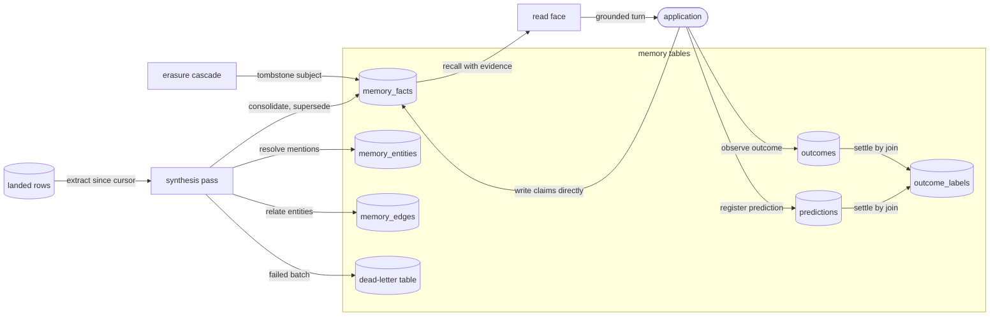
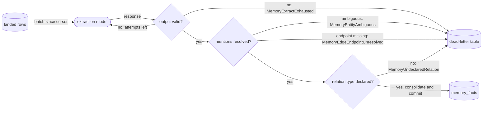
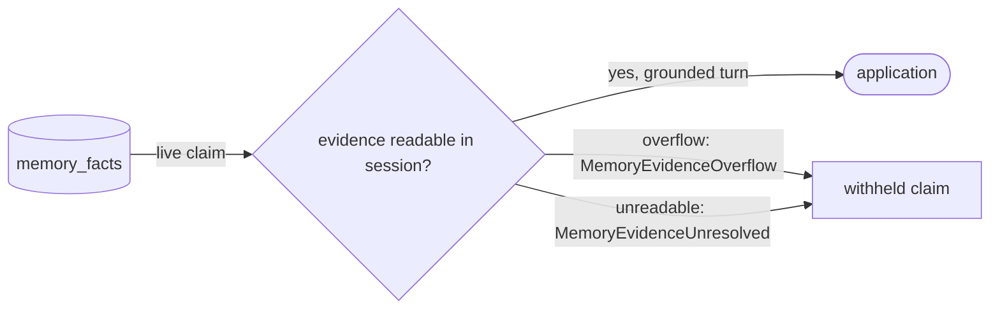
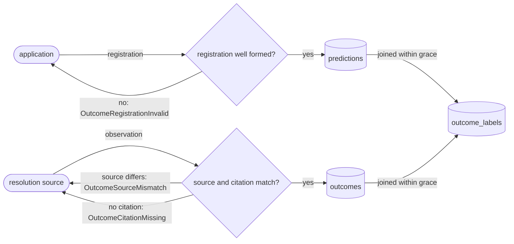

# Synthesized memory

Memory is what the workspace concludes from what it ingested: durable claims, the things they
are about, the relationships between them, and whether a claim it emitted turned out to hold.
It lives on the same tables, commit and enforcement as ingested data, and is reached through
its own doors. Erasure of a memory subject is the disclosure contract's `erase` operation.

Memory's tables and what moves rows between them; each edge names the operation, each cylinder a table:



## declare

The five memory table shapes, their canonical columns, tier and scope, and the relation vocabulary with its cardinality.

- `canonical-column` — A table naming a shape and omitting one of its canonical columns raises `MemoryShapeColumnMissing` when the declaration loads.
  *P1*
- `undeclared-relation` — A candidate edge whose `rel_type` falls outside the union lands in the dead-letter table and raises `MemoryUndeclaredRelation`; no row is written under the unknown type.
  *A-read*

unsettled: Which relation types belong in the reserved core, and what declared path adds or renames one without stranding rows? owner: memory affects: read.declare

## synthesize

Extract, Resolve and Consolidate; the dedup key, evidence support, the audit record and coverage gaps.

- `extract-attempts` — A schema-invalid response is re-prompted with its validation feedback, at most 3 attempts per batch in total.
- `dead-letter` — A batch exhausting {{read.synthesize.extract-attempts}} writes the response, template hash and drop reason to the dead-letter table, raises `MemoryExtractExhausted`, and leaves the cursor unadvanced.
  *A-read*
- `pass-cursor` — A pass reads the source's committed rows its cursor has not recorded, through the writing credential's own session, in batches under {{read.synthesize.prompt-bound}}, recording each batch once its claims commit.
- `prompt-bound` — A batch packs fenced rows up to 32 KiB; a fenced row over that bound travels in a batch of its own.
  *because one oversized row neither stalls the pass nor drags its neighbours past the bound*
- `row-cap` — A row is fenced at 16384 chars under {{connector.infer.value-cap}}; a truncated row still reaches the model, its batch commits and advances the cursor, and the pass report counts it in `truncated`.
  *because a silent cut hides that a conclusion rests on a partial row*
- `attribution` — Every landed claim carries `grant_id`, the chain-final revocation identifier of the credential that wrote it, `agent`, that credential's agent member, and `_authored_by`, its on-behalf-of principal.
  *because a reader weighs a conclusion by which grant could have produced it*
- `claim-taint` — A source row carries its own `_taint`, else `ingested:third-party`. Every row a batch commits lands under {{store.reserve.taint}} with the least-trusted label among the batch's rows.
  *because a row no label vouches for is trusted least, and a claim re-synthesized from claims stays as low as its origin*

One synthesis batch, from landed rows to a committed claim or the dead-letter table:



unsettled: What sets the synthesis cadence per shape, and does a shape default give way to a deployment override? owner: memory affects: read.synthesize

unsettled: How is a model-emitted confidence rescaled into a comparable number, and what held-out set validates the rescaling? owner: memory affects: read.synthesize

## revise

Supersession within one validity line, confidence decay, the direct write and its anchor, expiry, retention, promotion.

- `tier` — `tier` is stamped from the write path and grounding, never the payload: a synthesis pass stamps `derived`, a direct write `curated`, a fetched result `researched`, and mixed grounding takes the lowest.
  *A-read*
- `supersede` — A claim of equal or higher tier retires a live prior of its subject, predicate and scope when both are open-ended or share a valid-from instant: the prior's `valid_to` becomes the claim's `valid_from`, and `superseded_by` names it.
  *A-read*
- `direct-write` — The direct write accepts claims alone. Naming `memory_episodes`, `memory_entities`, `memory_edges` or `memory_preferences` raises `MemoryDirectWriteShapeRefused`; an entity row enters through the entity upsert.
  *A-read*
- `observed-at` — `contextful memory write --observed-at <instant>` lands the claim with `valid_from` at that instant; without it, `valid_from` is the write's own instant.
- `dedup-key` — `--dedup-key <key>` derives `claim_id` from the key beside the subject, predicate, object and scope, and a write whose `claim_id` the table already holds lands nothing.
  *because a retried write restates one observation, while one fact observed twice under two keys keeps two validity intervals*
- `observed-order` — A direct write whose `valid_from` precedes the `valid_from` of an unsuperseded claim of its subject, predicate and scope with another object raises `MemoryObservationOutOfOrder`, and nothing lands.
  *because retiring the later claim at the earlier instant ends it before it starts, and it then answers at no instant*
- `citation-live` — A direct write citing a keyed table's row that does not read as its key's live version through the writer's session raises `MemoryCitationNotLive`, and nothing lands.
  *because such a claim rests on a version no reader resolves, and recall withholds it from its first read*

unsettled: Does a claim observed before a live contradicting claim of its line land beneath it with a bounded end, rather than refuse? owner: memory affects: read.revise

unsettled: How are two unscoped writers colliding on one subject, predicate and scope surfaced to a human, rather than the later one landing not live? owner: memory affects: read.revise

unsettled: What decay half-life applies to a claim nothing reinforces, and is fading or hard retention the default? owner: memory affects: read.revise

## recall

Serving memory: the ranked arm at the read's anchor, the keyed read at an observed instant, the two clocks, tier-first ordering, the scope filter, the tombstone filter, the evidence gate.

- `evidence-unresolved` — An unreadable or masked source row, an unknown table, a reference into another memory row, or malformed lineage suppresses the claim and raises `MemoryEvidenceUnresolved`.
  *A-read*
- `evidence-references` — A claim naming more than 256 entries of evidence is suppressed unresolved, raising `MemoryEvidenceOverflow`.
  *A-read*
- `evidence-key` — The write landing a claim stamps each citation into a keyed table with the cited row's key columns; recall resolves a stamped citation through the key's live version, so a later version or a fold keeps the claim served.
  *because compaction drops superseded versions, and a claim withdrawn by a routine fold is memory the workspace silently forgets*
- `ranked-arm` — A `corpus.retrieve` arm over a `memory_facts` table serves only live claims — no `superseded_by`, and a `valid_to` null or past the read's anchor — whose evidence passes the gate.
- `suppression-count` — A suppressed claim is absent from the rows; the `contextful.recall` block counts suppressions per error identifier and names no claim.
  *because a count discloses that a conclusion was withheld, never what it concluded*
- `keyed` — `memory.recall` takes `table`, `subject`, `observed_at`, `as_of_ingest` and `limit`, and returns the claims whose `subject` equals `subject` exactly and whose `valid_from` and `valid_to` cover `observed_at` as {{store.bound-time.valid-as-of}} does.
- `keyed-clocks` — `as_of_ingest` bounds the read as {{store.bound-time.as-of}} does; absent, the read takes the latest committed state, and an absent `observed_at` the call's instant. `contextful.bounds` echoes each supplied bound under its argument name, with a per-name `inclusive` map.
- `keyed-history` — A claim a successor retired still answers an `observed_at` inside its validity; the keyed read filters on validity alone, never on `superseded_by`.
  *because the question is what held at that instant, and the retired claim is the answer its interval records*
- `keyed-gate` — Every keyed claim passes {{read.recall.evidence-unresolved}} and {{read.recall.evidence-references}}, and the response carries {{read.recall.suppression-count}}.
- `keyed-window` — The keyed read gates claims in order and stops once it keeps one claim past the row ceiling, so the suppression count covers the claims gated before that stop.
  *because a one-row recall over a subject with thousands of claims otherwise resolves every claim's evidence*
- `keyed-order` — Keyed claims order by tier, `curated` first, then `valid_from`, newest first, then `claim_id`; `limit` and the table's ceilings bound them under {{read.respond.row-ceiling}}.
- `keyed-not-claims` — A granted `table` declaring a shape other than `memory_facts`, or no memory shape, raises `MemoryRecallNotClaims`.
  *because a keyed read answers with a claim's subject, validity and evidence, which no other table carries*

The evidence check a claim passes on its way to a grounded turn:



unsettled: Does a claim whose cited key has since landed a different version surface that its evidence changed, or re-enter synthesis? owner: memory affects: read.recall

unsettled: What supplies a read-side usage ledger, so retention can ask whether a claim was ever recalled rather than whether something cited it? owner: memory affects: read.recall

## resolve-entity

Mention-to-entity matching, aliases, the knowledge card, place identity and nearness, edges, and ownership answers.

- `ambiguous-mention` — A mention matching two canonical identities with no deterministic key separating them is recorded as an ambiguous skip, raises `MemoryEntityAmbiguous`, and dead-letters its candidate claim.
  *A-read*
- `edge-endpoint` — A candidate edge whose source or target resolves to no identity is dead-lettered, raising `MemoryEdgeEndpointUnresolved`.
  *A-read*

unsettled: At what hop depth or edge count does an external graph engine become a served backend rather than a derived index? owner: memory affects: read.resolve-entity

unsettled: Does an ownership answer over an artifact with several attached principals return all of them, or the most recent attachment? owner: memory affects: read.resolve-entity

## settle

Predictions, observations, the registration, the citation a verdict owes, and the label views.

- `registration` — A registration names exactly one form (relative horizon, absolute deadline, open watch) and one source (`metric`, `adjudicator`, `manual`), with a comparator exactly when the source is `metric`; otherwise it raises `OutcomeRegistrationInvalid`.
  *A-read*
- `source-mismatch` — An observation carrying a verdict whose resolution source is absent or differs from the registration's raises `OutcomeSourceMismatch`.
  *A-read*
- `settling-citation` — An `adjudicator` or `manual` verdict without an `http` or `https` settling citation raises `OutcomeCitationMissing`; the citation rides the label view.
  *A-read*
- `grace-window` — The label join keeps an observation from the prediction instant through the deadline plus an inclusive grace of 86400 s.

Registration, observation and the label view:



unsettled: At what grain are calibration and confidence reported to a consumer, and which figures derive from the scored view? owner: memory affects: read.settle

## Shapes

A declaration naming a shape and its declared relation types:

```toml
[[table]]
name  = "team_memory"
shape = "memory_facts"

[relation]
declared = ["reports_to", "owns_service"]
```

The label view:

```sql
CREATE VIEW outcome_labels AS
SELECT p.prediction_id, p.subject, p.resolution_source,
       o.verdict, o.signal, o.settling_citation,
       epoch(CAST(o.observed_at AS TIMESTAMPTZ)) - epoch(CAST(p.predicted_at AS TIMESTAMPTZ)) AS lead_time_s
FROM predictions p
JOIN outcomes o ON o.prediction_id = p.prediction_id
WHERE o.observed_at IS NOT NULL
  AND o.signal IS DISTINCT FROM 'self-rated'
  AND epoch(CAST(o.observed_at AS TIMESTAMPTZ)) >= epoch(CAST(p.predicted_at AS TIMESTAMPTZ))
  AND epoch(CAST(o.observed_at AS TIMESTAMPTZ)) <= epoch(CAST(p.deadline_at AS TIMESTAMPTZ)) + 86400;
```
