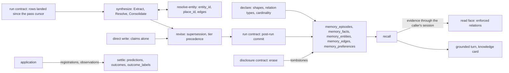
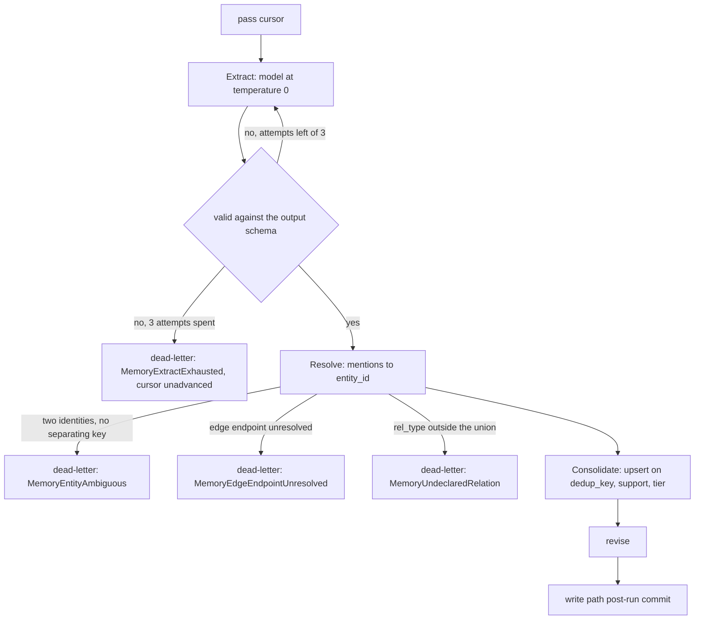
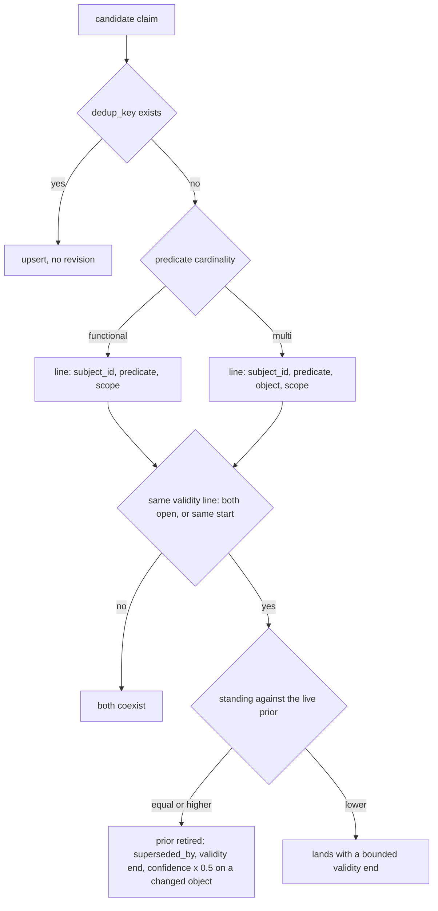
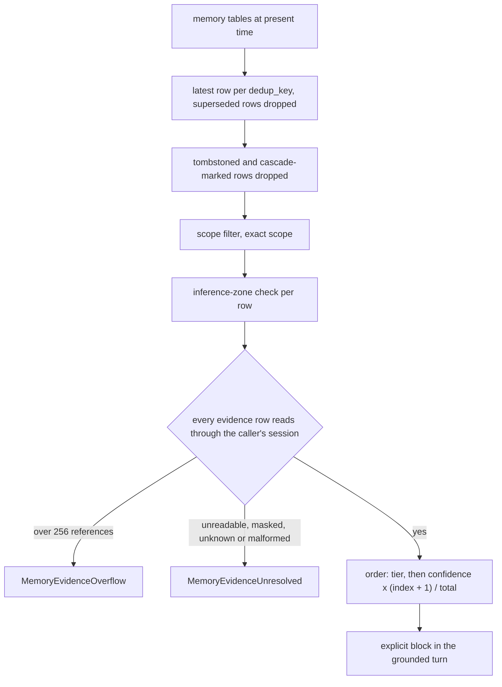
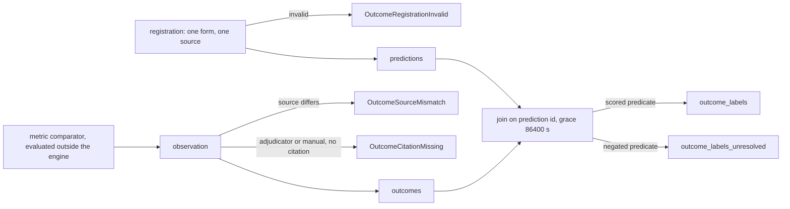

# Synthesized memory

Memory is what the workspace concludes from what it ingested: durable claims, the things they
are about, the relationships between them, and whether a claim it emitted turned out to hold.
It lives on the same tables, commit and enforcement as ingested data, and is reached through
its own doors. Erasure of a memory subject is the disclosure contract's `erase` operation.

Memory's operations over the five tables, and where they meet the run path, the read face and erasure:



## declare

| Clause | Statement | Why |
| --- | --- | --- |
| `read.declare.canonical-column` | A table naming a shape and omitting one of its canonical columns raises `MemoryShapeColumnMissing` when the declaration loads. | P1 |
| `read.declare.undeclared-relation` | A candidate edge whose `rel_type` falls outside the union lands in the dead-letter table and raises `MemoryUndeclaredRelation`; no row is written under the unknown type. | A-read |

unsettled: Which relation types belong in the reserved core, and what declared path adds or renames one without stranding rows? owner: memory affects: read.declare

## synthesize

| Clause | Statement | Why |
| --- | --- | --- |
| `read.synthesize.extract-attempts` | A schema-invalid response is re-prompted with its validation feedback, at most 3 attempts per batch in total. | — |
| `read.synthesize.dead-letter` | A batch exhausting {{read.synthesize.extract-attempts}} writes the response, template hash and drop reason to the dead-letter table, raises `MemoryExtractExhausted`, and leaves the cursor unadvanced. | A-read |

One synthesis pass and its dead-letter exits:



unsettled: What sets the synthesis cadence per shape, and does a shape default give way to a deployment override? owner: memory affects: read.synthesize

unsettled: How is a model-emitted confidence rescaled into a comparable number, and what held-out set validates the rescaling? owner: memory affects: read.synthesize

## revise

| Clause | Statement | Why |
| --- | --- | --- |
| `read.revise.direct-write` | The direct write accepts claims alone. Naming `memory_episodes`, `memory_entities`, `memory_edges` or `memory_preferences` raises `MemoryDirectWriteShapeRefused`; an entity row enters through the entity upsert | A-read |

How a landing claim resolves against the live claims on its line:



unsettled: How are two unscoped writers colliding on one subject, predicate and scope surfaced to a human, rather than the later one landing not live? owner: memory affects: read.revise

unsettled: What decay half-life applies to a claim nothing reinforces, and is fading or hard retention the default? owner: memory affects: read.revise

## recall

| Clause | Statement | Why |
| --- | --- | --- |
| `read.recall.evidence-unresolved` | An unreadable or masked source row, an unknown table, a reference into another memory row, or malformed lineage suppresses the claim and raises `MemoryEvidenceUnresolved`. | A-read |
| `read.recall.evidence-references` | A claim naming more than 256 entries of evidence is suppressed unresolved, raising `MemoryEvidenceOverflow`. | A-read |

The filters a claim passes on its way to a grounded turn:



unsettled: What supplies a read-side usage ledger, so retention can ask whether a claim was ever recalled rather than whether something cited it? owner: memory affects: read.recall

## resolve-entity

| Clause | Statement | Why |
| --- | --- | --- |
| `read.resolve-entity.ambiguous-mention` | A mention matching two canonical identities with no deterministic key separating them is recorded as an ambiguous skip, raises `MemoryEntityAmbiguous`, and dead-letters its candidate claim. | A-read |
| `read.resolve-entity.edge-endpoint` | A candidate edge whose source or target resolves to no identity is dead-lettered, raising `MemoryEdgeEndpointUnresolved`. | A-read |

unsettled: At what hop depth or edge count does an external graph engine become a served backend rather than a derived index? owner: memory affects: read.resolve-entity

unsettled: Does an ownership answer over an artifact with several attached principals return all of them, or the most recent attachment? owner: memory affects: read.resolve-entity

## settle

| Clause | Statement | Why |
| --- | --- | --- |
| `read.settle.registration` | A registration names exactly one form (relative horizon, absolute deadline, open watch) and one source (`metric`, `adjudicator`, `manual`), with a comparator exactly when the source is `metric`; otherwise it raises `OutcomeRegistrationInvalid`. | A-read |
| `read.settle.source-mismatch` | An observation carrying a verdict whose resolution source is absent or differs from the registration's raises `OutcomeSourceMismatch`. | A-read |
| `read.settle.settling-citation` | An `adjudicator` or `manual` verdict without an `http` or `https` settling citation raises `OutcomeCitationMissing`; the citation rides the label view. | A-read |
| `read.settle.grace-window` | The label join keeps an observation from the prediction instant through the deadline plus an inclusive grace of 86400 s. | — |

Registration, observation and the two label views:



unsettled: At what grain are calibration and confidence reported to a consumer, and which figures derive from the scored view? owner: memory affects: read.settle

## Shapes

A declaration naming a shape and its predicate cardinality:

```toml
[[table]]
name  = "team_memory"
shape = "memory_facts"

[relation]
declared   = ["reports_to", "owns_service"]
functional = ["reports_to"]
```

The scored label view:

```sql
CREATE VIEW outcome_labels AS
SELECT p.prediction_id, p.subject, p.resolution_source,
       o.verdict, o.signal, o.settling_citation,
       epoch(CAST(o.observed_at AS TIMESTAMPTZ)) - epoch(CAST(p.predicted_at AS TIMESTAMPTZ)) AS lead_time_s
FROM predictions p
JOIN outcomes o ON o.prediction_id = p.prediction_id
WHERE o.observed_at IS NOT NULL
  AND o.signal IS DISTINCT FROM 'self-rated'
  AND epoch(CAST(o.observed_at AS TIMESTAMPTZ)) >= epoch(CAST(p.predicted_at AS TIMESTAMPTZ))
  AND epoch(CAST(o.observed_at AS TIMESTAMPTZ)) <= epoch(CAST(p.deadline_at AS TIMESTAMPTZ)) + 86400;
```
