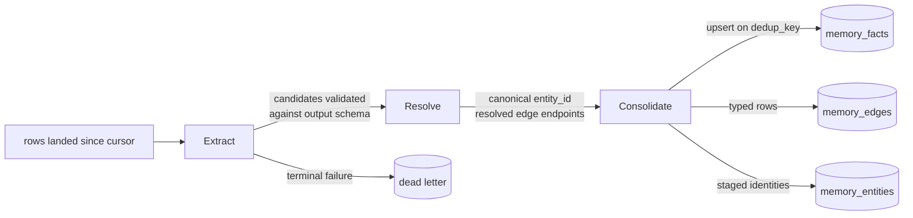
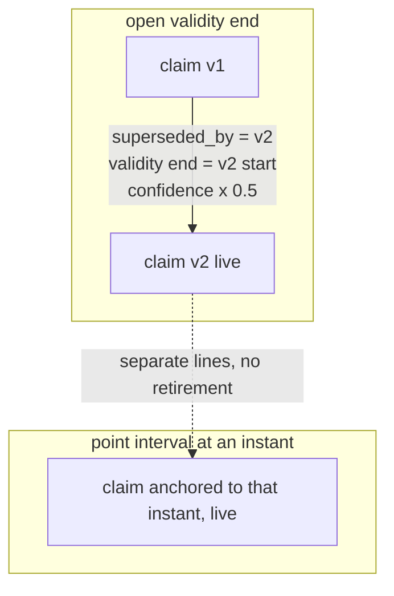
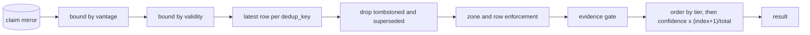

# Synthesized memory

Memory is what the workspace concludes from what it ingested: durable claims, the things
those claims are about, the relationships between them, and the record of whether a claim
the workspace emitted turned out to hold. It lives on the same tables, the same commit and
the same enforcement as ingested data, and it is reached through its own doors.

## Parties

| Party | Obligation |
| --- | --- |
| **The deployment** | Declares which tables carry a memory shape, the extract template and its output schema, the alias sets, the relation types beyond the reserved core, and the three place tables. Declares the sources whose coverage closes a gap. |
| **The engine** | Owns the matcher, the deduplication key, the revision rule and the tier derivation. Stamps provenance, supersession and validity on every row it writes, and commits a write and a tombstone to the bucket in one operation. |
| **The synthesis run** | Reaches a model through the host, emits candidates against the declared output schema, routes terminal failures to the dead-letter table, and records the endpoint, the template hash and the per-candidate outcome on its spans. |
| **The caller** | Holds a write grant to assert a fact, a separate grant to read one, and a privileged grant to forget. Supplies the anchor a past-dated claim carries and the identity a re-emitted prediction reuses. |
| **The application** | Supplies domain vocabulary, the unresolved reasons an observation reports, the freshness thresholds it observes on, and the comparator a metric rule stores. |

## Operations

| Operation | What it governs |
| --- | --- |
| `declare` | The five memory table shapes, their canonical columns, the tier and scope vocabularies, and the closed relation set. |
| `synthesize` | Extract, Resolve and Consolidate; the deduplication key, evidence support, the audit record of a synthesis pass, and coverage gaps. |
| `revise` | Supersession within one validity line, confidence decay, the direct write and its anchor, expiry, retention and promotion. |
| `recall` | Serving live memory at present time: the two clocks, tier-first ordering, the scope filter, and the evidence gate. |
| `forget` | Tombstoning a selected subject, the cascade over rows distilled from it, and the approval path. |
| `resolve-entity` | Candidate-to-entity matching, script-aware aliases, the knowledge card, place identity and nearness, and edge materialization. |
| `settle` | Predictions, observations, the declared resolution form, the citation a verdict owes, and the label views. |

## Clauses — declare

A memory table is an ordinary table that names a shape, so every column rule, commit rule
and read rule the store states reaches it unchanged. The declared validity column pair is
[`spec/10-store.md` § Table declaration](10-store.md); a memory shape names the pair a
validity-bounded query reads.

| Clause | Statement | decided-by |
| --- | --- | --- |
| `memory.declare.shape.memory-shape` | Synthesized memory is five table shapes over one substrate: `memory_episodes` holds one row per session window, `memory_facts` one row per durable claim, `memory_entities` one row per resolved thing, `memory_edges` one row per directed relationship, `memory_preferences` one row per subject-key pair. | |
| `memory.declare.interface.shape-declaration` | A table names `shape` beside its columns. The declaration binds the schema validator to that shape's canonical column set and tells the tool surface which ranking defaults to publish. | |
| `memory.declare.refusal.canonical-column` | A table naming a shape and omitting a canonical column of that shape raises `MemoryShapeColumnMissing` when the declaration loads. | `0053` |
| `memory.declare.shape.fact-columns` | `memory_facts` carries `fact_id`, `subject_id`, `predicate`, `object`, `confidence`, `scope`, `tier`, `support`, `evidence_row_ids`, `prompt_version`, `dedup_key`, `superseded_by`, and the declared validity pair. | |
| `memory.declare.shape.entity-columns` | `memory_entities` carries `entity_id`, a display name, per-language aliases, an attribute map, and a last-seen instant. | |
| `memory.declare.shape.edge-columns` | `memory_edges` carries `src_id`, `dst_id`, `rel_type`, `weight`, the validity pair, and the provenance columns a claim row carries. | |
| `memory.declare.shape.episode-columns` | `memory_episodes` carries an episode id, the window start and end it covers, a summary, the set of source tables it read, and the evidence row identifiers folded into that summary. | |
| `memory.declare.shape.preference-columns` | `memory_preferences` carries `subject_id`, `key`, `value`, `confidence` and `scope`, holding one live row per subject-key pair under the revision rule a claim follows. | |
| `memory.declare.invariant.validity-pair` | A memory shape names its validity columns through the same table declaration any other table uses, so live recall and a validity-bounded read resolve one column pair rather than two independent ones. | |
| `memory.declare.shape.tier` | `tier` takes `curated` for a human or a version-controlled file a human wrote, `derived` for synthesis over rows from a source the deployment declared, and `researched` for synthesis over rows the system fetched on its own initiative. | |
| `memory.declare.shape.scope` | `scope` is an optional string stamped when a row is synthesized or asserted, partitioning one subject's claims across the surfaces that produced them. | |
| `memory.declare.invariant.relation-type` | The relation vocabulary is a reserved core — `same_as`, `part_of`, `member_of`, `located_in`, `derived_from`, `precedes`, `causes`, `mentions` — unioned with the types one deployment declares. The set is closed within that deployment, so a filter on `rel_type` reads reliably. | |
| `memory.declare.refusal.undeclared-relation` | A candidate edge whose `rel_type` falls outside that union lands in the dead-letter table and raises `MemoryUndeclaredRelation`, and no row is written under the unknown type. | `0054` |
| `memory.declare.shape.relation-flags` | A declared relation type carries optional inverse and symmetric flags, read by traversal as hints over materialized rows and by nothing that infers a row. | |
| `memory.declare.interface.place-tables` | The place dimension, its per-language aliases, and the map from a place to the entities exposed at it are three tables the deployment supplies as CSV. | |
| `memory.declare.interface.extract-template` | The deployment supplies the extract template and the output schema every candidate validates against. The engine supplies the matcher, the deduplication key, the revision rule and the tier derivation. | |

## Clauses — synthesize

Synthesis turns landed rows into candidates and candidates into memory rows. The model
endpoint and the fence that wraps ingested text before it reaches one are
[`spec/32-connector.md` § Host-mediated capabilities](32-connector.md); the extract stage
reads its model through the host and hands it ingested values as marked data. The zone a
synthesized row inherits from the rows it distils is
[`spec/41-enforcement.md` § Inference zones](41-enforcement.md), which is what keeps a
conclusion drawn from restricted evidence inside that evidence's reach.

| Clause | Statement | decided-by |
| --- | --- | --- |
| `memory.synthesize.workflow.synthesis-stage` | Synthesis runs Extract, then Resolve, then Consolidate. Extract reads rows landed since the pass's last cursor and emits candidates; Resolve is deterministic; Consolidate deduplicates and writes. | |
| `memory.synthesize.invariant.extract` | Extract is the one stage that calls a model. It emits `(subject, predicate, object, confidence, evidence_row_ids)` tuples, entity mentions and candidate edges, each validated against the declared output schema. | |
| `memory.synthesize.refusal.candidate-schema` | A candidate failing the declared output schema is fed back for one further attempt and raises `MemoryCandidateSchemaInvalid` on the terminal attempt. No free-text path converts an unvalidated response into a row. | `0055` |
| `memory.synthesize.limit.extract-attempts` | Extract retries a schema-invalid response with feedback at most 3 attempts per batch. | |
| `memory.synthesize.refusal.dead-letter` | A batch exhausting its attempts writes the response, the template hash and the drop reason to the dead-letter table and raises `MemoryExtractExhausted`, leaving the cursor unadvanced for that batch. | `0055` |
| `memory.synthesize.shape.dedup-key` | Each candidate carries `dedup_key = sha256(prompt_hash ‖ source_row_ids ‖ canonical_subject ‖ predicate)`. | |
| `memory.synthesize.invariant.idempotence` | Consolidate upserts on `dedup_key`, so repeating a pass over the same rows under the same template writes nothing new. | |
| `memory.synthesize.invariant.prompt-version` | Re-extracting one row set under a changed template yields a different key. Both generations coexist, told apart by `prompt_version`, and a rewrite command retires the earlier generation under a drop-or-merge strategy the caller names. | |
| `memory.synthesize.invariant.template-hash` | The prompt hash covers the operator's template alone. The data markers wrapping ingested values sit outside the identity contract, so hardening that boundary leaves every existing key intact. | |
| `memory.synthesize.shape.support` | Every claim carries `support = {contributors, records}` stamped from pre-aggregation counts: `records` is the evidence row count, `contributors` is the count of distinct contributor keys the ingesting pipeline declares per source row, falling back to distinct source tables and then to 1. | |
| `memory.synthesize.invariant.support-is-derived` | `support` is computed at write time and takes no part in `dedup_key`, so a replay whose attribution shifted remains a no-op on the row it already wrote. | |
| `memory.synthesize.shape.support-band` | Under a banded reporting setting `support` renders as `0`, `1-9`, `10-99` or `100+` in place of a count. | |
| `memory.synthesize.shape.contributor-key` | A fetched result stamps its contributor key as the result's registrable domain, so `contributors` counts distinct publishers rather than distinct retrievals of one publisher. | `0056` |
| `memory.synthesize.invariant.tier-derivation` | `tier` is computed when the row is written, from the writing grant and the run's source, and is read from no field of the write payload. A pass whose grounding mixed declared-source rows with a self-directed fetch takes the lowest tier across its legs. | `0057` |
| `memory.synthesize.shape.audit-record` | Each stage emits the run's standard spans plus the endpoint, the model id, the template hash, input and output token counts, the candidate drop reason, the entity action — merged, created, or ambiguous skip — and the claim action — inserted, superseded, decayed, or duplicate skip. | |
| `memory.synthesize.invariant.lineage` | Every memory row resolves back to the pass that produced it, the model that produced it, and the source rows it was distilled from, through columns the row carries rather than an external log. | |
| `memory.synthesize.invariant.commit` | A memory write runs the post-run commit the write path uses, so the rows and the catalog that serves recall survive a restart and are restored by a cold-start pull. | |
| `memory.synthesize.invariant.coverage-gap` | A coverage gap on a subject closes when a declared source covers that subject. An answer assembled from a self-directed fetch is a stopgap and leaves the gap open. | `0058` |
| `memory.synthesize.shape.gap-record` | An open gap records the subject, the gap kind, the pass that observed it, and the instant it was last observed open. | |

unsettled: What sets the synthesis cadence per shape, and does a shape default give way to a deployment override? owner: memory affects: memory.synthesize

## Clauses — revise

Every write path onto a claim table goes through revision. The grant fields tier
derivation reads are [`spec/40-authority.md` § The delegation profile](40-authority.md);
the writing credential decides standing, and the payload does not. A console turn hands
its distilled conclusions to the direct write described in
[`spec/51-console.md` § The analyst loop](51-console.md).

| Clause | Statement | decided-by |
| --- | --- | --- |
| `memory.revise.invariant.supersession` | A landing claim retires the prior live claim on the same `(subject_id, predicate, scope)`. The retired row takes `superseded_by` set to the landing claim's `fact_id` and its validity end set to the landing claim's validity start. | |
| `memory.revise.invariant.retired-row-stays` | A retired row remains in the table for audit and for a point-in-time read, and falls out of live serving through the liveness predicate every consumer already applies. | |
| `memory.revise.invariant.confidence-decay` | Retirement multiplies the retired row's `confidence` by 0.5 when the object changed. A reaffirmation carrying the same object leaves the retired confidence untouched. | |
| `memory.revise.invariant.validity-line` | Two claims revise each other when both carry an open validity end, or when both are anchored to the same validity start. A past-anchored belief and a present belief about one subject and predicate coexist on separate lines. | `0059` |
| `memory.revise.invariant.replay-skips-revision` | A candidate arriving under a `dedup_key` already present resolves as an upsert and reaches the revision rule not at all. | |
| `memory.revise.invariant.batch-collision` | Two claims about one subject and predicate landing inside a single batch are both kept, and the revision rule runs against rows already committed rather than against siblings of the same batch. | |
| `memory.revise.invariant.tier-precedence` | A claim retires a prior of equal or higher standing. A claim of lower standing that contradicts a live higher-standing claim lands with a bounded validity end and never live, leaving one live belief per subject, predicate and scope. | `0057` |
| `memory.revise.interface.direct-write` | The direct write accepts claims. It declines the other four shapes and names the entity upsert as the door for an entity row. | `0060` |
| `memory.revise.refusal.direct-write-shape` | A direct write naming `memory_episodes`, `memory_entities`, `memory_edges` or `memory_preferences` raises `MemoryDirectWriteShapeRefused`. | `0060` |
| `memory.revise.shape.anchor` | An `observed_at` anchor sets the claim's validity start and validity end to that instant, a point interval, while the ingestion clock stamps the present. | |
| `memory.revise.invariant.anchor-outside-identity` | An anchor stays outside the identity hash, so a caller varying the vantage varies the claim's evidence qualification to keep two anchored assertions apart. | |
| `memory.revise.shape.assertion-provenance` | A direct write records its stage as a direct assertion and stamps the author's subject tuple, so an asserted claim and a synthesized claim are told apart in the audit record. | |
| `memory.revise.invariant.assertion-citation` | A direct assertion's textual citations are governed by the claim table's own read rules, and are not resolved as evidence row references. | |
| `memory.revise.workflow.expiry` | A `researched` claim carries an expiry. A scheduled pass stamps a validity end on an expired claim that no promotion covered, and the row itself stays in place. | `0061` |
| `memory.revise.invariant.retention` | An expired `researched` claim survives when an artifact's provenance cites it or a human promotes it. Retention reads citation rather than reads, and a `curated` or `derived` claim carries no expiry. | `0061` |
| `memory.revise.workflow.promotion` | Promotion to a higher tier patches the record and appends a marker pass in the shape supersession uses. The synthesizing agent stays recorded and the promoting human is stamped beside it. | `0057` |
| `memory.revise.invariant.edge-revision` | An edge row follows the claim revision rule over `(src_id, rel_type, dst_id, scope)`, carrying the same validity-line scoping and the same retirement stamps. | |

unsettled: How are two unscoped writers colliding on one subject, predicate and scope surfaced to a human, rather than the later one simply landing not live? owner: memory affects: memory.revise
unsettled: What decay half-life applies to a claim nothing reinforces, and is fading or hard retention the default? owner: memory affects: memory.revise

## Clauses — recall

Recall is the door memory reaches an answer through. It reads the claim mirror as an
ordinary query at the session's vantage and returns ranked live rows.

| Clause | Statement | decided-by |
| --- | --- | --- |
| `memory.recall.invariant.present-time` | Recall answers as of now and accepts no time bound of its own. A reader asking what the workspace believed on an earlier day issues a bounded read over the claim mirror instead. | |
| `memory.recall.invariant.two-clocks` | Recall bounds two clocks that answer different questions: the session's vantage bounds when a row entered the store, and the validity columns bound what the row claims to hold true of. | `0059` |
| `memory.recall.invariant.open-interval` | A present-time read returns open-ended intervals. A read at a vantage of one day additionally returns the point intervals anchored to that day. | |
| `memory.recall.invariant.fold` | Recall keeps the latest row per `dedup_key`, and drops a tombstoned row and a superseded row before ranking. | |
| `memory.recall.invariant.tier-order` | Recall orders by `tier` first and by score second, so standing decides ahead of magnitude. | `0057` |
| `memory.recall.shape.score` | Within one tier the score multiplies `confidence` by a rank-position factor of `(index + 1) / total` over the live claim set. | |
| `memory.recall.interface.scope-filter` | A recall carrying a scope filter returns claims stamped with that exact scope and excludes unscoped claims. A recall carrying no filter returns every scope. | |
| `memory.recall.invariant.evidence-gate` | A synthesized claim is served when every one of its evidence rows resolves and reads through the same enforced session the caller holds. | `0062` |
| `memory.recall.shape.evidence` | An evidence reference names a table carrying a declared single-column primary key or an `id` column, and the row identifier within it. | |
| `memory.recall.refusal.evidence-unresolved` | An unreadable source row, a masked source row, an unknown table, a reference into another memory row, and malformed lineage each suppress the claim and raise `MemoryEvidenceUnresolved`. | `0062` |
| `memory.recall.limit.evidence-references` | A claim naming more than 256 entries of evidence is suppressed rather than resolved, raising `MemoryEvidenceOverflow`. | `0062` |
| `memory.recall.invariant.zone-check` | Recall checks each row's inference zone against the zone the caller asserts, by the same rule a table read applies, rather than by a second check written for memory. | |
| `memory.recall.invariant.only-door` | Memory tables are excluded from candidate generation on the read path, so a claim reaches an answer through recall rather than through a text match over the claim table. | |
| `memory.recall.invariant.empty-store` | A store holding no claim table recalls a clean zero, and reports that as an answered read rather than an error. | |
| `memory.recall.workflow.injection` | Recalled claims enter a grounded turn as an explicit block, carrying the instruction to state whether the turn's data confirms or contradicts each one, and the recall step itself is a visible trace step. | |
| `memory.recall.interface.knowledge-card-link` | A recall result carries each claim's `fact_id`, `tier`, `support` and evidence identifiers, so a reader reaches the card for its subject and the rows underneath it from the result alone. | |

unsettled: What supplies a read-side usage ledger, so retention can ask whether a claim was ever recalled rather than whether something cited it? owner: memory affects: memory.recall

## Clauses — forget

Forget removes a subject from memory and from everything distilled out of it. The one-hop
reach over derived records is
[`spec/44-accountability.md` § Erasure](44-accountability.md); a forgotten subject's
derived rows fall inside the cascade that erasure's receipt records.

| Clause | Statement | decided-by |
| --- | --- | --- |
| `memory.forget.interface.forget-call` | `memory.forget(shape, selector, reason, cascade)` names the shape to act on, the selector picking rows within it, a reason recorded on the marker, and whether the cascade runs. | |
| `memory.forget.shape.tombstone` | A forget writes a tombstone row visible to the audit trail, carrying the selector, its stated reason and the acting subject tuple. | |
| `memory.forget.invariant.physical-delete` | The rows a tombstone covers leave the files at the next compaction, and the tombstone is what removes them from every read in between. | |
| `memory.forget.workflow.cascade` | The cascade drops the synthesized rows whose evidence includes the forgotten subject, one hop out from the tombstoned rows. | |
| `memory.forget.workflow.dry-run` | A dry run returns the cascade list and writes nothing, so the set a live call removes is reviewable ahead of the call. | |
| `memory.forget.refusal.privilege` | Forget is excluded from the default grant set, and a caller holding a write grant without the forget grant raises `MemoryForgetUngranted`. | `0063` |
| `memory.forget.invariant.marker-commit` | A tombstone and its cascade markers reach the bucket in the same commit as the rows they retire, so a replica's next pull sees the erasure rather than the rows. | |
| `memory.forget.invariant.serving` | A tombstoned row is dropped ahead of ranking, and a cascade-marked row is dropped with it, so neither reaches a recall result or a knowledge card. | |

## Clauses — resolve-entity

Resolve is deterministic: it maps candidate mentions onto canonical identities, ties both
ends of a candidate edge, and tags each candidate claim with the subject it resolved to.

| Clause | Statement | decided-by |
| --- | --- | --- |
| `memory.resolve-entity.workflow.resolve` | Resolve matches candidate mentions against `memory_entities` by alias, by embedding similarity and by deterministic keys, settling on a canonical `entity_id` or staging a new one, then tags each candidate claim with its resolved subject. | |
| `memory.resolve-entity.invariant.entity-id` | `entity_id` is opaque: it carries no name, no ticker and no language, and a display change rewrites no identifier and no row that points at one. | |
| `memory.resolve-entity.invariant.alias-normalization` | Per-language aliases normalize so script variants and full-width forms of one name fold onto a single identity. The engine owns the matcher; the deployment owns the alias sets it folds. | |
| `memory.resolve-entity.invariant.alias-match-mode` | An alias carrying ideographic characters matches by containment. A latin or numeric alias matches on an ASCII word boundary at both ends, so `Electron` misses `electronics`. | |
| `memory.resolve-entity.shape.alias-stem` | A trailing `*` marks a prefix stem, holding the left boundary and dropping the right. `\*` is a literal asterisk. A stem on an ideographic alias changes nothing, and a stem widens tagging alone, staying out of the resolver's containment fallback. | |
| `memory.resolve-entity.refusal.ambiguous-mention` | A mention matching two canonical identities with no deterministic key to separate them is recorded as an ambiguous skip, raising `MemoryEntityAmbiguous`, and the candidate claim carrying it is dead-lettered. | `0064` |
| `memory.resolve-entity.interface.knowledge-card` | `entity.explain(reference)` resolves a ticker, a name or an alias in any script to one authorized identity and returns its canonical id, display name, per-language aliases, attributes, last-seen instant, and the authorized claims about it. | |
| `memory.resolve-entity.invariant.card-authorization` | The card requires a read grant on the entity table. Without a separate grant on claims the card returns its identity and no claims. | |
| `memory.resolve-entity.interface.entity-upsert` | The companion upsert writes one entity row, and the same writer is reachable from the command line, so a pipeline seeds identities without opening a tool session against the engine it runs inside. | |
| `memory.resolve-entity.shape.place-id` | A row answers which place it concerns through an opaque `place_id` stamped by the same matcher `entity_id` is stamped by. | |
| `memory.resolve-entity.shape.parent-closure` | Nearness is the transitive closure over the deployment's declared parent edges: near a place means at that place or under it. The closure is materialized once and joined as an ordinary dimension. | |
| `memory.resolve-entity.invariant.no-geometry` | The engine holds no geometry type, no distance function and no radius. A spatial question is answered by the parent closure or not at all. | `0065` |
| `memory.resolve-entity.invariant.place-left-join` | The join from a row onto the place alias dimension is a left join, so an unmapped place lands a null tag and the row survives for both the reader and the dimension's maintainer. | |
| `memory.resolve-entity.invariant.place-fold` | Place resolution reads the latest row per key, so a re-landed snapshot source produces one tag per row rather than one per pull. | |
| `memory.resolve-entity.invariant.edge-materialization` | An edge is an explicit typed row written when synthesis resolves both endpoints, and no edge is inferred while a query runs. | |
| `memory.resolve-entity.refusal.edge-endpoint` | A candidate edge whose source or target resolves to no identity is dead-lettered and raises `MemoryEdgeEndpointUnresolved`. | `0064` |
| `memory.resolve-entity.interface.traversal` | Multi-hop traversal is a recursive query over `memory_edges`, seeded by resolution and by ranked recall, in the query language the read path already serves — no second language and no second consistency boundary. | |
| `memory.resolve-entity.invariant.edge-provenance` | An edge row is stamped with lineage and validity in the same shape a claim is, so a traversal at a vantage sees the graph as it stood and cites its rows the same way. | |

unsettled: At what hop depth or edge count does an external graph engine become a served backend rather than a derived index? owner: memory affects: memory.resolve-entity

## Clauses — settle

Settling records what the workspace predicted, what was observed, and whether the two
agree. Predictions and observations are ordinary tables; the label is a view over them.

| Clause | Statement | decided-by |
| --- | --- | --- |
| `memory.settle.shape.prediction` | `predictions` holds one row per emitted claim about the future: subject, target, the resolution form, the resolution key, the declared resolution source, `predicted_at`, and the confidence attached. | |
| `memory.settle.shape.observation` | `outcomes` holds one row per observed result: the prediction it settles, the verdict, the signal, the resolution source that produced it, the settling citation, and the instant observed. | |
| `memory.settle.invariant.no-new-primitive` | Both tables sit on the store substrate and the label is a view over them, so settling introduces no storage engine, no scheduler and no runtime primitive of its own. | |
| `memory.settle.refusal.resolution-form` | A registration names exactly one of a relative horizon, an absolute deadline, or an open-ended watch. Naming none and naming two both raise `OutcomeResolutionFormInvalid`. | `0066` |
| `memory.settle.shape.deadline-canonicalization` | A deadline given as a calendar day canonicalizes to midnight UTC on that day. | |
| `memory.settle.workflow.scheduling` | An observation is scheduled asynchronously at the resolve instant. An open-ended watch is scheduled not at all and settles when something observes it. | |
| `memory.settle.invariant.prediction-id` | A prediction id hashes `(subject, target, resolution key, predicted_at)`, with `predicted_at` defaulting to the present instant, so a bare re-emit writes a new row and an explicitly anchored re-emit collapses onto the first. | |
| `memory.settle.invariant.observation-id` | An observation id hashes every field the row asserts, including verdict, source and citation. A byte-identical re-observation writes nothing, and two observations settling one prediction differently both land. | |
| `memory.settle.shape.resolution-source` | A registration declares `metric` — a comparator over an ingested observable — `adjudicator` — a resolver pass fed raw source rows — or `manual`, a human queue. | |
| `memory.settle.invariant.comparator-custody` | A metric comparator is stored verbatim and evaluated outside the engine. The engine runs no expression language over a stored rule. | |
| `memory.settle.refusal.unknown-source` | A registration naming a resolution source outside that set raises `OutcomeSourceUnknown` at parse and is stored not at all. | `0067` |
| `memory.settle.refusal.comparator-missing` | A `metric` registration carrying no comparator raises `OutcomeComparatorMissing`. | `0067` |
| `memory.settle.refusal.comparator-on-judgment` | A comparator supplied alongside `adjudicator` or `manual` raises `OutcomeComparatorOnJudgment`. | `0067` |
| `memory.settle.refusal.unsourced-verdict` | An observation carrying a verdict and no resolution source raises `OutcomeVerdictUnsourced`. | `0068` |
| `memory.settle.refusal.source-mismatch` | An observation whose resolution source contradicts the registration's raises `OutcomeSourceMismatch`, so a claim registered under a source owing a citation is settled under that source and no other. | `0068` |
| `memory.settle.refusal.settling-citation` | A verdict from `adjudicator` or `manual` carries an `http` or `https` settling citation. Its absence raises `OutcomeCitationMissing`, and the citation rides the label view rather than the base table alone. | `0068` |
| `memory.settle.invariant.undeclared-rule` | A verdict against a prediction that declared no resolution source is coerced to a null verdict under an undeclared-rule signal, however well it is cited. | |
| `memory.settle.invariant.self-rated` | An outcome derived from the store's own rating carries a null verdict under a self-rated signal, stays visible for audit, and is excluded from every calibration figure. The exclusion lives in the view, since the outcomes table is writable by any pipeline. | `0069` |
| `memory.settle.interface.unresolved-signal` | An application supplies an `unresolved:<reason>` signal when its evidence cannot carry a verdict, and the engine holds the verdict null for every such signal. | |
| `memory.settle.invariant.application-cadence` | Freshness thresholds and observation cadence belong to the application. The engine prescribes no rating schema, no domain judgment, and no interval between observations. | |
| `memory.settle.shape.outcome-label` | `outcome_labels` joins `predictions` to `outcomes` on prediction id and derives lead time in seconds between the prediction instant and the observation instant. | |
| `memory.settle.limit.grace-window` | The join keeps an observation from the prediction instant through the deadline plus an inclusive grace of 86400 s, so a settlement landing at or just after the deadline is scored rather than dropped. | |
| `memory.settle.invariant.epoch-comparison` | Instants are stored as text, and the view casts them to epoch seconds before comparing, so the join runs over the same corpus on any SQL engine. | |
| `memory.settle.invariant.view-partition` | `outcome_labels_unresolved` negates the scored predicate verbatim, and every clause of that predicate is null-guarded ahead of any comparison, so the predicate evaluates true or false and no row is absent from both views. | `0070` |
| `memory.settle.invariant.defensive-projection` | A column a store may not carry is projected as the null literal, so a row missing it moves to the audit view instead of erroring the view out for every reader. | |

unsettled: At what grain are calibration and confidence reported to a consumer, and which figures derive from the scored view? owner: memory affects: memory.settle

## Shapes

The five shapes and their canonical columns:

```
memory_episodes    episode_id  window_from  window_to  summary  source_tables  evidence_row_ids
memory_facts       fact_id  subject_id  predicate  object  confidence  scope  tier  support
                   evidence_row_ids  prompt_version  dedup_key  superseded_by  <validity pair>
memory_entities    entity_id  display_name  aliases  attributes  last_seen_at
memory_edges       src_id  dst_id  rel_type  weight  <validity pair>  <provenance columns>
memory_preferences subject_id  key  value  confidence  scope  <validity pair>
```

A declaration, alongside the tables it distils from:

```toml
[[table]]
name  = "team_memory"
shape = "memory_facts"
valid_from = "valid_from"
valid_to   = "valid_to"

[table.synthesize]
sources       = ["messages", "documents"]
template      = "templates/extract-claims.md"
output_schema = "schemas/claims.json"
scope         = "team"

[relation]
declared = ["reports_to", "owns_service", "supersedes_doc"]
```

The identity a candidate carries, and what it excludes:

```
dedup_key = sha256(prompt_hash ‖ source_row_ids ‖ canonical_subject ‖ predicate)

prompt_hash  covers the operator template alone
excluded     support, tier, observed_at, data markers around ingested values
```

The three stages:



Revision inside one validity line, and coexistence across two:



Recall ordering, from the mirror to the result:



The label views over one join:

```sql
CREATE VIEW outcome_labels AS
SELECT p.prediction_id,
       p.subject,
       p.resolution_source,
       o.verdict,
       o.signal,
       o.settling_citation,
       CAST(o.observed_at AS BIGINT) - CAST(p.predicted_at AS BIGINT) AS lead_time_s
FROM predictions p
JOIN outcomes o ON o.prediction_id = p.prediction_id
WHERE o.observed_at IS NOT NULL
  AND CAST(o.observed_at AS BIGINT) >= CAST(p.predicted_at AS BIGINT)
  AND CAST(o.observed_at AS BIGINT) <= CAST(p.deadline_at AS BIGINT) + 86400;

-- outcome_labels_unresolved negates that predicate verbatim,
-- every clause null-guarded ahead of its comparison.
```

## Unsettled

unsettled: Does an episode summary compute on first recall and cache, given what a cached summary does to the audit trail? owner: memory affects: memory.declare
unsettled: Does a claim carry a recorded-at column of its own, or does the ingestion clock remain the single ingestion instant for claims and edges? owner: memory affects: memory.declare
unsettled: Which relation types belong in the reserved core, and what declared path adds or renames one without stranding rows? owner: memory affects: memory.declare
unsettled: How is a model-emitted confidence rescaled into a comparable number, and what held-out set validates the rescaling? owner: memory affects: memory.synthesize
unsettled: Does a coverage gap exist as durable state, and what fixes the producer set for its kinds and the ranking over them? owner: memory affects: memory.synthesize
