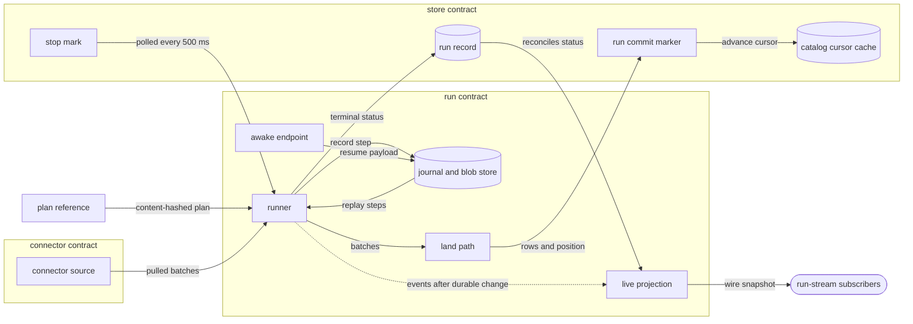
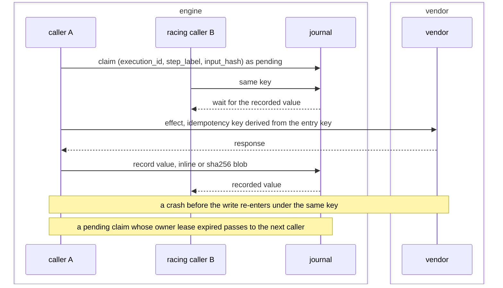
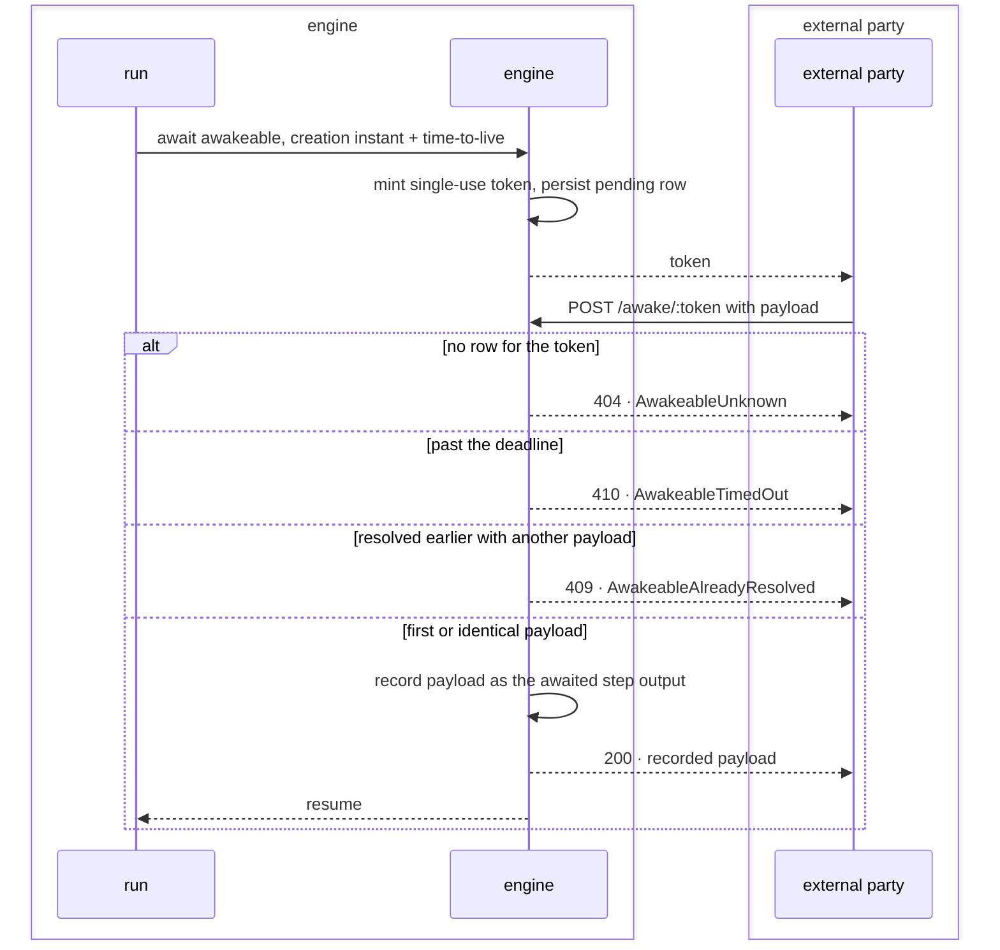
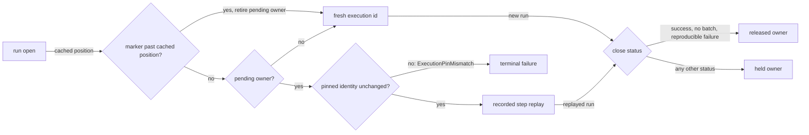
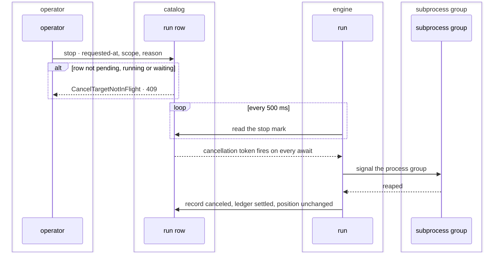
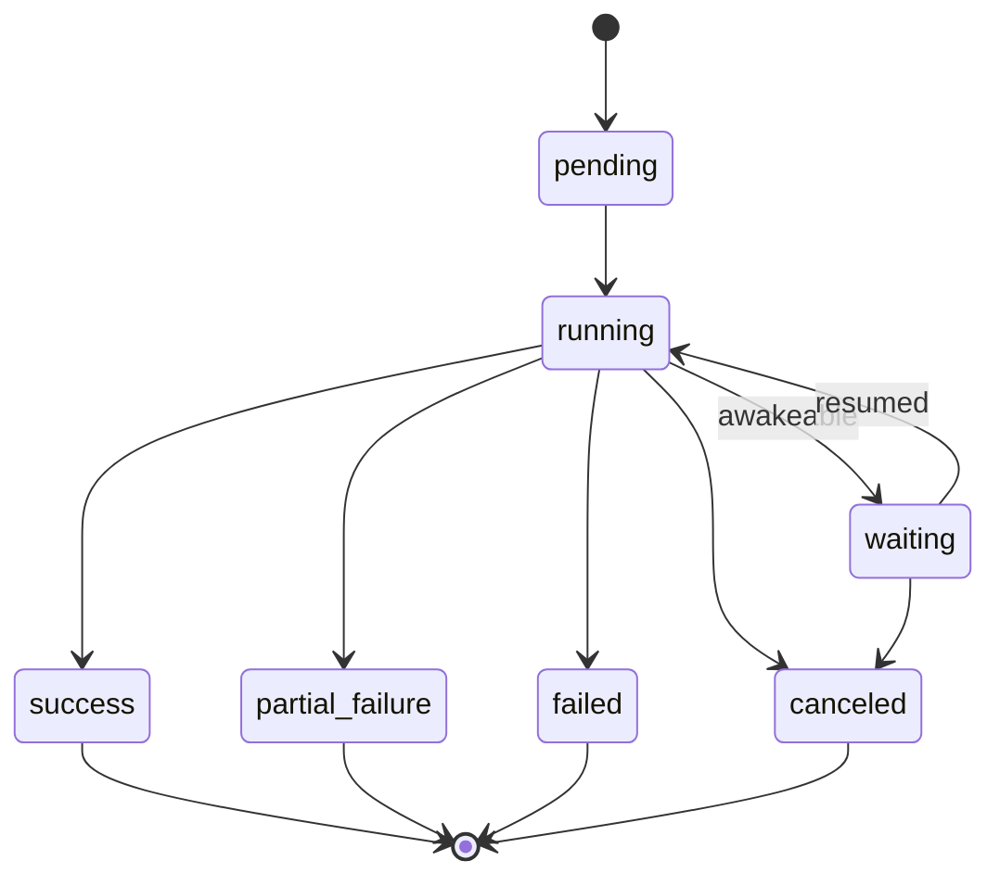

# Durable runs

A run is the unit of work on the run path. It opens against a compiled plan, pulls from a
source through recorded steps, lands rows through the sequence in `31-pipeline.md`, moves an
incremental position forward, and closes on a terminal status every surface reads. One
executor answers for the journal, retry and cancellation across pipelines and the derive tier.

One run, the durable state around it, and the contracts it meets:



## journal

Recording a step's value once, resolving it on replay, and collecting what a replay can no longer reach.

- `step-output` — A journaled step's value is recorded exactly once and its effect runs at least once: a crash between effect and write re-enters the effect, and every later call under the key returns the recorded value.
  *because exactly-once effects need the vendor's cooperation, and the recorded value is the one fact a replay can rely on*
- `entry-key` — An entry is keyed by `(execution_id, step_label, input_hash)`. The first caller claims the key with a pending row before entering the effect; a racing caller waits for the recorded value instead of computing.
  *because two racers computing one key issue two billed calls and spend two meter permits*
- `claim-takeover` — A pending claim whose run owner lease has expired, {{run.record.owner-lease}}, is taken over by the next caller under that key.
- `idempotency-key` — Every outbound request a step makes carries an idempotency key derived from its entry key, identical on every re-entry of that effect.
  *because a vendor honoring the key turns an at-least-once effect into one billed call*
- `inline-cutoff` — A value of 1 MiB or smaller is stored inline in its row as bytes; a larger value lands in a content-addressed blob named by its sha256, and the row holds the reference.
- `blob-write` — Concurrent writers of one blob hash converge on one stored value and none errors on another's write; no partial write survives beside it.
  *A-run*
- `missing-blob` — A row whose blob reference resolves to no stored blob raises `BlobMissing` carrying the reference, never an empty value in place of the recorded one.
  *P6*
- `collection` — Retiring an execution owner deletes its journal rows in the retiring transaction.
  *because recorded work is needed only while a replay can reach it, and an uncollected journal grows with total ingest*
- `blob-sweep` — A mark-and-sweep pass every 24 h deletes each blob that no journal row or pending awakeable references and that is older than 1 h.
  *because the grace window covers a blob written ahead of the row that names it*
- `effect-boundary` — A body replays faithfully when every observable side effect passes through a recorded step, a cursor commit or an awakeable; the work between them is pure.
- `recorded-batch` — A journaled pull records the batch as the source handed it over, after {{run.guard-secrets.placement}} and ahead of the land path.
- `replay-lands` — A journal hit hands the recorded batch to the land path, so a resumed run lands bytes identical to an uninterrupted one, batch ordinal included.
- `ledger-settles-first` — The outbound request ledger settles durably before the entry recording its batch commits.
- `redacting-source` — A pipeline declaring write-path redaction over a source that journals its pulls raises `JournalRedactionConflict` at manifest validation and again at run open, before the first pull.
  *A-authority*
- `opt-out` — Pull journaling defaults on. A source whose pre-pull cursor cannot name the content it reads opts out through one constant, pinned against each source's declaration by a test. An empty pull is never journaled.
- `escape-hatch` — Two escape hatches exist and no third: `journal.unsafe(label, effect)` for an idempotent read, and a source declaring that it journals no pull. Each carries its idempotency argument at a greppable call site.
- `substrate-port` — The run-path substrate is one interface: open or resume an execution under a scope for a content-hashed plan reference, record a step output, commit a cursor, suspend on an awakeable with a timeout, attach a retry schedule, describe capabilities.
  *A-run*
- `storage-ports` — Journal rows, blobs and awakeables persist through a journal store, a blob store and an awakeable store; every `run.journal` and `run.suspend` clause holds for each adapter, the file tree included.
  *A-run*
- `sqlite-stores` — `contextful-sqlite` serves the journal, blob and awakeable stores from one SQLite file in write-ahead-log mode over one connection, a blob as a row keyed by its sha256; an awakeable update commits with the journal writes inside it.
  *because a resolution recording its payload through a second connection waits on the write lock its own update holds*
- `plan-pin` — A run resolves the plan reference it started against for its whole life.
- `store-input` — A store-driven run reads its statement once, through the read face under the job's grant at its `as_of`, and records the resolved snapshot id per table and the ordered input rows as its first step.
  *A-surface*
- `input-replay` — A resume iterates the recorded input and never re-reads the statement, so a row landed after the pinned `as_of`, or folded since, never enters the input set.
- `open-as-of` — A store-driven job declaring no `as_of` resolves it to the instant its execution opens, recorded in the input step, so every resume reads that instant.
- `input-pin` — A store-driven run's plan reference hashes its body name, statement and declared `as_of`, so a resume under a changed one meets {{run.own.pinned-plan-changed}} before any step replays.
  *A-surface*
- `input-truncated` — An input statement whose response the face truncates at its row ceiling raises `RunInputTruncated` before any row runs.
  *because a silently shortened input set closes `success` as though every row ran*
- `row-step` — Each input row runs the registered body under a row key, its ordinal in the recorded input; every step the body records carries a label scoped to that key, and a paid call carries {{run.journal.idempotency-key}}.
  *because two rows sharing one label under one execution resolve to one recorded value*
- `row-concurrency` — A store-driven run holds at most `max_in_flight` rows inside the body at once; a failing row admits no further row, and the run closes after the rows in flight return.
- `row-output` — The rows every body emits land after the last input row completes and before the owner retires, one run per declared output table through {{run.land.stage-order}}.
  *because a landing that fails then holds the owner, and its resume replays every paid call instead of paying again*
- `unwired-capability` — Reaching for a capability the running profile does not wire raises `CapabilityUnwired` at the first reach, before any half-finished work.
  *A-topology*
- `machine-state` — Journal rows, execution owners and awakeables are machine-local state that a catalog rebuild leaves untouched and the file tree never reconstructs.



unsettled: Does the inline-versus-blob cutoff stay one number across every step kind? owner: run-path affects: run.journal

unsettled: Does a journal store apart from the catalog retire an owner's rows after the catalog commits, repeating the retire at the next open? owner: run-path affects: run.journal

unsettled: How do fan-out bodies express an explicit join, and what does a partially-failed fan-out record? owner: run-path affects: run.journal

## advance

Committing an incremental read position under its declared kind, and the boundary a poll re-reads.

- `cursor-kind` — A cursor declares `monotonic` for a timestamp, autoincrement or watermark, `opaque-token` for a vendor continuation token, or `snapshot-id` for a log sequence number or version id. An undeclared kind resolves to `opaque-token`.
- `concurrency-by-kind` — A `monotonic` position is concurrent-safe and commits the highest value observed. An `opaque-token` or `snapshot-id` position moves only under a single-writer lease. Last-write-wins governs no cursor.
  *because two writers resolving one continuation token by recency skip or duplicate records with no count showing it*
- `engine-owned` — A connector moves its position only by committing through the engine; that commit is a recorded step and replays as a resolved read.
- `commit-with-rows` — A table's new position rides the run commit marker, {{store.lay-out.run-manifest}}, that publishes the rows behind it; the catalog cursor is a cache of the newest committed marker.
  *because rows and position committed in two stores leave a crash window that re-lands a batch*
- `cursor-bytes` — A position is opaque bytes the connector owns, and its kind is a manifest fact the engine reads. Each table carries its own position.
- `inclusive-boundary` — A polled load admits a row whose clock value is at or after the stored position, re-landing the boundary instant's rows on every poll.
  *because a clock coarser than the row grain otherwise drops a sibling sharing the boundary value, permanently and invisibly*
- `declared-key-required` — The boundary re-land is idempotent on a table declaring a key; on a keyless table the repeats accumulate in its union view.
- `watermark-shape` — A watermark position serializes as `{"field": "<name>", "at": <value>}`, naming the column it was measured against.
- `field-rename` — Opening a position whose stored field differs from the declared `incremental` field raises `CursorFieldMismatch` before any request leaves the host.
  *A-run*
- `frontier` — The frontier counts every fetched row, landed or not. A committed position moves forward or holds; an empty or older window never rewinds it.
- `unorderable-position` — A row with no orderable value in the clock field, or a stream switching between text and numeric positions mid-pass, raises `CursorPositionUnorderable`, terminal for the pull.
  *A-run*
- `turning-incremental-on` — Enabling `incremental` on a pipeline that holds a position starts from none, re-landing the source's current window once.
- `skip-unchanged` — A snapshot-shaped source with `skip_unchanged = true` records its input's raw-byte digest as `{ sha256, rows }`; a matching digest returns zero batches, holds the position and closes a zero-row success. Undeclared, it is false.
- `zero-row-commit` — A commit landing zero rows adds and replaces nothing, so a replacing table keeps its last non-empty state across a skip or an empty pull.

unsettled: What bounds allowed lateness for an out-of-order source, and does a lateness window hang on the position or on the table? owner: run-path affects: run.advance

## suspend

Durable suspension on an external callback, its deadline and its resumption.

- `awakeable` — An awakeable suspends a run durably: the engine mints an opaque single-use token and persists a `pending` row beside the journal; an external party resumes by posting the token back.
  *A-run*
- `resume-is-a-step-output` — A resume payload is recorded as the awaited step's output under key `sha256("awakeable:" + token)`, so a run that resumes and then crashes reads it back without suspending again.
- `deadline` — A deadline is the creation instant plus a time-to-live, both caller-supplied RFC3339 Zulu strings; the core reads no wall clock.
- `timeout-is-sticky` — Expiry is evaluated against an injected instant; a suspension past its deadline becomes `timed_out` and stays so under any later instant.
- `idempotent-resolution` — Resolving a token again with the identical payload returns the recorded value.
- `conflicting-resolution` — A second resolution with a different payload raises `AwakeableAlreadyResolved` and leaves the recorded value untouched.
  *A-run*
- `expired-token` — Resolving a token past its deadline raises `AwakeableTimedOut`.
  *A-run*
- `unknown-token` — A token with no row raises `AwakeableUnknown` and allocates no state.
  *P2*
- `resume-route` — `POST /awake/:token` answers `200` with the recorded payload, `404` for {{run.suspend.unknown-token}}, `409` for {{run.suspend.conflicting-resolution}} and `410` for {{run.suspend.expired-token}}. `GET /awake/:token` reports state without resuming. Both authenticate before touching the registry.
- `payload-offload` — A payload above {{run.journal.inline-cutoff}} lands in the journal's blob store, and the pending row references it.
- `survives-restart` — The awakeable registry persists beside the journal; a restart drops no pending callback.
- `row-parks` — A store-driven row awaiting an unresolved awakeable parks and frees its slot; the other rows run on, and the parked row re-enters its body once the awakeable resolves or its deadline passes.
- `recorded-timeout` — A row's wait past its deadline records a timeout value as that wait's step output, so every re-entry of the body reads the identical value.
  *because a body branching on the clock rather than on a recorded value replays differently after a crash*



unsettled: Is resuming a suspension bound to a verified caller identity, or is possession of the single-use token the whole authority? owner: run-path affects: run.suspend

## retry

Classifying a failure, the single retry layer, and the delay before the next attempt.

- `failure-taxonomy` — One tagged failure type crosses every port: `Transient`, `Permanent`, `SchemaIncompatible`, `AuthExpired`, `RateLimited`, `Config`, `Storage`, `UnknownConnector`, `SecretNotFound` and `Canceled`. A caller branches on the tag, never on a message.
  *P2*
- `schedule` — A schedule attaches to a step and carries a fixed or exponential backoff with base and factor, a total attempt count including the first, a per-delay clamp, a jitter ceiling and `retry_on`.
- `default-policy` — The default schedule is exponential from a 100 ms base with factor 2, to 5 attempts in total, each delay clamped at 30 s, plus seeded jitter below 250 ms.
  *because zero jitter synchronizes every run that hit one shared throttle*
- `single-attempt` — A schedule of 1 attempts is the no-retry schedule.
- `retryable-classes` — `Transient` and `RateLimited` retry; every other tag stands as the step's answer whatever budget remains. `retry_on` narrows that pair.
  *P6*
- `unretryable-tag` — A `retry_on` naming any tag outside `Transient` and `RateLimited` raises `RunRetryTagUnretryable` at plan compile.
  *P6*
- `step-failed` — A non-retryable failure, or a step exhausting its schedule, raises `StepFailed` carrying the step label and the underlying tag.
  *P6*
- `deterministic-verdict` — A refusal whose check is pure over static input is terminal and consumes no attempt budget.
  *P6*
- `retry-after` — A server-supplied `Retry-After` supersedes the computed delay up to 300 s; a longer one closes the step as `RateLimited` and the run is rescheduled instead of sleeping.
  *because an unclamped upstream delay holds a run slot for as long as the vendor asks*
- `one-layer` — The step's schedule is the only retry layer: an adapter, a credential mint and a meter acquire inside a step return their failure to it.
  *because nested retry layers multiply attempts and amplify a vendor outage*
- `decision-is-pure` — The retry decision is a pure function of the one-based attempt that just closed and the classified failure, jitter derived from an injected seed. The runner owns the sleep and the attempt counter.
- `partial-failure` — A run that landed some batches and then failed closes `partial_failure`, naming how many landed; the journal holds the resume point.
- `pressure-is-local` — Rate-limit pressure against one source paces only that source's runs.
- `bound-hit-is-transient` — A connector striking one of its declared resource bounds answers `Transient`, and every bound decision is recorded on the run record.

unsettled: Does the engine offer a compensation combinator for partial-failure rollback, or does compensation stay author-written recorded steps? owner: run-path affects: run.retry

unsettled: Where does an in-flight schedule's attempt counter persist, so a crash mid-backoff resumes the budget instead of restarting it? owner: run-path affects: run.retry

## own

The execution owner a scope holds and the connector build it pins while pending.

- `execution-owner` — One durable execution owner exists per scope; a table or chunk owner holds the connector identity with its component world, the pipeline `content_hash` and the input hash.
- `host-scope` — The catalog keys every owner on its scope — live table, backfill chunk or host-declared id — a table owner keeping its stored key byte for byte, and a host owner pinning the plan reference and identities the host supplies.
  *A-run*
- `execution-id-keys-the-journal` — Recorded work keys on the execution id; a catalog run id is the provenance of one attempt, so attempts under one owner resolve the same recorded values.
- `retirement` — Retiring an owner and caching its committed position share one catalog transaction; a later fire receives a fresh execution id even at a byte-identical position. A completed backfill chunk retires the same way.
- `marker-reconciles` — At run open, a commit marker newer than the catalog's cached position retires the pending owner that produced it before any replay.
  *because a crash between marker and catalog otherwise replays a recorded pull into rows already committed*
- `pinned-plan-changed` — While an owner is pending, a changed pin — connector identity, component world, pipeline `content_hash`, or a host's plan reference or identities — raises `ExecutionPinMismatch` before replay, terminal and non-retryable, naming the scope and both pin sets.
  *A-connector*
- `pin-recovery` — Restoring the recorded build and resuming to completion clears a pending owner; an explicit chunk rewind retires the owners its window covers.
- `scope-independence` — A finishing table releases nothing another table's unfinished execution holds, and a seeding scope carries its own source identity.
- `unclosed-execution` — An execution handle dropped without close records no status; its owner stays pending, and the next open under its scope resumes it once {{run.record.owner-lease}} lapses.
  *A-run*
- `live-owner` — An open under a host scope whose pending owner has an attempt on an unexpired {{run.record.owner-lease}} fails `Transient` naming that attempt, and its run row closes `failed` without joining the owner.
  *because two live handles on one owner share its journal, and either one retiring it strands the other*
- `pin-release` — `success`, a failure that wrote no batch, and a failure a replay reproduces, {{run.own.staged-bytes}} or {{run.land.late-type}}, release the owner; every other status holds it.
- `admission-pin` — A run pins its connector identity at admission and a replay resolves the artifact from that pin; a connector rebuilt later reaches no in-flight or replayed run.
  *A-connector*
- `backpressure` — The runner stages each shaped batch through the destination as one part before its next pull, so a run holds one pulled batch in memory; the commit names the staged parts.
  *because holding every batch until the commit sizes a run's memory by the sum of its pulls*
- `one-commit-per-run` — One run produces one atomic commit per table; a crash mid-run leaves parts under that run's own directory, and a resumption continues from the last recorded step.
- `staged-bytes` — A stage carrying one run's staged parts past 1 GiB raises `RunStagedBytesExceeded`, deterministic; the run commits nothing and retires its owner, so the next fire pulls afresh from the stored cursor.
  *because a replay of the run's recorded pulls stages the same bytes past the bound and fails identically, holding the table's owner indefinitely*
- `stage-schema` — A stage refuses against `schema.json` and the run's earlier stages, then merges its columns into the run's own staged schema; only the commit merges them into `schema.json`.
  *because otherwise rows no commit publishes fix a column's type in the table's schema*
- `stage-commit-seq` — A staged part carries no `_commit_seq`; the commit assigns it under {{store.reserve.commit-order}} and writes it into each part it names, so a run committing between a stage and that commit takes the lower value.
  *because a value fixed at the stage orders a run by its first pull, and the readable runs then hold no prefix of the sequence*
- `stage-instant` — A staged part carries no `_ingested_at`; the commit writes its commit instant into each part it names, so every row of a run carries the instant its marker carries.
  *because a stage-time instant ranks a run by its first pull, so under {{store.declare.dedup-view}} an earlier committer outranks a later one on a shared key*
- `stage-discard` — A run that fails removes every part it staged, and a commit failing before its manifest exists removes the parts it copied; a run's crash leaves its staged parts.
  *because a run id names one attempt, so no later commit names a failed run's staged parts*



#### Scenarios

- `run.own.unclosed-execution`: WHEN a host execution records two steps and its process dies mid-third, THEN the next open under its scope after the lease lapses replays both steps without running their effects.
- `run.own.live-owner`: WHEN attempt `job-a` holds host scope `index-42` open and `job-b` opens under it, THEN `job-b` fails `Transient` naming `job-a`, and `job-a` alone holds the owner.
- `run.own.pinned-plan-changed`: WHEN a host scope's pending owner pins plan reference `plan-a` and an open asks for `plan-b`, THEN the open refuses with `ExecutionPinMismatch` and its run row closes `failed`.
- `run.own.backpressure`: WHEN a source serves three pages, THEN the destination stages part 0 after the first pull, part 1 after the second and part 2 after the third, and one commit names all three.
- `run.own.staged-bytes`: WHEN each of three pulls stages a 400 MiB part, THEN the third stage fails the run `Permanent` with `RunStagedBytesExceeded`, the cursor stays where it stood, and the next fire pulls all three pages under a fresh execution.
- `run.own.stage-schema`: WHEN run `run-s` stages `ts` as text and fails, THEN a later run lands `ts` as a timestamp, and `run-s`'s commit refuses with `StoreSchemaIncompatible`.
- `run.own.stage-commit-seq`: WHEN run `run-s` stages a part, run `run-c` then commits as `_commit_seq` 1, and `run-s` commits after it, THEN every row of `run-s` reads `_commit_seq` 2.
- `run.own.stage-instant`: WHEN run `run-a` stages key `k` at 00:01, run `run-b` commits `k` at 00:03 and `run-a` commits at 00:05, THEN the keyed read returns `run-a`'s row, `_ingested_at` 00:05.
- `run.own.stage-discard`: WHEN a run stages its first page and its second pull fails, THEN its run directory holds no staged part.

unsettled: Which pass collects the staged parts of a run that crashed before its commit, and after what age? owner: run-path affects: run.own


## cancel

Stopping work in flight at either grain, the one token every await observes, and what a stop leaves behind.

- `catalog-channel` — A stop is written onto the run row as a requested-at instant, a scope and an optional reason; the catalog is the only channel.
- `two-grains` — A `run`-scoped stop halts one run and the fire continues; a `pipeline`-scoped stop halts every in-flight run of the pipeline and every table or chunk the fire had left. An unrecognized stored scope reads as `run`.
- `host-grain` — A `pipeline`-scoped stop on a host execution's run halts every in-flight run under the same host-declared scope and no run of another scope.
- `one-token` — Each run holds one cancellation token that every await selects on: the pull, a retry sleep, an awakeable wait, a meter acquire and a subprocess wait.
  *because a stop observed only at the pull leaves sleeps and child processes running after the record reads canceled*
- `poll-interval` — The token is fed by one catalog read before the run's first await and then one every 500 ms, the cancellation arm evaluated ahead of the work arm.
- `engine-keeper` — One keeper per engine renews every registered execution's owner lease and feeds its token, sleeping until the earliest deadline; opening an execution registers it, and close or drop deregisters it.
  *A-run*
- `keeper-panic` — A keeper job that panics warns and leaves the keeper running: every other registration keeps its cadence, the panicking one retries at its next deadline, and dropping it returns.
  *because the keeper is shared, so one adapter's panic that ended its thread lapses every open execution's lease under a live run*
- `land-path-uncut` — The land path carries no stop check; a run whose bytes are home finishes landing and records the stop it did not fulfill.
- `abandoned-work` — Abandoned work surfaces as the `Canceled` tag through the ordinary failure path, which settles the request ledger, closes the record and leaves the position alone.
  *A-run*
- `child-reaped` — A stop signals a running subprocess chain's process group, and the record is written `canceled` only after the group is reaped.
  *because a record reading canceled while a child still runs misstates what the machine is doing*
- `storage-blip` — A failed poll read warns and keeps polling.
- `not-in-flight` — Only a `pending`, `running` or `waiting` row accepts a mark; a stop matching none raises `CancelTargetNotInFlight`, answering `409` over HTTP and exiting non-zero at the terminal.
  *A-run*
- `re-mark` — Marking an already-marked row overwrites it with the newer request.
- `distinct-terminal-status` — `canceled` is a terminal status apart from `failed`, and upstream health observations skip it.
  *A-run*
- `resumable-remains` — A stopped run's recorded pull keeps its owner and replays next attempt; a stopped pull that recorded nothing releases it. A stopped chunk returns to pending, its attempt count unchanged. A stop advances no position.
- `authority-from-the-record` — A stop authorizes against the pipeline read off the run record, never off the request.



#### Scenarios

- `run.cancel.engine-keeper`: WHEN 20 executions are open on one engine, THEN one keeper thread renews all 20 owner leases, and it exits once the last one closes or drops.

## record

The durable run record, its statuses, its owner lease and windowed history over it.

- `reserved-table` — The durable run record is a reserved store table holding two append-only rows per run, one at plan and one at commit; the latest row per run and phase wins. The local catalog is a cache in front of it.
- `columns` — A run row carries run id, pipeline id, site id, status, owner, start and end instants, row and byte counts, error kind and message, connector id, version and hash, trace id and phase.
- `status-set` — A run status is `pending`, `running`, `waiting`, `success`, `partial_failure`, `failed` or `canceled`, spelled identically on the record and the wire snapshot; every surface classifying a run covers all seven.
  *because two vocabularies for one lifecycle leave a suspended or partly failed run without a reading*
- `row-at-open` — A row is written at run open, before the first pull, so a zero-row `success`, a `failed` row carrying its error kind, and no row at all read apart.
- `time-travel` — Run history inherits the store's transaction-time bound, so one as-of selector rewinds it with every other table.
- `owner-lease` — A `running` or `waiting` row carries an owner of process id, boot id and a lease expiry, renewed every 10 s with a 30 s time-to-live.
  *because a second process sharing the catalog needs a liveness signal to tell a live run from an orphan*
- `orphan-reap` — Startup marks `partial_failure` only a non-terminal row whose owner lease has expired; a row held by a live process is left alone.
- `writing-site` — The writing site is an engine-injected provenance column beside the ingestion stamp and run id; a row written without one reads null and renders unattributed.
- `site-id-length` — A site id matches letters, digits, dot, underscore and hyphen, from 1 chars to 64 chars.
  *because it is interpolated into run directories and request-ledger filenames*
- `site-id-unresolved` — A site id comes from the manifest's `site_id`, or the variable its `site_id_env` names, and a run's `--site-id` or `--site-id-env` replaces that declaration; no declaration, both keys in one place, or an unset variable raises `SiteIdUnresolved` at startup.
  *P3*
- `history-window` — History is read through a window, an inclusive start-instant lower bound plus a row ceiling, both applied in the storage adapter's `WHERE` clause, newest first.
- `describe-window` — The describe surface answers with 5 rows by default and clamps a caller's ceiling at 500 rows.
- `bound-spelling` — A window lower bound is `YYYY-MM-DD` or a UTC RFC3339 instant ending `Z`; any other spelling raises `HistoryBoundSpelling` at every caller-facing surface.
  *because a bound read under a guessed zone silently moves the window*
- `truncation-flag` — A history response echoes its window and flags truncation when the pipeline recorded more runs inside it than the ceiling returned.
- `empty-window` — An empty window answers `[]` and raises nothing.
- `history-export` — History leaves the machine as a process listing and an NDJSON export over one run projection; the export's first line carries store, window, count and truncation flag, then one run per line. It resolves no bucket.
- `export-ceiling` — The export answers with 500 rows by default and clamps at 5000 rows, each pipeline's window taking the full ceiling before the merged result is clipped once.
- `error-cap` — A recorded error is masked over credential-shaped spans and capped at 2 KiB with an ellipsis marker, on the one projection every surface serves.
- `failure-publishes` — The bucket push runs on the failure arm as on the success arm, for every failure past run open.
- `per-table-accounting` — A table failing inside a multi-table fire leaves one row with its error kind, a step-failure and a run-failure event, and a position where the next run resumes, under either `on_table_error` setting.
- `counts-at-destination` — Row and byte counts are measured at the destination, not at the source.
- `skipped-count` — A pull's optional `skipped` field counts inputs the source declined to land whole; the run row sums it over the run's pulls, replayed pulls included, beside the destination counts.
  *because a skipped input raises no error, and a count on the record surfaces it without reading the landed rows*
- `input-bounds` — A store-driven run's row carries its input: the resolved `as_of`, the snapshot id per table and the input row count.

unsettled: What does a run-record manifest carry for a catalog rebuild to restore history instead of resetting it? owner: run-path affects: run.record

## project

The best-effort live view of a run and the subscription that carries it off the machine.

- `best-effort` — Live run state is a best-effort projection of events the runner emits after durable state changes; execution never reads it.
- `wire-snapshot` — The wire snapshot carries run id, workflow id, a status from {{run.record.status-set}}, an ordered step list, an application metadata map, optional start and end instants, an optional tagged error and a version. Every deploy target emits it identically.
- `step-view` — A step view carries its label, a status of `pending`, `running`, `completed`, `failed` or `retrying`, its attempt count, optional instants, an optional output reference with byte count, and an optional tagged failure.
- `stopped-step` — A stopped run reports its executing step `failed` with the `Canceled` tag and leaves the run-level error unset.
- `emission-never-blocks` — Progress emission is no journal step: events reach an in-process observer over a bounded channel that drops when full and never blocks the runner.
- `terminal-slot` — A terminal transition bypasses the lossy channel through a per-run slot that is never dropped; a projection reading non-terminal behind a terminal run record reconciles from the record.
  *because a dropped terminal event otherwise leaves a finished run reading running forever*
- `coalescing` — Snapshot broadcasts coalesce to at most one per 100 ms, keeping only the latest; a terminal transition flushes immediately. The clock is injected.
- `metadata-too-large` — A metadata write whose serialized size exceeds 16384 B raises `RunMetadataTooLarge` naming size and bound, and the snapshot stands unchanged.
  *because a silently clipped map reads as the complete metadata*
- `version` — The snapshot version is `(epoch, counter)`, the epoch being the hub's start instant, compared lexicographically; a client discards any delta at or below the highest version it holds.
  *because a bare counter restarts at zero with the process and freezes every client's view*
- `reducer-is-total` — The reducer is total: nothing overwrites a terminal step or run status, a new step label appends, an existing one merges field-wise, and a stale delta is a no-op.
- `outputs-by-reference` — A step output appears as a post-redaction reference and a byte count, never inline; fetching the payload is a separately authorized request.
- `connect` — A subscriber receives the folded snapshot and its update receiver under one lock, missing and duplicating no update.
- `broadcast-ring` — The per-run broadcast holds 256 entries; a subscriber that overruns it resynchronizes to the latest snapshot.
- `unauthenticated-upgrade` — The run-stream socket authenticates on the HTTP request before the upgrade; a missing or invalid credential raises `RunStreamUnauthorized` with `401`, and an unseen run answers `404`.
  *A-read*
- `read-only-socket` — A subscription is read-only; a stop travels as an authenticated route.
- `restart-discards` — A restart discards in-memory snapshots; a subscriber recovers history from the durable record.
- `delegated-progress` — A heavy step delegated to another host reports progress by posting to the awakeable callback route, and the orchestrating run folds it into its own snapshot.

unsettled: Does the hub keep a bounded ring of recent deltas so a late joiner can animate the catch-up? owner: run-path affects: run.project

unsettled: How is a per-run channel evicted in a long-lived process, given that a channel is allocated on a run's first event? owner: run-path affects: run.project

## Shapes

Run statuses:



The three cursor serializations, and the unchanged-input digest:

```json
{"kind": "monotonic",    "position": {"field": "updated_at", "at": "2026-03-01T00:00:00Z"}}
{"kind": "opaque-token", "position": "eyJwYWdlIjo0N30="}
{"kind": "snapshot-id",  "position": {"lsn": "0/1A2B3C4D"}}
{"kind": "monotonic",    "position": {"sha256": "c1d9…", "rows": 20418}}
```
