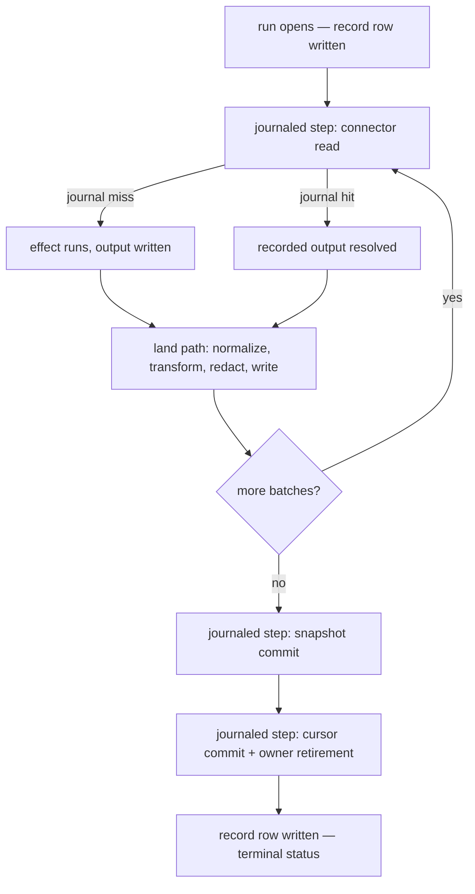
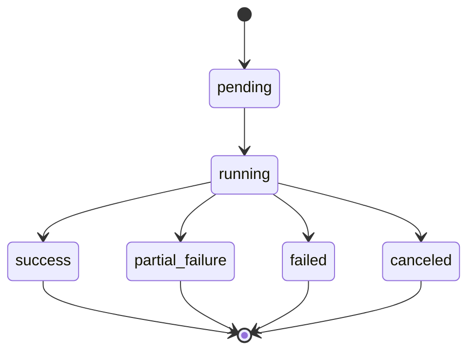
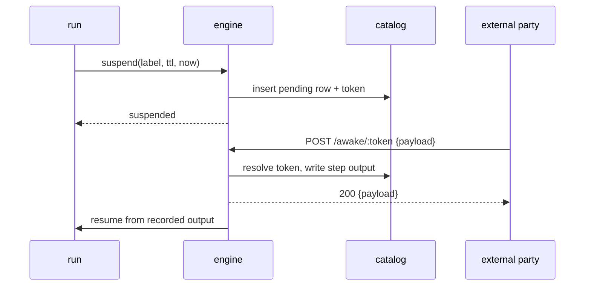
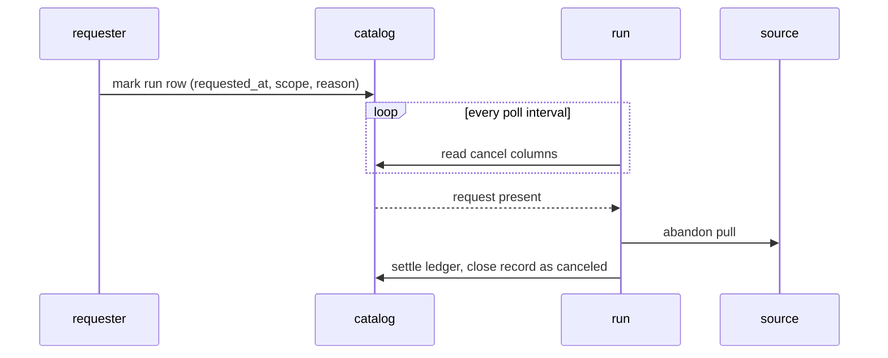

# Durable run execution

A run is the unit of work on the run path. It opens against a compiled plan, pulls from a
source through recorded steps, lands rows, moves an incremental position forward, and
closes on a terminal status the whole system reads. This file states what survives a crash,
what happens twice, what happens once, and what a reader of a finished or a live run sees.

## Parties

| Party | Obligation |
| --- | --- |
| **The engine** | Owns every recorded step, every cursor advance and every awakeable transition. It records a step's output before any caller observes it, commits a position after the batch behind it is durable, and hands a resumed run its recorded values rather than its effects. |
| **The runner** | Turns a retry decision into a sleep, races a pull against a standing cancellation, emits a progress event after the durable write it describes, and carries the attempt counter across a schedule. |
| **A connector** | Declares its cursor kind truthfully, returns a classified failure rather than an opaque one, and reaches a vendor from inside a recorded step so a replay reaches nobody. |
| **The catalog** | Holds journal rows, execution ownership, cursor positions and the awakeable registry as durable state one process writes at a time. |
| **An operator** | Names the grain a stop applies to, and restores a recorded connector build to finish work an execution owner holds. |
| **A subscriber** | Reads the live projection and writes nothing back over it. Its admission to the stream is one decision, separate from admission to a payload. |

## Operations

| Operation | What it governs |
| --- | --- |
| `journal` | Recording a step's output once, resolving it on replay, and the determinism boundary that sits there. |
| `advance` | Committing an incremental read position under its declared kind, and the boundary a poll re-reads. |
| `suspend` | Durable suspension on an external callback, its deadline and its resumption. |
| `retry` | Classifying a failure, deciding the delay before the next attempt, and what a partial outcome reports. |
| `own` | The durable execution owner a scope holds, the connector build it pins while pending, and the run's data flow. |
| `cancel` | Stopping work in flight at either grain, where the stop is observed, and what it leaves behind. |
| `record` | The durable run record, its statuses, its provenance columns, and windowed history over it. |
| `project` | The best-effort live view of a run and the subscription that carries it off the machine. |

## Clauses — journal

The journal is where an effect becomes a fact. Everything below follows from a step's output
being written down once.

| Clause | Statement | decided-by |
| --- | --- | --- |
| `run.journal.invariant.step-output` | A journaled step runs its effect exactly once. The first call under a key enters the effect and durably writes what it produced; every later call under that key returns the written value without entering the effect again. | |
| `run.journal.shape.entry-key` | A journal entry is keyed by `(execution_id, step_label, input_hash)`, which is the primary key of the `journal` table. An unfinished attempt reuses its execution id, so a second attempt resolves recorded work rather than writing a second copy of it. | |
| `run.journal.limit.inline-cutoff` | A journaled value of 1 MiB or smaller lives inline in its row, bound as bytes so any codec round-trips it unchanged. | |
| `run.journal.shape.value-tier` | Above the inline cutoff the value lands in a content-addressed file named by its sha256 under the blob directory and the row holds that reference. A caller receives bytes either way and branches on neither tier. | |
| `run.journal.invariant.blob-address` | A blob writer stages its own temporary file and renames it over the destination. The last rename wins and every outcome is the same file, since the destination name is the hash of its contents. No writer errors on another's in-flight write and none waits for one. | |
| `run.journal.refusal.missing-blob` | A row holding a blob reference whose file resolves to nothing fails with `BlobMissing` carrying the reference — never a panic, never an empty value standing in for the recorded one. | `0071` |
| `run.journal.invariant.row-admission` | Two writers racing one unwritten key may both compute. Admission is insert-or-ignore, one row survives, and the re-read hands the surviving value to both. The database lock releases before an effect runs, so an effect holds no catalog write lock. | |
| `run.journal.invariant.effect-boundary` | The determinism boundary is the journal. A body replays faithfully when every observable side effect passes through a recorded step, a cursor commit or an awakeable; the connector pull, the cursor commit and the snapshot commit are each such a step, and the work between them is pure. | |
| `run.journal.invariant.recorded-batch` | A journaled pull records the batch as the source handed it over, serialized inside the pull and ahead of the land path. The recorded artifact is a second envelope over the same rows rather than a copy of what the destination table ends up holding. | |
| `run.journal.invariant.replay-lands` | A journal hit hands back the recorded batch and the land path runs over it as it ran the first time, so a peppered mask applies once per landing and a resumed run lands bytes identical to an uninterrupted one. The resolved batch ordinal freezes into the artifact and survives shredding into parent and child tables. | |
| `run.journal.invariant.ledger-settles-first` | The outbound request ledger settles durably ahead of the entry that commits. A recorded batch can never exist without the set of vendor calls that produced it. | |
| `run.journal.invariant.removable-value` | No value a policy strips reaches the journal. Ordering holds that where ordering reaches, and where it does not the pairing that defeats it is refused ahead of the first pull, so nothing is written down and regretted. | |
| `run.journal.shape.journaling-opt-out` | Pull journaling defaults on. A source opts out when its pre-pull cursor cannot name the content it is about to read, and the opt-out set is one constant pinned against each source's own declaration by a test. An empty pull is journaled under no circumstances. | |
| `run.journal.refusal.redacting-source` | A pipeline declaring write-path redaction over a source that journals its pulls raises `JournalRedactionConflict` ahead of its first pull — from the connector name during manifest validation, on the apply and reconcile path, and from the built source at run open, which also catches a source wired under a name no table declares. | `0072` |
| `run.journal.interface.escape-hatch` | Two escape hatches exist and no third: `journal.unsafe(label, effect)` for an idempotent read where recording is pure overhead, and a source declaring that it journals no pull, which repeats that one source's pull on replay. Each carries a stated idempotency argument at a greppable call site. | |
| `run.journal.interface.substrate-port` | The run-path substrate is reached through one interface: start or resume a run for a content-hashed plan reference, record a step's output, commit a cursor under its kind, suspend on an awakeable with a timeout, attach a retry schedule to a step, and describe the driver's capabilities. | |
| `run.journal.invariant.plan-pin` | The plan reference a run starts against is its replay pin. A run resolves the same plan for the whole of its life and never swaps to a mutated one mid-flight. | |
| `run.journal.refusal.unwired-capability` | A capability the running profile does not wire raises `CapabilityUnwired` when a caller reaches for it, so a profile mismatch fails on the first reach rather than inside a half-finished run. | `0073` |
| `run.journal.invariant.rebuild-survival` | Journal rows and execution ownership survive a readable rebuild of the catalog unchanged. Neither is reconstructed from the file tree after the catalog is lost, so a lost catalog is lost recorded work rather than recoverable work. | |

The reserved namespace the journal's tables sit inside is [`10-store.md` § Reserved
names](10-store.md); a table under it belongs to the engine and an application pack binds
none of them. The plan a run resolves is compiled in [`31-pipeline.md` §
Compile](31-pipeline.md); its hash is what a pin compares.

## Clauses — advance

A cursor is the position a stream resumes from. Its declared kind decides how many writers
may move it.

| Clause | Statement | decided-by |
| --- | --- | --- |
| `run.advance.shape.cursor-kind` | A cursor declares one of three kinds: `monotonic` for a timestamp, autoincrement or watermark position; `opaque-token` for a vendor page or continuation token; `snapshot-id` for a log sequence number or version identifier. A source declaring no kind resolves to `opaque-token`. | |
| `run.advance.invariant.concurrency-by-kind` | A `monotonic` position is concurrent-safe and commits the highest value observed. An `opaque-token` or `snapshot-id` position moves under a single-writer lease and nowhere else. The kind decides this, never the executor and never an operator setting. | |
| `run.advance.invariant.no-last-write-wins` | Last-write-wins governs no cursor of any kind. Two writers resolving one continuation token by recency skip or duplicate records silently, with no error raised and no gap visible in any count. | |
| `run.advance.invariant.engine-owned` | A connector moves its position by committing through the engine, holding no state file of its own. That commit is itself a recorded step, so it replays as a resolved read and re-advances no remote position. | |
| `run.advance.invariant.advance-after-write` | The engine commits a position after the batch behind it is durably written. A crash between the write and the commit re-reads from the last committed position rather than skipping the batch that landed. | |
| `run.advance.shape.cursor-bytes` | A position is opaque bytes the connector owns — a byte list across the guest boundary, JSON verbatim in the catalog — while its kind is a manifest-level fact the engine reads. Each table carries its own position, so streams move apart and adding one disturbs no other. | |
| `run.advance.invariant.inclusive-boundary` | A polled incremental load admits a row whose declared clock field is newer than or equal to the stored position. The boundary instant's rows re-land on every poll, bounded to one instant's worth. | |
| `run.advance.invariant.declared-key-required` | Re-landing the boundary instant is idempotent where the destination table declares a key to fold on. Where it declares none the table's view stays a union and the repeats accumulate. | |
| `run.advance.shape.watermark-serialization` | A watermark position serializes as `{"field": "<name>", "at": <value>}`, carrying the name of the column it was measured against beside the value. | |
| `run.advance.refusal.field-rename` | Opening a position whose stored field name differs from the manifest's declared incremental field raises `CursorFieldMismatch` before a request goes out, rather than comparing one column's values against another column's high-water mark. | `0074` |
| `run.advance.invariant.frontier-never-rewinds` | The frontier counts every fetched row, landed or not, since a row below the bound still proves the endpoint reaches that far. A committed position moves forward or stays; a poll returning an empty or older window holds the bound rather than rewinding into rows already landed. | |
| `run.advance.refusal.unorderable-position` | A row carrying no orderable value in the declared clock field, and a stream that switches between a text position and a numeric one mid-pass, each raise `CursorPositionUnorderable` as a terminal failure of the pull. | `0075` |
| `run.advance.invariant.turning-incremental-on` | Enabling incremental reading on a pipeline that already holds a position starts from nothing, so the source's current window re-lands once rather than being stepped over. | |
| `run.advance.shape.skip-unchanged` | A snapshot-shaped source carrying `skip_unchanged = true` records its input's content digest in the position as `{ sha256, rows }`. A digest matching the stored one returns zero batches, holds the position, and closes the run as a zero-row success, which is the skip signal. The option resolves false when undeclared. | |
| `run.advance.invariant.digest-scope` | The digest covers the input's raw bytes, so it elides a re-read of a byte-identical input and nothing else. A re-fetch that rewrites the file with fresh per-row provenance is a genuine change and lands again; collapsing those overlapping copies belongs to the declared key at read time. | |
| `run.advance.invariant.zero-row-commit` | A commit landing zero rows adds nothing and replaces nothing, so a table whose write mode is replacement keeps serving its last non-empty state across a skip. A skip is legible downstream as a skip and under no reading as the source having emptied. | |

Lease acquisition and the position a lease carries between machines are
[`11-sync.md` § Lease](11-sync.md); a pipeline that takes one resumes on whichever machine
holds it. The declaration that names a pipeline's clock field lives in
[`31-pipeline.md` § Declare](31-pipeline.md).

## Clauses — suspend

A run suspends when the thing it waits for happens outside the process.

| Clause | Statement | decided-by |
| --- | --- | --- |
| `run.suspend.invariant.awakeable-token` | An awakeable suspends a run durably: the engine mints an opaque single-use token, persists a `pending` row beside the journal, and an external party resumes by posting that token back. It serves an authorization callback completing in a browser, an asynchronous tool result, and an approval gate under a deadline. | |
| `run.suspend.invariant.resume-is-a-step-output` | A resume payload is written as the awaited step's output under the deterministic key `sha256("awakeable:" + token)`. A run that resumes and then crashes reads the awakeable back as a recorded value and receives the payload without suspending a second time. | |
| `run.suspend.shape.deadline` | A deadline is the creation instant plus a time-to-live, both handed in by the caller as RFC3339 Zulu strings. The core reads no wall clock and computes no instant of its own. | |
| `run.suspend.invariant.timeout-is-sticky` | Expiry is evaluated on poll against an injected instant. A pending suspension past its deadline transitions to `timed_out` and that transition persists, so a later poll carrying an earlier instant still reads `timed_out`. | |
| `run.suspend.invariant.idempotent-resolution` | Resolving a token a second time with the identical payload returns the value already written. The recorded value stays as it was under every resolution attempt. | |
| `run.suspend.refusal.conflicting-resolution` | A second resolution carrying a different payload raises `AwakeableAlreadyResolved` and leaves the written value untouched. | `0076` |
| `run.suspend.refusal.expired-token` | A token whose deadline has passed raises `AwakeableTimedOut` on resolution, so a late external party learns the suspension closed rather than resuming a run that moved on. | `0077` |
| `run.suspend.refusal.unknown-token` | A token with no row behind it raises `AwakeableUnknown`, so an arbitrary string allocates no state and reveals no other suspension. | `0337` |
| `run.suspend.interface.resume-route` | `POST /awake/:token` carries the resume payload as its JSON body and answers `200` with the written payload, an identical re-resolution included, `404` for a token with no row, `409` for a conflicting re-resolution and `410` for a closed one. `GET /awake/:token` reports state without resuming and evaluates the deadline on that read. Both authenticate ahead of the registry, so an unauthorized callback leaves the suspension pending. | |
| `run.suspend.invariant.payload-offload` | A payload above the inline cutoff offloads to the same content-addressed blob the journal uses, and the pending row references it rather than holding a second copy. | |
| `run.suspend.invariant.registry-survives-restart` | The awakeable registry persists in the catalog beside the journal, so a process restart drops no pending callback and an offloaded payload round-trips byte-identical across one. | |

## Clauses — retry

A failure is classified before it is retried, and the decision to retry is arithmetic rather
than a loop holding a timer.

| Clause | Statement | decided-by |
| --- | --- | --- |
| `run.retry.shape.failure-taxonomy` | One tagged failure type crosses every port and both halves of the engine: `Transient`, `Permanent`, `SchemaIncompatible`, `AuthExpired`, `RateLimited { retry_after_ms }`, `Config`, `Storage`, `UnknownConnector` and `SecretNotFound`. | |
| `run.retry.invariant.branch-by-tag` | A caller branches on the tag by pattern match and never on a raw discriminant or a message substring. An engine-level failure is itself tagged — a step failure carrying its label and the effect's own typed failure, an unresolvable blob, an unwired capability, the three suspension outcomes, a storage failure and a serialization failure. | |
| `run.retry.shape.schedule` | A schedule attaches to a step and carries four values: a backoff shape that is fixed or exponential with a base and a factor, a total attempt count including the first, a clamp on any single delay, and an additive jitter ceiling. | |
| `run.retry.limit.default-policy` | The default schedule is exponential from a 100 ms base with factor 2, to 5 attempts in total, each computed delay clamped at 30 s, with no jitter applied. | |
| `run.retry.limit.single-attempt` | A schedule of 1 attempts is the no-retry schedule: one failure closes the step and the run reports it. | |
| `run.retry.invariant.retryable-classes` | A `Transient` or `RateLimited` failure retries. Everything else stands as the step's answer, whatever budget remains. | |
| `run.retry.refusal.permanent-failure` | A `Permanent` failure closes its step immediately and surfaces as `StepFailed` carrying the step label and the underlying typed failure, for the run to compensate on, dead-letter or fail on. A step exhausting its schedule surfaces the same way, carrying its terminal tag. | `0078` |
| `run.retry.invariant.deterministic-verdict` | A refusal whose check is pure over static input is terminal and consumes none of the attempt budget. Repeating a deterministic verdict produces the same verdict later. | |
| `run.retry.invariant.retry-after-verbatim` | A server-supplied `Retry-After` supersedes the computed backoff and is honored as given, unclamped by the schedule's own maximum delay, so the engine keeps the pace the upstream stated. | |
| `run.retry.invariant.decision-is-pure` | The retry decision is a pure function of the attempt number — one-based, naming the attempt that just closed — and the classified failure. It reads no timer, no clock and no random state, and jitter derives deterministically from an injected seed, so one delay reproduces exactly under test. | |
| `run.retry.invariant.runner-owns-the-timer` | The runner turns the returned duration into the actual sleep and holds the attempt counter for the step it is driving. The decision function sleeps for nothing. | |
| `run.retry.invariant.idempotent-attempt` | A successful attempt writes its output under the step's key, so an attempt racing a late success neither writes a second row nor fires the downstream effect twice. | |
| `run.retry.shape.step-declaration` | A step declares its own policy as a maximum attempt count plus the failure tags it retries on, drawn from `Transient`, `Permanent`, `RateLimited`, `AuthExpired` and `SchemaIncompatible`. | |
| `run.retry.shape.partial-failure` | A run that wrote some of its batches and then failed carries a partial-failure status naming how many batches landed, and the journal holds the point a resumption continues from. | |
| `run.retry.invariant.pressure-is-local` | Rate-limit pressure against one source paces that source's own run and leaves every unrelated run at its own pace. | |
| `run.retry.invariant.bound-hit-is-transient` | A connector striking one of its declared resource bounds answers `Transient`, so the schedule may carry it through a spike. Repeated strikes exhaust the budget and close the run quickly rather than holding a slot open, and every bound decision is recorded rather than logged and forgotten. | |

## Clauses — own

An execution owner is what makes a resumption safe: it names the scope, and it names the
build the recorded work came out of.

| Clause | Statement | decided-by |
| --- | --- | --- |
| `run.own.shape.execution-owner` | One durable execution owner exists per live table and per backfill chunk. It holds the connector identity including its component world, the pipeline content hash and the input hash. | |
| `run.own.invariant.execution-id-keys-the-journal` | Recorded work keys on the execution id. A catalog run id stays the provenance of one individual attempt, so several attempts under one owner resolve the same recorded values. | |
| `run.own.invariant.retirement-is-atomic` | Publishing a position and retiring its execution owner share one catalog transaction. A later fire therefore receives a fresh execution id even where the position is byte-identical, and replays no earlier successful pull on the strength of a position that has not moved. Completing a backfill chunk publishes and retires the same way. | |
| `run.own.refusal.pinned-plan-changed` | While an execution owner is pending, a changed connector identity, component world or pipeline content hash raises `ExecutionPinMismatch` ahead of replay, terminal and non-retryable, naming the pipeline, the recorded identity and the one in front of it. | `0079` |
| `run.own.invariant.pin-recovery` | Restoring the recorded build and resuming to completion clears a pending owner. An explicit chunk rewind retires the owners its window covers as part of the same catalog update. | |
| `run.own.invariant.scope-independence` | A later table finishing releases nothing an earlier table's unfinished execution holds, and a seeding scope carries its own source identity rather than borrowing the live one. | |
| `run.own.invariant.pin-release` | Success, and a failure that landed zero batches, release the pin: neither leaves a half-written destination to resume into. Pending, running, partial failure and cancellation hold it, since batches or a recorded pull may be waiting at a position that has not moved. The classification covers every status, so a new one declares which side it falls on. | |
| `run.own.invariant.admission-pin` | A run pins its connector identity at admission and a replay resolves the artifact from that pin rather than from whatever the name resolves to later. A connector rebuilt after admission reaches no in-flight or replayed run. | |
| `run.own.invariant.no-hot-reload` | Re-resolving a connector while a journaled run is live is refused, since a replay into a build that produced none of the recorded outputs diverges invisibly. A new build applies to runs admitted after the change. | |
| `run.own.invariant.run-concurrency` | One run is one workflow is one asynchronous task, and many run beside each other under the dispatcher's concurrency keys. A connector yielding a stream of batches gets parallelism across partitions it declares — paginated shards, replication slots — and serial reading otherwise. | |
| `run.own.invariant.backpressure` | A source yields a stream of record batches and the runner pulls from it. The run path holds no unbounded buffer between the source and the destination. | |
| `run.own.invariant.schema-evolution` | An additive column and a widening promotion are accepted mid-run without interrupting the pull. A change neither of those covers surfaces as `SchemaIncompatible`, which an agent can read and react to. | |
| `run.own.invariant.one-snapshot-per-run` | One run produces one atomic snapshot. A crash mid-run leaves partial parts under that run's own directory; a resumption continues from the last committed step, or an operator discards what is there. | |
| `run.own.workflow.data-flow` | A run loads its pipeline specification and last position from the catalog, opens with a journal entry and a trace span, then loops one recorded connector read per batch — verify against the capability token, redact, write one file per batch under the run's own directory. At the end it commits the snapshot, the new position and the run's status. | |

The identity fields a pin compares are enumerated in [`32-connector.md` §
Package](32-connector.md); a component's forwarded configuration is part of that identity.
The guard that inspects outgoing bytes at the pull chokepoint is
[`31-pipeline.md` § Guard-secrets](31-pipeline.md), and it sits ahead of the recording
described above.

## Clauses — cancel

A stop is a durable request, not a signal. It travels the same way two processes already talk
to each other.

| Clause | Statement | decided-by |
| --- | --- | --- |
| `run.cancel.interface.catalog-channel` | A stop is written onto the run row as a requested-at instant, a scope and an optional reason. The catalog is the channel, since the requesting process and the executing run already share it; no control socket exists for this or anything else. | |
| `run.cancel.shape.two-grains` | A run id names one table's work or one backfill chunk's, so a stop carries the grain it applies to. A run-scoped stop halts that run and the fire continues to its next table; a pipeline-scoped stop halts every run of that pipeline in flight and every table or chunk the fire had left. A stored scope the engine does not recognize reads as the narrower run scope. | |
| `run.cancel.limit.poll-interval` | The pull is raced against the stop on a 500 ms poll, with the cancellation arm evaluated ahead of the pull's. The first tick is scheduled after one interval, so a pull returning in milliseconds issues no query at all. | |
| `run.cancel.invariant.standing-request-is-seen` | A request already standing in the catalog when the race begins is observed on the first tick rather than one interval later. | |
| `run.cancel.invariant.land-path-uncut` | The land path carries no stop check. Once bytes are home, landing them is bounded local work; the run finishes and its record carries the request it did not fulfill. | |
| `run.cancel.refusal.abandoned-pull` | An abandoned pull surfaces as a typed `Canceled` failure rather than a dropped future, so the ordinary failure path settles the outbound request ledger, closes the run record and leaves the position alone. | `0080` |
| `run.cancel.invariant.storage-blip` | A poll whose catalog read fails warns and keeps polling. A storage blip does nothing that an operator alone is permitted to do. | |
| `run.cancel.refusal.terminal-run` | Only a running or pending row accepts a mark, so no queue of stale requests exists and no request survives to halt an unrelated fire later. A request matching nothing raises `CancelTargetNotInFlight`, answering `409` over HTTP and exiting non-zero at the terminal rather than an empty success a reader reads as "it is stopping". | `0081` |
| `run.cancel.invariant.re-mark` | Marking an already-marked row overwrites it with the newer request, so a repeated stop is harmless and a reader sees the most recently given explanation. | |
| `run.cancel.invariant.distinct-terminal-status` | `Canceled` is a terminal status apart from the failure status, and upstream health observations pass over it, so a deliberate stop holds no model at last-good and enters no failure signal an operator is chasing. The catalog token and the wire value are the same string, `canceled` with one `l`. | `0082` |
| `run.cancel.invariant.resumable-remains` | A stopped run's recorded pull keeps its execution owner and replays on the next attempt; a stopped pull that recorded nothing releases that owner. A stopped backfill chunk returns to pending with its attempt count unchanged, since the counter tallies attempts that could have succeeded. A stop advances no position. | |
| `run.cancel.invariant.authority-from-the-record` | The pipeline a stop authorizes against is read off the run record rather than off the request, so a grant a caller happens to hold reaches only the runs of the pipeline that grant names. | |

The grant a stop presents, and the resource it names, are [`40-authority.md` § Grant
shape](40-authority.md); the same resource covers firing the pipeline.

## Clauses — record

The run record is the durable half of what a run leaves behind. It is data in the store,
readable with an ordinary query.

| Clause | Statement | decided-by |
| --- | --- | --- |
| `run.record.shape.reserved-table` | The durable run record is a reserved store table holding two append-only rows per run — one at plan, one at commit — with the latest row per run and phase winning under the deduplication the read view already performs. The local catalog stays a cache in front of it. | |
| `run.record.shape.columns` | A run row carries the run id, the pipeline id, the site id, the status, the start and end instants, the row and byte counts, the error kind and message, the connector id, version and hash, the trace id, and the phase. | |
| `run.record.shape.status-set` | A run is pending or running before it settles, and success, partial failure, failed or canceled after. Every surface classifying a run covers all six. | |
| `run.record.invariant.row-at-open` | A row is written when the run opens, ahead of the first pull, so three otherwise identical silences read apart: ran and found nothing is a success row with a zero row count, failed is a failed row carrying its error kind, and never fired is the absence of a row. | |
| `run.record.invariant.time-travel` | Run history is read with an ordinary query and inherits the transaction-time bound like every other table, so one as-of selector rewinds it alongside the rest of the store. | |
| `run.record.invariant.abandoned-is-a-reading` | A run whose process dies leaves only its opening row. Running, and past a threshold abandoned, are therefore readings of the data rather than a separate heartbeat mechanism. | |
| `run.record.shape.writing-site` | The writing site is an engine-injected provenance column beside the ingestion stamp and the run id — low cardinality, dictionary-encoded. A row written without one reads null under schema union and renders as unattributed rather than as a fabricated site. | |
| `run.record.limit.site-id-length` | A site id matches letters, digits, dot, underscore and hyphen, from 1 chars to 64 chars, since it is interpolated into each table's run directory and into every request-ledger filename. | |
| `run.record.refusal.site-id-unresolved` | A site id comes from the manifest or from a named environment variable. An unset variable raises `SiteIdUnresolved` at startup and declaring both sources raises it too, since two sources for one value is a question about which one won. | `0083` |
| `run.record.shape.history-window` | History is read through a window: an inclusive lower bound on the start instant plus a row ceiling, both applied in the storage adapter's `WHERE` clause, newest first. The windowed read is the port's required method and the unwindowed read is its narrowing. | |
| `run.record.limit.describe-window` | The describe surface answers with 5 rows by default and clamps a caller's ceiling at 500 rows. | |
| `run.record.refusal.bound-spelling` | A window's lower bound is spelled `YYYY-MM-DD` or as a UTC RFC3339 instant ending in `Z`. A zone offset, a space separator, or a lower-case `t` or `z` raises `HistoryBoundSpelling` by name at every caller-facing surface, since the bound is compared byte-wise against canonically stored timestamps and any other spelling moves the window rather than failing. | `0084` |
| `run.record.invariant.truncation-flag` | A history response echoes the window it answered and flags truncation where the pipeline recorded more runs inside that window than the ceiling returned, so a clipped page and a quiet week are not the same bytes. | |
| `run.record.invariant.empty-window` | An empty window answers empty and raises nothing. A listing's JSON mode writes the array and nothing else, and a history with no rows is `[]`. | |
| `run.record.interface.history-export` | History leaves the machine through a process listing and an NDJSON export, both serializing one run projection carrying status, error, error kind, row and byte counts, tables and node id. The export resolves no bucket and an unconfigured sync is no error; its first line is a header carrying the store, the window, the count and a truncation flag, followed by one run per line. | |
| `run.record.limit.export-ceiling` | The export answers with 500 rows by default and clamps at 5000 rows. Across several pipelines each pipeline's window gets the full ceiling before the merged result is clipped once. | |
| `run.record.limit.error-cap` | A recorded error is masked over credential-shaped spans and capped at 2 KiB with an ellipsis marker, applied on the single projection every surface serves. The marker keeps a clipped error from reading as a complete one. | |
| `run.record.invariant.failure-publishes` | The bucket push runs on the failure arm as well as the success arm, so the failure row leaves the machine that failed. It reaches every failure past run open; a connector or destination that fails to construct returns ahead of any row existing. | |
| `run.record.invariant.orphan-reap` | Startup marks any row still reading running as partial failure, since the process that owned it is gone. A stopped run is terminal by then, so the sweep never touches one. | |
| `run.record.invariant.per-table-accounting` | A table that fails inside a multi-table fire accounts for itself identically whichever policy the fire runs under: one row carrying the error kind, a step-failure and a run-failure event on the projection, and a position left where the next run resumes from. The policy decides what the rest of the fire does and changes none of that. | |
| `run.record.invariant.byte-and-row-counts` | A row carries the rows and bytes the run landed, counted at the destination rather than at the source, so a run that fetched and discarded reports what reached the store. A zero count on a success row is the shape of a quiet stream. | |

Which callers may read history at all, and the resource that grant names, is
[`40-authority.md` § Grant shape](40-authority.md); a caller holding no grant over a
pipeline learns that by name rather than by an empty page.

## Clauses — project

The live view is a convenience over durable state. Nothing in a run depends on anyone
watching it.

| Clause | Statement | decided-by |
| --- | --- | --- |
| `run.project.invariant.best-effort` | Live run state is a best-effort projection of events the runner emits after durable state changes. It is neither tailed from the journal nor reconstructed from an event log, and a lost notification leaves the projection incomplete while execution continues from the catalog and the journal. | |
| `run.project.shape.wire-snapshot` | The wire snapshot carries the run id, the workflow id, the run status, an ordered step list, an application metadata map, optional start and end instants, an optional tagged run error, and a monotonic version. Every deploy target emits this identical shape. | |
| `run.project.shape.step-view` | A step view carries its journal step label, its status, its attempt count, optional start and end instants, an optional output reference with a byte count, and an optional tagged failure. | |
| `run.project.shape.wire-status` | On the wire a run is `queued`, `running`, `waiting` — suspended on a sleep, an awakeable or an event — `completed`, `failed` or `canceled`. A step is `pending`, `running`, `completed`, `failed` or `retrying`. | |
| `run.project.invariant.cancelled-step-view` | The step union carries no cancelled member. A stopped run reports the step it was executing as failed carrying a cancelled tag, and leaves the run-level error unset, since nothing went wrong and the status is the whole story. | |
| `run.project.invariant.emission-never-blocks` | Progress emission is no journal step. The runner hands each event to an in-process observer over a bounded channel that drops when full and blocks or fails under no condition, after the durable state change has committed. A slow, absent or failed subscriber stalls no run. | |
| `run.project.limit.coalescing` | Snapshot broadcasts coalesce to at most one per 100 ms. A burst of per-batch events collapses to one snapshot per window and only the latest pending snapshot is kept, each being a complete fold. A terminal transition flushes immediately, bypassing the timer, and the clock is injected so the cadence is deterministic under test. | |
| `run.project.limit.metadata-size` | Application metadata on a snapshot is bounded at 16384 B serialized, enforced where the write is made. | |
| `run.project.refusal.oversized-metadata` | A metadata write past that bound raises `RunMetadataTooLarge` naming the serialized size and the bound, and the snapshot stands unchanged — never silently clipped. | `0085` |
| `run.project.invariant.version-monotonic` | Every fold increments the snapshot version. A client holds the highest version it has seen and discards any lower delta, which makes the stream safe against socket reordering and a reconnect race. | |
| `run.project.invariant.reducer-is-total` | The reducer is total: a delta moving a terminal step backwards is ignored, a terminal run status is overwritten by nothing, a new step label appends while an existing one merges field-wise, and a stale delta is a no-op rather than a corruption. A stop losing the race to a completion cannot un-finish it. | |
| `run.project.invariant.outputs-by-reference` | A step's output appears in the snapshot as a post-redaction reference and a byte count, never as inline data. Fetching the payload is a separate, separately authorized request; the subscription streams a run's shape rather than its contents, and permission to observe confers permission over neither metadata, errors nor payloads. | |
| `run.project.interface.connect` | A subscriber receives the current folded snapshot and its update receiver under one lock, so no update is missed or duplicated between the connect snapshot and the first streamed delta. | |
| `run.project.limit.broadcast-ring` | The per-run broadcast holds 256 entries. A subscriber that overruns it resynchronizes to the latest snapshot rather than blocking the producer. | |
| `run.project.refusal.unauthenticated-upgrade` | The run-stream socket authenticates on the HTTP request ahead of the upgrade, with the same capability check the query surface applies. An invalid or missing credential raises `RunStreamUnauthorized`, answers `401` and is never upgraded, and a run the hub has not seen answers `404`, so an arbitrary path allocates no channel. | `0086` |
| `run.project.invariant.read-only-socket` | A subscription connection is read-only and the run is the only writer into its own projection. A stop travels as an authenticated route rather than as a message over the socket. | |
| `run.project.invariant.restart-discards` | A process restart discards the snapshots it held in memory. A subscriber's history is recoverable from the durable record rather than from the live hub, which starts each process empty and refills as runs emit. | |
| `run.project.invariant.one-writer` | The snapshot type and the subscription hook are target-independent; where the hub lives and who writes to it are what change. A heavy step delegated to another host reports progress by posting to the same callback route a suspension already uses, and the orchestrating run folds that into a snapshot update, so one authorization boundary and one ordering authority hold. | |

The stage order a tick fires job kinds in, and the pool that bounds how many fires are in
flight, are [`50-control-plane.md` § Dispatch](50-control-plane.md); a run observes that
ordering as the moment it opens.

## Shapes

The durable state one run touches, in the order it touches it:



Run statuses and the transitions between them:



A journal row, inline and offloaded:

```json
{
  "execution_id": "exec-01J9V2Q0R3",
  "step_label": "read:issues",
  "input_hash": "sha256:9f2c…",
  "value_inline": "<bytes, at or under the inline cutoff>",
  "value_blob": null,
  "recorded_at": "2026-03-01T08:14:22.481Z"
}
{
  "execution_id": "exec-01J9V2Q0R3",
  "step_label": "read:comments",
  "input_hash": "sha256:41ad…",
  "value_inline": null,
  "value_blob": "sha256:6b71c0…",
  "recorded_at": "2026-03-01T08:14:31.907Z"
}
```

Where the blobs sit, beside the catalog rather than inside it:

```
.contextful/
  meta.sqlite               journal, cursors, awakeables, execution owners
  blobs/
    6b/71/6b71c0…           content-addressed, named by sha256 of its bytes
    a3/0f/a30f9d…
```

The three cursor serializations:

```json
{"kind": "monotonic",    "position": {"field": "updated_at", "at": "2026-03-01T00:00:00Z"}}
{"kind": "opaque-token", "position": "eyJwYWdlIjo0N30="}
{"kind": "snapshot-id",  "position": {"lsn": "0/1A2B3C4D"}}
{"kind": "monotonic",    "position": {"sha256": "c1d9…", "rows": 20418}}
```

An execution owner while its work is pending:

```json
{
  "execution_id": "exec-01J9V2Q0R3",
  "scope": {"pipeline": "meta-ads", "table": "insights"},
  "connector_id": "http",
  "component_world": "source-connector@1.2.0",
  "pipeline_content_hash": "sha256:7c40a9…",
  "input_hash": "sha256:41ad2e…",
  "state": "pending"
}
```

How a suspension is reached and resumed:



The awakeable route:

```http
POST /awake/01J9V2Q0R3K8XQ7P
Content-Type: application/json

{"approved": true, "approver": "finance"}

200 OK   {"approved": true, "approver": "finance"}
404      {"error": "AwakeableUnknown"}
409      {"error": "AwakeableAlreadyResolved"}
410      {"error": "AwakeableTimedOut"}
```

A retry schedule, as a step declares it:

```toml
[step.retry]
backoff       = "exponential"
base_ms       = 100
factor        = 2
attempts      = 5
max_delay_ms  = 30000
jitter_ms     = 0
retry_on      = ["Transient", "RateLimited"]
```

The projection's wire snapshot:

```json
{
  "run_id": "run-01J9V2Q0R3",
  "workflow_id": "meta-ads",
  "status": "running",
  "version": 214,
  "started_at": "2026-03-01T08:14:22.481Z",
  "ended_at": null,
  "error": null,
  "metadata": {"window": "2026-02-01..2026-02-29"},
  "steps": [
    {"label": "read:issues", "status": "completed", "attempts": 1,
     "output": {"ref": "sha256:6b71c0…", "bytes": 4194304}},
    {"label": "read:comments", "status": "retrying", "attempts": 3,
     "error": {"tag": "RateLimited", "retry_after_ms": 12000}}
  ]
}
```

The delays that schedule produces, by the attempt that just closed:

```
attempt 1 -> 100 ms
attempt 2 -> 200 ms
attempt 3 -> 400 ms
attempt 4 -> 800 ms
attempt 5 -> terminal, the step's tagged failure stands
```

A history export, header line first:

```
{"store":"acme","since":"2026-02-24","limit":500,"count":2,"truncated":false}
{"run_id":"run-01J9V…","pipeline":"meta-ads","status":"success","rows":20418,"bytes":3221225,"node":"node-9f2c1ab4"}
{"run_id":"run-01J9U…","pipeline":"meta-ads","status":"failed","error_kind":"AuthExpired","rows":0,"bytes":0,"node":"node-9f2c1ab4"}
```

How a stop reaches a run in another process:



A stop, as it stands on the run row:

```json
{
  "run_id": "run-01J9V2Q0R3",
  "status": "running",
  "cancel_requested_at": "2026-03-01T08:19:04.220Z",
  "cancel_scope": "pipeline",
  "cancel_reason": "vendor incident"
}
```

## Unsettled

unsettled: Does the inline-versus-blob cutoff stay one number across every step kind, or vary by kind? owner: run-path affects: run.journal

unsettled: Is resuming a suspension bound to a verified caller identity, or does possession of the single-use token remain the whole authority? owner: run-path affects: run.suspend

unsettled: Does the engine offer a compensation combinator for partial-failure rollback, or does compensation stay author-written recorded steps? owner: run-path affects: run.retry

unsettled: Where does an in-flight schedule's attempt counter and backoff state persist, so a crash mid-backoff resumes the budget rather than restarting it? owner: run-path affects: run.retry

unsettled: How does a run suspended on an awakeable observe a stop, given that expiry is evaluated lazily on poll and no loop exists to put a check inside? owner: run-path affects: run.cancel

unsettled: What does a run-record manifest carry for a catalog rebuild to restore history rather than reset it — the pipeline id, the zero-row runs, the failures, the start instant? owner: run-path affects: run.record

unsettled: Does the subscription hub keep a bounded ring of recent deltas so a late joiner can animate the catch-up, or does the latest snapshot remain the whole contract? owner: run-path affects: run.project

unsettled: Is the coalescing flush a fixed tick, or an interval that backs off further under heavy fanout? owner: run-path affects: run.project

unsettled: How is a subscriber's per-run channel evicted in a long-lived process, given that a channel is allocated on a run's first event? owner: run-path affects: run.project

unsettled: How do fan-out bodies express an explicit join, and what does a partially-failed fan-out record? owner: run-path affects: run.journal
