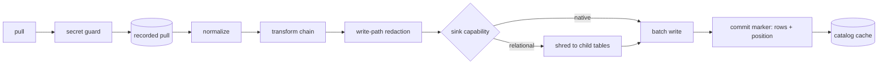
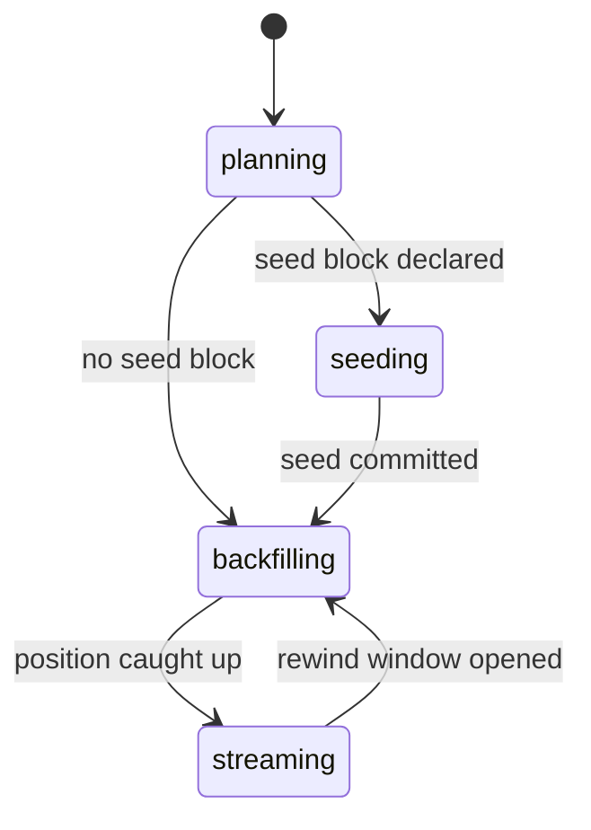

# Pipelines and the write path

A pipeline declares desired state over one source and the tables it lands. This file holds
that declaration, the plan it compiles to, the stages a batch passes between a source and a
committed run, and what a published table carries. `land` is the one statement of stage order.

## declare

| Clause | Statement | Why |
| --- | --- | --- |
| `run.declare.pipeline-spec` | A specification carries `id`, `source` and `tables`, plus the optional `destination`, `schedule`, `incremental`, `transforms`, `redaction`, `normalize`, `backfill`, `seed`, `queries` and `on_table_error`. | — |
| `run.declare.serialization` | TOML and JSON deserialize into one `PipelineSpec`; the JSON Schema derived from it is the contract, and `contextful schema export` writes it to `.contextful/schema/pipeline.json`. | — |
| `run.declare.source-block` | A `source` is a connector name beside a free-form JSON config object; a `destination` carries the same two fields and defaults to the store. | — |
| `run.declare.manifest-file` | Startup reads `contextful.toml` for project config and inline `[[pipeline]]` blocks, then `pipelines/*.toml` and `pipelines/*.json`; specifications are collected by `id`. | — |
| `run.declare.duplicate-id` | One `id` declared twice raises `PipelineDuplicateId`, naming each file and the line its declaration starts on. | because a silent pick between two declarations hides which one runs |
| `run.declare.spec-invalid` | A manifest file the canonical type cannot deserialize raises `PipelineSpecInvalid`, naming the file, the key path and the value found. | because a partly read manifest runs a pipeline its author did not write |
| `run.declare.content-hash` | `content_hash` is the sha256 of the specification's RFC 8785 canonical JSON with every optional field at its default elided, so an explicit default hashes as its absence. | because a replay pin that moves on a no-op edit strands pending work |
| `run.declare.table-name` | A destination table is named `<pipeline id>_<table name>`, each non-alphanumeric character folded to `_` and each ASCII uppercase letter lowered. | — |
| `run.declare.unbound-table-name` | A job target or model reference naming a destination table in a spelling the fold does not produce raises `PipelineUnboundTableName`, printing the expected spelling. | P1 |
| `run.declare.table-entry` | A `tables` entry is a bare name or an object carrying that table's configuration; the two forms mix in one array. | — |
| `run.declare.order-by-default` | `order_by` defaults to the injected ingest stamp and is inert on a keyless table; key semantics are {{store.declare.unkeyed-union}}. | — |
| `run.declare.write-mode` | `write_mode` is `append`, the default, or `replace`. Under `append` a run adds rows and no key retires; under `replace` the landing run is the table's whole current state. | — |
| `run.declare.replace-unsupported` | `replace` beside a `monotonic` or `opaque-token` cursor, a backfill chunk plan or a seed ceiling raises `PipelineReplaceUnsupported`, naming the table. | P1 |
| `run.declare.config-key` | A source config key outside the set that source enumerates raises `PipelineUnknownConfigKey` before any I/O, naming the key and the accepted keys; request headers and the forwarded guest table are exempt. | P1 |
| `run.declare.lifecycle-verbs` | `plan` diffs desired state against the store with no side effect, `--json` emitting a structured diff; `apply` converges every pipeline or one; `run` fires one pipeline once; `serve` reconciles continuously. | — |
| `run.declare.apply-fires-nothing` | Applying a manifest fires nothing of itself; a second `apply` over unchanged sources is a no-op modulo elapsed schedules. | — |
| `run.declare.table-error` | `on_table_error` is abort, the default, halting the fire at the first failing table, or continue, recording the failure and returning success with the failed run ids. | — |
| `run.declare.table-error-exit` | Under continue, `run` exits non-zero naming the failed runs, `apply` prints a partial line, and a scheduled fire appends its failure count to its log line. | — |
| `run.declare.chunked-load` | `on_table_error` governs the single-pass live pull alone; a seed or backfill chunk plan halts the fire on failure under either setting. | — |
| `run.declare.incremental-field` | `incremental = "<field>"` names the stream clock on the pipeline. Declared, the source reports a `monotonic` cursor committing {{run.advance.watermark-shape}}; undeclared, it refetches in full. | — |

unsettled: What retires a key a source stops serving under `append`: a run declaring itself complete state, or a per-connector delete signal? owner: pipeline affects: run.declare

unsettled: Does `on_table_error` take a per-table override, and a cap on failed tables before a fire halts anyway? owner: pipeline affects: run.declare

## compile

| Clause | Statement | Why |
| --- | --- | --- |
| `run.compile.authoring-surface` | The authoring surface runs at build time only and emits a content-hashed plan; nothing from it executes where the engine serves, and no build profile embeds a scripting runtime. | D02 |
| `run.compile.plan-node` | A plan is a flat node list with predecessor edges: `step` (connector, optional retry), `sleep` (duration string), `awaitEvent` (optional timeout), `branch` (predicate, label-to-node-id map) and `parallel` (node ids). | — |
| `run.compile.plan-version` | A plan's version is the leading 16 chars of the sha256 over the RFC 8785 canonical JSON of its `{id, nodes}`. | — |
| `run.compile.plan-schema` | The plan type is defined once in a schema library; its JSON Schema is the contract every language binds to, and the run path deserializes plan JSON against it. | — |
| `run.compile.inline-step-body` | A `step` body other than a connector reference raises `PipelineInlineStepBody`. | D02 |
| `run.compile.control-flow` | A data-dependent conditional or loop in a workflow body raises `PipelineUndeclaredControlFlow`; branching travels as `branch` and fan-out as `parallel`. | D02 |
| `run.compile.node-id-collision` | A node id repeated in one plan raises `PipelineNodeIdCollision`, naming the id and both positions. | D02 |
| `run.compile.lowering` | A plan lowers node by node onto {{run.journal.substrate-port}}. | — |

## transform

| Clause | Statement | Why |
| --- | --- | --- |
| `run.transform.chain` | The chain is an ordered list of `select`, `rename`, `cast` and a single-column `filter`, declared once per pipeline and bound to the root table. | — |
| `run.transform.arity` | A chain operation emitting more rows than it consumed raises `PipelineTransformArity`. | D02 |
| `run.transform.filter` | A filter dropping a root row drops that row's nested children with it. | because a child landing under a parent id no surviving row carries is a dangling reference |
| `run.transform.column-missing` | A filter or cast naming a column the batch does not carry raises `PipelineTransformColumnMissing`, printing the column and the table. | because a cast over an absent column otherwise lands the batch untransformed |
| `run.transform.cast` | A cast rewrites one column's type and keeps its name and position. | — |
| `run.transform.projection` | `select` fixes the outgoing column set by name, and `rename` maps an incoming name onto an outgoing one. | — |

unsettled: Does the chain grow past these four operations, or does richer work stay post-landing SQL? owner: pipeline affects: run.transform

## normalize

| Clause | Statement | Why |
| --- | --- | --- |
| `run.normalize.host-stage` | Type inference over deferred-typing JSON, struct flattening, list-to-child extraction and id assignment run in engine code; no connector reimplements them and no dataframe library participates. | — |
| `run.normalize.normalized-form` | The canonical form is nested Arrow structs and lists; relational shredding is a late projection at the sink, so a source landing in two sinks normalizes once. | — |
| `run.normalize.mode` | `native` keeps nesting up to the sink's capability and explodes the rest with a downgrade schema-diff event; `relational` flattens structs into parent-child column names and shreds lists into child tables joined by a foreign key. | — |
| `run.normalize.mode-resolution` | Mode resolves per stream per sink: explicit declaration, then sink capability, then `native`. | — |
| `run.normalize.mode-unknown` | A mode outside the two raises `PipelineNormalizeModeUnknown`, printing both spellings. | D50 |
| `run.normalize.identity-columns` | Normalize injects a content-hash row id on every table, a load id on the root, a parent id and list index on each child, and a root id on a child nested deeper than one level. | — |
| `run.normalize.row-id` | The row id hashes the row's own content, so a re-run of one input emits byte-identical ids. | — |
| `run.normalize.list-index-missing` | A relational child table emitted without the list index that makes its projection reversible raises `PipelineListIndexMissing`, naming the parent and the list. | D50 |
| `run.normalize.nesting-depth` | Recursion stops at the declared depth, default five levels, landing a deeper subtree as one deferred-typing JSON column. | — |

unsettled: Where does a schema-diff event land, given that the store keeps only the reconciled schema? owner: pipeline affects: run.normalize

## guard-secrets

| Clause | Statement | Why |
| --- | --- | --- |
| `run.guard-secrets.placement` | The secret guard runs at the one pull path streaming and backfill share, ahead of the recorded pull and the land path, so a replay reintroduces no credential. | — |
| `run.guard-secrets.matchers` | Matchers are linear-time and regex-free, covering AWS access-key ids, PEM private keys, GitHub and Slack tokens, and `keyword=<token>` assignments; the pattern catalogue lives in code under a precision and recall fixture test. | — |
| `run.guard-secrets.mask-span` | The replacement covers only the matched byte ranges, widened to character boundaries; overlapping spans merge under the higher-priority pattern. | — |
| `run.guard-secrets.mask-replacement` | The replacement is the fixed `[REDACTED:secret]` marker, never a shape-preserving transform; an assignment keeps its `key=` prefix. | — |
| `run.guard-secrets.mask-only` | The guard is on by default and blocks no run; each pull logs the count of masked cells per column. | — |
| `run.guard-secrets.coverage` | The guard reads pre-normalize string cells for plaintext shapes; encoded material and a credential split across two cells pass through. | — |

unsettled: Is the credential pattern set host-owned, or extensible per deployment, and does a strict mode fail the pull? owner: pipeline affects: run.guard-secrets

## land

| Clause | Statement | Why |
| --- | --- | --- |
| `run.land.stage-order` | A batch passes pull, the secret guard, the recorded pull, normalize, the transform chain, write-path redaction, shredding and batch write; the run then commits rows and position together through {{run.advance.commit-with-rows}}. | — |
| `run.land.unknown-destination` | The local context store is the only destination, and synthesized artifacts write back through it; any other `destination` raises `PipelineUnknownDestination` at assembly, before any row moves. | D01 |
| `run.land.no-host-arm` | The destination world declares no host arm, so a guest supplies no destination. | D01 |
| `run.land.batch-write` | A landing table is created on first sight of its schema, {{store.reconcile.first-sight}}; each batch is written durably in its own call, optionally carrying its ordinal as the join key onto the run's request ledger. | — |
| `run.land.irreconcilable-schema` | An arriving schema the store cannot reconcile fails the batch as {{store.reconcile.incompatible}}. | — |
| `run.land.commit-visibility` | A commit makes a run's rows visible for one table in one step; a crash before it leaves a recoverable partial run. | — |
| `run.land.ingest-tally` | A fire reports `fetched`, `kept`, `skipped`, `failed`, `dropped_low_quality` and a per-source breakdown; a non-zero `failed` exits non-zero. | — |
| `run.land.unreadable-input` | Input a parser cannot read raises `PipelineUnreadableInput`, naming the path and the position inside it, permanent against the retry schedule and failing one table's pull. | D16 |
| `run.land.partial-parse` | A reader stopping partway through a multi-part input raises `PipelinePartialParse` over the whole input and lands none of its parts. | D16 |
| `run.land.parse-boundary` | A decode that can die runs outside the serving process, which bounds its wall clock and memory and makes it killable. | D16 |
| `run.land.parse-crashed` | A non-zero exit or fatal signal from the decode process raises `PipelineParseCrashed` naming the input; no input ends the serving process. | D16 |
| `run.land.table-failed` | A table whose pull fails raises `PipelineTableFailed` carrying the table, the error kind and the run id; the fire then follows `on_table_error`. | because a failure is answerable by name only when it carries its table and run |



unsettled: Which process carries the parse boundary, a child per input or one long-lived extractor, and what wall-clock and memory budget does one input receive? owner: pipeline affects: run.land

unsettled: Does the engine read a source's declared schema at planning time, or only the observed batch at write time? owner: pipeline affects: run.land

## backfill

| Clause | Statement | Why |
| --- | --- | --- |
| `run.backfill.phase` | The catalog records one phase per pipeline: `planning` computes the chunk plan with nothing fetched, `seeding` loads consumer-held history, `backfilling` runs chunks across ticks, `streaming` pulls the incremental delta. | — |
| `run.backfill.chunk-plan` | Plan shape follows cursor kind: `monotonic` plans independent time-window or id-range chunks, `opaque-token` one sequential chunk walked in order, `snapshot-id` version ranges sequential per stream and parallel across streams. | — |
| `run.backfill.chunk-parallelism` | A sequential chunk plan declared beside a parallelism above one raises `PipelineChunkParallelism`, naming the plan and the value. | because two workers walking one continuation token skip or duplicate pages silently |
| `run.backfill.chunk` | A chunk row carries pipeline id, chunk id, predicate, status, attempt count, start and completion instants and a cursor-committed flag; an interrupted plan resumes at the first chunk not done. | — |
| `run.backfill.chunk-lease` | A worker leases a chunk row, recording node id and attempt, for a 300 s time-to-live renewed every 60 s, and writes under a path segmented by run, node, chunk and attempt. | because an unquantified lease cannot be tested against a paused worker |
| `run.backfill.fenced-commit` | A chunk commits in one catalog update conditioned on `attempt = :mine AND status != 'done'`; an update matching no row leaves that worker's files uncommitted. | because an expired holder otherwise commits over its successor |
| `run.backfill.commit-signal` | The catalog row, not directory presence, is the commit signal; files under a path with no done row are collected by a retention window. | — |
| `run.backfill.attempt-isolation` | An expired lease lets a second worker claim the chunk, increment the attempt and write under its own path. | — |
| `run.backfill.tick` | While a pipeline backfills, a tick dispatches up to the per-tick chunk cap or no-ops when the queue is full; the declared cadence resumes once the position catches up. | — |
| `run.backfill.block` | `[pipeline.backfill]` declares `max_chunks`, the bound on a plan's chunk count; `chunk_size`, one clock-ranged chunk's width in cursor units; and `start_from`, the floor, default zero. | — |
| `run.backfill.rewind` | A rewind returns every chunk overlapping the half-open range to pending and appends one reason row per rewound chunk to an audit log a catalog rebuild leaves untouched. | — |
| `run.backfill.rewind-invalid` | An inverted, empty or scale-incomparable rewind window raises `PipelineRewindWindowInvalid`; a window overlapping no chunk is a no-op. | P4 |



unsettled: What is the per-tick chunk cap, and how long does the retention window keep files under a path with no done row? owner: pipeline affects: run.backfill

## seed

| Clause | Statement | Why |
| --- | --- | --- |
| `run.seed.block` | `[pipeline.seed]` attaches a bulk-load source with a ceiling `below` expressed on the seeded table's `order_by` scale. | — |
| `run.seed.one-land-path` | Seeded rows travel {{run.land.stage-order}} unchanged; attribution survives only in the load id and a run recorded under the `seeding` phase. | — |
| `run.seed.declaration-missing` | A seeded table without `primary_key`, or with `order_by` left at the ingest stamp, raises `PipelineSeedDeclarationMissing` at plan and validate. | D09 |
| `run.seed.ceiling-breached` | A seeded row whose ordering stamp reaches `below` raises `PipelineSeedCeilingBreached` naming the value; its chunk lands nothing, and the stamp is neither clamped nor dropped. | D09 |
| `run.seed.ceiling-point` | The ceiling is evaluated on the root batch after normalize and the chain, before the write. | — |
| `run.seed.ceiling-unevaluable` | A batch missing the ordering column, or a stamp unorderable against the ceiling, raises `PipelineSeedCeilingUnevaluable`. | D09 |
| `run.seed.scope` | Seed chunk and cursor state live under a `<table>#seed` scope apart from the live pipeline's. | — |
| `run.seed.connector-pin` | A seeding run is exempt from {{run.own.pinned-plan-changed}} and records its connector identity as provenance. | — |
| `run.seed.ceiling-binding` | On seed commit, an unset `monotonic` live position takes the ceiling when `below` parses as an integer; under the other cursor kinds the live position stays unset and starts from the source's beginning. | — |
| `run.seed.fingerprint` | Each run probes the seed source for a cheap fingerprint, a stat or a HEAD and never a download, and compares it with the one stamped at commit. | — |
| `run.seed.source-changed` | A differing fingerprint raises `PipelineSeedSourceChanged` naming both values; an equal one skips the load, and an unavailable one skips with a warning. | D09 |
| `run.seed.commands` | `seed status` prints each seeded table's ceiling, commit state and fingerprint match; `seed reset <pipeline> [--table T]` clears the seed's chunk plan. | — |
| `run.seed.parity` | Over keys the vendor still returns, seeding then running live across an overlapping window yields a pure live backfill's row count and per-key winners; a key the vendor stopped returning keeps its seeded value. | — |
| `run.seed.parity-audit` | `validate` audits the seed ordering over every landed row, not over the deduped view. | — |
| `run.seed.compaction-cadence` | A seeded pipeline declares a scheduled fold covering each seeded table. | because without a snapshot the seeded and live rows for one key both survive the union read |

## publish

| Clause | Statement | Why |
| --- | --- | --- |
| `run.publish.manifest-commit` | A published table's contract identity, freshness and current build ride the snapshot manifest commit that publishes its data; no separate file is authoritative for any of them. | because separately written artifacts make a torn publication representable |
| `run.publish.contract-identity` | A published table's identity is `contract_version` beside `schema_fingerprint`, taken over the declared columns, their types and the grain. | — |
| `run.publish.contract-mismatch` | A materialization whose columns, types or grain miss the declared contract raises `PipelineContractMismatch`, naming the column and the expectation. | P4 |
| `run.publish.staging` | A build materializes into staging and publishes through {{run.publish.manifest-commit}}; a refused build leaves the last published state serving. | P4 |
| `run.publish.history-logs` | `contract-history.jsonl`, `builds.jsonl` and `holds.jsonl` are append-only history derived from committed manifests; a log disagreeing with a manifest is regenerated from it. | — |
| `run.publish.build-entry` | A build entry carries build id, start and completion instants, a status of published, refused or partial, the contract identity, and the partition values it left unfilled. | — |
| `run.publish.freshness` | Freshness carries the newest publishing build id, its watermark, `max_lag`, the last build status and a withheld-cells flag; staleness is derived from watermark against `max_lag` and never stored. | — |
| `run.publish.hold` | A hold records build id, placing principal and expiry; collection skips a held build, and a hold confers no other authority. | — |
| `run.publish.manifest-section` | The manifest section carries `{contract_version, schema_fingerprint, build_id, last_built_at, watermark, max_lag, last_build_status, partitions_failed?, semantics_version?, fingerprint_recipe?}` of the newest publishing build, an absent optional key omitted. | — |
| `run.publish.semantics-version` | `semantics_version` advances when the engine adds an injected column, and `fingerprint_recipe` names the fingerprint's inputs, that column included. | — |
| `run.publish.disclosure-digest` | A build records a digest over its declared disclosure policy, set-valued fields sorted, in the manifest and in the build log. | — |

## Shapes

A pipeline declaration:

```toml
[[pipeline]]
id = "meta-ads"
incremental = "updated_time"
on_table_error = "abort"

[pipeline.source]
name = "http"
config = { endpoint = "https://api.example.test/v19.0", format = "json" }

[[pipeline.tables]]
name = "insights"
primary_key = ["ad_id", "date_start"]
order_by = "date_start"
write_mode = "append"

[[pipeline.transforms]]
op = "cast"
column = "spend"
to = "float64"

[pipeline.backfill]
max_chunks = 512
chunk_size = "7d"

[pipeline.seed]
below = "2025-06-01T00:00:00Z"
source = { name = "file", config = { root = "exports/meta-ads", format = "jsonl" } }
```
