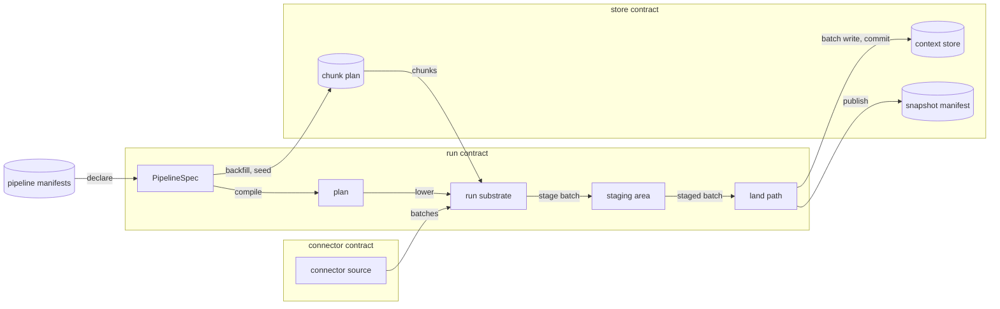
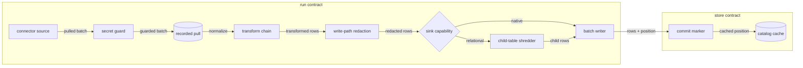
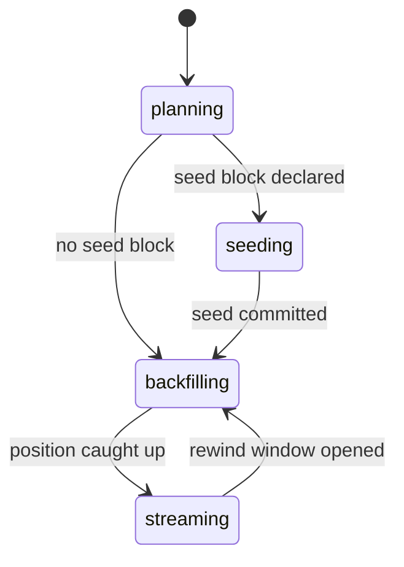
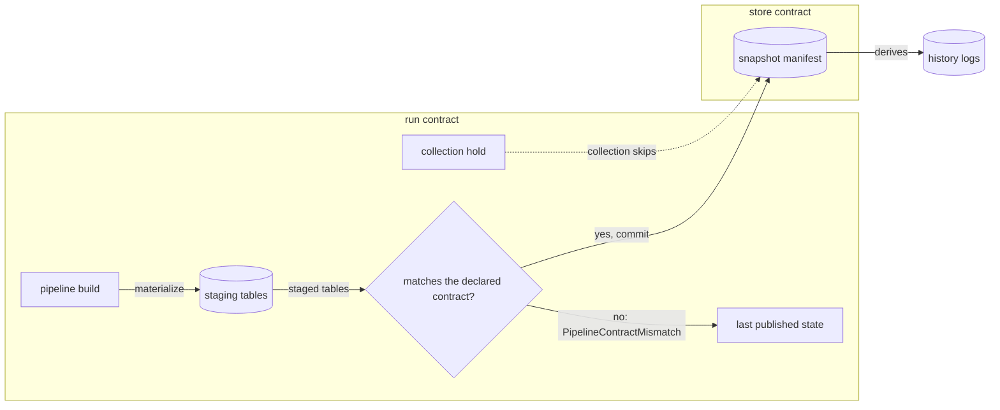

# Pipelines and the write path

A pipeline declares desired state over one source and the tables it lands. This file holds
that declaration, the plan it compiles to, the stages a batch passes between a source and a
committed run, and what a published table carries. `land` is the one statement of stage order.

From declaration to a published table, and the contracts each step meets:



## declare

The pipeline specification, its serializations, manifest discovery, the content hash, table entries and lifecycle verbs.

- `pipeline-spec` — A specification carries `id`, `source` and `tables`, plus the optional `destination`, `schedule`, `incremental`, `transforms`, `redaction`, `normalize`, `backfill`, `seed`, `queries` and `on_table_error`.
- `serialization` — TOML and JSON deserialize into one `PipelineSpec`; the JSON Schema derived from it is the contract, and `contextful schema export` writes it to `.contextful/schema/pipeline.json`.
- `source-block` — A `source` is a connector name beside a free-form JSON config object; a `destination` carries the same two fields and defaults to the store.
- `manifest-file` — Startup reads `contextful.toml` for project config and inline `[[pipeline]]` blocks, then `pipelines/*.toml` and `pipelines/*.json`; specifications are collected by `id`.
- `manifest-missing` — `pipeline validate` reading no manifest file raises `PipelineManifestMissing`, naming the declaration path.
  *because a validation over a mistyped path otherwise checks nothing and exits zero*
- `duplicate-id` — One `id` declared twice raises `PipelineDuplicateId`, naming each file and the line its declaration starts on.
  *because a silent pick between two declarations hides which one runs*
- `spec-invalid` — A manifest file the canonical type cannot deserialize raises `PipelineSpecInvalid`, naming the file, the key path and the value found.
  *because a partly read manifest runs a pipeline its author did not write*
- `content-hash` — `content_hash` is the sha256 of the specification's RFC 8785 canonical JSON with every optional field at its default elided, so an explicit default hashes as its absence.
  *because a replay pin that moves on a no-op edit strands pending work*
- `table-name` — A destination table is named `<pipeline id>_<table name>`, each non-alphanumeric character folded to `_` and each ASCII uppercase letter lowered.
- `table-name-collision` — Two tables whose destination names fold to one spelling, within one pipeline or across pipelines, raise `PipelineTableNameCollision` at validation, naming both declarations.
  *because two tables folding to one name land in one store table and interleave their rows*
- `unbound-table-name` — A job target or model reference naming a destination table in a spelling the fold does not produce raises `PipelineUnboundTableName`, printing the expected spelling.
  *P1*
- `table-entry` — A `tables` entry is a bare name or an object carrying that table's configuration; the two forms mix in one array.
- `order-by-default` — `order_by` defaults to the injected ingest stamp and is inert on a keyless table; key semantics are {{store.declare.unkeyed-union}}.
- `write-mode` — `write_mode` is `append`, the default, or `replace`. Under `append` a run adds rows and no key retires; under `replace` the landing run is the table's whole current state.
- `replace-unsupported` — `replace` beside a `monotonic` or `opaque-token` cursor, a backfill chunk plan or a seed ceiling raises `PipelineReplaceUnsupported`, naming the table.
  *P1*
- `config-key` — A source config key outside the set that source enumerates raises `PipelineUnknownConfigKey` before any I/O, naming the key and the accepted keys; request headers and the forwarded guest table are exempt.
  *P1*
- `lifecycle-verbs` — `plan` diffs desired state against the store with no side effect, `--json` emitting a structured diff; `apply` converges every pipeline or one; `run` fires one pipeline once; `serve` reconciles continuously.
- `apply-fires-nothing` — Applying a manifest fires nothing of itself; a second `apply` over unchanged sources is a no-op modulo elapsed schedules.
- `table-error` — `on_table_error` is abort, the default, halting the fire at the first failing table, or continue, landing every other table and reporting the failed run ids through {{run.declare.table-error-exit}}.
- `table-error-exit` — Under continue, `run` exits non-zero naming the failed runs, `apply` prints a partial line, and a scheduled fire appends its failure count to its log line.
- `chunked-load` — `on_table_error` governs the single-pass live pull alone; a seed or backfill chunk plan halts the fire on failure under either setting.
- `incremental-field` — `incremental = "<field>"` names the stream clock on the pipeline. Declared, the source reports a `monotonic` cursor committing {{run.advance.watermark-shape}}; undeclared, it refetches in full.
- `incremental-pointer` — An `incremental` value opening with `/` is an RFC 6901 pointer read from each fetched row, so a nested clock such as `/commit/committer/date` orders the stream and names its watermark.

unsettled: What retires a key a source stops serving under `append`: a run declaring itself complete state, or a per-connector delete signal? owner: pipeline affects: run.declare

unsettled: Does `on_table_error` take a per-table override, and a cap on failed tables before a fire halts anyway? owner: pipeline affects: run.declare

## compile

The plan a specification becomes at build time: node kinds, version and schema.

- `authoring-surface` — The authoring surface runs at build time only and emits a content-hashed plan; nothing from it executes where the engine serves, and no build profile embeds a scripting runtime.
  *A-run*
- `plan-node` — A plan is a flat node list with predecessor edges: `step` (connector, optional retry), `sleep` (duration string), `awaitEvent` (optional timeout), `branch` (predicate, label-to-node-id map) and `parallel` (node ids).
- `plan-version` — A plan's version is the leading 16 chars of the sha256 over the RFC 8785 canonical JSON of its `{id, nodes}`.
- `plan-schema` — The plan type is defined once in a schema library; its JSON Schema is the contract every language binds to, and the run path deserializes plan JSON against it.
- `inline-step-body` — A `step` body other than a connector reference raises `PipelineInlineStepBody`.
  *A-run*
- `control-flow` — A data-dependent conditional or loop in a workflow body raises `PipelineUndeclaredControlFlow`; branching travels as `branch` and fan-out as `parallel`.
  *A-run*
- `node-id-collision` — A node id repeated in one plan raises `PipelineNodeIdCollision`, naming the id and both positions.
  *A-run*
- `lowering` — A plan lowers node by node onto {{run.journal.substrate-port}}.

## transform

The declarative chain that rewrites a batch in place.

- `chain` — The chain is an ordered list of `select`, `rename`, `cast`, `extract` and a single-column `filter`, declared once per pipeline and bound to the root table.
- `arity` — A chain operation emitting more rows than it consumed raises `PipelineTransformArity`.
  *A-run*
- `filter` — A filter dropping a root row drops that row's nested children with it.
  *because a child landing under a parent id no surviving row carries is a dangling reference*
- `column-missing` — A value filter or cast naming a column the batch does not carry raises `PipelineTransformColumnMissing`, printing the column and the table.
  *because a cast over an absent column otherwise lands the batch untransformed*
- `cast` — A cast rewrites one column's type and keeps its name and position.
- `projection` — `select` fixes the outgoing column set by name, and `rename` maps an incoming name onto an outgoing one.
- `typed-cast` — A cast to `binary`, `binary(n)`, `float32[n]` or `float16[n]` keeps a value that type's JSON form reads, nulls any other, and lands the column in that type.
- `type-carry` — A `rename` carries a pulled column type to the new name, a `select` drops it with its column, and a cast to a scalar type drops it.
- `extract` — `extract` copies the value at an RFC 6901 pointer into a named column, null where the pointer names nothing, keeps the source column, and lands the new column with no pulled type.
- `presence-filter` — A `filter` naming `absent` keeps the rows whose column is missing or null, and one naming `present` keeps the rest; neither requires the batch to carry the column.

unsettled: Does the chain grow past these five operations, or does richer work stay post-landing SQL? owner: pipeline affects: run.transform

## normalize

Canonical nested form, late relational shredding, injected identity columns and recursion depth.

- `host-stage` — Type inference over deferred-typing JSON, struct flattening, list-to-child extraction and id assignment run in engine code; no connector reimplements them and no dataframe library participates.
- `normalized-form` — The canonical form is nested Arrow structs and lists; relational shredding is a late projection at the sink, so a source landing in two sinks normalizes once.
- `mode` — `native` keeps nesting up to the sink's capability and explodes the rest with a downgrade schema-diff event; `relational` flattens structs into parent-child column names and shreds lists into child tables joined by a foreign key.
- `mode-resolution` — Mode resolves per stream per sink: explicit declaration, then sink capability, then `native`.
- `mode-unknown` — A mode outside the two raises `PipelineNormalizeModeUnknown`, printing both spellings.
  *A-run*
- `identity-columns` — Normalize injects a content-hash row id on every table, a load id on the root, a parent id and list index on each child, and a root id on a child nested deeper than one level.
- `row-id` — The row id hashes the row's own content, so a re-run of one input emits byte-identical ids.
- `list-index-missing` — A relational child table emitted without the list index that makes its projection reversible raises `PipelineListIndexMissing`, naming the parent and the list.
  *A-run*
- `native-store` — On the store sink, `native` lands each undeclared column of objects and arrays as a struct or list column inferred over the batch; a column mixing kinds, or one `schema.json` holds as a scalar, lands as `Json`.
  *A-store*
- `nesting-depth` — Recursion stops at the declared `depth`, default 5 levels, landing a deeper subtree as one `Json` value.

unsettled: Where does a schema-diff event land, given that the store keeps only the reconciled schema? owner: pipeline affects: run.normalize

## guard-secrets

The write-time mask over credential-shaped spans in a pulled batch.

- `placement` — The secret guard runs at the one pull path streaming and backfill share, ahead of the recorded pull and the land path, so a replay reintroduces no credential.
- `matchers` — Matchers are linear-time, regex-free forward scans, each anchored on a literal prefix; the credential catalogue lives in code under a precision and recall fixture test.
- `assignment-key` — An assignment key qualifies when it is a keyword or ends in one after `_`, `-` or `.`, reading `-` as `_`, so `client_secret`, `x-api-key` and `db.password` qualify and `clientsecret` does not.
- `mask-span` — The replacement covers only the matched byte ranges, widened to character boundaries; overlapping spans merge under the higher-priority pattern.
- `mask-replacement` — The replacement is the fixed `[REDACTED:secret]` marker, never a shape-preserving transform; an assignment keeps its `key=` prefix.
- `mask-only` — The guard is on by default and blocks no run; each pull logs the count of masked cells per column.
- `coverage` — The guard reads pre-normalize string cells for plaintext shapes; encoded material and a credential split across two cells pass through.

unsettled: Is the credential pattern set host-owned, or extensible per deployment, and does a strict mode fail the pull? owner: pipeline affects: run.guard-secrets

#### Scenarios

- `run.guard-secrets.assignment-key`: WHEN a cell holds `x-api-key: zK9s8d7f6g5h`, THEN it lands as `x-api-key: [REDACTED:secret]`.
- `run.guard-secrets.assignment-key`: WHEN a cell holds `token_type=abcdefgh12`, THEN it lands unchanged.

## land

The stage order from pull to commit, the one destination, the ingest tally and containment of unreadable input.

- `stage-order` — A batch passes pull, the secret guard, the recorded pull, normalize, the transform chain, write-path redaction, shredding and batch write; the run then commits rows and position together through {{run.advance.commit-with-rows}}.
- `unknown-destination` — The local context store is the only destination, and synthesized artifacts write back through it; any other `destination` raises `PipelineUnknownDestination` at assembly, before any row moves.
  *A-topology*
- `no-host-arm` — The destination world declares no host arm, so a guest supplies no destination.
  *A-topology*
- `batch-write` — A landing table is created on first sight of its schema, {{store.reconcile.first-sight}}; each batch is written durably in its own call, optionally carrying its ordinal as the join key onto the run's request ledger.
- `typed-pull` — A pull's `types` object maps a column to a type spelled as {{store.reconcile.typed-landing}} reads it, and the run commit lands that column in it; an unreadable spelling fails the pull as {{store.reconcile.incompatible}}.
- `late-type` — A pull declaring a type for a column an earlier staged batch of its run carried undeclared raises `PipelineTypeDeclaredLate`, deterministic, naming the column; the run commits nothing and retires its owner.
  *because that batch's part already holds the column in its inferred type, and a staged part is immutable*
- `irreconcilable-schema` — An arriving schema the store cannot reconcile fails the batch as {{store.reconcile.incompatible}}.
- `commit-visibility` — A commit makes a run's rows visible for one table in one step; a crash before it leaves a recoverable partial run.
- `ingest-tally` — A fire reports `fetched`, `kept`, `skipped`, `failed`, `dropped_low_quality` and a per-source breakdown; a non-zero `failed` exits non-zero.
- `unreadable-input` — Input a parser cannot read raises `PipelineUnreadableInput`, naming the path and the position inside it, permanent against the retry schedule and failing one table's pull.
  *A-connector*
- `partial-parse` — A reader stopping partway through a multi-part input raises `PipelinePartialParse` over the whole input and lands none of its parts.
  *A-connector*
- `parse-boundary` — A decode that can die runs outside the serving process, which bounds its wall clock and memory and makes it killable.
  *A-connector*
- `parse-crashed` — A non-zero exit or fatal signal from the decode process raises `PipelineParseCrashed` naming the input; no input ends the serving process.
  *A-connector*
- `table-failed` — A table whose pull fails raises `PipelineTableFailed` carrying the table, the error kind and the run id; the fire then follows `on_table_error`.
  *because a failure is answerable by name only when it carries its table and run*



unsettled: Which process carries the parse boundary, a child per input or one long-lived extractor, and what wall-clock and memory budget does one input receive? owner: pipeline affects: run.land

unsettled: Does the engine read a source's declared schema at planning time, or only the observed batch at write time? owner: pipeline affects: run.land

## export

The outbound copy of a landed table to an operator-declared target: the export block, the post-commit read, the delivery batch, the cursor and at-least-once delivery.

- `export-block` — An OTLP `[[export]]` block declares `name`, one landed `table`, an HTTP `endpoint`, `signal = "logs"` and optional `headers`; `contextful export run <name>` delivers every row its cursor has not passed.
  *A-topology*
- `signal-unknown` — A `signal` other than `logs` raises `ExportSignalUnknown` before any row is read.
  *because the one built-in arm maps a row onto a log record, and a span or metric needs a column mapping no block declares*
- `post-commit-read` — Export reads committed runs only, through the read face under the admitted credential, so its grants, row policy and masks hold; no landing waits on an export.
  *A-topology*
- `commit-order` — Export reads the rows past its cursor in `_commit_seq`, then `_row_seq`, order and never by `_ingested_at`, so {{store.reserve.commit-seq}} keeps a run committing late from being skipped.
  *A-topology*
- `commit-seq-missing` — A table holding rows whose `_commit_seq` is null, from parts landed without the column, raises `ExportCommitSeqMissing` naming the export and the row count, before any batch leaves.
  *because a null never passes a cursor, and a row an export skips in silence is a row its mirror loses*
- `batch-rows` — One delivery batch holds at most 500 rows.
  *because a batch that size sits below the face row ceiling and the request limits common collectors apply*
- `log-record` — Each row becomes one OTLP log record: `timeUnixNano` from `_ingested_at`, each non-null column outside the `_` namespace an attribute, beside `contextful.table`, `contextful.run_id`, `contextful.commit_seq` and `contextful.row_seq`.
  *because the attributes a target deduplicates on travel with the record, and the engine's own columns stay its own*
- `delivery` — A batch leaves as one OTLP/HTTP JSON `POST` through the mediated client, its allowlist the endpoint's host alone, each header hydrated as {{connector.resolve.hydration-is-just-in-time}} states.
  *A-topology*
- `secret-preflight` — A header reference no adapter answers refuses at preflight as {{connector.resolve.unresolved-name}}, before any row is read.
  *because a target the export cannot authenticate to is known before a batch is built*
- `cursor-after-ack` — The cursor, the last delivered `_commit_seq` and `_row_seq`, commits to `.contextful/exports/<project>/<name>.json`, outside the synced store root, only after the target answers 2xx for the batch.
  *because a cursor is one node's delivery state, and a synced copy moves another node's export past rows it never sent*
- `at-least-once` — A run ending between a target's acknowledgement and the cursor commit resends that batch on the next run; a target deduplicates on `contextful.commit_seq` and `contextful.row_seq`.
  *A-topology*
- `delivery-refused` — A target answering other than 2xx, or unreachable, raises `ExportDeliveryRefused` naming the export and the answer, and the cursor stays where it stood.
  *because an unacknowledged batch is resent from the cursor, never skipped*
- `typed-block` — A typed `[[export]]` block declares `format = "changes-v1"`, nonempty `key` columns and `schedule`, beside `name`, `table`, `endpoint` and optional `headers`.
  *because a consumer needs stable row identity and a delivery cadence*
- `typed-state` — A typed export compares the latest stable committed table read through {{run.export.post-commit-read}} with its last acknowledged state; commits between reads coalesce into one publication.
  *because a scheduled state export promises the observed frontier rather than every intermediate write*
- `typed-view-recheck` — A typed export re-reads its admitted table even when the source commit frontier is unchanged, and stages a publication when its key, schema, policy or visible state changes.
  *because a commit hash alone cannot identify the view delivered to a consumer*
- `typed-publication-id` — A typed publication identifier covers the source frontier, read identity and visible keyed state, so distinct delivered views carry distinct identifiers without requiring another source commit.
  *because a receiver must not mistake a changed view for a retry of the prior publication*
- `typed-events` — Each changed key yields a versioned upsert with its visible row or a deletion with its key; unchanged keys yield no event.
  *because a generic consumer applies the same keyed operations regardless of table shape*
- `typed-order` — Typed events order by encoded key and carry consecutive sequences and stable ids; a repeat delivery carries the same bytes and ids.
  *because acknowledgement can fail after the target applies a batch*
- `typed-complete` — A publication-complete event follows every change, including an empty set, and states that publication's change count.
  *because a consumer needs a boundary after which its keyed state represents one observed frontier*
- `typed-outbox` — Events and their next keyed state stage together in machine-local `machine.sqlite`; a pending publication blocks staging a later frontier.
  *because a failed send must retain its exact payload and order across restarts*
- `typed-identity-changed` — Pending events under a changed read identity, or an export redirected to another target under the same name, raise `ExportIdentityChanged` without delivery; watch exits.
  *because an old outbox cannot prove authorization under a changed view or establish a new target's baseline*
- `typed-ack` — A typed export advances its machine-local acknowledgement sequence only after HTTP 2xx; acknowledging the completion event promotes its staged state in the same transaction.
  *because a receiver acknowledgement and local state promotion have one durable order*
- `typed-watch` — `contextful export watch <name>` fires the typed export on its schedule and retries a refused send with capped exponential delay from the pending outbox.
  *because delivery resumes without another operator invocation*
- `typed-byte-limit` — One typed JSON request holds at most 65536 B.
  *because a row-count bound alone admits an unbounded request body*
- `typed-event-too-large` — A typed event unable to fit one request raises `ExportEventTooLarge`; watch stops rather than retrying that event.
  *because an unchanged oversized event cannot make progress on retry*

unsettled: Does the arm map a table onto the OTLP span or metric signal, and through which column declaration? owner: pipeline affects: run.export

## backfill

Phases, chunk plans, fenced chunk leases and the rewind window.

- `phase` — The catalog records one phase per pipeline: `planning` computes the chunk plan with nothing fetched, `seeding` loads consumer-held history, `backfilling` runs chunks across ticks, `streaming` pulls the incremental delta.
- `chunk-plan` — Plan shape follows cursor kind: `monotonic` plans independent time-window or id-range chunks, `opaque-token` one sequential chunk walked in order, `snapshot-id` version ranges sequential per stream and parallel across streams.
- `chunk-parallelism` — A sequential chunk plan declared beside a parallelism above one raises `PipelineChunkParallelism`, naming the plan and the value.
  *because two workers walking one continuation token skip or duplicate pages silently*
- `chunk` — A chunk row carries pipeline id, chunk id, predicate, status, attempt count, start and completion instants and a cursor-committed flag; an interrupted plan resumes at the first chunk not done.
- `chunk-lease` — A worker leases a chunk row, recording node id and attempt, for a 300 s time-to-live renewed every 60 s, and writes under a path segmented by run, node, chunk and attempt.
  *because an unquantified lease cannot be tested against a paused worker*
- `fenced-commit` — A chunk commits in one catalog update conditioned on `attempt = :mine AND status != 'done'`; an update matching no row leaves that worker's files uncommitted.
  *because an expired holder otherwise commits over its successor*
- `commit-signal` — The catalog row, not directory presence, is the commit signal; files under a path with no done row are collected by a retention window.
- `attempt-isolation` — An expired lease lets a second worker claim the chunk, increment the attempt and write under its own path.
- `tick` — While a pipeline backfills, a tick dispatches up to the per-tick chunk cap or no-ops when the queue is full; the declared cadence resumes once the position catches up.
- `block` — `[pipeline.backfill]` declares `max_chunks`, the bound on a plan's chunk count; `chunk_size`, one clock-ranged chunk's width in cursor units; and `start_from`, the floor, default zero.
- `rewind` — A rewind returns every chunk overlapping the half-open range to pending and appends one reason row per rewound chunk to an audit log a catalog rebuild leaves untouched.
- `rewind-invalid` — An inverted, empty or scale-incomparable rewind window raises `PipelineRewindWindowInvalid`; a window overlapping no chunk is a no-op.
  *P4*



unsettled: What is the per-tick chunk cap, and how long does the retention window keep files under a path with no done row? owner: pipeline affects: run.backfill

## seed

The bulk-load source mode, its ceiling, its scope and the parity it guarantees.

- `block` — `[pipeline.seed]` attaches a bulk-load source with a ceiling `below` expressed on the seeded table's `order_by` scale.
- `one-land-path` — Seeded rows travel {{run.land.stage-order}} unchanged; attribution survives only in the load id and a run recorded under the `seeding` phase.
- `declaration-missing` — A seeded table without `primary_key`, or with `order_by` left at the ingest stamp, raises `PipelineSeedDeclarationMissing` at plan and validate.
  *A-run*
- `ceiling-breached` — A seeded row whose ordering stamp reaches `below` raises `PipelineSeedCeilingBreached` naming the value; its chunk lands nothing, and the stamp is neither clamped nor dropped.
  *A-run*
- `ceiling-point` — The ceiling is evaluated on the root batch after normalize and the chain, before the write.
- `ceiling-unevaluable` — A batch missing the ordering column, or a stamp unorderable against the ceiling, raises `PipelineSeedCeilingUnevaluable`; a text stamp orders only when `Z`-suffixed at the ceiling's fractional width.
  *A-run*
- `scope` — Seed chunk and cursor state live under a `<table>#seed` scope apart from the live pipeline's.
- `connector-pin` — A seeding run is exempt from {{run.own.pinned-plan-changed}} and records its connector identity as provenance.
- `ceiling-binding` — On seed commit, an unset `monotonic` live position takes the ceiling when `below` parses as an integer; under the other cursor kinds the live position stays unset and starts from the source's beginning.
- `fingerprint` — Each run probes the seed source for a cheap fingerprint, a stat or a HEAD and never a download, and compares it with the one stamped at commit.
- `source-changed` — A differing fingerprint raises `PipelineSeedSourceChanged` naming both values; an equal one skips the load, and an unavailable one skips with a warning.
  *A-run*
- `commands` — `seed status` prints each seeded table's ceiling, commit state and fingerprint match; `seed reset <pipeline> [--table T]` clears the seed's chunk plan.
- `parity` — Over keys the vendor still returns, seeding then running live across an overlapping window yields a pure live backfill's row count and per-key winners; a key the vendor stopped returning keeps its seeded value.
- `parity-audit` — `validate` audits the seed ordering over every landed row, not over the deduped view.
- `compaction-cadence` — A seeded table that no job meeting {{store.declare.fold-job}} covers raises `PipelineSeedCompactionMissing` at validate and before a fire, naming the table.
  *A-store*

## model

The `[[model]]` block: a table defined by SQL over store tables, its contract, freshness and tests, and the `build` verbs that materialize, publish and hold it.

- `model-block` — A `[[model]]` block carries `id` and `sql`, plus the optional `materialized`, `unique_key`, `publish`, `[model.contract]`, `[model.freshness]` and `[[model.test]]`; an unknown key refuses as {{run.declare.spec-invalid}}.
  *A-run*
- `top-level-block` — A manifest's top-level key outside the set the engine enumerates raises `PipelineUnknownBlock`, naming the key, the file and the accepted set.
  *because a misspelled block parses as nothing, and its declaration silently never runs*
- `model-id` — A model's `id` names the store table it builds; an id declared twice, equal to a pipeline destination table, or naming a table a landing wrote refuses as {{run.declare.table-name-collision}}.
- `sql` — `sql` is one read-only `SELECT` over store tables, admitted as {{read.guard.whole-tree-walk}} before any row is read; a model reads another model through the table its last build published.
- `validate-statements` — `pipeline validate` admits each model's `sql` and every test's statement as a build does, counting every relation but the model's own id in `sql` as registered, holds each declared input to {{run.model.restricted-input}}, and raises the error the build raises.
- `validate-undeclared` — `pipeline validate` names on stderr each relation a model's `sql` or test reads that no manifest table, pipeline destination or model declares, and still validates the model; `build` resolves that relation against the store.
  *because a table landed without a manifest declaration is a legal input, while a misspelled name otherwise surfaces only at `build`*
- `restricted-input` — A build reading a table that declares `class`, `policy` or `visibility` raises `ModelInputRestricted`, naming the table and the declared keys.
  *because a build reads its inputs unmasked, so the model's table serves their withheld cells to every reader*
- `materialized` — `materialized` is `table`, the default: each build replaces the model's rows whole.
- `unique-key` — `unique_key` is the model's grain; a build whose rows repeat one grain value, or hold a null in a grain column, refuses as {{run.publish.contract-mismatch}}.
- `contract-block` — `[model.contract]` declares `version`, a `<major>.<minor>.<patch>` string, and `columns`, each a `name`, a `type` spelled as {{store.reconcile.typed-landing}} reads it, and `nullable`, default true.
- `contract-required` — A model whose `publish` is true, the default, and which declares no `[model.contract]` raises `ModelContractUndeclared` at validation.
  *because a published table without a declared contract has no identity a reader can pin against*
- `unpublished` — A model declaring `publish = false` commits its rows with no manifest section, so no build entry, hold or contract history names it.
- `contract-major` — A build whose schema fingerprint differs from the last published build's under an unchanged major version refuses as {{run.publish.contract-mismatch}}, naming the version to bump.
- `injected-columns` — A build lands `_ingested_at` as its start instant, `_run_id` as its build id, `_row_seq` as the row's position, `_commit_seq` as its commit's value and `_site_id`, replacing any injected column the SQL selects; `semantics_version` is 2.
- `freshness-block` — `[model.freshness]` declares `max_lag` as an integer followed by `s`, `m`, `h` or `d`; a model declaring none publishes a null `max_lag` and never computes stale.
- `test-block` — A `[[model.test]]` carries a `name` and one `SELECT` over the staged rows, registered under the model's id, and the store's tables; a test returning any row fails.
- `test-failed` — A failing test raises `ModelTestFailed`, naming the test and its row count; the build publishes nothing.
  *because a test exists to stop a build before readers trust it*
- `build-verb` — `contextful build <model>` materializes the model into staging, checks its contract, runs its tests, then commits; `--json` prints the build id, row count and watermark.
- `unknown-model` — `build` naming no declared model raises `ModelUndeclared`, naming the declared models.
  *because a build of a misspelled id otherwise reports nothing to do*
- `build-id` — A build's id is the snapshot id it publishes.
  *A-run*
- `watermark` — A build's watermark is `{at, inputs}`: per input table the snapshot id and the committed runs it omits, and `at` the newest commit instant among them.
- `hold-verb` — `build hold --for <n>[smhd] <model> <build>` commits a hold until now plus the duration and prints `Held`, or `Renewed` over an unexpired hold; `--json` prints the receipt as an object.
- `hold-unknown-build` — A hold naming a build no committed manifest of the model records raises `ModelBuildUnknown`.
  *because a hold on a build that does not exist protects nothing and reads as protection*
- `hold-manifest` — A hold commits as the hold manifest `holds/<build id>.json` in the model's table directory, replacing any earlier hold on that build.
  *A-run*
- `log-regeneration` — The history logs sit in the model's table directory; each build and hold rewrites them, replacing an entry a manifest disagrees with and keeping entries of collected builds.

unsettled: Does a model materialize incrementally, merging each build into its prior one on `unique_key`? owner: pipeline affects: run.model

unsettled: Does `build` run the pipelines feeding a model's inputs first? owner: pipeline affects: run.model

unsettled: Does a model over a restricted table declare its own policy, or inherit the strictest policy among its inputs? owner: pipeline affects: run.model

unsettled: Does `pipeline validate` refuse a model relation that names no declared table or model, before any store is read? owner: pipeline affects: run.model

unsettled: Does a validation verb refuse a cycle among models before any build reaches one? owner: pipeline affects: run.model

#### Scenarios

- `run.model.test-failed`: WHEN a test `SELECT * FROM daily WHERE n < 0` returns 2 rows, THEN the build raises `ModelTestFailed` naming the test and 2, and `daily` reads its prior build.
- `run.model.hold-verb`: WHEN `build hold --for 7d daily <build>` runs twice, THEN the first prints `Held` and the second `Renewed`, each with the new expiry.

## publish

A published table's contract identity, build, freshness and holds, committed with its snapshot manifest.

- `manifest-commit` — A published table's contract identity, freshness and current build ride the snapshot manifest commit that publishes its data; no separate file is authoritative for any of them.
  *because separately written artifacts make a torn publication representable*
- `contract-identity` — A published table's identity is `contract_version` beside `schema_fingerprint`, taken over the declared columns, their types and the grain.
- `contract-mismatch` — A materialization whose columns, types or grain miss the declared contract raises `PipelineContractMismatch`, naming the column and the expectation.
  *P4*
- `staging` — A build materializes into staging and publishes through {{run.publish.manifest-commit}}; a refused build leaves the last published state serving.
  *P4*
- `history-logs` — `contract-history.jsonl`, `builds.jsonl` and `holds.jsonl` are append-only history derived from committed manifests; a log disagreeing with a manifest is regenerated from it.
- `build-entry` — A build entry carries build id, start and completion instants, a status of published, refused or partial, the contract identity, and the partition values it left unfilled.
- `freshness` — Freshness carries the newest publishing build id, its watermark, `max_lag`, the last build status and a withheld-cells flag; staleness is derived from watermark against `max_lag` and never stored.
- `hold` — A hold records build id, placing principal and expiry; collection skips a held build, and a hold confers no other authority.
- `manifest-section` — The manifest section carries `{contract_version, schema_fingerprint, build_id, build_started_at, last_built_at, watermark, max_lag, last_build_status, withheld_cells, disclosure_digest, partitions_failed?, semantics_version?, fingerprint_recipe?}` of the newest publishing build; `watermark` maps each input table to its snapshot and omitted runs.
- `semantics-version` — `semantics_version` advances when the engine adds an injected column, and `fingerprint_recipe` names the fingerprint's inputs, that column included.
- `disclosure-digest` — A build records a digest over the `class`, `policy` and `visibility` its table declares, set-valued fields sorted, in the manifest and the build log, and sets `withheld_cells` when any is declared.

unsettled: Where does a refused or partial build's entry land, given the history logs derive from committed manifests and a refused build commits none? owner: pipeline affects: run.publish



unsettled: How does staleness compare a per-input frontier watermark against `max_lag`: by the oldest omitted run's commit instant, or per input table (issue 94)? owner: pipeline affects: run.publish

## Shapes

A pipeline declaration:

```toml
[[pipeline]]
id = "meta-ads"
incremental = "updated_time"
on_table_error = "abort"

[pipeline.source]
name = "http"
config = { endpoint = "https://api.example.test/v19.0", format = "json" }

[[pipeline.tables]]
name = "insights"
primary_key = ["ad_id", "date_start"]
order_by = "date_start"
write_mode = "append"

[[pipeline.transforms]]
op = "cast"
column = "spend"
to = "float64"

[pipeline.backfill]
max_chunks = 512
chunk_size = "7d"

[pipeline.seed]
below = "2025-06-01T00:00:00Z"
source = { name = "file", config = { root = "exports/meta-ads", format = "jsonl" } }

[[job]]
name = "nightly-fold"
schedule = "0 3 * * *"
kind = "fold"
target = "meta_ads_insights"
```

A model over a landed table, and the verbs that build and hold it:

```toml
[[model]]
id = "daily_filings"
sql = "SELECT CAST(date_trunc('day', updated_at) AS VARCHAR) AS day, count(*) AS n FROM filings_records GROUP BY 1"
unique_key = ["day"]

[model.contract]
version = "1.0.0"
columns = [
  { name = "day", type = "utf8", nullable = false },
  { name = "n", type = "int64", nullable = false },
]

[model.freshness]
max_lag = "1d"

[[model.test]]
name = "counts-positive"
sql = "SELECT * FROM daily_filings WHERE n <= 0"
```

```sh
contextful build daily_filings --json
contextful build hold --for 7d daily_filings <build id> --json
```
