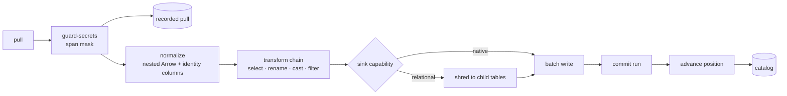
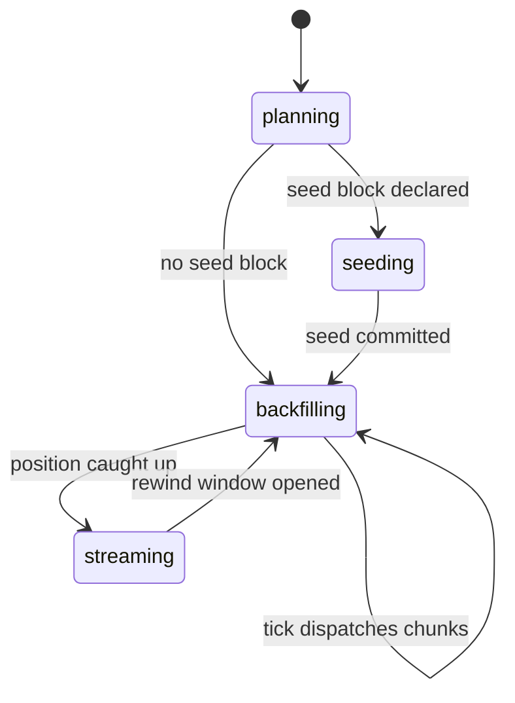
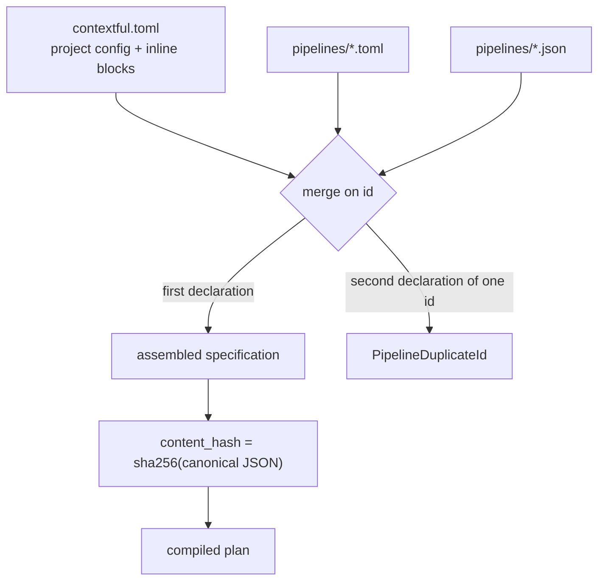
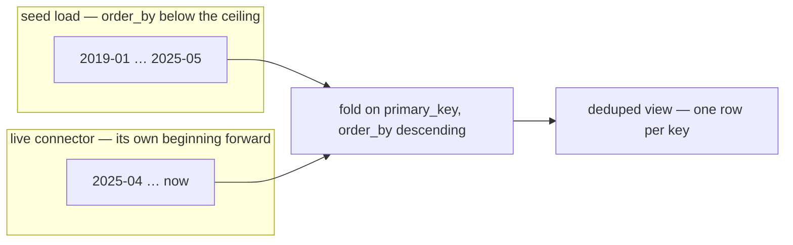
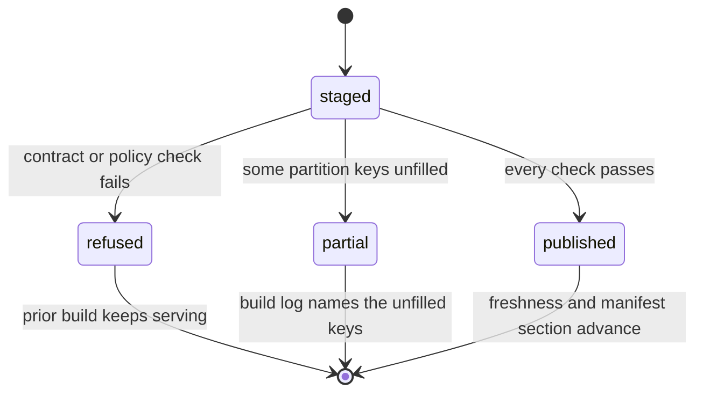

# Pipeline declaration and the write path

A pipeline is a declaration of desired state over one source and the tables it lands.
This file carries that declaration, the plan it compiles to, the stages a batch passes
through between a source and a committed part, and the artifacts a published table
carries beside its data.

## Parties

| Party | Obligation |
| --- | --- |
| **The pipeline author** | Writes one specification per id, in either serialization, declaring the source, the tables, each table's key and ordering, and the write mode a read surface then honors. |
| **The engine** | Compiles a specification to a plan of declared nodes, masks credential-shaped spans at the pull path, normalizes each batch in host code, and moves a stream's position only after its rows are durable. |
| **The operator** | Drives `plan`, `apply`, `run` and `serve`, sets the backfill window and the seed ceiling, and reads the tally and the exit status a fire reports. |
| **The model consumer** | Reads a published table through its contract identity, its build log and its freshness record rather than through the files beneath them. |

## Operations

| Operation | What it governs |
| --- | --- |
| `declare` | The specification, its two serializations, manifest discovery, the content hash, the table block, and the lifecycle verbs. |
| `compile` | The plan a specification becomes at build time: its node kinds, its identity, and what a node body holds. |
| `transform` | The declarative chain that rewrites a batch in place, and the arity it keeps. |
| `normalize` | Canonical nested form, relational shredding at the sink, injected identity columns, and recursion depth. |
| `guard-secrets` | The write-time mask over credential-shaped spans in a pulled batch. |
| `land` | Batch write, commit, position advance, the ingest tally, and containment of input a parser cannot read. |
| `backfill` | Phases, chunk plans, chunk leases and attempts, and the rewind window. |
| `seed` | The bulk-load source mode, its ceiling, its namespaced state, and the parity it guarantees. |
| `publish` | A published table's contract identity, build log, freshness record, holds and semantics version. |

## Clauses — declare

| Clause | Statement | decided-by |
| --- | --- | --- |
| `pipeline.declare.shape.pipeline-spec` | A specification carries `id`, `source` and `tables`, plus the optional `destination`, `schedule`, `incremental`, `transforms`, `redaction`, `normalize`, `backfill`, `seed`, `queries` and `on_table_error`. An unset optional field is absent from the canonical serialization. | |
| `pipeline.declare.interface.serialization` | TOML and JSON deserialize into one `PipelineSpec`, and the JSON Schema derived from that type is its contract. `contextful schema export` writes the schema to `.contextful/schema/pipeline.json`, where a stock schema-aware editor validates and completes a pipeline file with no plugin. | |
| `pipeline.declare.shape.source-block` | A `source` is a connector name beside a free-form JSON config object; a `destination` carries the same two fields and defaults to the store. Config is held as JSON rather than a serialization-specific type, so one manifest parses to the same value whichever form it arrived in. | |
| `pipeline.declare.workflow.manifest-file` | Startup scans `contextful.toml` for project config and inline `[[pipeline]]` blocks, then `pipelines/*.toml` and `pipelines/*.json`. Each file deserializes to one specification, and specifications merge on `id`. | |
| `pipeline.declare.refusal.pipeline-id` | One `id` declared in two manifest files raises `PipelineDuplicateId`, naming each file with the line the declaration starts on. | `0087` |
| `pipeline.declare.refusal.pipeline-spec` | A manifest file the canonical type cannot deserialize raises `PipelineSpecInvalid`, naming the file, the key path and the value found. | |
| `pipeline.declare.invariant.content-hash` | A pipeline's `content_hash` is a sha256 over its canonical JSON serialization. Declaring an optional field for the first time is the single edit that moves it, and the hash is the input a replay pin keys on. | |
| `pipeline.declare.invariant.table-name` | A destination table's name is derived rather than declared: `<pipeline id>_<table name>`, every non-alphanumeric character folded to `_` and every ASCII uppercase letter lowered, so pipeline `meta-ads` and table `insights` bind `meta_ads_insights`. | |
| `pipeline.declare.refusal.table-name` | A job target or model reference naming a destination table in a spelling the fold does not produce raises `PipelineUnboundTableName` and prints the spelling the fold expected. | `0088` |
| `pipeline.declare.shape.table-entry` | A `tables` entry is either a bare name — `tables = ["issues", "comments"]` — or an object carrying that table's own configuration. The two forms mix freely inside one array. | |
| `pipeline.declare.shape.table-block` | A table object declares `primary_key`, `order_by`, `write_mode`, `replicate`, `subject_id`, `pii_type`, `policy`, `visibility`, `valid_time`, `view`, and the reader-facing `agent_description`, `agent_hint` and `example_queries`. Each key is optional and drops out of the canonical serialization when unset. | |
| `pipeline.declare.invariant.primary-key` | A table with no declared `primary_key` reads as the byte-identical union over committed runs and no fold ever collapses it. With a key declared, the fold keeps the latest row per key ordered by `order_by` descending; `order_by` falls back to the injected ingest stamp and is inert where no key is declared. | |
| `pipeline.declare.interface.write-mode` | `write_mode` takes `append` — the default, and the reading when the key is absent — or `replace`. Under `append` a run adds to what the table holds and no key retires when it stops appearing. Under `replace` the landing run is the table's whole current state and every earlier commit stops being read. | |
| `pipeline.declare.refusal.write-mode` | `replace` declared beside a monotonic or page-token cursor, beside a backfill chunk plan, or beside a seed ceiling raises `PipelineReplaceUnsupported`, naming the table each declaration sits on. A version-id cursor is necessary and insufficient: what `replace` admits is a source re-reading its entire input each pull. | `0089` |
| `pipeline.declare.invariant.empty-commit` | A run landing no rows leaves a replacing table reading exactly what it read before. Two paths land nothing without the source having emptied — a pull that legitimately finds nothing still commits, and an unchanged-input skip returns no batch — and neither carries a signal separating them from a source that has genuinely gone empty. | |
| `pipeline.declare.refusal.destination` | A `destination` naming anything other than the local store raises `PipelineUnknownDestination` while the pipeline is assembled, ahead of any row movement. Synthesized artifacts are written back through that same destination and become queryable corpus. | `0090` |
| `pipeline.declare.refusal.config-key` | A source config key outside the set that source enumerates raises `PipelineUnknownConfigKey` ahead of any I/O, naming the key alongside the keys the source reads. The check holds at entry depth, so a block and the entries inside it answer a typo alike. Request headers and the forwarded guest table are operator-keyed and sit outside the check. | `0091` |
| `pipeline.declare.workflow.lifecycle-verb` | `plan` diffs desired state against what the store holds with no side effect and emits a structured diff under `--json`. `apply` converges every pipeline, or one named pipeline. `run` fires one pipeline once. `serve` reconciles continuously. | |
| `pipeline.declare.invariant.lifecycle-verb` | Applying a manifest fires nothing of itself: a second `apply` over unchanged sources is a no-op modulo elapsed schedules, and an interrupted fire resumes from its last checkpoint, so the state it converges on is independent of how many times the process died. | |
| `pipeline.declare.workflow.table-error` | `on_table_error` takes `abort` by default, taken where the key is absent, or `continue`. Under `abort` the fire halts at the first failing table and returns that table's error. Under `continue` the fire records the failure, advances to the next table, and returns success carrying the failed run ids on its report. | |
| `pipeline.declare.invariant.table-error` | A fire whose every table failed under `continue` lands nothing and still returns success, so the process exit status carries the difference: `run` exits non-zero and names the failed runs, `apply` prints a partial line beside the pipeline's success line, and a scheduled fire appends the failure count to its log line. | |
| `pipeline.declare.invariant.chunked-load` | `on_table_error` governs the single-pass live pull alone. A table running under a seed or a backfill chunk plan halts the fire on failure under either setting, since a chunked load fails as a plan: no single run id names it, and the chunk position it stopped at is what a resume reads. | |
| `pipeline.declare.shape.incremental-field` | `incremental = "<field>"` names the stream's clock on the pipeline rather than inside a source's config block, so the field means one thing whichever connector the pipeline points at. Declared, the source reports a lease-free cursor kind and commits `{"field": "<name>", "at": <value>}`; undeclared, the source keeps full-refetch behavior. | |
| `pipeline.declare.invariant.validation-warning` | Validation warns per table where a `primary_key` is declared and no enabled compaction job covers that table. The warning stops nothing, since an out-of-band cadence is a legitimate way to drive the fold. | |

Cursor kinds and the concurrency each one permits live in `spec/30-run.md` § Clauses —
cursor; a pipeline's clock declaration selects which kind its source reports. Compaction
as the pass that materializes last-write-wins lives in `spec/10-store.md` § Clauses —
compact; a keyed table with no snapshot beneath it reads what its run files hold.

unsettled: What retires a key a source stops serving under the append mode — a run declaring itself complete state, or a per-connector delete signal? owner: pipeline affects: pipeline.declare

## Clauses — compile

| Clause | Statement | decided-by |
| --- | --- | --- |
| `pipeline.compile.invariant.authoring-surface` | The authoring surface runs at build time alone. Compilation emits a content-hashed plan beside a target artifact, and nothing from the authoring layer executes where the engine serves. | |
| `pipeline.compile.invariant.scripting-runtime` | No build profile embeds a scripting runtime. The compiled plan holds data, and every dynamic decision sits inside a connector the plan names. | |
| `pipeline.compile.shape.plan-node` | A plan carries five node kinds. `step` holds a connector name and an optional retry declaration; `sleep` holds a duration string such as `24h`; `awaitEvent` holds an optional timeout; `branch` holds a predicate and a label-to-node-id map; `parallel` holds a list of node ids run concurrently. Each node holds a stable id and an optional predecessor list. | |
| `pipeline.compile.shape.plan` | A plan is a flat node list with explicit predecessor edges. `branch` and `parallel` reach their children by id rather than nesting them, leaving validation and lowering as non-recursive walks. | |
| `pipeline.compile.limit.plan-version` | A compiled plan's version is the leading 16 chars of the sha256 over its canonically key-sorted `{id, nodes}`. One plan always compiles to one version, and any edit prints a different one. | |
| `pipeline.compile.interface.plan-schema` | The plan type is defined once in a schema library, and the JSON Schema derived from it is the contract every language binds to. The run path deserializes plan JSON against that schema, and the same JSON is the authoring floor an agent or a non-native author emits directly. | |
| `pipeline.compile.refusal.step` | A `step` body that is anything but a connector reference raises `PipelineInlineStepBody`. A raw network call and a clock read therefore have no position in the graph, and the rule binds a sandboxed connector identically, since the host invokes one from inside a recorded step. | `0092` |
| `pipeline.compile.refusal.predicate` | A data-dependent conditional or loop in a workflow body raises `PipelineUndeclaredControlFlow`. Branching travels as `branch` over a declared predicate, fan-out as `parallel`, and iteration as a map, each of which the compiler reads. | `0093` |
| `pipeline.compile.refusal.plan-node` | A node id repeated inside one plan raises `PipelineNodeIdCollision`, naming the id and both positions. An id is unique across the whole plan, since edges reach nodes by nothing else. | |
| `pipeline.compile.workflow.lowering` | One plan lowers node by node onto a durable substrate: a step onto a durable step call or a recorded connector step, a sleep onto a durable timer or a wait state, an awaitEvent onto a suspension or a task-token wait, a branch onto a choice over the declared predicate, a fan-out onto concurrent steps or a graph fan-out. A diagram lowering renders the same graph for a document. | |

## Clauses — transform

| Clause | Statement | decided-by |
| --- | --- | --- |
| `pipeline.transform.shape.transform-chain` | The chain is an ordered, declarative list of four operations — select, rename, cast, and a filter over a single column — declared once at pipeline level. | |
| `pipeline.transform.invariant.transform-chain` | Every operation rewrites a batch in place: the rows leaving the chain are the rows that entered it, modulo the one operation that drops rows by predicate. | |
| `pipeline.transform.refusal.transform-chain` | A chain operation that would emit more rows than it consumed raises `PipelineTransformArity`. Deferred, vendor-mediated work whose output count exceeds its input count reads landed rows through a separate tier. | `0094` |
| `pipeline.transform.invariant.root-table` | The chain binds the root table alone. A shredded child passes through untouched, since a child's flattened column set is a different shape and an operation naming a root column finds nothing there. | |
| `pipeline.transform.invariant.filter` | A filter gating out a root row still lands that row's children, whose parent id then names an id no surviving row carries. | |
| `pipeline.transform.refusal.filter` | A filter or a cast naming a column the incoming batch does not carry raises `PipelineTransformColumnMissing`, printing the column and the table it was evaluated against. | |
| `pipeline.transform.interface.cast` | A cast rewrites one column's type inside the batch and leaves its name and its position alone, so a downstream projection reading that column by name is unaffected by the change of type. | |
| `pipeline.transform.interface.projection` | `select` fixes the outgoing column set by name and `rename` maps an incoming name onto an outgoing one; together they decide the column set the normalize stage receives. | |

Deferred per-row work over landed rows — transcription, extraction, a model's reading of
an image — lives in `spec/34-derive.md` § Clauses; the tier reads the store rather than a
vendor, and an operator reads two cadences rather than one.

unsettled: Does the chain grow past these four operations, or does richer work stay post-landing SQL over the store? owner: pipeline affects: pipeline.transform

## Clauses — normalize

| Clause | Statement | decided-by |
| --- | --- | --- |
| `pipeline.normalize.invariant.host-stage` | Normalization is engine code: type inference over deferred-typing JSON columns, struct flattening, list-to-child extraction and id assignment all run in the host, and a connector reinvents none of them. No dataframe library participates. | |
| `pipeline.normalize.shape.normalized-form` | The canonical normalized form is nested Arrow structs and lists. | |
| `pipeline.normalize.invariant.shredding` | Relational shredding is a late projection applied at the sink, so a source landing in two sinks passes the normalize stage once. | |
| `pipeline.normalize.interface.normalize-mode` | `native` preserves nesting up to the sink's declared capability and explodes only the part the sink cannot hold, emitting a downgrade schema-diff event rather than failing quietly. `relational` always flattens a struct into parent-child column names and shreds a list into a child table joined by a foreign key. | |
| `pipeline.normalize.invariant.mode-resolution` | Mode resolves per stream per sink in one order: an explicit declaration, then the sink's capability, then the `native` default. | |
| `pipeline.normalize.shape.identity-column` | Normalize injects a content-hash row id on every table, a load id on the root tying each row to its run, a parent id and a list index on each child, and a root id on a child nested more than one level deep. | |
| `pipeline.normalize.invariant.identity-column` | The row id is a hash over the row's own content, so a re-run of the same input emits byte-identical ids and the merge fold is idempotent over them. | |
| `pipeline.normalize.invariant.list-index` | Under the relational projection the list index is what keeps the projection reversible: the nested form is reconstructed by aggregating a child's rows in that index's order. | |
| `pipeline.normalize.refusal.list-index` | A relational projection that emits a child table carrying no list index raises `PipelineListIndexMissing`, naming the parent and the list. | `0095` |
| `pipeline.normalize.invariant.nesting-depth` | Recursion runs to the declared nesting depth, default 5, and a subtree below that depth lands as one deferred-typing JSON column rather than being descended into without bound. | |
| `pipeline.normalize.refusal.normalize-mode` | A `normalize` block naming a mode outside the two raises `PipelineNormalizeModeUnknown`, printing both legal spellings. | |
| `pipeline.normalize.invariant.valid-time-line` | A keyed table carrying a declared valid-time pair holds more than one live row per key by design, and the fold partitions on the key together with the valid-time line rather than on the key alone. | |

## Clauses — guard-secrets

| Clause | Statement | decided-by |
| --- | --- | --- |
| `pipeline.guard-secrets.invariant.secret-guard` | The guard runs at the one pull path streaming and backfill share, ahead of both the recorded pull and the land path, so a mirrored pull already carries masked bytes and a replay reintroduces no credential. | |
| `pipeline.guard-secrets.shape.matcher` | The matcher set is linear-time and regex-free: AWS access-key ids, PEM private-key headers, GitHub tokens under the prefixes `ghp_`, `gho_`, `ghu_`, `ghs_` and `ghr_`, Slack tokens under `xoxb-`, `xoxp-`, `xoxa-`, `xoxr-` and `xoxs-`, and a `keyword=<token>` assignment. The set favors precision and leaves benign high-entropy ids, hashes and prose alone. | |
| `pipeline.guard-secrets.limit.matcher` | An access-key id matches as `AKIA` or `ASIA` followed by exactly 16 chars of uppercase alphanumerics at a token boundary. | |
| `pipeline.guard-secrets.limit.token-tail` | A GitHub prefix matches only where at least 36 chars follow it. | |
| `pipeline.guard-secrets.limit.assignment` | An assignment matches only where its value runs to at least 16 chars. | |
| `pipeline.guard-secrets.invariant.mask-span` | Each matcher reports the byte range it matched, and the replacement covers those ranges alone, so a false positive costs the span rather than the whole field and a long document keeps its text around one masked key. | |
| `pipeline.guard-secrets.invariant.sentinel` | The replacement is the fixed `[REDACTED:secret]` sentinel, never a length-preserving or prefix-preserving transform that would leave the credential's shape readable. | |
| `pipeline.guard-secrets.invariant.span-label` | Spans come back sorted by start offset and non-overlapping; an overlap merges under the higher-priority pattern, so a PEM block containing a key line reports once. Priority runs private key, AWS key id, GitHub token, Slack token, assignment, and the label a caller reads does not move when a credential is pasted earlier or later in a paragraph. | |
| `pipeline.guard-secrets.invariant.span-boundary` | A span whose ends fall inside a character widens to the enclosing character boundaries rather than narrowing to them. | |
| `pipeline.guard-secrets.invariant.assignment` | An assignment masks its value and keeps the `key=` prefix as the signal that something was replaced. A PEM header with no matching end marker masks through to the end of the value, and a cell that is entirely a credential masks whole, since the span covers it. | |
| `pipeline.guard-secrets.invariant.mask-only` | The guard is on by default and blocks no run: a match masks and the pull continues. | |
| `pipeline.guard-secrets.interface.mask-tally` | Each pull logs the count of masked cells beside the columns they sat in, so an operator suspecting over-masking reads the log rather than diffing stored files. | |
| `pipeline.guard-secrets.invariant.coverage` | The guard reads pre-normalize string cells and matches plaintext shapes. Base64-, hex- and gzip-encoded material passes through, as does a credential split across two cells; the guard consults no post-normalize view and no declared schema. | |

## Clauses — land

A landing sequence runs pull, mask, normalize, transform, write, commit, advance.

| Clause | Statement | decided-by |
| --- | --- | --- |
| `pipeline.land.workflow.batch-write` | A landing table is created on first sight of its schema; each batch is written durably in its own call, so a crash leaves a recoverable partial run rather than a half-written file; and a commit makes that run's rows visible for a table in one step. | |
| `pipeline.land.shape.batch-write` | A write may carry its batch's ordinal inside the run, which is the join key onto that run's request ledger. | |
| `pipeline.land.invariant.commit` | Rows and position commit in one order: the position moves after the batch is durable, as its own recorded step, so a process that dies between them re-reads from the position last committed. | |
| `pipeline.land.invariant.watermark` | A row lands where its clock value is at or past the committed position. A publication instant is routinely coarser than the row grain, so two rows share a value and the second arrives after a poll committed it; an inclusive bound re-lands one instant's worth of rows per poll rather than dropping that sibling permanently and invisibly. | |
| `pipeline.land.invariant.frontier` | The frontier counts every row fetched, landed or not, since a row already under the bound still proves the endpoint reached that far. The committed position never moves backwards: a poll returning an empty or older window keeps the bound where it stood. | |
| `pipeline.land.refusal.watermark` | A row carrying no orderable value in the declared clock field fails the pull permanently and raises `PipelineUnorderableClock`, as does a stream switching between a text position and a numeric one mid-pass. | |
| `pipeline.land.refusal.clock-field` | A committed cursor carries the field name it was measured on, and opening a pipeline whose `incremental` declaration names a different field raises `PipelineClockFieldChanged` before any request leaves the host. | `0096` |
| `pipeline.land.workflow.clock-field` | Declaring `incremental` on a pipeline that already holds a cursor starts that cursor fresh, so the source's current window re-lands once rather than being stepped over. | |
| `pipeline.land.interface.ingest-tally` | A fire reports a machine-readable summary — `fetched`, `kept`, `skipped`, `failed`, `dropped_low_quality`, and a per-source breakdown — where `skipped` covers a quality gate or an unchanged input and `failed` covers a fetch or a parse error. | |
| `pipeline.land.invariant.ingest-tally` | A non-zero `failed` count exits non-zero, so a cadence driver reads the difference without parsing the summary. | |
| `pipeline.land.refusal.unreadable-input` | Input a parser cannot read is data rather than a fault: it raises `PipelineUnreadableInput` naming the path and, where the input carries internal structure, the position inside it — the page, the worksheet, the entry. The refusal is permanent against the retry schedule, since the same bytes re-read the same way. The failing unit is one table's pull, so one bad document among five hundred is answerable by name from the run record. | `0097` |
| `pipeline.land.refusal.partial-parse` | A reader that reads part of a multi-part input and stops raises `PipelinePartialParse` over the whole input rather than landing the parts it managed, since a truncated ingest and a complete one read identically downstream. | `0098` |
| `pipeline.land.invariant.parse-boundary` | A decode that can die runs off the serving process. That boundary is what bounds a native decode's wall clock and its resident memory, and what makes a parse that never finishes killable from outside. | |
| `pipeline.land.refusal.parse-boundary` | A non-zero exit or a fatal signal from the decode process raises `PipelineParseCrashed` naming the same input as a clean parse failure would. No input reachable from a watched directory, a bucket prefix or a fetched response body ends the serving process: sibling pipelines keep firing and the read face keeps answering. | `0099` |
| `pipeline.land.refusal.table-failure` | A table whose pull fails raises `PipelineTableFailed` carrying the table, the error kind and the run id; what the fire does next follows the declared table-error setting. | `0100` |
| `pipeline.land.invariant.table-failure` | A failed table's accounting is identical under both settings: a run row bearing the error kind, a step-failure event beside a run-failure event, and a position left where the next attempt resumes. | |
| `pipeline.land.interface.skip-unchanged` | A snapshot source declaring `skip_unchanged` records its input's content digest in its cursor as `{ sha256, rows }`. A digest equal to the persisted one returns no batch, preserves the cursor and records a zero-row success, which is the skip signal. The option defaults false. | |
| `pipeline.land.invariant.digest-scope` | The digest covers the input's raw bytes, so it elides a re-read of a byte-identical input alone. A re-fetch rewriting per-row provenance is a genuine byte change and re-lands, and collapsing those overlapping re-fetches falls to the declared key at read time. | |

The journal's treatment of a pipeline declaring redaction over a recorded pull lives in
`spec/30-run.md` § Clauses — journal, which settles whether a recorded mirror and a
redaction declaration sit on one pipeline.

unsettled: What bounds allowed lateness for an out-of-order source, and does a lateness window hang on the cursor or on the table? owner: pipeline affects: pipeline.land

unsettled: Which process carries the parse boundary — a child per input, or one long-lived extractor — and what wall-clock and memory budget does one input receive? owner: pipeline affects: pipeline.land

## Clauses — backfill

| Clause | Statement | decided-by |
| --- | --- | --- |
| `pipeline.backfill.workflow.phase` | The catalog records one phase per pipeline. `planning` computes the chunk plan from the source's declared cursor kind and the operator's window with nothing fetched. `seeding` loads consumer-held history. `backfilling` executes chunks across scheduler ticks, each committing an independent part and advancing its own position. `streaming` pulls the incremental delta once the position has caught up. | |
| `pipeline.backfill.invariant.chunk-plan` | Plan shape follows cursor kind: a lease-free clock plans time-window or id-range chunks that are independent and parallel-safe; a page token plans one sequential unbounded chunk walked in order; a version id plans version ranges sequential per stream and parallel across streams; a partitioned clock plans partition-by-window chunks safe across partitions. | |
| `pipeline.backfill.refusal.chunk-plan` | A sequential chunk plan declared beside a parallelism above one raises `PipelineChunkParallelism`, naming the plan and the value. | `0101` |
| `pipeline.backfill.shape.chunk` | A chunk persists as a row carrying pipeline id, chunk id, predicate, status, attempt count, start and completion instants, and whether its position committed. | |
| `pipeline.backfill.invariant.chunk` | A plan interrupted partway resumes at the first chunk carrying no done row; every chunk ahead of it is a durable file named by a durable catalog row. | |
| `pipeline.backfill.invariant.chunk-lease` | A worker takes a row-level lease on a chunk recording its node id and attempt number, writes batches under a path segmented by run, node, chunk and attempt that no other worker or attempt shares, and commits in one catalog transaction setting the chunk done and recording the winning attempt. | |
| `pipeline.backfill.invariant.commit-signal` | The catalog row rather than directory presence is the commit signal. Files under a path with no done row are in-flight or orphaned, and a retention window collects them. | |
| `pipeline.backfill.invariant.attempt-isolation` | An expired lease lets a second worker claim the chunk, increment the attempt and write beneath its own path, leaving the earlier attempt's files where they lie. | |
| `pipeline.backfill.invariant.tick` | While a pipeline backfills, a scheduled tick dispatches up to the per-tick chunk cap, or no-ops where the queue is full: the tick is a progress probe rather than a fresh-fire trigger. The declared cadence takes over the moment the position catches up, with no manifest edit. | |
| `pipeline.backfill.shape.backfill-block` | A `[pipeline.backfill]` block declares `max_chunks`, the bound on how many chunks a plan holds, which makes a fresh run a finite resumable set; `chunk_size`, the width of one clock-ranged chunk in cursor units, inert for the sequential kinds; and `start_from`, the floor, defaulting to zero. | |
| `pipeline.backfill.workflow.rewind-window` | A rewind returns every chunk whose window overlaps the half-open range to pending and leaves the rest done. The first pass's files stay on disk and stay attributable through the run column, and the fold picks the winner by the table's recency rule. | |
| `pipeline.backfill.shape.rewind-log` | The stated reason is recorded append-only, one row per rewound chunk carrying the status it held. That log is an audit table a catalog rebuild leaves untouched. | |
| `pipeline.backfill.refusal.rewind-window` | An inverted window, an empty window, and a bound that cannot be compared with the plan's cursor scale each raise `PipelineRewindWindowInvalid`. A window overlapping no chunk in the plan is a silent no-op. | `0102` |

## Clauses — seed

| Clause | Statement | decided-by |
| --- | --- | --- |
| `pipeline.seed.shape.seed-block` | A `[pipeline.seed]` block attaches a bulk-load source to the live pipeline: an ordinary source config beside `below`, a ceiling expressed on the seeded table's declared `order_by` scale. | |
| `pipeline.seed.invariant.seed-block` | Seeded rows travel the same tables, the same normalize stage, the same chain, the same guard and the same write path as the live connector, so no second land path exists whose fold or ordering could drift from the first. | |
| `pipeline.seed.invariant.attribution` | A seeded row is indistinguishable from a live one downstream. Attribution survives in provenance alone, through the injected load id and a run the catalog records under the `seeding` phase. | |
| `pipeline.seed.refusal.seed-declarations` | A seeded table declaring no `primary_key`, or leaving `order_by` at the injected ingest-time default rather than naming an event-time column, raises `PipelineSeedDeclarationMissing` at plan and at validate time. | `0103` |
| `pipeline.seed.refusal.ceiling` | A seeded row whose ordering stamp reaches or passes `below` raises `PipelineSeedCeilingBreached` naming the offending value, and its whole chunk lands nothing. The stamp is never clamped, which would fabricate event time, and never dropped. | `0104` |
| `pipeline.seed.invariant.ceiling` | The ceiling is evaluated on the landed root batch after normalize and the chain and before the write, so it reads the same column the read view orders by. | |
| `pipeline.seed.refusal.ceiling-evaluation` | A batch missing the declared ordering column, and a stamp that cannot be ordered against the ceiling at all, each raise `PipelineSeedCeilingUnevaluable`: a ceiling nothing can evaluate is a ceiling nothing enforces. | `0104` |
| `pipeline.seed.invariant.seed-scope` | Seed chunk and cursor state live under a `<table>#seed` scope apart from the live pipeline's, which keeps an export's file offset or object key out of a live cursor whose scale belongs to the vendor. | |
| `pipeline.seed.invariant.connector-pin` | A seeding run is excluded from the connector-identity pin that refuses a mid-history connector swap, since a seed deliberately pulls through a different connector. That connector's identity is still recorded on the run as provenance. | |
| `pipeline.seed.invariant.ceiling-binding` | On seed commit the live position takes the ceiling only for a lease-free clock whose `below` parses as an integer, and only while that position is unset, so a top-up never rewinds a connector that has advanced past the cutover. For a page token or a version id the ceiling does not bind and the position stays unset; the live side then starts from its own beginning and overlaps the seeded window. | |
| `pipeline.seed.workflow.fingerprint` | Each run probes the seed source for a cheap content fingerprint — a filesystem stat for a local export, a HEAD for an object-store one, never a download — and compares it with the fingerprint recorded at commit. The fingerprint is stamped on commit alone, so a half-loaded export cannot claim its whole contents landed. | |
| `pipeline.seed.refusal.fingerprint` | A fingerprint differing from the recorded one raises `PipelineSeedSourceChanged`, naming both values and pointing at the reset verb. An equal fingerprint skips the load; an unavailable fingerprint skips and warns each run that a top-up here would go unnoticed. | `0105` |
| `pipeline.seed.interface.seed-command` | `seed status` prints each seeded table's ceiling, its commit state, and whether its source still matches the recorded fingerprint. `seed reset <pipeline> [--table T]` clears the seed's chunk plan, so the next run re-loads the export. | |
| `pipeline.seed.invariant.parity` | On a folded table, seeding and then running the live connector across an overlapping window yields the row count and the per-key winners a pure live backfill of that window yields. | |
| `pipeline.seed.invariant.ordering-guarantee` | Every seeded row's ordering stamp sorts strictly below the earliest live row's, enforced at load by the ceiling. | |
| `pipeline.seed.workflow.parity-audit` | `validate` audits that ordering over every landed row rather than over the deduped view, so it returns the same verdict with or without a published snapshot beneath the table. | |
| `pipeline.seed.invariant.compaction-cadence` | A seeded pipeline declares a `compact` job covering each seeded table. Absent a published snapshot the read is a union over committed runs, so the seeded row and the live row for one key both survive and every aggregate over the table is wrong while nothing fails. | |
| `pipeline.seed.invariant.divergence` | Ingested tables carry no delete semantics, and this is the one place a seed diverges from a live backfill: a key the seed holds that the vendor stops returning survives at its seeded value, where a pure live backfill never produced it. A re-pull refreshes every key the vendor still returns and a rewind preserves originals, so retiring such a row takes the run's files rather than another pull. | |

## Clauses — publish

| Clause | Statement | decided-by |
| --- | --- | --- |
| `pipeline.publish.shape.published-model` | A published table carries five artifacts beside its data: `contract.json`, `contract-history.jsonl`, `freshness.json`, `builds.jsonl` and `holds.jsonl`. | |
| `pipeline.publish.shape.contract-identity` | A published table's identity is `contract_version` beside `schema_fingerprint`, the fingerprint taken over the declared column set with each column's type and the table's grain. | |
| `pipeline.publish.invariant.contract-history` | `contract-history.jsonl` appends one entry per identity change, carrying the superseded identity, the adopting identity and the instant of the change, so a consumer holding an older identity resolves what moved. | |
| `pipeline.publish.refusal.contract-identity` | A materialization whose columns, types or grain fail the declared contract raises `PipelineContractMismatch`, naming the column and the expectation it missed. | `0106` |
| `pipeline.publish.invariant.staging` | A build materializes into a staging location and renames in on success, so a refused build leaves the last published state serving and a rejected cell never becomes readable. | |
| `pipeline.publish.shape.build-log` | `builds.jsonl` is append-only, one entry per build attempt, carrying the build id, the start and completion instants, the resulting status, the contract identity it published under, and the partition key values a build left unfilled. | |
| `pipeline.publish.invariant.build-log` | A build log entry outlives the freshness it advanced: freshness moves past a build and the entry does not, so an audit resolves which state governed a given build long afterwards. | |
| `pipeline.publish.shape.freshness-record` | `freshness.json` carries the newest publishing build id, its watermark, the declared `max_lag`, the last build status, and one boolean recording that the build withheld cells. | |
| `pipeline.publish.invariant.freshness-record` | A table's staleness is derived by measuring its watermark against `max_lag` rather than stored as a field, so nothing has to be rewritten when the clock moves. | |
| `pipeline.publish.shape.hold` | `holds.jsonl` records one entry per held build, carrying the build id, the principal that placed the hold and the hold's expiry. Collection skips a held build, and a held build stays resolvable by id. | |
| `pipeline.publish.invariant.hold` | A hold governs collection alone: it keeps a build's files reachable and confers no authority over any other sweep across the same table. | |
| `pipeline.publish.shape.manifest-section` | A published table's manifest section carries `{contract_version, schema_fingerprint, build_id, last_built_at, watermark, max_lag, last_build_status, partitions_failed?, semantics_version?, fingerprint_recipe?}`. Each optional key is absent rather than null where the artifact predates it, and neither optional key is inferred from the other. | |
| `pipeline.publish.invariant.manifest-section` | The identifiers in that section name the newest publishing entry in the build log and never a refused one. | |
| `pipeline.publish.refusal.manifest-section` | Artifacts that disagree — a freshness record naming a build the log does not carry, or a contract identity no entry published under — raise `PipelineModelArtifactsTorn`, and the table drops out of the section entirely rather than appearing with a reconstructed value. | `0107` |
| `pipeline.publish.workflow.semantics-version` | Adding an engine-injected column moves every store's schema fingerprint, and the addition ships with a `semantics_version` bump whose `fingerprint_recipe` names it. | |
| `pipeline.publish.invariant.fingerprint-recipe` | `fingerprint_recipe` names the inputs the fingerprint is taken over, so a consumer reads an engine-side column addition as such rather than reading a bare hash difference as a producer's schema change. | |
| `pipeline.publish.workflow.disclosure-digest` | A build declares the policy its materialization is safe under at write time and records a digest over that policy's declared fields, with the set-valued fields sorted so a manifest reordering is not a policy change. The digest rides both the freshness record and the append-only build log. | |
| `pipeline.publish.shape.build-status` | A build's status is one of published, refused or partial. A partial build names the partition key values it left unfilled and publishes the rest. | |

The constraints a governed build enforces over its materialization live in
`spec/43-disclosure.md` § Clauses; a build that cannot satisfy them leaves the prior
state serving. The cadence that fires a build lives in `spec/50-control-plane.md`
§ Clauses — dispatch, where a published table's job binds to its derived table name.
Read-time resolution of a build id lives in `spec/20-read.md` § Clauses — resolve, where
a response echoes the state it read.

## Shapes

A pipeline declaration, in the TOML serialization:

```toml
[[pipeline]]
id = "meta-ads"
incremental = "updated_time"
on_table_error = "abort"

[pipeline.source]
name = "http"
config = { endpoint = "https://api.example.test/v19.0", format = "json" }

[[pipeline.tables]]
name = "insights"
primary_key = ["ad_id", "date_start"]
order_by = "date_start"
write_mode = "append"
agent_description = "Daily delivery and spend per ad."

[[pipeline.transforms]]
op = "cast"
column = "spend"
to = "float64"

[pipeline.normalize]
mode = "native"
max_depth = 5

[pipeline.backfill]
max_chunks = 512
chunk_size = "7d"
start_from = "2024-01-01T00:00:00Z"

[pipeline.seed]
below = "2025-06-01T00:00:00Z"

[pipeline.seed.source]
name = "file"
config = { root = "exports/meta-ads", format = "jsonl" }
```

The same pipeline's canonical JSON, which is the byte sequence the content hash covers:

```json
{
  "id": "meta-ads",
  "incremental": "updated_time",
  "on_table_error": "abort",
  "source": { "name": "http", "config": { "endpoint": "https://api.example.test/v19.0", "format": "json" } },
  "tables": [
    { "name": "insights", "primary_key": ["ad_id", "date_start"], "order_by": "date_start", "write_mode": "append",
      "agent_description": "Daily delivery and spend per ad." }
  ],
  "transforms": [{ "op": "cast", "column": "spend", "to": "float64" }],
  "normalize": { "mode": "native", "max_depth": 5 },
  "backfill": { "max_chunks": 512, "chunk_size": "7d", "start_from": "2024-01-01T00:00:00Z" },
  "seed": { "below": "2025-06-01T00:00:00Z", "source": { "name": "file", "config": { "root": "exports/meta-ads", "format": "jsonl" } } }
}
```

A compiled plan, flat with explicit edges:

```json
{
  "id": "meta-ads",
  "version": "9f2c41ab7d0e5613",
  "nodes": [
    { "id": "n0", "kind": "step", "connector": "http", "retry": { "attempts": 4, "on": ["Transient", "RateLimited"] } },
    { "id": "n1", "kind": "branch", "after": ["n0"], "predicate": "rows_landed_gt_zero",
      "arms": { "true": "n2", "false": "n4" } },
    { "id": "n2", "kind": "parallel", "children": ["n3"] },
    { "id": "n3", "kind": "step", "connector": "store", "after": ["n2"] },
    { "id": "n4", "kind": "sleep", "duration": "24h" }
  ]
}
```

The write path a batch travels:



Backfill phases, per pipeline:



The tally a fire returns:

```json
{
  "pipeline": "meta-ads",
  "fetched": 48120,
  "kept": 47990,
  "skipped": 118,
  "failed": 12,
  "dropped_low_quality": 0,
  "by_source": { "http": { "fetched": 48120, "failed": 12 } },
  "failed_runs": ["run_01JB8Q4Y7M"]
}
```

A published table's artifacts and its manifest section:

```
tables/meta_ads_insights/
  runs/<run id>/<node id>/part-0000.parquet
  snapshots/<snapshot id>/
  contract.json
  contract-history.jsonl
  freshness.json
  builds.jsonl
  holds.jsonl
```

```json
{
  "contract_version": 4,
  "schema_fingerprint": "sha256:6b1d…",
  "build_id": "bld_01JB8QF2",
  "last_built_at": "2025-11-02T03:14:07Z",
  "watermark": "2025-11-01T23:59:59Z",
  "max_lag": "26h",
  "last_build_status": "published",
  "semantics_version": 3,
  "fingerprint_recipe": "columns+types+grain, engine columns enumerated"
}
```

A chunk row and the rewind log entry that reopens it:

```json
{ "pipeline": "meta-ads", "chunk_id": 247, "predicate": "date_start >= '2024-07-01' AND date_start < '2024-07-08'",
  "status": "done", "attempt": 2, "node_id": "node-a", "started_at": "2025-10-04T11:02:19Z",
  "completed_at": "2025-10-04T11:06:48Z", "cursor_committed": true }

{ "pipeline": "meta-ads", "chunk_id": 247, "prior_status": "done", "reason": "vendor restated July attribution",
  "rewound_at": "2025-11-02T09:41:00Z" }
```

Manifest discovery and the merge that produces the assembled set:



The two table-entry forms, side by side in the JSON serialization:

```json
{
  "tables": [
    "comments",
    { "name": "issues", "primary_key": ["id"], "order_by": "updated_at",
      "write_mode": "append", "replicate": false, "subject_id": "author_id",
      "pii_type": "email", "valid_time": { "from": "effective_from", "to": "effective_to" },
      "example_queries": ["open issues opened this quarter"] }
  ]
}
```

How a seed's ceiling and the live window meet on one table:



A published table's build, from staging to the manifest section:



## Unsettled

unsettled: Does the table-error setting take a per-table override, and a cap on how many tables may fail before a fire halts anyway? owner: pipeline affects: pipeline.declare

unsettled: Does the engine read a source's declared schema at planning time, or only the observed batch at write time? owner: pipeline affects: pipeline.land

unsettled: Where does a schema-diff event land, given that the store keeps the reconciled schema and no record of how it got there? owner: pipeline affects: pipeline.normalize

unsettled: Is the credential pattern set host-owned, or extensible per deployment? owner: pipeline affects: pipeline.guard-secrets

unsettled: Does a per-pipeline disable knob and a fail-closed strict mode hang off the guard, and on which block? owner: pipeline affects: pipeline.guard-secrets
