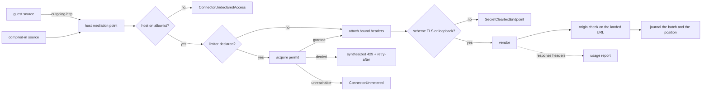
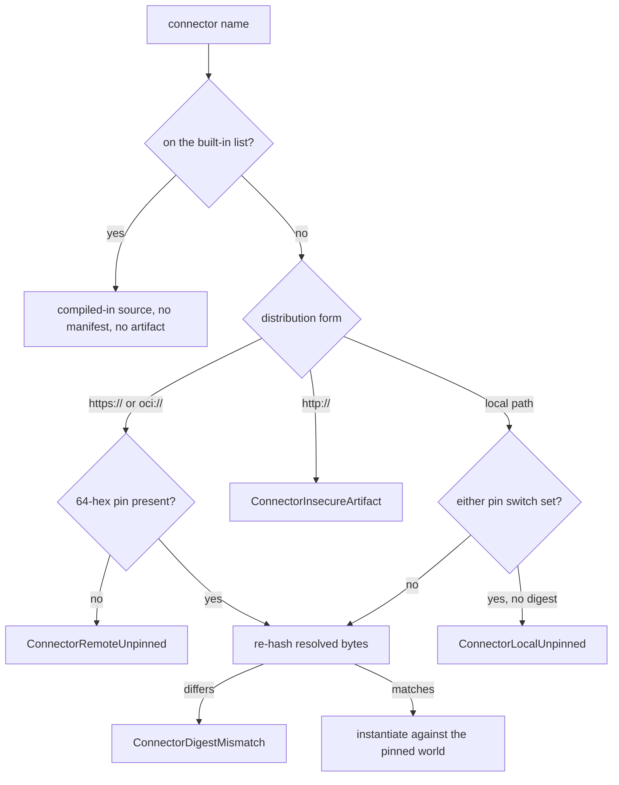
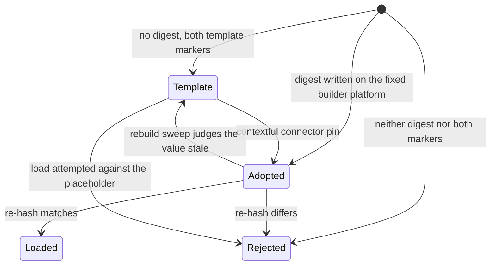

# The connector contract and the built-in sources

A connector is the one way data enters the run path from outside. This file states the
interface it answers, the access it declares, the bytes it is resolved from, and the
behavior of the sources compiled into the engine.

## Parties

| Party | Obligation |
| --- | --- |
| **The connector author** | Exports the calls of one world, declares the scalar types the guest guarantees rather than the ones a vendor's serialization implies, and lists every host access the code reaches for. |
| **The host runtime** | Implements the three imports itself, judges each outbound request against the declared allowlist ahead of socket I/O, arms the per-call bounds, and attaches operator-bound material to permitted requests. |
| **The operator** | Binds each declared name to a reference, binds a quota name to a limiter endpoint, pins the artifact a manifest resolves to, and configures the one model endpoint. |
| **The engine** | Resolves a connector name to compiled-in code or to verified bytes, resolves the destination to the local context store, and records what each read spent. |

## Operations

| Operation | What it governs |
| --- | --- |
| `export` | The calls a connector offers across the boundary: the shared types, the source and destination worlds, the optional worlds, and the compiled-in sibling. |
| `import` | What crosses inward: the three host imports, the forwarded configuration table, and the mediated outbound path. |
| `declare-capability` | The manifest's statement of host access — outbound hosts, environment names, the clock — and the preflight that judges a bound credential's grant. |
| `meter` | Reservation against a shared vendor quota: declaration, binding, permits, denial and the usage report. |
| `infer` | Model egress: the single endpoint, the fence that admits ingested prose as data, and the default embedder. |
| `package` | Distribution form, digest pinning, per-connector resource bounds, world versioning, and the authoring toolkit. |
| `resolve-destination` | Where landed rows go, and the refusal that answers every other destination name. |
| `source` | The declared behavior of each source compiled into the engine. |

## Clauses — export

One trait, two authoring paths. A connector failure crosses as a typed variant of the
taxonomy in [`spec/30-run.md` § Typed failures](30-run.md); a caller reads a connector's
failure in the same vocabulary as any other step's.

| Clause | Statement | decided-by |
| --- | --- | --- |
| `connector.export.invariant.authoring-path` | Every connector implements one trait, as a component sandboxed in the host runtime or as a native sibling compiled into the binary for a hot path. Dispatch carries no branch naming which of the two it calls: the world is the contract and the compiled-in form is an in-process implementation of it. |  |
| `connector.export.interface.type-taxonomy` | The shared types interface carries a schema (name, fields, primary key) and a schema field (name, data type, nullability) over a flat scalar set: `boolean`, `int32`, `int64`, `float64`, `string`, `bytes`, `timestamp-millis`, `json`. A batch travels as Arrow IPC bytes and a position travels as opaque bytes beside a declared kind. |  |
| `connector.export.invariant.nested-value` | A structurally nested value rides as `json` and acquires its type at the normalize stage. Recursive type definitions are absent from the interface language, so a guest expresses no nested schema of its own and a shape error surfaces at write time rather than at declaration time. |  |
| `connector.export.invariant.guaranteed-type` | A guest declares what it can guarantee: parsing and validating ahead of landing, it names `int64` for a count and `float64` for money and for a rate, and lands null for a spelling it cannot read — never zero, and never a text column that pushes a cast into every downstream read. An all-string schema belongs to values passed through unjudged. |  |
| `connector.export.interface.read-handle` | A source exports the cursor kind it produces, a schema discovery call, and an open call taking a table and an optional position. Open returns a handle whose `next` yields one batch or exhaustion and whose `position` reports the place it stands. |  |
| `connector.export.interface.write-handle` | A destination exports `prepare`, `write`, `commit` and `abort`. The two worlds are split and share the types interface, so a source-only connector stubs no write-side call. |  |
| `connector.export.invariant.optional-world` | Operator configuration and failure attribution are each their own interface composed into an additional world and probed on the instance by name. A guest built against the base world instantiates untouched, and neither addition moves the world version. |  |
| `connector.export.interface.partition-attribution` | A guest exporting failure attribution answers with the values of the outermost partition column that a failed read belongs to, byte for byte — no trimming, no case folding, no normalization anywhere along the chain. The host reads the export after the walk on the failure path and on the success path alike, since a read holding one partition back and landing the rest returns success. An empty list keeps the global, unattributed refusal. |  |
| `connector.export.limit.attribution-budget` | Failure attribution is bounded at 512 entries per session, each value at most 512 B. |  |
| `connector.export.interface.native-read` | A native source reads a table from a position, returning batches each paired with the position after it. It may bound a read to a half-open chunk range; the default delegates to the unbounded read, so a source unable to bound a chunk degrades to overlapping reads rather than mis-bounding one. |  |
| `connector.export.interface.native-extra` | A native source may additionally offer a cheap content fingerprint — a stat or a head request, never a download — its own connector identity, entries for the run's audit, and a declaration of why its vendor traffic goes unstamped or unmetered. |  |
| `connector.export.invariant.store-blindness` | A source is handed credentials, limiter bindings, the run id, the request ledger, the component pin and the incremental position, and no store handle. A run driven by a query over the store receives its resolved query set as run parameters from the caller already holding the store. |  |
| `connector.export.invariant.world-authorship` | The interface definition is immutable from an authoring agent's position: bindings are emitted from a host-owned template parameterized on the input specification and the connector name, and the author's whole surface is the method bodies — authentication, paging, and the cursor-kind declaration. An author working outside Rust compiles against the same definition through a component toolchain for their language. |  |

## Clauses — import

The host owns every inward edge. A declared name resolves to material through the
provider chain in [`spec/33-secrets.md` § Reference scheme](33-secrets.md); a manifest
carries the name and the host carries the value. The wire that material crosses, and
the form a URL takes once a diagnostic or a landed column receives it, belong to
[`spec/33-secrets.md` § Attachment](33-secrets.md); a connector names the header and
the host decides the request.

| Clause | Statement | decided-by |
| --- | --- | --- |
| `connector.import.invariant.three-imports` | Both worlds import outgoing HTTP, logging and a wall clock. There is no filesystem import and no socket import. |  |
| `connector.import.invariant.empty-context` | A guest standard library that pulls broader interfaces at instantiation links against an empty context: no preopens, no environment, no arguments. Those interfaces resolve and grant nothing. |  |
| `connector.import.invariant.wait-primitive` | A monotonic clock and a sleep primitive are absent from both worlds, so a guest holds no call open across a wait and a multi-minute vendor bake happens outside the sandbox. |  |
| `connector.import.invariant.mediation-point` | The host implements the outgoing-HTTP import itself. Every request is judged against the manifest's allowlist ahead of any socket I/O, the host stamps a host-assigned request id on the call, and a denied fetch fails the call loudly even where the guest swallows the error. No host import hands secret bytes to a guest. |  |
| `connector.import.interface.forwarded-config` | The pipeline's guest configuration table is the one part of the source configuration that crosses inward, serialized as a single JSON object and delivered once per session ahead of discovery and ahead of any open. The rest of the source configuration is host vocabulary and stays host-side. |  |
| `connector.import.refusal.config-shape` | Ahead of any I/O the host refuses a guest configuration value that is not a table, a serialization above its size bound, or any credential or environment reference appearing anywhere inside it, raising `ConnectorConfigRejected`. | `0108` |
| `connector.import.limit.config-size` | A serialized guest configuration table is bounded at 64 KiB. |  |
| `connector.import.refusal.config-unclaimed` | Where the artifact is local and the probe holds bytes, a guest table declared against a guest that exports no configuration interface raises `ConnectorConfigUnclaimed`. | `0108` |
| `connector.import.invariant.unusable-key` | A guest raises a permanent failure for a configuration key or a value it cannot act on, leaving no manifest that reads as describing a read it does not describe. |  |
| `connector.import.invariant.config-hashing` | The forwarded table folds into the connector's content hash. A pipeline forwarding no guest table keeps the artifact digest verbatim as that hash. |  |
| `connector.import.invariant.client-selection` | Which client a mediated call takes follows from whether the source declares a header at all. {{secret.attach.invariant.header-presence-selects-the-client}} {{secret.attach.invariant.referer-off}} |  |
| `connector.import.refusal.cleartext-attachment` | A host-attached header reaches a vendor over a confidential transport alone, under `SecretCleartextEndpoint`. | `0109` |
| `connector.import.invariant.diagnostic-url` | {{secret.attach.invariant.url-scrubbing}} {{secret.attach.invariant.typed-url-edit}} |  |

## Clauses — declare-capability

A manifest states the access; the host decides it. Nothing is negotiated at run time.

unsettled: Does a community-distributed connector need a signing and transparency layer above the content pin, and who runs the log? owner: connector affects: connector.declare-capability

| Clause | Statement | decided-by |
| --- | --- | --- |
| `connector.declare-capability.invariant.declared-grant` | A connector manifest describes the host access the code reaches for and the host decides whether to grant it. There is no run-time permission request and no escalation path, so a reviewer settles the grant set from a file ahead of anything running. |  |
| `connector.declare-capability.refusal.undeclared-access` | A connector reaching for access its manifest does not list fails to load with a diagnostic naming that access, raising `ConnectorUndeclaredAccess` rather than logging a denial after a request has already been formed. | `0110` |
| `connector.declare-capability.shape.host-allowlist` | The outbound allowlist holds exact host entries and subdomain wildcards matched in suffix form, so a wildcard entry covers a subdomain of the name and not the apex itself. |  |
| `connector.declare-capability.refusal.allowlist-shape` | An empty allowlist, a bare wildcard, an empty entry, and an entry carrying a scheme, a port or a path each raise `ConnectorAllowlistRejected`. The matcher strips a leading wildcard label, so a bare wildcard admits nothing and an entry written expecting everything is worse than a diagnostic. | `0110` |
| `connector.declare-capability.refusal.wildcard-beside-attachment` | A connector that binds host-attached material declares one non-wildcard host, judged at manifest validation and again at session open; a wildcard entry standing beside an attachment raises `ConnectorWildcardAttachment`. Wildcards stay available to a connector that attaches nothing. | `0110` |
| `connector.declare-capability.invariant.environment-name` | A declared environment name is a name rather than ambient access: the operator binds it to a reference and the host resolves and injects the value at call time. The connector reads no process environment and observes no plaintext. |  |
| `connector.declare-capability.invariant.ambient-authority` | No credential is a property of the process that any code path picks up — no process-wide environment read, no shared client carrying a default header, no import returning secret bytes. Every grant is explicit, bound to one declared host, and attached at the moment of the request. |  |
| `connector.declare-capability.invariant.clock-grant` | Access to the wall clock is itself a declared capability, decided by the host alongside outbound hosts and environment names. |  |
| `connector.declare-capability.interface.scope-probe` | A manifest may declare an identity endpoint, the response header carrying granted scopes, and the full grant it expects. The host calls that endpoint with the bound credential ahead of the first read. |  |
| `connector.declare-capability.refusal.scope-exceeded` | A granted scope falling outside the declared expectation raises `ConnectorScopeExceeded` and the session does not open. | `0111` |
| `connector.declare-capability.refusal.scope-unverified` | A probe response carrying no granted-scopes header raises `ConnectorScopeUnverified`: cannot-verify is not verified. | `0111` |
| `connector.declare-capability.invariant.probe-transport` | The scope probe carries the bearer, so its host sits on the allowlist and its scheme is TLS or loopback. |  |
| `connector.declare-capability.shape.environment-binding` | A source key binds from the environment through a `<key>_from = "env:<NAME>"` spelling. The pairs the engine resolves are enumerated in one place, each carrying the shape of the value it expects: a scalar, or a comma-separated list. |  |
| `connector.declare-capability.refusal.binding-unsupported` | Validation locates candidate sites by suffix and answers them from that enumeration; a key the connector does not read raises `ConnectorBindingUnsupported` rather than passing through to leave a manifest reading as bound while the read quietly used its default. | `0112` |
| `connector.declare-capability.refusal.binding-unbound` | A key the connector does read that the environment did not supply raises `ConnectorBindingUnbound`, tested against that binding's declared shape, so a list variable holding separators alone fails the preflight rather than the first read. | `0112` |

## Clauses — meter

A shared vendor quota is coordinated at the same boundary the request crosses.

| Clause | Statement | decided-by |
| --- | --- | --- |
| `connector.meter.interface.limiter-declaration` | A connector declares a limiter capability naming the shared vendor quota, the traffic class its requests are tagged with, and the vendor-specific quota-state response headers to forward. |  |
| `connector.meter.interface.limiter-binding` | The operator binds that quota name to an endpoint, a reference-held bearer token and a permit batch size. |  |
| `connector.meter.refusal.quota-unbound` | A declared quota with no binding raises `ConnectorQuotaUnbound` at load. | `0113` |
| `connector.meter.refusal.binding-transport` | A limiter endpoint that is not HTTPS, loopback excepted, and a token written as an inline literal rather than a reference, each raise `ConnectorLimiterBindingRejected` at load, since the value crosses the wire on every call and a literal is material inside a committed file. | `0113` |
| `connector.meter.invariant.reservation-point` | The host reserves at the mediation point — the guest's outgoing-HTTP import, or the engine's shared client for a compiled-in source — the one place every vendor request is visible and the unit the vendor itself meters. One permit covers one outbound request; a per-call reservation is unenforceable there, one call issuing any number of requests for paging, retries and token refresh. |  |
| `connector.meter.invariant.permit-batch` | An acquire may grant a batch of permits under a short TTL. Each outbound request spends one, unspent permits are surrendered in the following report, and the report reconciles granted against spent. |  |
| `connector.meter.interface.acquire` | Acquire is an authenticated POST taking quota, class and permit count, answering granted with a permit count and a TTL, or denied with a retry-after. A bare 429 carrying a retry-after header reads as a denial, a body carrying permits or a retry-after without the discriminator is accepted, and a grant of zero permits is a denial. |  |
| `connector.meter.refusal.unreadable-answer` | A limiter response the engine cannot read raises `ConnectorLimiterUnreadable` and is not treated as permission. | `0113` |
| `connector.meter.interface.report` | Report is an authenticated POST taking quota, class, granted, spent, an ordered array of one entry per vendor response carrying status, retry-after and verbatim headers, an observation instant and the run id. |  |
| `connector.meter.invariant.report-delivery` | Report delivery is at-least-once under bounded backoff inside the run. A report that never lands is recorded in the run audit without failing the run. |  |
| `connector.meter.refusal.unmetered-request` | A connector carrying a declared limiter makes no outbound vendor request without a granted reservation, and raises `ConnectorUnmetered` rather than proceeding when the limiter is unreachable or the binding is absent. | `0113` |
| `connector.meter.invariant.allowlist-precedence` | A request the capability allowlist refuses never reaches the limiter, so a held-back request spends none of the consumer's quota. |  |
| `connector.meter.invariant.held-back-request` | A guest that swallows a held-back request still fails the call, and a failure inside the engine's own reservation machinery stays failed rather than healing into a permissive no-op. |  |
| `connector.meter.invariant.synthesized-throttle` | A denied reservation returns to the guest as a synthesized 429 carrying the retry-after, which never leaves the host, so a connector already mapping vendor throttles to the rate-limited variant needs no further interface and cannot tell which party throttled it. An unreachable limiter fails the mediated request as a transport failure, having no honest retry-after to offer. |  |
| `connector.meter.invariant.replay-reservation` | Replay makes no limiter call. A replayed read issues no outbound request, and a reservation is coupled to one. |  |
| `connector.meter.refusal.built-in-grant-absent` | A compiled-in source that reaches an outside vendor declares its grant in the pipeline's own source configuration under the same key, and the build raises `ConnectorGrantMissing` without it. | `0114` |
| `connector.meter.refusal.grant-unhonorable` | A compiled-in source that does not reach its data through the mediated client raises `ConnectorGrantUnhonorable` on a declared grant at load rather than accepting one it could not honor. | `0114` |
| `connector.meter.invariant.metered-disclosure` | Every compiled-in read records whether it ran metered; the absence is stated once per run on the run record beside the unstamped-egress entry, and validation warns per pipeline naming the connector and the block to add. Both surfaces are gated on the project having bound a quota at all. |  |
| `connector.meter.invariant.counting-not-pricing` | The limiter counts requests and does not price them, so a monetary ceiling is arithmetic performed outside the engine. |  |

## Clauses — infer

Every model call leaves through one endpoint the operator configures. The zone a call's
declared locality maps onto is [`spec/41-enforcement.md` § Inference zones](41-enforcement.md);
a read filtered on placement consults that mapping rather than the endpoint's URL.

| Clause | Statement | decided-by |
| --- | --- | --- |
| `connector.infer.invariant.model-endpoint` | Every model call resolves to one operator-configured OpenAI-compatible HTTP endpoint declared as a capability. The host owns the credential, the rate limit and the per-call span; the component owns the prompt template and the response schema and observes no material. |  |
| `connector.infer.refusal.vendor-sdk` | A crate importing a model-vendor SDK raises `ConnectorVendorSdk`, and the gate enforces the absence across the workspace. A provider swap is a URL edit with no conditional branch anywhere in the engine. | `0115` |
| `connector.infer.invariant.provider-shaped-step` | {{topology.compose.invariant.pillar-inference}} Swapping the driver moves narration quality and moves nothing about rendering. |  |
| `connector.infer.invariant.data-fence` | No ingested value reaches a model without a boundary declaring it data. Each value sits between marker pairs whose opening marker carries that value's provenance label, preceded by a preamble declaring the blocks data and followed by a closing line re-asserting the caller's rules. |  |
| `connector.infer.invariant.marker-derivation` | A marker carries a token derived from the fenced content itself, so closing one's own fence requires authoring content containing the digest of a batch containing that content. |  |
| `connector.infer.invariant.fenced-value-hygiene` | Control characters are stripped from a fenced value, and a value past its declared character cap is truncated and carries a truncation mark into the prompt. |  |
| `connector.infer.invariant.operator-template` | The operator's own prompt template stays in the system role, unfenced, as the thing the fence subordinates ingested text to. The idempotency hash covers the template alone, and hardening the boundary leaves a dedup key intact. |  |
| `connector.infer.invariant.default-embedder` | The embedding capability is a port whose default is deterministic and free of I/O: it hashes token term frequencies into an L2-normalized vector. A first run needs no download, no key and no network call. |  |
| `connector.infer.invariant.model-identifier` | The model identifier travels beside every vector in an `embedding_model` column, so index identity and provenance are recoverable from the rows themselves. |  |
| `connector.infer.invariant.default-embedder-reach` | The default is a lexical-vector baseline: a paraphrase is orthogonal to it and cross-lingual recall is undefined under it. Semantic reach arrives through the learned in-process model or through operator-supplied vectors passed as a query embedding. |  |

## Clauses — package

A connector name resolves to bytes, and the bytes are judged before they run. The tuple a
run records when it admits a connector is [`spec/30-run.md` § Replay pinning](30-run.md);
a replayed read resolves its artifact from that record rather than from a name.

unsettled: Which generation of the sandbox interface does the guest world target, and what does native async change about the per-call deadline and the bridge that blocks on a reservation? owner: connector affects: connector.package

| Clause | Statement | decided-by |
| --- | --- | --- |
| `connector.package.shape.distribution-form` | A connector resolves in one of four forms: in-tree by name, a project-local artifact path, an HTTPS URL, or an OCI reference. |  |
| `connector.package.refusal.remote-unpinned` | A remote artifact carrying no 64-hex content pin raises `ConnectorRemoteUnpinned` at parse, so it fails the validation verb and the gate alike rather than at first load. | `0116` |
| `connector.package.refusal.insecure-artifact` | A plain-HTTP artifact reference raises `ConnectorInsecureArtifact` outright. | `0116` |
| `connector.package.refusal.digest-mismatch` | The host re-hashes the resolved bytes and raises `ConnectorDigestMismatch` before they reach the engine. | `0116` |
| `connector.package.invariant.pin-requirement-switches` | Two switches close the unpinned local load and they compose by disjunction, so neither side weakens the other: a store-wide policy key the operator sets once, and a per-connector flag the author sets in their own manifest. |  |
| `connector.package.refusal.local-unpinned` | With either switch set, an unpinned local artifact raises `ConnectorLocalUnpinned` at build and the refusal carries the digest of the bytes it found, so pinning is a paste. | `0116` |
| `connector.package.invariant.requirement-without-a-digest` | A manifest declaring the requirement while shipping no pin parses cleanly and refuses at load: the text is well formed, and refusing to load rather than refusing to read is what makes the template posture expressible. |  |
| `connector.package.shape.manifest-posture` | A manifest ships adopted, carrying a digest taken over the guest beside it on the fixed builder platform, or as a template, carrying the requirement plus a placeholder the pin verb writes into. The presence of a digest separates the two; the requirement flag states what the loader does with an unpinned artifact, not which posture the manifest holds. |  |
| `connector.package.refusal.posture-undeclared` | A manifest that neither carries a digest nor declares both template markers raises `ConnectorPostureUndeclared` at merge, and a rebuild sweep judges every adopted value. | `0116` |
| `connector.package.invariant.digest-host-dependence` | With the toolchain held constant — one compiler commit, one target, one lockfile, one set of paths — a guest source builds to different bytes on an aarch64 host than on an x86_64 one. Build-script and proc-macro units are host-kind and carry the host triple into a metadata hash that reaches symbol names and therefore linker layout. Each host reproduces itself exactly and the two disagree, the instruction stream being identical across them: stripping symbols restores no layout, and no source edit and no compiler flag converges them. |  |
| `connector.package.workflow.pin-verb` | `contextful connector pin <manifest>` builds the guest inside a digest-pinned container on one fixed platform, writes the artifact next to the manifest, and writes the digest into the manifest. `--verify` rebuilds and compares without writing, failing on drift. |  |
| `connector.package.refusal.host-built-pin` | `--local` builds with the host toolchain for a build-run-edit loop and states plainly that the digest it prints is host-local; writing a pin from a host build raises `ConnectorHostPinRefused`, a host build reading its toolchain off the path. | `0117` |
| `connector.package.invariant.path-remap` | Every build applies a path remap over the source root and the package cache, so where a checkout sits on disk is not an input to the digest. |  |
| `connector.package.interface.native-verification` | `--verify --native` checks the host triple, the compiler and the package-manager build against pinned constants, clears every variable and refuses every configuration key that moves the bytes, and only then builds. Its answer is either the container's answer or a diagnostic naming the input that differs, under a distinct exit status so an unable-to-check runner never reads as a wrong committed digest. |  |
| `connector.package.limit.linear-memory` | A connector runs under 256 MiB of linear memory by default, raised per connector to at most 2 GiB. |  |
| `connector.package.limit.call-deadline` | A read call carries a 30 s wall-clock deadline and a discovery call a 60 s one, each armed by epoch interruption at 100 ms granularity. |  |
| `connector.package.limit.session-budget` | A session carries a 1 MiB logging budget, with messages past it dropped and counted in the session audit, and holds at most 8 requests outbound at once. |  |
| `connector.package.invariant.bound-outcome` | A connector striking a declared bound returns the transient variant and may be retried; repeated strikes fail the run fast. Every bound decision is recorded on the run record rather than logged alone. |  |
| `connector.package.invariant.world-compatibility` | Compatibility is semver over the world. A guest built against one minor loads on any host advertising a compatible minor, and a major bump is what parts them. |  |
| `connector.package.invariant.world-drain` | On a major world bump the old world drains: no new run admits against it, in-flight runs complete or suspend on the world they pinned, and the old host world retires after that. A run is never carried across world versions. |  |
| `connector.package.refusal.live-reresolution` | Re-resolving or reloading a connector raises `ConnectorHotReload` while a journaled run holds it live; a new version applies to runs admitted after the change. | `0118` |
| `connector.package.shape.built-in-registry` | The names resolving to a compiled-in source form one enumerated list, which callers reasoning about installed connectors read rather than re-listing. A listed name reaches no component path, so it carries no manifest and has no artifact to pin. A feature-gated entry stays listed unconditionally, so a build without that feature answers with a rebuild hint. |  |
| `connector.package.workflow.scaffolder` | The scaffolder emits a compliant crate, a manifest with inferred capabilities, and a round-trip test against a recorded fixture, branching on the shape of the input specification: a machine-readable REST description is the primary path, a REST API documented in prose alone needs more iteration, a graph API scaffolds constant documents with every dynamic value bound as a variable, and a database or binary protocol is hand-written native code against an established driver. |  |
| `connector.package.workflow.test-kit` | Three test kinds ship with the authoring toolkit: a conformance suite asserting that discovery returns valid schemas, that opening a table yields a finite stream, and that a position round-trips; fixture replay of recorded HTTP interactions; and property tests over position monotonicity and schema invariants. |  |
| `connector.package.invariant.dependency-allowlist` | The authoring dependency allowlist carries a linear-time regular-expression engine in place of a backtracking one, and bounded-depth deserialization in place of unbounded recursive parsing of arbitrary input. |  |

## Clauses — resolve-destination

Rows land in one place. The ledger a mediated call settles into is
[`spec/20-read.md` § Request ledger](20-read.md); a landed batch joins it by the ordinal
the write carried.

| Clause | Statement | decided-by |
| --- | --- | --- |
| `connector.resolve-destination.invariant.local-store` | The local context store is the destination a pipeline resolves. |  |
| `connector.resolve-destination.refusal.unknown-destination` | Every destination name other than the local store raises `ConnectorUnknownDestination` at assembly, ahead of any row moving. | `0119` |
| `connector.resolve-destination.invariant.no-host-arm` | The destination world is declared with no host arm, so a guest cannot supply a destination the runtime does not resolve. |  |
| `connector.resolve-destination.invariant.synthesized-artifact` | A synthesized artifact is written back through this same destination and becomes queryable corpus. There is no separate sink. |  |
| `connector.resolve-destination.interface.schema-reconciliation` | {{store.reconcile.workflow.first-sight-creates}} |  |
| `connector.resolve-destination.refusal.irreconcilable-schema` | A schema change the destination cannot reconcile raises `ConnectorSchemaIrreconcilable`. | `0119` |
| `connector.resolve-destination.invariant.durable-write` | A destination durably writes one batch per call, leaving no half-written batch behind. |  |
| `connector.resolve-destination.invariant.commit-visibility` | Commit publishes a run's data for one table, after which a query sees its rows. |  |
| `connector.resolve-destination.shape.batch-ordinal` | A write may carry the batch's ordinal within its run, which is the join key onto the run's request ledger. |  |

## Clauses — source

The sources compiled into the engine, and what each one declares. The access mapping a
source pack supplies is [`spec/42-visibility.md` § Source-supplied mappings](42-visibility.md);
a pack's rows reach the read path through that contract rather than through this one. Work
deferred over rows a source has already landed is
[`spec/34-derive.md` § The store-reading source](34-derive.md); a body left null here is
filled there. The commit an unchanged-input skip lands is
[`spec/30-run.md` § Clauses — advance](30-run.md); a replacing table keeps serving its
last non-empty state across one.

unsettled: What bounds allowed lateness for an out-of-order source, and does a lateness window belong to the position, to the table, or to neither? owner: connector affects: connector.source

| Clause | Statement | decided-by |
| --- | --- | --- |
| `connector.source.interface.http-headers` | The generic HTTP source reaches a credentialed vendor API through a headers configuration table whose values are literal text carrying reference placeholders, so the common bearer-prefix shape composes with no code. A placeholder resolves just in time per read, and the manifest, the run journal and the logs carry the reference rather than the value behind it. |  |
| `connector.source.refusal.header-spelling` | A bare name and an environment scheme inside a header value raise `ConnectorHeaderSchemeRejected` at parse, as does a malformed placeholder — unclosed, empty or nested. | `0120` |
| `connector.source.interface.body-format` | `format` decides how a body decodes — `json` by default, `jsonl`, `csv`, or a workbook — and one decoder serves the HTTP, file and object sources alike, so one spelling means one thing wherever the document arrived from. Over HTTP the format is explicit and is not inferred from the URL, a path extension predicting nothing about a response body; the two file-shaped sources infer it from the extension. |  |
| `connector.source.refusal.format-key-mismatch` | Three key families raise `ConnectorFormatKeyRejected` at build against a non-JSON format: the JSON record path, every pagination shape, and any decode key the chosen format does not read. | `0120` |
| `connector.source.invariant.delimited-cell` | A delimited source lands every cell as a string and an empty unquoted field as null, so a dimension file's schema does not depend on its data and an identifier of `07` reads the same across two exports. |  |
| `connector.source.refusal.declared-encoding` | A non-UTF-8 delimited body decodes through a declared encoding label and raises `ConnectorEncodingInvalid` where the bytes are not valid under it, rather than landing lossily and leaving a replacement character inside an identifier. | `0120` |
| `connector.source.refusal.clock-column-spelling` | A delimited clock column is an RFC 3339 instant or a fixed-width digit stamp; another spelling raises `ConnectorClockColumnRejected`, the watermark comparing text. | `0120` |
| `connector.source.interface.pagination` | A walk declares exactly one of four shapes: a page parameter with a start page, a next-cursor path with a cursor parameter, a next-URL path, or link-header following. |  |
| `connector.source.refusal.pagination-ambiguity` | Declaring two pagination shapes raises `ConnectorPaginationAmbiguous`, honoring one of them silently paging the wrong way. | `0121` |
| `connector.source.limit.page-cap` | A hard cap of 1000 requests bounds one walk. |  |
| `connector.source.refusal.page-loop` | A vendor handing back a token or a link it already served raises `ConnectorPageLoop` rather than re-landing that page. | `0121` |
| `connector.source.invariant.origin-pinning` | A vendor-supplied next link is followed within the configured origin — scheme, host and port — and the origin is judged a second time against the URL a page actually landed on, a redirect moving a request after the link check and a chain ending where it started still having reached a third party. One hop is exempt: a cleartext endpoint landing on TLS at the host and port as written, a vendor forcing TLS being unable to move the request to another party. |  |
| `connector.source.refusal.transport-downgrade` | A hop from TLS to cleartext at the same host raises `ConnectorTransportDowngrade`, as does any hop leaving the configured origin; the redirect status surfaces as the response and the read fails. | `0122` |
| `connector.source.interface.table-pattern` | A table pattern binds table-name segments into the request URL, so one pipeline pulls many streams rather than one endpoint. Each table holds its own position, so streams advance independently and adding one disturbs no other's watermark. Every value bound into a request line is percent-encoded, a table name being manifest text that becomes part of a URL. |  |
| `connector.source.refusal.table-unmatched` | A table that does not match the declared pattern raises `ConnectorTableUnmatched` ahead of any request, rather than falling back to the unbound URL or skipping the table while every run reports success. | `0123` |
| `connector.source.refusal.placeholder-unbound` | A URL naming a placeholder with no pattern to bind it raises `ConnectorPlaceholderUnbound` at build. | `0123` |
| `connector.source.interface.expansion` | An expansion block names the pointer one of two ways and names the column the fetched document lands under: a template whose placeholders bind from the landed row's own scalar columns, nested ones by dotted path and each percent-encoded, or a column already holding a URL, resolved against the configured endpoint when relative and taken as written when absolute. |  |
| `connector.source.refusal.pointer-ambiguity` | Declaring both pointer forms raises `ConnectorPointerAmbiguous`, a row's document being reached one way. | `0124` |
| `connector.source.invariant.expanded-format` | The fetched document's own format decides how it is read: parsed and landed as a nested column, or landed verbatim in one text column for an index whose details arrive as XML, HTML or delimited text. |  |
| `connector.source.invariant.expansion-order` | Expansion runs after the watermark filter, so the rows that land are the rows that are expanded and a rejected row costs no vendor request. Follow-ups are issued one after another, so an unmetered manifest cannot burst a single host at the width of a batch. |  |
| `connector.source.refusal.follow-up-failure` | A failed follow-up raises `ConnectorExpansionFailed` for the whole read rather than landing the index row with its target column absent, committing a position past a row whose detail is missing stranding that row on a forward-only path. | `0124` |
| `connector.source.limit.expansion-budget` | One expanding read issues at most 200 requests of follow-up, judged before the first is spent, holds at most 256 MiB of buffered document bytes, and runs at most 600 s. Each budget refuses rather than truncating. |  |
| `connector.source.refusal.template-shape` | A pointer template carrying no placeholder, or binding one into the URL's authority, raises `ConnectorTemplateRejected` at build: the first fetches one document once per landed row, and the second lets a response body name a credential's destination, percent-encoding being no defense where a hostname is unreserved characters throughout. | `0124` |
| `connector.source.refusal.pointer-column-missing` | A placeholder naming a column the rows do not carry, or carry as an array, raises `ConnectorPointerColumnMissing` on the first row ahead of its request, which columns a row holds being unknown until one arrives. | `0124` |
| `connector.source.refusal.target-column-occupied` | A target column the index already carries raises `ConnectorTargetColumnOccupied` ahead of the walk, judged over every landed row, so an index whose hundredth row carries it costs no follow-ups first. | `0124` |
| `connector.source.invariant.walk-boundary` | Every source walking an operator-pointed directory draws its boundary the same way: the configured root is the whole of what the walk reaches, dot-entries are skipped, and the traversal is sorted so a run over an unchanged tree reproduces across hosts. A key selecting how a file decodes is not a key bounding what the walk reaches; narrowing which extensions are read as text confines nothing. |  |
| `connector.source.invariant.declined-tally` | A directory walk reports what it declined on the run record, tallied by extension, so a collection whose transcripts never landed does not read as a collection that has none. |  |
| `connector.source.invariant.document-grain` | A document source lands one row per page or, past a length threshold, one row per heading — never one row per document. With an operator-supplied base URL each row's link carries its own page anchor, giving a citation a target. |  |
| `connector.source.invariant.document-identity` | A document identity is a slug plus an ordinal, for an unchunked document as much as for a chunked one, so an identity does not move when a document crosses the threshold and leave an earlier row serving stale text. |  |
| `connector.source.refusal.document-unreadable` | An encrypted document, and one carrying no extractable text on any page, raise `ConnectorDocumentUnreadable` permanently, naming the path — never an empty body on every page, which reads downstream as a document the store holds and has nothing to say about. | `0125` |
| `connector.source.refusal.frontmatter-shape` | A note's frontmatter is a flat scalar-and-list subset: a nested map, a block scalar, and a key carrying the reserved producer prefix each raise `ConnectorFrontmatterRejected` rather than dropping a column silently or shadowing a producer-set one. | `0125` |
| `connector.source.refusal.conversion-required` | A compound-binary office container raises `ConnectorConversionRequired` naming the conversion command, detected by magic bytes as well as by extension so neither misnaming changes the answer. | `0126` |
| `connector.source.refusal.document-truncation` | A reader that reaches part of a document and stops raises `ConnectorPartialParse` for the whole rather than landing the pages it managed, a truncated ingest being indistinguishable downstream from a complete one. | `0125` |
| `connector.source.refusal.input-unreadable` | Unreadable input is data rather than a fault: the source raises `ConnectorInputUnreadable` permanently, naming the path and the position inside a structured input — page, worksheet, entry. Permanence is terminal against the retry schedule, and the failing unit is that table's read, so five hundred documents holding one unreadable member answer by name from the run record. | `0125` |
| `connector.source.invariant.parse-containment` | {{pipeline.land.invariant.parse-boundary}} {{pipeline.land.refusal.parse-boundary}} A compiled-in source's decode sits behind that same boundary. |  |
| `connector.source.invariant.office-part-selection` | An office container is read by exact part name — four parts for a workbook, two for a word-processor document — so charts, pivot caches, macros and drawings are absent structurally rather than by a filter, and no external entity is resolved. |  |
| `connector.source.limit.decompression-budget` | A multi-part office read is bounded at 64 MiB of total decompressed bytes, and on the wire the archive bound is the operator's body cap intersected with that figure. Archive size, entry count and decompressed bytes per part are judged against the directory's claim and against what actually arrives. |  |
| `connector.source.limit.worksheet-landing` | Landing one worksheet is bounded at 64 MiB of resolved cell text counted as cells land, and at 1048576 rows, shared-string fan-out turning a small input into an unbounded output that counting distinct strings does not see. |  |
| `connector.source.invariant.cell-indexing` | An absent cell omits its key and an empty existing cell lands null. Cells land by their declared column reference rather than by position, since taking the nth element as the nth column shifts every row containing a blank, and a gap between row indices lands nothing rather than filling every unfilled index. |  |
| `connector.source.refusal.cell-out-of-range` | A cell past the header's width raises `ConnectorCellOutOfRange`, and the worksheet header inherits the empty-name and repeated-name refusals of the delimited reader verbatim. | `0126` |
| `connector.source.refusal.external-reference` | An external-reference declaration, an external-links part, and a relationship marked external each raise `ConnectorExternalReference` permanently: a cached external value is another workbook's data wearing this one's provenance, and following the link reaches a host the manifest never named. | `0126` |
| `connector.source.invariant.workbook-cell-typing` | Every workbook cell lands as a string and a date cell lands as its serial number, the styles part being unread and a number-format id being the author's display choice rather than a type. A formula subtree is skipped whole, so no formula is evaluated and the cached value beside it is what lands. |  |
| `connector.source.refusal.workbook-incremental` | An incremental position against a workbook raises `ConnectorIncrementalUnsupported`, a variable-width serial number advancing a lexicographic watermark past rows the run never landed. The pairing becomes legal once the styles part lands. | `0126` |
| `connector.source.invariant.report-source-nativity` | A source whose vendor enqueues a report job, bakes it and then pages results is compiled-in native code, waiting being a host capability rather than a guest one. |  |
| `connector.source.invariant.report-id-commit` | The vendor's run id is committed the instant creation returns it, ahead of the first poll, the job existing on the vendor's side from that moment. Exhausting the polling budget ends the read successfully with the id committed, and the following read resumes that same job. An expired or failed vendor run id is recreated for the same window rather than surfaced as a failure, expiry decided on the vendor's structured codes rather than on an HTTP status. |  |
| `connector.source.invariant.page-drain` | Paging drains a fixed number of pages per read, emitting one batch per page each carrying the position after it, so a large report spans several runs and every one of them commits a position. |  |
| `connector.source.refusal.page-cursor-missing` | A response announcing that another page exists while naming its cursor in neither the explicit cursor field nor the next link raises `ConnectorPageCursorMissing` as a hard failure, collapsing the two facts making a truncated report indistinguishable from a finished one. | `0127` |
| `connector.source.shape.report-watermark` | Report watermarks are held per partition — account, grain and breakdown — as a versioned map inside one position, so partitions advance independently and adding one later invalidates no other's progress. |  |
| `connector.source.invariant.partition-isolation` | A retryable failure on one partition holds that partition at its committed position and leaves the pages other partitions already drained intact, rather than discarding the whole read. |  |
| `connector.source.invariant.stream-identity` | A report type and an entity grain are part of a stream's identity rather than parameters of one: each split's dimension values join the identity key and the watermark partition beside account, grain and breakdown, and a metric list is declared narrower rather than filtered after the fact. |  |
| `connector.source.refusal.metric-grain` | A metric is admitted at the grain the vendor computes it and raises `ConnectorMetricGrainRejected` at a grain where it is an estimate, rather than landing a number a downstream sum silently ruins. | `0127` |
| `connector.source.invariant.restated-window` | A caught-up partition re-opens its lookback window on every run, and the pull window is at least as wide as that lookback. Each row carries a deterministic identity key over partition, entity, date and breakdown values, so a second pull of a restated day emits byte-identical keys the dedup path folds. |  |
| `connector.source.invariant.report-event-time` | A report row's event time is injected as an RFC 3339 instant at midnight UTC of the window-start day, and null where the vendor supplied no usable date. That column is what an ordering rule and a seed ceiling evaluate against. |  |
| `connector.source.refusal.ordering-column` | Ordering a report stream by the engine-injected ingest stamp raises `ConnectorOrderingColumnRejected`, ordering by write time letting a late seed outrank a live restatement. | `0127` |
| `connector.source.invariant.field-drift` | Report rows stay untyped JSON into the batch, so a field a vendor adds or renames becomes a column rather than a failed batch. Throttling is typed from both shapes a vendor uses: a throttle status, and an ordinary error body carrying a throttle code. |  |
| `connector.source.refusal.report-auth` | An authentication failure on a report read raises `ConnectorAuthTerminal` and is terminal against the retry schedule, an empty-but-successful batch reading downstream as zero spend. | `0127` |
| `connector.source.shape.image-row` | An image source lands the provenance row: path, content hash, width and height read off the file header, a capture instant from embedded metadata where present, the file modification time, a modality marker, and a null body. |  |
| `connector.source.refusal.image-header` | An image header that does not parse raises `ConnectorImageHeaderUnreadable` naming the path, rather than landing a row of zeroes, and no pixel decode happens on the ingest path. | `0128` |
| `connector.source.invariant.quotability-marker` | Whatever later fills an image body records in a companion column whether the text is verbatim extraction, which a citation may quote, or a model's reading of a chart or a diagram, which no citation quotes as the document's own words. |  |
| `connector.source.refusal.marker-body-pairing` | The quotability marker and the body are null together and non-null together; any other combination raises `ConnectorQuotabilityMismatch`. | `0128` |
| `connector.source.interface.search-config` | The search source takes a driver, a query, a freshness window in days and a result ceiling, yielding one row per result carrying `url`, `title`, `snippet`, `published_at`, `score`, `provider`, `query` and `fetched_at`. Its cursor kind is snapshot-id, a full refresh each run, and a declared primary key over the result URL collapses a URL that resurfaces across runs into one row. |  |
| `connector.source.refusal.provider-origin` | Each search provider's host is pinned at the call site rather than read from configuration: a non-TLS transport and any host other than that provider's raise `ConnectorProviderOriginRejected`, loopback excepted so a fixture is pointable. Adding a provider is a match arm plus an allowlist entry rather than a new pipeline shape. | `0129` |
| `connector.source.invariant.search-degradation` | An absent provider key and a provider 5xx are transient failures yielding zero rows and a zero-row run outcome rather than a crash, and a reader answers from the corpus already landed. |  |
| `connector.source.invariant.search-replay` | A search read is journaled, so a replay returns the recorded result set and re-issues no billed query. |  |
| `connector.source.interface.unchanged-skip` | A snapshot source with `skip_unchanged` records the input's content digest in its position as a `sha256` and a row count. A matching digest returns zero batches: zero rows land, the position is preserved, and the run records a zero-row success as the skip signal. The option defaults off. {{run.advance.invariant.digest-scope}} |  |
| `connector.source.invariant.poll-only-increments` | Incremental loading is cron-poll. A forever-open replication socket is not a read of this kind, its output being unbounded with no recorded request and response to replay, and a position assumes a mostly-monotonic source. |  |

## Shapes

A connector manifest, adopted posture:

```toml
name    = "vendor-metrics"
version = "1.4.0"
world   = "source-connector@1.2.0"

wasm         = "vendor-metrics.wasm"
wasm_sha256  = "9f2c1b7ad0e4…"            # 64 hex, written by `connector pin`
require_wasm_pin = true

[capabilities]
allow_hosts = ["api.vendor.example", "*.cdn.vendor.example"]
env         = ["VENDOR_ACCOUNT_ID"]
clock       = true

[capabilities.scope_probe]
endpoint      = "https://api.vendor.example/v1/identity"
scopes_header = "X-Granted-Scopes"
expect        = ["reports.read", "accounts.read"]

[capabilities.limiter]
quota         = "vendor-app-shared"
class         = "batch-read"
usage_headers = ["X-RateLimit-Remaining", "X-RateLimit-Reset"]

[attach]
Authorization = "Bearer ${secret://vendor-token}"

[bounds]
memory_bytes        = 268435456
fuel_per_call       = 1000000000
log_bytes_session   = 1048576
in_flight_requests  = 8
```

A template manifest carries the requirement and the placeholder instead of a digest:

```toml
require_wasm_pin = true
wasm_sha256      = "<pin-me>"
```

The world, sketched:

```wit
package contextful:connector@1.2.0;

interface types {
  record schema       { name: string, fields: list<schema-field>, primary-key: list<string> }
  record schema-field { name: string, ty: data-type, nullable: bool }
  enum   data-type    { boolean, int32, int64, float64, string, bytes, timestamp-millis, json }
  record cursor       { kind: cursor-kind, bytes: list<u8> }
  variant error {
    transient(string), permanent(string), auth-expired(string),
    rate-limited(u32), schema-incompatible(string),
  }
}

world source-connector {
  import wasi:http/outgoing-handler;
  import wasi:logging/logging;
  import wasi:clocks/wall-clock;
  export source: interface {
    cursor-kind: func() -> cursor-kind;
    discover: func() -> result<list<schema>, error>;
    open: func(table: string, from: option<cursor>) -> result<read-handle, error>;
  }
}

world configurable-source-connector { include source-connector; export config: interface { … } }
world attributing-source-connector  { include source-connector; export attribution: interface { … } }
```

A pipeline's HTTP source, with paging, expansion and a forwarded guest table:

```toml
[pipeline.source]
connector = "http"
endpoint  = "https://api.vendor.example/v1/{table}"
format    = "json"
record_path = "$.data[*]"
account_id_from = "env:VENDOR_ACCOUNT_ID"

[pipeline.source.headers]
Authorization = "Bearer ${secret://vendor-token}"

[pipeline.source.pagination]
next_cursor_path = "$.meta.next"
cursor_param     = "after"

[pipeline.source.expand]
template = "https://api.vendor.example/v1/items/{id}"
into     = "detail"
max_follow_ups   = 200
max_buffer_bytes = 268435456
max_seconds      = 600

[pipeline.source.config.guest]
locale = "en-GB"
```

Worksheet and archive bounds, as the reader applies them:

```
archive (on the wire)   body cap ∩ 64 MiB decompressed
parts read              workbook 4, word-processor document 2
worksheet cell text     64 MiB resolved
worksheet cells         4000000
landed columns          512
worksheet rows          1048576
```

One outbound request, end to end:



Artifact resolution:



A connector package on disk:

```
connectors/vendor-metrics/
  connector.toml            the manifest above
  vendor-metrics.wasm       the artifact `connector pin` wrote
  src/lib.rs                the author's method bodies
  tests/conformance.rs      discovery, finite stream, position round-trip
  tests/fixtures/           recorded HTTP interactions, replayed deterministically
```

A directory-walking document source:

```toml
[pipeline.source]
connector = "documents"
root      = "./corpus/filings"
heading_split_threshold_chars = 8000
base_url  = "https://intranet.example/filings/"   # each page row links to its anchor
```

An async-report source, one stream per report type and grain:

```toml
[pipeline.source]
connector = "vendor-reports"
report    = "campaign-performance"
grain     = "day"
breakdown = ["placement"]
metrics   = ["impressions", "clicks", "spend"]
lookback_days = 28
pull_window_days = 35          # at least as wide as the lookback
pages_per_read   = 20

[pipeline.table]
primary_key = ["account_id", "entity_id", "event_date", "placement"]
```

The position such a source commits, one versioned map inside one cursor:

```json
{
  "v": 2,
  "partitions": {
    "acct-41|day|placement": { "report_run_id": "rr_8812", "page": 7, "watermark": "2026-05-30" },
    "acct-93|day|placement": { "report_run_id": null,      "page": 0, "watermark": "2026-06-02" }
  }
}
```

An image row as it lands, body and quotability marker null together:

```json
{
  "path": "corpus/decks/q2-review.pdf#p12.png",
  "content_hash": "3a91…",
  "width": 1600, "height": 900,
  "captured_at": "2026-04-18T09:12:04Z",
  "file_modified_at": "2026-04-18T09:12:05Z",
  "_modality": "image",
  "body": null,
  "body_quotability": null
}
```

The limiter wire, acquire then report:

```http
POST /v1/acquire            {"quota":"vendor-app-shared","class":"batch-read","permits":32}
200                         {"granted":true,"permits":32,"ttl_ms":15000}
429  Retry-After: 4         -> reads as a denial

POST /v1/report             {"quota":"vendor-app-shared","class":"batch-read",
                             "granted":32,"spent":19,"run_id":"run_5f1c",
                             "observed_at":"2026-06-02T11:03:22Z",
                             "responses":[{"status":200,"retry_after":null,"headers":{…}}]}
```

The two manifest postures, and what the loader does with each:



## Unsettled

unsettled: Are component instances pooled, and is a fast-firing pipeline's instantiation cost measurable at all? owner: connector affects: connector.package

unsettled: Does the in-flight outbound request ceiling belong to the connector manifest or to the host runtime? owner: connector affects: connector.package

unsettled: How does a guest name the partitions a failed read belongs to when the failure is a shared credential rather than a per-tenant one? owner: connector affects: connector.export

unsettled: Does an expansion follow more than one pointer per row, land its document as rows of a second table rather than one column, or post a body? owner: connector affects: connector.source

unsettled: How is a source's declared configuration key set enumerated, leaving an unknown key answered at parse time rather than silently meaning the default? owner: connector affects: connector.import
