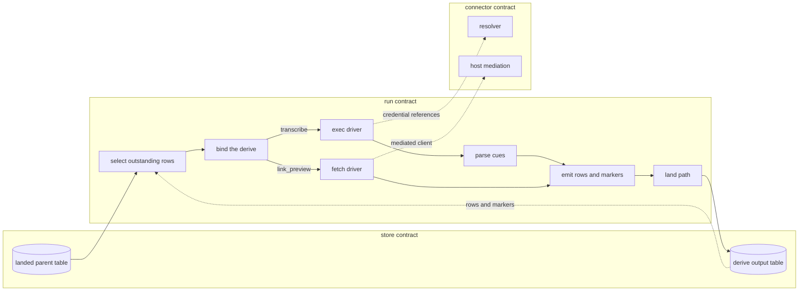
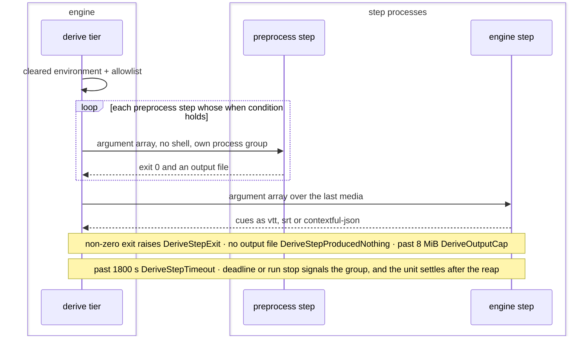
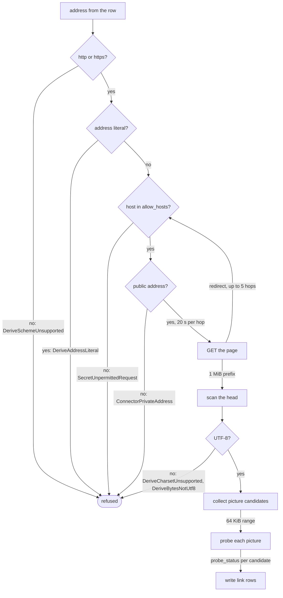
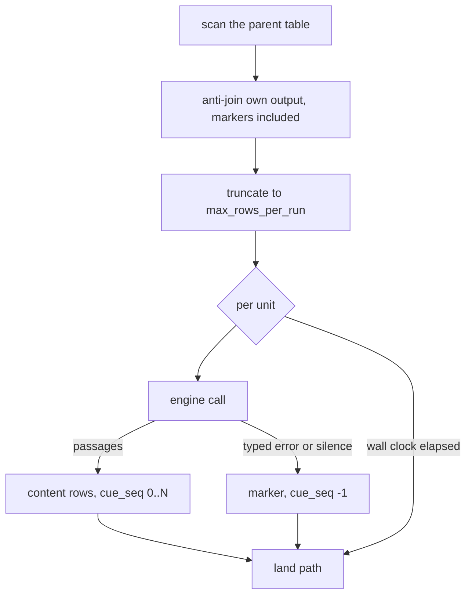

# The derive tier

Deferred per-row work over rows that already landed. One unit of media becomes many citable
passages; one landed link becomes a document's head facts and the pictures it advertises.
The tier reads the store, calls an engine the operator defined, and appends its answer to a
table of its own through the ordinary write path.

The derive tier between two tables, and the contracts it reaches through:



## select

The derive source: its configuration, the outstanding set recomputed each tick, eligibility and a run's budget.

- `required-key` — An absent or blank `engine`, `source_table`, `media_column` or `parent_id_column` raises `DeriveConfigKeyMissing`, naming the key and the pipeline.
  *A-run*
- `no-store-root` — A source built without a store root or without its pipeline id raises `DeriveNoStoreRoot`, naming which is absent.
  *A-run*
- `foreign-output-table` — The anti-join's pipeline id comes from the build alone; a config key naming another pipeline's output raises `DeriveForeignOutputTable`.
  *A-run*
- `rows-per-run` — `max_rows_per_run` truncates the outstanding list after the anti-join, at 25 rows by default; zero or below resolves to that default.
- `attempts-per-unit` — `max_attempts` allows 3 attempts per unit by default, and a non-positive spelling means the same figure.
- `seconds-per-run` — `max_seconds_per_run` bounds the serial unit loop at 300 s by default for `link_preview` and carries no default for `transcribe`.
- `incomplete-unit` — A parent row whose key or media column is null, empty or whitespace raises `DeriveUnitIncomplete`; the row is skipped and counted on the run record.
  *P4*
- `journaled-pull` — A derive pipeline configured to journal its pulls raises `DeriveJournaledPull`.
  *A-authority*
- `unmetered-grant` — `task` alone decides whether a derive pipeline reaches vendors; a `transcribe` pipeline declaring a shared-quota grant raises `DeriveUnmeteredGrant`.
  *A-connector*
- `metered-client` — A `link_preview` pipeline opening a socket outside the mediated client raises `DeriveMeteredClient`; every request it makes enters the run's request ledger.
  *A-connector*

unsettled: At what parent-table size does the in-memory scan stop fitting, and what replaces it? owner: derive affects: run.select

unsettled: Does a dry run print eligible, already-derived and outstanding counts before a scheduled tick pays for them? owner: derive affects: run.select

## bind

Where a derive engine's definition lives, the port every engine implements, and the values an engine returns.

- `unbound-engine` — An engine with no `[derive.<name>]` block raises `DeriveEngineUnbound`, naming the pipeline, the engine, the file to edit and every bound engine.
  *A-run*
- `command-in-manifest` — `command`, `preprocess`, `env` or `allow_hosts` inside `[pipeline.source.config]` raises `DeriveCommandInManifest`.
  *A-run*
- `unknown-task` — `task` is `transcribe`, the default, or `link_preview`; any other value raises `DeriveUnknownTask`, printing both.
  *A-run*
- `driver-mismatch` — `driver` is `exec` or `"none"` behind `transcribe` and `fetch` behind `link_preview`; any other pairing raises `DeriveDriverMismatch`.
  *A-run*
- `endpoint-host-bare` — An `endpoint_host` carrying a path, query, port or scheme raises `DeriveEndpointHostNotBare`.
  *A-run*
- `remote-url-unsupported` — An `http` or `https` media value for an engine declining remote addresses raises `DeriveRemoteUrlUnsupported`, naming the `when = "media_is_url"` preprocess step.
  *A-run*
- `media-unreadable` — A media value that is neither an address nor a readable local file raises `DeriveMediaUnreadable`, failing that unit alone.
  *A-run*
- `confidence-range` — A `confidence` outside `0.0..=1.0` after adapter normalization raises `DeriveConfidenceOutOfRange` and lands null.
  *A-run*
- `upstream-excerpt` — An `Upstream` excerpt holds at most 4 KiB and no request body.
- `engine-unavailable` — `EngineUnavailable` from a transcriber ends the run; from a `LinkReader` it raises `DeriveLinkEngineUnavailable` and costs that one unit.
  *P6*
- `advisory-zone` — A row zone taken from the binding's advisory `zone` key raises `DeriveAdvisoryZone`.
  *A-run*

unsettled: Does a build-time check refuse an engine whose declared locality is wider than the source table's admitted zones? owner: derive affects: run.bind

## exec

Operator-declared argv chains against local binaries: resolution, pinning, environment, bounds and identity.

- `shell-command` — `command` is an argument array run with no shell; a `command` given as one string raises `DeriveShellCommand`.
  *A-run*
- `env-name` — An allowlist name that is not ASCII alphanumeric or underscore, or that leads with a digit, raises `DeriveEnvNameInvalid`.
  *A-run*
- `chain-deadline` — `timeout_secs` bounds one unit's whole chain at 1800 s by default.
- `captured-output` — `max_output_bytes` bounds each step's captured standard output and error at 8 MiB by default.
- `audit-entries` — A chain contributes at most 64 entries of captured output to the run record.
- `step-error-excerpt` — A failing step's error text carries at most 4 KiB of its standard error.
- `non-zero-exit` — A step exiting non-zero raises `DeriveStepExit` carrying its bounded error text into the run audit.
  *A-run*
- `deadline-elapsed` — A chain outrunning its deadline raises `DeriveStepTimeout`, naming the running step.
  *A-run*
- `output-cap` — Output past the bound is counted and discarded, never buffered; crossing it kills the step and raises `DeriveOutputCap` with the byte count, draining continuing so the child never blocks.
  *A-run*
- `silent-step` — A preprocess step exiting zero without writing its output file raises `DeriveStepProducedNothing`.
  *A-run*
- `missing-binary` — A `command[0]` that is not an executable file on this machine raises `DeriveBinaryMissing`, naming the binary and the step.
  *A-connector*
- `unpinned-path` — A path-form `command[0]` without `sha256` raises `DeriveUnpinnedPath`, quoting the digest just computed; a bare search-path name carries none.
  *A-connector*
- `digest-mismatch` — A pinned file whose bytes differ from its recorded digest raises `DeriveDigestMismatch`.
  *A-connector*
- `engine-id` — An `exec` engine id reads `exec:<name>@<prefix>`, the prefix being 12 chars of lowercase hex over every step's binary digest and arguments.



unsettled: Does a vendor engine reached over HTTP need a deadline of its own, separate from the chain deadline? owner: derive affects: run.exec

## fetch

Following a link a third party wrote: host and address guards, redirects, the head scanner and the picture probe.

- `scheme` — An address whose scheme is neither `http` nor `https` raises `DeriveSchemeUnsupported` before any socket opens.
  *A-connector*
- `address-literal` — A host written as an address literal raises `DeriveAddressLiteral`.
  *A-connector*
- `redirect-chain` — A redirect chain runs to at most 5 hops.
- `binding-key` — `env`, `preprocess`, `engine` or `max_output_bytes` on a fetch binding raises `DeriveFetchBindingKey`, naming the key.
  *because a silently ignored key leaves an operator believing a fetch carries a credential or runs a process*
- `document-prefix` — `max_document_bytes` bounds the scanned document prefix at 1 MiB by default, dropping the remainder.
- `probe-prefix` — `max_probe_bytes` bounds one picture range request at 64 KiB by default.
- `hop-timeout` — `request_timeout_secs` bounds one hop at 20 s by default.
- `retry-after-default` — A `429` without a usable `Retry-After` maps to `RateLimited` carrying 60 s.
- `charset` — A declared character set other than UTF-8 raises `DeriveCharsetUnsupported`, naming the value.
  *A-connector*
- `not-utf8` — A document declaring no character set and failing UTF-8 validation raises `DeriveBytesNotUtf8`; a character split at the byte bound is tolerated.
  *A-connector*



## emit

The derived row and marker, the unit status, attempt accounting, citation keys and row provenance.

- `failure-off-table` — Per-unit failure state recorded outside the output table raises `DeriveFailureOffTable`.
  *A-run*
- `unit-status` — `unit_status` is `ok`, `empty` where the engine established nothing to derive, `unavailable` where it returned nothing and stated no reason, or `failed` on a typed error; any other value raises `DeriveUnitStatusUnknown`.
  *A-run*
- `reserved-discriminator` — A derive table declaring a column named `kind` raises `DeriveReservedDiscriminator`.
  *A-run*
- `settled-revived` — A settled unit re-entering the outstanding set raises `DeriveSettledUnitRevived`.
  *A-run*
- `attempts` — `attempts` is the prior count plus one; `unavailable` and `failed` stop at {{run.select.attempts-per-unit}}, and `empty` receives 1 attempts in total.
- `unredacted-error` — A non-null `last_error` write that has not passed address redaction raises `DeriveUnredactedError`.
  *A-authority*
- `primary-key` — A derive output table without `primary_key` `["unit_ref", "cue_seq"]` raises `DerivePrimaryKeyMissing`.
  *because a re-derived unit otherwise lands duplicate passages beside the originals*

unsettled: What validated domain does `_modality` carry, and which value does a passage derived from a video row take? owner: derive affects: run.emit

unsettled: What signal re-derives a unit whose parent row changed after it settled? owner: derive affects: run.emit

unsettled: What reaps derived rows whose parent row is deleted upstream? owner: derive affects: run.emit

## parse-cues

Reading a caption document into passages: one grammar, defect accounting, coalescing and rolling display.

- `backward-cue` — A block starting before the last accepted block raises `DeriveCueOutOfOrder` and is dropped.
  *P4*
- `passage-chars` — A passage stays open while it holds fewer than 600 chars.
- `passage-span` — A passage stays open while it spans less than 60 s.
- `passage-bytes` — One passage's text holds at most 8 KiB.
- `passages-per-document` — One document yields at most 2000 rows of passages.

## test-engine

Building one derive engine outside a pipeline and running it against one file.

- `unsupported-driver` — A `fetch` engine named to the verb raises `DeriveTestEngineUnsupported`.
  *because the verb drives a transcriber over media, and a link engine takes no media*

## Shapes

The machine half of two bindings, at the top level of `contextful.toml`:

```toml
[derive.local-asr]
driver           = "exec"
timeout_secs     = 1800
max_output_bytes = 8388608
zone             = "local:device"          # advisory; the adapter writes the row value

[[derive.local-asr.preprocess]]
when        = "engine_requires_pcm16_wav"
command     = ["ffmpeg", "-i", "{input}", "-ar", "16000", "-ac", "1", "{output}"]
output_path = "{output_stem}.wav"

[derive.local-asr.engine]
command       = ["speech-cli", "--model", "base", "--srt", "{input}"]
output_format = "srt"
output_path   = "{output_stem}.srt"

[derive.local-asr.env]
SPEECH_API_KEY = "${secret://speech-vendor}"

[derive.card-reader]
driver               = "fetch"
allow_hosts          = ["example.com", "*.example.com"]
allow_image_hosts    = ["*.cdn.example.net"]
request_timeout_secs = 20
```

One tick:


