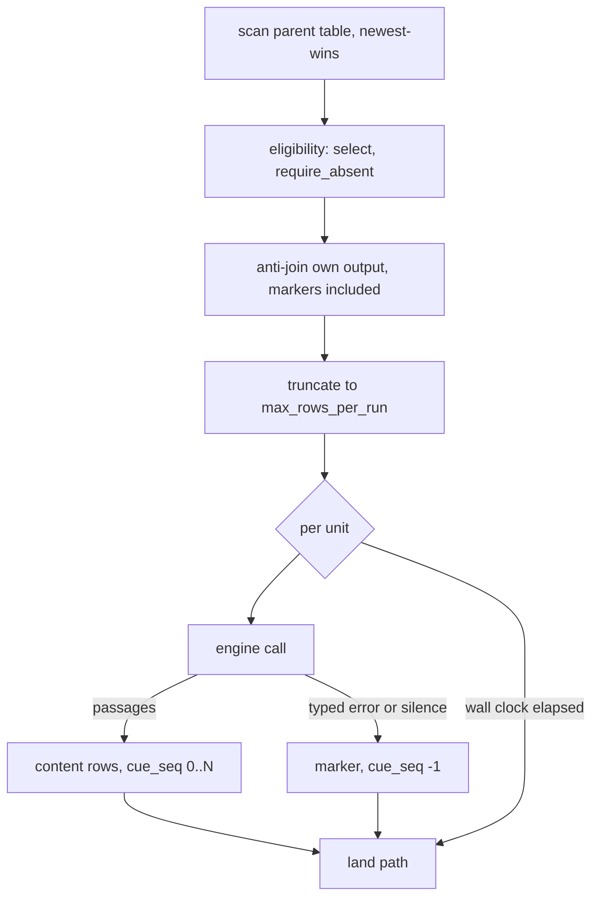

# The derive tier

Deferred per-row work over rows that already landed. One unit of media becomes many citable
passages; one landed link becomes a document's head facts and the pictures it advertises.
The tier reads the store, calls an engine the operator defined, and appends its answer to a
table of its own through the ordinary write path.

## select

| Clause | Statement | Why |
| --- | --- | --- |
| `run.select.derive-source` | `derive` is a built-in source reading the store: a pipeline sets `connector = "derive"`, points it at a landed table, and lands through {{run.land.stage-order}} unchanged. | — |
| `run.select.source-config` | `[pipeline.source.config]` carries `task`, `engine`, `source_table`, `media_column`, `parent_id_column`, `url_column`, `select`, `require_absent`, `media_is_image`, `max_rows_per_run`, `max_seconds_per_run` and `max_attempts`. | — |
| `run.select.required-key` | An absent or blank `engine`, `source_table`, `media_column` or `parent_id_column` raises `DeriveConfigKeyMissing`, naming the key and the pipeline. | A-run |
| `run.select.no-store-root` | A source built without a store root or without its pipeline id raises `DeriveNoStoreRoot`, naming which is absent. | A-run |
| `run.select.outstanding-set` | A parent row is a unit when its output table holds no row for it, marker rows included, at scan time; the cursor carries no position, so each tick recomputes the set. A never-created output table holds nothing. | A-run |
| `run.select.foreign-output-table` | The anti-join's pipeline id comes from the build alone; a config key naming another pipeline's output raises `DeriveForeignOutputTable`. | A-run |
| `run.select.rows-per-run` | `max_rows_per_run` truncates the outstanding list after the anti-join, at 25 rows by default; zero or below resolves to that default. | — |
| `run.select.attempts-per-unit` | `max_attempts` allows 3 attempts per unit by default, and a non-positive spelling means the same figure. | — |
| `run.select.seconds-per-run` | `max_seconds_per_run` bounds the serial unit loop at 300 s by default for `link_preview` and carries no default for `transcribe`. | — |
| `run.select.eligibility` | `select` maps columns to values matched by string equality, every entry required; `require_absent` names columns that are null, missing or whitespace on an eligible row. | — |
| `run.select.incomplete-unit` | A parent row whose key or media column is null, empty or whitespace raises `DeriveUnitIncomplete`; the row is skipped and counted on the run record. | P4 |
| `run.select.time-budget-stop` | Wall-clock exhaustion stops the run mid-list, records attempted against total, and emits the batches produced; the remainder stays outstanding. | — |
| `run.select.journaled-pull` | A derive pipeline configured to journal its pulls raises `DeriveJournaledPull`. | A-authority |
| `run.select.unmetered-grant` | `task` alone decides whether a derive pipeline reaches vendors; a `transcribe` pipeline declaring a shared-quota grant raises `DeriveUnmeteredGrant`. | A-connector |
| `run.select.metered-client` | A `link_preview` pipeline opening a socket outside the mediated client raises `DeriveMeteredClient`; every request it makes enters the run's request ledger. | A-connector |
| `run.select.egress-claim` | A `transcribe` pipeline states on the run record whether it reaches its engine in-process or through an operator-declared subprocess. | — |
| `run.select.in-memory-scan` | The scan reads the newest snapshot plus every run committed after it and deduplicates newest-wins per key in memory, with no query engine. | — |
| `run.select.work-record` | The work record carries the scanned, already-derived and skipped-incomplete counts and the truncated outstanding list. | — |

unsettled: At what parent-table size does the in-memory scan stop fitting, and what replaces it? owner: derive affects: run.select

unsettled: Does a dry run print eligible, already-derived and outstanding counts before a scheduled tick pays for them? owner: derive affects: run.select

## bind

| Clause | Statement | Why |
| --- | --- | --- |
| `run.bind.two-sided` | A pipeline names an engine; a `[derive.<name>]` block in the machine's own `contextful.toml` defines what it runs. A manifest from elsewhere introduces no command. | A-run |
| `run.bind.unbound-engine` | An engine with no `[derive.<name>]` block raises `DeriveEngineUnbound`, naming the pipeline, the engine, the file to edit and every bound engine. | A-run |
| `run.bind.command-in-manifest` | `command`, `preprocess`, `env` or `allow_hosts` inside `[pipeline.source.config]` raises `DeriveCommandInManifest`. | A-run |
| `run.bind.unknown-task` | `task` is `transcribe`, the default, or `link_preview`; any other value raises `DeriveUnknownTask`, printing both. | A-run |
| `run.bind.driver-mismatch` | `driver` is `exec` or `"none"` behind `transcribe` and `fetch` behind `link_preview`; any other pairing raises `DeriveDriverMismatch`. | A-run |
| `run.bind.inert-driver` | `driver = "none"` lands zero rows and one run-audit line naming the key to fill in. | — |
| `run.bind.deriver-port` | Every engine implements `Deriver`: `engine_id`, `endpoint_host`, `locality` and `run_audit`. `Transcriber` adds `capabilities()` and `transcribe`; `LinkReader` adds `capabilities()`, `read_link` and `unmetered_egress()`. | — |
| `run.bind.engine-id` | `engine_id` holds steady across runs of an unchanged engine and differs when its parts differ. | — |
| `run.bind.endpoint-host-bare` | An `endpoint_host` carrying a path, query, port or scheme raises `DeriveEndpointHostNotBare`. | A-run |
| `run.bind.run-audit-drains` | `run_audit` drains once per pull into the run record. | — |
| `run.bind.asr-capabilities` | `AsrCapabilities` carries `accepts_remote_url`, `max_upload_bytes`, `max_media_secs`, `max_processing_secs`, `cue_timestamps`, `diarization`, `language_detection` and `requires_pcm16_wav`, read once per run. | — |
| `run.bind.no-synthesized-timestamps` | An engine answering `cue_timestamps = false` has no interval interpolated on its behalf. | — |
| `run.bind.media-ref` | `MediaRef` is `LocalPath`, `Bytes` or `Url`; a `Url` reaches an engine only when it declares `accepts_remote_url` and the operator opted in. | — |
| `run.bind.remote-url-unsupported` | An `http` or `https` media value for an engine declining remote addresses raises `DeriveRemoteUrlUnsupported`, naming the `when = "media_is_url"` preprocess step. | A-run |
| `run.bind.media-unreadable` | A media value that is neither an address nor a readable local file raises `DeriveMediaUnreadable`, failing that unit alone. | A-run |
| `run.bind.transcript` | `Transcript` holds `text`, `cues` non-decreasing in `start_s`, `source`, `no_content_reason`, `detected_language` and `media_duration_s`; `no_content_reason` separates absent timing from absent speech. | — |
| `run.bind.cue` | A `Cue` is `start_s`, `end_s`, `text`, an optional `speaker` label opaque to one recording, and an optional `confidence`. | — |
| `run.bind.confidence-range` | A `confidence` outside `0.0..=1.0` after adapter normalization raises `DeriveConfidenceOutOfRange` and lands null. | A-run |
| `run.bind.transcript-source` | `TranscriptSource` is `published` or `asr`, defaulting to `asr` and parsing any other spelling as `asr`; the engine states it and the tier infers nothing. | — |
| `run.bind.derive-error` | `DeriveError` is `Unsupported`, `TooLarge`, `TranscodeRequired`, `Upstream`, `RateLimited`, `Timeout` or `EngineUnavailable`; `RateLimited`, `Timeout` and a 5xx `Upstream` retry, and the rest settle the unit. | — |
| `run.bind.upstream-excerpt` | An `Upstream` excerpt holds at most 4 KiB and no request body. | — |
| `run.bind.engine-unavailable` | `EngineUnavailable` from a transcriber ends the run; from a `LinkReader` it raises `DeriveLinkEngineUnavailable` and costs that one unit. | P6 |
| `run.bind.stub-transcriber` | A stub transcriber ships as a public adapter answering a canned transcript with no I/O, reporting `local:device` and host `stub.invalid`. | — |
| `run.bind.locality` | `Locality` is `OnDevice`, `OnDeviceWithPublicEgress`, `OnPrem` or `PublicCloud`, each mapping to one zone tag; the adapter's value lands on every row. | — |
| `run.bind.advisory-zone` | A row zone taken from the binding's advisory `zone` key raises `DeriveAdvisoryZone`. | A-run |
| `run.bind.public-egress-fails-closed` | The `OnDeviceWithPublicEgress` tag matches no zone allowlist entry until an operator adds it. | — |

unsettled: Does a build-time check refuse an engine whose declared locality is wider than the source table's admitted zones? owner: derive affects: run.bind

## exec

| Clause | Statement | Why |
| --- | --- | --- |
| `run.exec.chain-shape` | An `exec` engine is zero or more media-to-media preprocess steps followed by one media-to-cues engine step. | — |
| `run.exec.step-condition` | A preprocess step's `when` is `always`, the default, `media_is_url`, or `engine_requires_pcm16_wav`, the last read off the engine step's declared capability. | — |
| `run.exec.shell-command` | `command` is an argument array run with no shell; a `command` given as one string raises `DeriveShellCommand`. | A-run |
| `run.exec.placeholders` | `{input}`, `{input_url}`, `{output}` and `{output_stem}` substitute only as whole argument elements; `output_path` is a path template filled from scratch paths the engine created. | — |
| `run.exec.cleared-environment` | The child receives a cleared environment plus the operator's allowlist; a credential-reference value hydrates per unit and is not held on the engine between calls. | A-run |
| `run.exec.env-name` | An allowlist name that is not ASCII alphanumeric or underscore, or that leads with a digit, raises `DeriveEnvNameInvalid`. | A-run |
| `run.exec.reference-at-build` | A credential-reference template in the allowlist resolves at engine build, and an unresolved one fails the build as {{connector.resolve.unresolved-name}}. | — |
| `run.exec.chain-deadline` | `timeout_secs` bounds one unit's whole chain at 1800 s by default. | — |
| `run.exec.captured-output` | `max_output_bytes` bounds each step's captured standard output and error at 8 MiB by default. | — |
| `run.exec.audit-entries` | A chain contributes at most 64 entries of captured output to the run record. | — |
| `run.exec.step-error-excerpt` | A failing step's error text carries at most 4 KiB of its standard error. | — |
| `run.exec.scratch-directory` | Each unit runs in a scratch directory created for it and removed when the chain ends, however it ends. | — |
| `run.exec.non-zero-exit` | A step exiting non-zero raises `DeriveStepExit` carrying its bounded error text into the run audit. | A-run |
| `run.exec.deadline-elapsed` | A chain outrunning its deadline raises `DeriveStepTimeout`, naming the running step. | A-run |
| `run.exec.process-group-kill` | The child leads its own process group; the deadline and a run stop both signal the group, and the unit settles after the group is reaped. | because a surviving descendant keeps the resolved environment and spends the machine on a unit already settled |
| `run.exec.off-worker` | A subprocess wait occupies no async worker. | — |
| `run.exec.output-cap` | Output past the bound is counted and discarded, never buffered; crossing it kills the step and raises `DeriveOutputCap` with the byte count, draining continuing so the child never blocks. | A-run |
| `run.exec.silent-step` | A preprocess step exiting zero without writing its output file raises `DeriveStepProducedNothing`. | A-run |
| `run.exec.stderr-on-success` | Every step's error stream reaches the run record, whether the step succeeded or failed. | — |
| `run.exec.command-resolution` | `command[0]` resolves once at build, a path as written and a bare name through the search path, then is checked executable, canonicalized and digested. | — |
| `run.exec.missing-binary` | A `command[0]` that is not an executable file on this machine raises `DeriveBinaryMissing`, naming the binary and the step. | A-connector |
| `run.exec.unpinned-path` | A path-form `command[0]` without `sha256` raises `DeriveUnpinnedPath`, quoting the digest just computed; a bare search-path name carries none. | A-connector |
| `run.exec.digest-mismatch` | A pinned file whose bytes differ from its recorded digest raises `DeriveDigestMismatch`. | A-connector |
| `run.exec.engine-id` | An `exec` engine id reads `exec:<name>@<prefix>`, the prefix being 12 chars of lowercase hex over every step's binary digest and arguments. | — |
| `run.exec.no-endpoint-host` | An `exec` engine answers with no `endpoint_host`. | — |
| `run.exec.output-formats` | `output_format` is `vtt`, `srt` or `contextful-json`; with no `output_path` the engine step's cues come from its standard output. | — |
| `run.exec.provenance-sidecar` | An engine step may write a sidecar named from `{output_stem}` stating `transcript_source` and `no_content_reason`; an unparseable sidecar leaves the defaults and is noted on the run record. | — |

unsettled: Does a vendor engine reached over HTTP need a deadline of its own, separate from the chain deadline? owner: derive affects: run.exec

## fetch

| Clause | Statement | Why |
| --- | --- | --- |
| `run.fetch.allowlist` | A fetch engine reaches only hosts in `[derive.<name>].allow_hosts`, which is required, validated as {{connector.declare-capability.allowlist-shape}}, and may name several hosts. | because a fetch attaches no credential, so several hosts expose no bearer |
| `run.fetch.scheme` | An address whose scheme is neither `http` nor `https` raises `DeriveSchemeUnsupported` before any socket opens. | A-connector |
| `run.fetch.address-literal` | A host written as an address literal raises `DeriveAddressLiteral`. | A-connector |
| `run.fetch.host-not-listed` | An off-list host is {{connector.attach.unpermitted-request}}, and the unit records the name it was pointed at. | — |
| `run.fetch.resolved-address` | A listed host resolves under {{connector.attach.resolve-once}}, and an internal address it resolves to is {{connector.attach.private-address}}. | because a publisher controlling a listed name's DNS otherwise reaches the machine's own network |
| `run.fetch.guard-cost` | Each pre-socket refusal settles its unit permanently, costs no request, and lets the run continue. | — |
| `run.fetch.per-hop` | Every redirect hop re-applies the host list and {{run.fetch.resolved-address}}. A hop to another listed host is followed; a TLS-to-cleartext hop fails as {{connector.attach.weakened-hop}} states for its transport arm. | because a fetch attaches no credential, so a listed second host exposes no bearer |
| `run.fetch.redirect-chain` | A redirect chain runs to at most 5 hops. | — |
| `run.fetch.no-proxy` | The client bypasses the system proxy, and the Referer header follows {{connector.attach.referer-off}}. | — |
| `run.fetch.binding-key` | `env`, `preprocess`, `engine` or `max_output_bytes` on a fetch binding raises `DeriveFetchBindingKey`, naming the key. | because a silently ignored key leaves an operator believing a fetch carries a credential or runs a process |
| `run.fetch.document-prefix` | `max_document_bytes` bounds the scanned document prefix at 1 MiB by default, dropping the remainder. | — |
| `run.fetch.probe-prefix` | `max_probe_bytes` bounds one picture range request at 64 KiB by default. | — |
| `run.fetch.hop-timeout` | `request_timeout_secs` bounds one hop at 20 s by default. | — |
| `run.fetch.retry-after-default` | A `429` without a usable `Retry-After` maps to `RateLimited` carrying 60 s. | — |
| `run.fetch.head-scanner` | The scanner reads the prefix up to the closing head element or the first body element, skipping script and style bodies; its tokenizer behavior is pinned by fixture tests. | — |
| `run.fetch.head-facts` | Pictures come from `og:image:secure_url`, `og:image:url`, `og:image`, `twitter:image`, `twitter:image:src` and `link[rel=image_src]`; `title`, `description` and `site_name` fall back through their `og:`, `twitter:` and document elements. | — |
| `run.fetch.candidates` | Every picture declaration lands as its own candidate row at sequence `0` upward with the head facts repeated, one absolute address landing once, its declaring element in `image_field`. | — |
| `run.fetch.absent-not-blank` | A head fact resolving to nothing is absent, never an empty string. | — |
| `run.fetch.charset` | A declared character set other than UTF-8 raises `DeriveCharsetUnsupported`, naming the value. | A-connector |
| `run.fetch.not-utf8` | A document declaring no character set and failing UTF-8 validation raises `DeriveBytesNotUtf8`; a character split at the byte bound is tolerated. | A-connector |
| `run.fetch.link-row` | A link row carries the shared envelope plus `link_title`, `link_description`, `link_site_name`, `link_final_url`, `image_url`, `image_field`, `image_width`, `image_height`, `image_bytes`, `image_content_type`, `probe_status` and `probe_error`. | — |
| `run.fetch.status-positive` | A head naming a picture lands `ok`; a 2xx head naming none, a `404` and a `410` land `empty` and settled. | — |
| `run.fetch.status-negative` | A 5xx, a timeout, a rate limit, a transport failure and a redirect stopped at the list land `failed` and retryable; a pre-socket or character-set refusal and any other 4xx land `failed` and settled. | — |
| `run.fetch.no-http-answer` | A name-resolution failure, a refused connection and a declined hop report internal status `599`, inside the retryable band. | — |
| `run.fetch.probe-never-fails-the-unit` | A picture probe records its own status and reason and leaves the unit's status to the document. | — |
| `run.fetch.image-hosts` | `allow_image_hosts` defaults to `allow_hosts`. | — |
| `run.fetch.probed-length` | `image_bytes` is the file's full length, not the probed prefix's; dimensions land null when the prefix is too short to read them. | — |
| `run.fetch.document-host` | A link row's endpoint host is the document's final host after redirects. | — |
| `run.fetch.media-is-image` | `media_is_image = true` reads the row's column as a picture address: one candidate with `image_field` set to `row`, no document hop, the probe the whole of the work. | — |

## emit

| Clause | Statement | Why |
| --- | --- | --- |
| `run.emit.derived-row` | A transcribe row carries `unit_ref`, `cue_seq`, `unit_status`, `segment_id`, `body`, `start_s`, `end_s`, `url`, `transcript_source`, `derive_engine`, `derive_endpoint_host`, `derive_zone`, `confidence`, `attempts`, `last_error`, `retryable` and `_modality`. | — |
| `run.emit.marker-row` | A unit producing nothing lands one marker at `cue_seq = -1` carrying `unit_status`, `attempts`, `last_error` and `retryable`, its text, instants and `transcript_source` null; one builder produces content and marker rows. | — |
| `run.emit.failure-off-table` | Per-unit failure state recorded outside the output table raises `DeriveFailureOffTable`. | A-run |
| `run.emit.unit-status` | `unit_status` is `ok`, `empty` where the engine established nothing to derive, `unavailable` where it returned nothing and stated no reason, or `failed` on a typed error; any other value raises `DeriveUnitStatusUnknown`. | A-run |
| `run.emit.reserved-discriminator` | A derive table declaring a column named `kind` raises `DeriveReservedDiscriminator`. | A-run |
| `run.emit.retryable` | `retryable` is null on a content row; on a marker `false` means settled, and a missing value reads unsettled. | — |
| `run.emit.settled-revived` | A settled unit re-entering the outstanding set raises `DeriveSettledUnitRevived`. | A-run |
| `run.emit.attempts` | `attempts` is the prior count plus one; `unavailable` and `failed` stop at {{run.select.attempts-per-unit}}, and `empty` receives 1 attempts in total. | — |
| `run.emit.marker-fold` | Among several markers for one unit, status and permanence come from the highest attempt count, a tie resolving toward settled. | — |
| `run.emit.citation-keys` | `start_s` and `end_s` are whole seconds; `segment_id` is `<unit_ref>#t=<start_s>`; `url` is the parent's link with that fragment, else the media value. | — |
| `run.emit.keys-union` | The citation key equals the one a feed source lands for the same moment, so a later published transcript unions onto it. | — |
| `run.emit.link-segment-key` | A link row's `segment_id` is `<unit_ref>#img=<cue_seq>` and its `_modality` is `link`. | — |
| `run.emit.unredacted-error` | A non-null `last_error` write that has not passed address redaction raises `DeriveUnredactedError`. | A-authority |
| `run.emit.primary-key` | A derive output table without `primary_key` `["unit_ref", "cue_seq"]` raises `DerivePrimaryKeyMissing`. | because a re-derived unit otherwise lands duplicate passages beside the originals |
| `run.emit.provenance` | `derive_engine`, `derive_endpoint_host` and `derive_zone` land on every row the tier writes, markers included. | — |

unsettled: What validated domain does `_modality` carry, and which value does a passage derived from a video row take? owner: derive affects: run.emit

unsettled: What signal re-derives a unit whose parent row changed after it settled? owner: derive affects: run.emit

unsettled: What reaps derived rows whose parent row is deleted upstream? owner: derive affects: run.emit

## parse-cues

| Clause | Statement | Why |
| --- | --- | --- |
| `run.parse-cues.one-parser` | WebVTT and SubRip reach one parser: blocks separated by blank lines, each carrying one timing line and its text, line endings normalized once at entry. | — |
| `run.parse-cues.defects-degrade` | A block with unparseable timing, an end before its start, or empty text is skipped and counted, and the caller warns once with the count. | — |
| `run.parse-cues.backward-cue` | A block starting before the last accepted block raises `DeriveCueOutOfOrder` and is dropped. | P4 |
| `run.parse-cues.passage-chars` | A passage stays open while it holds fewer than 600 chars. | — |
| `run.parse-cues.passage-span` | A passage stays open while it spans less than 60 s. | — |
| `run.parse-cues.passage-bytes` | One passage's text holds at most 8 KiB. | — |
| `run.parse-cues.passages-per-document` | One document yields at most 2000 rows of passages. | — |
| `run.parse-cues.rolling-overlap` | The parser strips the longest whole-word suffix of the previous cue that prefixes the current one, when the cues are contiguous and the overlap covers the whole cue or two words or more. | — |

## test-engine

| Clause | Statement | Why |
| --- | --- | --- |
| `run.test-engine.single-file` | `contextful derive test <engine> --media <file>` builds the engine through the binding, search path, pins and allowlist a pipeline resolves, runs it on one file, and prints the transcript and each step error stream, writing nothing and reads no store. | — |
| `run.test-engine.json-output` | `--json` emits one object carrying the engine id, the zone, the cue-timestamp capability, both engine claims, the text and the cues. | — |
| `run.test-engine.unsupported-driver` | A `fetch` engine named to the verb raises `DeriveTestEngineUnsupported`. | because the verb drives a transcriber over media, and a link engine takes no media |

## Shapes

The machine half of two bindings, at the top level of `contextful.toml`:

```toml
[derive.local-asr]
driver           = "exec"
timeout_secs     = 1800
max_output_bytes = 8388608
zone             = "local:device"          # advisory; the adapter writes the row value

[[derive.local-asr.preprocess]]
when        = "engine_requires_pcm16_wav"
command     = ["ffmpeg", "-i", "{input}", "-ar", "16000", "-ac", "1", "{output}"]
output_path = "{output_stem}.wav"

[derive.local-asr.engine]
command       = ["speech-cli", "--model", "base", "--srt", "{input}"]
output_format = "srt"
output_path   = "{output_stem}.srt"

[derive.local-asr.env]
SPEECH_API_KEY = "${secret://speech-vendor}"

[derive.card-reader]
driver               = "fetch"
allow_hosts          = ["example.com", "*.example.com"]
allow_image_hosts    = ["*.cdn.example.net"]
request_timeout_secs = 20
```

One tick:


