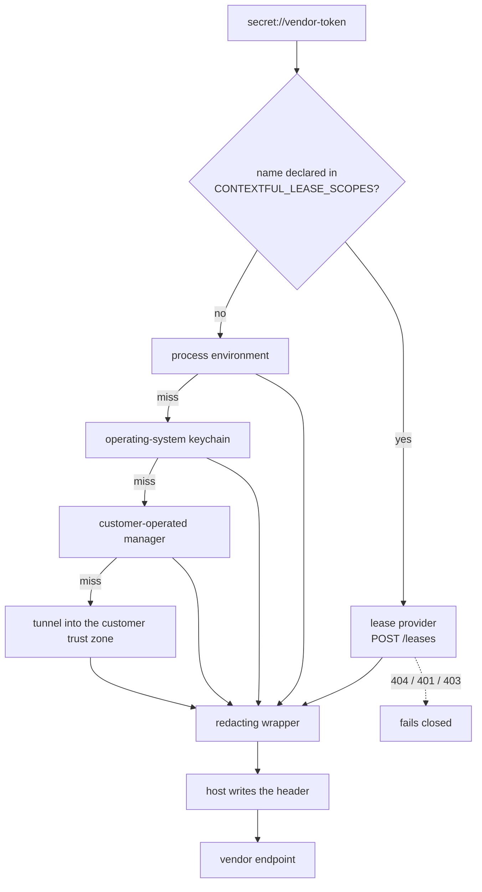
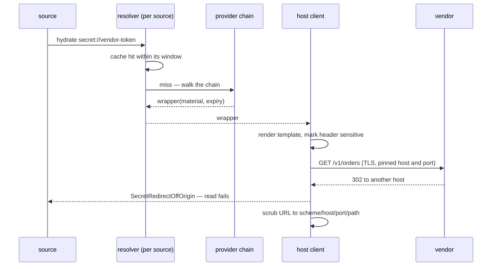

# Outbound credentials

An outbound credential is the material that reaches a vendor API from a pull, a derive step
or a metered call. This contract covers how a declaration names one, how a resolver finds
it, how a run-time lease shortens its life, how the host puts it on a request, how it turns
over, and what an operator writes down about it.

## Parties

| Party | Obligation |
| --- | --- |
| **The declaration author** | Binds every credential by reference, gives a credential-bearing source one exact host, and commits a file that carries no material. |
| **The operator** | Picks the backend, declares which logical names lease, provisions the mint credential, and keeps each record's grants, covered scope, creation date and expiry true. |
| **The host** | Resolves at the moment of use, keeps material inside a redacting wrapper, puts it on a permitted request, and strips authorization out of every URL a diagnostic renders. |
| **The lease provider** | Answers a scoped mint with material and one expiry over a confidential transport, and answers an unknown scope with a failure rather than a fall-through. |
| **The credential backend** | Holds opaque versioned ciphertext under a logical name and carries no provider know-how. |
| **The connector** | Carries the vendor's auth policy, its rotation function and its error vocabulary, pinned by connector id and version. |

## Operations

| Operation | What it governs |
| --- | --- |
| `reference` | The two credential planes, the `secret://` scheme, the template grammar and its parse errors. |
| `resolve` | The provider port, the chain and its precedence, hydration timing, the redacting wrapper, and the decoupling postures. |
| `lease` | The declaration-scoped lease provider at the head of the chain: its endpoint, its expiry, its failure classes and its bootstrap. |
| `attach` | Host mediation of an outbound request: the bound host, the header template, redirect and landed-origin pinning, and URL scrubbing. |
| `rotate` | The division of labor on refresh, the four rotation mechanisms, and the know-how a backend does not hold. |
| `record` | The operator-facing record of a credential — its grants, its covered scope, its dates — and the provider attribution a run emits. |

## Clauses — reference

A declaration names a credential; it does not hold one. Declared environment names are the
connector contract's subject in `spec/32-connector.md` § Capability declaration, where a
name a connector lists arrives as a value the host injects.

| Clause | Statement | decided-by |
| --- | --- | --- |
| `secret.reference.invariant.credential-plane` | Outbound credential material forms a plane of its own, with its own threat model, its own owner and its own turnover cadence, separate from the plane that admits a caller into a store. One mechanism never serves both. | |
| `secret.reference.invariant.plane-crossing` | A key whose use is inbound keeps that use when the outbound backend holds its bytes; storage location never transfers a key between the two planes. | |
| `secret.reference.invariant.declaration-binds-a-reference` | A declaration lists the credential names it needs in its capability block and binds each to a `secret://<name>` reference resolved at run time. The file that results is safe to commit and safe to read. | |
| `secret.reference.shape.reference-scheme` | `secret://<name>` carries a stable logical name matching `[a-z0-9-]+`. The resolver maps that name onto a backend location; the reference itself is never a storage path, a file name or a key identifier. | |
| `secret.reference.limit.name-length` | A logical name holds at most 128 chars. | |
| `secret.reference.invariant.backend-independence` | Moving a deployment between credential stores re-points the backend and edits no declaration, as the mapping from logical name to storage lives in the adapter. | |
| `secret.reference.interface.value-template` | Where a value embeds a credential rather than being one whole, the declaration carries a template of literal text with `${secret://<name>}` placeholders, so `Bearer ${secret://vendor-token}` composes with no code. | |
| `secret.reference.refusal.foreign-placeholder` | `${env://NAME}` inside a template, and a bare `${NAME}`, raise `SecretForeignPlaceholder` at parse, naming the value and the offending span. | `0130` |
| `secret.reference.refusal.malformed-placeholder` | An unclosed, empty or nested placeholder raises `SecretMalformedTemplate` while the declaration is being read, ahead of any text leaving the process. | `0130` |
| `secret.reference.refusal.environment-is-a-miss` | Template hydration treats the process-environment provider as a miss and continues down the chain; a name no later provider answers raises `SecretUnresolvedReference` naming the reference. No template author reads arbitrary process environment onto an outbound request. | `0130` |
| `secret.reference.interface.environment-opt-in` | `CONTEXTFUL_SECRETS_ALLOW_ENV_TEMPLATES=1` re-admits the environment provider to template hydration and emits one warning per process naming the variable and the access it re-opens. | |
| `secret.reference.interface.whole-value-binding` | `env://NAME` binds a whole credential outside the template grammar, for a value that is a credential and nothing else. | |
| `secret.reference.refusal.material-in-a-declaration` | A credential-shaped literal standing where a reference belongs raises `SecretMaterialInDeclaration` at validation, naming the key. | `0131` |
| `secret.reference.invariant.lease-has-no-scheme` | A leased credential binds as `secret://<name>` like any other. The manifest grammar carries no lease spelling, and moving one credential between stored bytes and a run-time mint is a backend re-point in either direction. | |
| `secret.reference.shape.name-is-the-join` | The logical name is the one join between a declaration, a provider entry, a cache key, a record and a run's provider attribution. | |

## Clauses — resolve

The resolver stands between a reference and a request. A worker that runs a step elsewhere
meets this boundary in `spec/50-control-plane.md` § Worker adapter, where a dispatched
worker receives a reference and hydrates it on its own side.

| Clause | Statement | decided-by |
| --- | --- | --- |
| `secret.resolve.interface.provider-port` | One port answers a reference with material. Every backend is an adapter behind it, and `CONTEXTFUL_SECRETS_BACKEND` selects which adapters the chain assembles. | |
| `secret.resolve.shape.provider-chain` | The assembled order runs: declaration-scoped lease provider, process environment, operating-system keychain, customer-operated manager (a cloud secret store, a self-hosted vault, or a customer-deployed encrypting worker), then a tunnel into the customer trust zone where the orchestrator sees no material. | |
| `secret.resolve.invariant.first-hit-wins` | Hydration stops at the earliest adapter answering the name, and adapters after it are not consulted for that reference during the run. | |
| `secret.resolve.invariant.hydration-is-just-in-time` | Material enters the process at the moment a request is being built, per read. Neither the declaration, the run journal nor a log line carries a hydrated value. | |
| `secret.resolve.invariant.redacting-wrapper` | Every hydrated credential rides a wrapper whose debug and display forms print a fixed sentinel. The bytes are revealed at one point: where the host writes them onto the request. | |
| `secret.resolve.invariant.literal-template-wraps` | A template of pure literal text hydrates into that same wrapper, so a value's handling never depends on whether the author embedded a reference. | |
| `secret.resolve.invariant.resolver-per-source` | One resolver is built per source, each with its own cache. Repeat hydrations inside a resolver hit that cache, and concurrent first hydrations of one name collapse under a single-flight gate. | |
| `secret.resolve.limit.cache-ttl` | A cache entry lives at most 300 s. | |
| `secret.resolve.refusal.unresolved-name` | A reference no assembled adapter answers fails the source at preflight where the binding is known statically, and fails the call otherwise, raising `SecretUnresolvedReference`. | `0130` |
| `secret.resolve.invariant.no-ambient-authority` | The credential plane holds no ambient authority. {{connector.declare-capability.invariant.ambient-authority}} Resistance to a confused deputy holds while every path that reaches a vendor goes through mediation. | |
| `secret.resolve.shape.decoupling-posture` | Four postures order how far material sits from the engine: inline environment credentials, plaintext at rest at the call site, for development; reference plus just-in-time hydration, plaintext held in the host process; an external manager read through the runtime's own workload identity, where the engine keeps references and no standing credential to the store; and a secretless broker sidecar, where the engine dispatches intent and the sidecar puts the credential on the request inside the customer boundary. | |
| `secret.resolve.invariant.default-posture` | The external manager read through workload identity is the posture a deployment gets with no further choice. The broker posture serves regulated and high-assurance deployments, and covers every deployment where a hosted control-plane component sits in the request path. | |
| `secret.resolve.refusal.inline-outside-development` | A profile other than development binding plaintext material at a call site raises `SecretInlineCredential` naming the binding. | `0132` |
| `secret.resolve.invariant.lease-is-the-reversed-manager` | A lease provider is the external-manager posture with the trust direction reversed — the engine asks for a short-lived grant rather than reading a stored one — and occupies no posture of its own. | |
| `secret.resolve.refusal.forwarding-sidecar` | A sidecar that reads a stored long-lived credential and forwards it outward raises `SecretForwardingBroker` at any distance. A sidecar that mints, exchanges or signs a short-lived scoped credential is a lease provider and stands. | `0133` |
| `secret.resolve.invariant.platform-binding-is-a-broker` | A deployment whose credential store answers on a platform-internal binding alone is a broker deployment, and every broker obligation binds it. | |
| `secret.resolve.invariant.adapter-is-optional` | Each managed backend is one adapter holding opaque ciphertext. The chain and the postures stand with no particular adapter present, and a deployment running on one manager links none of the others. | |
| `secret.resolve.refusal.know-how-in-an-adapter` | An adapter exposing a provider-specific exchange, refresh or lifetime entry point raises `SecretProviderKnowHowInBackend` at load. | `0134` |

## Clauses — lease

A run-time lease is material with a clock on it. The provider that mints one leads the
chain for the names an operator declares.

| Clause | Statement | decided-by |
| --- | --- | --- |
| `secret.lease.interface.scope-declaration` | `CONTEXTFUL_LEASE_SCOPES` lists the logical names that hydrate as run-time leases, each optionally as `name=scope` where the minted scope differs from the name. | |
| `secret.lease.invariant.head-of-chain` | For a declared name the lease provider answers and no adapter behind it is reached, whatever the ordinary precedence gives. Falling through on a declared name is not available to it. | |
| `secret.lease.refusal.shadowed-name` | An adapter behind the lease provider that also answers a declared name raises `SecretLeaseShadowed` at first hydration, naming the logical name and the adapter that shadowed it. | `0135` |
| `secret.lease.invariant.undeclared-name-defers` | An undeclared name leaves the lease provider with no outbound request at all, so precedence among the remaining adapters is untouched by the lease posture being on. | |
| `secret.lease.refusal.empty-scope-set` | Selecting the lease backend while declaring no scope raises `SecretLeaseScopesEmpty` as a configuration fault at startup. | `0135` |
| `secret.lease.shape.lease` | A lease is credential material plus one expiry, held as a pair for the length of the run. | |
| `secret.lease.refusal.malformed-lease` | A lease carrying no declared expiry, and one whose expiry has passed on arrival, raise `SecretMalformedLease` and count as transient. | `0136` |
| `secret.lease.invariant.cache-window` | A leased name's cache entry is bounded by the tighter of {{secret.resolve.limit.cache-ttl}} and the lease's own expiry. | |
| `secret.lease.limit.retirement-margin` | An entry retires 10 percent of its window ahead of nominal expiry, that margin capped at 30 s, so a request sent near the boundary still reaches the vendor inside the grant. | |
| `secret.lease.interface.endpoint` | The provider answers `POST <provider-url>/leases` carrying a bearer mint credential, with body `{ "scope": "<lease scope>" }`. | |
| `secret.lease.shape.response` | A success carries `value` plus one expiry field — `expires_in` in seconds, `expires_at` as epoch seconds, or an RFC 3339 instant — at the top level or under a `lease` object. The relative form needs no clock agreement between provider and engine. | |
| `secret.lease.refusal.unknown-scope` | A `404` raises `SecretLeaseScopeUnknown` and fails closed as a configuration fault; a declared name reaching a stored credential by fall-through is not among the outcomes. | `0135` |
| `secret.lease.refusal.mint-rejected` | A `401` or `403` raises `SecretMintRejected`, classed `auth_expired`, with no retry attempted. | `0136` |
| `secret.lease.interface.rate-limited` | A `429` carries its `Retry-After` value into the engine's run-level retry, classed `rate_limited`. | |
| `secret.lease.refusal.request-rejected` | Any other `4xx` raises `SecretLeaseRequestRejected` as a permanent configuration fault. | `0136` |
| `secret.lease.invariant.transient-class` | A `5xx` answer and a transport error are transient, and the engine's retry schedule governs what happens next. | |
| `secret.lease.limit.retry-attempts` | `CONTEXTFUL_LEASE_MAX_ATTEMPTS` bounds mint retries at 3 attempts by default. | |
| `secret.lease.limit.retry-backoff` | Backoff grows exponentially from `CONTEXTFUL_LEASE_RETRY_BACKOFF_MS`, 250 ms by default, to a ceiling of 30 s, and covers the transient class alone. | |
| `secret.lease.limit.vendor-requests-on-failure` | A run holding an expired cached lease whose provider is unreachable issues 0 requests at the vendor; the failure surfaces at the provider hop. | |
| `secret.lease.invariant.bootstrap-credential` | The engine authenticates to the mint endpoint with one standing credential, itself a `secret://` reference, scoped to minting and granting no vendor access. That credential is the deployment's whole standing surface, and revoking it severs every leased source at the next expiry. | |
| `secret.lease.invariant.bootstrap-non-recursion` | The lease provider holds a handle to the chain as assembled before it joined, so the mint reference hydrates through adapters behind it by construction rather than by convention. | |
| `secret.lease.refusal.bootstrap-unserved` | A bootstrap name no adapter behind the lease provider answers raises `SecretBootstrapUnresolved`, naming the reference, rather than falling through as an ordinary miss. | `0137` |
| `secret.lease.refusal.bootstrap-declared-leased` | Listing the bootstrap name among the leased scopes raises `SecretBootstrapLeased` at startup. | `0137` |
| `secret.lease.interface.bootstrap-backend` | `CONTEXTFUL_LEASE_BOOTSTRAP_BACKEND` composes a customer-operated manager behind the lease provider, so the mint reference needs neither an environment variable nor a keychain entry. | |
| `secret.lease.limit.calls-per-resolver` | A resolver is bounded at 1 calls against the mint endpoint per declared name per lease window, so a deployment sizes that endpoint at sources-binding-the-name × ⌈run duration ÷ lease window⌉. | |
| `secret.lease.invariant.transport` | The mint endpoint is reached over TLS or loopback. | |
| `secret.lease.refusal.redirect` | The mint client follows no redirect; a `3xx` answer raises `SecretLeaseRedirect` and the mint credential is not replayed at the named target. | `0138` |
| `secret.lease.invariant.proxy-ignored` | The mint client ignores any system proxy configuration. | |
| `secret.lease.invariant.residency` | Leased material lives in memory for the run, is evicted at expiry, and enters no file, no journal entry and no audit record. | |

unsettled: Does one mint call answer several scopes at once for a run that binds many leased names? owner: secret affects: secret.lease

## Clauses — attach

The host, not the connector, puts a credential on a request. An exec step's child
environment is built from an operator allowlist in `spec/34-derive.md` § Exec driver, and a
template inside that allowlist hydrates through this same chain.

| Clause | Statement | decided-by |
| --- | --- | --- |
| `secret.attach.invariant.host-mediation` | The host implements the outbound HTTP interface itself. Every request is checked against the declaration ahead of any socket work, and the host writes the bound credential onto a permitted request. | |
| `secret.attach.invariant.no-material-to-a-guest` | No host import hands credential bytes to guest code; a guest names the request and receives a response. | |
| `secret.attach.refusal.unpermitted-request` | A request whose destination the declaration does not cover raises `SecretUnpermittedRequest` and fails the guest call loudly, surfacing even where guest code discards the error. | `0139` |
| `secret.attach.refusal.bound-host` | A source binding any credential carries one non-wildcard host, checked when the declaration is validated and again when the session opens; a wildcard entry alongside a bound credential raises `SecretWildcardHost`. A source binding no credential keeps wildcard entries. | `0139` |
| `secret.attach.interface.default-attachment` | With no further declaration the host writes `Authorization: Bearer <value>` using the single bound credential. | |
| `secret.attach.interface.attach-block` | An `[attach]` block maps a header name to a value template in the reference grammar. The host hydrates it and writes it onto the permitted request, overriding whatever the guest supplied for that header name. | |
| `secret.attach.refusal.literal-attach-value` | An attach value embedding no reference raises `SecretLiteralAttachValue`; a constant header belongs in the guest's own request construction. | `0140` |
| `secret.attach.invariant.redirect-pinning` | Every source, credential-bearing or not, follows a hop whose next URL keeps the configured host and port on the same transport or a stronger one. A move from cleartext to TLS at that same host and port is followed. | |
| `secret.attach.refusal.weakened-hop` | A hop from a TLS base to a cleartext URL, and a hop naming any other host or port, raise `SecretRedirectOffOrigin`: the redirect status becomes the response and the read fails. | `0141` |
| `secret.attach.invariant.landed-origin` | The origin answering the request whose body lands equals the configured host and port, so a column's contents and the address an operator declared cannot come apart. | |
| `secret.attach.invariant.referer-off` | `Referer` is off on every outbound client, keeping a previous URL and its query string off a followed hop. | |
| `secret.attach.invariant.header-presence-selects-the-client` | Declaring any header selects the hardened client and bypasses the system proxy; a source declaring none keeps the proxy. The test reads header presence rather than the spelling of a value, covering a token pasted inline as well as a hydrated one. | |
| `secret.attach.refusal.cleartext-endpoint` | A header whose value hydrates from a reference is marked sensitive and raises `SecretCleartextEndpoint` against a cleartext endpoint, with loopback exempt in its IPv4 and IPv6 forms. | `0142` |
| `secret.attach.invariant.sensitive-header-record` | A run records which header names carried a credential, by name and never by value. | |
| `secret.attach.invariant.url-scrubbing` | A URL reaching an error message, a log line or a landed column carries scheme, host, port and path. Query, fragment and userinfo are dropped, each being a place an endpoint carries its authorization. | |
| `secret.attach.invariant.typed-url-edit` | Metered vendor traffic and control-plane traffic each dispatch through one client whose error mapping clears the URL as a typed edit ahead of rendering. A URL arriving by another route is scrubbed as text under the same rule. | |
| `secret.attach.refusal.credential-in-a-url` | A configured endpoint carrying userinfo raises `SecretCredentialInUrl` at validation, naming the source. | `0143` |
| `secret.attach.invariant.scrubbed-pages-read-alike` | Two failures at different pages of one walk render identically from a scrubbed URL; the run record's page fields carry the distinction a reader needs. | |
| `secret.attach.invariant.mediation-covers-every-egress` | Every path that reaches a vendor — a built-in source, a guest connector, a limiter call, an exec step — attaches through the mediated path, so no second attachment point exists to reason about. | |

## Clauses — rotate

Turnover divides between a store that holds bytes and a connector that knows what those
bytes mean. Issuer key custody travels through the signing port in `spec/40-authority.md`
§ Custody, where the key behind an inbound credential turns over on its own cadence.

| Clause | Statement | decided-by |
| --- | --- | --- |
| `secret.rotate.invariant.division-of-labor` | The host drives the OAuth loop from the connector's declared auth policy and writes the resulting token into the customer's manager as a blind versioned put. The manager learns neither the provider nor the lifetime. | |
| `secret.rotate.invariant.store-holds-storage-and-trigger` | A credential store contributes versioned storage plus a trigger; the function that performs an exchange is connector code. | |
| `secret.rotate.interface.expiry-hint` | The host may place an opaque `expires_at` hint beside the ciphertext for cache invalidation — a number the host supplied, not a lifetime the store read. | |
| `secret.rotate.workflow.static-key` | A static key in a customer manager turns over with no engine step: each run hydrates the current version behind {{secret.resolve.limit.cache-ttl}}, and a version written by an operator is picked up at the next miss. | |
| `secret.rotate.workflow.oauth-credential` | An OAuth credential refreshes ahead of its declared expiry rather than waiting for a rejected vendor call, writes the new version back into the customer's manager, and clears that name's cache entry in the same step. | |
| `secret.rotate.workflow.operator-entered` | A development or keychain secret is re-entered by an operator, who updates what the reference points at rather than editing a value the engine holds. | |
| `secret.rotate.workflow.leased-credential` | A leased credential re-mints ahead of its window with no write-back anywhere, and a re-mint that fails leaves the source with no credential rather than an older one. | |
| `secret.rotate.refusal.write-back-denied` | A manager refusing the versioned put raises `SecretRotationWriteDenied`, and the run fails closed rather than continuing on the superseded version. | `0144` |
| `secret.rotate.invariant.backend-stores-bytes` | A credential backend holds opaque versioned ciphertext under a logical name and nothing else. | |
| `secret.rotate.invariant.connector-owns-meaning` | Token lifetime and exchange rules, the refresh endpoint and its scopes, expired-token error codes, rate-limit headers, in-flight caps, retry policy, pagination and cursor kind live in the connector's `[auth]`, `[rate_limit]` and `[retry]` blocks and its code, pinned by connector id and version. | |
| `secret.rotate.invariant.vendor-change-is-a-version-bump` | A vendor changing a lifetime, an error code or a rate-limit header is answered by a connector version bump; no credential-store redeploy is involved. | |
| `secret.rotate.invariant.no-master-key` | The engine holds references, and no single encryption key exists whose theft together with a database copy yields every credential. What a deployment protects instead is its own store's key material, inside its own account. | |
| `secret.rotate.invariant.turnover-preserves-the-name` | Every mechanism leaves the logical name unchanged, so a rotation touches no declaration and invalidates no pinned connector artifact. | |

unsettled: How does a resolver learn of a rotation performed outside the engine, short of polling a version per name? owner: secret affects: secret.rotate

## Clauses — record

A credential's grants are not recoverable from the credential. The record carries them in
plaintext beside the ciphertext. A credential that reaches a landed cell meets the
write-path guard in `spec/31-pipeline.md` § Write-path redaction, which masks the span it
matches.

| Clause | Statement | decided-by |
| --- | --- | --- |
| `secret.record.shape.operator-record` | An operator record is the encrypted entry for one logical name plus a plaintext comment above it. The value is ciphertext; the comment is readable in the committed file. | |
| `secret.record.invariant.grants-are-written` | The comment states the exact permission grants the credential carries, in the provider's own vocabulary, one grant per named resource class. | |
| `secret.record.invariant.scope-is-written` | The comment names the account, zone, project or tenancy the credential is scoped to, so a reader resolves which tenancy a name addresses without opening a console. | |
| `secret.record.invariant.creation-date` | The comment carries the credential's creation date. | |
| `secret.record.invariant.expiry-is-written` | The comment carries the credential's expiry, and an absent expiry is written as such rather than left off. | |
| `secret.record.invariant.rotation-location` | The comment names where the credential is minted and rotated, as a provider console path or a command. | |
| `secret.record.refusal.undocumented-entry` | An entry holding a value with no record above it raises `SecretUndocumentedEntry`, naming the logical name and the file. | `0131` |
| `secret.record.invariant.unverified-scope-is-marked` | Grants an operator has not established are recorded as unknown, and an unknown marking is a state the record carries rather than an omission. | |
| `secret.record.invariant.record-is-not-material` | A record holds no fragment of the value it describes, so it commits, diffs and reviews as ordinary text. | |
| `secret.record.invariant.rotation-updates-the-record` | A rotation rewrites the creation date and the expiry in the same commit that lands the new ciphertext. | |
| `secret.record.interface.inventory` | `contextful secrets list` prints, per logical name: the adapter that answers it, the covered scope, the expiry and the days remaining. It reads records and reaches no value. | |
| `secret.record.limit.expiry-warning` | The inventory marks an entry whose expiry falls within 30 d. | |
| `secret.record.invariant.provider-attribution` | A run's audit records which adapter answered each reference, by logical name and adapter, so an operator reads which posture actually served a source. | |
| `secret.record.invariant.attribution-is-not-policy` | Provider attribution states what answered, not whether the answer was permitted; a re-opened environment path and an ordinary one read alike in the audit, which is what the opt-in warning names at startup. | |
| `secret.record.invariant.material-never-enters-a-record` | The run journal, the run audit and the run record carry references, adapter names and header names. A hydrated value enters none of them. | |

## Shapes

A declaration binding two credentials, one whole and one embedded:

```toml
[[pipeline.source]]
kind = "http"
url  = "https://api.vendor.example/v1/orders"
host = "api.vendor.example"           # exact, non-wildcard: a credential attaches here

[pipeline.source.headers]
Authorization = "Bearer ${secret://vendor-token}"
X-Account     = "acct-4471"

[capabilities.credentials]
vendor-token   = "secret://vendor-token"
limiter-token  = "secret://vendor-quota"

[auth]
kind             = "oauth2"
refresh_url      = "https://auth.vendor.example/oauth/token"
scopes           = ["orders.read"]
expired_codes    = [401]

[attach]                               # guest connector, non-bearer vendor
X-Api-Key = "${secret://vendor-token}"
```

The chain a reference walks:



The mint exchange:

```http
POST /leases HTTP/1.1
Host: leases.internal.example
Authorization: Bearer <bootstrap mint credential>
Content-Type: application/json

{ "scope": "vendor-orders-read" }
```

```json
{ "lease": { "value": "<material>", "expires_in": 900 } }
```

Attachment inside one read:



An operator record:

```sh
# vendor-token — Vendor API key · account: acct-4471 (orders tenancy)
# grants: orders.read, orders.export · created <YYYY-MM-DD> · expires <YYYY-MM-DD>
# rotate: console.vendor.example/settings/api-keys
VENDOR_TOKEN="encrypted:BExampleCiphertext..."

# vendor-quota — limiter token · account: acct-4471
# grants: unknown · created <YYYY-MM-DD> · no expiry
# rotate: console.vendor.example/settings/api-keys
VENDOR_QUOTA="encrypted:BExampleCiphertext..."
```

## Unsettled

unsettled: Does a source bind more than one credential per host, and which binding the default attachment takes? owner: secret affects: secret.attach

unsettled: What bounds the number of logical names one declaration binds? owner: secret affects: secret.reference

unsettled: Does the engine hold write access to a customer manager for every credential kind, or for the kinds whose refresh loop it drives? owner: secret affects: secret.rotate

unsettled: Is the record's grant vocabulary free text or a per-adapter enumeration the inventory validates? owner: secret affects: secret.record
