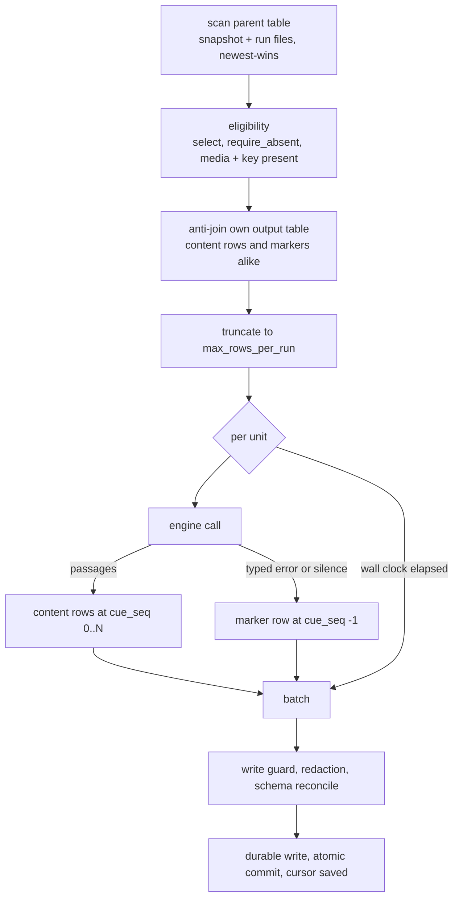
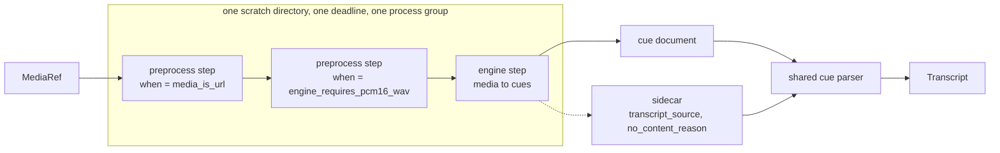
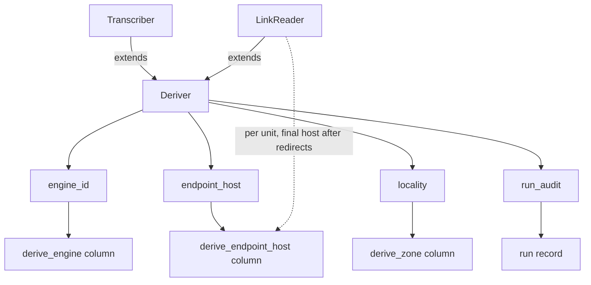

# The derive tier

Deferred per-row work over rows that already landed. One unit of media becomes many citable
passages; one landed link becomes a document's head facts and the pictures it advertises.
The tier reads the context store as its input, calls an engine the operator defined, and
appends its answer into a table of its own.

## Parties

| Party | Obligation |
| --- | --- |
| **The pipeline author** | Names an engine, the table to scan, the column holding media and the column holding the parent key. Introduces no command and reaches no host the machine has not already agreed to. |
| **The operator** | Defines what an engine runs in the machine's own configuration: the argv chain or the host list, the environment allowlist, the content pins, the bounds. Bears the refusal when a named engine has no definition. |
| **The engine adapter** | Answers with an identity, a bare host, a physical locality and a drained account of its own run. Probes its capabilities before the caller relies on them, and states who wrote the words it returns. |
| **The tier** | Recomputes the outstanding set each tick, bounds one run in rows and in wall clock, records one row per finding and one marker per unit that produced nothing, and retires a unit that settled. |
| **The consumer** | Joins the derived table to its parent on the parent key, filters the status discriminator, and reads the citation key to land inside the recording. |

## Operations

| Operation | What it governs |
| --- | --- |
| `select` | The store-reading source: its declared configuration, the outstanding set recomputed each tick, row eligibility, and a run's budget. |
| `bind` | Where an engine's definition lives, the port every engine implements, the capability probes a caller consults, and the values an engine hands back. |
| `exec` | Operator-declared argv chains against binaries on this machine: resolution, pinning, the child environment, the resource bounds, and the identity of what ran. |
| `fetch` | Following a link a third party wrote: the host allowlist, the pre-socket guards, the document prefix scanner, and the picture probe. |
| `land` | The derived row: its columns, the marker, the status union, attempt accounting, the citation keys, and the provenance a row carries. |
| `parse-cues` | Reading a caption document into passages: one grammar for two formats, defect accounting, coalescing, and rolling display. |
| `test-engine` | Building one engine outside a pipeline and running it against one file on disk. |

## Clauses — select

The source turns a landed table into a list of units and hands that list to an engine. Its
configuration lives in the pipeline manifest; its input is the store.

| Clause | Statement | decided-by |
| --- | --- | --- |
| `derive.select.interface.derive-source` | `derive` is a built-in source whose input is the context store rather than the outside world. A `[[pipeline]]` sets `[pipeline.source] connector = "derive"`, points it at a landed table, and lands its output through the ordinary write path. | |
| `derive.select.shape.source-config` | `[pipeline.source.config]` carries `task`, `engine`, `source_table`, `media_column`, `parent_id_column`, `url_column`, `select`, `require_absent`, `media_is_image`, `max_rows_per_run`, `max_seconds_per_run` and `max_attempts`. | |
| `derive.select.refusal.required-key` | `engine`, `source_table`, `media_column` and `parent_id_column` are present and non-empty; an absent or blank one raises `DeriveConfigKeyMissing` naming the key and the pipeline. | `0145` |
| `derive.select.refusal.build-context` | A source built with no store root, or with no identifier for the pipeline it belongs to, raises `DeriveNoStoreRoot` naming which of the two is absent. An empty answer in that position reads identically to an archive with nothing outstanding. | `0145` |
| `derive.select.invariant.outstanding-set` | A parent row is a unit when it lacks its derived output at the instant of the scan. The cursor is snapshot-shaped and carries no position, so each tick recomputes the list from what the store holds then. | |
| `derive.select.invariant.anti-join` | The source reads the table it writes and drops every parent it already holds a row for, marker rows included. A table that has never been created reads as zero derived parents rather than an error. | |
| `derive.select.refusal.foreign-output-table` | The pipeline identifier the anti-join resolves comes from the build alone; a `[source.config]` key naming another pipeline's output raises `DeriveForeignOutputTable`. One pipeline never marks another's work done. | `0146` |
| `derive.select.invariant.cap-after-the-anti-join` | `max_rows_per_run` truncates the outstanding list after the anti-join has removed the derived parents, and never the scanned list before it. | |
| `derive.select.limit.rows-per-run` | `max_rows_per_run` bounds one run at 25 rows by default. A value of zero or below takes the default rather than lifting the bound. | |
| `derive.select.limit.attempts-per-unit` | `max_attempts` allows 3 attempts per unit by default; a non-positive spelling resolves to that same figure. | |
| `derive.select.limit.seconds-per-run` | `max_seconds_per_run` bounds the serial unit loop at 300 s by default for a task that opens sockets, and carries no default for `transcribe`. | |
| `derive.select.interface.select-predicate` | `select` is a table of column name to value, applied as string equality against the parent row. Every entry matches for a row to be eligible. | |
| `derive.select.interface.require-absent` | `require_absent` names columns that are null, missing or whitespace on an eligible row. A landed empty string reads as absence, matching a connector that wrote no column at all. | |
| `derive.select.refusal.incomplete-unit` | A parent row whose `parent_id_column` or `media_column` holds null, nothing, or whitespace raises `DeriveUnitIncomplete`; the row is skipped, counted, and the count reaches the run record. | `0147` |
| `derive.select.invariant.time-budget-stop` | Wall-clock exhaustion stops the run mid-list, reports attempted-against-total on the run record, and emits the batches already produced. The next tick finds the remainder outstanding. | |
| `derive.select.refusal.journaled-pull` | `derive` sits on the pull-journaling opt-out list; a derive pipeline configured to journal its pulls raises `DeriveJournaledPull`. A crash between an engine call and the commit re-pays for the units of that run. | `0148` |
| `derive.select.refusal.unmetered-grant` | Whether a derive pipeline reaches vendors is read off `task` in the source specification, with no connector build consulted. A `transcribe` pipeline declaring a shared-quota grant raises `DeriveUnmeteredGrant`. | `0149` |
| `derive.select.refusal.metered-client` | A `link_preview` pipeline opening a socket outside the mediated client raises `DeriveMeteredClient`; every request it makes enters the run's request ledger. | `0149` |
| `derive.select.invariant.egress-claim` | A `transcribe` pipeline states on the run record that it reaches its engine in-process or through an operator-declared subprocess. A preprocess step that fetches reports that traffic as the step's own. | |
| `derive.select.invariant.in-memory-scan` | The scan reads the newest committed snapshot plus every uncommitted run file and de-duplicates newest-wins per key in memory, with no query engine behind it. Membership, rather than projection, is the whole question. | |
| `derive.select.shape.work-record` | The work record carries the scanned row count, the already-derived count, the skipped-incomplete count, and the outstanding list after truncation. | |
| `derive.select.invariant.spine-is-inherited` | A derive pipeline holds the lease, the write guard, the redaction rules, schema reconcile, per-batch durability, the atomic commit, the cursor saved after durability, the run record and the run audit as the write path defines them. The tier re-implements none of them. | |

The table naming convention and the dedup view the anti-join reads are [`10-store.md` § Table declaration](10-store.md); a derive table's output name follows from its pipeline identifier and its declared table name.

The shared-quota grant a metered task attaches to its client is [`32-connector.md` § Metering](32-connector.md); a link task carries one and a transcribe task carries none.

unsettled: At what parent-table size does the in-memory scan stop fitting, and what replaces it? owner: derive affects: select

## Clauses — bind

An engine has two halves: a name a pipeline requests, and a definition the machine holds.
The port below is what every engine hands back regardless of which driver stands behind it.

| Clause | Statement | decided-by |
| --- | --- | --- |
| `derive.bind.invariant.two-sided-binding` | A `[[pipeline]]` names an engine in `[pipeline.source.config]`. A `[derive.<name>]` block at the top level of the machine's own `contextful.toml` states what that name runs. A manifest arriving from elsewhere requests an engine and introduces no command. | |
| `derive.bind.refusal.unbound-engine` | A pipeline naming an engine with no matching `[derive.<name>]` block raises `DeriveEngineUnbound`, naming the pipeline, the engine, the file to edit and every engine the machine has bound. | `0150` |
| `derive.bind.refusal.command-in-a-manifest` | A `command`, `preprocess`, `env` or `allow_hosts` key written inside `[pipeline.source.config]` raises `DeriveCommandInManifest`. The request side of the split carries a name and its bounds, nothing executable. | `0150` |
| `derive.bind.interface.task-vocabulary` | `task` is `transcribe`, which turns recorded speech into timed passages, or `link_preview`, which turns the address a landed row points at into that document's head facts and the picture candidates it advertises. An absent `task` reads as `transcribe`. | |
| `derive.bind.refusal.unknown-task` | A `task` value outside the pair raises `DeriveUnknownTask` and prints both supported spellings. | `0151` |
| `derive.bind.refusal.driver-mismatch` | `driver` is `exec`, `fetch` or `none`. `exec` and `none` stand behind `transcribe`; `fetch` stands behind `link_preview`. Any other pairing raises `DeriveDriverMismatch` naming the task and the driver together. | `0151` |
| `derive.bind.interface.inert-driver` | `driver = "none"` binds an engine that lands zero rows and one loud run-audit line naming the key to fill in. It exercises the scan against stored data with nothing at stake. | |
| `derive.bind.interface.deriver-port` | Every engine implements `Deriver`, which owes four things: `engine_id`, `endpoint_host`, `locality` and `run_audit`. | |
| `derive.bind.invariant.engine-id-identity` | `engine_id` holds steady across two runs of an unchanged engine and differs across two runs whose parts differ. Two rows carrying one value came out of the same thing. | |
| `derive.bind.refusal.endpoint-host-is-bare` | `endpoint_host` is a host and nothing more; a value carrying a path, a query string, a port or a scheme raises `DeriveEndpointHostNotBare`. A path holds tenant identifiers and a query holds tokens, and this value lands in a column many readers reach. | `0152` |
| `derive.bind.invariant.run-audit-drains` | `run_audit` empties once per pull rather than accumulating across pulls. The tier folds the drained lines into the run record so one run reads as one account. | |
| `derive.bind.interface.anchor-traits` | `Transcriber` adds `capabilities()` and `transcribe(media, opts)`. `LinkReader` adds `capabilities()`, `read_link(target)` and `unmetered_egress()`. A timed interval and a document head share no operation that sorts, merges, dedupes or renders one citation across both. | |
| `derive.bind.shape.asr-capabilities` | `AsrCapabilities` carries `accepts_remote_url`, `max_upload_bytes`, `max_media_secs`, `max_processing_secs`, `cue_timestamps`, `diarization`, `language_detection` and `requires_pcm16_wav`. The caller reads the probe once per run and branches on it. | |
| `derive.bind.invariant.timestamps-are-not-synthesized` | An engine answering `cue_timestamps = false` has no interval interpolated on its behalf. A fabricated interval is a citation pointing at a moment nobody observed. | |
| `derive.bind.shape.media-ref` | `MediaRef` is `LocalPath`, a file a subprocess opens with no bytes entering the engine's address space; `Bytes`, an upload; or `Url`, which the engine dereferences itself. | |
| `derive.bind.invariant.url-handover-is-opted-into` | A `Url` reaches an engine when the adapter declares `accepts_remote_url` and the operator opted in. An enclosure address routinely carries a subscriber token in its query string, and handing it over places that token in a third party's request log. | |
| `derive.bind.refusal.remote-url-unsupported` | A unit whose media is an `http` or `https` address, handed to an engine that declines remote addresses, raises `DeriveRemoteUrlUnsupported`, naming the engine and the `when = "media_is_url"` preprocess step that resolves it. | `0153` |
| `derive.bind.refusal.media-unreadable` | A media value that is neither an address nor a readable file on this machine raises `DeriveMediaUnreadable` and fails that unit alone. | `0153` |
| `derive.bind.shape.transcript` | `Transcript` holds `text`, `cues` non-decreasing in `start_s`, `source`, `no_content_reason`, `detected_language` and `media_duration_s`. An empty `cues` list reports absent timing rather than absent speech; `no_content_reason` is the field that separates the two. | |
| `derive.bind.shape.cue` | A `Cue` is `start_s`, `end_s`, `text`, an optional `speaker` and an optional `confidence`. `speaker` is an opaque vendor label indexing this one recording and identifying no person. | |
| `derive.bind.refusal.confidence-out-of-range` | `confidence` is normalized to `0.0..=1.0` at the adapter rather than passed through as a raw model score. A value outside that interval raises `DeriveConfidenceOutOfRange` and the field lands null rather than clamped to a plausible number. | `0152` |
| `derive.bind.interface.transcript-source` | `TranscriptSource` is `published` or `asr`, defaults to `asr`, and any other spelling an engine writes parses to `asr`. The engine states the value; the tier reads it and infers nothing. | |
| `derive.bind.shape.derive-error` | `DeriveError` is `Unsupported`, `TooLarge`, `TranscodeRequired`, `Upstream{status, excerpt}`, `RateLimited{retry_after_s}`, `Timeout{elapsed_s}` or `EngineUnavailable`. `RateLimited`, `Timeout`, and `Upstream` carrying a 5xx status are retryable; the remainder settle the unit. | |
| `derive.bind.limit.upstream-excerpt` | `Upstream::excerpt` holds at most 4 KiB and carries no request body. An error string is where credential material most readily travels back out. | |
| `derive.bind.invariant.engine-unavailable-scope` | `EngineUnavailable` describes the engine rather than one unit, returns out of the read, and ends the run. Marking hundreds of units failed against one unreachable binary would spend every attempt budget in the table. | |
| `derive.bind.refusal.link-reader-unavailable` | A `LinkReader` returning `EngineUnavailable` raises `DeriveLinkEngineUnavailable`. Its engine is a different publisher per unit, so one dead name costs one row. | `0154` |
| `derive.bind.interface.stub-transcriber` | A stub transcriber ships as a public adapter rather than a test fixture: it answers from a canned transcript with no I/O, derives its declared capabilities from what it can answer with, reports `local:device`, and gives `stub.invalid` as its host rather than a plausible hostname. | |
| `derive.bind.shape.locality` | `Locality` is `OnDevice`, `OnDeviceWithPublicEgress`, `OnPrem` or `PublicCloud`, and each maps to one zone tag. | |
| `derive.bind.invariant.locality-is-the-adapters` | The adapter declares its locality and that value lands on every row the engine produces. Where inference physically happened is the one property of a deployment a later reader cannot reconstruct from the store. | |
| `derive.bind.refusal.advisory-zone` | The `zone` key in an operator's binding is advisory; a row whose zone column is taken from it raises `DeriveAdvisoryZone`. A config edit relabelling a remote engine as a local one would turn placement policy into prose. | `0155` |
| `derive.bind.invariant.public-egress-fails-closed` | The tag an `OnDeviceWithPublicEgress` adapter writes matches no zone entry until an operator widens the list deliberately. A request line carrying an address a third party wrote leaves the device, and a tag claiming otherwise would be false. | |

The zone strings a declared locality maps onto, and what an allowlist of them admits, are
[`41-enforcement.md` § Inference zones](41-enforcement.md); a reader of a derived row learns
where the words were produced from the row itself.

## Clauses — exec

An `exec` engine runs binaries already installed on this machine. A preprocessor and a
transcriber are one mechanism in two positions, sharing a runner, a set of bounds and a
provenance rule; the last step in the chain is the one that produces cues.

| Clause | Statement | decided-by |
| --- | --- | --- |
| `derive.exec.interface.chain-shape` | An `exec` engine is 0 to N media-to-media preprocess steps followed by one media-to-cues engine step. | |
| `derive.exec.interface.step-condition` | A preprocess step's `when` is `always`, the default; `media_is_url`, which fires when the unit's media is an address nothing has fetched yet; or `engine_requires_pcm16_wav`, which fires off the engine step's declared capability. A probed condition leaves no stale transcode behind after an engine swap. | |
| `derive.exec.invariant.argv-array` | A step's `command` is an array of arguments and no shell is spawned: no word splitting, no glob expansion, no command substitution. A media address carrying shell metacharacters reaches the tool as one argument. | |
| `derive.exec.refusal.shell-string` | A `command` given as a single string rather than an array raises `DeriveShellCommand`. | `0156` |
| `derive.exec.invariant.placeholder-substitution` | `{input}`, `{input_url}`, `{output}` and `{output_stem}` substitute as whole argument elements. A placeholder embedded inside a longer argument is left untouched. | |
| `derive.exec.invariant.output-path-template` | `output_path` is a filesystem-path template rather than an argument element, and is the one place substring substitution happens. The values reaching it are paths the engine invented inside a scratch directory it created, so no unit's data enters the template. | |
| `derive.exec.invariant.cleared-environment` | The child receives a cleared environment plus the operator's explicit allowlist and nothing further. A value may be a credential-reference template, resolved through the provider chain and hydrated per unit rather than held on the engine between calls. | |
| `derive.exec.refusal.env-name` | An allowlist entry whose name is not ASCII alphanumeric or underscore, or that leads with a digit, raises `DeriveEnvNameInvalid` naming the entry. | `0157` |
| `derive.exec.refusal.unresolved-reference` | A credential-reference template is parsed at build; one naming no resolvable entry raises `DeriveSecretUnresolved` while the operator is watching rather than at the first scheduled tick. | `0157` |
| `derive.exec.limit.chain-deadline` | `timeout_secs` bounds one unit's whole chain at 1800 s by default. | |
| `derive.exec.limit.step-output` | `max_output_bytes` bounds captured standard output and standard error at 8 MiB per step by default. | |
| `derive.exec.limit.audit-entries` | A chain contributes at most 64 entries of captured step output to the run record. | |
| `derive.exec.limit.step-error-excerpt` | A failing step's error text carries at most 4 KiB of that step's standard error. | |
| `derive.exec.invariant.scratch-directory` | Each unit runs inside a scratch working directory created for it and removed after the chain ends, whichever way it ends. | |
| `derive.exec.refusal.non-zero-exit` | A step exiting non-zero raises `DeriveStepExit`, naming the step and carrying its bounded error text into the run audit. | `0158` |
| `derive.exec.refusal.deadline-elapsed` | A chain outrunning its deadline raises `DeriveStepTimeout` naming the step that was running. | `0158` |
| `derive.exec.invariant.process-group-kill` | The child is spawned leading its own process group and the deadline signal reaches the group. A descendant surviving the kill would keep the resolved environment, hold the scratch directory open past its removal, and go on spending the machine on a unit already recorded failed. | |
| `derive.exec.invariant.reader-enforced-cap` | Bytes past the output bound are counted and discarded rather than buffered, and the step is killed as the count crosses the bound — tested before each wait rather than after an exit. Draining continues past the cap so the child cannot block on a full pipe. | |
| `derive.exec.refusal.overflowing-step` | A step whose captured output crosses its bound raises `DeriveOutputCap` naming the step and the byte count observed. | `0158` |
| `derive.exec.refusal.silent-step` | A preprocess step exiting zero without writing the file its template names raises `DeriveStepProducedNothing` and fails that unit. Continuing would hand the next step the previous file and derive from the wrong media. | `0158` |
| `derive.exec.invariant.stderr-on-success` | Every step's error stream reaches the run record whether the step succeeded or failed. A step that worked while warning about a missing model is the case worth reading. | |
| `derive.exec.invariant.command-resolution` | `command[0]` resolves once at build: an explicit path as written, a bare name through the search path. The resolved file is checked for executability, canonicalized to an absolute path, and digested. A search-path change between two units of one run swaps no binary. | |
| `derive.exec.refusal.missing-binary` | A `command[0]` that is not an executable file on this machine raises `DeriveBinaryMissing` naming the binary and the step. The operator wrote the command, so an absent binary is a declared intent the machine cannot honour. | `0159` |
| `derive.exec.refusal.unpinned-path` | A `command[0]` written as a path carries `sha256`; one written as a bare name on the search path does not. An unpinned path raises `DeriveUnpinnedPath` and quotes the digest just computed, so pinning is a paste. | `0159` |
| `derive.exec.refusal.digest-mismatch` | A pinned file whose bytes differ from its recorded digest raises `DeriveDigestMismatch`, so an edit is re-pinned inside the same reviewable change that makes it. | `0159` |
| `derive.exec.invariant.engine-id-is-hashed` | `engine_id` reads `exec:<name>@<digest prefix>` over a hash of every step's resolved-binary digest together with the arguments that invoked it, preprocess steps included. A pinned script and an upgraded system tool each surface as a new engine value on the rows after them. | |
| `derive.exec.limit.engine-id-prefix` | The digest prefix inside an `exec` engine identifier is 12 chars of lowercase hexadecimal. | |
| `derive.exec.invariant.no-endpoint-host` | An `exec` engine answers with no hostname. Nothing it does opens a socket it can observe, and a preprocess step's traffic belongs to that step. | |
| `derive.exec.invariant.blocking-thread` | Credentials resolve asynchronously, then the whole subprocess chain moves onto a blocking thread. Run inline, one process wait would hold an async worker for the length of its deadline and stall every task scheduled behind it. | |
| `derive.exec.invariant.blocking-payload-ownership` | The chain's state crosses onto the blocking thread behind a reference-counted handle, and the resolved environment crosses as a plain map that drops with the call. | |
| `derive.exec.interface.output-formats` | `output_format` is `vtt`, `srt` or `contextful-json`. The first two reach the shared cue parser. The third carries structure the caption formats have no field for. Omitting `output_path` reads the engine step's cues from its standard output. | |
| `derive.exec.interface.provenance-sidecar` | An engine step may write a sidecar file beside its cues, named from `{output_stem}`, stating who wrote the words and why content is absent. No sidecar is the common case and leaves the defaults standing. | |
| `derive.exec.invariant.malformed-sidecar` | A sidecar that does not parse leaves the defaults standing and says so on the run record. The transcript already produced is kept rather than discarded over a file that carries no passages. | |

The reference scheme an exec environment resolves a credential through is [`33-secrets.md` § The reference scheme](33-secrets.md); a value named there reaches the child for the length of one unit and is held on the engine no longer than that.

unsettled: Does a vendor engine reached over HTTP need a deadline tier of its own, separate from the chain deadline? owner: derive affects: exec

## Clauses — fetch

A `fetch` engine follows an address a publisher wrote into a row. The destination is chosen
by a third party, so every guard below runs on this machine before a socket opens.

| Clause | Statement | decided-by |
| --- | --- | --- |
| `derive.fetch.invariant.operator-allowlist` | A fetch engine reaches hosts named in `[derive.<name>].allow_hosts` and no others. The list is required and the party that authors it is the party that owns the machine. | |
| `derive.fetch.refusal.empty-host-list` | An `allow_hosts` list with no entries raises `DeriveHostListEmpty`. | `0160` |
| `derive.fetch.refusal.wildcard-host` | A bare `*` entry raises `DeriveHostListWildcard`. The matcher strips a leading `*.` before comparing, so a bare star admits a host literally spelled that way and an entry written expecting everything admits nothing. | `0160` |
| `derive.fetch.refusal.malformed-host-entry` | An empty entry, or an entry carrying a scheme, a port or a path, raises `DeriveHostEntryMalformed` naming the entry. | `0160` |
| `derive.fetch.refusal.scheme` | An address whose scheme is neither `http` nor `https` raises `DeriveSchemeUnsupported` before any socket opens. | `0161` |
| `derive.fetch.refusal.address-literal` | A host written as an address literal raises `DeriveAddressLiteral`. A gate that compares names has nothing to compare against a literal. | `0161` |
| `derive.fetch.refusal.loopback-host` | A host resolving to the machine by name raises `DeriveLoopbackHost`. | `0161` |
| `derive.fetch.refusal.host-not-listed` | A host absent from the operator's list raises `DeriveHostNotAllowed` naming the host, and the unit records which name it was pointed at. | `0161` |
| `derive.fetch.invariant.guard-cost` | Each pre-socket refusal settles one unit permanently, costs no request, and leaves the run to continue. One hostile publisher costs one row. | |
| `derive.fetch.invariant.per-hop-list` | The redirect policy re-applies the host list at every hop and stops rather than follows when a hop leaves it. A stopped redirect surfaces as the response, so the fix is one line of configuration. | |
| `derive.fetch.refusal.redirect-downgrade` | A redirect from `https` to `http` raises `DeriveRedirectDowngrade` and the chain stops there. | `0162` |
| `derive.fetch.limit.redirect-chain` | A redirect chain runs to at most 5 hops. | |
| `derive.fetch.invariant.no-proxy-no-referer` | The client uses no system proxy and sends no referring address. A proxy can move a loopback exemption off this machine, and a referring header hands the previous address's query string to the host being read. | |
| `derive.fetch.refusal.exec-keys-on-a-fetch-binding` | `env`, `preprocess`, `engine` and `max_output_bytes` on a fetch binding raise `DeriveFetchBindingKey` naming the key. A fetch carries no credential to any host, which is what lets it name more than one; a silently ignored key would leave an operator believing otherwise. | `0163` |
| `derive.fetch.limit.document-prefix` | `max_document_bytes` bounds the document prefix the scanner reads at 1 MiB by default, and the remainder is dropped rather than refused. | |
| `derive.fetch.limit.probe-prefix` | `max_probe_bytes` bounds one range request against a picture at 64 KiB by default. | |
| `derive.fetch.limit.hop-timeout` | `request_timeout_secs` bounds one hop at 20 s by default, and is a separate key from the chain deadline an `exec` engine carries. | |
| `derive.fetch.limit.retry-after-default` | A `429` response with no usable `Retry-After` header maps to a rate-limit error carrying 60 s. | |
| `derive.fetch.interface.head-scanner` | The scanner reads a document prefix and stops at the closing head element or the first body element, whichever arrives first. | |
| `derive.fetch.invariant.script-bodies-skipped` | Script and style bodies are skipped whole. An angle bracket inside inline code is not the start of an element. | |
| `derive.fetch.invariant.attribute-reading` | The scanner reads `property` and `name` in either attribute order, resolves relative addresses against the final address after redirects, decodes the five named character entities plus numeric references, strips control characters, and collapses runs of whitespace. | |
| `derive.fetch.shape.picture-fields` | A picture may be declared in `og:image:secure_url`, `og:image:url`, `og:image`, `twitter:image`, `twitter:image:src` or `link[rel=image_src]`. The element that named it lands in `image_field`. | |
| `derive.fetch.invariant.field-order-is-provenance` | The order of the picture elements is recorded rather than used as a filter: every declaration lands as its own candidate, and one absolute address declared under several elements lands once so a consumer's rubric does not count a duplicate as several votes. | |
| `derive.fetch.invariant.head-fact-fallbacks` | `title` falls back through `og:title`, `twitter:title` and the document's own title element; `description` through `og:description`, `twitter:description` and the description element; `site_name` through `og:site_name` and `application-name`. | |
| `derive.fetch.invariant.absent-rather-than-blank` | An optional head fact that resolves to nothing is absent rather than an empty string. A publisher who wrote a blank value and one who wrote no element are the same absence, and no column carries a difference between them. | |
| `derive.fetch.refusal.declared-charset` | A character set other than UTF-8 declared in the content type header, or in a charset element inside the scanned prefix, raises `DeriveCharsetUnsupported` naming the declared value. | `0164` |
| `derive.fetch.refusal.invalid-bytes` | A document declaring nothing and failing UTF-8 validation raises `DeriveBytesNotUtf8`. A character split at the byte bound is tolerated, since a truncated read ends mid-character by construction. Lossy decoding would land replacement characters in a title column where they read as a fact about the publication. | `0164` |
| `derive.fetch.shape.candidate-rows` | A `link_preview` unit lands one row per picture candidate at sequence `0` upward, the document's head facts repeated on each, or one marker. Choosing among candidates belongs to the consumer rendering the card, and that choice reads the losers and their dimensions. | |
| `derive.fetch.shape.link-row-columns` | A link row carries the shared envelope plus `link_title`, `link_description`, `link_site_name`, `link_final_url`, `image_url`, `image_field`, `image_width`, `image_height`, `image_bytes`, `image_content_type`, `probe_status` and `probe_error`. The document's own description lands in the body column so the table retrieves like any other text table. | |
| `derive.fetch.invariant.status-mapping-positive` | A parsed head naming at least one picture lands the successful status. A 2xx head naming a picture in none of the six elements, and a `404` or `410`, land the established-empty status settled: a `404` is a positive answer about the document. | |
| `derive.fetch.invariant.status-mapping-negative` | A 5xx response, a timeout, a rate limit, a transport failure and a redirect stopped at the host list land failed and retryable. A pre-socket guard refusal, a character-set refusal and any other 4xx land failed and settled. | |
| `derive.fetch.invariant.no-http-answer-band` | A name-resolution failure, a refused connection and a declined redirect hop report an internal `599` status inside the retryable band. Each has an operator-side fix — a host added to the list, a publisher back on the network — and a settled marker would outlive the fix. | |
| `derive.fetch.invariant.probe-never-fails-the-unit` | A picture probe records its own outcome and leaves the unit's status to the document. A candidate the probe could not reach carries a skipped or failed probe status with its reason, and the head facts land beside it. | |
| `derive.fetch.interface.image-host-list` | `allow_image_hosts` is its own key defaulting to `allow_hosts`. A social-card picture commonly lives on a delivery network rather than on the publisher's own name. | |
| `derive.fetch.invariant.probed-length` | `image_bytes` is the file's own length, read from the range response's total or from a server that ignored the range, rather than the length of the prefix that came back. The prefix length is a fact about the probe. | |
| `derive.fetch.invariant.dimensions-or-nothing` | Picture dimensions come from a helper that declines to answer when the prefix is too short, rather than landing a zero-by-zero pair that reads as a measurement. | |
| `derive.fetch.invariant.document-host-on-the-row` | The endpoint host on a link row is the document's own final host after redirects rather than the engine's. A fetch engine reaches a different publisher per unit inside one batch. | |
| `derive.fetch.interface.media-is-image` | `media_is_image = true` reads the row's column as a picture address directly: one candidate whose field records the row as its origin, the document hop skipped, and the probe standing as the whole of the work. It is a configuration detail of `link_preview` rather than a third task. | |

The suffix form the host matcher compares in is [`32-connector.md` § Host matching](32-connector.md);
an entry covering subdomains leaves the apex name to be listed on its own.

unsettled: Does a listed name whose address resolves inside a private range need a post-resolution check? owner: derive affects: fetch

## Clauses — land

One table, one schema, one discriminator. A unit that produced passages and a unit that
produced nothing land in the same place, and the anti-join reads both.

| Clause | Statement | decided-by |
| --- | --- | --- |
| `derive.land.shape.derived-row` | A transcribe row carries `unit_ref`, the parent's identifier verbatim; `cue_seq`; `unit_status`; `segment_id`; `body`; `start_s`; `end_s`; `url`; `transcript_source`; `derive_engine`; `derive_endpoint_host`; `derive_zone`; `confidence`; `attempts`; `last_error`; `retryable`; and `_modality`. | |
| `derive.land.shape.marker-row` | A unit that produced nothing lands one row at `cue_seq = -1` carrying `unit_status`, `attempts`, `last_error` and `retryable`, with `body`, `start_s`, `end_s` and `transcript_source` null. A marker asserts nothing about who wrote words it does not hold. | |
| `derive.land.invariant.marker-is-visible-to-the-scan` | The anti-join reads a marker, so a settled unit leaves the outstanding set and a population of undone work is a row count rather than a silence. | |
| `derive.land.refusal.failure-off-the-table` | Per-unit failure state recorded anywhere other than the output table raises `DeriveFailureOffTable`. A run whose every unit failed would otherwise emit no batch, re-save an unchanged cursor, and re-select the same units each tick without end. | `0165` |
| `derive.land.shape.unit-status` | `unit_status` is `ok`; `empty`, where the engine established there is nothing to derive and said so; `unavailable`, where the engine came back with nothing and did not say why; or `failed`, where the engine returned a typed error. | |
| `derive.land.invariant.unavailable-is-the-default` | An engine answering with nothing and no stated reason lands `unavailable`. A source gating on authorization answers a caller it refuses the way it answers one asking about absent content, so a check, a geographic block, an age gate and a quota all sit in that status rather than asserting the recording is silent. | |
| `derive.land.refusal.unknown-status` | A status value outside the four raises `DeriveUnitStatusUnknown`. The two empty-looking populations stay separately countable, since they are different problems with different fixes. | `0166` |
| `derive.land.refusal.discriminator-name` | The status discriminator is `unit_status`; a derive table declaring a column named `kind` raises `DeriveReservedDiscriminator`. That name changes a table's genre for its whole history, and genre filters what the read path returns. | `0166` |
| `derive.land.invariant.retryable-is-permanence` | `retryable` is null on a successful row. On a marker, `false` means settled for good and is what the outstanding-set filter reads. A marker carrying no value at all reads as unsettled, so nothing is stranded. | |
| `derive.land.refusal.settled-unit-revived` | A unit whose marker says settled re-entering the outstanding set raises `DeriveSettledUnitRevived`. Raising an operator-facing attempt ceiling revives no security refusal. | `0167` |
| `derive.land.invariant.attempts-count-what-happened` | `attempts` is the prior count plus one — what was actually tried — rather than an encoding of permanence. | |
| `derive.land.limit.empty-attempt-ceiling` | A unit in the established-empty status is attempted 1 attempt in total. A finding one look establishes is not looked at again. | |
| `derive.land.invariant.ceiling-is-per-status` | The unavailable and failed statuses are bounded by the configured per-unit attempt ceiling; the established-empty status carries its own smaller one. A unit whose content appears after the first look stays recorded settled until its parent row changes. | |
| `derive.land.invariant.markers-fold-on-attempts` | Where a unit holds several markers, the status and permanence pair is taken from the marker with the highest attempt count, since that count rises monotonically per unit while file ordering does not. A tie resolves toward the settled reading, which cannot loop. | |
| `derive.land.shape.citation-keys` | `start_s` and `end_s` are whole seconds. `segment_id` reads `<unit_ref>#t=<start_s>`. `url` is the parent's own link with the same fragment appended, falling back to the media value where the parent published no link. | |
| `derive.land.invariant.keys-union-rather-than-double` | The citation key is byte-identical to the one a feed source lands for the same moment, so a feed that later publishes its own transcript unions onto those keys rather than doubling every passage. | |
| `derive.land.shape.link-segment-key` | A link row's `segment_id` reads `<unit_ref>#img=<cue_seq>`, and its modality column reads `link`. | |
| `derive.land.refusal.unredacted-error` | Every non-null write of `last_error` passes address redaction; an unredacted write raises `DeriveUnredactedError`. The units this column reports on are row-supplied addresses, where a pre-signed link carries its authorization in its query string. | `0168` |
| `derive.land.refusal.missing-primary-key` | A derive output table declaring no `primary_key` of `["unit_ref", "cue_seq"]` raises `DerivePrimaryKeyMissing`. Without it a re-derived unit accumulates duplicate passages beside the originals. | `0169` |
| `derive.land.invariant.one-row-builder` | One builder produces both content rows and marker rows, so a marker cannot quietly acquire a column set of its own. | |
| `derive.land.invariant.provenance-on-every-row` | `derive_engine`, `derive_endpoint_host` and `derive_zone` land on every row the tier writes, marker rows included. A row states what produced it and where. | |

The write-time guard that scans every string cell before a batch lands is
[`31-pipeline.md` § The write guard](31-pipeline.md); a unit's passages pass through it like
any other prose the write path carries.

unsettled: What validated domain does the modality column carry, and which value does a passage derived from a video row take? owner: derive affects: land

unsettled: What signal re-derives a unit whose parent row changed after it settled? owner: derive affects: land

unsettled: What reaps derived children whose parent row is deleted upstream? owner: derive affects: land

## Clauses — parse-cues

WebVTT and SubRip reach one function. They differ in a header line, a decimal separator and
an optional settings tail, none of which changes the grammar underneath.

| Clause | Statement | decided-by |
| --- | --- | --- |
| `derive.parse-cues.interface.one-parser` | Both caption formats reach one parser rather than a copy each. | |
| `derive.parse-cues.shape.cue-grammar` | A document is blocks separated by blank lines, each block carrying one timing line and the text below it. Line endings are normalized once at entry. | |
| `derive.parse-cues.invariant.headers-fall-out` | A comment block and a bare sequence number carry no timing line and leave the parser without a special case. | |
| `derive.parse-cues.invariant.defects-degrade` | A third party writes the document, so a block whose timing does not parse, whose end precedes its start, or whose text is empty is skipped and counted, and the count returns to the caller, which warns once at the end. | |
| `derive.parse-cues.refusal.backward-cue` | A block starting before the block already accepted raises `DeriveCueOutOfOrder` and is dropped. Kept, it would collide on the citation key and silently replace a real passage. | `0170` |
| `derive.parse-cues.limit.passage-chars` | A passage stays open while it holds fewer than 600 chars. A paragraph of that length reads as an answer and lands the citation within a few seconds of the sentence that matched. | |
| `derive.parse-cues.limit.passage-span` | A passage stays open while it spans less than 60 s, which is the ceiling on how far a citation sits from the moment it quotes. | |
| `derive.parse-cues.limit.passage-bytes` | One passage's text holds at most 8 KiB. | |
| `derive.parse-cues.limit.passages-per-document` | One document yields at most 2000 rows of passages. | |
| `derive.parse-cues.invariant.rolling-overlap` | A rolling caption display restates the line above before appending the next few words. The parser strips the longest whole-word suffix of the previous cue that prefixes the current one. | |
| `derive.parse-cues.invariant.overlap-gate` | The strip applies when the overlap covers the whole cue or runs to two words or more, and when the two cues are contiguous. A display rolls within one breath, so two cues a minute apart carrying the same words are a speaker repeating themselves and both copies land. | |

unsettled: How often does a published transcript legitimately repeat two words across contiguous cues, and does the word floor move? owner: derive affects: parse-cues

## Clauses — test-engine

One verb builds an engine the way a pipeline builds it and runs it against one file.

| Clause | Statement | decided-by |
| --- | --- | --- |
| `derive.test-engine.workflow.single-file-run` | `contextful derive test <engine> --media <file>` builds the named engine, runs it against one file on disk, and prints the parsed transcript together with every step's captured error stream. | |
| `derive.test-engine.invariant.identical-build` | The verb resolves the same binding, the same search path, the same content pins and the same environment allowlist a scheduled pipeline resolves. A cheaper build path would prove nothing about the pipeline. | |
| `derive.test-engine.invariant.no-side-effects` | The verb writes nothing and reads no store. | |
| `derive.test-engine.interface.json-output` | `--json` emits one object carrying the engine identifier, the zone, the cue-timestamp capability, both engine claims, the text and the cues, with no human-readable line above it. | |
| `derive.test-engine.refusal.unsupported-driver` | A `fetch` engine named to the verb raises `DeriveTestEngineUnsupported` with the message a pipeline gives for the same pairing. | `0171` |

## Shapes

The pipeline half of the declaration, authored in a manifest that may arrive from anywhere:

```toml
[[pipeline]]
id = "episode-transcripts"

[pipeline.source]
connector = "derive"

[pipeline.source.config]
task              = "transcribe"
engine            = "local-asr"
source_table      = "episodes"
media_column      = "enclosure_url"
parent_id_column  = "guid"
url_column        = "link"
media_is_image    = false
max_rows_per_run  = 25
max_attempts      = 3

[pipeline.source.config.select]
show = "the-podcast"

[pipeline.source.config.require_absent]
columns = ["transcript_text"]

[[pipeline.table]]
name        = "passages"
primary_key = ["unit_ref", "cue_seq"]
```

The machine half, at the top level of `contextful.toml`, holding everything executable:

```toml
[derive.local-asr]
driver        = "exec"
timeout_secs  = 1800
max_output_bytes = 8388608
zone          = "local:device"          # advisory; the adapter writes the row value

[[derive.local-asr.preprocess]]
when        = "media_is_url"
command     = ["/opt/tools/fetch-media", "--url", "{input_url}", "--out", "{output}"]
sha256      = "9f1c0c0e5d2a7b41c8e6f2a9d3b40718c5e91a6d2f83b4470ce1d92a6b5f3c08"
output_path = "{output_stem}.media"

[[derive.local-asr.preprocess]]
when        = "engine_requires_pcm16_wav"
command     = ["ffmpeg", "-i", "{input}", "-ar", "16000", "-ac", "1", "{output}"]
output_path = "{output_stem}.wav"

[derive.local-asr.engine]
command       = ["speech-cli", "--model", "base", "--srt", "{input}"]
output_format = "srt"
output_path   = "{output_stem}.srt"

[derive.local-asr.env]
SPEECH_MODEL_DIR = "/opt/models/speech"
SPEECH_API_KEY   = "${secret://speech-vendor}"
```

The machine half for a link engine, where the keys that spawn processes are absent:

```toml
[derive.card-reader]
driver               = "fetch"
allow_hosts          = ["example.com", "*.example.com", "news.example.org"]
allow_image_hosts    = ["*.cdn.example.net"]
max_document_bytes   = 1048576
max_probe_bytes      = 65536
request_timeout_secs = 20
max_seconds_per_run  = 300
```

One tick, from the scan to the commit:



The `exec` chain for one unit:



Where an engine's four obligations come from and where they land:



The engine port, as Rust items:

```rust
pub trait Deriver: Send + Sync {
    fn engine_id(&self) -> String;
    fn endpoint_host(&self) -> Option<String>;
    fn locality(&self) -> Locality;
    fn run_audit(&self) -> Vec<String>;
}

pub trait Transcriber: Deriver {
    fn capabilities(&self) -> AsrCapabilities;
    fn transcribe(&self, media: MediaRef, opts: TranscribeOpts)
        -> Result<Transcript, DeriveError>;
}

pub trait LinkReader: Deriver {
    fn capabilities(&self) -> LinkCapabilities;
    fn read_link(&self, target: &str) -> Result<LinkDocument, DeriveError>;
    fn unmetered_egress(&self) -> bool;
}

pub enum Locality {
    OnDevice,                  // local:device
    OnDeviceWithPublicEgress,  // local:device+public-egress
    OnPrem,                    // on-prem:self
    PublicCloud,               // public-cloud:api
}

pub enum MediaRef {
    LocalPath(PathBuf),
    Bytes(Vec<u8>),
    Url(String),
}

pub struct AsrCapabilities {
    pub accepts_remote_url: bool,
    pub max_upload_bytes: Option<u64>,
    pub max_media_secs: Option<u32>,
    pub max_processing_secs: Option<u32>,
    pub cue_timestamps: bool,
    pub diarization: bool,
    pub language_detection: bool,
    pub requires_pcm16_wav: bool,
}

pub struct Transcript {
    pub text: String,
    pub cues: Vec<Cue>,                      // non-decreasing in start_s
    pub source: TranscriptSource,            // published | asr, default asr
    pub no_content_reason: Option<String>,
    pub detected_language: Option<String>,
    pub media_duration_s: Option<f64>,
}

pub struct Cue {
    pub start_s: f64,
    pub end_s: f64,
    pub text: String,
    pub speaker: Option<String>,             // opaque label within one recording
    pub confidence: Option<f32>,             // normalized 0.0..=1.0 at the adapter
}

pub enum DeriveError {
    Unsupported(String),
    TooLarge { bytes: u64 },
    TranscodeRequired(String),
    Upstream { status: u16, excerpt: String },
    RateLimited { retry_after_s: u32 },
    Timeout { elapsed_s: u32 },
    EngineUnavailable(String),
}
```

The `contextful-json` cue format an engine step writes when the caption formats carry too
little:

```json
{
  "text": "full flattened text",
  "transcript_source": "published",
  "no_content_reason": null,
  "detected_language": "en",
  "media_duration_s": 4512.0,
  "cues": [
    { "start_s": 0.0,  "end_s": 5.2,  "text": "…", "speaker": "S1", "confidence": 0.94 },
    { "start_s": 5.2,  "end_s": 11.8, "text": "…", "speaker": "S2", "confidence": 0.88 }
  ]
}
```

The optional sidecar an engine step writes beside a caption document, carrying the two facts
that format has no field for:

```json
{
  "transcript_source": "published",
  "no_content_reason": null
}
```

The transcribe output table, one schema for content rows and markers alike:

```text
unit_ref              Utf8      the parent row's key, verbatim
cue_seq               Int32     0..N for passages, -1 for the marker
unit_status           Utf8      ok | empty | unavailable | failed
segment_id            Utf8      <unit_ref>#t=<start_s>
body                  Utf8      passage text; null on a marker
start_s               Int64     whole seconds; null on a marker
end_s                 Int64     whole seconds; null on a marker
url                   Utf8      parent link + #t=<start_s>, else the media value
transcript_source     Utf8      published | asr; null on a marker
derive_engine         Utf8      exec:<name>@<12 hex>, or the adapter's own id
derive_endpoint_host  Utf8      bare host, or null for an exec engine
derive_zone           Utf8      the adapter's declared locality tag
confidence            Float32   normalized 0.0..=1.0; null where unstated
attempts              Int32     prior_attempts + 1
last_error            Utf8      redacted; null on a content row
retryable             Boolean   null on a content row; false means settled
_modality             Utf8      projected discriminator
```

The link output table adds the document's own facts and the probe's findings:

```text
segment_id            Utf8      <unit_ref>#img=<cue_seq>
link_title            Utf8      og:title | twitter:title | <title>
link_description      Utf8      og:description | twitter:description | description
link_site_name        Utf8      og:site_name | application-name
link_final_url        Utf8      the address after the redirect chain
image_url             Utf8      absolute, resolved against link_final_url
image_field           Utf8      which of the six elements declared it, or "row"
image_width           Int32     null where the prefix was too short
image_height          Int32     null where the prefix was too short
image_bytes           Int64     the file's own length, not the prefix's
image_content_type    Utf8      as served
probe_status          Utf8      ok | skipped | failed
probe_error           Utf8      redacted; null where the probe succeeded
_modality             Utf8      link
```

How an outcome maps onto a status and a permanence flag:

```text
outcome                                   unit_status   retryable

passages parsed, one or more              ok            null
head parsed, one picture or more          ok            null
2xx head, no picture in any element       empty         false
404 or 410                                empty         false
engine states nothing to derive           empty         false
engine answers nothing, states no reason  unavailable   true
5xx, timeout, rate limit, transport       failed        true
redirect stopped at the host list         failed        true
599 band: DNS, refused, declined hop      failed        true
scheme, literal, loopback, off-list       failed        false
character set refusal                     failed        false
other 4xx                                 failed        false
typed permanent engine error              failed        false
```

The single-file verb and its machine-readable answer:

```console
$ contextful derive test local-asr --media ./sample.mp3
engine   exec:local-asr@3f9a1c2b7d04
zone     local:device
cues     91 passages, timestamps present
source   asr
--- step stderr: ffmpeg ---
size=   14336kB time=00:12:31.02 bitrate= 156.4kbits/s
--- transcript ---
[0s–7s] …

$ contextful derive test local-asr --media ./sample.mp3 --json
{
  "engine_id": "exec:local-asr@3f9a1c2b7d04",
  "zone": "local:device",
  "cue_timestamps": true,
  "transcript_source": "asr",
  "no_content_reason": null,
  "text": "…",
  "cues": [{ "start_s": 0.0, "end_s": 7.0, "text": "…" }]
}
```

## Unsettled

unsettled: Does the established-empty status warrant a spacing schedule rather than a flat ceiling? owner: derive affects: land

unsettled: Does a build-time check refuse an engine whose declared locality is wider than the source table's admitted zones? owner: derive affects: bind

unsettled: Does a second anchor model for pictures need its own reader trait keyed on the parent row's content hash? owner: derive affects: bind

unsettled: Does manifest validation refuse a derive pipeline whose scanned table no other pipeline produces? owner: derive affects: select

unsettled: Does a dry run print eligible, already-derived and outstanding counts before a scheduled tick pays for them? owner: derive affects: select
