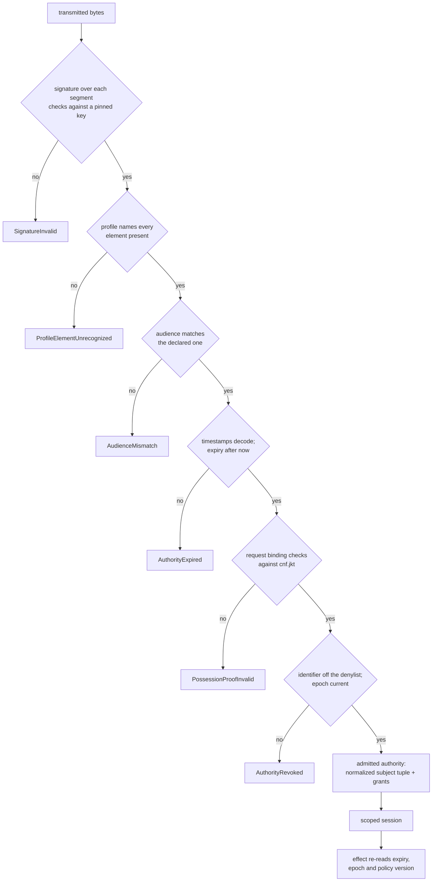
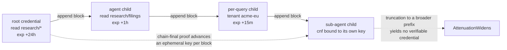
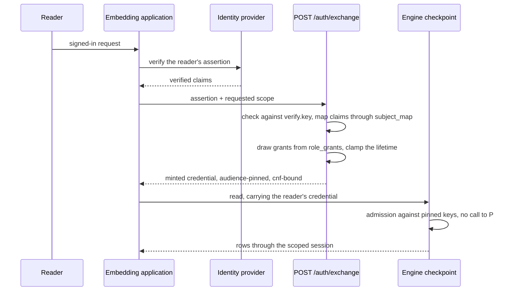
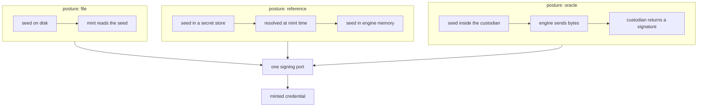

# Admission and authority

A caller reaches contextful holding a credential. This file states what that credential
says, who minted it, what a holder derives from it, what a checkpoint decides about it,
and what the decision hands to the effect that acts. The registered relation a grant
compiles into is [`spec/41-enforcement.md` § Clauses — register]; a grant reaches rows
through a relation the engine builds for the caller, rather than through a predicate a
query carries.

## Parties

| Party | Obligation |
| --- | --- |
| **The issuer** | Mints through the signing port alone, holds the lifetime ceiling the project persists, and stamps the subject tuple it verified onto the credential it signs. |
| **The holder** | Derives narrower children locally, presents a possession proof on each request, and carries no authority that some verification produced. |
| **The checkpoint** | Holds public key material and no signing secret, decides admission from the profile and the pinned keys, and yields the admitted-authority value an effect takes as an argument. |
| **The engine** | Supplies the reserved facts the evaluator reads, re-reads the carried authority at each effect, and treats an element its profile does not name as a refusal. |
| **The identity provider** | Verifies the on-behalf-of principal and writes the directory link. It supplies no grant. |
| **The operator** | Declares the authoring posture at project open, the persisted issuance policy, the rotation cadence and the exchange policy, and keeps the signing seed in custody. |

## Operations

| Operation | What it governs |
| --- | --- |
| `identify` | The subject tuple, its per-member attestation, hygiene at the mint, and the identity links that connect a subject to a source's own principals. |
| `profile` | The versioned delegation profile: admitted elements, reserved facts, the bounded evaluator, and the scoped session authorization yields. |
| `grant` | What a credential says a holder does: the action vocabulary, table patterns, tenant scope, the template allowlist, ceilings, and resources that answer by name. |
| `attenuate` | Deriving a narrower child offline, and the narrowing legality each grant dimension carries. |
| `issue` | Minting: the persisted ceiling, the principal a row-landing grant needs, custody of the signing seed, and the authoring posture a face declares. |
| `verify` | Admission at a checkpoint: signature coverage, audience, timestamps, possession proof, key sets, and the admitted-authority value it produces. |
| `revoke` | Ending a credential's usefulness ahead of its expiry: short lifetimes, the denylist, the scoped epoch, key rotation, and format withdrawal. |
| `exchange` | Trading a verified external assertion for a scoped credential, under injected verifying material and a declared policy. |

## Clauses — identify

A principal is structured, and each member of it travels with a label recording how it
was established. The column a landed row stamps with the authorizing principal is
[`spec/10-store.md` § Clauses — declare]; a row records the principal that authorized
the write which landed it.

| Clause | Statement | decided-by |
| --- | --- | --- |
| `authority.identify.shape.subject-tuple` | A subject is a tuple: the agent, the host it runs on, the principal it acts on behalf of, the task scope, the declared inference zone, and an incognito flag. A credential binds the subset it names. A human, a service account and a timer-fired run use the same tuple with inapplicable members set to a wildcard or omitted. | |
| `authority.identify.invariant.tuple-subset` | A credential minted for one combination of agent, principal and task admits under that combination and no other. The grant attaches to the named subset, never to the agent alone. | |
| `authority.identify.invariant.attestation-label` | Each member carries an attestation attribute reading verified or self-asserted. Agent, host, task scope and zone are self-asserted and travel labeled as such wherever the tuple is rendered. A self-asserted member is never presented as identity. | |
| `authority.identify.invariant.on-behalf-of` | `on_behalf_of` is the verified member, checked at the mint against the issuing identity provider, and it is the key an admission carries forward as the reader's identity. A client acting as its own legitimate user sits inside that user's data; possession binding and a short lifetime are what bound a stolen credential. | |
| `authority.identify.limit.subject-value` | Every subject value is checked at the mint: non-empty, at most 256 B, no control character, and no leading or trailing whitespace. | `0172` |
| `authority.identify.refusal.padded-value` | The command-line mint trims a padded subject value; the automated exchange refuses one and raises `AuthoritySubjectMalformed`. A value failing any other hygiene rule raises the same identifier on both paths. | `0173` |
| `authority.identify.invariant.subject-scheme` | A scheme prefix on a subject value is a convention of the deployment's claim template rather than a rule the mint applies. A bare identifier is legal, and every consumer resolves the value exactly as minted. | |
| `authority.identify.invariant.normalization` | The verified tuple is normalized once — each value trimmed, each blank member dropped — before any consumer reads it. A subject value is never re-normalized at a point of use, so one padded identity cannot behave as two. | |
| `authority.identify.refusal.subjectless-credential` | A credential carrying no subject member at all is refused at admission with `AuthoritySubjectMissing`. The refusal names the surface and echoes no value. | `0174` |
| `authority.identify.invariant.identity-link` | An identity link maps a source principal onto a subject over fields the identity provider verified, never over display-name similarity or a heuristic match. `method` records how the link was made — `scim_email`, `oidc_sub`, `operator_asserted` — and `confidence` is recorded beside it without relaxing anything. | |
| `authority.identify.refusal.link-method` | A link whose method is `operator_asserted` authorizes nothing; it exists for an explanation trace and for staging a mapping. An authorization join consuming such a row raises `AuthorityLinkUnverified`. The two methods that authorize are `scim_email` and `oidc_sub`. | `0175` |
| `authority.identify.invariant.directory-link` | A source-account-to-subject link is written by directory provisioning out of the identity provider. A value a source's profile interface returns at request time is read as data and not as a link; a profile field is editable by its own holder wherever single sign-on is unenforced. | |
| `authority.identify.invariant.unlinked-principal` | A subject whose source principal resolves to no link reads nothing from that source rather than everything. A missing link fails as a denial. | |
| `authority.identify.invariant.agent-ceiling` | A sub-agent spawned mid-task holds its parent's reachable set or a subset of it. An agent never out-reads the human it acts for. | |
| `authority.identify.invariant.incognito-member` | The incognito flag is a subject member the caller sets and the admitted tuple carries forward unchanged. A derivation turns it on and never off. | |
| `authority.identify.refusal.subject-rebinding` | A derivation naming an `on_behalf_of` different from its parent's raises `AuthoritySubjectRebound`. The verified member is not attenuable onto another person. | `0176` |

unsettled: Does a subject with no verified principal need a case distinct from the project owner presenting nothing? owner: authority affects: authority.identify

## Clauses — profile

Delegated authority is inert data read against a profile, and the profile names every
element it admits. The mapping from that profile onto effective authority is the object
of the model in [`spec/60-formal.md` § Clauses — prove]; the theorems there name this
profile's elements and the authority they yield.

| Clause | Statement | decided-by |
| --- | --- | --- |
| `authority.profile.interface.delegation-profile` | Delegated authority travels as an attenuable, chain-signed credential read against a versioned profile that names the exact facts, checks and restriction tuples this engine admits. The underlying library owns serialization, signatures, block chaining and evaluation; the profile and its mapping onto authority are owned here. | `0177` |
| `authority.profile.refusal.unrecognized-element` | A credential carrying a block version, predicate, rule or restriction the profile does not name raises `ProfileElementUnrecognized`. It is never admitted as though it were unconstrained. | `0178` |
| `authority.profile.refusal.reserved-fact` | Current time, deployment audience, resolved resources and authenticated request identity are reserved facts the engine supplies. A token block introducing a fact into that space raises `ProfileReservedFact`. | `0179` |
| `authority.profile.refusal.evaluator-bound` | The evaluator runs with no third-party block, no external function, no recursion and no regular-expression predicate, under declared authorizer fact and iteration ceilings. Input past a ceiling raises `ProfileEvaluationBudget` rather than being evaluated to completion. | `0180` |
| `authority.profile.invariant.appended-block` | A block appended after the first contributes no authority fact to an allow decision. Appending narrows the credential or adds nothing to it. | |
| `authority.profile.refusal.unevaluated-restriction` | A grant carrying a row restriction or an aggregate bound for which no read evaluator exists raises `ProfileRestrictionUnevaluated` — at the mint, at derivation on both the parent and the proposed child, and at admission. No verifiable credential carries one. | `0181` |
| `authority.profile.invariant.wire-field` | A refused restriction field stays declared in the wire shape. Claims parsing skips an unknown key, and a declared field is parsed at every admission, so a credential carrying it stays constrained by it. | |
| `authority.profile.invariant.profile-module` | A gateway forwards the credential it received and the engine owns the final data authorization. Where both decide the same question they execute one pinned profile module, compiled natively and to WebAssembly, rather than two hand-written verifiers. | |
| `authority.profile.interface.declared-scope` | Introspection reports the scope a credential declares, legible without running anything, since the profile bounds what a block says. Effective authority is settled afterwards by table policy, source access lists, time bounds and revocation. | |
| `authority.profile.interface.scoped-session` | Authorization yields a scoped session carrying every restriction the credential expressed. A statement touching two tables requires both accesses authorized as one coherent grant; actions and tables never flatten into two independent allowlists. | |
| `authority.profile.refusal.profile-version` | A checkpoint reading a profile version it does not implement raises `ProfileVersionUnsupported`. Widening the profile mints a new version rather than relaxing an existing one. | `0182` |
| `authority.profile.invariant.admission-decides-entry` | Admission decides entry and nothing more, and adopting a credential format creates no obligation to translate that format's language into a query. {{enforcement.compose.invariant.protection-is-a-rewrite}} | |

## Clauses — grant

A grant is the typed statement of what a holder does. Verification at both hops of the
served read path is [`spec/50-control-plane.md` § Clauses — serve]; a gateway forwards
the credential it received and the engine repeats the decision over the same bytes.

| Clause | Statement | decided-by |
| --- | --- | --- |
| `authority.grant.shape.grant` | A grant names actions, table patterns, an optional tenant scope, optional aggregate and disclosure constraints, and an optional query-template allowlist. An absent constraint leaves that dimension unconstrained; an absent allowlist confers no template access. | |
| `authority.grant.shape.action` | The action vocabulary holds four verbs: `read` covers every row-returning surface, `write` lands rows, `execute` fires a run, and `admin` mints. | |
| `authority.grant.refusal.unknown-action` | An action token outside the vocabulary raises `GrantActionUnknown`, at the mint and at admission alike. | `0339` |
| `authority.grant.shape.granted-pattern` | A granted table pattern takes three forms: a bare star covering every table; a prefix followed by a star, covering the prefix itself and everything beneath it; and any other string, matched exactly. A concrete pattern never covers the star. | |
| `authority.grant.refusal.malformed-pattern` | A pattern carrying a star anywhere but its final position raises `GrantPatternMalformed`. One implementation of the three forms serves derivation legality, view registration, tool visibility and replica object selection. | `0183` |
| `authority.grant.invariant.star-pattern` | The star pattern is an ordinary grant, bounded by the credential's actions, audience and expiry and visible in the audit record. An operator legitimately holding the whole store names it once rather than enumerating tables and silently losing each new one. | |
| `authority.grant.invariant.tenant-scope` | A grant scopes below the table onto a table-and-tenant pair, where the tenant is an opaque byte string bound to that table's outermost partition column. | |
| `authority.grant.invariant.tenant-identity` | The grant's tenant value, the partition key written on disk and the consumer's own tenant identifier are the same bytes. The mint stamps it verbatim, the build writes the key byte for byte, and comparison is a bound-parameter equality with no collation in the loop. A value differing by trimming, case folding or Unicode normalization is a different tenant and reads nothing. | |
| `authority.grant.refusal.unbindable-tenant` | A tenant-scoped grant against a table that declares no bare outermost partition column raises `GrantTenantUnbindable` at admission. A scope with nothing to bind onto does not widen to the whole table. | `0184` |
| `authority.grant.limit.tenant-child-lifetime` | A tenant-scoped child credential is derived per query and carries a lifetime of 15 min. | `0185` |
| `authority.grant.workflow.tenant-child` | A consumer's service holds one broader parent and derives the per-query child locally. A credential carried across a durable run's steps is persisted by that run's own record, and what is read back from it has already lapsed. | |
| `authority.grant.invariant.template-allowlist` | A query-template allowlist is a granted capability with the opposite polarity to a restriction: deny by default. An absent list authorizes no template, a star authorizes every template the manifest declares, and a child names only identifiers its parent named or covered. | |
| `authority.grant.refusal.template-not-allowed` | Invoking a template outside the allowlist raises `GrantTemplateNotAllowed`, and a template the credential does not cover is absent from the projected tool listing. Guessing an identifier reaches the same refusal. | `0186` |
| `authority.grant.invariant.pipeline-resource` | A pipeline identifier is a read resource in its own right. Listing it, describing it and tracing its runs each require a read grant covering that identifier, and a grant over the tables a pipeline lands does not confer it. | |
| `authority.grant.refusal.ungranted-pipeline` | Describing a pipeline no grant covers raises `GrantPipelineNotCovered` and names it, rather than answering with an empty run history — an empty history is itself a claim that nothing ran. Listing filters down to the covered identifiers and raises the same identifier when the credential covers none, while a project declaring no pipelines answers with an empty list. | `0187` |
| `authority.grant.refusal.run-trace` | Tracing a run gates on the pipeline resolved from the run record and raises `GrantRunTraceDenied` without echoing which pipeline that was. A held run identifier does not become an oracle for its owner. | `0188` |
| `authority.grant.invariant.effective-row-ceiling` | The effective row ceiling of a read is the smallest of the grant's ceiling, the request's own, the template's where one is used, and the serving face's. A component declaring no ceiling imposes none. | |
| `authority.grant.invariant.aggregate-constraint` | An aggregate grant carries a minimum group size, a maximum single-contributor share of the metric mass, the permitted aggregate functions, a ceiling on groups per query and a row ceiling. A write-only or aggregate-only grant contributes no table to a raw read. | |

unsettled: Does a write grant imply a raw read of the same table, or does raw read take a grant of its own? owner: authority affects: authority.grant

## Clauses — attenuate

A holder narrows what it holds without asking anyone, and the narrowing is checked twice.

| Clause | Statement | decided-by |
| --- | --- | --- |
| `authority.attenuate.invariant.offline-derivation` | A holder derives a narrower child with no round trip to the issuer. Derivation is a local signature over the parent's transmitted bytes together with the appended block. | |
| `authority.attenuate.invariant.narrowing` | A child's actions, table patterns, tenant scope, aggregate constraints and template allowlist are each no broader than its parent's. The comparison runs when the child is minted and again at admission. | |
| `authority.attenuate.refusal.widening` | A proposed child broader than its parent on any dimension raises `AttenuationWidens` and names the dimension that widened. | `0189` |
| `authority.attenuate.invariant.child-validity` | A child's validity window lies inside its parent's. Derivation shortens an expiry and extends none. | |
| `authority.attenuate.refusal.expiry-extension` | A derivation carrying an expiry past its parent's raises `AttenuationExpiryExtended`. | `0189` |
| `authority.attenuate.refusal.tenant-drop` | Adding a tenant scope to an unscoped parent narrows and is admitted; repeating the parent's scope unchanged is admitted; dropping the scope or naming another tenant raises `AttenuationTenantDropped`. The first widens the child back to the whole table, the second aims it at data the parent never held. | `0190` |
| `authority.attenuate.invariant.chain-proof` | The chain-final proof advances an ephemeral key on each appended block, so a holder of a child lacks the proof the parent prefix verifies under. Truncating a chain back to a broader prefix yields no verifiable credential. | |
| `authority.attenuate.invariant.bearer-delegation` | Derivation proves the chain and not the identity of the new holder. A hop that authenticates its new actor runs through issuer-mediated exchange instead. | |
| `authority.attenuate.invariant.parent-intact` | Derivation appends a block and rewrites nothing in the parent's bytes. The parent stays independently verifiable and independently withdrawable. | |
| `authority.attenuate.invariant.derivation-order` | Derivation composes: a grandchild narrows against the child it came from, and admission re-checks the whole chain rather than its last hop alone. | |
| `authority.attenuate.workflow.local-check` | A deriving holder runs the same narrowing comparison the checkpoint runs, so an illegal child fails inside the deriving process rather than at its first request. | |
| `authority.attenuate.workflow.sub-agent` | An agent fanning work out derives one child per sub-agent, each bound to that sub-agent's own key pair and each no broader than what the agent itself holds. | |

unsettled: Do per-hop authenticated delegation and offline derivation coexist, or does an authenticated hop route through exchange? owner: authority affects: authority.attenuate

## Clauses — issue

Minting is the one moment the signing material is reached, and the one place a lifetime
ceiling and a named principal are enforced.

| Clause | Statement | decided-by |
| --- | --- | --- |
| `authority.issue.limit.issuance-ceiling` | A project persists an issuance policy naming the longest lifetime any mint path produces, at most 24 h, together with the audience stamped on a credential minted without an explicit one. The policy is tracked in version control, so every clone enforces one number. | `0191` |
| `authority.issue.refusal.lifetime-above-ceiling` | An explicitly requested lifetime above the persisted ceiling raises `IssuanceLifetimeAboveCeiling` and is never quietly shortened. A configuration-derived exchange lifetime is clamped down to the ceiling instead. | `0192` |
| `authority.issue.workflow.ceiling-lowering` | Lowering the ceiling records the previous value and the instant of the lowering. A grace guard validates against the recorded value until the last credential minted under it can have lapsed; raising the ceiling prints a reminder to re-validate the rotation grace. | |
| `authority.issue.refusal.principal-required` | Issuance refuses a grant of write or execute whose subject names no `on_behalf_of`, raising `IssuancePrincipalRequired`. Those two actions are the ones whose exercise lands rows, and a landed row carries that principal. Read-only grants meet no such condition. | `0193` |
| `authority.issue.invariant.default-action-set` | The default action set of a mint is `read` alone, so an ordinary mint meets no principal condition and names no `on_behalf_of` unless a caller asks for one. | |
| `authority.issue.invariant.absent-author` | An absent authorship value means no capability credential authorized that write — the project's own owner presenting nothing, or a run fired by a timer. It never means a credential verified and named no principal, since that shape does not survive the mint. | |
| `authority.issue.interface.authoring-posture` | The authoring posture is an argument every project-load site supplies. A `session` posture verifies one ambient credential and authors every write through that project by its principal. A `per_request` posture withholds the ambient principal entirely, so a write arriving unaccompanied is authored by nobody rather than by the process. | `0194` |
| `authority.issue.invariant.one-credential` | A served face admits one thing: a verified capability credential. No static perimeter bearer, no shared secret between a gateway and the engine, and no unauthenticated owner path exists, behind a flag or otherwise. | `0195` |
| `authority.issue.refusal.missing-issuer-key` | A face configured with no issuer key raises `IssuerKeyMissing`, declines to start, and prints the command that fixes it. The process binds no port it serves nothing from. | `0196` |
| `authority.issue.refusal.unresolvable-key-reference` | A set-but-unresolvable issuer key reference raises `IssuerKeyUnresolvable` rather than falling back onto a fabricated local key. | `0196` |
| `authority.issue.interface.signing-port` | Minting runs through a provider-agnostic signing port. A seed file, a resolved secret reference, a cloud key-management service, a hardware security module and a remote signing oracle are adapters behind that one interface, and the minting path is unchanged by which one is bound. | `0197` |
| `authority.issue.shape.custody-posture` | Custody has three postures of increasing strength: a seed file on disk; a reference resolved to the seed at mint time; and a signing oracle that returns a signature over bytes the host sends. | |
| `authority.issue.invariant.seed-custody` | At the oracle posture the signing seed never crosses the custodian's boundary, and each mint is recorded there as a signing call. Supporting a signature scheme is a separate question from supporting a remote signer. | |
| `authority.issue.shape.algorithm-claim` | A credential carries a signed algorithm claim naming Ed25519, the default, or ECDSA over the P-256 curve. The pinned key's own scheme is authoritative and the claim is cross-checked against it. | |
| `authority.issue.refusal.algorithm-mismatch` | A claim naming a scheme other than the pinned key's raises `SignatureAlgorithmMismatch`. No credential selects the scheme that verifies it, and no downgrade is expressible. | `0198` |
| `authority.issue.refusal.unauthorized-mint` | A mint endpoint requires a grant carrying the `admin` action, optionally behind mutual transport authentication, and raises `IssuanceUnauthorized` otherwise. Issuance authorizes itself with the same primitive as every other action. | `0199` |
| `authority.issue.refusal.replica-mint` | A replica is provisioned with the issuer's public key and holds no signing material; a mint attempted there raises `ReplicaCannotIssue`. A credential minted by the primary admits at the replica unchanged. | `0200` |
| `authority.issue.refusal.zone-wildcard` | Issuance refuses a subject declaring a wildcard inference zone, raising `IssuanceZoneWildcard`. A wildcard belongs on the data side of a placement decision. | `0201` |
| `authority.issue.invariant.mint-scope` | Persisted-ceiling enforcement binds a mint run from inside the project tree. A mint run outside it is governed at the verifying checkpoint by the rotation-grace validation instead. | |
| `authority.issue.limit.key-rotation-cadence` | The signing key that verifies capability credentials rotates every 90 d, and immediately on suspected compromise. | |

## Clauses — verify

A checkpoint turns bytes into a value, and that value is the one thing an effect acts
under. The audit entry an admitted read leaves behind is
[`spec/44-accountability.md` § Clauses — record]; an admission that yields rows produces
a durable record of the subject tuple it carried.

| Clause | Statement | decided-by |
| --- | --- | --- |
| `authority.verify.invariant.admitted-authority` | Verification produces an admitted-authority value carrying the normalized subject tuple and the grants it narrows to. Every read surface and every row-landing effect accepts that value as an argument; nothing downstream re-reads the environment, re-parses a credential or consults a task-local. Two callers writing through one daemon carry two authors, and neither carries the daemon's. | `0202` |
| `authority.verify.invariant.no-fabricating-constructor` | The admitted-authority type exposes no constructor that produces a value without a verification — no default, no assume-admitted escape. The session principal and the enforcement identity are two readings of one admission. | |
| `authority.verify.invariant.re-read` | Admission is a moment and authority is re-read at each effect. Expiry, the revocation epoch and the policy version are evaluated against the carried value at the effect about to act, so an execution long enough to straddle a lapse stops at its next effect rather than completing on the state it began under. | |
| `authority.verify.interface.format-trait` | The wire format is reached through one interface carrying four operations: issue, attenuate, verify, introspect. Enforcement reads typed grants and subject values, and no enforcement call site names a credential type. | |
| `authority.verify.shape.envelope` | The wire shape is a version-tagged, dot-delimited detached-signature envelope: a version segment, base64url claims, and the issuer's base64url signature, gaining a base64url attenuation segment and a holder signature once derived. | |
| `authority.verify.invariant.signature-coverage` | Each signature covers the segments as transmitted — the issuer signs the first pair, a holder's derivation signs the leading four. A verifier checks over segments it can see rather than over a re-serialization of a parsed structure, so claim field order and an omitted optional field lie outside every signature and adding a claim breaks no foreign verifier. | |
| `authority.verify.refusal.bad-signature` | A segment whose signature does not check against a pinned key raises `SignatureInvalid`, and the credential admits nothing. | `0340` |
| `authority.verify.refusal.audience-mismatch` | A checkpoint declaring an expected audience raises `AudienceMismatch` for a credential whose audience differs and for one carrying no audience at all, so a credential minted for one store is not replayable against another. An undeclared expected audience performs no such check, which is the local development shape. | `0203` |
| `authority.verify.invariant.timestamp-grammar` | Every checkpoint decodes a credential's timestamps into validated instants under one grammar, and comparison runs on instants rather than on strings. | |
| `authority.verify.refusal.malformed-timestamp` | A timestamp that does not decode under that grammar raises `TimestampMalformed`, identically wherever it is read, so a malformed or offset expiry cannot be read one way at a gateway and another way at the engine. | `0202` |
| `authority.verify.refusal.expired` | A credential whose expiry precedes the evaluation instant raises `AuthorityExpired`, at admission and again at each later effect. | `0202` |
| `authority.verify.invariant.possession-proof` | Every credential carries a confirmation claim holding the thumbprint of a public key its client possesses. Each request carries a signature over the method, the target, a digest of the body and a nonce, produced with the matching private key. | |
| `authority.verify.refusal.possession-proof` | A request whose binding signature does not check against the confirmation thumbprint raises `PossessionProofInvalid`. Holding the credential without its private key admits nothing, and the check makes no claim about what the agent is. | `0341` |
| `authority.verify.refusal.replayed-nonce` | A request whose binding nonce repeats inside the checkpoint's replay window raises `PossessionProofReplayed`, so a captured request is not re-sendable while its credential is still live. | `0342` |
| `authority.verify.invariant.public-key-only` | A verifying checkpoint holds public key material and no secret. Compromising one mints no credential and widens none, and admission runs with no call to an issuer or a policy service. | |
| `authority.verify.interface.key-set` | A verifier accepts a set of issuer keys rather than a single key. Comma-separated static pins cover a manual rotation; a project-published key route — unauthenticated, per-key opt-in, returning the current and the non-retired versions — covers a scheduled one. | `0204` |
| `authority.verify.limit.key-set-refresh` | A published key set is refreshed on a 300 s lifetime, with one refresh-and-retry on a signature failure, so a rotation is picked up at the first credential minted under the new key. Refreshes are single-flight and a failure-forced refresh is throttled. | |
| `authority.verify.refusal.key-set-unavailable` | Opting into a published key set and then failing to obtain one refuses every credential: the engine declines to start and a gateway answers `503`, raising `KeySetUnavailable`. A static pin rescues neither, and a malformed pin answers the same way: the refusal covers every credential a caller presents. | `0205` |
| `authority.verify.limit.key-set-staleness` | A fetch failure serves the last-known-good set while its total age, measured from the last successful fetch and inclusive of the refresh interval, stays under 1 h. Past that age the checkpoint raises `KeySetStale`. | |

## Clauses — revoke

Withdrawal runs on two instruments: a lifetime that lapses on its own, and an epoch that
invalidates a slice at once.

| Clause | Statement | decided-by |
| --- | --- | --- |
| `authority.revoke.invariant.short-lifetime` | A short lifetime is the primary instrument of withdrawal. A credential lapses inside the interval a list of withdrawn identifiers takes to propagate, and ordinary operation keeps no such list in step. | |
| `authority.revoke.interface.denylist` | A denylist keyed on the credential identifier, read at the verifying checkpoint, closes the window a lifetime leaves open. | |
| `authority.revoke.interface.revocation-id` | Every derivation carries a revocation identifier of its own, so one subtree of delegated authority is withdrawn without ending the root it descends from. | `0206` |
| `authority.revoke.interface.revocation-epoch` | A revocation epoch scoped on project, tenant and principal class invalidates exactly that slice of outstanding authority. A project-wide bump is the blunt response to a suspected key leak. | |
| `authority.revoke.refusal.revoked-credential` | A credential whose identifier appears on the denylist, or whose epoch sits below the current scoped epoch, raises `AuthorityRevoked` at the effect about to act. | `0206` |
| `authority.revoke.invariant.denylist-scope` | A denylist entry bounds the interval between a withdrawal and a lapse, and it ages out once the identifier it names can no longer verify under any live key version. | |
| `authority.revoke.workflow.leak-response` | A suspected leak of signing material runs a project-wide epoch bump together with immediate retirement of the key version, rather than either instrument alone. | |
| `authority.revoke.invariant.provider-sign-out` | A provider-side sign-out does not reach a credential already minted; the credential's remaining lifetime is what bounds that window. Immediate withdrawal runs on the epoch rather than on the provider's session. | |
| `authority.revoke.invariant.rotation-grace` | A rotation policy declares a cadence and a grace window during which the retiring key version stays verifiable. The window is validated against the persisted issuance policy rather than against a bare flag. | |
| `authority.revoke.refusal.short-grace` | A declared grace window shorter than the effective issuance ceiling raises `RotationGraceTooShort`, as does an explicit override below that ceiling. The window covers the whole remaining life of a credential minted an instant before a rotation. | `0207` |
| `authority.revoke.invariant.rotation-is-not-revocation` | A retiring key version verifies for the whole of its grace window by design. Compromise response runs on the scoped epoch and the immediate-retire path, never on waiting for a window to lapse. | |
| `authority.revoke.workflow.immediate-retire` | Immediate retirement removes a key version from the published set and from every static pin, and a checkpoint picks the removal up at its next refresh. | |
| `authority.revoke.workflow.format-withdrawal` | Withdrawing a credential format runs through revocation, genuine expiry or issuer-key rotation under a declared compatibility policy. Every admission path stops admitting the withdrawn format at the cutover instant. | `0208` |
| `authority.revoke.refusal.withdrawn-format` | A credential in a withdrawn format raises `CredentialFormatWithdrawn` at every admission path. Restoring acceptance takes an explicit declaration and never happens silently. | `0208` |

unsettled: Where does a scoped revocation epoch live, and how does a checkpoint read it without putting a policy service on the admission path? owner: authority affects: authority.revoke

## Clauses — exchange

An external identity is traded once, at the mint, for a credential this engine verifies
on its own. A face bound to source-faithful visibility carries its own subject
requirement, stated in [`spec/42-visibility.md` § Clauses — admit]; a credential that
clears admission here still meets that surface's condition.

| Clause | Statement | decided-by |
| --- | --- | --- |
| `authority.exchange.interface.exchange-surface` | The exchange runs as `contextful token exchange` on the command line and as `POST /auth/exchange` on the serving query face, provisioned per project under `.contextful/exchange/`: `policy.toml` holds the exchange policy and `verify.key` holds the injected verifying material. The verified external assertion is the route's own credential. | |
| `authority.exchange.shape.exchange-policy` | An exchange policy declares `expected_iss`, an optional `expected_aud`, a `subject_map` from a capability subject member onto a verified claim with an optional `{}` template, a `role_claim`, a `role_grants` map from role value onto grants, `default_grants`, `ttl_secs`, `minted_iss` and `minted_aud`. | |
| `authority.exchange.interface.injected-material` | Verifying material is injected by the operator — a shared secret, an RS256 public key in PEM form, or a key-set document from which the key is selected by the assertion header's `kid`. The exchange core performs no network call, which keeps it testable offline. | `0209` |
| `authority.exchange.invariant.read-path-independence` | The identity provider is contacted once, at the mint. Every later read checks the capability credential against pinned key material, so provider downtime does not reach the read path. | |
| `authority.exchange.invariant.minted-grants` | Minted grants are drawn from the policy's role map and its declared default grants and from nowhere else, so a minted credential is never broader than the policy. A verified role matching no entry earns the default grants, which are empty. | |
| `authority.exchange.limit.minted-lifetime-default` | A minted lifetime defaults to 900 s where the policy declares none. | |
| `authority.exchange.limit.minted-lifetime-ceiling` | A configured minted lifetime clamps to a ceiling of 3600 s. The clamp reduces and never extends, so a mis-set policy lowers privilege alone. | `0210` |
| `authority.exchange.invariant.minted-audience` | A minted credential carries the deployment audience, so an audience-checking verifier turns back a cross-store replay. A policy naming no audience falls back onto the project's persisted default, and a local development mint stays unbound. | |
| `authority.exchange.refusal.assertion-invalid` | A bad signature, a lapsed assertion, an untrusted issuer or audience, or a mapped claim absent from the verified assertion mints nothing and raises `ExchangeAssertionInvalid`. Every refusal on this path fails closed. | `0211` |
| `authority.exchange.refusal.missing-material` | An exchange configured with no verifying material raises `ExchangeMaterialMissing` and mints nothing. A stale injected key fails closed at the mint rather than healing itself. | `0209` |
| `authority.exchange.invariant.per-reader-token` | An application embedding the read path holds no project-wide credential. Per request it trades its signed-in reader's verified assertion for that reader's short-lived, least-privilege credential and reads as them. | `0212` |
| `authority.exchange.invariant.no-cross-reader-cache` | An exchanged credential is held against the reader it was minted for and is never reused for a second reader. | |
| `authority.exchange.invariant.mint-custody` | The root capability lives in the embedding application's backend key custody. A browser, an agent client and anything delivered to a tenant hold a per-request minted credential and nothing more. | |
| `authority.exchange.invariant.bound-tenancy` | The organization identifier from the verified assertion is stamped into the minted subject's account member, and the filter reading that member is parameter-bound rather than interpolated. Isolation rests on the bound predicate rather than on the mint. | |
| `authority.exchange.invariant.no-directory` | This engine holds no user directory and consumes no directory-synchronization feed. Tenancy travels per credential, and verifying who a principal acts for is the minting backend's obligation. | |
| `authority.exchange.invariant.identity-versus-capability` | An external assertion answers who a principal is, which organization they belong to and which roles they hold, with the provider as source of truth. A capability credential answers what a principal does to which tables under which filters, with the manifest as source of truth. They compose as layers, and neither substitutes for the other. | |
| `authority.exchange.invariant.minted-derivation` | A minted credential derives offline into strictly narrower children for sub-agents, and its confirmation claim binds it to the holder's key pair. | |

## Shapes

The transmitted envelope, before and after one derivation:

```
v1.<base64url claims>.<base64url issuer signature>
v1.<base64url claims>.<base64url issuer signature>.<base64url attenuation>.<base64url holder signature>
```

A minted credential's claim set:

```json
{
  "iss": "contextful://acme-research",
  "aud": "contextful://acme-research",
  "jti": "01JBQ7K4F3S9W2X6",
  "iat": 1770000000,
  "exp": 1770000900,
  "alg": "Ed25519",
  "cnf": { "jkt": "NzbLsXh8uDCcd-6MNwXF4W_7noWXFZAfHkxZsRGC9Xs" },
  "sub": {
    "on_behalf_of": "user://dana@acme.example",
    "agent": "agent://research-loop",
    "host": "host://dana-laptop",
    "task": "task://q4-review",
    "zone": "local:device",
    "incognito": false
  },
  "att": {
    "on_behalf_of": "verified",
    "agent": "asserted",
    "host": "asserted",
    "task": "asserted",
    "zone": "asserted"
  },
  "grants": [
    {
      "actions": ["read"],
      "tables": ["research/*"],
      "tenant": { "table": "research/filings", "value": "acme-eu" },
      "templates": ["quarterly_rollup"],
      "max_rows": 5000
    }
  ],
  "rev": { "id": "rev://01JBQ7K4F3S9W2X6", "epoch": 7 }
}
```

Table-pattern coverage, as the three forms resolve against concrete names:

```
pattern            research/*        research/filings     *
----------------   ---------------   ------------------   ---------------
research           no                no                   yes
research/filings   yes               yes                  yes
research/filings/eu yes              no                   yes
sales/invoices     no                no                   yes
```

Narrowing legality, dimension by dimension, from parent to proposed child:

```
dimension     broader        equal          narrower       absent on child
-----------   ------------   ------------   ------------   ----------------
actions       refused        admitted       admitted       admitted
tables        refused        admitted       admitted       admitted
tenant        refused        admitted       admitted       refused
templates     refused        admitted       admitted       admitted
expiry        refused        admitted       admitted       inherits parent
on_behalf_of  refused        admitted       refused        inherits parent
```

The signing-port binding, one adapter per custody posture:

```toml
# .contextful/issuer/signing.toml
posture = "oracle"          # "file" | "reference" | "oracle"
alg     = "Ed25519"

[oracle]
endpoint = "https://kms.acme.example/v1/keys/contextful-issuer:sign"
key_id   = "contextful-issuer"
auth     = "secret://kms/contextful-issuer-signer"

[keyset]
route            = "/.well-known/contextful-issuer-keys"
refresh_secs     = 300
max_stale_secs   = 3600
```

The withdrawal record a checkpoint reads before an effect acts:

```json
{
  "denylist": [
    { "jti": "01JBQ7K4F3S9W2X6", "ages_out": 1770000900 }
  ],
  "epochs": [
    { "project": "acme-research", "tenant": null, "class": null, "epoch": 7 },
    { "project": "acme-research", "tenant": "acme-eu", "class": "agent", "epoch": 3 }
  ]
}
```

An exchange policy, and the tree that provisions it:

```
.contextful/
  exchange/
    policy.toml     the exchange policy
    verify.key      injected verifying material
  issuer/
    signing.toml    the bound signing-port adapter and its custody posture
  issuance.toml     the persisted ceiling, the default audience, the lowering record
```

```toml
expected_iss  = "https://login.acme.example/"
expected_aud  = "contextful-console"
role_claim    = "roles"
default_grants = []
ttl_secs      = 900
minted_iss    = "contextful://acme-research"
minted_aud    = "contextful://acme-research"

[subject_map]
on_behalf_of = { claim = "sub", template = "user://{}" }
account_id   = { claim = "org_id" }

[[role_grants.analyst]]
actions   = ["read"]
tables    = ["research/*"]
templates = ["quarterly_rollup"]

[[role_grants.loader]]
actions = ["write"]
tables  = ["research/filings"]
```

Admission, from transmitted bytes to the value an effect acts under:



Derivation, and what each hop is permitted to change:



The exchange, from an external assertion to a credential this engine verifies alone:



Custody postures, and where the seed sits in each:



## Unsettled

unsettled: What delegation depth does the profile support, and what verification cost does a chain carry at that depth? owner: authority affects: authority.attenuate

unsettled: Which fact and iteration ceilings bound the evaluator, and what review raises one? owner: authority affects: authority.profile

unsettled: When a table declares no partition key at all, how does a consumer with a legitimate per-tenant need express the scope? owner: authority affects: authority.grant

unsettled: Does an admitted credential's introspection belong on the serving face, or on the command line alone? owner: authority affects: authority.profile
