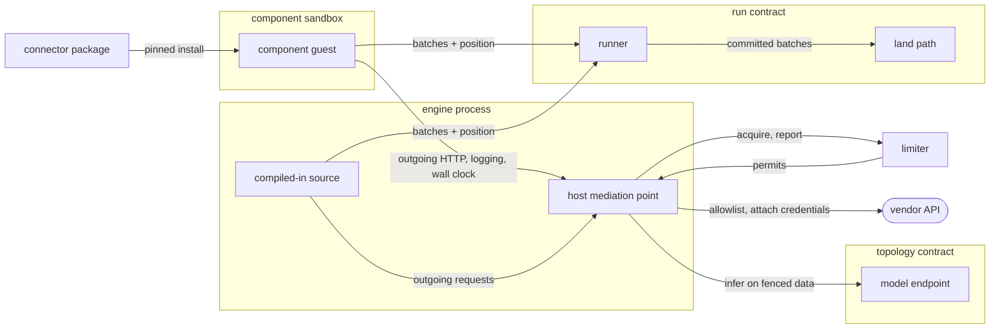
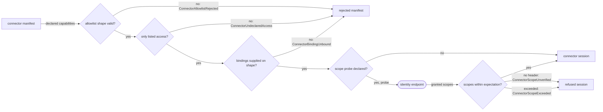
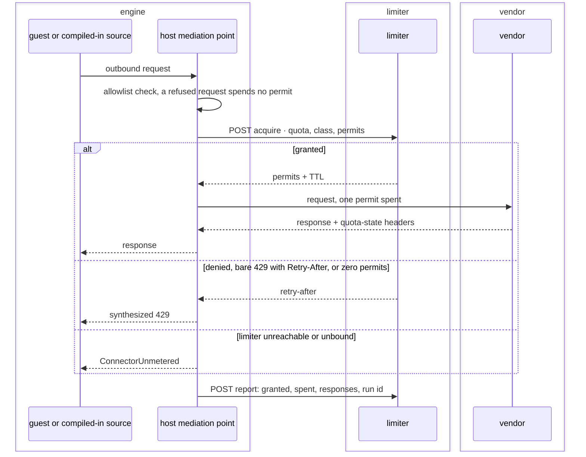
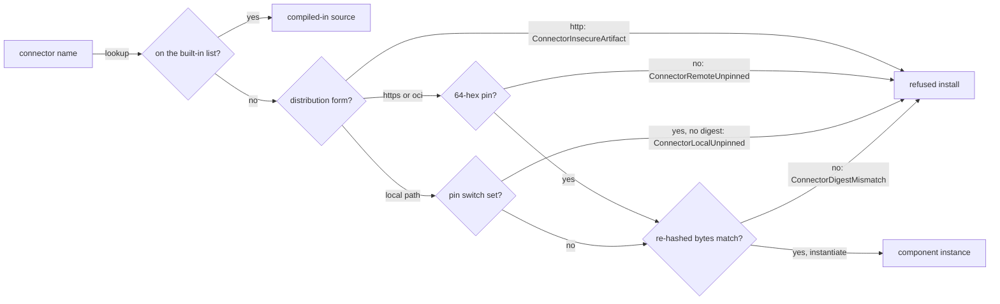
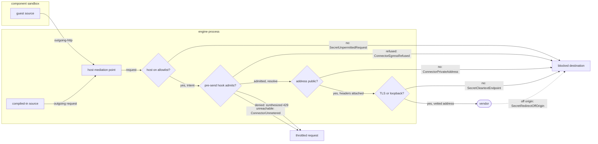

# Connectors and the built-in sources

A connector is the one way data enters the run path from outside. This file states the
interface a connector answers, the host access it declares, the quota it reserves against,
the model egress it reaches, the bytes it resolves from, and the behavior of the sources
compiled into the engine. How a credential reaches a request is in `spec/41-secrets.md`.

The two connector forms, the host between them and the outside, and the contracts they meet:



## export

The calls a connector offers across the boundary: the shared types, the source and destination worlds, the optional worlds, the compiled-in sibling.

- `authoring-path` — Every connector implements one trait, as a component sandboxed in the host runtime or as a native sibling compiled into the binary. Dispatch carries no branch naming which of the two it calls.
  *A-connector*
- `type-taxonomy` — The shared types interface carries a schema (name, fields, primary key) and a field (name, data type, nullability) over `boolean`, `int32`, `int64`, `float64`, `string`, `bytes`, `timestamp-millis` and `json`.
- `batch-encoding` — A batch crosses the boundary as Arrow IPC bytes, and a position as opaque bytes beside a declared cursor kind.
- `arrow-types` — The host reads an Arrow `Binary` or `FixedSizeBinary` column as bytes of that width and a `FixedSizeList` of `Float32` or `Float16` as that vector, each landing in its {{store.reconcile.binary-and-vector}} type, never as text.
- `nested-value` — A nested value rides as `json` and takes its type at the normalize stage. The interface carries no recursive type definition.
- `guaranteed-type` — A guest declares the type it guarantees after its own parsing — `int64` for a count, `float64` for money and a rate — and lands null, never zero, for a spelling it cannot read.
  *because a text column pushes a cast into every downstream read*
- `read-handle` — A source exports its cursor kind, a discovery call, and an open call taking a table and an optional position. The handle's `next` yields one batch or exhaustion; its `position` reports where it stands.
- `write-handle` — A destination exports `prepare`, `write`, `commit` and `abort`. Source and destination are separate worlds sharing the types interface.
- `optional-world` — Operator configuration and failure attribution are each an interface in an additional world, probed on the instance by name. A base-world guest instantiates untouched, and neither addition moves the world version.
- `partition-attribution` — A guest exporting failure attribution answers with the byte-exact values of the outermost partition column a failed read belongs to. The host reads it on failure and success alike; an empty list keeps the unattributed refusal.
  *because a read holding one partition back and landing the rest returns success*
- `attribution-budget` — Failure attribution carries at most 512 entries per session, each value at most 512 B.
- `native-read` — A native source reads a table from a position, returning batches each paired with the position after it. A source unable to bound a half-open chunk range falls back to the unbounded read.
  *because an overlapping read is recoverable and a mis-bounded chunk is not*
- `native-extra` — A native source may offer a content fingerprint from a stat or a head request, never a download, plus its connector identity, audit entries, and a declared reason its vendor traffic runs unmetered.
- `store-blindness` — A source receives credentials, limiter bindings, the run id, the request ledger, the component pin and the incremental position, and no store handle. A store-driven run receives its query set as run parameters.
  *P5*
- `world-authorship` — Bindings are emitted from a host-owned template over the input specification and the connector name. An author writes method bodies alone: authentication, paging and the cursor-kind declaration.

A connector failure crosses as a variant of {{run.retry.failure-taxonomy}}.

unsettled: How does a guest name the partitions a failed read belongs to when the failure is a shared credential rather than a per-tenant one? owner: connector affects: connector.export

## import

What crosses inward: the three host imports and the forwarded guest configuration table.

- `three-imports` — Both worlds import outgoing HTTP, logging and a wall clock, and nothing else. There is no filesystem import and no socket import.
  *A-connector*
- `empty-context` — A guest standard library pulling broader interfaces links against an empty context: no preopens, no environment, no arguments.
- `wait-primitive` — Neither world carries a monotonic clock or a sleep primitive, so a guest holds no call open across a wait.
- `forwarded-config` — The pipeline's guest configuration table is the one part of the source configuration crossing inward, as one JSON object delivered once per session ahead of discovery.
  *A-surface*
- `config-shape` — Ahead of any I/O, a guest configuration value that is not a table, a serialization over 64 KiB, or a credential or environment reference inside it raises `ConnectorConfigRejected`.
  *A-connector*
- `config-unclaimed` — Where the artifact is local and probed, a guest table declared against a guest exporting no configuration interface raises `ConnectorConfigUnclaimed`.
  *P1*
- `unusable-key` — A guest raises a permanent failure for a configuration key or value it cannot act on.
  *P1*
- `config-hashing` — The forwarded table folds into the connector's content hash; with no table forwarded, the artifact digest is that hash verbatim.

unsettled: How is a source's declared configuration key set enumerated, so an unknown key is answered at parse time rather than meaning the default? owner: connector affects: connector.import

## declare-capability

The manifest's statement of host access and the scope probe judging a bound credential's grant.

- `declared-grant` — A manifest lists the host access its code reaches for — outbound hosts, environment names, the wall clock — and the host decides the grant at load. There is no run-time permission request and no escalation path.
  *A-connector*
- `undeclared-access` — A connector reaching for access its manifest does not list fails to load, raising `ConnectorUndeclaredAccess` naming that access.
  *A-connector*
- `host-allowlist` — The outbound allowlist holds exact hosts and subdomain wildcards matched as suffixes; a wildcard entry covers subdomains and not the apex.
- `allowlist-shape` — An empty allowlist, a bare wildcard, an empty entry, and an entry carrying a scheme, port or path raise `ConnectorAllowlistRejected`.
  *A-connector*
- `environment-name` — A declared environment name is a name, not ambient access: the operator binds it to a reference and the host resolves and injects the value at call time. No connector reads the process environment.
  *A-connector*
- `ambient-authority` — No credential is a property of the process: no shared client carries a default header and no import returns secret bytes. Every grant binds to one declared host and attaches at request time.
  *A-connector*
- `scope-probe` — A manifest may declare an identity endpoint, the response header carrying granted scopes, and the grant it expects. The host calls it with the bound credential ahead of the first read.
- `probe-transport` — The scope probe's host sits on the allowlist and its scheme is TLS or loopback.
  *A-connector*
- `probe-shape` — A scope probe declaring a scopes header that is empty or not an HTTP field-name token raises `ConnectorScopeProbeRejected`.
  *because a header no response can carry refuses every session as though the vendor withheld the grant*
- `scope-exceeded` — A granted scope outside the declared expectation, compared byte for byte, raises `ConnectorScopeExceeded`, and the session does not open.
  *A-connector*
- `scope-unverified` — A probe response carrying no granted-scopes header, or one naming no scope or holding a byte outside visible ASCII, raises `ConnectorScopeUnverified`.
  *because cannot-verify is not verified*
- `environment-binding` — A source key binds from the environment as `<key>_from = "env:<NAME>"`. The engine enumerates the bindable keys in one place, each with its value shape: a scalar or a comma-separated list.
- `binding-unsupported` — A `_from` binding on a key the connector does not read raises `ConnectorBindingUnsupported`.
  *P3*
- `binding-unbound` — A bound key the environment did not supply, or supplied off its declared shape, raises `ConnectorBindingUnbound` at preflight.
  *P3*



unsettled: Does a community-distributed connector need a signing and transparency layer above the content pin, and who runs the log? owner: connector affects: connector.declare-capability

## meter

Reservation against a shared vendor quota and the one pre-send hook it implements: declaration, binding, the hook's position and intent, permits, denial and the usage report.

- `limiter-declaration` — A connector declares a limiter capability naming the shared vendor quota, the traffic class of its requests, and the vendor quota-state response headers to forward.
- `forward-credential` — A limiter declaration forwarding `authorization`, `proxy-authorization`, `cookie` or `set-cookie` raises `ConnectorForwardRejected` at load.
  *because the report carries forwarded headers verbatim to a party outside the vendor credential's scope*
- `limiter-binding` — The operator binds that quota name to an endpoint, a bearer token held by reference, and a permit batch size.
- `quota-unbound` — A declared quota with no binding raises `ConnectorQuotaUnbound` at load.
  *A-connector*
- `binding-transport` — A limiter endpoint that is neither HTTPS nor loopback or carries a query, fragment or userinfo, and a limiter token that is not a `secret://` reference, raise `ConnectorLimiterBindingRejected` at load.
  *A-connector*
- `limiter-address` — A limiter endpoint may resolve to a private or loopback address; the engine's check of vendor-host addresses does not apply to it.
  *because the operator authors the limiter endpoint and no vendor answer supplies it*
- `reservation-point` — The host reserves at the mediation point, the guest's outgoing-HTTP import or the engine's shared client. One permit covers one outbound request.
  *because one call issues any number of requests for paging, retries and token refresh*
- `permit-batch` — An acquire may grant a batch of permits under a short TTL. Each request spends one, and the next report surrenders the unspent.
- `acquire` — Acquire is an authenticated POST of quota, class and permit count, answered granted with permits and a TTL, or denied with a retry-after. A bare `429` with `Retry-After`, and a zero-permit grant, read as denials.
- `unreadable-answer` — A limiter response the engine cannot read raises `ConnectorLimiterUnreadable` and grants nothing.
  *A-connector*
- `denial-ceiling` — A limiter wait, whether a retry-after or a zero-permit grant's TTL, reads as at most the ceiling of {{run.retry.retry-after}}.
  *because an unbounded wait named by the limiter parks the run past any retry its schedule allows*
- `report` — Report is an authenticated POST of quota, class, granted, spent, one entry per vendor response (status, retry-after, verbatim headers), an observation instant and the run id.
- `report-delivery` — Report delivery is at-least-once under bounded backoff inside the run, and one attempt ahead of a refill; an undelivered report rides the next. A report that never lands is recorded in the run audit and fails nothing.
- `unmetered-request` — Under a declared limiter, a vendor request with no granted reservation raises `ConnectorUnmetered`, including when the limiter is unreachable, unbound or answers a failing status, which never reads as an expired vendor credential.
  *A-connector*
- `allowlist-precedence` — A request the allowlist refuses never reaches the limiter and spends no permit.
- `pre-send-hook` — Each outbound hop passes one pre-send hook after the allowlist and before name resolution, carrying the hop's intent: method, scrubbed URL, host, port, traffic class, run id and request body bytes.
  *A-connector*
- `hook-composition` — The limiter reservation is the hook's innermost implementation. An operator hook composes in front of it, so a request the operator hook refuses makes no limiter call and spends no permit.
  *A-connector*
- `hook-refusal` — A hook refusing an intent raises `ConnectorEgressRefused` naming the host and the hook's reason. No name is resolved, and the retry schedule never retries it.
  *P6*
- `hook-settle` — The hook receives each admitted hop's outcome after the body read or the failure: the status or transport failure, the request body bytes sent, and the response body bytes the host read. A followed redirect is two intents.
  *A-connector*
- `held-back-request` — A guest swallowing a held-back request still fails its call, and a fault inside the reservation machinery fails the request rather than passing it unmetered.
  *P2*
- `synthesized-throttle` — A denied reservation returns to the guest as a synthesized `429` carrying the retry-after. An unreachable limiter fails the request as a transport failure.
  *because a connector mapping vendor throttles needs no second interface*
- `replay-reservation` — Replay issues no outbound request and makes no limiter call.
- `built-in-grant-absent` — A compiled-in source reaching an outside vendor declares its grant in the pipeline's source configuration; the build raises `ConnectorGrantMissing` without it.
  *A-connector*
- `grant-unhonorable` — A declared grant on a compiled-in source that bypasses the mediated client raises `ConnectorGrantUnhonorable` at load.
  *A-connector*
- `metered-disclosure` — Where the project binds any quota, every compiled-in read records whether it ran metered, the run record states an unmetered read once, and validation warns per pipeline naming the connector.
- `counting-not-pricing` — The limiter counts requests and prices none.



## infer

Model egress: the single endpoint, the data fence and the trust label of model output.

- `model-endpoint` — Every model call resolves to one operator-configured OpenAI-compatible HTTP endpoint declared as a capability. The host owns the credential, rate limit and span; the component owns the prompt template and response schema.
  *A-topology*
- `mediated-call` — A model call sends through the mediated client under {{connector.attach.mediation-covers-every-egress}}, its allowlist the configured endpoint host alone, and passes {{connector.meter.pre-send-hook}} like a vendor hop.
  *A-connector*
- `vendor-sdk` — A model-vendor SDK in any workspace crate is refused as {{topology.compose.vendor-sdk}}, so a provider swap is a URL edit.
  *A-topology*
- `data-fence` — No ingested value reaches a model outside a data boundary: marker pairs whose opening marker carries the value's provenance label, a preamble declaring the blocks data, and a closing line restating the caller's rules.
- `fence-is-not-a-boundary` — The fence lowers the success rate of injected instructions and bounds nothing. No clause treats the output of a fenced call as trusted.
  *because spotlighting reduces injection and guarantees nothing*
- `output-taint` — Model output carries the least-trusted provenance label among its fenced inputs, and lands under that label.
  *because output re-landing as fresh data launders injected text*
- `provenance-order` — Provenance labels order by trust: `operator` above `ingested:first-party` above `ingested:third-party`. A call fencing no value carries `operator`.
  *because the least-trusted input is defined only over a total order, and a call fencing nothing sends the operator's template alone*
- `marker-derivation` — Every marker of one call carries one token of 16 B, derived from every label and value the call fences, as fenced.
  *because closing one's own block then requires content containing the digest of a batch that contains it*
- `replay` — The same values, labels, cap and rules fence to the same bytes, and a change to any value or label moves the token.
  *because a replayed call sends an identical prompt, and a token read from one batch closes no other*
- `fenced-value-hygiene` — Control characters other than newline and tab are stripped from a fenced value.
- `value-cap` — A value past its declared character cap keeps its first cap characters followed by a truncation mark, and the closing line still follows its block.
- `label-hygiene` — A provenance label is cut at 200 chars and flattened to one line without brackets, so it opens or closes no block.
  *because a label is built from connector-supplied table names and row ids*
- `empty-batch` — A call fencing no value renders an explicit no-data line, never an empty section.
- `operator-template` — The operator's prompt template stays unfenced in the system role. The idempotency hash covers the template alone.
  *because hardening the fence leaves a dedup key intact*

The zone a call's declared locality maps onto belongs to the `authority` contract; a
placement-filtered read consults that mapping, not the endpoint URL.

## package

Distribution form, digest pinning, per-connector resource bounds and world versioning.

- `distribution-form` — A connector resolves in one of four forms: in-tree by name, a project-local artifact path, an HTTPS URL, or an OCI reference.
- `remote-unpinned` — A remote artifact carrying no 64-hex content pin raises `ConnectorRemoteUnpinned` at parse.
  *A-connector*
- `insecure-artifact` — A plain-HTTP artifact reference raises `ConnectorInsecureArtifact`.
  *A-connector*
- `digest-mismatch` — The host re-hashes the resolved bytes and raises `ConnectorDigestMismatch` on a difference, before the bytes reach the engine.
  *A-connector*
- `pin-requirement` — Two switches require a pin on a local artifact, composed by disjunction: a store-wide policy key and a per-connector manifest flag.
- `local-unpinned` — With either switch set, an unpinned local artifact raises `ConnectorLocalUnpinned` at build, carrying the digest of the bytes found.
  *A-connector*
- `manifest-posture` — A manifest is adopted, carrying a digest built on the fixed builder platform, or a template, carrying the requirement plus a placeholder. A template parses cleanly and refuses at load.
- `posture-undeclared` — A manifest carrying neither a digest nor both template markers raises `ConnectorPostureUndeclared` at merge.
  *A-connector*
- `pin-verb` — `contextful connector pin <manifest>` builds the guest in a digest-pinned container on one fixed platform and writes the artifact and its digest. `--verify` rebuilds and compares without writing.
  *A-connector*
- `host-built-pin` — `--local` builds with the host toolchain and prints a host-local digest; writing a pin from a host build raises `ConnectorHostPinRefused`.
  *A-connector*
- `path-remap` — Every build remaps the source root and the package cache, so checkout location is not a digest input.
- `native-verification` — `--verify --native` checks host triple, compiler and package manager against pinned constants and clears byte-moving configuration before building. A mismatch exits with a status distinct from digest drift.
- `interpreted-target` — A host built with the `pulley` feature runs components on the interpreted target as portable bytecode, mapping no executable memory, under the same deadlines and mediated client; the compiled native target stays the default.
  *because a hardened runtime refusing writable-then-executable pages loads no compiled guest, and interpretation trades throughput for loading there*
- `interpreted-target-absent` — A host built without the `pulley` feature refuses the interpreted target at construction, naming the feature, before any component compiles.
- `component-source` — A pipeline source named by an artifact path, HTTPS URL or OCI reference runs as a component, its config reading `sha256`, `allow`, `attach`, `guest`, `memory_bytes` and `require_pin`, the manifest flag of {{connector.package.pin-requirement}}.
- `component-load` — `pipeline run` resolves a component source, admits it against its pin and compiles it once per fire, before any run row, and records its {{connector.import.config-hashing}} content hash as each run's connector hash.
  *A-connector*
- `component-grant` — A component session's grant is its declared `allow` hosts and `attach` headers alone, each header hydrated per request under {{connector.resolve.hydration-is-just-in-time}}; a source declaring no `allow` reaches no host.
  *A-connector*
- `component-validate` — `pipeline validate` loads a local component artifact from the directory `pipeline run` resolves it against and runs discovery, so a missing export or a world mismatch fails before any run; a remote artifact is checked without I/O.
  *P1*
- `component-position` — `incremental` beside a component source raises `ConnectorPositionOwned` at validation; the guest's opaque cursor is the run's position.
  *because a watermark over one field replaces the cursor the guest resumes from, so its next read opens at a position it never reported*
- `component-target` — `pipeline run` and `pipeline validate` compile components for the interpreted target when `--component-target pulley` or `CONTEXTFUL_COMPONENT_TARGET=pulley` selects it; native stays the default.
- `linear-memory` — A connector runs under 256 MiB of linear memory by default, raised per connector to at most 2 GiB.
- `call-deadline` — A read call carries a 30 s wall-clock deadline and a discovery call a 60 s one, armed by epoch interruption at 100 ms granularity.
- `session-budget` — A session carries a 1 MiB logging budget, dropping and counting messages past it, and holds at most 8 requests outbound at once.
- `request-body` — A guest's outbound request body carries at most 8 MiB. The host stops reading past it and fails the call as a deterministic refusal before the request reaches the vendor.
  *because the body buffers in host memory, outside the guest's linear-memory cap*
- `world-compatibility` — Compatibility is semver over the world: a guest built against one minor loads on any host advertising a compatible minor.
- `world-drain` — On a major world bump no new run admits against the old world, in-flight runs complete or suspend on the world they pinned, and the old world then retires.
  *A-connector*
- `live-reresolution` — Re-resolving or reloading a connector while a journaled run holds it raises `ConnectorHotReload`; a new version applies to runs admitted after it.
  *A-connector*
- `built-in-registry` — The names resolving to compiled-in sources form one enumerated list. A listed name carries no manifest or artifact, and a feature-gated entry stays listed and answers with a rebuild hint.

A connector striking a declared bound follows {{run.retry.bound-hit-is-transient}}.



unsettled: How does a fire fetch a remote component artifact, over the mediated client for HTTPS and with which registry credential and layer for OCI? owner: connector affects: connector.package

unsettled: Does `connector pin` record a precompiled artifact per target under its own digest, so a hardened build links no compiler and deserializes only pinned bytes? owner: connector affects: connector.package

unsettled: Which generation of the sandbox interface does the guest world target, and what does native async change about the per-call deadline and the reservation bridge? owner: connector affects: connector.package

## source

The declared behavior of each source compiled into the engine.

- `http-headers` — The generic HTTP source binds credentials through a `headers` table whose values are templates in the {{connector.reference.value-template}} grammar, hydrated per read.
  *A-connector*
- `body-format` — `format` selects the `contextful-decode` decoder — `json` by default, `jsonl`, `csv` or a workbook — and one decoder serves the HTTP, file and object sources. Over HTTP the format is explicit; file sources infer it from the extension.
- `format-key-mismatch` — A JSON record path, a pagination shape, or a decode key declared against a format that does not read it raises `ConnectorFormatKeyRejected` at build.
  *P1*
- `delimited-cell` — A delimited source lands every cell as a string and an empty unquoted field as null.
  *because a dimension file's schema then depends on no data*
- `declared-encoding` — A non-UTF-8 delimited body decodes through a declared encoding label, and bytes invalid under it raise `ConnectorEncodingInvalid`.
  *P1*
- `clock-column-spelling` — A delimited clock column other than an RFC 3339 instant or a fixed-width digit stamp raises `ConnectorClockColumnRejected`.
  *because the watermark compares text*
- `pagination` — A walk declares exactly one pagination shape: a page parameter with a start page, a next-cursor path with a cursor parameter, a next-URL path, or link-header following.
- `pagination-ambiguity` — Declaring two pagination shapes raises `ConnectorPaginationAmbiguous`.
  *P1*
- `page-cap` — One walk issues at most 1000 requests.
- `page-loop` — A vendor returning a token or link it already served raises `ConnectorPageLoop`.
  *P4*
- `next-link-origin` — A vendor-supplied next link is judged as a hop under {{connector.attach.weakened-hop}}.
  *A-connector*
- `table-pattern` — A table pattern binds table-name segments into the request URL, percent-encoded, and each table holds its own position.
- `table-unmatched` — A table not matching the declared pattern, or binding `.` or `..` into a placeholder, raises `ConnectorTableUnmatched` ahead of any request.
  *P1*
- `placeholder-unbound` — A URL placeholder with no pattern to bind it raises `ConnectorPlaceholderUnbound` at build.
  *P1*
- `expansion` — An expansion block names its pointer as a URL template over the landed row's scalar columns, percent-encoded, or as a column holding a URL, and names the column the fetched document lands under.
- `pointer-ambiguity` — Declaring both pointer forms raises `ConnectorPointerAmbiguous`.
  *P1*
- `expansion-order` — Expansion runs after the watermark filter, and follow-ups are issued one at a time.
  *because a rejected row then costs no vendor request and no batch bursts one host*
- `follow-up-failure` — A failed follow-up raises `ConnectorExpansionFailed` for the whole read.
  *because a position committed past a row missing its detail strands that row*
- `expansion-budget` — One expanding read issues at most 200 requests of follow-up, judged before the first, buffers at most 256 MiB, and runs at most 600 s. Each budget refuses rather than truncating.
  *P4*
- `template-shape` — A pointer template carrying no placeholder, or binding one into the URL authority, raises `ConnectorTemplateRejected` at build.
  *because a response body then names a credential's destination*
- `pointer-column-missing` — A placeholder naming a column the rows lack, or carry as an array, raises `ConnectorPointerColumnMissing` on the first row, ahead of its request.
  *P1*
- `target-column-occupied` — A target column any landed index row already carries raises `ConnectorTargetColumnOccupied` ahead of the walk.
  *P1*
- `walk-boundary` — A directory walk reaches the configured root and nothing outside it, skips dot-entries, and traverses in sorted order. A decode-selecting key narrows nothing.
  *because a sorted walk over an unchanged tree reproduces across hosts*
- `declined-tally` — A directory walk records on the run record what it declined, tallied by extension.
  *P4*
- `object-address` — The `s3` source reads one `bucket` by exactly one of `key` or `prefix`; declaring both or neither raises `ConnectorObjectAddressRejected` at build.
  *because a key beside a prefix leaves which objects land to a guess, and neither names no object*
- `prefix-listing` — A prefix read lists every key under the prefix in key order, narrowed by an optional `suffix`, and lands each object through one decoder. `pick = "latest"` lands the greatest listed key alone.
- `object-gzip` — `compression = "gzip"`, or a key ending `.gz` with `compression` undeclared, decompresses an object before decode; `compression = "none"` reads it as stored.
- `object-expansion` — One object decompresses to at most 256 MiB, counted as the bytes arrive. Past it the read refuses whole, naming the object, and lands nothing.
- `object-unreadable` — An object a decoder cannot read refuses the whole read under {{run.land.unreadable-input}}, naming it as `s3://<bucket>/<key>`, and no other object of the read lands.
- `etag-skip` — With `skip_unchanged = true`, the object source's position maps each object key to its ETag in place of {{run.advance.skip-unchanged}}'s digest; an object whose ETag matches lands nothing, and a read matching every object closes a zero-row success.
- `object-credentials` — The `s3` source's `access_key_id` and `secret_access_key` each hold one `secret://<name>` reference, declared together and hydrated per read; undeclared, requests go unsigned. A literal in either is refused under {{connector.reference.material-in-a-declaration}}.
- `object-transport` — The `s3` source presigns each request through the S3 bucket adapter of {{store.endpoint.addressing}} and sends it through the mediated client, allowlisting the endpoint host alone; a skip compares listed or head-request ETags and downloads no object.
  *because one S3 client then signs every bucket request while the mediated client stays the one attachment point for source egress*
- `object-cleartext` — An `s3` source binding a key pair to a cleartext endpoint off loopback is refused at build under {{connector.attach.cleartext-endpoint}}.
  *because a presigned URL is a bearer capability for its lifetime*
- `object-position-owned` — `incremental` beside `skip_unchanged = true` on the `s3` source refuses as {{connector.package.component-position}} at validation.
- `document-grain` — A document source lands one row per page, or one row per heading past a length threshold. With a base URL, each row links to its own page anchor.
- `document-identity` — A document row's identity is a slug plus an ordinal, chunked or not.
  *because an identity then survives a document crossing the threshold*
- `document-unreadable` — An encrypted document, and one with no extractable text on any page, is unreadable input under {{run.land.unreadable-input}} and never lands as empty pages.
  *P2*
- `frontmatter-shape` — A nested map, a block scalar, or a key carrying the reserved producer prefix in a note's frontmatter raises `ConnectorFrontmatterRejected`.
  *A-connector*
- `conversion-required` — A compound-binary office container, detected by magic bytes as well as extension, raises `ConnectorConversionRequired` naming the conversion command.
  *A-connector*
- `parse-containment` — A compiled-in source decodes behind {{run.land.parse-boundary}}.
  *A-connector*
- `office-part-selection` — An office container is read by exact part name. No other part is opened and no external entity is resolved.
  *A-connector*
- `decompression-budget` — A multi-part office read decompresses at most 64 MiB in total, judged against the archive directory's claim and against the bytes that arrive.
  *A-connector*
- `worksheet-landing` — One worksheet read holds at most 64 MiB — resolved cell text and keys, plus 32 B for each shared string and each stored cell, counted as they land — and lands at most 1048576 rows.
  *because shared-string fan-out turns a small input into an unbounded output*
- `cell-out-of-range` — A cell holding a value past the header's width raises `ConnectorCellOutOfRange`; a cell holding none widens nothing.
  *A-connector*
- `external-reference` — An external-reference declaration, an external-links part, or a relationship marked external raises `ConnectorExternalReference`.
  *A-connector*
- `workbook-cell-typing` — A workbook cell lands as a string and a date cell as its serial number. No formula is evaluated; a formula cell lands its cached value.
  *A-connector*
- `workbook-incremental` — An incremental position against a workbook raises `ConnectorIncrementalUnsupported`.
  *because a variable-width serial number advances a lexicographic watermark past unlanded rows*
- `report-id-commit` — An async-report source commits the vendor's run id the instant creation returns it. An exhausted polling budget ends the read successfully, and an expired vendor run is recreated for the same window.
  *P4*
- `page-drain` — Report paging drains a fixed number of pages per read, one batch per page, each carrying the position after it.
- `page-cursor-missing` — A response announcing another page while naming its cursor in neither the cursor field nor the next link raises `ConnectorPageCursorMissing`.
  *P4*
- `report-watermark` — Report watermarks are held per partition — account, grain, breakdown and any split dimension — as a versioned map inside one position.
- `partition-isolation` — A retryable failure on one partition holds it at its committed position and keeps the pages other partitions drained.
  *P4*
- `metric-grain` — A metric read at a grain where the vendor estimates rather than computes it raises `ConnectorMetricGrainRejected`.
  *P4*
- `restated-window` — A caught-up partition re-opens its lookback window every run, the pull window is at least that wide, and each row carries a deterministic key over partition, entity, date and breakdown.
- `report-event-time` — A report row's event time is an RFC 3339 instant at midnight UTC of the window-start day, null where the vendor gave no usable date.
- `ordering-column` — Ordering a report stream by the engine-injected ingest stamp raises `ConnectorOrderingColumnRejected`.
  *because a late seed then outranks a live restatement*
- `field-drift` — Report rows stay untyped JSON into the batch, and throttling is recognized from a throttle status or from an error body carrying a throttle code.
- `report-auth` — An authentication failure on a report read raises `ConnectorAuthTerminal`, terminal against the retry schedule.
  *P6*
- `image-row` — An image source lands path, content hash, header width and height, embedded capture instant, file modification time, a modality marker and a null body. No pixel decode runs on ingest.
- `image-header` — An image header that does not parse raises `ConnectorImageHeaderUnreadable` naming the path.
  *A-connector*
- `quotability-marker` — Whatever fills an image body records in a companion column whether the text is verbatim extraction or a model's reading.
- `marker-body-pairing` — An image body and its quotability marker that are not null together raise `ConnectorQuotabilityMismatch`.
  *A-connector*
- `search-config` — The search source takes a driver, a query, a freshness window and a result ceiling, landing one row per result. Its cursor kind is snapshot-id, keyed on the result URL.
- `provider-origin` — Each search provider's host is pinned at the call site; a non-TLS transport or another host raises `ConnectorProviderOriginRejected`, loopback excepted.
  *A-connector*
- `search-degradation` — An absent provider key and a provider `5xx` are transient failures yielding a zero-row outcome, and a replay returns the journaled result set.
- `poll-only-increments` — Incremental loading is a scheduled poll. A replication socket held open is not a source read.
  *because its output is unbounded and has no recorded exchange to replay*
- `twin-api` — A source reading through an API licensed to see what no individual user sees raises `ConnectorTwinApiSource`. A sanctioned, disclosed organization-wide export path is admitted.
  *A-read*
- `drive-walk` — The drive source walks the tree under `folder_id` breadth-first through `files.list`, paging each folder, within `drive_id` when declared. Each folder is listed once, its children sorted by name and id; no shortcut is followed.
  *because the source keeps a per-file position and mints its token host-side, which a guest holding no credential bytes cannot*
- `drive-root` — A `folder_id` naming no folder, or one outside a declared `drive_id`, fails the read as a configuration fault before any listing.
- `drive-tables` — The drive source serves `files`, one row per file keyed by `file_id` with its version, name, path from the root, MIME type, `modifiedTime`, Drive's `md5Checksum` and the SHA-256 of the bytes read, and `pages`.
- `drive-table-unmatched` — A drive table other than `files` or `pages` refuses as {{connector.source.table-unmatched}}, ahead of any request.
- `drive-export` — A Google Doc, Sheet or Slides deck lands as its `files.export` PDF and any other file as its `alt=media` bytes; another Google-native type lands a `skipped` reason and no bytes.
- `drive-page-grain` — A PDF body lands one `pages` row per page under {{connector.source.document-grain}}, decoded behind {{run.land.parse-boundary}}; bytes land in no column.
  *because a page is what retrieval ranks and a citation names, and the digest identifies the bytes without a second copy of the file*
- `drive-file-cap` — A file over `max_file_bytes`, 64 MiB by default, lands its file row with a `skipped` reason naming the cap and no pages. No byte past the cap is read, and the read continues.
  *because a row naming the skipped file answers for it, where truncated bytes read as the whole document*
- `drive-unreadable` — A PDF body failing to decode behind {{run.land.parse-boundary}} lands its file row with a `skipped` reason naming the failure and no pages, and the read continues.
  *because one unreadable file failing the fire holds back every other file's row and the position behind them*
- `drive-skip-count` — Each drive pull reports the files it lands with a `skipped` reason as its {{run.record.skipped-count}}, so a fire's `files` run and `pages` run each carry the tally.
- `drive-incremental` — The drive position holds each file's `modifiedTime`, path and page count. A read re-lands a file whose time or path changed, and lands a tombstone for a file gone from the tree and for each page past its new count.
- `drive-fire` — One fire shares one minted token, one walk and one read of each file's bytes across the `files` and `pages` tables.
- `drive-oauth` — The drive source mints its access token from a refresh token and client credentials bound as `secret://` references, once per fire and again on a `401`, holding it in memory and writing it to no store, journal or record.
  *because Google's refresh token does not turn over, so the minted token is the one rotating material, and it lapses within the hour*
- `drive-oauth-shape` — `oauth.refresh_token`, `oauth.client_id` and `oauth.client_secret` each hold one `${secret://<name>}` reference and nothing else, checked before any request.
- `drive-origin` — The drive API and token endpoints are `www.googleapis.com` and `oauth2.googleapis.com` over TLS on the default port; another host, port or scheme refuses as {{connector.source.provider-origin}}, loopback excepted.
- `drive-position-owned` — `incremental` beside the drive source refuses as {{connector.package.component-position}} at validation.

## Shapes

A drive source, built with the `drive` feature:

```toml
[[pipeline]]
id = "team"
tables = [{ name = "files", primary_key = ["file_id"] }, { name = "pages", primary_key = ["file_id", "page"] }]

[pipeline.source]
name = "drive"

[pipeline.source.config]
folder_id      = "1AbCdEfGhIjKlMnOp"
drive_id       = "0AExampleDrive"             # a shared drive; absent for a folder in My Drive
max_file_bytes = 33554432

[pipeline.source.config.oauth]
refresh_token = "${secret://drive-refresh}"
client_id     = "${secret://drive-client-id}"
client_secret = "${secret://drive-client-secret}"
```

A connector manifest in the adopted posture:

```toml
name    = "vendor-metrics"
version = "1.4.0"
world   = "source-connector@1.2.0"

wasm             = "vendor-metrics.wasm"
wasm_sha256      = "9f2c1b7ad0e4…"         # 64 hex, written by `connector pin`
require_wasm_pin = true

[capabilities]
allow_hosts = ["api.vendor.example"]      # one exact host: [attach] binds a credential
env         = ["VENDOR_ACCOUNT_ID"]
clock       = true

[capabilities.scope_probe]
endpoint      = "https://api.vendor.example/v1/identity"
scopes_header = "X-Granted-Scopes"
expect        = ["reports.read", "accounts.read"]

[capabilities.limiter]
quota         = "vendor-app-shared"
class         = "batch-read"
usage_headers = ["X-RateLimit-Remaining", "X-RateLimit-Reset"]

[attach]
Authorization = "Bearer ${secret://vendor-token}"

[bounds]
memory_bytes = 268435456
```

The world:

```wit
package contextful:connector@1.2.0;

interface types {
  record schema       { name: string, fields: list<schema-field>, primary-key: list<string> }
  record schema-field { name: string, ty: data-type, nullable: bool }
  enum   data-type    { boolean, int32, int64, float64, string, bytes, timestamp-millis, json }
  record cursor       { kind: cursor-kind, bytes: list<u8> }
  variant error {
    transient(string), permanent(string), auth-expired(string),
    rate-limited(u32), schema-incompatible(string),
  }
}

world source-connector {
  import wasi:http/outgoing-handler;
  import wasi:logging/logging;
  import wasi:clocks/wall-clock;
  export source: interface {
    cursor-kind: func() -> cursor-kind;
    discover: func() -> result<list<schema>, error>;
    open: func(table: string, from: option<cursor>) -> result<read-handle, error>;
  }
}

world configurable-source-connector { include source-connector; export config: interface { … } }
world attributing-source-connector  { include source-connector; export attribution: interface { … } }
```

The limiter wire:

```http
POST /v1/acquire   {"quota":"vendor-app-shared","class":"batch-read","permits":32}
200                {"granted":true,"permits":32,"ttl_ms":15000}
429 Retry-After: 4 -> a denial

POST /v1/report    {"quota":"vendor-app-shared","class":"batch-read","granted":32,"spent":19,
                    "run_id":"run_5f1c","observed_at":"<instant>",
                    "responses":[{"status":200,"retry_after":null,"headers":{…}}]}
```

One outbound request, end to end:


