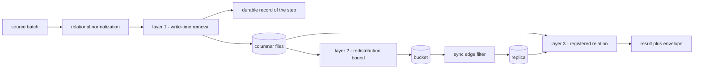
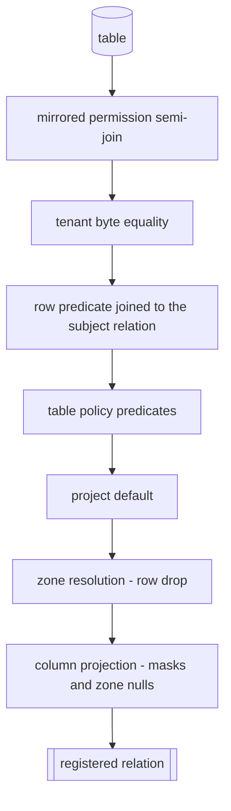
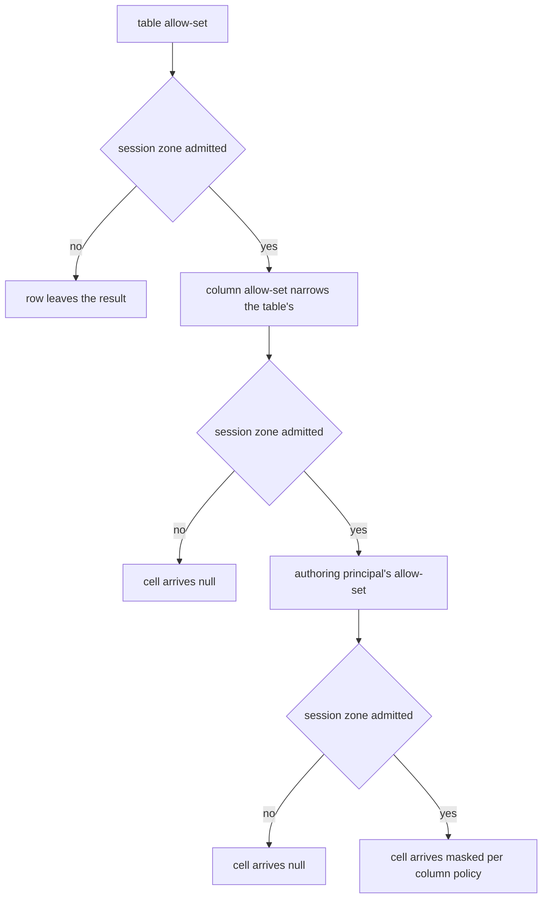
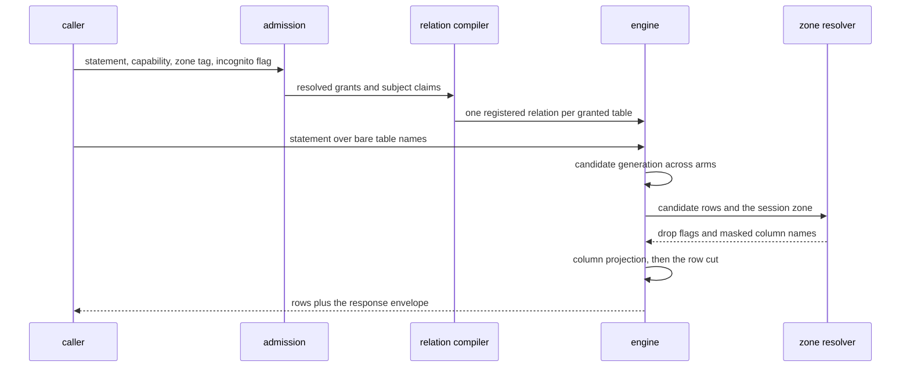

# Enforcement and inference placement

Three layers stand between a stored row and a caller: removal at write time, a
redistribution bound at sync, and a compiled relation at query time. Together they are
the reference monitor. This file states what each layer does, the order the compiled
relation applies, the grammar of an inference zone, and where the data plane runs.

The grant fields a compiled relation reads are [`40-authority.md` § Grant
shape](40-authority.md); a session arrives here with its restrictions already resolved.
The audit entry each decision below records is [`44-accountability.md` §
Span](44-accountability.md); a reader asking what a session saw reads that entry, not
this file. The theorems stating this composition's negative space are [`60-formal.md` §
Layer composition](60-formal.md), which publishes alongside each theorem the statement it
leaves unproven.

## Parties

| Party | Obligation |
| --- | --- |
| **The reference monitor** | Mediates every row a caller reads and every cell a caller receives through the three layers, in one implementation. Treats a path arriving at stored rows outside that implementation as a defect, rather than as a documented boundary. |
| **The writer** | Applies declared removal before columnar bytes land and before the run path records the step, after relational normalization has shredded structured values into child tables. |
| **The relation compiler** | Builds one registered relation per granted table for the calling session, carrying the mirrored semi-join, the tenant equality, the row predicate, the table policy, the project default and the column projection in a fixed order. |
| **The push side** | Holds back every object of a table whose redistribution flag is clear, ahead of the object diff, and reports objects an earlier push left addressable in the bucket. |
| **The caller** | Declares an inference zone, an incognito flag and a capability on each request. A declaration is a claim carried into the audit record rather than an identity. |
| **The operator** | Declares column masks, zone allow-sets, per-principal policy and residency regions in the manifest. Every consequence is derived from those declarations. |
| **The runtime** | Resolves declared policy at boot, halts on a configuration whose resources resolve outside the declared region, and signals once where a development key stands in for a project key. |

## Operations

| Operation | What it governs |
| --- | --- |
| `redact` | Removal and transformation inside the writer, ahead of columnar bytes and ahead of the durable record of the step. |
| `compose` | The three layers as one monitor, the order a registered relation applies, and where the single pass sits inside a ranked read. |
| `filter-rows` | The typed predicate grammar, the binding of subject claims, the tenant equality, and the project default. |
| `mask` | Column strategies and their combines, the guardrails over an exhaustible value space, the project pepper, and how a masked relation behaves under caller SQL. |
| `refuse` | The two shapes an unauthorized read takes, the scope guard's decidable cases, and what a refusal discloses about data it withheld. |
| `bound-redistribution` | The per-table licence bound applied at push, the root-object allowlist, and the per-token filter a serving edge applies. |
| `place` | Inference zones: their grammar, their composition across grains, the floors, incognito, and the serve-time outcome. |
| `reside` | Where the data plane runs, the region allow-set gating placement, and operation with no external reach. |
| `resist` | The adversary-facing placement rules — where enforcement sits relative to the prompt, and which paths stay closed to an injected instruction. |

## Clauses — redact

The first layer runs inside the writer. What it removes leaves no copy anywhere downstream.

| Clause | Statement | decided-by |
| --- | --- | --- |
| `enforcement.redact.workflow.write-time-removal` | Redaction runs inside the writer ahead of columnar encoding, with two operations selectable per declared rule: a drop, where no cell ever holds the value, and a transform, where a policy-defined substitute — a keyed digest, a token, a prefix, a generalized band — occupies the cell. | |
| `enforcement.redact.invariant.pipeline-wide-rules` | A rule set is declared on a pipeline and binds every table that pipeline lands, child tables included. | |
| `enforcement.redact.invariant.stage-follows-normalization` | The stage runs after relational normalization has shredded structured values into child tables, so a value reachable through a child table alone is reached by the rule naming its parent. | |
| `enforcement.redact.invariant.value-precedes-the-durable-record` | A value this layer removes is absent from the run path's durable record. Replay returns the recorded output and repeats no side effect, so one recording is a permanent recording, and the record rather than the destination is the boundary this layer holds. | |
| `enforcement.redact.refusal.rule-over-a-recorded-source` | Declaring removal rules over a source whose pulls are recorded verbatim raises `EnforceRedactionOnRecordedSource`, before that source is first read. | `0213` |
| `enforcement.redact.invariant.refetch-replaces-replay` | A table under removal rules gives up replay-without-refetch: re-running its pipeline reaches the source again. | |
| `enforcement.redact.invariant.stolen-credential-yields-removed-bytes` | A stolen object-store credential yields columnar bytes with the value already gone, for columns handled at write time whose sidecar indexes encrypt under the table's own key-management key. | |
| `enforcement.redact.invariant.query-time-leaves-cleartext` | A column protected at query time alone sits in cleartext inside the stored bytes, and the object-store credential reveals it. | |
| `enforcement.redact.refusal.index-over-a-removed-column` | Declaring a vector graph, a full-text segment set, a bloom filter or a zone map over a column removed at write time raises `EnforceIndexOverRemovedColumn`. An index built from the original values reconstructs what the rule took out. | `0214` |
| `enforcement.redact.invariant.summarize-only-retains-the-text` | A column carrying the summarize-only flag stores its text whole, since grounding and citation read that text, and the release bound binds on the way out instead. The flag lands at write time and travels with the column, so a surface added later inherits that bound without consulting the pipeline that produced the rows. | |
| `enforcement.redact.limit.rules-per-pipeline` | A pipeline carries at most 256 entries in its removal rule set. | |
| `enforcement.redact.shape.rule-row` | A rule names a table, a column, one operation, and the argument that operation takes. | |

## Clauses — compose

The relation compiler assembles the query-time layer. The candidate set this single pass
runs over is [`20-read.md` § Candidate generation](20-read.md), and the pass finishes
inside the same statement that produced those candidates.

| Clause | Statement | decided-by |
| --- | --- | --- |
| `enforcement.compose.invariant.three-layers` | The reference monitor is exactly three layers: removal at write time, the redistribution bound at sync, and row-and-column restriction at query time. A request is authorized at each in turn, so a credential stolen at one buys nothing at the next two. | |
| `enforcement.compose.invariant.complete-mediation` | Calling this stack a reference monitor imports the always-invoked obligation. A code path that arrives at stored rows without traversing the layers is a defect by definition and never a documented limitation. | |
| `enforcement.compose.refusal.unmediated-path` | A read arriving at stored rows outside a registered relation raises `EnforceUnmediatedPath`. | `0215` |
| `enforcement.compose.invariant.single-owning-module` | One module owns the decision. Where a gateway and the engine reach the same verdict they execute that module, compiled native and compiled to WebAssembly from the same pinned source. | |
| `enforcement.compose.refusal.second-verifier` | A second implementation of any part of this decision, in another language or another crate, raises `EnforceSecondVerifier`. | `0216` |
| `enforcement.compose.invariant.protection-is-a-rewrite` | Protection is applied as transformation in the data plane — predicates compiled into the statement, column projections rewritten, a per-token filter at the sync edge, zone floors. Admission decides whether a request enters and applies no transformation of its own. | |
| `enforcement.compose.shape.relation-order` | A registered relation composes, in order: the mirrored permission semi-join, the tenant equality, the row predicate joined against the subject relation, the table policy, the project default, then the column projection. | |
| `enforcement.compose.invariant.conjunctive-narrowing` | Layers conjoin. A row surviving the composition survives each layer taken alone, and appending a layer removes rows and adds none. | |
| `enforcement.compose.invariant.pass-precedes-the-cut` | The single pass completes before the ranked result is cut to its requested size, so a caller draws no inference from a position a withheld row would have taken. | |
| `enforcement.compose.invariant.vector-arm-rejoins` | A sidecar vector index is not a relation. Its arm returns candidate identifiers, and those identifiers re-join through the registered relation before the arm contributes anything to a result. | |
| `enforcement.compose.invariant.every-face-reads-the-registration` | Every surface returning rows reads the registered relation by the table's bare name. Lexical, keyword-scored, vector and fused arms inherit the whole composition beneath the row bound, since it lives in the relation rather than in a clause each arm remembers, and an arm added later inherits it without naming it. | |
| `enforcement.compose.invariant.replica-is-constrained-again` | A caller already holding a filtered replica is constrained a second time, per query, with the bytes of that replica unchanged. | |
| `enforcement.compose.invariant.order-is-not-commutative` | Restricting rows on a column and then masking that column differs in result from masking it and then restricting. The composed order is the specified one, and no commutativity is claimed. | |
| `enforcement.compose.interface.registered-relation` | The compiler emits one relation per granted table, bound to that table's bare name inside the session, for the lifetime of the session. | |
| `enforcement.compose.workflow.session-build` | A session builds its relations at admission from resolved grants, and rebuilds them when a revocation or a manifest change invalidates a grant it holds. | |
| `enforcement.compose.limit.relations-per-session` | A session carries at most 1024 entries in its relation set. | |
| `enforcement.compose.invariant.mirrored-join-leads` | The permission semi-join derived from a source's own access lists is conjoined ahead of everything the operator wrote. Its construction is [`42-visibility.md` § Mirrored permissions](42-visibility.md); a row the source hides stays hidden whatever the local policy says. | |

## Clauses — filter-rows

A row predicate decides membership. Subject values reach it as bound parameters rather than as text.

| Clause | Statement | decided-by |
| --- | --- | --- |
| `enforcement.filter-rows.shape.predicate-grammar` | A row predicate is a typed boolean subset of SQL: column references, comparison operators, conjunction, disjunction, negation, membership lists, pattern matching, null tests, and scalar functions declared safe. | |
| `enforcement.filter-rows.invariant.parsed-at-manifest-load` | Each predicate parses to a tree when the manifest loads, so a malformed one is discovered by the process reading the declaration rather than by the first caller. | |
| `enforcement.filter-rows.refusal.term-outside-the-grammar` | A predicate referencing anything the grammar omits raises `EnforcePredicateOutsideGrammar`, naming the offending node. | `0217` |
| `enforcement.filter-rows.interface.subject-relation` | Subject claims reach a predicate through a session-scoped subject relation, bound as prepared-statement parameters and joined against. A principal value carrying SQL syntax stays a value: it occupies a parameter slot and reaches no parser. | |
| `enforcement.filter-rows.refusal.interpolated-claim` | Splicing a subject claim into SQL text anywhere in the runtime raises `EnforceInterpolatedSubjectClaim`, and the gate rejects the change that introduced it. | `0218` |
| `enforcement.filter-rows.invariant.join-pushes-down` | The engine pushes the subject join into the scan, so a restricted scan costs what an unrestricted one costs in the common case. | |
| `enforcement.filter-rows.invariant.narrowing-order` | Predicates narrow in order: the credential's own predicate, then table-level predicates whose subject condition matches, then the project default. | |
| `enforcement.filter-rows.invariant.matched-override` | A table-level predicate declaring an override for a matching subject condition widens its own arm and reaches no other arm of the conjunction. | |
| `enforcement.filter-rows.invariant.default-is-deny` | No grant match yields no rows. A table reached with nothing matching produces an empty result rather than its contents. | |
| `enforcement.filter-rows.invariant.tenant-equality-is-engine-applied` | A tenant-scoped grant compiles a bound-parameter byte equality on the tenant-scope column, conjoined ahead of any table-level policy. | |
| `enforcement.filter-rows.invariant.isolation-survives-a-forgotten-clause` | The tenant equality is never a clause the consumer's statement is trusted to carry, so an author who omits one loses no isolation and a consumer keeps one isolation control instead of two, deleting its own per-row re-check. | |
| `enforcement.filter-rows.interface.exception-condition` | A predicate carries exception conditions written as boolean expressions over subject fields, parsed by the grammar above and bound by the same parameter mechanism. | |
| `enforcement.filter-rows.limit.predicate-size` | A single declared predicate holds at most 4 KiB of source text. | |
| `enforcement.filter-rows.limit.membership-list` | A membership list inside a predicate holds at most 512 entries. | |

## Clauses — mask

A mask decides what a cell carries once its row has survived. Six strategies, one flag,
and the combines that make a digest safe over a small value space.

| Clause | Statement | decided-by |
| --- | --- | --- |
| `enforcement.mask.shape.strategies` | Six strategies exist: drop, keyed hash, format-preserving tokenization, truncation to a leading character count, bucketing into a generalized band, and numeric range generalization. | |
| `enforcement.mask.interface.summarize-only` | A seventh declaration is a flag rather than a strategy: summarize-only keeps the value legible to grounding and citation while bounding what any surface releases verbatim. | |
| `enforcement.mask.limit.verbatim-quote` | A summarize-only column releases at most 280 chars of its value verbatim in one citation. | |
| `enforcement.mask.invariant.no-surface-exceeds-the-quote` | The contract every read surface satisfies is that republishable prose past the quote bound leaves none of them. Whether quoting a licensed source is permissible at all is the publisher's own adjudication. | |
| `enforcement.mask.invariant.drop-yields-null` | Drop nulls the cell, and yields an empty string where the column's type is a string. | |
| `enforcement.mask.invariant.primary-and-combine-are-one-value` | A complete mask is a single value whose primary half and secondary half are both private. A consumer holding one has no route to apply the primary alone, so discarding a mandated secondary fails to compile. | |
| `enforcement.mask.invariant.one-value-two-layers` | That same value drives the write-time layer and the query-time layer, so a declared combine cannot reach one of them and miss the other. | |
| `enforcement.mask.refusal.digest-alone-over-an-exhaustible-class` | A keyed hash standing alone over a column declared a national identifier, a phone number, an email address or a medical record number raises `EnforceDigestAloneOnExhaustibleClass`. Those value spaces are enumerable end to end, and a project pepper is stolen by whoever steals the column it protects. | `0219` |
| `enforcement.mask.invariant.high-entropy-hashes-alone` | A column whose values are random identifiers or opaque tokens carries a keyed hash with no secondary. | |
| `enforcement.mask.refusal.combine-without-generalization` | Bucketing or numeric range generalization layered behind a hash or a tokenization raises `EnforceCombineWithoutGeneralization`: both act on numbers, a digest is hexadecimal text, and the pairing leaves the primary's output untouched. | `0220` |
| `enforcement.mask.invariant.truncation-generalizes-a-digest` | Truncation is the one secondary that generalizes a digest. Cutting to a leading hexadecimal run collapses many inputs onto one output, so an exhaustive search over an enumerable domain returns a crowd rather than a person. | |
| `enforcement.mask.limit.hash-truncation-width` | A truncation behind a keyed hash carries a width below 32 chars. | |
| `enforcement.mask.limit.token-truncation-width` | A truncation behind a tokenization carries a width below 20 chars. | |
| `enforcement.mask.refusal.truncation-that-cuts-nothing` | A declared width at or past the primary's own output width raises `EnforceTruncationCutsNothing`. How narrow a width collapses enough against the column's real value space stays the operator's judgment, since the manifest declares no domain size. | `0221` |
| `enforcement.mask.interface.project-pepper` | One environment variable supplies the key for hashing and tokenization, read by both layers through a single resolved value. | |
| `enforcement.mask.invariant.development-fallback-is-loud` | Left unset, that variable resolves to a constant present in the source tree — making masked values reversible over any enumerable domain — and the process emits one signal per run rather than proceeding quietly. | |
| `enforcement.mask.invariant.digest-joins-across-layers` | Both layers compute the same keyed digest, natively where bytes are written and as an expression inside the relation where they are read, so a value masked at one layer joins against the same value masked at the other. That expression carries the key-derived pad blocks in the relation body, leaving the pepper legible to anyone reading the session catalog. | |
| `enforcement.mask.interface.subject-exception` | A mask carries its own exceptions, each a condition on the subject written in the row-predicate grammar and bound through the subject relation, with no splicing into text. | |
| `enforcement.mask.invariant.columns-replaced-in-place` | The masked projection substitutes named columns where they stand rather than listing a declared schema, since a union projects provenance columns no declared schema names. The column set a caller receives, and its order, match what the same statement produces unmasked. | |
| `enforcement.mask.invariant.star-expands-to-the-masked-projection` | A star projection expands to the masked projection, so a caller receives masked values instead of an error. | |
| `enforcement.mask.invariant.equality-on-a-dropped-column` | An equality filter against a dropped column matches nothing, since the comparison runs against null. A keyed hash is the strategy that keeps equality filtering available. | |
| `enforcement.mask.invariant.aggregates-read-the-masked-column` | Aggregation runs over the masked column, and the two generalizing strategies keep an aggregate close to the one the original values produce. | |
| `enforcement.mask.refusal.mask-on-an-absent-column` | A declared mask naming a column the table's schema omits raises `EnforceMaskOnAbsentColumn` at manifest load. | `0222` |
| `enforcement.mask.limit.masks-per-table` | A table carries at most 128 entries in its column mask set. | |

The column classification that sets a protected-class floor is [`43-disclosure.md` §
Column classification](43-disclosure.md); the floor itself is stated under `place` below.
The disclosure policy a model build binds at is [`43-disclosure.md` § Build-time
budget](43-disclosure.md), and a published model carries that binding rather than this
one.

## Clauses — refuse

Two shapes, chosen by whether the caller holds a grant on the table at all.

| Clause | Statement | decided-by |
| --- | --- | --- |
| `enforcement.refuse.refusal.out-of-scope-read` | A credential scoped to one tenant reading another tenant's rows on a granted table raises `EnforceScopeDenied`, carried as wire code `scope_denied`, HTTP 403, and an in-band tool error on the tool protocol, naming the table, the granted scope and the requested one. | `0223` |
| `enforcement.refuse.invariant.no-empty-result-substitution` | That case produces the typed error and never an empty result set, so a caller distinguishes a boundary from a quiet table. | |
| `enforcement.refuse.invariant.requested-value-echoes-the-statement` | The requested value in the error echoes what the statement asked for, never a value read from storage, so the refusal discloses nothing about any other tenant. | |
| `enforcement.refuse.refusal.ungranted-table` | A table the caller holds no grant on raises `EnforceUnknownRelation`: it is absent from listings, absent from descriptions, and reads as a name nothing is bound to. | `0224` |
| `enforcement.refuse.invariant.grant-is-not-an-existence-oracle` | Holding a grant never becomes a way to enumerate what exists beyond it. The ungranted case and the out-of-scope case answer differently for that purpose. | |
| `enforcement.refuse.limit.error-payload` | A refusal payload carries at most 512 B. | |
| `enforcement.refuse.interface.scope-guard-surfaces` | The scope guard decides one walk over the engine's own parse and covers two caller surfaces: a literal equality or membership list in the statement's tree, and a bound template parameter destined for the tenant column. | |
| `enforcement.refuse.invariant.top-level-conjuncts-only` | The guard reads top-level conjuncts, since a disjunct constrains no whole predicate, and reads them only for a statement whose own FROM names a scoped table, so a common table expression rebinding the column name is not mistaken for the tenant column. | |
| `enforcement.refuse.limit.guard-walk` | The guard visits at most 4096 entries of one parse tree. | |
| `enforcement.refuse.invariant.undecidable-shapes-compose` | A constraint the guard cannot settle — a range, a pattern match — composes with the engine-applied equality as an ordinary conjunct. The equality, and not the guard, is what isolates. | |
| `enforcement.refuse.invariant.drifted-scope-reads-empty` | A tenant value matching no partition is indistinguishable at read time from a tenant that wrote nothing: both produce an empty result. Byte identity of a scope value is settled when a credential is minted and when a manifest is built, and the read path repairs no value an upstream step transformed. | |

## Clauses — bound-redistribution

The second layer runs at push. It is a licence bound over what leaves for a bucket, not
an access decision about a caller.

| Clause | Statement | decided-by |
| --- | --- | --- |
| `enforcement.bound-redistribution.invariant.cleared-flag-withholds` | A per-table redistribution flag cleared holds back every object of that table at push and keeps the table's name out of the manifest written to the bucket. A list of keys discloses a table's existence, its run identifiers and its freshness, so the manifest omits the name rather than carrying it with no objects behind it. | |
| `enforcement.bound-redistribution.invariant.exclusion-precedes-the-diff` | The exclusion applies before the object diff is computed, so a withheld object is never read-then-skipped and no later push catches it up. | |
| `enforcement.bound-redistribution.invariant.licence-outranks-a-full-grant` | The bound holds against a credential granted everything, since what it constrains is redistribution rather than authority. | |
| `enforcement.bound-redistribution.invariant.two-envelopes-carry-rows` | Rows travel in two envelopes: the table's own columnar files, and the verbatim record each pull writes. Both are in scope for the bound. | |
| `enforcement.bound-redistribution.shape.root-object-allowlist` | While any table is withheld, a root-level object ships when it is proven free of row data. The mirrored permission tables and the stale-memory index ship; the catalog database, the durable-record blob directory and the memory database stay behind. | |
| `enforcement.bound-redistribution.refusal.root-object-outside-the-allowlist` | A root-level object absent from that allowlist raises `EnforceRootObjectNotAllowlisted` at push. The list enumerates what ships rather than what stays, so an object added by someone who never read this rule stays behind. | `0225` |
| `enforcement.bound-redistribution.refusal.objects-left-behind` | Clearing the flag over a table an earlier unrestricted push uploaded raises `EnforceStaleRedistributedObjects`, naming each object and the remedy, and removing none of them. The refusal persists while any uploaded record may carry that table's rows. | `0226` |
| `enforcement.bound-redistribution.invariant.manifest-is-an-index` | An object stays fetchable by its key after the manifest stops naming it: a manifest indexes objects and authorizes nothing. | |
| `enforcement.bound-redistribution.limit.reported-objects` | A left-behind report names at most 100 files and states the total it found. | |
| `enforcement.bound-redistribution.invariant.detector-window-is-narrowed` | The check runs twice per push, once ahead of the upload loop and once after it. Two passes narrow rather than close the window against a second writer active at the same moment under a different configuration, and the guarantee rests on a deployment holding one bucket and one pushing configuration rather than on arbitration between writers that disagree. | |
| `enforcement.bound-redistribution.interface.sync-edge-filter` | A serving edge in front of the bucket filters a materialized replica by the pulling credential's grants, so the bucket holds the write-time-handled data whole and each replica receives the slices its credential admits. The edge is the control for a column that stays queryable in some replicas and not in others, where removal at write time reaches too far. | |

## Clauses — place

An inference zone names where the model consuming a result runs. It is a property of the
calling process, declared on the request.

| Clause | Statement | decided-by |
| --- | --- | --- |
| `enforcement.place.shape.zone-constructors` | A zone is one of five constructors: a local device, an on-premises environment with an identifier, a private cloud with an account identifier, a public cloud with an opaque vendor identifier, and undeclared. The identifier is part of the value rather than a label beside it. | |
| `enforcement.place.shape.zone-string` | A zone string parses, after trimming, as `local:device`, `on-prem:<id>`, `private-cloud:<id>` or `public-cloud:<id>`. Any other text parses as undeclared. | |
| `enforcement.place.shape.allow-set-pattern` | An allow-set entry is `*`, `local:device`, `on-prem:*`, `private-cloud:*`, `public-cloud:*`, or a category prefix carrying a concrete identifier. | |
| `enforcement.place.refusal.unparsed-pattern` | An allow-set entry matching no pattern form raises `EnforceZonePatternUnparsed`, naming the entry, rather than becoming a pattern that silently matches nothing. | `0227` |
| `enforcement.place.invariant.allow-set-is-disjunctive` | A zone is admitted when any entry matches it. A bare category entry matches every identifier in its category; an entry carrying an identifier matches that identifier alone. | |
| `enforcement.place.invariant.undeclared-is-most-restrictive` | An explicit `*` is the one entry admitting an undeclared zone. No category entry admits it, a public-cloud entry included. | |
| `enforcement.place.invariant.zone-belongs-to-the-caller` | A zone is a short tag describing where the consuming model runs, carried by the client process making the call and not by the store it reads. | |
| `enforcement.place.invariant.policy-picks-no-model` | Placement policy selects no model, assembles no prompt and dispatches no inference call. The one invocation point inside the engine is an operator-configured endpoint capability the synthesis step uses. | |
| `enforcement.place.refusal.vendor-client-library` | A model-vendor client library linked into any crate raises `EnforceVendorClientLibrary`, checked on every change. What the system owns is the caller's declared zone and the zone the data admits. | `0228` |
| `enforcement.place.invariant.two-questions-compose` | Authority answers who reads what; placement answers where the answer is processed. One session legitimately holds both a grant over protected records and a key to a public-cloud model, and those records stay inside the on-premises boundary. | |
| `enforcement.place.invariant.unlabeled-table-fails-closed` | A table declaring no zone policy resolves to the fail-closed pair — a local device and an on-premises environment — and reaches no cloud category until an operator widens it deliberately. | |
| `enforcement.place.refusal.permissive-default-with-several-principals` | A permissive default resolving an unlabeled table to `*` raises `EnforcePermissiveZoneDefault` wherever more than one principal owns the store. It stands where a single principal owns everything. | `0229` |
| `enforcement.place.invariant.floor-covers-discovered-tables` | A capability read session applies the fail-closed resolution to declared tables and to tables discovered after startup, synthesized memory among them. | |
| `enforcement.place.invariant.protected-class-floor` | A column or table classified as protected health information carries an implicit floor at the fail-closed pair, and a declared set wider than that floor resolves down to it when a read is served. | |
| `enforcement.place.refusal.floor-widened-without-an-override` | A manifest widening a protected-class surface past its floor raises `EnforceProtectedFloorWidened` unless it carries the explicit override flag. | `0230` |
| `enforcement.place.refusal.removal-with-public-cloud` | A surface declaring write-time removal on a column and an allow-set admitting a public cloud raises `EnforceRemovalWithPublicCloud`. The two declarations state opposite intent about one surface. | `0231` |
| `enforcement.place.invariant.narrowest-grain-wins` | A column's set narrows its table's; a principal's set narrows both. | |
| `enforcement.place.invariant.excluded-cell-is-null` | A cell whose effective set omits the session's zone arrives null, including where a mask exception would otherwise reveal it. | |
| `enforcement.place.invariant.excluded-row-is-withheld` | Where the table's effective set omits the session's zone, the whole row leaves the result. | |
| `enforcement.place.interface.per-principal-policy` | A principal declaration carries an allow-set of its own, so a row authored by a principal pinned to local processing stays pinned wherever that row lands, a table declaring `*` included, with no consumer aware of the pin. A row carrying no verified author resolves as restrictively as an undeclared zone. | |
| `enforcement.place.invariant.evidence-floor` | A synthesized row's declared set is legal at or beneath the intersection of the sets its evidence tables carry: a zone is admitted where every evidence table admits it. | |
| `enforcement.place.refusal.declaration-above-the-evidence-floor` | A synthesized row declaring a set wider than that intersection raises `EnforceEvidenceFloorExceeded` and resolves to the intersection. | `0232` |
| `enforcement.place.invariant.incognito-pins-the-session` | Incognito — one toggle in the desktop client, one command-line flag, one request field — pins the session to the fail-closed pair, so a row admitting neither of those two leaves the result and nothing crosses the machine boundary. | |
| `enforcement.place.refusal.widening-under-incognito` | A session asserting a zone wider than the pin raises `EnforceIncognitoWidening`. | `0233` |
| `enforcement.place.invariant.incognito-binds-the-local-owner` | Incognito applies zone resolution to the uncredentialed local owner's reads, which are otherwise unrestricted. | |
| `enforcement.place.interface.team-default` | A project declares a default zone and whether a user widens it. An administrator sets incognito as the team-wide default, and an individual turns it off per session where their capability grants that. | |
| `enforcement.place.refusal.wildcard-on-the-subject-side` | A credential granting a wildcard zone raises `EnforceWildcardZoneOnSubject` at issuance. A wildcard belongs to the data's declaration. | `0234` |
| `enforcement.place.invariant.excluded-rows-leave-before-the-cut` | Zone-excluded rows leave a hybrid result before it is cut to size, so a caller cannot infer that a forbidden row would have ranked. | |
| `enforcement.place.shape.serve-time-outcome` | Serving one row yields a drop-row flag and a list of masked column names. A table set excluding the session drops the row; a column whose narrower set excludes the session is masked while the row is served. | |
| `enforcement.place.shape.response-envelope` | The envelope carries the count of rows removed by predicate, the count removed by zone, the names of columns masked by policy, the names masked by zone, the session's asserted zone, and the incognito flag. | |
| `enforcement.place.invariant.envelope-carries-no-content` | The envelope reports that filtering happened and carries no value that filtering removed. | |
| `enforcement.place.invariant.inclusion-is-symbolic` | Inclusion against a floor is decided over every constructor and every identifier, and never by probing a fixed set of example zones. | |
| `enforcement.place.limit.allow-set-entries` | An allow-set holds at most 32 entries. | |
| `enforcement.place.limit.zone-identifier-length` | A zone identifier holds at most 128 chars. | |
| `enforcement.place.invariant.claim-defends-against-accident` | The zone claim sits on the footing of the agent and host fields: a compromised client asserts whatever it likes. What it buys is a boundary against a user who switched to a public endpoint with private context loaded, plus an audit record where every read carries the zone asserted at the time. | |
| `enforcement.place.invariant.placement-meets-data-placement` | A proxy-mode replica resolves zones at the proxy boundary, so a table barred from a laptop is also not served from the proxy to a public cloud. A full replica on a laptop serves a locally-tagged row to a local device and withholds the same row from a public cloud on that same machine. A query running inside a private cloud consumes data tagged for that account through the deploy-time tag linking host to zone. | |
| `enforcement.place.invariant.excluded-concerns` | Model routing, gateway behavior, cryptographic proof of a zone, per-row zone tags and inference cost accounting are undefined here. A routing component reuses this vocabulary from outside the data plane; a mixed-sensitivity table is handled by a row predicate; the audit fields are sufficient input for an external cost report. | |

## Clauses — reside

Where the bytes sit, and what the runtime does when a resource resolves somewhere else.

| Clause | Statement | decided-by |
| --- | --- | --- |
| `enforcement.reside.invariant.data-plane-is-the-operators` | Columnar files, the manifest and the catalog database live in a bucket the deploying organization controls. No vendor-operated data path exists. | |
| `enforcement.reside.invariant.control-plane-holds-no-rows` | An optional hosted control plane stores manifests and schedules, and stores no row of any table. | |
| `enforcement.reside.interface.region-allow-set` | A residency policy carries a set of regions. Placement in a region is permitted where the set is empty, meaning unconstrained, or where it names that region. The check reads the declared set and the candidate region and consults nothing else. | |
| `enforcement.reside.refusal.region-mismatch` | A configured resource resolving to a region the policy omits raises `EnforceRegionMismatch` at startup, and the runtime does not begin serving. | `0235` |
| `enforcement.reside.invariant.air-gapped-operation` | A single-node daemon runs against local storage with no external store, and a multi-node cluster runs against an on-premises catalog. Neither path reaches the public internet. | |
| `enforcement.reside.limit.region-entries` | A residency allow-set holds at most 16 entries. | |

## Clauses — resist

What an injected instruction reaches, and what it does not.

| Clause | Statement | decided-by |
| --- | --- | --- |
| `enforcement.resist.invariant.enforcement-sits-below-the-prompt` | The permission semi-join and the row and column restrictions are compiled into the relation the caller reads, so a fully compromised model asks and the relation answers inside the caller's scope. No part of that path is expressed as text an ingested document can argue with, leaving persuasion no target. | |
| `enforcement.resist.invariant.ingested-content-is-grounding` | Ingested content carries provenance and is grounding material rather than instruction, whatever imperative form its text takes. | |
| `enforcement.resist.refusal.credential-shaped-value` | The write path raises `EnforceCredentialShapedValue` on a value matching a credential shape, before that value reaches storage. | `0236` |
| `enforcement.resist.invariant.org-face-is-read-only` | An organization-wide face serves the read subset of the tool surface, and the sanctioned writes on the conversational path are server-authored, so an injected instruction finds no write tool to reach for. | |
| `enforcement.resist.refusal.write-tool-on-a-read-face` | Registering a write tool on an organization-wide face raises `EnforceWriteOnReadOnlyFace`. | `0237` |
| `enforcement.resist.invariant.ingest-is-not-egress` | Connector host access is capability-declared and allowlisted, so a connector built for an internal API reaches no arbitrary external host even under injection, and a zone pin over a sensitive table binds where the summarizing model runs, so "summarize this" cannot become "send this to a public endpoint". | |
| `enforcement.resist.invariant.residue-is-bounded` | Injection still steers an answer inside the reader's own scope — misleading them, or surfacing something in-scope they did not ask about. The conjunction bounds that harm rather than removing it, and masks and the summarize-only bound still apply on the way out, so the most sensitive columns are not reproduced word for word even for a reader allowed to ground on them. | |
| `enforcement.resist.invariant.classifier-is-not-the-control` | A classifier placed in front of the model is not the enforcement point, and no clause here depends on one. | |
| `enforcement.resist.refusal.twin-api-as-a-source` | An API licensed to see what no individual user sees — security, eDiscovery, legal-hold export — raises `EnforceTwinApiSource` for every source, since using one lifts the system's ceiling above every human's. A sanctioned, paid, disclosed organization-wide export path is admitted; the line is the licence and the resulting ceiling. | `0238` |

## Shapes

The three layers, and where each one sits relative to a row's journey:



The order a registered relation composes, one table, one session:



A column policy and a zone declaration, as an operator writes them:

```toml
[pipeline.tables.policy.columns]
patient_mrn   = { class = "medical-record-number", strategy = "hash", combine = "truncate:8" }
contact_email = { class = "email",                 strategy = "tokenize" }
case_notes    = { class = "free-text",             summarize_only = true }
salary_band   = { class = "compensation",          strategy = "bucket:10000" }
internal_id   = { class = "opaque-identifier",     strategy = "hash" }

[pipeline.tables.policy.zone]
allow = ["local:device", "on-prem:*"]
protected_class_override = false

[pipeline.tables.policy.rows]
predicate = "region = subject.region AND classification <= subject.clearance"

  [[pipeline.tables.policy.rows.exception]]
  when      = "subject.role = 'auditor'"
  predicate = "true"

[pipeline.tables.policy.redistribution]
replicate = false
```

The mask value, with both halves private:

```rust
pub struct ColumnMask {
    primary: Strategy,
    combine: Option<Combine>,
}

pub enum Strategy {
    Drop,
    Hash,
    Tokenize,
    Truncate { width: u16 },
    Bucket { span: i64 },
    RangeGeneralize { span: f64 },
}

pub enum Combine {
    Truncate { width: u16 },
}
```

Truncation width against a keyed hash, as distinct outputs per width:

```text
width (chars)   distinct outputs   national-identifier space (1e9) per output
4               65,536             ~15,000
6               16,777,216         ~60
8               4,294,967,296      ~0.23   (near-unique; reverses about as easily as no cut)
32              full digest        refused - cuts nothing
```

The serve-time outcome for one row, and the envelope for one response:

```json
{
  "row": { "drop": false, "masked_columns": ["patient_mrn", "contact_email"] },
  "envelope": {
    "rows_removed_by_predicate": 41,
    "rows_removed_by_zone": 7,
    "columns_masked_by_policy": ["patient_mrn", "contact_email"],
    "columns_masked_by_zone": ["case_notes"],
    "asserted_zone": "on-prem:ward-3",
    "incognito": true
  }
}
```

The bucket while one table is withheld — what ships and what stays:

```text
bucket/
  tables/                     uploaded, less the withheld table
    orders/…                  uploaded
    patient_visits/…          withheld  - no object, no manifest entry
  access/                     uploaded  - mirrored permission tables
  stale_memory.idx            uploaded
  catalog.db                  withheld  - carries row values
  records/                    withheld  - verbatim pull records
  memory.db                   withheld  - synthesized rows
  manifest.json               uploaded  - names no withheld table
```

Zone resolution across grains, for one cell:



A read request, end to end, from admission to envelope:



The row-predicate grammar, as the manifest loader parses it:

```ebnf
predicate   = disjunction ;
disjunction = conjunction , { "OR" , conjunction } ;
conjunction = negation , { "AND" , negation } ;
negation    = [ "NOT" ] , primary ;
primary     = comparison | membership | pattern | null-test | "(" predicate ")" ;
comparison  = operand , ( "=" | "<>" | "<" | "<=" | ">" | ">=" ) , operand ;
membership  = column , [ "NOT" ] , "IN" , "(" , literal , { "," , literal } , ")" ;
pattern     = column , [ "NOT" ] , "LIKE" , string ;
null-test   = column , "IS" , [ "NOT" ] , "NULL" ;
operand     = column | subject-field | literal | safe-call ;
subject-field = "subject" , "." , identifier ;
safe-call   = declared-function , "(" , [ operand , { "," , operand } ] , ")" ;
```

The residency declaration and the per-principal zone policy:

```toml
[residency]
regions = ["eu-west-1", "eu-central-1"]

[residency.resources]
bucket  = "eu-west-1"
catalog = "eu-west-1"

[[principal]]
id    = "analyst-loop"
zone  = { allow = ["local:device"] }

[[principal]]
id    = "press-feed"
zone  = { allow = ["*"] }

[project.zone]
default = "on-prem:hq"
users_may_widen = false
incognito_default = true
```

The two refusal shapes on the wire:

```json
{
  "error": {
    "code": "scope_denied",
    "http": 403,
    "table": "patient_visits",
    "granted_scope": "ward-3",
    "requested_scope": "ward-7"
  }
}
```

```json
{
  "error": {
    "code": "unknown_relation",
    "http": 404,
    "relation": "payroll"
  }
}
```

Where each layer's guarantee starts and stops:

```text
layer               removes from         survives a stolen        rebuilt per
                                         object-store credential  request
write-time removal  columnar bytes,      yes                      no
                    durable record
redistribution      the bucket and its   yes, for a withheld      no
bound               manifest             table
registered          the result of one    no                       yes
relation            statement
```

The precedence a cell walks, narrowest declaration last:

```text
1  mirrored source permissions   row drops
2  tenant byte equality          row drops
3  credential row predicate      row drops
4  table row predicates          row drops, subject-matched overrides widen one arm
5  project default               row drops where nothing matched
6  table zone allow-set          row drops
7  column zone allow-set         cell nulls
8  principal zone allow-set      cell nulls
9  column mask                   cell rewrites, subject exceptions apply here
10 summarize-only quote bound    verbatim release truncates
```

## Unsettled

unsettled: Does a grant carrying write or execute over a table imply a raw read of that same table? owner: enforcement affects: enforcement.compose

unsettled: What fixes the completeness of the evidence list a synthesized row's floor intersects over, given that an empty list intersects to everything? owner: enforcement affects: enforcement.place

unsettled: Which test proves the native build and the WebAssembly build of the owning module decide identically on malformed input? owner: enforcement affects: enforcement.compose

unsettled: How is a duplicate residency region declared by two sites detected, given that each resolves its own configuration? owner: enforcement affects: enforcement.reside
