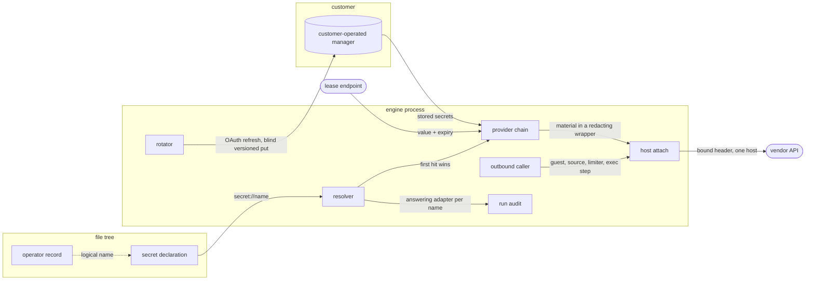
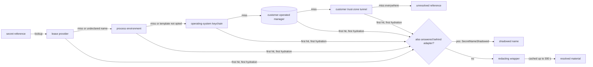
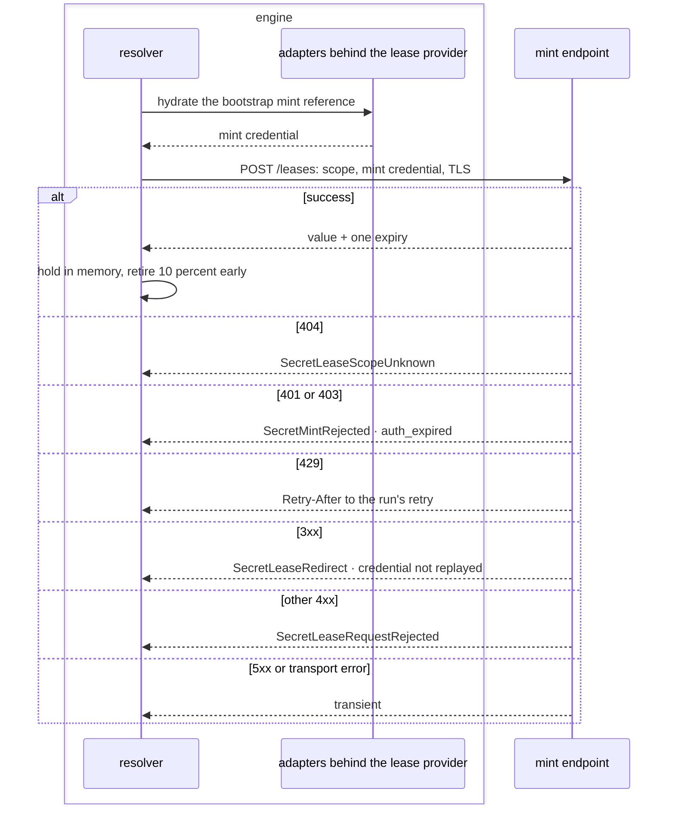

# Outbound credentials

An outbound credential is the material reaching a vendor API from a pull, a derive step or
a metered call: how a declaration names one, how the resolver finds it, how a lease
shortens its life, how the host attaches it, how it turns over, and how it is recorded.

A credential from its reference to the vendor, keyed throughout by its logical name:



## reference

The credential plane, the `secret://` scheme and the template grammar.

- `credential-plane` — Outbound credential material is a plane separate from the one admitting a caller into a store. A key keeps its inbound or outbound use wherever its bytes are stored.
  *A-connector*
- `declaration-binds-a-reference` — A declaration lists the credential names it needs in its capability block and binds each to a `secret://<name>` reference resolved at run time.
  *A-connector*
- `reference-scheme` — `secret://<name>` carries a logical name matching `[a-z0-9-]+` of at most 128 chars. A reference is never a storage path, a file name or a key identifier.
- `backend-independence` — The adapter maps a logical name to a storage location, so moving between credential stores re-points the backend and edits no declaration.
- `value-template` — A value embedding a credential is a template of literal text with `${secret://<name>}` placeholders, such as `Bearer ${secret://vendor-token}`.
- `foreign-placeholder` — `${env://NAME}` or a bare `${NAME}` inside a template raises `SecretForeignPlaceholder` at parse, naming the value and the span.
  *A-connector*
- `malformed-placeholder` — An unclosed, empty or nested placeholder raises `SecretMalformedTemplate` while the declaration is read, ahead of any text leaving the process.
  *P1*
- `environment-is-a-miss` — Template hydration treats the process-environment adapter as a miss and continues down the chain; a name nothing answers falls to {{connector.resolve.unresolved-name}}.
  *A-connector*
- `environment-opt-in` — `CONTEXTFUL_SECRETS_ALLOW_ENV_TEMPLATES=1` re-admits the environment adapter to template hydration and logs one warning per process naming the variable.
- `whole-value-binding` — `env://NAME` binds a whole credential outside the template grammar.
- `material-in-a-declaration` — A credential-shaped literal standing where a reference belongs raises `SecretMaterialInDeclaration` at validation, naming the key.
  *A-connector*
- `lease-has-no-scheme` — A leased credential binds as `secret://<name>`. No lease spelling exists in the manifest grammar.
  *A-connector*
- `name-is-the-join` — The logical name is the one join between a declaration, a provider entry, a cache key, a record and a run's provider attribution.

## resolve

The provider port, the chain and its precedence, hydration timing, the redacting wrapper and the postures.

- `provider-port` — One port answers a reference with material. Every backend is an adapter behind it, and `CONTEXTFUL_SECRETS_BACKEND` selects the adapters the chain assembles.
- `provider-chain` — The chain runs: lease provider, process environment, operating-system keychain, customer-operated manager, then a tunnel into the customer trust zone.
  *A-connector*
- `first-hit-wins` — Hydration stops at the earliest adapter answering the name, and later adapters are not consulted for that reference during the run.
- `shadowed-name` — At first hydration, a name answered by the serving adapter and by any adapter behind it raises `SecretNameShadowed`, naming the logical name and both adapters.
  *because a stray environment variable otherwise shadows the manager unnoticed*
- `hydration-is-just-in-time` — Material enters the process per read, while the request is built. No declaration, journal entry, audit record, run record or log line carries a hydrated value.
  *A-connector*
- `redacting-wrapper` — Every hydrated value, a pure-literal template included, rides a wrapper whose debug and display forms print a fixed sentinel. The bytes are revealed only where the host writes the request.
- `resolver-per-source` — One resolver with its own cache is built per source, and concurrent first hydrations of one name collapse under a single-flight gate.
- `cache-ttl` — A cache entry lives at most 300 s.
- `unresolved-name` — A reference no assembled adapter answers raises `SecretUnresolvedReference` naming it, at preflight where the binding is static and at the call otherwise.
  *P2*
- `posture` — Four postures order material's distance from the engine: inline environment material, reference with just-in-time hydration, an external manager read through workload identity, and a secretless broker sidecar. The workload-identity manager is the default.
  *A-connector*
- `inline-outside-development` — A profile other than development binding plaintext material at a call site raises `SecretInlineCredential` naming the binding.
  *A-connector*
- `forwarding-sidecar` — A sidecar reading a stored long-lived credential and forwarding it outward raises `SecretForwardingBroker`. A sidecar minting a short-lived scoped credential is a lease provider.
  *A-connector*
- `adapter-is-optional` — Each managed backend is one adapter holding opaque versioned ciphertext; a deployment links only the adapters it uses.
- `know-how-in-an-adapter` — An adapter exposing a provider-specific exchange, refresh or lifetime entry point raises `SecretProviderKnowHowInBackend` at load.
  *A-connector*



## lease

The declaration-scoped lease provider at the head of the chain: endpoint, expiry, failure classes and bootstrap.

- `scope-declaration` — `CONTEXTFUL_LEASE_SCOPES` lists the logical names hydrating as run-time leases, each optionally as `name=scope`.
- `head-of-chain` — For a declared name the lease provider answers and no adapter behind it is reached; a shadowing adapter raises under {{connector.resolve.shadowed-name}}.
  *A-connector*
- `undeclared-name-defers` — An undeclared name sends the lease provider no request and leaves precedence among the other adapters untouched.
- `empty-scope-set` — Selecting the lease backend with no scope declared raises `SecretLeaseScopesEmpty` at startup.
  *P3*
- `lease` — A lease is material plus one expiry, held as a pair in memory for the run, evicted at expiry, and written to no file, journal entry or audit record.
  *A-connector*
- `malformed-lease` — A lease carrying no expiry, or one already past on arrival, raises `SecretMalformedLease` as a transient failure.
  *P6*
- `cache-window` — A leased name's cache entry is bounded by the tighter of {{connector.resolve.cache-ttl}} and the lease's own expiry.
- `retirement-margin` — An entry retires 10 percent of its window ahead of expiry, the margin capped at 30 s.
  *because a request sent near the boundary still lands inside the grant*
- `endpoint` — The provider answers `POST <provider-url>/leases` carrying a bearer mint credential and body `{ "scope": "<lease scope>" }`.
- `response` — A success carries `value` plus one expiry — `expires_in` seconds, `expires_at` epoch seconds, or an RFC 3339 instant — at the top level or under `lease`.
- `unknown-scope` — A `404` raises `SecretLeaseScopeUnknown` as a configuration fault; a declared name never falls through to a stored credential.
  *A-connector*
- `mint-rejected` — A `401` or `403` raises `SecretMintRejected`, classed `auth_expired`.
  *P6*
- `rate-limited` — A `429` passes its `Retry-After` to the run's retry, classed `rate_limited`.
  *P6*
- `request-rejected` — Any other `4xx` raises `SecretLeaseRequestRejected` as a permanent configuration fault.
  *P6*
- `transient-class` — A `5xx` and a transport error are transient. The mint client retries nothing itself; the run's retry schedule is the one retry layer.
  *P6*
- `vendor-requests-on-failure` — A run holding an expired lease whose provider is unreachable issues 0 requests to the vendor.
  *P6*
- `calls-per-resolver` — A resolver issues at most 1 calls to the mint endpoint per declared name per lease window.
- `bootstrap-credential` — The engine authenticates to the mint endpoint with one standing `secret://` credential scoped to minting alone. Revoking it severs every leased source at its next expiry.
  *A-connector*
- `bootstrap-non-recursion` — The lease provider holds the chain as assembled before it joined, so the mint reference hydrates only through adapters behind it.
- `bootstrap-unserved` — A bootstrap name no adapter behind the lease provider answers raises `SecretBootstrapUnresolved`, naming the reference.
  *A-connector*
- `bootstrap-declared-leased` — Listing the bootstrap name among the leased scopes raises `SecretBootstrapLeased` at startup.
  *A-connector*
- `bootstrap-backend` — `CONTEXTFUL_LEASE_BOOTSTRAP_BACKEND` composes a customer-operated manager behind the lease provider to hold the mint reference.
- `mint-transport` — The mint client reaches its endpoint over TLS or loopback and ignores system proxy configuration.
  *A-connector*
- `redirect` — A `3xx` from the mint endpoint raises `SecretLeaseRedirect`; the mint credential is not replayed at the target.
  *A-connector*



unsettled: Does one mint call answer several scopes at once for a run that binds many leased names? owner: connector affects: connector.lease

## attach

Host mediation of an outbound request: the transport port, the bound host, address vetting, header templates, origin pinning and URL scrubbing.

- `host-mediation` — The host implements outbound HTTP itself: it judges every request against the declaration ahead of socket I/O, stamps a host-assigned request id, and writes the bound credential onto a permitted request.
  *A-connector*
- `no-material-to-a-guest` — No host import hands credential bytes to guest code; a guest names a request and receives a response.
  *A-connector*
- `unpermitted-request` — A request whose host the declaration does not cover raises `SecretUnpermittedRequest` and fails the guest call even where guest code discards the error.
  *A-connector*
- `transport-port` — The mediated client reaches the network only through a transport port. Its send half connects to an address the client vetted, follows no redirect, and applies the client's proxy choice, timeout and body ceiling.
  *A-connector*
- `resolve-half` — Name resolution runs through the port's resolve half, after {{connector.meter.pre-send-hook}} admits the hop; the client vets each address it answers under {{connector.attach.private-address}}.
  *A-connector*
- `resolve-once` — The host resolves a permitted host name once per request and connects to the address it vetted, with no second lookup between check and connect.
  *A-connector*
- `private-address` — A host name resolving to a private, link-local, unique-local, loopback or cloud-metadata address raises `ConnectorPrivateAddress`, unless the configured host is itself a loopback name or literal.
  *because an allowlisted name pointed at an internal range is SSRF*
- `bound-host` — A source binding any credential carries one non-wildcard host, checked at validation and at session open; a wildcard entry, or an endpoint host a table name binds, beside a bound credential raises `SecretWildcardHost`.
  *A-connector*
- `default-attachment` — With no further declaration the host writes `Authorization: Bearer <value>` from the single bound credential.
- `attach-block` — An `[attach]` block maps a header name to a value template. The host hydrates it onto the permitted request, overriding the guest's header of that name.
- `literal-attach-value` — An attach value embedding no reference raises `SecretLiteralAttachValue`.
  *because a constant header belongs in the guest's request construction*
- `redirect-pinning` — Every source, credential-bearing or not, follows a hop only when it keeps the configured host and port on the same or a stronger transport; cleartext to TLS at that host and port is followed.
  *A-connector*
- `weakened-hop` — A redirect or vendor-supplied next link moving from TLS to cleartext, or to another host or port, raises `SecretRedirectOffOrigin`, and the read fails.
  *A-connector*
- `landed-origin` — The origin answering the request whose body lands equals the configured host and port.
  *A-connector*
- `referer-off` — `Referer` is off on every outbound client.
- `header-selects-client` — Declaring any header, literal or hydrated, selects the hardened client, which bypasses the system proxy; a source declaring none keeps the proxy.
- `cleartext-endpoint` — A header hydrated from a reference is marked sensitive, and sending it to a cleartext endpoint raises `SecretCleartextEndpoint`, IPv4 and IPv6 loopback exempt.
  *A-connector*
- `sensitive-header-record` — A run records which header names carried a credential, by name only.
- `url-scrubbing` — A URL reaching an error message, a log line or a landed column carries scheme, host, port and path; query, fragment and userinfo are dropped.
  *A-authority*
- `typed-url-edit` — Metered vendor traffic and control-plane traffic each dispatch through one client whose error mapping clears the URL as a typed edit; a URL arriving otherwise is scrubbed as text.
- `credential-in-a-url` — A configured endpoint carrying userinfo raises `SecretCredentialInUrl` at validation, naming the source.
  *A-authority*
- `mediation-covers-every-egress` — A built-in source, a guest connector, a model call, a limiter call and an exec step all attach through the mediated path. No second attachment point exists.
  *A-connector*

## rotate

The division of labor on credential turnover and the rotation mechanisms.

- `division-of-labor` — A credential store contributes versioned storage and a trigger. The host drives the OAuth loop from the connector's auth policy and writes the token back as a blind versioned put.
  *A-connector*
- `expiry-hint` — The host may store an opaque `expires_at` hint beside the ciphertext for cache invalidation.
- `static-key` — A static key in a customer manager turns over with no engine step: a run hydrates the current version at its next cache miss.
- `oauth-credential` — An OAuth credential refreshes ahead of its declared expiry, writes the new version to the customer's manager, and clears that name's cache entry in the same step.
- `operator-entered` — A development or keychain secret is re-entered by an operator re-pointing the reference.
- `leased-credential` — A leased credential re-mints ahead of its window with no write-back, and a failed re-mint leaves the source with no credential rather than an older one.
  *P4*
- `write-back-denied` — A manager refusing the versioned put raises `SecretRotationWriteDenied`, and the run fails closed.
  *A-connector*
- `connector-owns-meaning` — Token lifetime, exchange rules, refresh endpoint and scopes, expired-token codes and rate-limit headers live in the connector's `[auth]`, `[rate_limit]` and `[retry]` blocks, pinned by connector id and version.
  *A-connector*
- `no-master-key` — The engine holds references, and no single encryption key exists whose theft with a database copy yields every credential.
  *A-connector*
- `turnover-preserves-the-name` — Every rotation mechanism keeps the logical name, touching no declaration and no pinned connector artifact.

unsettled: How does a resolver learn of a rotation performed outside the engine, short of polling a version per name? owner: connector affects: connector.rotate

## record

The operator record of a credential, the inventory, and the provider attribution a run emits.

- `operator-record` — An operator record is the encrypted entry for one logical name plus a plaintext comment naming its grants in the provider's vocabulary, its account or tenancy, creation date, expiry or `no expiry`, and rotation location.
- `committed-entry` — The entry file is committed, holds no fragment of any value in plaintext, and its decryption keys live outside the tree.
- `surface-of-consumption` — An entry names each deployed surface consuming the credential and the secret name the value takes there.
- `platform-only-credential` — A credential existing only as a deployed platform secret holds no value in the tree, and its record lands in the change setting or rotating it.
- `undocumented-entry` — An entry holding a value with no record above it raises `SecretUndocumentedEntry`, naming the logical name and the file.
  *A-connector*
- `unverified-scope-is-marked` — Grants an operator has not established are recorded as unknown.
- `rotation-updates-the-record` — A rotation rewrites the creation date and expiry in the commit landing the new ciphertext.
- `inventory` — `contextful secrets list` prints, per logical name, the answering adapter, the covered scope, the expiry and the days remaining, reading records and no value.
- `expiry-warning` — The inventory marks an entry whose expiry falls within 30 d.
- `provider-attribution` — A run's audit records which adapter answered each reference, by logical name and adapter.

unsettled: Is the record's grant vocabulary free text or a per-adapter enumeration the inventory validates? owner: connector affects: connector.record

## Shapes

A declaration binding one credential through a template:

```toml
[pipeline.source]
name = "http"

[pipeline.source.config]
endpoint = "https://api.vendor.example/v1/orders"   # one exact host: a credential attaches here
format   = "json"

[pipeline.source.config.headers]
Authorization = "Bearer ${secret://vendor-token}"
```

An operator record:

```sh
# vendor-token — Vendor API key · account: acct-4471 (orders tenancy)
# grants: orders.read, orders.export · created <date> · expires <date>
# rotate: console.vendor.example/settings/api-keys
VENDOR_TOKEN="encrypted:BExampleCiphertext..."
```
