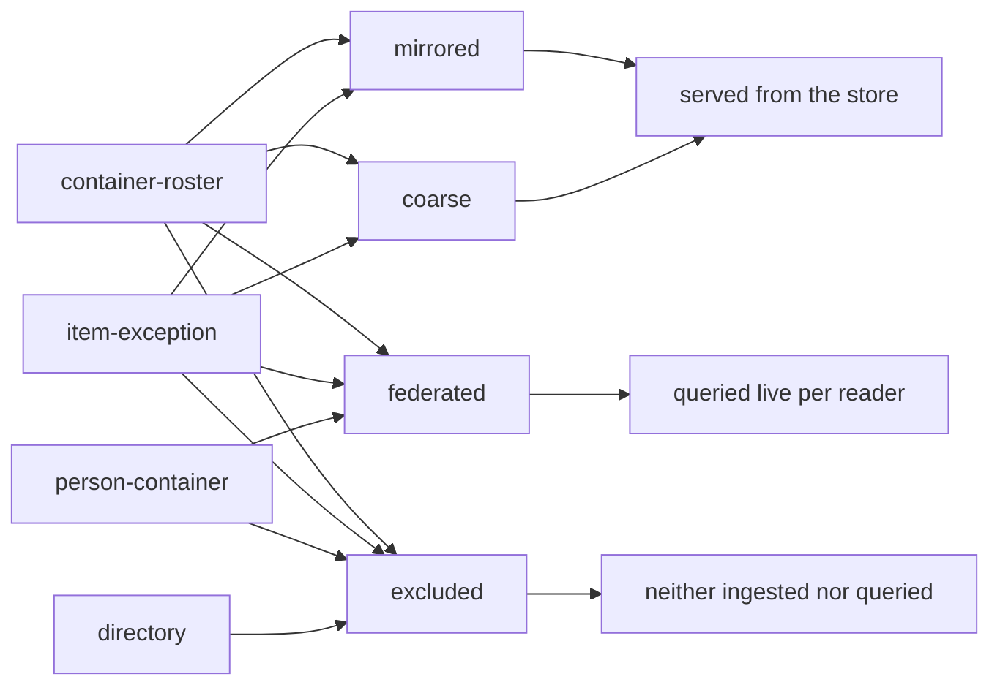
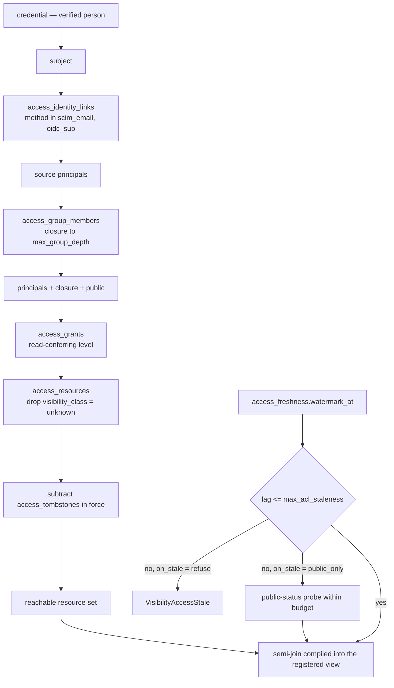
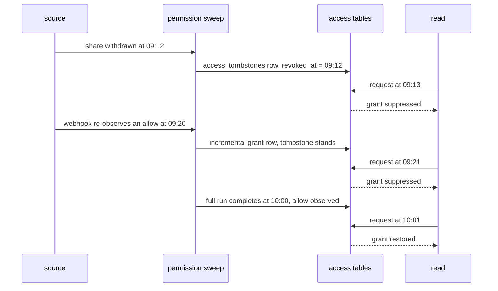
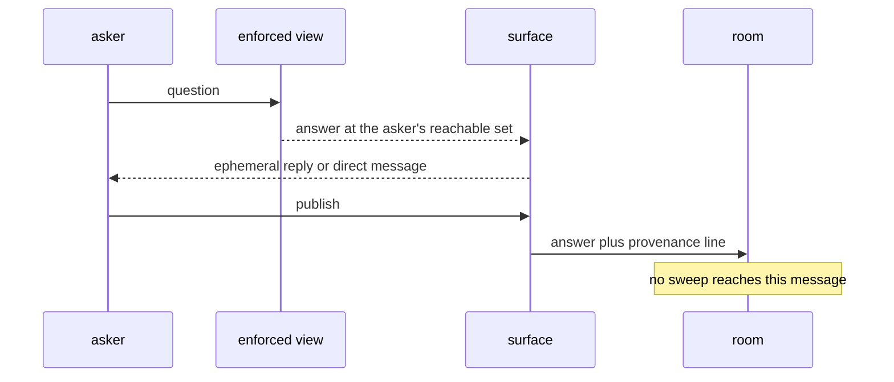

# Source-faithful visibility and outbound answers

A workspace serving a whole organization answers each reader inside the audience the
originating source already drew. This contract holds the mirrored permission state, the
resolution of a subject to the resources it reaches, the age budget on that state, the
fidelity a table claims, the diagnostic that explains a decision, and the moment an answer
computed for one reader lands where other people read it.

## Parties

| Party | Obligation |
| --- | --- |
| **The pack author** | Projects one source's permission model onto the access tables, names the source family and the fidelity level for every table the pack lands, and asserts no audience of their own. |
| **The operator** | Declares the age budget and the posture past it per table, classifies each table's fidelity against the family, and reads the audience report as access-governance work. |
| **The permission sweep** | Writes each observation with its kind, its identifier and its observation instant, and moves the coverage watermark on a run that reached every governed resource. |
| **The engine** | Resolves a reachable set per request from verified links, the group graph and the grant tables, compiles the semi-join into the caller's view, and turns a read away past the budget. |
| **The read face** | Consumes the enforced view as its one relation and surfaces nothing the view withheld, whatever the surface, the arm or the embedding. |
| **The asker** | Publishes an answer to an audience as a deliberate act, carrying the provenance line the surface attaches, having read the answer first. |

## Operations

| Operation | What it governs |
| --- | --- |
| `mirror` | The three-way conjunction, the access tables as ordinary store data, and the binding that compiles a table's semi-join. |
| `sweep` | Observation of permission state: sweep kinds, the observation clock, the coverage watermark, tombstones and revocation. |
| `reach` | Per-request resolution of a subject to a set of resources, the group closure, and the cache that keys on committed access state. |
| `bound-staleness` | The declared age budget on mirrored authorization, the refusal past it, and the one narrowing posture. |
| `declare-fidelity` | The level a table claims, the source family that bounds the claim, and live federation under a reader's own credential. |
| `pack` | The reviewed unit that lands a source: its access mapping, its defaults, its allowlist, and what it has no standing to say. |
| `explain` | The decision endpoint, replay over a window, negative assurance and its coverage, and the audience report. |
| `publish-answer` | An answer computed at one reader's scope reaching a surface with an audience, and what leaves the organization. |

## Clauses — mirror

The mirror is permission state held as data a reader of the store can query. Its rows are
ordinary tables, described in [`spec/10-store.md` § Table declaration](10-store.md); the
snapshot and compaction mechanics of content apply to them unchanged. Where the compiled
semi-join sits among the other restrictions on a caller's view is
[`spec/41-enforcement.md` § Composition order](41-enforcement.md); a reader receives one
relation carrying all of them.

| Clause | Statement | decided-by |
| --- | --- | --- |
| `visibility.mirror.invariant.two-key-rule` | A row reaches a subject exactly when three conjuncts hold together: the mirrored source access list grants it, manifest policy grants it, and the caller's credential grants it. No layer unions, no administrative override widens, and no cached term survives its own invalidation. | |
| `visibility.mirror.invariant.source-faithful-audience` | Mirroring reproduces the audience the originating system drew, including an audience wider than anyone intended. Manifest policy is the single place where need-to-know narrows further, and it is data in the manifest, read as a diff. | |
| `visibility.mirror.invariant.unknown-class-is-invisible` | A resource whose access list failed to mirror carries `visibility_class = 'unknown'` and reaches no subject at all, an operator holding a deployment-wide credential included, until manifest policy names it. | |
| `visibility.mirror.shape.access-tables` | The mirror is `access_resources` (one row per governed object), `access_grants` (one row per resource, principal and level), `access_principals`, `access_group_members` (one edge of the group graph), `access_identity_links`, `access_tombstones` (one observed revocation) and `access_freshness`. | |
| `visibility.mirror.limit.access-table-count` | The mirror is 7 entries in the table namespace and gains an eighth by an amendment to this clause. | |
| `visibility.mirror.shape.resource-row` | `access_resources` carries `resource_id`, `source`, `resource_kind`, `container_id`, `visibility_class`, and the observation columns every access row shares. | |
| `visibility.mirror.shape.grant-row` | `access_grants` carries `resource_id`, `principal`, `principal_kind` and `level`, one row per distinct triple, with the observation columns alongside. | |
| `visibility.mirror.shape.principal-row` | `access_principals` carries `principal`, `principal_kind` and the source's own label for it; `access_group_members` carries `group`, `member` and `member_kind`, one row per edge. | |
| `visibility.mirror.shape.identity-link-row` | `access_identity_links` carries `source_principal`, `subject`, `method` and `confidence`, mapping one source account onto one workspace subject. | |
| `visibility.mirror.shape.tombstone-row` | `access_tombstones` carries `scope`, `resource_id`, `principal`, `level` and `revoked_at`, each key part a typed column rather than a packed string. `scope` takes one of `resource`, `grant`, `principal`. | |
| `visibility.mirror.shape.freshness-row` | `access_freshness` carries one row per source and sweep kind: the enforced `watermark_at` beside the diagnostic `last_full_sweep_at`, `last_incremental_at`, `lag_seconds` and `budget_seconds`. | |
| `visibility.mirror.invariant.watermark-is-the-enforced-field` | Of the freshness columns, `watermark_at` alone decides a read; the remaining fields inform an operator and decide nothing. | |
| `visibility.mirror.shape.principal-kind` | `principal_kind` takes one of `user`, `group`, `team`, `channel`, `org`, `public`, and a source vocabulary outside that set is normalized onto it by the mapping. | |
| `visibility.mirror.invariant.public-principal-is-literal` | The principal spelled `public` is an ordinary row in the grant table, and every request carries it alongside the subject's own principals. | |
| `visibility.mirror.invariant.grant-level-is-opaque` | `level` is a source-defined string — `read`, `write`, `admin`, `triage` — that the mapping projects onto engine actions. A level conferring no read is mirrored for the diagnostic trace and contributes nothing to a reachable set. | |
| `visibility.mirror.shape.visibility-class` | `visibility_class` takes one of `mirrored`, `coarse`, `federated`, `unknown`, and is recorded per resource: one workspace's open rooms observe cleanly while its private ones do not. | |
| `visibility.mirror.limit.observed-classes` | The observed class vocabulary holds 4 entries and admits no per-source extension. | |
| `visibility.mirror.interface.visibility-block` | A content table declares `[pipeline.tables.visibility]` with `source`, `resource_key` (the column naming the governed object), `resource_kind` (the source's own grain), `fidelity`, an optional `family`, `max_acl_staleness` and `on_stale`. | |
| `visibility.mirror.invariant.binding-travels-with-the-table` | The binding belongs to the table and arrives with the pack that lands it, so a face added later inherits it rather than declaring it. One table carries one binding and one governing regime. | |
| `visibility.mirror.invariant.semi-join-is-compiled-in` | The engine compiles a semi-join against the caller's reachable resource set into that caller's registered view. The filter lives in the relation, so structured statements, each retrieval arm, previews, templates and every embedded surface inherit it without restating it. | |
| `visibility.mirror.refusal.view-bypass` | A read path that reaches table rows around the registered view raises `VisibilityViewBypass`, naming the face and the table. There is no supported route past the relation for speed. | `0239` |
| `visibility.mirror.invariant.face-turns-organization-wide` | A deployment becomes an organization-wide face at the moment any table declares a visibility block or any permission sweep exists for any source. | |
| `visibility.mirror.refusal.unbound-table` | On an organization-wide face, a table carrying no visibility block raises `VisibilityUnboundTable` from the diagnose command and from the serving guardrail at start, naming the table. | `0240` |
| `visibility.mirror.refusal.incomplete-binding` | A binding at a servable level without a declared sweep for its source, or without `max_acl_staleness`, raises `VisibilityBindingIncomplete`. Nothing else produces the source's access rows, and an unmeasured budget enforces nothing. | `0240` |
| `visibility.mirror.invariant.excluded-is-the-opt-out` | `fidelity = "excluded"` is the one explicit way a table sits on an organization-wide face without a servable binding, and it states that the table is neither ingested nor queried. | |

## Clauses — sweep

An observation is a dated reading of one source's permission state. The permission sweep is
a job with its own cadence, described in
[`spec/50-control-plane.md` § Job kinds](50-control-plane.md); its schedule is independent
of the content pull it accompanies.

| Clause | Statement | decided-by |
| --- | --- | --- |
| `visibility.sweep.shape.sweep-kind` | Every access row carries `_acl_sweep_kind` in `full`, `incremental`, `webhook` and `_acl_sweep_id` identifying the run that wrote it. Both the coverage rule and the revocation rule branch on that kind. | |
| `visibility.sweep.limit.sweep-kinds` | The sweep kind vocabulary holds 3 entries. | |
| `visibility.sweep.shape.observation-clock` | Every access row carries `_acl_observed_at`, the instant the permission state was read at the source, held separately from the instant the row landed in the store. | |
| `visibility.sweep.invariant.authorization-ages-on-its-own-clock` | A content pull at one hour reusing a sweep from an earlier hour serves aged authorization over fresh content. The separate observation clock is what makes that age computable. | |
| `visibility.sweep.invariant.watermark-covers-everything` | `watermark_at` moves on a sweep run that finished having read every governed resource in the source. Lag is measured from it, so the enforced figure bounds the worst resource rather than the best one. | |
| `visibility.sweep.invariant.partial-run-moves-nothing` | A sweep that failed or covered part of the estate advances no watermark. A limping sweep therefore ages the whole source instead of appearing current on the resources it managed to read. | |
| `visibility.sweep.invariant.deny-outranks-allow` | A tombstone suppresses its resource or its grant for every read after `revoked_at`, whatever a later observation says, until an allow arrives on a full run whose observation instant is newer than the revocation. | |
| `visibility.sweep.invariant.incremental-never-restores` | An observation of the `incremental` or `webhook` kind adds a grant that no tombstone covers and lifts no suppression. Proving one row was seen is not proving the estate was walked. | |
| `visibility.sweep.invariant.tombstone-match-is-typed` | `scope` decides which of `resource_id`, `principal` and `level` participate, so suppression is an equality over typed columns against the grant table rather than a comparison of opaque keys. | |
| `visibility.sweep.limit.tombstone-scopes` | The tombstone scope vocabulary holds 3 entries. | |
| `visibility.sweep.invariant.revocation-skips-the-content-pull` | Withdrawing a share takes effect on the first read after its sweep commits, with no re-ingestion and no deletion of content rows. Reachability is a join rather than a property baked into the row. | |
| `visibility.sweep.invariant.events-tighten-rows` | A webhook or incremental observation narrows the individual rows it touches the moment it lands. | |
| `visibility.sweep.refusal.ungapped-stream` | Moving `watermark_at` from an event stream that the mapping has not declared gap-detectable — sequenced delivery with reconciliation on a detected gap — raises `VisibilityUngappedStream`. A source without that property lives at its full-run cadence. | `0241` |
| `visibility.sweep.workflow.gap-reconciliation` | A gap-detectable stream numbers its deliveries, detects a missing number, and reconciles the affected resources against the source before the watermark advances past the gap. | |
| `visibility.sweep.interface.sweep-block` | An `[[acl_sweep]]` block declares one governed source's permission sweep: the source key, the credential reference, the resource enumeration, the cadence per sweep kind, and the event stream where one exists. | |
| `visibility.sweep.refusal.orphan-grant` | A grant row landing with no resource row, or whose resource carries the unknown class, raises `VisibilityOrphanGrant` at commit and contributes to no reachable set. | `0242` |
| `visibility.sweep.invariant.sweep-writes-through-the-run-path` | Access rows land through the same journaled run path as content, so an observation is replayable, attributable and readable by any tool that opens the store. | |

## Clauses — reach

Resolution runs per request and consumes committed access rows. Turning away a caller whose
credential names no verified person happens before this operation, in
[`spec/40-authority.md` § Admission](40-authority.md); resolution here starts from a subject
that admission already settled, whether the credential arrived whole, narrowed offline by its
holder, or exchanged per reader by an embedding application.

| Clause | Statement | decided-by |
| --- | --- | --- |
| `visibility.reach.workflow.resolution-order` | Per request the engine resolves the credential's verified person to a subject, the subject to source principals through identity links, those principals to a group closure, and principals plus closure plus `public` to resources through grants joined onto resource rows, dropping the unknown class and subtracting tombstones in force. | |
| `visibility.reach.invariant.verified-methods-authorize` | The join consumes links whose `method` is `scim_email` or `oidc_sub`. A link recorded as `operator_asserted` appears in the diagnostic trace and adds no resource. | |
| `visibility.reach.refusal.unverified-link-in-the-join` | A link whose method sits outside the verified set reaching the reachable-set computation raises `VisibilityUnverifiedLink`, naming the method and the source. | `0243` |
| `visibility.reach.invariant.links-come-from-provisioning` | {{authority.identify.invariant.directory-link}} | |
| `visibility.reach.invariant.confidence-relaxes-nothing` | `confidence` is recorded beside the method and enters no threshold. A link either carries a verified method or contributes nothing. | |
| `visibility.reach.invariant.unlinked-subject-reads-nothing` | A subject with no resolved principal in a source reads none of that source rather than all of it, so a mapping gap lands as a denial. | |
| `visibility.reach.limit.principal-kinds` | A reachable set is built from principals of 6 entries in the kind vocabulary, the literal `public` among them. | |
| `visibility.reach.limit.group-closure-depth` | The closure walks the group graph to `max_group_depth`, default 8 hops, declared per deployment. | |
| `visibility.reach.refusal.closure-over-depth` | A closure reaching the depth bound raises `VisibilityClosureDepth` (HTTP 503) and returns no set. Truncation narrows in silence and produces an answer indistinguishable from a complete one. | `0244` |
| `visibility.reach.invariant.org-membership-is-an-edge` | A mapping normalizes organization membership into the group edge table with the organization as a node, so a grant to an `org` principal matches like any other group grant rather than sitting unmatched. | |
| `visibility.reach.invariant.expansion-is-late` | The closure runs at read time over the mirrored graph rather than being folded into the content index at write time. Membership turns over far faster than documents do. | |
| `visibility.reach.invariant.materialization-shares-invalidation` | A materialized closure is keyed on the same epochs as the request-time walk, making it an optimization with identical invalidation rather than a second account of who belongs to what. | |
| `visibility.reach.shape.cache-key` | The reachable-set cache key is the subject, a source epoch over grants, resources, tombstones and freshness, and a directory epoch over the group graph and identity links. | |
| `visibility.reach.invariant.equal-key-means-equal-inputs` | Equal cache keys imply identical committed access state by construction, so a revocation rotates the key and the superseded entry is never read again. | |
| `visibility.reach.refusal.caching-a-degraded-result` | Storing a reachable set or a result produced past a budget, or produced under the narrowing posture, raises `VisibilityDegradedCached`. Those paths pay full cost on every request. | `0245` |

## Clauses — bound-staleness

A budget states how old mirrored authorization is allowed to be while still deciding a read.

| Clause | Statement | decided-by |
| --- | --- | --- |
| `visibility.bound-staleness.shape.budget-grammar` | `max_acl_staleness` is a positive integer followed by one suffix from `s`, `m`, `h`, `d` — `90s`, `15m`, `1h`, `2d`. | |
| `visibility.bound-staleness.refusal.malformed-budget` | A compound form, a bare number, or a suffix outside the four raises `VisibilityBudgetMalformed`, naming the table and the text it read. An ambiguous budget is settled by the author rather than by a default. | `0246` |
| `visibility.bound-staleness.invariant.budget-is-per-table` | Each table declares its own budget: a conversation corpus at fifteen minutes beside a code corpus at one hour is a coherent posture for one deployment. | |
| `visibility.bound-staleness.invariant.manifest-outranks-the-pack` | A pack ships a budget default per table and the operator's manifest value takes precedence over it wherever both exist. | |
| `visibility.bound-staleness.invariant.lag-reads-the-watermark` | The lag compared against a budget is the distance from `watermark_at` to the request instant, one figure per source, evaluated without joining candidate rows to their own observation ages. | |
| `visibility.bound-staleness.invariant.every-touched-table-is-checked` | A statement spanning several bound tables is checked against each of their budgets, and the tightest governing figure decides the outcome. | |
| `visibility.bound-staleness.refusal.over-budget-read` | A read whose source lag exceeds a touched table's budget raises `VisibilityAccessStale` (HTTP 503, in band on the tool surface) carrying the source, the lag in seconds, the budget in seconds and the last observation instant. | `0246` |
| `visibility.bound-staleness.refusal.never-swept-source` | A source with no completed full run raises `VisibilityAccessStale` whatever budget its table declares, carrying a lag the mirror cannot bound. Unswept is maximally aged rather than exempt. | `0246` |
| `visibility.bound-staleness.invariant.loudness-over-emptiness` | An aged-authorization outcome is a refusal rather than a shortened result set. An empty answer is an ordinary outcome — a quiet repository, a narrow reader — and a shortened set reads as healthy indefinitely. | |
| `visibility.bound-staleness.shape.stale-posture` | `on_stale` takes `refuse` or `public_only`, declared per table beside the budget. | |
| `visibility.bound-staleness.limit.stale-postures` | The posture vocabulary holds 2 entries. | |
| `visibility.bound-staleness.invariant.default-posture-is-refusal` | `on_stale` defaults to `refuse`; the availability posture is opted into per table and disclosed on every answer it touches. | |
| `visibility.bound-staleness.workflow.public-only` | Past the budget, `public_only` serves rows whose resource had its public status re-read within budget by a single-field probe, marking the envelope and the audit record as degraded. | |
| `visibility.bound-staleness.refusal.aged-public-probe` | Where the probe itself sits past the budget, the narrowing posture closes and the read raises `VisibilityAccessStale`. The opened path is never wider than the closed one. | `0247` |
| `visibility.bound-staleness.invariant.narrowing-not-exemption` | The availability posture removes rows from what a fresh read returns and adds none, so a resource made private after the last full run is absent rather than served on an aged allow. | |
| `visibility.bound-staleness.refusal.budget-below-cadence` | A budget tighter than the sweep cadence its source sustains raises `VisibilityBudgetUnreachable` at diagnose, naming both figures. A per-item permission model under request limits moves its watermark in hours, and the declaration states that. | `0246` |
| `visibility.bound-staleness.invariant.budget-and-cadence-are-one-contract` | The declared budget and the declared sweep cadence are read together at diagnose, so an operator defends the pair rather than the number alone. | |

## Clauses — declare-fidelity

A table declares how exact its inherited audience is, and the source family it belongs to
bounds what it is entitled to declare.

| Clause | Statement | decided-by |
| --- | --- | --- |
| `visibility.declare-fidelity.shape.declared-levels` | `fidelity` takes `mirrored` (per-principal lists at the grain the source enforces, joined exactly), `coarse` (a container or workspace signal joined at that grain), `federated` (queried live under the reader's own delegated credential) or `excluded` (no safe path). | |
| `visibility.declare-fidelity.limit.declared-levels` | The declared fidelity vocabulary holds 4 entries. | |
| `visibility.declare-fidelity.invariant.servable-levels` | Rows are served out of the store at `mirrored` and at `coarse`. The other two levels describe tables the store never answers from. | |
| `visibility.declare-fidelity.invariant.two-distinct-ladders` | The declared level is the operator's claim about what a source supports and bottoms out at `excluded`; the observed class is what a run found per resource and bottoms out at `unknown`. They are separate types and never compared as one. | |
| `visibility.declare-fidelity.interface.coarse-carries-its-grain` | A `coarse` binding puts the source's own grain name into the response envelope, so a reader is told the scope of the approximation rather than the fact of it. | |
| `visibility.declare-fidelity.shape.source-families` | `family` takes `container-roster` (content inherits a membership list), `item-exception` (a container base with per-item breaks), `person-container` (the container is one human being) or `directory` (records about people rather than content). | |
| `visibility.declare-fidelity.limit.source-families` | The source family vocabulary holds 4 entries. | |
| `visibility.declare-fidelity.refusal.level-outside-the-family` | A `person-container` table declared at a servable level, and a `directory` table declared above `excluded`, raise `VisibilityFamilyBound` and the table does not load. Classification is a judgment made once; the bound downstream of it is mechanical. | `0248` |
| `visibility.declare-fidelity.refusal.family-undeclared` | A mapping that lands a table without naming its family raises `VisibilityFamilyUndeclared`. An unnamed family leaves the level claim resting on reviewer judgment alone. | `0248` |
| `visibility.declare-fidelity.invariant.federated-rows-stay-outside` | A `federated` resource is swept into the resource table holding zero grants, and its content rows enter no store table, so no credential of any breadth surfaces them. | |
| `visibility.declare-fidelity.refusal.federated-table-registered` | Registering a `federated` table on a read face raises `VisibilityFederatedRegistered`. Its observable effect is the resource's absence, and the trace prints the class so the absence reads as the level rather than as a missing grant. | `0249` |
| `visibility.declare-fidelity.refusal.federated-cache-shared` | Retaining a federated result under a key that omits the subject raises `VisibilityFederatedCacheShared`. That result was authorized by one reader's own delegated credential and belongs to no other. | `0249` |
| `visibility.declare-fidelity.interface.hybrid-answer-legs` | An answer drawn from both the mirror and a live query marks the leg on each citation, lists the federated sources consulted, and names the ones that failed or timed out, so a reader learns which part of the question went unanswered. | |
| `visibility.declare-fidelity.invariant.computed-access-federates` | Where a source decides access with a sharing engine rather than storing it, the engine's decisions are queried live and its inputs are not reproduced. Reproducing the inputs re-implements the engine, and each drifted edge is a disclosure. | |
| `visibility.declare-fidelity.refusal.mirroring-computed-inputs` | A mapping projecting a sharing engine's inputs into `access_grants` raises `VisibilityComputedInputsMirrored`, naming the source. | `0250` |
| `visibility.declare-fidelity.invariant.a-people-list-is-not-a-roster` | Attendees, invitees, recipients and contacts arriving inside a content payload describe interest rather than entitlement. Attending a meeting confers no read on the note, and appearing on a deal confers no read on the record. | |
| `visibility.declare-fidelity.refusal.roster-from-a-payload` | A mapping deriving grants from a people list in the content rather than from the source's permission endpoint raises `VisibilityRosterFromPayload`. The test a mapping passes is whether the source enforces the list at sign-in. | `0251` |
| `visibility.declare-fidelity.invariant.excluded-is-absent` | An `excluded` table is neither pulled into the store nor queried live, and no surface offers it. | |

## Clauses — pack

A pack is the reviewed unit that brings one source into a deployment. It names a pinned
connector, whose packaging and version identity is
[`spec/32-connector.md` § Packaging and pinning](32-connector.md); the pin is what fixes
which fetch code the sweep and the pull run.

| Clause | Statement | decided-by |
| --- | --- | --- |
| `visibility.pack.shape.pack-contents` | A pack is a manifest fragment plus a connector pin declaring: the content tables with their cursors and transforms, the access mapping, fidelity and budget defaults per table, the sweep jobs with their cadences, and the surface templates. | |
| `visibility.pack.invariant.pack-is-data` | A pack carries configuration read as a diff and carries no executable logic of its own; everything it changes is legible in the manifest it merges into. | |
| `visibility.pack.interface.access-mapping` | An access mapping declares, per table, the column naming the governed object, the source's grain name, the projection from source principals onto `principal_kind`, the projection from source roles onto `level`, and the family. | |
| `visibility.pack.invariant.mapping-or-excluded` | Every table a pack lands carries an access mapping or the `excluded` declaration. There is no third state and no permissive default, so the convenient path of adding a source cannot leave a table unbound. | |
| `visibility.pack.refusal.mapping-absent` | A pack landing a table with neither a mapping nor an exclusion raises `VisibilityMappingAbsent` at diagnose, naming the pack and the table. | `0252` |
| `visibility.pack.invariant.mapping-asserts-nothing` | A mapping states how a permission model projects onto the access tables and states no audience. No field within it carries the sense of visible to the team or visible to everyone. | |
| `visibility.pack.refusal.pack-asserts-access` | An access-shaped key the mapping schema does not define raises `VisibilityPackAssertsAccess` by name, rather than being tolerated the way an unknown key elsewhere in a manifest is. A field nothing reads at request time can only drift from the decision the join makes. | `0252` |
| `visibility.pack.invariant.extra-fields-are-driver-inputs` | Fields outside the access mapping are inputs to the fetch step and reach no authorization decision. | |
| `visibility.pack.invariant.inclusion-decides-ingestion` | A source arriving in a reviewed diff settles what is ingested. Who reads what was ingested is settled by the credential grant, or on an organization-wide face by the join in this contract. | |
| `visibility.pack.shape.container-allowlist` | Where a source exposes container membership and no permission data, the manifest carries an allowlist of container identifiers, default-deny, evaluated over each row's whole membership set. | |
| `visibility.pack.invariant.allowlist-is-all-of` | A row survives the allowlist when every container in its membership set is listed. An unrecognized identifier drops the row, and an empty or absent membership set drops it too. | |
| `visibility.pack.refusal.any-of-allowlist` | An allowlist evaluated as any-of raises `VisibilityAllowlistAnyOf` at load. Any-of admits a row also filed under a container nobody listed. | `0253` |
| `visibility.pack.invariant.no-permission-data-stays-ordinary` | A source returning no permission data at all takes no visibility block, stays off an organization-wide face, lands as an ordinary table whose admission is the credential grant alone, and puts no fidelity claim on the envelope. | |
| `visibility.pack.refusal.unsupported-coarse` | Declaring `coarse` where the source emits no container or workspace signal raises `VisibilityUnsupportedCoarse`. Where that signal is absent, the envelope has no grain to carry. | `0254` |
| `visibility.pack.invariant.defaults-are-overridable` | Fidelity, budget and cadence defaults in a pack are starting values an operator's manifest replaces table by table without forking the pack. | |

## Clauses — explain

Explain answers why a person does or does not reach a resource, and reports on the audience
the mirror inherited. Removing a mirrored subject's rows is
[`spec/44-accountability.md` § Erasure](44-accountability.md); a subject erased there leaves
this diagnostic with nothing to replay for them.

| Clause | Statement | decided-by |
| --- | --- | --- |
| `visibility.explain.interface.decision-output` | Explain returns `VISIBLE` or `DENIED` together with the path producing it: the resolved principals with their link methods, asserted links marked as conferring nothing, the closure actually walked with each node's depth, the resource's observed class, every grant path found, and the watermark instant with its lag and a `CURRENT` or `STALE` verdict. | |
| `visibility.explain.refusal.row-in-a-diagnostic` | Returning content from the resource under explanation raises `VisibilityDiagnosticRow`. A decision endpoint cannot leak what it reasons about; an endpoint handing back unfiltered rows is a standing bypass for whoever can call it. | `0255` |
| `visibility.explain.invariant.unobserved-is-not-denied` | A resource with no observation on record prints `NEVER OBSERVED` rather than a denial, keeping a coverage gap distinct from a decision. | |
| `visibility.explain.invariant.denial-names-its-cause` | A denial standing beside a live grant path names what overrode it: a tombstone in force with its revocation instant, or an observation carrying the unknown class. | |
| `visibility.explain.invariant.unswept-source-is-stated` | For a source with no completed full run, the output states that reads there refuse under every declared budget, rather than reporting a per-resource decision. | |
| `visibility.explain.workflow.windowed-replay` | Over a window, explain evaluates the decision at every recorded observation inside it and prints each evaluation, then the coverage: observation count, run count, the widest interval between observations, and how many intervals exceeded the table's budget, each flagged. | |
| `visibility.explain.shape.window-verdict` | A window verdict is `VISIBLE AT SOME OBSERVED POINT` or `NOT VISIBLE AT ANY OBSERVED POINT`, printed beneath the coverage block that qualifies it. | |
| `visibility.explain.refusal.unobserved-window` | A window holding no observations raises `VisibilityNoObservations` and states that no claim is available. A negative verdict over nothing observed is a claim about nothing that reads as assurance. | `0256` |
| `visibility.explain.invariant.assurance-covers-what-was-seen` | Between two runs a source can grant and withdraw without leaving a trace, so an assurance answer carries its observation intervals and marks each one wider than the budget. | |
| `visibility.explain.refusal.unqualified-negative` | An assurance answer emitted without its coverage block raises `VisibilityUnqualifiedAssurance`. A figure such as forty-one observations at a widest interval of eleven minutes against a fifteen-minute budget is weighable; a bare negative is not. | `0256` |
| `visibility.explain.invariant.groups-not-individuals` | A reader-facing explanation names the groups along the path and not their members. Naming who does reach a resource is a disclosure about those people. | |
| `visibility.explain.refusal.individual-named` | An explanation rendering member identities of a group on the path raises `VisibilityIndividualNamed`. | `0257` |
| `visibility.explain.invariant.delivered-privately` | An explanation reaches the person who asked for it and no audience. Stating that a named person does not reach a named resource discloses that the resource exists. | |
| `visibility.explain.workflow.audience-report` | Grants are rows, so the question of which resources reach more than a declared share of the organization is one aggregate over `access_grants` joined to the principal and group tables, run on the same tables the read path enforces against. | |
| `visibility.explain.invariant.report-reads-enforced-tables` | The report and the enforcement path consume identical rows, so a deployment measures its inherited audience without standing up a second account of it. | |
| `visibility.explain.invariant.audit-carries-visibility-fields` | A read against a bound table records the fidelity level, the resource grain, the lag in seconds, the degraded flag, the closure depth walked, and whether a federated leg was consulted. | |
| `visibility.explain.invariant.reporting-is-not-remediation` | The engine narrows a read and reports an audience; it repairs no sharing inside the source. The report hands an operator a list, and acting on that list is their access-governance work. | |
| `visibility.explain.invariant.mislabeled-table-is-an-operator-error` | Faithful is distinct from correct: a mirror inherits oversharing wherever manifest policy leaves it, and a sensitive table classified as record-shaped is an operator error no mechanism in this contract detects. The audience report is how it surfaces. | |

## Clauses — publish-answer

An answer is computed for one reader; the console turn that computes it is
[`spec/51-console.md` § The answering turn](51-console.md). This operation governs the
moment such an answer reaches a place other people read.

| Clause | Statement | decided-by |
| --- | --- | --- |
| `visibility.publish-answer.invariant.one-enforced-view` | The conversational surface, the embedded tool surface, a chat-application surface and the push surface are each consumers of the same enforced view. None of them is a place where enforcement happens. | |
| `visibility.publish-answer.invariant.surface-is-a-product-choice` | Choosing among those surfaces settles latency, audience and interruption, and settles no part of what a reader reaches. | |
| `visibility.publish-answer.invariant.link-resolves-at-the-askers-scope` | A resource link pasted by a colleague resolves against the asker's own reachable set: one outside it is absent from the answer and disclosed as absent, rather than fetched under the poster's access. | |
| `visibility.publish-answer.invariant.single-reader-default` | On a surface carrying an audience, the default reply reaches the asker alone — an ephemeral reply, a private panel, or a direct message — for every move, a question typed into a busy room included. | |
| `visibility.publish-answer.invariant.substance-lands-durably-and-privately` | An ephemeral reply does not survive a reload, so an answer of any substance is delivered to a direct message or a private thread rather than left in that form. | |
| `visibility.publish-answer.invariant.publication-is-a-deliberate-act` | Posting an answer where others read it is a separate act the asker takes after reading it, and not a configuration flag, a per-room default, or a mode inferred from how the question was phrased. | |
| `visibility.publish-answer.shape.provenance-line` | A posted answer carries a line stating that it was drawn from the sharer's own access and may contain material other people present do not reach. | |
| `visibility.publish-answer.refusal.share-affordance-on-a-diagnostic` | A surface offering a share control on access-explanation output raises `VisibilityShareAffordance`. | `0258` |
| `visibility.publish-answer.invariant.guarantees-end-at-publication` | No sweep reaches a message already posted, and the hosting platform's retention outlives every revocation the mirror records. Design at that boundary reduces harm and enforces nothing. | |
| `visibility.publish-answer.invariant.scheduled-post-has-no-asker` | A scheduled or digest post originates from no reader and therefore from no reachable set. Its corpus is narrowed by manifest policy to what the destination audience reaches, read as a diff, rather than by a filter inside the posting application. | |
| `visibility.publish-answer.refusal.askerless-audience` | A scheduled job posting to an audience under a service identity raises `VisibilityAskerlessAudience`, naming the destination. | `0258` |
| `visibility.publish-answer.invariant.reader-scope-is-a-floor` | For an answer leaving the organization, what the reader reaches is a floor and not a ceiling: that a reader was entitled to read something settles nothing about whether a recipient outside may receive it. | |
| `visibility.publish-answer.workflow.outbound-assembly` | For an outbound answer the engine assembles sourced prior answers with their provenance and hands them to a person, who makes the release decision. Policy narrows what a reader reads and does not govern what they repeat. | |
| `visibility.publish-answer.invariant.answer-recency-is-disclosed` | An answer written in the present tense states when the newest row it touched landed. Freshness is bounded by pull cadence, and a status answer read off an aged pull misleads while every row inside it is real. | |

## Shapes

The mirror beside the content it governs:

```
<store root>/
  tables/
    access_resources/
    access_grants/
    access_principals/
    access_group_members/
    access_identity_links/
    access_tombstones/
    access_freshness/
    <content tables>/
  manifest.json
```

The access tables, with the observation columns every row outside `access_freshness` carries:

```sql
CREATE TABLE access_resources (
  resource_id       VARCHAR NOT NULL,
  source            VARCHAR NOT NULL,
  resource_kind     VARCHAR NOT NULL,
  container_id      VARCHAR,
  visibility_class  VARCHAR NOT NULL,   -- mirrored | coarse | federated | unknown
  _acl_observed_at  TIMESTAMP NOT NULL,
  _acl_sweep_kind   VARCHAR NOT NULL,   -- full | incremental | webhook
  _acl_sweep_id     VARCHAR NOT NULL
);

CREATE TABLE access_grants (
  resource_id       VARCHAR NOT NULL,
  principal         VARCHAR NOT NULL,
  principal_kind    VARCHAR NOT NULL,   -- user | group | team | channel | org | public
  level             VARCHAR NOT NULL,   -- source spelling, projected by the mapping
  _acl_observed_at  TIMESTAMP NOT NULL,
  _acl_sweep_kind   VARCHAR NOT NULL,
  _acl_sweep_id     VARCHAR NOT NULL
);

CREATE TABLE access_principals (
  principal         VARCHAR NOT NULL,
  principal_kind    VARCHAR NOT NULL,
  source_label      VARCHAR
);

CREATE TABLE access_group_members (
  "group"           VARCHAR NOT NULL,
  member            VARCHAR NOT NULL,
  member_kind       VARCHAR NOT NULL,
  _acl_observed_at  TIMESTAMP NOT NULL
);

CREATE TABLE access_identity_links (
  source_principal  VARCHAR NOT NULL,
  subject           VARCHAR NOT NULL,
  method            VARCHAR NOT NULL,   -- scim_email | oidc_sub | operator_asserted
  confidence        DOUBLE
);

CREATE TABLE access_tombstones (
  scope             VARCHAR NOT NULL,   -- resource | grant | principal
  resource_id       VARCHAR,
  principal         VARCHAR,
  level             VARCHAR,
  revoked_at        TIMESTAMP NOT NULL
);

CREATE TABLE access_freshness (
  source              VARCHAR NOT NULL,
  sweep_kind          VARCHAR NOT NULL,
  watermark_at        TIMESTAMP NOT NULL,
  last_full_sweep_at  TIMESTAMP,
  last_incremental_at TIMESTAMP,
  lag_seconds         BIGINT,
  budget_seconds      BIGINT
);
```

A bound content table and the sweep that feeds it:

```toml
[pipeline.tables.pages]
model   = "pages"
cursor  = "updated_at"

[pipeline.tables.pages.visibility]
source             = "wiki"
resource_key       = "page_id"
resource_kind      = "page"
fidelity           = "mirrored"
family             = "item-exception"
max_acl_staleness  = "15m"
on_stale           = "refuse"

[[acl_sweep]]
source        = "wiki"
credential    = "secret://wiki/permission-reader"
enumerate     = "pages"
full          = { every = "1h" }
incremental   = { every = "5m" }
events        = { stream = "wiki.permissions", gap_detectable = true }
```

A pack's access mapping, an exclusion, and the allowlist a container-roster source without
permission data carries instead:

```toml
[pack.wiki.access.pages]
resource_key   = "page_id"
resource_kind  = "page"
family         = "item-exception"
principal_kind = { user = "user", group = "group", workspace = "org", anyone = "public" }
level          = { viewer = "read", commenter = "read", editor = "write", owner = "admin" }

[pack.wiki.defaults.pages]
fidelity          = "mirrored"
max_acl_staleness = "15m"

[pack.notes.tables.meeting_notes]
fidelity = "excluded"

[manifest.tables.threads.containers]
allow = ["eng-open", "design-open", "support-open"]
```

The family bound on a declared level:



The envelope a bound read returns, and the refusal it returns past the budget:

```json
{
  "rows": 42,
  "visibility": {
    "fidelity": "coarse",
    "grain": "teamspace",
    "acl_lag_seconds": 212,
    "acl_budget_seconds": 900,
    "degraded": false,
    "group_closure_depth": 3,
    "federated_legs": []
  }
}
```

```json
{
  "error": "VisibilityAccessStale",
  "status": 503,
  "source": "wiki",
  "lag_seconds": 5312,
  "budget_seconds": 900,
  "last_observed_at": "<instant of the newest full-run observation>"
}
```

A hybrid answer's legs on the same envelope:

```json
{
  "visibility": {
    "fidelity": "mirrored",
    "grain": "page",
    "degraded": true,
    "federated_legs": [
      { "source": "mail", "outcome": "ok", "citations": 3 },
      { "source": "drive", "outcome": "timeout", "citations": 0 }
    ]
  }
}
```

Resolution of one subject to one reachable set:



Deny beating allow across observation kinds:



An answer computed for one reader reaching a room other people read:



Explain at one point, and explain over a window:

```
subject   dana@example.org        resource  wiki:page/8814

principals   u_4471 (scim_email)  ·  u_9930 (operator_asserted — confers nothing)
closure      eng (1) -> platform (2) -> oncall (3)
class        mirrored
grants       platform -> page/8814 (viewer)
watermark    <instant>   lag 212s   budget 900s   CURRENT
decision     VISIBLE
```

```
subject   dana@example.org        resource  wiki:page/8814
window    <start> .. <end>

class        mirrored
grants       none matching
tombstones   none in force
watermark    <instant>   lag 212s   budget 900s   CURRENT

observations 41    runs 12    widest interval 11m    intervals over budget 0
verdict      NOT VISIBLE AT ANY OBSERVED POINT
```

The audience report, run against the same tables a read enforces on:

```sql
SELECT r.source,
       r.resource_id,
       COUNT(DISTINCT m.member) AS readers
FROM access_grants g
JOIN access_resources r USING (resource_id)
LEFT JOIN access_group_members m ON m."group" = g.principal
WHERE r.visibility_class IN ('mirrored', 'coarse')
GROUP BY 1, 2
HAVING readers > (SELECT COUNT(*) * 0.25 FROM access_principals
                  WHERE principal_kind = 'user')
ORDER BY readers DESC;
```

## Unsettled

unsettled: Does a materialized group closure live in a rebuildable local projection or in portable columnar files a replica can open offline? owner: visibility affects: visibility.reach

unsettled: How does a federated result carry a citation when it has no row in the store and therefore no provenance edge? owner: visibility affects: visibility.declare-fidelity

unsettled: Where does the per-reader delegated credential that a federated leg runs under come from, given that an identity link maps a principal and carries no credential? owner: visibility affects: visibility.declare-fidelity

unsettled: What opens a resource whose access list could not be mirrored, who may open it, and does the result land as an expiring grant row or as reviewable manifest policy? owner: visibility affects: visibility.mirror

unsettled: Do the epochs keying the reachable-set cache scope per source rather than per access table, and can a table's committed runs be attributed to one source without reading data? owner: visibility affects: visibility.reach

unsettled: Is there a principal shape for an answer computed at a room's intersection rather than at one reader's scope, that the grant tables and the diagnostic can both model? owner: visibility affects: visibility.publish-answer

unsettled: Does a binding on the reading face, rather than on the table, let one table serve a per-person face and a cohort face at once? owner: visibility affects: visibility.mirror
