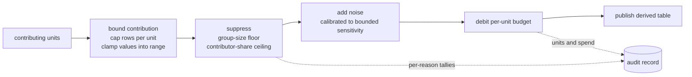
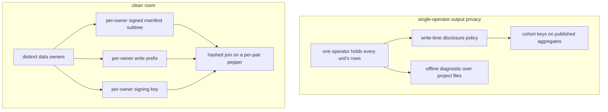
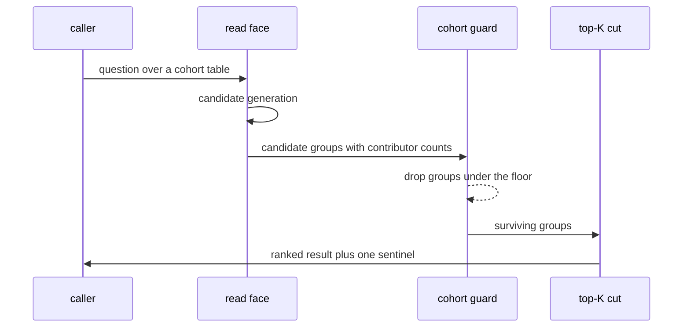

# Aggregate disclosure and derived results

A derived result answers a question over many contributors without handing any contributor's
rows to the party asking. This file fixes the two settings such a result is derived in, the
classification that marks what is sensitive, the ordered pipeline a release runs, the
suppression signal a consumer sees, the reviewed templates a releasing principal executes,
and the boundary between a per-person table and a cohort table.

## Parties

| Party | Obligation |
| --- | --- |
| **The operator** | Names the deployment setting, classifies each sensitive column with its class and its masking strategy, and attaches a disclosure policy to every published aggregate-shaped model. Declares which tables are governed per person and which as cohorts. |
| **The build** | Enforces the attached policy at materialization, stages no cell the policy would suppress, rolls the contributor breakdown up after suppression, and records the policy hash on the run. |
| **The engine** | Bounds each unit's contribution before deriving, holds the raw read for the duration of one journaled run, and performs a segment's activation under its own capability. |
| **The releasing principal** | Executes a reviewed template with typed arguments, and holds read on the derived output rather than on the contributing rows. |
| **The escrow** | Carries per-pair peppers between two owners, holds no signing material, and sees ciphertext where a tenant's columnar files pass through it. |
| **The consumer** | Takes a rule-free sentinel and the truncation flag as the whole disclosure signal a result carries, and reads the per-rule breakdown from the audit record. |

## Operations

| Operation | What it governs |
| --- | --- |
| `set-mode` | The two deployment settings, their preconditions, the offline diagnostic, and the cross-owner join. |
| `classify` | Column sensitivity classes, their declaration site, and the digest an exhaustible class declines on its own. |
| `release` | The ordered derivation pipeline, the write-time disclosure policy, per-unit budgets, and segment activation. |
| `suppress` | The group-size floor, the contributor-share ceiling, and the single signal a suppressed group leaves behind. |
| `template` | Typed strictly-bound relations, the allowlist that authorizes them, their tool projection, and the row ceiling. |
| `bound-cohort` | The line between a per-person table and a cohort table, and what an ownership question resolves to. |

## Clauses — set-mode

A derived result is computed in one of two settings, and the machinery each carries is
disjoint from the other's.

| Clause | Statement | decided-by |
| --- | --- | --- |
| `disclosure.set-mode.invariant.deployment-setting` | Two settings derive results. Single-operator output privacy has one operator holding every contributor's rows and computing over them, where a published aggregate exposes no individual contributor. A clean room is a query pattern across a trust boundary between distinct data owners, fixed by that boundary rather than by the result being derived. | |
| `disclosure.set-mode.invariant.mode-declaration` | A deployment declares its setting once at project open, and the diagnostic profile, the manifest shape and the token narrowing each follow from that declaration rather than from the presence of a derived table. | |
| `disclosure.set-mode.invariant.single-operator-mode` | In the single-operator setting the write-time disclosure policy governs, a published aggregate carries cohort keys and no subject or tenant identifier column, a tenant opt-out cascades into derived tables along subject lineage, and the trail covers every read and every publication. | |
| `disclosure.set-mode.invariant.mode-exclusion` | The single-operator setting carries none of the cross-owner machinery: no per-tenant signed manifest subtrees, no per-tenant signing keys, no hashed joins between tenants, no mutually-distrusting write prefixes, no escrow store. Its trust assumption is stated outright — contributors trust the operator with raw rows. | |
| `disclosure.set-mode.workflow.disclosure-diagnostic` | The single-operator diagnostic validates preconditions over the project files alone: the manifest, plus the referenced statement text of each published model, read from local disk. | |
| `disclosure.set-mode.limit.diagnostic-request` | The diagnostic issues 0 requests against the object store, and a deployment validates its configuration with no network reachable. | |
| `disclosure.set-mode.refusal.policy-coverage` | A published aggregate-shaped model carrying neither a disclosure policy nor a recorded opt-out fails the diagnostic with `DisclosurePolicyAbsent`. | `0259` |
| `disclosure.set-mode.refusal.model-file` | A published model whose referenced statement text does not read raises `DisclosureModelUnreadable`. An unreadable file is refused rather than passed over. | `0259` |
| `disclosure.set-mode.invariant.diagnostic-warning` | Two findings warn and leave the diagnostic passing: a table declaring no subject column, where the erasure cascade has nothing to follow; and a declared subject column carrying no row-level rule, where contributor rows are undivided between tokens. | |
| `disclosure.set-mode.limit.aggregate-shape-test` | The aggregate-shape test is a case-insensitive scan for a grouping clause over a model's statement text, with comments and string literals stripped ahead of the scan, and a model carries at most 1 entries declaring its output is not a cross-subject aggregate. | |
| `disclosure.set-mode.invariant.shape-scan` | The declaration silences the coverage finding alone, and a disclosure policy attached to the same model still governs its build. The scan is blind in the other direction too: a global rollup, a distinct projection and a windowed partition spell no grouping clause and pass unflagged, leaving the policy on such a model for the operator to declare unprompted. | |
| `disclosure.set-mode.refusal.clean-room` | A cross-owner deployment carries three deployment requirements rather than trust assumptions: per-tenant signed manifest entries, per-tenant write prefixes enforced by the object store's own access policy, and per-tenant signing keys held in each owner's own key store. A store meeting fewer than all three raises `DisclosureCleanRoomPreconditionUnmet` and the setting declines to operate against it. | `0260` |
| `disclosure.set-mode.workflow.cross-owner-diagnostic` | The cross-owner profile validates the configuration ahead of any write that crosses a prefix boundary, checking the subtree signatures, the prefix policy and the key locations that the setting rests on. | |
| `disclosure.set-mode.shape.tenant-prefix` | Two or more owners' instances share one object store, each writing under its own prefix with its own write-time redaction, and each granting the other's agents tokens narrowed to hashed joins and reviewed templates. | |
| `disclosure.set-mode.invariant.manifest-subtree` | Per-tenant manifest entries hang in a hash tree, and a reader verifies the path from its own subtree to the root before trusting an entry. A co-tenant rewriting the top-level manifest is detected by that verification. | |
| `disclosure.set-mode.invariant.escrow` | Signing material stays in each owner's own key store and the escrow holds none of it, so a forged cross-owner grant has no signer. Per-owner encryption of the columnar files leaves the escrow operator with ciphertext. | |
| `disclosure.set-mode.workflow.hashed-join` | Two owners holding disjoint datasets match on a key without either seeing the other's rows: each writer hashes the key at write time, and the join keeps the rows present on both sides. | |
| `disclosure.set-mode.refusal.pepper` | A join keyed on a static pepper raises `DisclosureStaticPepper`. The floor is a per-pair pepper, re-randomized for the pairing, exchanged through escrow and rotated per join. | `0261` |
| `disclosure.set-mode.invariant.key-domain` | A key space an adversary enumerates end to end is carried into the join alongside a group-size floor, and the matched rows reach a consumer as an aggregate rather than as matches. | |

## Clauses — classify

Classification is the operator's declaration of what a column holds; every downstream
consequence keys on it. The strategies a classified column resolves to are
`spec/41-enforcement.md` § Column restriction, which holds the masking vocabulary itself.

| Clause | Statement | decided-by |
| --- | --- | --- |
| `disclosure.classify.shape.sensitive-column` | A column declares a `pii_type` and a masking `strategy` under `[pipeline.tables.policy.columns]`, written as `{ pii_type = "phi", strategy = "redact" }`. | |
| `disclosure.classify.invariant.column-scope` | Classification attaches to a named column of a named table. A column carrying no declaration carries no class, and a class on a table as a whole has no meaning. | |
| `disclosure.classify.invariant.pii-class` | The tag states which columns the operator holds to be sensitive, and the engine carries every consequence that follows — placement floors, masking, and the protections a release owes. | |
| `disclosure.classify.shape.class-vocabulary` | `pii_type` takes a value from the registered class set. `phi` marks protected health data; `ssn`, `phone`, `email` and `mrn` mark the identifier classes whose value space is enumerable end to end. | |
| `disclosure.classify.refusal.class-vocabulary` | A `pii_type` outside the registered class set raises `DisclosureUnknownSensitivityClass` at manifest check, and an unrecognized tag is refused rather than treated as unclassified. | `0262` |
| `disclosure.classify.shape.exhaustible-class` | An exhaustible class is one whose entire value space is generable offline — a social security number, a telephone number, an email address, a medical record number — where a digest is invertible by enumeration. | |
| `disclosure.classify.refusal.digest` | A `hash` strategy standing alone over an exhaustible class raises `DisclosureDigestUnqualified`. The secondary that satisfies it is `combine = "truncate:<n>"`, the one pairing that generalizes a digest. | `0262` |
| `disclosure.classify.limit.digest-width` | A hash digest is 32 chars wide, and a truncation declared at or past that width removes nothing from the primary's output. | |
| `disclosure.classify.limit.token-width` | A token is 20 chars wide, and the same width equality holds for a truncation layered over it. | |
| `disclosure.classify.refusal.combine` | Two pairings leave the primary's output unchanged and raise `DisclosureCombineDoesNotGeneralize`: a truncation at or past the primary's own output width, and a numeric generalization layered over a hexadecimal digest, which returns the digest at write time and fails its cast at read time. | `0262` |
| `disclosure.classify.invariant.truncation-width` | Whether a narrower truncation generalizes far enough against the column's value space rests with the operator. The engine refuses the widths that provably remove nothing and accepts the rest. | |
| `disclosure.classify.invariant.combine` | A column's complete mask carries the primary and the secondary as one value whose halves do not separate. A consumer holding that value has no path to the primary alone, and dropping a mandated secondary is a compile error rather than a quietly weaker mask. | |
| `disclosure.classify.invariant.class-reach` | A class declared on a column reaches every layer that touches the column — write-time removal, query-time transformation, placement resolution, and the protections a release applies to a key it joins on. | |

## Clauses — release

A release derives an output over many contributors and publishes the output alone. The build
that attaches a policy to a model is `spec/31-pipeline.md` § Model declaration; a model
carries its policy into materialization.

| Clause | Statement | decided-by |
| --- | --- | --- |
| `disclosure.release.invariant.privacy-unit` | The privacy unit is the protected entity — a tenant, or the individual a row is about — and never the row. One unit contributes many rows, and every release primitive is scoped to the unit. | |
| `disclosure.release.invariant.leak-surface` | A release closes two surfaces. Output leakage is the published result revealing a specific unit to a consumer holding its own rows and public side information. Process leakage is the deriving job acquiring standing raw read across every unit and becoming a centralized copy. | |
| `disclosure.release.workflow.release-pipeline` | A statistics release applies four steps in a fixed order: bound each unit's contribution by capping rows per unit and clamping per-row values into a declared range; suppress groups under the distinct-contributor floor; add noise calibrated to the bounded sensitivity; debit the per-unit budget. | |
| `disclosure.release.invariant.contribution-bound` | Contribution bounding leads the order, and the bounded sensitivity is what the noise calibration takes as input. A capped unit also enters the concentration check with a mass the cap has already limited. | |
| `disclosure.release.workflow.release-job` | A release executes as a journaled run-path job: it reads each unit through the replication-edge filter, applies the contribution cap at read, derives the output, and publishes it as a first-class table. The deriving principal is granted read on that output. The raw read exists for the duration of one journaled run and belongs to the engine rather than to a person as a standing capability. | |
| `disclosure.release.invariant.release-provenance` | Each release records which units contributed and what each was charged for a statistics release, or the pool and the resulting sizes for a segment. The record is journaled and hash-linked, and a unit audits its own inclusion and its own spend from it. | |
| `disclosure.release.invariant.central-copy` | Each unit keeps its own write-time redaction and its own encryption key. A deriving job reads materialized aggregates and embeddings, and no operator holds a decryptable copy of every unit's raw rows in one place. | |
| `disclosure.release.workflow.disclosure-policy` | A model declares the policy its materialization is safe by construction under: the permitted grouping columns, the minimum group size, the contributor key, the maximum contributor share, whether a sentinel is emitted, and the forbidden columns. A run that would breach the declaration suppresses per policy or refuses, and a breaching cell is never staged. | |
| `disclosure.release.invariant.unpublished-model` | The declaration binds published and unpublished models alike. An unpublished cohort table read over the statement surface discloses everything a published one would. | |
| `disclosure.release.invariant.contributor-breakdown` | A governed model's statement emits one row per group and contributor, carrying that contributor's own measures. That shape is the only one per-contributor mass reads out of, and therefore the only one a concentration ceiling is enforceable over. | |
| `disclosure.release.invariant.published-shape` | After suppression the engine sums each numeric measure per group and casts it back to the column's declared type. Attaching a policy moves no published column: identical statement and contract yield identical columns and an identical schema fingerprint, governed or not. | |
| `disclosure.release.refusal.grain-column` | A non-numeric, non-grain column rides the grouping rather than an arbitrary pick, and one that is not constant within its group raises `DisclosureDuplicateGrain`. | `0263` |
| `disclosure.release.refusal.group-key` | A group key that is not a subset of the permitted grouping columns raises `DisclosureGroupKeyNotPermitted`, so a finer group is unreachable by editing the statement alone. | `0263` |
| `disclosure.release.refusal.contributor-key` | A governed model whose statement omits the contributor key raises `DisclosureContributorKeyAbsent`. A policy that cannot count contributors has nothing to suppress on. | `0263` |
| `disclosure.release.refusal.forbidden-column` | A contract declaring a forbidden column, and a materialization producing one, each raise `DisclosureForbiddenColumnPublished`. | `0263` |
| `disclosure.release.invariant.key-exclusion` | The contributor key is a model output consumed by the policy and excluded from the published column set. Naming one column as both the contributor key and a forbidden column is coherent: the forbidden check evaluates the post-exclusion columns. | |
| `disclosure.release.invariant.policy-hash` | Every run records a hash over the declared policy fields, with both set-valued fields sorted ahead of hashing, so reordering a manifest entry moves no hash. The hash lands on the freshness record and on the append-only build log. | |
| `disclosure.release.invariant.policy-log` | The log entry outlives a build: freshness advances past a materialization and the appended entry does not, so a replay or an inspection long afterwards reads which thresholds governed a given build. A downstream attestation therefore names the exact policy behind the cells it rests on. | |
| `disclosure.release.shape.aggregate-grant` | An aggregate grant carries a minimum group size, a maximum single-contributor share of the metric mass, the permitted aggregate functions, a ceiling on groups per query, and a row ceiling. | |
| `disclosure.release.invariant.grant-read` | Table authority for a raw read derives from read grants alone. A write-only grant and an aggregate-only grant contribute no tables to the statement surface, to search, to recall or to entity reads, and a named query grant authorizes its template's tables inside that template's session. | |
| `disclosure.release.limit.group-ceiling` | An aggregate grant's groups-per-query ceiling is at least 1 entries, and a query producing more groups than the ceiling is cut at it. | |
| `disclosure.release.shape.unit-budget` | A per-unit privacy budget is a catalog-tracked grant constraint of the same shape as the group-size floor: the release declares a per-run spend and a per-unit lifetime cap. | |
| `disclosure.release.refusal.budget-exhaustion` | The runtime debits each contributing unit at the end of a release and stops drawing on an exhausted one, raising `DisclosureUnitBudgetExhausted` where the release names that unit explicitly. | `0264` |
| `disclosure.release.workflow.segment` | A lookalike segment releases a segment identifier, its size, coarse composition cells, and an activation handle. Member rows and per-member scores stay inside the engine. | |
| `disclosure.release.invariant.activation-handle` | The action a handle names — an email, a push, an advertising-platform sync — is performed by the engine under a capability scoped to activating that segment on that channel, and never to reading its members. | |
| `disclosure.release.limit.audience-floor` | A segment build declares `min_audience_size`, whose working value is 1000 subjects. | |
| `disclosure.release.refusal.audience-size` | A segment resolving below its declared audience floor raises `DisclosureAudienceBelowFloor` rather than emitting a sentinel, since an audience small enough to name one person is a re-identification. | `0265` |
| `disclosure.release.limit.composition-cell` | A composition cell below `stats_min_cell`, whose working value is 100 subjects, collapses into a sentinel cell. | |
| `disclosure.release.refusal.member-readback` | Readback on a segment is `stats_only`, and a request for its members raises `DisclosureSegmentMemberReadback`. | `0265` |
| `disclosure.release.workflow.candidate-pool` | Posture follows where candidates come from rather than the scoring mathematics. A pool drawn from the requesting tenant's own base crosses no owner boundary. A pool the operator owns carries the size gate, activation-only output and no readback, with consent and licensing owned by the operator. A pool drawn from other tenants' end users adds per-tenant isolation and a recorded cross-party consent contract. | |
| `disclosure.release.refusal.cross-party-pool` | A pool spanning other tenants' end users without a recorded consent contract raises `DisclosureCrossPartyPoolUnconsented`, and the pool kind is off by default. | `0266` |
| `disclosure.release.workflow.segment-scoring` | A segment profile is the centroid of the seed set's embeddings. Candidates rank by approximate nearest-neighbour search over the vector index and threshold at the requested target size, with embeddings produced through the provider-agnostic model endpoint. | |
| `disclosure.release.invariant.guarantee-strength` | A release bounded by contribution capping, small-cell suppression and reviewed templates is described as bounded. The differential-privacy description attaches to a release that also carries noise calibrated to the bounded sensitivity and a debited per-unit budget, and a size-gated opaque segment is described as exactly that. | |
| `disclosure.release.invariant.noise-reproducibility` | A release carrying calibrated noise yields figures that differ between two runs over identical inputs, and a consumer comparing runs reads the difference as noise rather than as movement in the underlying data. Small cells lose usable precision under the same calibration. | |
| `disclosure.release.invariant.repeated-release` | Two paths lead back to a member and are named rather than implied away: fine-grained composition statistics read repeatedly across shifting parameters, where differencing isolates one member; and membership inference through activation of tiny hand-crafted segments. Coarse composition cells and rate-limited rebuilds are the standing mitigations. | |

## Clauses — suppress

Suppression runs over the contributor breakdown and emits one signal, whichever rule fired.
Per-reason tallies land in `spec/44-accountability.md` § The audit record, where an operator
tuning thresholds reads them.

| Clause | Statement | decided-by |
| --- | --- | --- |
| `disclosure.suppress.limit.min-group-size` | A policy declares `min_group_size` as a count of distinct contributors, at least 2 subjects, and a group whose contributor count falls under it is suppressed. | |
| `disclosure.suppress.invariant.floor-scope` | The floor is a necessary guard against trivially small cells and is not itself the privacy boundary. It is silent on composition across repeated releases, presumes a fixed quasi-identifier set, leaves a homogeneous cell's shared value readable at full confidence, and says nothing about a cell one contributor dominates. | |
| `disclosure.suppress.limit.contributor-share` | A policy declares `max_contributor_share` above 0 percent and at most 100 percent, read as a fraction of a group's metric mass. | |
| `disclosure.suppress.invariant.dominance` | A group where any single contributor's share of the sign-insensitive metric mass exceeds the ceiling is suppressed even after clearing the size floor. A group of 6 contributors where one holds 80 percent of the mass discloses that contributor's own number: the median approximates it and the sum nearly equals it. | |
| `disclosure.suppress.refusal.dominance-evidence` | A group carrying a share constraint whose per-contributor masses are unavailable at evaluation raises `DisclosureDominanceUnverifiable` and is suppressed as unverifiable rather than published. | `0267` |
| `disclosure.suppress.refusal.empty-policy` | A policy setting neither threshold raises `DisclosurePolicySuppressesNothing`, since no group under it could ever be withheld. | `0263` |
| `disclosure.suppress.refusal.zero-floor` | A `min_group_size` of zero raises `DisclosureMinGroupSizeZero`. | `0263` |
| `disclosure.suppress.refusal.share-range` | A share at or below zero, and a share above one, raise `DisclosureShareOutOfRange` as malformed. | `0263` |
| `disclosure.suppress.refusal.grouping-allowlist` | An empty list of permitted grouping columns, and a permitted name that is not column-shaped, raise `DisclosureGroupingAllowlistEmpty`. | `0263` |
| `disclosure.suppress.invariant.sentinel` | Groups withheld under either rule collapse into one field-free sentinel carried under the group key `__suppressed__`, and the sentinel names no rule. | |
| `disclosure.suppress.invariant.suppression-count` | A caller counts no withheld groups and learns no rule from the output, so neither the existence of small groups nor the presence of a dominant contributor is inferable from what comes back. | |
| `disclosure.suppress.invariant.suppression-tally` | Per-reason tallies reach the audit record and nothing else. They are absent from caller-facing rows, from the response envelope, and from the published table. | |
| `disclosure.suppress.shape.sentinel-bit` | At build time the fact that suppression occurred rides the run's freshness record as a single boolean, surfaced when the policy asks for a sentinel, identical whether one group or a thousand were withheld. | |
| `disclosure.suppress.invariant.row-carriage` | The signal does not ride the published rows. A table with a declared column contract carries no marker in a date or integer grain column without breaking the contract check and the non-null grain invariant, and a marker row that satisfied the contract would be indistinguishable from data. | |

## Clauses — template

A template is a typed, strictly bound relation reviewed before anyone calls it. The grant
array an allowlist rides in is `spec/40-authority.md` § Grants, which holds the array's other
fields.

| Clause | Statement | decided-by |
| --- | --- | --- |
| `disclosure.template.shape.query-template` | A template declares an identifier, a single statement, positional typed parameters written `name:type` over integer, float, string, timestamp and boolean, and an optional row ceiling. | |
| `disclosure.template.interface.template-parameter` | A caller submits the identifier and its arguments by name, and writes no statement text of its own. | |
| `disclosure.template.refusal.argument-binding` | Binding is strict: a missing argument, an unknown argument and a type-mismatched argument raise `DisclosureTemplateBindingMismatch` ahead of execution, and no argument is silently coerced. | `0268` |
| `disclosure.template.workflow.template-validation` | Templates validate at manifest check and again at face startup, fail-closed, before any caller reaches them. | |
| `disclosure.template.refusal.placeholder-cover` | Placeholders that do not cover exactly the declared parameter list raise `DisclosureTemplatePlaceholderMismatch`. | `0268` |
| `disclosure.template.refusal.statement-count` | A declaration holding more than one statement raises `DisclosureTemplateMultiStatement`. | `0268` |
| `disclosure.template.refusal.template-identifier` | An identifier colliding with a built-in tool prefix raises `DisclosureTemplateIdentifierCollision`. | `0269` |
| `disclosure.template.refusal.plain-identifier` | A template naming anything other than a store table as a plain identifier raises `DisclosureTemplateNonPlainIdentifier` — no table functions, no bare paths, no qualified catalogs. A plain identifier may carry a path separator, and carries no dot, no star and no leading separator. The check is caller-independent and runs once at startup. | `0270` |
| `disclosure.template.invariant.template-enforcement` | A template's statement runs unrewritten while every enforcement layer still applies to what it touches: the allowlist, row restriction, column masking and placement resolution. | |
| `disclosure.template.invariant.template-allowlist` | A grant names the templates it executes in an allowlist, with a star standing for all of them. The field is a capability and denies by default: a grant carrying no allowlist confers no template access at all. | |
| `disclosure.template.invariant.attenuation` | Attenuation subsets the parent's allowlist and adds no identifier the parent withheld. The polarity is opposite to a constraint, which narrows rather than confers. | |
| `disclosure.template.refusal.template-grant` | Calling a template by guessed identifier raises `DisclosureTemplateNotGranted`, and listing honors the caller's grants, so an ungranted template appears nowhere. | `0269` |
| `disclosure.template.interface.projected-tool` | Every manifest template projects into a tool: the identifier becomes the tool name, and the declared parameters become the tool's typed schema, all of them required. | |
| `disclosure.template.invariant.manifest-surface` | The reviewed manifest is the single source of truth for the agent surface, and adding a metric is adding a template rather than deploying an application. | |
| `disclosure.template.invariant.row-ceiling` | The effective ceiling at execution is the smallest of the template's declared ceiling, the grant's per-query ceiling, the request's own, and the face limit. A component declaring none imposes none. | |
| `disclosure.template.limit.overfetch` | A capped result sets the response envelope's truncation flag, established by reading exactly 1 rows past the effective ceiling rather than by shortening rows already collected. | |
| `disclosure.template.interface.ceiling-advertisement` | The template's declared ceiling is advertised on the projected tool, and a consumer sizes one query against a fan-out ahead of the first call rather than discovering the bound from a shortened read. | |
| `disclosure.template.invariant.release-template` | A release runs a reviewed template with typed parameters. The releasing principal issues no free-form statement and no scoring pass over the unit set. | |

## Clauses — bound-cohort

A deployment declares, per table, whether its rows are governed as individuals or as cohorts.
The top-K cut is `spec/20-read.md` § Ranking, and the cohort floor runs ahead of it.

| Clause | Statement | decided-by |
| --- | --- | --- |
| `disclosure.bound-cohort.shape.governance-declaration` | A table's policy block declares `governance = "per-person"` or `governance = "cohort"`. A per-person table is governed at the grain of its source; a cohort table is governed by a group-size floor. | |
| `disclosure.bound-cohort.invariant.default-governance` | A table declaring neither value resolves to cohort governance, and a read of it carries the floor. | |
| `disclosure.bound-cohort.refusal.dual-governance` | A table declared under both regimes raises `DisclosureCohortDualGovernance`. One table is governed one way. | `0271` |
| `disclosure.bound-cohort.invariant.cohort-floor` | On a cohort table the floor guard runs after candidate generation and before the top-K cut, so an under-floor group is dropped ahead of being counted, returned, or scored into a visible aggregate. | |
| `disclosure.bound-cohort.invariant.under-floor-group` | An under-floor group collapses into a sentinel and its rows leave the result set, with no partial figure and no rounded stand-in in its place. | |
| `disclosure.bound-cohort.refusal.cohort-widening` | A read that would recover an under-floor group by merging it into a coarser key raises `DisclosureCohortWidening`. Widening is not a remedy for a suppressed group. | `0271` |
| `disclosure.bound-cohort.refusal.per-individual-row` | A per-individual row from a cohort-governed deployment requires an explicit grant on the reader's token, and a read without one raises `DisclosurePerIndividualUngranted`. | `0271` |
| `disclosure.bound-cohort.invariant.cohort-key` | A cohort table's group key names an attribute shared by many contributors — a region, an industry, a tenure band — and carries no identifier of a single person. | |
| `disclosure.bound-cohort.refusal.singleton-cohort` | A declared cohort key whose grain resolves to one person raises `DisclosureSingletonCohort` at declaration, ahead of any row landing under it. | `0271` |
| `disclosure.bound-cohort.invariant.ownership-answer` | An ownership question resolves to an artifact and the person attached to it — a code-owners entry, a directory's commit history, an issue's routing team, a page's owner field. The record speaks and the answer names what it says. | |
| `disclosure.bound-cohort.interface.person-artifact` | An ownership answer carries the artifact identifier, the field the attachment was read from, and the attached principal, so a reader checks the attachment at its source. | |
| `disclosure.bound-cohort.refusal.ranked-people` | A ranking of people, an aggregate computed over one person, and a count of one person's activity raise `DisclosureRankedPeopleRequest`. Those shapes are measurement of a person rather than a reading of a record. | `0272` |

## Shapes

A disclosure policy attached to a governed model:

```toml
[pipeline.models.revenue_by_industry]
statement = "models/revenue_by_industry.sql"
publish   = true

[pipeline.models.revenue_by_industry.disclosure]
grouping_allowlist   = ["industry", "region", "quarter"]
contributor_key      = "tenant_id"
min_group_size       = 5
max_contributor_share = 0.4
emit_sentinel        = true
forbidden_columns    = ["tenant_id", "subject_id", "account_email"]
```

The breakdown the governed statement emits, and the published rows the build rolls it up into:

```
-- emitted by the model: one row per (group, contributor)
industry   region  quarter  tenant_id  revenue
retail     emea    2        t-0191     412000
retail     emea    2        t-0044      98000
retail     emea    2        t-0332      61000
logistics  emea    2        t-0044      55000

-- published after suppression and roll-up
industry      region  quarter  revenue
retail        emea    2        571000
__suppressed__
```

A column classification and the mask it carries:

```toml
[pipeline.tables.contacts.policy.columns]
member_email   = { pii_type = "email", strategy = "hash", combine = "truncate:12" }
diagnosis_code = { pii_type = "phi",   strategy = "redact" }
record_number  = { pii_type = "mrn",   strategy = "hash", combine = "truncate:10" }
```

A template declaration and its tool projection:

```toml
[[manifest.templates]]
id         = "revenue_for_industry"
statement  = "SELECT quarter, revenue FROM revenue_by_industry WHERE industry = $1 AND quarter >= $2"
parameters = ["industry:string", "quarter:integer"]
row_ceiling = 500
```

```json
{
  "name": "revenue_for_industry",
  "input_schema": {
    "type": "object",
    "properties": {
      "industry": { "type": "string" },
      "quarter": { "type": "integer" }
    },
    "required": ["industry", "quarter"]
  },
  "row_ceiling": 500
}
```

The envelope a capped template read returns:

```json
{
  "rows": [{ "quarter": 2, "revenue": 571000 }],
  "truncated": true,
  "row_ceiling": 500,
  "suppression_present": true,
  "disclosure_policy_hash": "sha256:4f1c…"
}
```

A segment release, carrying an activation handle and no members:

```json
{
  "segment_id": "seg-8f13c2",
  "size": 41200,
  "composition": [
    { "cell": "region:emea", "units": 26400 },
    { "cell": "region:apac", "units": 14800 },
    { "cell": "region:latam", "units": "__suppressed__" }
  ],
  "activation": { "handle": "act-2f90ab", "channel": "email", "readback": "stats_only" }
}
```

The clean-room object-store layout, one prefix per owner under one shared root:

```
store-root/
  manifest.root.json          hash-tree root over the per-owner entries
  owners/
    owner-a/
      manifest.entry.json     signed under owner A's own key
      tables/…                encrypted under owner A's key
    owner-b/
      manifest.entry.json     signed under owner B's own key
      tables/…                encrypted under owner B's key
  escrow/
    peppers/<pair-id>         per-pair material, re-randomized per join
```

The ordered release pipeline:



The two deployment settings and the machinery each carries:



Where the cohort floor sits relative to ranking:



## Unsettled

unsettled: How does a project pepper rotate when rows already written keep the prior pepper and the joinability hashing exists to preserve breaks across the rotation boundary? owner: disclosure affects: disclosure.set-mode

unsettled: At what risk threshold does a per-pair re-randomized pepper stop being the floor, and is the upgrade a private set intersection over a Diffie-Hellman key exchange or a trusted-execution join? owner: disclosure affects: disclosure.set-mode

unsettled: Does the single-operator diagnostic require a published aggregate to declare its subject and tenant identifier columns forbidden, rather than permitting the declaration per model? owner: disclosure affects: disclosure.set-mode

unsettled: Does a policy hash cover a grouping allowlist reordered inside a nested table, or does sorting apply at the top level alone? owner: disclosure affects: disclosure.release

unsettled: How is a rebuild rate limit on a segment expressed — rebuilds per interval per tenant, or a cooldown attached to the segment identifier? owner: disclosure affects: disclosure.release

unsettled: Does an ownership answer over an artifact with several attached principals return all of them, or resolve to the most recent attachment? owner: disclosure affects: disclosure.bound-cohort
