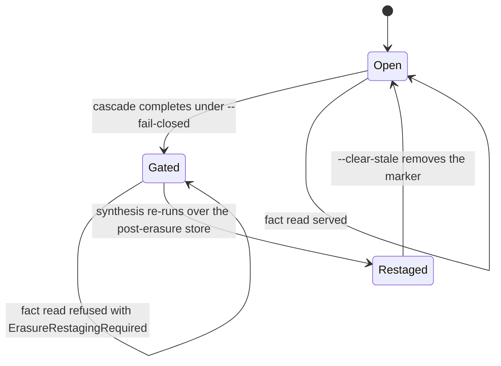
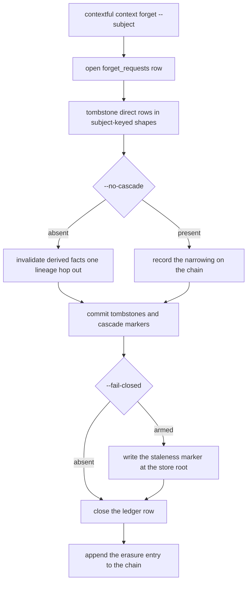
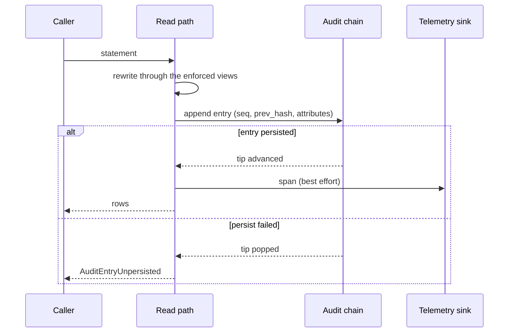
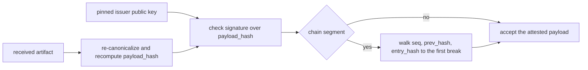

# Audit, erasure and the receipt

Four operations carry this contract. `record` is what a read leaves behind. `attest` turns
that record into evidence a third party checks. `erase` removes a subject or a tenant from
the store. `receipt` is the signed artifact a tenant purge hands back.

## Parties

| Party | Obligation |
| --- | --- |
| **The read path** | Emits one span and appends one linked entry for each read it serves, and withholds rows whose entry did not reach durable storage. |
| **The engine** | Links each entry to its predecessor, signs a segment root on a fixed cadence, and opens no outbound connection an operator did not configure. |
| **The erasing operator** | Drives a subject erasure or a tenant purge through one audited verb, and attests re-synthesis before releasing the restaging gate. |
| **The auditor** | Checks a chain, a lineage attestation and a purge receipt offline, against a pinned issuer public key and identifiers already in hand. |
| **The deploying organization** | Owns data classification, retention process, and the audit program these mechanisms feed. |
| **The receipt holder** | Reads the coverage block ahead of the counts, and asserts over the canonical store what the claim scopes and nothing wider. |

## Operations

| Operation | What it governs |
| --- | --- |
| `record` | The span a read emits, the audit entry and its linkage, the attributes each entry carries, and where telemetry lands. |
| `attest` | Chain verification, signed segment roots, lineage and access explanations, and the strength each guarantee carries. |
| `erase` | The declared subject column, the request ledger, direct tombstones, the lineage cascade, the tenant rewrite, and propagation to replicas. |
| `receipt` | The signed purge artifact: its claim, its coverage block, its idempotence, and credential-free verification. |

## Clauses — record

A read produces two artifacts at once: a span for querying and an entry for proving.

| Clause | Statement | decided-by |
| --- | --- | --- |
| `accountability.record.shape.span` | Each read emits a [[span]] carrying the full subject tuple, every field's attestation label, the token identifier with its issue time, a hash of the rewritten statement and the tables it touched, the named row rules and column masks applied, the zone counters, and the result's row count, byte count and suppressed-group count. | |
| `accountability.record.shape.entry` | An audit [[entry]] is one JSON line carrying `seq`, `prev_hash`, the attributes, and `entry_hash` computed as `sha256(seq ‖ prev_hash ‖ attributes)`. | |
| `accountability.record.invariant.attribute-parity` | The attributes on an entry are the attributes on the span for that same read, plus the sequence number and the predecessor link. One read produces one of each. | |
| `accountability.record.shape.attribute-namespace` | Every attribute key is namespaced under `contextful.`, grouped by what it describes: `contextful.subject.*`, `contextful.query.*`, `contextful.row.*`, `contextful.result.*`, `contextful.erasure.*`. | |
| `accountability.record.shape.segment-file` | Entries append to a numbered segment file, one line per entry in ascending sequence, and a sibling root file closes the segment it names. | |
| `accountability.record.invariant.hashed-statement-is-the-rewritten-one` | The digest covers the statement after registration and rewriting, together with the relations it resolved to, rather than the text the caller submitted. | |
| `accountability.record.shape.zone-counters` | The zone counters state how many candidates the placement filter removed and how many survived it, per read. | |
| `accountability.record.shape.suppression-counts` | Per-reason counts of suppressed groups land on the chain and reach no caller-facing row, keeping the count answerable to an auditor and closed to a consumer. | |
| `accountability.record.invariant.genesis` | The [[genesis]] entry's predecessor field is the literal `sha256:` followed by 64 zeros. Removing or resequencing any entry after it breaks the linkage at that point. | |
| `accountability.record.invariant.tip-continuity` | The persisted chain loads at startup and fresh entries link onto its existing tail. A segment file that is absent reads as an empty chain rather than as an error. | |
| `accountability.record.refusal.unpersisted-entry` | A read whose entry cannot be written — a full disk, a denied permission, an unreachable bucket — is refused with `AuditEntryUnpersisted`, and the caller receives no rows. | `0273` |
| `accountability.record.invariant.no-unaudited-row` | No path returns rows without a durable entry covering them. The refusal above is the sole outcome when the write path fails. | |
| `accountability.record.invariant.tip-rollback` | A failed persist pops the in-memory tip, leaving the process state and the on-disk segment in agreement about the last accepted sequence number. | |
| `accountability.record.invariant.query-digest` | The read path records `contextful.query.hash` as `sha256:<hex>` over the statement text. The statement itself, and therefore any literal inside it, stays off the chain. | |
| `accountability.record.shape.visibility-attributes` | A read against a visibility-bound table additionally records the fidelity level, the resource grain, the mirror lag, the degraded flag, the group-closure depth walked, and whether a federated leg answered part of the request. | |
| `accountability.record.shape.disclosure-attribute` | A read returning health-tagged columns records `contextful.row.phi_columns_returned`, making the count of such disclosures answerable from the record rather than reconstructed from queries. | |
| `accountability.record.invariant.two-surfaces` | Two surfaces carry different jobs. [[telemetry]] is the queryable projection an operator searches; the [[chain]] is the attestable record, authoritative on whether anything was altered. | |
| `accountability.record.limit.projection-window` | The projection answers which agent read which table under which policy across a rolling window of 24 h. | |
| `accountability.record.limit.projection-latency` | Such a lookup returns within 1 s. | |
| `accountability.record.invariant.sink-independence` | An unreachable telemetry sink does not stop the local chain from growing. Spans dropped at the collector leave the entries intact. | |
| `accountability.record.interface.default-sink` | The export endpoint resolves unset, and spans go to a no-op sink until an operator points them at a collector. | |
| `accountability.record.refusal.default-egress` | A default configuration issues no usage ping, no license-server contact and no auto-update probe; a build that introduces an outbound call reachable without operator configuration raises `UnconfiguredEgress`. | `0274` |
| `accountability.record.interface.update-check` | An update check is opt-in through `[update] check = true`, fetches a release manifest, and transmits nothing about the deployment. | |

## Clauses — attest

Verification, the signed artifacts it consumes, and the precise reach of each claim.

The signing port that produces a root without surrendering the key is specified in
`spec/40-authority.md` § Custody; a custody model that keeps its key sealed still signs
here.

| Clause | Statement | decided-by |
| --- | --- | --- |
| `accountability.attest.interface.verification-walk` | Verification walks the chain checking each entry's sequence number, its link to the predecessor, and its recomputed digest, and returns the index of the first entry that fails any of the three. | |
| `accountability.attest.interface.verify-command` | `contextful audit verify` loads the persisted chain, checks every link, and exits non-zero naming the break. | |
| `accountability.attest.refusal.broken-link` | A recomputed digest disagreeing with the stored one, or a gap in the sequence, raises `AuditChainBroken` carrying the index of the earliest such entry. | `0275` |
| `accountability.attest.workflow.partial-history` | Verification over a chain whose earliest segment is absent reports the lowest sequence it holds and checks forward from there, distinguishing a truncated archive from an altered one. | |
| `accountability.attest.invariant.explanation-is-itself-recorded` | Running a lineage or access explanation appends its own entry, so a question asked about the record joins the record. | |
| `accountability.attest.shape.signed-root` | A [[signed-root]] is `{root, count, signature}` over the tip hash of the segment it closes. | |
| `accountability.attest.limit.appends-per-root` | The runtime signs a root every 16 entries. | |
| `accountability.attest.limit.root-commit-cadence` | Signed roots reach the replication bucket on a configurable cadence of 10 min, carrying audit history off the node that produced it. | |
| `accountability.attest.invariant.scheme-from-the-pinned-key` | A root carries no algorithm field; the pinned public key's scheme decides how the signature is checked, and verification accepts a pinned key of either supported scheme. | |
| `accountability.attest.shape.attestation` | A signed attestation carries `payload_hash` — the digest over the canonical payload bytes — the hex signature over that digest, and the issuer public key in its tagged distribution form. | |
| `accountability.attest.invariant.self-verifying` | An auditor checks the payload against its digest, then the digest against the signature and key. Both steps run without a network call and without a credential. | |
| `accountability.attest.interface.lineage-summary` | `contextful audit explain --fact <id>` returns the synthesis stage, the model identity with its endpoint, the prompt digest, the contributing run, the evidence cardinality band, and the distinct source tables. | |
| `accountability.attest.shape.cardinality-band` | Evidence volume appears as a [[cardinality-band]] drawn from `0`, `1-9`, `10-99`, `100+`. | |
| `accountability.attest.invariant.no-evidence-identifiers` | Row identifiers of contributing evidence appear nowhere in a [[lineage-attestation]]. The summary answers where a fact came from while withholding who contributed to it. | |
| `accountability.attest.shape.policy-digest` | An attestation names the disclosure-policy digest its evidence tables were published under: a single value when the contributing tables agree, the full array when they differ, null when no contributing table declares one. | |
| `accountability.attest.invariant.substrate-not-attestation` | The engine supplies a [[compliance-substrate]] — erasure, residency-aware placement, sensitive-column tagging, a tamper-evident chain — and is not itself a certification of any regime. Mechanism sits with the engine; classification, process and audit sit with the deploying organization. | |
| `accountability.attest.invariant.at-rest-qualifier` | A stolen object-store credential reveals redacted columnar files for columns redacted at write time whose sidecar indexes are encrypted under the key that covers the table. That qualifier travels with the guarantee wherever it appears. | |
| `accountability.attest.invariant.query-time-mask-is-visible-at-rest` | A column protected at the query layer alone sits in cleartext in the bytes on disk, and a credential over the bucket reads it. | |
| `accountability.attest.invariant.qualifier-exclusions` | The guarantee omits three cases: a column protected at the sync layer, a vector, full-text or bloom sidecar left outside the table's encryption, and a tokenized column where the same actor holds the tokenizing key. | |
| `accountability.attest.refusal.unqualified-guarantee` | Authored text asserting the at-rest guarantee without the qualifier beside it raises `AtRestClaimUnqualified`. | `0276` |
| `accountability.attest.interface.transparency-log` | An external append-only transparency log accepts signed roots, making a segment removed or rewritten after the fact detectable. It is off by default and no deployment depends on it. | |
| `accountability.attest.interface.access-explanation` | `contextful audit explain --subject <s> --resource <r>` returns VISIBLE or DENIED together with the path that produced it: the resolved principals with their link methods and asserted links marked as conferring nothing, the group closure walked with each node's depth, the resource's observed visibility class, every grant path found, and the watermark time with its lag and a CURRENT or STALE verdict. | |
| `accountability.attest.invariant.decision-without-a-row` | An access explanation returns a decision and a path. It carries no row, no field value and no excerpt from the resource it decides about. | |
| `accountability.attest.invariant.never-observed-is-not-denied` | A resource carrying no observation prints NEVER OBSERVED in place of a denial, and a source that has completed no full sweep prints that reads are refused under any budget. | |
| `accountability.attest.interface.denial-names-its-cause` | A denial reached in spite of a live grant path names what overrode it — a tombstone in force, or an observation class the mirror does not recognize. | |
| `accountability.attest.workflow.windowed-replay` | Over a window, the explanation replays the decision at each recorded observation inside it and prints every one, followed by coverage: the observation count, the sweep count, the widest gap, and how many gaps exceed the budget, flagged. The verdict reads VISIBLE AT SOME OBSERVED POINT or NOT VISIBLE AT ANY OBSERVED POINT. | |
| `accountability.attest.refusal.empty-window` | A window holding zero observations returns `AssuranceWindowEmpty` and the words "no claim can be made" in place of a negative verdict. | `0277` |
| `accountability.attest.invariant.assurance-is-scoped` | [[negative-assurance]] covers observed states. Output carries the observation intervals and flags every gap wider than the budget, and a bare "never" without that qualification is refused. | |
| `accountability.attest.invariant.groups-not-individuals` | A reader-facing explanation names the groups along a path and not the individuals inside them, and it is delivered privately to the asking operator. | |
| `accountability.attest.workflow.overshare-report` | Grants are rows, so the [[overshare-report]] is a single aggregate over the mirror answering which resources a share of the organization above a declared threshold can read. It runs over the same tables the read path enforces on. | |
| `accountability.attest.interface.overshare-threshold` | The organizational share above which a resource appears in the report is a parameter of the query, and the report prints the threshold it ran under beside the rows it returns. | |
| `accountability.attest.invariant.reporting-is-not-remediation` | The engine narrows and reports; repairing a source's sharing stays with the operator's access-governance work. | |

## Clauses — erase

One verb drives both paths. The subject path tombstones and cascades; the tenant path
rewrites.

The complement this section's purge predicate takes is the tenant filter in
`spec/41-enforcement.md` § Row restriction — one predicate keeps what the other admits.
Marker replication to the bucket is `spec/11-sync.md` § Root objects, which decides what
a replica inherits while a table is withheld. The derived facts a cascade invalidates are
the shapes in `spec/21-memory.md` § Belief revision. The compaction pass that rewrites a
reachable file is `spec/10-store.md` § Compaction; a purge reaches the files it leaves
behind on its own schedule rather than waiting for one.

| Clause | Statement | decided-by |
| --- | --- | --- |
| `accountability.erase.shape.subject-column` | A table names its subject-identifier column in the manifest, as `subject_id = "user_id"` under `[[pipeline.tables]]`. Erasure addresses a person through that column. | |
| `accountability.erase.refusal.undeclared-subject-column` | A subject erasure against a table that declares no subject column raises `ErasureSubjectUndeclared` naming the table, rather than guessing at a key. | `0278` |
| `accountability.erase.shape.ledger` | The catalog table `forget_requests(request_id, tenant_hash, subject_hash, requested_at, completed_at)` holds one row per erasure request. | |
| `accountability.erase.invariant.hashed-ledger-keys` | `tenant_hash` and `subject_hash` are written `sha256:<hex>`, one of the pair null per path, and the ledger holds no cleartext identifier at any position. | |
| `accountability.erase.invariant.ledger-row-brackets-the-work` | A ledger row opens ahead of the first tombstone and takes its `completed_at` after the last commit, so an interrupted operation leaves an open row naming what was in flight. | |
| `accountability.erase.invariant.key-hashed-at-the-boundary` | The verb accepts a cleartext subject or tenant key, hashes it at the command boundary, and writes nothing but the digest onward. | |
| `accountability.erase.invariant.ledger-survives-a-rebuild` | `forget_requests` counts as engine journal state rather than derivable cache, and sits outside the set a catalog rebuild drops. A rebuilt catalog still carries every completed request. | |
| `accountability.erase.interface.forget-command` | `contextful context forget` is the single audited verb: `--subject <key>` drives the subject path, `--tenant <id>` the purge, `--no-cascade` narrows the subject path to direct rows, `--fail-closed` arms the restaging gate, `--clear-stale` releases it. | |
| `accountability.erase.workflow.direct-tombstones` | The subject path writes a [[tombstone]] over every row about that person in the subject-keyed shapes: facts keyed on `subject_id`, entities keyed on `entity_id`, preferences keyed on `subject_id`. | |
| `accountability.erase.workflow.lineage-cascade` | A derived fact whose provenance lists evidence referencing the subject key, or referencing any identifier the direct pass tombstoned, is invalidated in the same operation. The [[cascade]] travels one lineage hop. | |
| `accountability.erase.invariant.cascade-reaches-everything-derived` | One hop covers every artifact the store derived about the subject, including rows a self-directed run filed of its own accord. | |
| `accountability.erase.interface.no-cascade-flag` | `--no-cascade` confines the operation to direct rows and records that narrowing on the chain, leaving an incomplete erasure visible to the next auditor. | |
| `accountability.erase.invariant.markers-precede-the-return` | With replication configured, both paths commit their tombstones and cascade markers as part of the operation itself rather than deferring them to a later push. The verb returns after that commit. | |
| `accountability.erase.invariant.failed-push-degrades` | A push that fails downgrades to a warning. The markers hold on local disk and reconcile at the next successful commit. | |
| `accountability.erase.shape.staleness-marker` | `--fail-closed` writes a `{subject_hash, executed_at}` object at the store root once the cascade completes. | |
| `accountability.erase.refusal.stale-derived-read` | While that object stands, every fact read — recall, command line and tool surface alike — is refused with `ErasureRestagingRequired`, which names the re-synthesis the operator owes and the verb that clears it. | `0279` |
| `accountability.erase.invariant.gate-clears-on-attestation` | `--clear-stale` removes the object after synthesis has run over the post-erasure store, and the operator's attestation is what the removal records. | |
| `accountability.erase.invariant.marker-replicates-as-bookkeeping` | The [[staleness-marker]] holds no rows and belongs to the set of root objects a replica receives while a table is withheld, so a replica inherits the gate in place of serving derived facts built before the erasure. | |
| `accountability.erase.workflow.tenant-rewrite` | No partition segment separates tenants on disk, so a [[purge]] is a columnar rewrite: every file the read path can reach — committed runs, compaction snapshots, each model build — is rewritten retaining the rows outside the named tenant. | |
| `accountability.erase.workflow.purge-order` | A purge sweeps a fixed order — committed run files, then compaction snapshots, then each model build, then the memory mirror — and records a per-stage count as it goes. | |
| `accountability.erase.invariant.memory-mirror-uses-the-same-predicate` | The memory mirror is rewritten under the predicate the columnar files were rewritten under, leaving no derived copy admitting rows the base tables dropped. | |
| `accountability.erase.invariant.purge-predicate` | The rewrite keeps `NOT COALESCE(CAST(<tenant_col> AS VARCHAR) = '<tenant>', FALSE)`, byte for byte the complement of the filter a tenant-scoped grant compiles. The coalesce retains a null-tenant row that a bare inequality would have dropped. | |
| `accountability.erase.refusal.non-string-tenant-column` | A tenant column of a non-string type raises `PurgeTenantColumnType` in place of an implicit cast, since a guessed cast direction is where the rewrite and the read filter part company. | `0280` |
| `accountability.erase.refusal.undeclared-tenant-column` | The purge resolves where a tenant lives from the model's outermost partition key; no model declaring one raises `PurgeTenantUndeclared`. | `0280` |
| `accountability.erase.invariant.holds-yield-to-erasure` | Garbage collection skips a held build; erasure does not. A held materialization carrying the tenant's rows is rewritten like any other file and stays pinnable afterwards. | |
| `accountability.erase.invariant.write-lock-serializes-the-sweep` | The rewrite holds the per-model write lock across a table's whole sweep — the same lock builds, holds and collection take — leaving no window for a concurrent build to publish a fresh materialization behind it. | |
| `accountability.erase.refusal.capability-token-caller` | A purge presented with a capability token is refused with `PurgeRequiresOwner`, and that refusal is evaluated ahead of anything that would tell the caller what the store contains. | `0281` |
| `accountability.erase.shape.chain-attributes` | Each erasure appends to the same chain the read path writes, carrying `contextful.erasure.subject_hash` or `contextful.erasure.tenant_hash`, the request identifier, the stated reason, and the direct and cascaded counts. | |
| `accountability.erase.invariant.chain-does-not-redisclose` | Those attributes are hashes, so the chain confirms an erasure reached every derived artifact while naming nobody. | |
| `accountability.erase.invariant.replica-holds-until-refresh` | A replica consumes materialized snapshots read-only and holds erased rows until its next refresh brings the rewritten files. | |
| `accountability.erase.limit.propagation` | Request to last-replica refresh completes within 72 h. | |
| `accountability.erase.limit.expedited-collection` | Snapshots superseded by an erasure collect on an expedited schedule of 24 h. | |
| `accountability.erase.limit.default-retention` | Snapshots superseded by ordinary writes collect against a retention default of 7 d. | |

## Clauses — receipt

A tenant purge returns one signed artifact whose claim is narrower than destruction and
says so in its own body.

| Clause | Statement | decided-by |
| --- | --- | --- |
| `accountability.receipt.shape.body` | A [[receipt]] carries `receipt_version`, a `coverage` block, `tenant_hash`, an engine-minted `request_id` prefixed `prg_`, `completed_at`, per-table rows removed and files rewritten with the build identifiers touched, the derived-table cascade, and `prior_request_id`. | |
| `accountability.receipt.shape.signature-block` | The signature block is `{payload_hash, signature, public_key}` over the canonical payload, computed under Ed25519 or ES256 as the pinned key's scheme dictates. | |
| `accountability.receipt.interface.canonical-payload` | The payload is canonicalized before hashing, and `payload_hash` names the digest of exactly those bytes. A verifier re-canonicalizes and recomputes rather than trusting the transmitted digest. | |
| `accountability.receipt.invariant.claim-is-rewrite-and-exclude` | Version 1 attests rewrite-and-exclude across the canonical store: run files, snapshots, model builds, and the memory mirror. | |
| `accountability.receipt.invariant.coverage-names-exclusions` | The `coverage` block names what falls outside the claim — the replication bucket, replicas, and physical destruction of media — in the artifact itself rather than in surrounding prose. | |
| `accountability.receipt.invariant.holder-assertion` | A holder asserts that the canonical store returns no row of this tenant. The artifact supports no assertion that the data was destroyed. | |
| `accountability.receipt.invariant.version-bump-widens` | Widening what a receipt claims moves `receipt_version`, so a holder reads the reach of the claim off one field. | |
| `accountability.receipt.refusal.widened-claim` | A coverage block naming a scope broader than its `receipt_version` declares raises `ReceiptClaimWidened`. | `0282` |
| `accountability.receipt.invariant.credential-free-verification` | Verification checks the signature against the pinned or published issuer public key and recomputes `tenant_hash` from an identifier the verifier already holds. No access to the store takes part. | |
| `accountability.receipt.invariant.lawful-retention` | The artifact carries no cleartext identifier at any position and stays retainable after the erasure it attests. | |
| `accountability.receipt.refusal.cleartext-identifier` | A receipt carrying a tenant identifier in cleartext raises `ReceiptIdentifierLeak` before the signature is applied. | `0283` |
| `accountability.receipt.workflow.state-derived-idempotence` | A re-run over an already-purged tenant reads the last completed request for that hash before opening its own, removes nothing, and returns an equivalent artifact: a fresh signature and timestamp over the same claim, zero counts, and `prior_request_id` naming the completed request. | |
| `accountability.receipt.invariant.no-dedup-cache` | No request-deduplication cache stands between a caller and a re-run. Equivalence is a property of the claim rather than of the bytes. | |
| `accountability.receipt.refusal.replayed-artifact` | Returning the byte-identical earlier artifact in place of a freshly signed one raises `ReceiptReplayed`, since a replayed timestamp misstates when the check ran. | `0284` |
| `accountability.receipt.interface.delivery` | The artifact returns to the caller and is stored against its ledger row, so a caller that lost the response recovers the same claim from the store under its `request_id`. | |
| `accountability.receipt.invariant.prior-request-forms-a-line` | `prior_request_id` links each artifact to the completed request before it for that hash, giving a tenant's erasure history as a single traversable line. | |
| `accountability.receipt.invariant.no-op-still-scans` | A re-run walks every reachable file to establish that zero rows match, and the zero counts it reports are measured rather than assumed. | |
| `accountability.receipt.refusal.absent-rewrite-engine` | Where the columnar rewrite engine is unavailable, the purge is refused with `ReceiptWithoutRewrite` rather than printing an artifact it could not truthfully sign. | `0285` |

## Shapes

The audit segment and the ledger on disk:

```
.contextful/
  audit/
    segments/
      000001.jsonl          one entry per line, seq ascending
      000001.root.json      {root, count, signature} closing the segment
    chain.tip               last accepted {seq, entry_hash}
  forget/
    <subject_hash>.stale    {subject_hash, executed_at}
  catalog.db
    forget_requests         request_id, tenant_hash, subject_hash,
                            requested_at, completed_at
```

One entry, and the root that closes its segment:

```json
{
  "seq": 1,
  "prev_hash": "sha256:0000000000000000000000000000000000000000000000000000000000000000",
  "attributes": {
    "contextful.query.hash": "sha256:9f2c...",
    "contextful.subject.on_behalf_of": "user://ada",
    "contextful.subject.attestation.on_behalf_of": "verified",
    "contextful.subject.agent": "agent://planner",
    "contextful.subject.attestation.agent": "self-asserted",
    "contextful.tables": ["orders", "customers"],
    "contextful.row.masks": ["customers.email:hash+truncate:12"],
    "contextful.row.phi_columns_returned": 0,
    "contextful.result.rows": 42,
    "contextful.result.bytes": 8814
  },
  "entry_hash": "sha256:1b7e..."
}
```

```json
{ "root": "sha256:1b7e...", "count": 16, "signature": "3045a1..." }
```

The request ledger:

```sql
CREATE TABLE forget_requests (
  request_id   TEXT PRIMARY KEY,   -- 'sbj_…' or 'prg_…'
  tenant_hash  TEXT,               -- 'sha256:<hex>', null on the subject path
  subject_hash TEXT,               -- 'sha256:<hex>', null on the tenant path
  requested_at TIMESTAMPTZ NOT NULL,
  completed_at TIMESTAMPTZ         -- null while the operation is in flight
);
```

A table declaring the column erasure addresses a person through:

```toml
[[pipeline.tables]]
name       = "support_threads"
subject_id = "user_id"
```

A purge receipt:

```json
{
  "receipt_version": 1,
  "coverage": {
    "claim": "rewrite-and-exclude",
    "includes": ["run-files", "snapshots", "model-builds", "memory-mirror"],
    "excludes": ["replication-bucket", "replicas", "physical-destruction"]
  },
  "tenant_hash": "sha256:4d1a...",
  "request_id": "prg_01HQ8F3K2M",
  "completed_at": "<rfc3339-utc>",
  "tables": [
    { "name": "orders", "rows_removed": 118422, "files_rewritten": 37,
      "builds_rewritten": ["bld_7a21", "bld_7c04"] }
  ],
  "cascade": [{ "name": "memory_facts", "rows_removed": 903 }],
  "prior_request_id": null,
  "signature": {
    "payload_hash": "sha256:c0ff...",
    "signature": "3045a1...",
    "public_key": "ed25519:9a7d..."
  }
}
```

An access explanation, point-in-time and windowed:

```
$ contextful audit explain --subject user://ada --resource doc://q3-plan
DENIED
  principals      user://ada                      link=directory-provisioned
                  mail://ada@example.test         link=asserted (confers nothing)
  group closure   eng-all(0) -> eng-leads(1)
  resource class  restricted
  grant paths     eng-leads -> read   (tombstoned 11:04)
  watermark       09:58  lag 7m  CURRENT (budget 15m)
  cause           tombstone in force

$ contextful audit explain --subject user://ada --resource doc://q3-plan \
    --window 24h
NOT VISIBLE AT ANY OBSERVED POINT
  observations    41    sweeps 6
  maximum gap     11m   gaps over budget 0
```

Verification, and a break named by its index:

```
$ contextful audit verify
chain ok   segments 3   entries 2048   last root sha256:1b7e…

$ contextful audit verify
AuditChainBroken  first break at seq 1731
  expected prev_hash sha256:6c4a…   found sha256:0000…
exit 1
```

The restaging gate:



The subject path, from the verb to the gate:



A read, its entry, and the refusal when the entry does not land:



Verification of a chain, a lineage attestation and a receipt:



## Unsettled

unsettled: Does a replica report an explicit erasure-pending state naming the interval between a forget request and its next refresh? owner: accountability affects: accountability.erase

unsettled: Does the free-form query face fall under the restaging gate the way a fact read does, or does that refuse a read whose caller cannot act on the cause? owner: accountability affects: accountability.erase

unsettled: What widens a receipt's coverage past rewrite-and-exclude — does the replication bucket fall inside the claim once the object interface gains a delete? owner: accountability affects: accountability.receipt

unsettled: Does an external transparency log become the default, trading an outside dependency for resistance to tampering by the operator itself? owner: accountability affects: accountability.attest

unsettled: Does a lineage attestation over a fact whose evidence spans a withheld table name that table, or elide it? owner: accountability affects: accountability.attest

unsettled: Does a read refused by enforcement append an entry of its own, and what does that entry carry about the relations the caller named? owner: accountability affects: accountability.record

unsettled: Which counter tells an operator that the projection has fallen behind the chain, and where does it surface? owner: accountability affects: accountability.record
