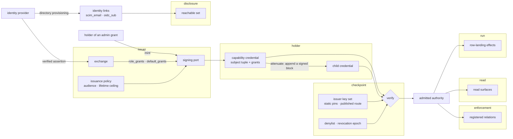
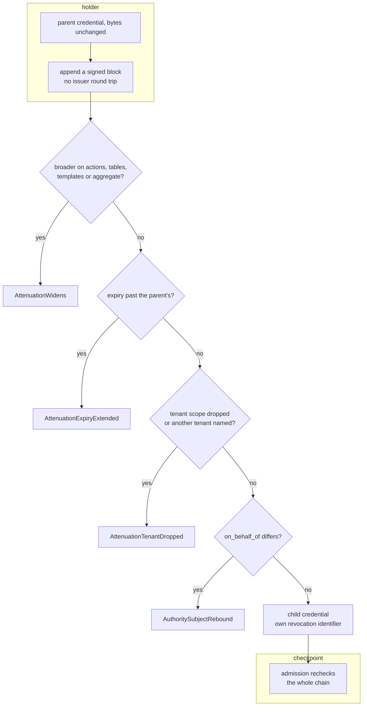
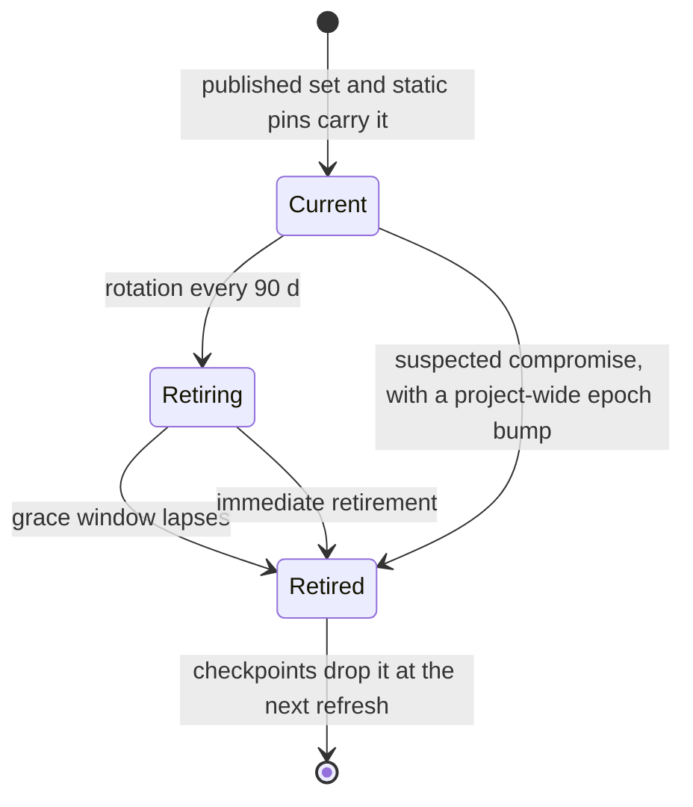
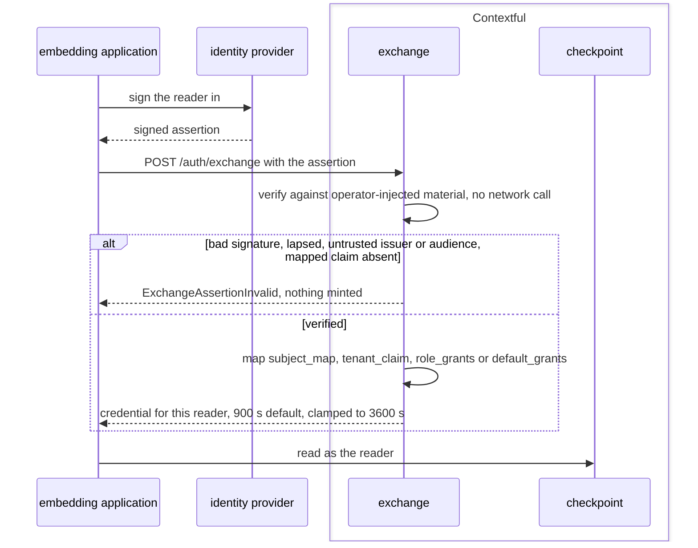
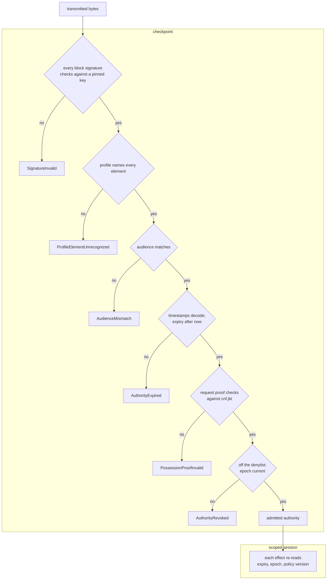

# Admission and authority

A caller reaches **Contextful** holding a capability credential. This file states what the
credential says, who mints it, what a holder derives from it offline, what a checkpoint
decides about it, and the admitted-authority value that decision hands to every effect.
The relation a grant compiles into is stated in `spec/51-enforcement.md`.

The path of a credential from issuance to the effects it authorizes:



## identify

The subject tuple, its per-member attestation, hygiene at the mint, and the identity links connecting a subject to a source's principals.

- `subject-tuple` — A subject is a tuple of agent, host, `on_behalf_of` principal, task scope, inference zone and incognito flag. A credential binds the subset it names and admits under that combination alone.
  *A-authority*
- `attestation` — Each member carries an attestation, `verified` or `asserted`. Agent, host, task and zone are asserted and render labeled as such; no surface presents an asserted member as identity.
  *A-authority*
- `on-behalf-of` — `on_behalf_of` is verified at the mint against the issuing identity provider, and admission carries it forward as the reader's identity.
  *A-authority*
- `value-hygiene` — The mint checks every subject value: non-empty, at most 256 B, no control character, no leading or trailing whitespace.
  *A-authority*
- `malformed-value` — A value failing {{authority.identify.value-hygiene}} raises `AuthoritySubjectMalformed`, except that the command-line mint trims a padded value where the automated exchange refuses it.
  *A-authority*
- `normalization` — The verified tuple is normalized once, each value trimmed and each blank member dropped, before any consumer reads it. No point of use re-normalizes a value or interprets a scheme prefix.
  *A-authority*
- `subject-missing` — A credential carrying no subject member raises `AuthoritySubjectMissing` at admission, naming the refusing surface and echoing no credential value.
  *because an unauthenticated face mints a credential naming a public subject; admitting none reads as the owner's ambient authority*
- `identity-link` — An identity link maps a source principal onto a subject over fields the identity provider verified, recording `method` and `confidence`. Confidence relaxes no check.
  *A-authority*
- `unverified-link` — Only `scim_email` and `oidc_sub` links authorize. An authorization join consuming an `operator_asserted` link raises `AuthorityLinkUnverified`.
  *A-authority*
- `directory-link` — Directory provisioning from the identity provider writes source-account links. A value a source's profile interface returns at request time is data, not a link.
  *A-authority*
- `unlinked-principal` — A subject whose source principal resolves to no link reads nothing from that source.
  *P2*
- `agent-ceiling` — A sub-agent's reachable set equals or narrows its parent's; no agent reads beyond the principal it acts for.
  *A-authority*
- `incognito` — Admission carries the caller's incognito flag unchanged, and a derivation turns it on and never off.
  *A-authority*
- `subject-rebound` — A derivation naming an `on_behalf_of` different from its parent's raises `AuthoritySubjectRebound`.
  *A-authority*

unsettled: Does a subject with no verified principal need a case distinct from the project owner presenting nothing? owner: authority affects: authority.identify

## profile

The versioned delegation profile over the attenuable-credential library: admitted elements, reserved facts, the bounded evaluator, the scoped session.

- `delegation-profile` — Delegated authority travels in one attenuable, chain-signed library format. The library owns serialization, signatures, block chaining and evaluation; a versioned profile names every fact, check and restriction the engine admits.
  *A-authority*
- `unrecognized-element` — A credential carrying a block version, predicate, rule or restriction the profile does not name raises `ProfileElementUnrecognized`.
  *P1*
- `reserved-fact` — Current time, audience, resolved resources and authenticated request identity are reserved facts the engine supplies. A token block introducing one raises `ProfileReservedFact`.
  *A-authority*
- `evaluator-bound` — The evaluator runs with no third-party block, external function, recursion or regular-expression predicate. Input past {{authority.profile.fact-ceiling}} or {{authority.profile.iteration-ceiling}} raises `ProfileEvaluationBudget`.
  *A-authority*
- `fact-ceiling` — One authorization holds at most 1000 entries in its fact set.
  *A-authority*
- `iteration-ceiling` — One authorization runs at most 100 iterations of the evaluator.
  *A-authority*
- `appended-block` — A block after the first contributes no authority fact to an allow decision; appending narrows a credential or adds nothing.
  *A-authority*
- `unevaluated-restriction` — A grant carrying a row restriction or aggregate bound with no read evaluator raises `ProfileRestrictionUnevaluated` at the mint, at derivation on parent and child, and at admission.
  *P1*
- `declared-field` — A restriction field the engine refuses stays declared in the profile and is parsed at every admission.
  *P1*
- `declared-scope` — Introspection reports the scope a credential declares without evaluating it. Table policy, source access lists, time bounds and revocation settle effective authority afterwards.
  *A-authority*
- `scoped-session` — Authorization yields a scoped session carrying every restriction the credential expressed. A statement over two tables needs both accesses in one coherent grant; actions and tables never flatten into independent allowlists.
  *A-authority*
- `version-unsupported` — A checkpoint reading a profile version outside its supported set raises `ProfileVersionUnsupported`. Widening the profile mints a new version.
  *P1*

unsettled: Does introspection of an admitted credential belong on the serving face, or on the command line alone? owner: authority affects: authority.profile

## grant

What a credential says a holder does: actions, table patterns, tenant scope, the template allowlist, ceilings, and resources answering by name.

- `fields` — A grant names actions, table patterns, and optionally a tenant scope, aggregate constraints, a template allowlist and a row ceiling. An absent constraint leaves its dimension unconstrained; an absent allowlist confers no template.
  *A-authority*
- `actions` — The action vocabulary is `read` for every row-returning surface, `write` to land rows, `execute` to fire a run, and `admin` to mint.
  *A-authority*
- `unknown-action` — An action outside the vocabulary raises `GrantActionUnknown` at the mint and at admission.
  *P1*
- `pattern-forms` — A table pattern is `*`, covering every table; a prefix ending in `*`, covering every name beginning with that prefix; or any other string, matched exactly. A concrete pattern never covers `*`.
  *A-authority*
- `malformed-pattern` — A pattern with `*` anywhere but its final position raises `GrantPatternMalformed`.
  *A-authority*
- `one-matcher` — One pattern matcher serves derivation legality, view registration, tool visibility and replica object selection.
  *P5*
- `star` — `*` is an ordinary grant, bounded by the credential's actions, audience and expiry and visible in the audit record.
  *A-authority*
- `tenant-scope` — A tenant scope pairs a table with an opaque byte string bound to that table's outermost partition column.
  *A-authority*
- `tenant-bytes` — The grant's tenant value, the partition key on disk and the consumer's tenant identifier are identical bytes, compared by bound-parameter equality with no trimming, case folding, collation or Unicode normalization.
  *A-authority*
- `tenant-unbindable` — A tenant-scoped grant on a table declaring no bare outermost partition column raises `GrantTenantUnbindable` at admission.
  *A-authority*
- `tenant-child-lifetime` — A tenant-scoped child credential is derived per query with a lifetime of 15 min.
  *A-authority*
- `held-parent` — A consumer's service holds one broader parent and derives each per-query child locally. A durable run step derives its child afresh from a parent the run owner holds, never from a persisted child.
  *A-authority*
- `template-allowlist` — A template allowlist denies by default: absent authorizes none, `*` authorizes every template the manifest declares, and a child names only identifiers its parent named or covered.
  *A-authority*
- `template-tables` — A covered template reads the tables its statement names inside that template's session, under every other layer; its coverage adds no table to a raw read.
  *A-authority*
- `template-not-allowed` — Invoking a template outside the allowlist raises `GrantTemplateNotAllowed`, and an uncovered template is absent from the projected tool listing.
  *A-authority*
- `pipeline-resource` — A pipeline identifier is a read resource: listing it, describing it and tracing its runs each need a read grant covering it. A grant over its landed tables confers none.
  *P2*
- `pipeline-not-covered` — Describing an uncovered pipeline raises `GrantPipelineNotCovered`, naming it. Listing filters to covered identifiers and raises it when none is covered; a project declaring no pipelines lists empty.
  *P2*
- `run-trace-denied` — Tracing a run gates on the pipeline resolved from the run record and raises `GrantRunTraceDenied` without naming that pipeline.
  *P2*
- `row-ceiling` — A read's row ceiling is the least of the grant's, the request's, the template's and the serving face's; an undeclared component imposes none.
  *A-authority*
- `aggregate` — An aggregate grant carries a minimum group size, a maximum single-contributor share, permitted functions, a groups-per-query ceiling and a row ceiling. A write-only or aggregate-only grant contributes no table to a raw read.
  *A-authority*
- `group-ceiling` — An aggregate grant's groups-per-query ceiling is at least 1 entries; a query producing more groups than the ceiling is cut at it.
  *A-authority*

unsettled: When a table declares no partition key, how does a consumer with a per-tenant need express the scope? owner: authority affects: authority.grant

## attenuate

Deriving a narrower child offline, and the narrowing legality of each grant dimension.

- `offline` — A holder derives a narrower child with no issuer round trip by appending a signed block. The parent's bytes stay unchanged, independently verifiable and independently withdrawable.
  *A-authority*
- `narrowing` — Every dimension of a child obeys the narrowing table in Shapes, checked by the deriving holder and again across the whole chain at admission.
  *A-authority*
- `widens` — A child broader than its parent on actions, tables, templates or aggregate constraints raises `AttenuationWidens`, naming the dimension.
  *A-authority*
- `expiry-extended` — A child whose expiry falls past its parent's raises `AttenuationExpiryExtended`.
  *A-authority*
- `tenant-dropped` — A child dropping its parent's tenant scope or naming another tenant raises `AttenuationTenantDropped`. Adding a scope to an unscoped parent narrows.
  *A-authority*
- `truncation` — The chain-final proof advances an ephemeral key per block; a chain truncated to a broader prefix verifies as nothing.
  *A-authority*
- `bearer` — Derivation proves the chain and not the new holder's identity. A hop authenticating its new actor runs through the exchange.
  *A-authority*
- `per-sub-agent` — An agent derives one child per sub-agent, each bound by its confirmation claim to that sub-agent's own key pair.
  *A-authority*

A derivation, from the holder's append to the checkpoint's recheck:



unsettled: What delegation depth does the library format support, and what verification cost does a chain carry at that depth? owner: authority affects: authority.attenuate

## issue

Minting: the persisted lifetime ceiling, the principal a row-landing grant needs, signing custody, and the authoring posture.

- `ceiling` — A project persists in version control an issuance policy naming the default audience and the longest lifetime any mint produces, at most 24 h.
  *A-authority*
- `above-ceiling` — An explicitly requested lifetime above the persisted ceiling raises `IssuanceLifetimeAboveCeiling`; an exchange policy's lifetime clamps down to the ceiling instead.
  *A-authority*
- `ceiling-lowering` — Lowering the ceiling records the previous value and its instant; rotation-grace validation uses the recorded value until the last credential minted under it lapses.
  *A-authority*
- `out-of-tree-mint` — Ceiling enforcement binds a mint run inside the project tree; a mint run outside it is bounded at the checkpoint by rotation-grace validation.
  *A-authority*
- `principal-required` — A mint granting `write` or `execute` whose subject names no `on_behalf_of` raises `IssuancePrincipalRequired`.
  *A-authority*
- `default-read` — A mint's default action set is `read` alone.
  *A-authority*
- `absent-author` — An absent authorship value on a landed row means no credential authorized the write: the uncredentialed owner or a timer-fired run.
  *A-authority*
- `authoring-posture` — Every project load declares an authoring posture. `session` authors every write by one verified ambient credential's principal; `per_request` holds no ambient principal, leaving an unaccompanied write unauthored.
  *A-authority*
- `one-credential` — A served face admits a verified capability credential and nothing else: no static bearer, no gateway shared secret, no unauthenticated owner path.
  *A-authority*
- `missing-key` — A face configured with no issuer key raises `IssuerKeyMissing`, prints the command that fixes it, and binds no port.
  *P3*
- `unresolvable-key` — A set issuer key reference that resolves to no material raises `IssuerKeyUnresolvable`; no local key is fabricated.
  *P3*
- `signing-port` — Minting runs through one signing port. A seed file, a secret reference resolved at mint time, and a remote signing oracle are adapters behind it.
  *A-authority*
- `oracle-custody` — Under the oracle adapter the seed stays inside the custodian, which records each mint as a signing call.
  *A-authority*
- `algorithm` — A credential names Ed25519, the default, or ECDSA over P-256; the pinned key's scheme is authoritative.
  *A-authority*
- `algorithm-mismatch` — A credential naming a scheme other than its pinned key's raises `SignatureAlgorithmMismatch`.
  *A-authority*
- `unauthorized-mint` — A mint request presenting no grant carrying `admin` raises `IssuanceUnauthorized`.
  *because issuance authorizes itself with the same primitive as every other action, and a separate mint secret is a second perimeter to guard*
- `replica-mint` — A replica holds the issuer's public key and no signing material; a mint there raises `ReplicaCannotIssue`.
  *because a replica verifies every credential the primary mints and needs no power to produce one*
- `zone-wildcard` — A mint whose subject declares a wildcard inference zone raises `IssuanceZoneWildcard`.
  *A-authority*
- `key-rotation` — The issuer signing key rotates every 90 d, and at once on suspected compromise.
  *A-authority*

## verify

Admission at a checkpoint: signatures, audience, timestamps, possession proof, key sets, and the admitted-authority value.

- `admitted-authority` — Verification yields an admitted-authority value carrying the normalized subject tuple and its grants. Every read surface and row-landing effect takes that value as an argument; nothing downstream re-parses a credential or reads ambient state.
  *A-authority*
- `no-bypass-constructor` — The admitted-authority type has no constructor that produces a value without a verification.
  *A-authority*
- `effect-boundary` — A statement's start and each commit are effect boundaries. Each boundary re-reads expiry, revocation and policy version against the carried value; a lapse between boundaries stops the effect at the next one.
  *A-authority*
- `format-interface` — The credential format sits behind one interface of issue, attenuate, verify and introspect; no enforcement call site names a credential type.
  *A-authority*
- `bad-signature` — A credential with any block signature failing against a pinned key raises `SignatureInvalid` and admits nothing, no verified prefix included.
  *because a partially verified chain is an unauthenticated credential, and admitting its prefix hands out authority nobody signed as presented*
- `audience-mismatch` — A checkpoint declaring an expected audience raises `AudienceMismatch` for a credential with a different audience or none; a checkpoint declaring none performs no audience check.
  *because a credential minted for one store is otherwise replayable against another; the undeclared case is local development*
- `timestamps` — Every checkpoint decodes timestamps into UTC instants under one grammar and compares instants.
  *A-authority*
- `malformed-timestamp` — A timestamp that does not decode under that grammar raises `TimestampMalformed` at every checkpoint alike.
  *A-authority*
- `expired` — A credential whose expiry precedes the evaluation instant raises `AuthorityExpired` at admission and at each later effect boundary.
  *A-authority*
- `possession-binding` — A credential's confirmation claim holds a client public-key thumbprint. Each request carries a proof signed by the matching private key over method, target, body digest, issue instant and nonce.
  *A-authority*
- `possession-invalid` — A request whose proof does not verify against the confirmation thumbprint raises `PossessionProofInvalid`.
  *A-authority*
- `replay-window` — A proof issued more than 300 s before the checkpoint clock is refused as {{authority.verify.possession-invalid}}; the nonce cache retains each nonce for that window.
  *A-authority*
- `clock-skew` — A proof issued more than 30 s after the checkpoint clock is refused as {{authority.verify.possession-invalid}}.
  *A-authority*
- `replayed-nonce` — A proof whose nonce repeats inside the replay window raises `PossessionProofReplayed`.
  *A-authority*
- `nonce-cache` — A checkpoint's nonce cache holds at most 100000 entries; a proof arriving while it is full answers `503` and admits nothing.
  *because a proof the cache cannot record is a replay it cannot detect*
- `public-key-only` — A checkpoint holds public key material and no signing secret, and admits with no call to an issuer, identity provider or policy service.
  *A-authority*
- `key-set` — A checkpoint accepts a set of issuer keys: comma-separated static pins, or a project-published unauthenticated key route returning the current and non-retired versions, opted into per key.
  *A-authority*
- `key-set-refresh` — A published key set refreshes every 300 s, single-flight, plus one refresh on a signature failure, with failure-forced refreshes throttled.
  *A-authority*
- `key-set-unavailable` — A checkpoint opted into a published key set that obtains none, or holding a malformed pin, raises `KeySetUnavailable`: the engine declines to start and a gateway answers `503`.
  *A-authority*
- `key-set-stale` — After a failed fetch the last-known-good set serves while its age since the last successful fetch stays under 1 h; past that the checkpoint raises `KeySetStale`.
  *A-authority*

unsettled: Does a proof replayed against a sibling checkpoint need a shared nonce store or a checkpoint-issued nonce? owner: authority affects: authority.verify

## revoke

Ending a credential's usefulness ahead of expiry: short lifetimes, the denylist, the scoped epoch, key rotation, format withdrawal.

- `short-lifetime` — A short lifetime is the primary withdrawal: a credential's remaining lifetime bounds its exposure after a provider sign-out or before a denylist entry propagates.
  *A-authority*
- `denylist` — A checkpoint reads a denylist keyed on credential identifier. An entry ages out once its identifier verifies under no live key version.
  *A-authority*
- `revocation-id` — Every derivation carries its own revocation identifier, withdrawing one subtree without ending the root it descends from.
  *A-authority*
- `epoch` — A revocation epoch scoped on project, tenant and principal class invalidates that slice of outstanding authority.
  *A-authority*
- `revoked` — A credential on the denylist, or carrying an epoch below the current scoped epoch, raises `AuthorityRevoked` at the next effect boundary.
  *A-authority*
- `compromise` — Suspected compromise of signing material runs a project-wide epoch bump together with immediate retirement of the key version. Waiting out a grace window withdraws nothing.
  *A-authority*
- `rotation-grace` — A rotation policy declares a cadence and a grace window, validated against the persisted issuance policy, during which the retiring key version still verifies.
  *A-authority*
- `short-grace` — A declared or overridden grace window shorter than the effective issuance ceiling raises `RotationGraceTooShort`.
  *A-authority*
- `immediate-retire` — Immediate retirement removes a key version from the published set and every static pin; a checkpoint drops it at its next refresh.
  *A-authority*
- `format-withdrawn` — From a declared cutover instant, every admission path raises `CredentialFormatWithdrawn` for a credential in a withdrawn format. Only an explicit declaration restores acceptance.
  *A-authority*

The life of one issuer key version:



unsettled: Where does a scoped revocation epoch live, and how does a checkpoint read it without a policy service on the admission path? owner: authority affects: authority.revoke

## exchange

Trading a verified external assertion for a scoped credential under injected verifying material and a declared policy.

- `surface` — `contextful token exchange` and `POST /auth/exchange` trade a verified external assertion for a capability credential, configured per project by `.contextful/exchange/policy.toml` and `.contextful/exchange/verify.key`.
  *A-authority*
- `policy` — An exchange policy declares `expected_iss`, optional `expected_aud`, `subject_map`, `tenant_claim`, `role_claim`, `role_grants`, `default_grants`, `ttl_secs`, `minted_iss` and `minted_aud`.
  *A-authority*
- `injected-material` — Verifying material is operator-injected: a shared secret, an RS256 public key in PEM form, or a key-set document selected by the assertion's `kid`. The exchange makes no network call.
  *A-authority*
- `minted-grants` — Minted grants come from `role_grants` and `default_grants` alone. A verified role matching no entry earns `default_grants`, which is empty unless declared.
  *A-authority*
- `tenant` — The assertion claim `tenant_claim` names becomes the tenant scope of every minted grant; no subject member carries tenancy.
  *A-authority*
- `lifetime-default` — A minted credential lives 900 s where the policy declares no `ttl_secs`.
  *A-authority*
- `lifetime-ceiling` — A configured `ttl_secs` clamps down to 3600 s and never extends.
  *A-authority*
- `audience` — A minted credential carries `minted_aud`, falling back to the project's persisted default audience.
  *A-authority*
- `assertion-invalid` — A bad signature, a lapsed assertion, an untrusted issuer or audience, or a mapped claim absent from the assertion raises `ExchangeAssertionInvalid` and mints nothing.
  *because no credential exists whose subject the assertion did not verify*
- `material-missing` — An exchange configured with no verifying material raises `ExchangeMaterialMissing` and mints nothing.
  *A-authority*
- `per-reader` — An embedding application holds no project-wide credential; per request it exchanges its signed-in reader's assertion for that reader's short-lived credential and reads as them.
  *A-authority*
- `no-cross-reader` — An exchanged credential serves only the reader it was minted for.
  *A-authority*

An embedding application reading as its signed-in reader:



## Shapes

The authority block's content, as the profile maps it:

```json
{
  "iss": "contextful://acme-research",
  "aud": "contextful://acme-research",
  "jti": "01JBQ7K4F3S9W2X6",
  "iat": 1770000000,
  "exp": 1770000900,
  "alg": "Ed25519",
  "cnf": { "jkt": "NzbLsXh8uDCcd-6MNwXF4W_7noWXFZAfHkxZsRGC9Xs" },
  "sub": {
    "on_behalf_of": "user://dana@acme.example",
    "agent": "agent://research-loop",
    "host": "host://dana-laptop",
    "task": "task://q4-review",
    "zone": "local:device",
    "incognito": false
  },
  "att": { "on_behalf_of": "verified", "agent": "asserted", "host": "asserted", "task": "asserted", "zone": "asserted" },
  "grants": [
    {
      "actions": ["read"],
      "tables": ["research/*"],
      "tenant": { "table": "research/filings", "value": "acme-eu" },
      "templates": ["quarterly_rollup"],
      "max_rows": 5000
    }
  ],
  "rev": { "id": "rev://01JBQ7K4F3S9W2X6", "epoch": 7 }
}
```

Table-pattern coverage:

```text
name                  research/*   research/filings   *
research              no           no                 yes
research/filings      yes          yes                yes
research/filings/eu   yes          no                 yes
sales/invoices        no           no                 yes
```

Narrowing legality, parent to proposed child:

```text
dimension      broader    equal      narrower   absent on child
actions        refused    admitted   admitted   admitted
tables         refused    admitted   admitted   admitted
tenant         refused    admitted   admitted   refused
templates      refused    admitted   admitted   admitted
aggregate      refused    admitted   admitted   inherits parent
expiry         refused    admitted   admitted   inherits parent
on_behalf_of   refused    admitted   refused    inherits parent
incognito      refused    admitted   admitted   inherits parent
```

An exchange policy:

```toml
expected_iss   = "https://login.acme.example/"
expected_aud   = "contextful-console"
tenant_claim   = "org_id"
role_claim     = "roles"
default_grants = []
ttl_secs       = 900
minted_iss     = "contextful://acme-research"
minted_aud     = "contextful://acme-research"

[subject_map]
on_behalf_of = { claim = "sub", template = "user://{}" }

[[role_grants.analyst]]
actions   = ["read"]
tables    = ["research/*"]
templates = ["quarterly_rollup"]

[[role_grants.loader]]
actions = ["write"]
tables  = ["research/filings"]
```

Admission, from transmitted bytes to the value an effect acts under:


