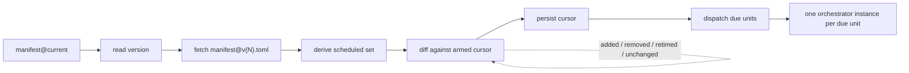
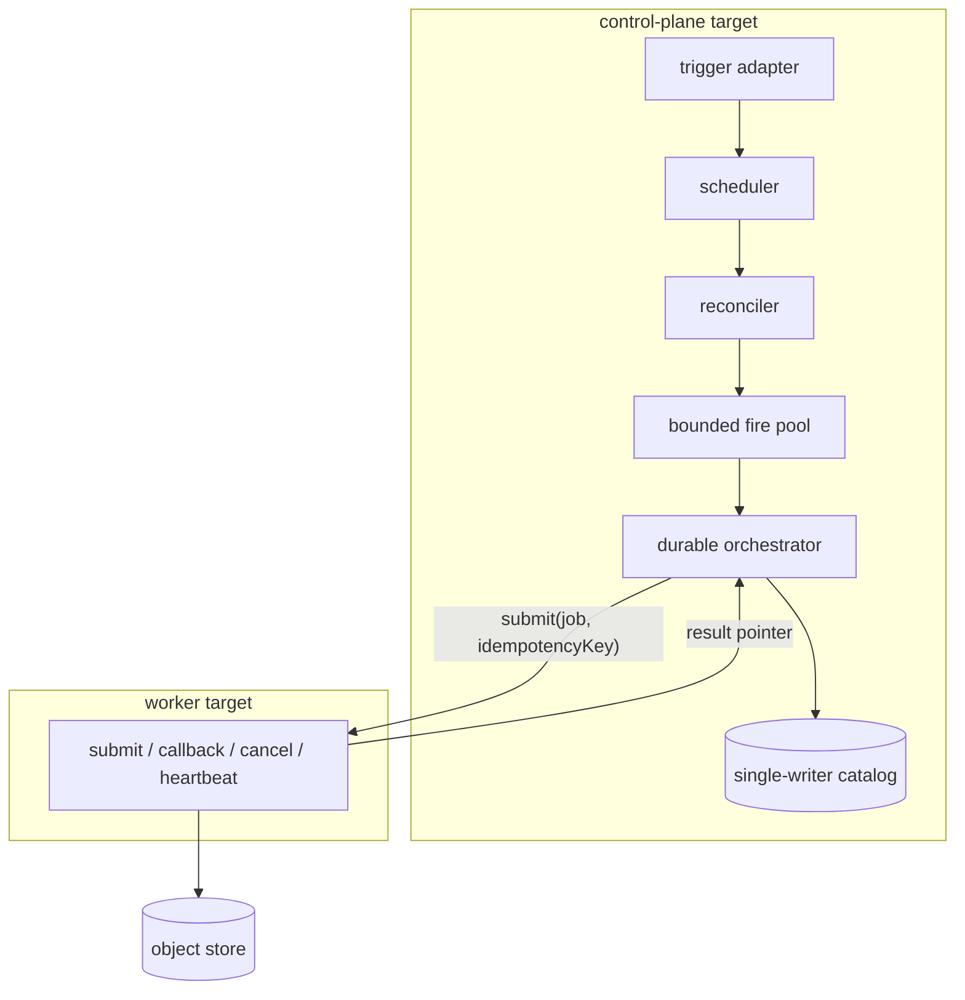
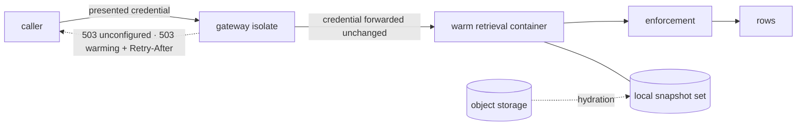
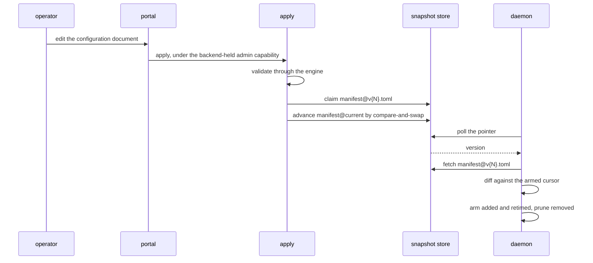

# Cadence, dispatch and the operator plane

The control plane decides when work happens, where it runs, and which surface an operator
or a visitor reaches. It holds the clock, the applied configuration a deployment reconciles
against, the pool that starts work, and the two faces — the read surface and the operator
portal — that a deployment publishes over its stores.

## Parties

| Party | Obligation |
| --- | --- |
| **The deployment** | Declares its control source, its trigger adapter, its store registry and each store's authentication mode. Holds no authentication secret of its own, and keeps a cadence fallback while the reconciler's lease is absent. |
| **The reconciler** | Derives the pipeline schedule set from the applied snapshot, diffs it against the armed cursor, prunes what a newer snapshot dropped, and keeps the last readable set running when a poll fails. |
| **The scheduler** | Evaluates due-ness once per tick through one function whichever trigger woke it, fires a closed set of kinds in produce-before-publish order, and records a watermark per maintenance job. |
| **The dispatcher** | Starts one durable orchestrator instance per due dispatchable unit inside a bounded pool under per-source and store-global exclusion keys, and delegates heavy compute to a worker target. |
| **The worker target** | Implements submit, completion callback, cancel and heartbeat; returns the existing job for a repeated idempotency key; resolves its own credentials locally. |
| **The gateway** | Terminates a read request, verifies the presented credential, forwards it unchanged, routes to the warm container, and runs no query of its own. |
| **The operator portal** | Presents the configuration document as the single writer configuration has, holds the admin capability server-side, and attributes every apply to a verified identity in the audit log. |
| **The reader of a surface** | Reaches a store through its registry entry's one endpoint, under that entry's authored authentication mode. |

## Operations

| Operation | What it governs |
| --- | --- |
| `arm` | The schedule grammar, the trigger adapter and its durability, the wake route, and how an entry computes its next fire. |
| `reconcile` | The control source, the snapshot pointer and its versions, the pure schedule diff, and what a failed poll leaves running. |
| `fire` | Job declaration, the closed kind union, same-tick ordering, the fire watermark, and the one-shot evaluation. |
| `dispatch` | The control-plane and worker roles, the bounded fire pool and its exclusion keys, step results, and the worker adapter contract. |
| `serve` | The read path's two hops, the states in which a store is unavailable, and what keeps a retrieval container warm. |
| `register-store` | Which stores a deployment serves, how each store's credential and binding names are derived, and how a request reaches a store's origin. |
| `edit` | The configuration document, the records it presents without editing, the structured schedule specification, and connector configuration. |
| `apply` | Validation, the immutable version claim, the pointer advance, and the authority and lifecycle an apply carries. |
| `visualize` | The operations canvas, the file and ingestion views, and the learnings record a store publishes about itself. |

## Clauses — arm

Arming decides when an entry next fires and which clock the deployment reads it from.

| Clause | Statement | decided-by |
| --- | --- | --- |
| `control.arm.shape.schedule-string` | The schedule grammar carries two forms: `every <n><s\|m\|h\|d>`, and a five-field cron expression evaluated in UTC on the engine's own clock. The grammar carries no zone field. | |
| `control.arm.invariant.interval-anchor` | An `every` interval is unanchored: it ticks from the previous fire, starting at scheduler start, rather than aligning onto a wall-clock boundary. The same interval spelled as a step-field cron names a different set of instants. | |
| `control.arm.refusal.unreadable-schedule` | A schedule string the grammar cannot read raises `ScheduleUnreadable` against that one entry, naming the diagnostic, and every other entry in the same document arms. | `0286` |
| `control.arm.invariant.validate-before-arm` | An entry revalidates against the manifest guardrails before it joins the armed set, and a guardrail refusal holds back that entry alone. The check is per entry, never per poll. | |
| `control.arm.invariant.arming-from-run-history` | An added or retimed entry computes its next fire from the history recorded for it rather than from the instant it was armed, so a process restarting more often than an entry's cadence still reaches a first fire. | |
| `control.arm.workflow.missed-window` | At startup the last fire is read, the elapsed gap counted and logged, and the declared policy decides. `fire-once`, the policy when none is declared, closes an arbitrarily long gap with one catch-up fire; `skip` resumes at the next future window for work whose value is tied to when it ran. | |
| `control.arm.invariant.unanchored-interval-first-fire` | Under `fire-once` an interval entry with no fire on record is due at the next evaluation rather than one interval past the moment of arming. A process whose lifetime falls short of one interval therefore reaches a fire, leaves history behind it, and ratchets its own cadence outward by nothing. | |
| `control.arm.invariant.cron-keeps-its-instant` | A cron entry keeps the absolute instant it names, so a restart re-arms onto the operator's declared point without firing at boot. `skip` preserves the cadence for both forms. | |
| `control.arm.invariant.unknown-history` | History that cannot be read or parsed reads as unknown rather than as never-fired and leaves arming exactly as it stood, so one transient catalog fault does not fire every entry in a store at once. | |
| `control.arm.invariant.no-dependency-edges` | The armed set carries no edge between two entries and no success-triggers-start orchestration; cross-entry ordering is expressed through the model graph, and anything beyond it is driven from outside. | |
| `control.arm.interface.trigger-adapter` | The trigger is selected by the serve command's `--trigger` option or its environment equivalent, and is not a manifest field. `in-process` advances the schedule while the process is awake and is not durable. `external` waits on a platform cron, an alarm or a host crontab calling the wake route, and is durable. | |
| `control.arm.invariant.adapter-durability-is-printed` | The selected adapter and its durability print at startup and read the same on the health surface, so a deployment's durability is answerable without reading its process arguments. | |
| `control.arm.refusal.unknown-trigger` | An unrecognized trigger value raises `TriggerAdapterUnknown` at startup rather than downgrading onto the non-durable adapter, since a silent ingestion stoppage reads exactly like an upstream with no new rows. | `0287` |
| `control.arm.refusal.external-trigger-without-a-face` | `external` selected on a deployment serving no HTTP face raises `TriggerFaceMissing` at startup rather than arming a trigger whose heartbeat has no route to reach. | `0287` |
| `control.arm.invariant.one-due-evaluation` | Both adapters reach the armed set through one due-ness function, so an in-process tick and an external wake cannot disagree about what is due. The engine decides the armed set, the ordering and each entry's next fire; an adapter decides when the engine looks. | |
| `control.arm.interface.wake-route` | `POST /schedule/run-due` names nothing to execute. The firing happens on the scheduler task, so a wake cannot race a tick or double-fire, and a wake arriving faster than a cadence changes nothing. | |
| `control.arm.interface.wake-outcome` | The wake answers with what its evaluation fired, what failed, what stays armed, and the next due instant, rather than a bare acknowledgement — an unconditional acceptance cannot separate a working wake from one reaching a face whose scheduler has died. | |
| `control.arm.invariant.wake-held-open` | The request stays open for the whole evaluation it triggered. No bound caps that span, and a tick whose fires outlast the calling platform's request timeout returns nothing its caller can act on. | |
| `control.arm.interface.wake-authority` | The wake route takes an authorization covering the wake resource itself; an authorization covering a single pipeline does not confer it, since one wake fires the whole due set. A refused response, a malformed outcome, or a failed entry rejects the scheduled event. | |
| `control.arm.limit.tick-interval` | The in-process adapter evaluates the armed set every 500 ms. | |
| `control.arm.limit.external-beat` | A platform heartbeat wakes a suspending deployment on a fixed granularity of 5 min and carries no cadence of its own; cadence resolution is bounded below by that granularity plus container start. | |

Cancellation, run open and the terminal statuses a fire reports belong to `spec/30-run.md`
§ Run record; an entry's fire ends in a status that surface reads rather than restates.

unsettled: What bounds how long a wake holds its request open, so a tick outlasting a platform timeout still answers its caller? owner: control affects: control.arm

## Clauses — reconcile

Reconciliation turns an applied snapshot into the armed pipeline set and decides what a
failed poll leaves in place.

| Clause | Statement | decided-by |
| --- | --- | --- |
| `control.reconcile.interface.control-source` | A `[control]` block in `contextful.toml` subscribes a daemon to applied snapshots: one of `snapshot_dir`, a directory of snapshot objects, or `url`, a control server to poll, plus `poll`. A `--control <dir\|url>` option on the serve command overrides the block, and a deployment declaring no block arms from its local manifest. | |
| `control.reconcile.limit.poll-cadence` | `poll` takes a schedule string. A `[control]` block declaring none polls every 30 s. | |
| `control.reconcile.invariant.snapshot-is-the-schedule-set` | Under a configured control source the snapshot is the sole source of the pipeline schedule set: local pipeline schedules stay unarmed, and the local manifest supplies the control wiring, the runtime configuration and the job blocks. | |
| `control.reconcile.invariant.empty-control-store-waits` | Before a first snapshot exists the daemon arms an empty pipeline set and waits, rather than falling back onto the schedules its local manifest carries. | |
| `control.reconcile.shape.snapshot-keys` | A control snapshot store holds one `<store>/manifest@current` pointer whose body is the applied version as an ASCII integer and nothing else, and one immutable `<store>/manifest@v{N}.toml` per applied version carrying the canonical document. | |
| `control.reconcile.refusal.pointer-body` | A pointer body that is not wholly a version raises `ControlPointerMalformed` rather than reading a plausible integer out of its leading bytes. | `0288` |
| `control.reconcile.invariant.version-gate` | A poll reads the pointer and re-parses the named snapshot when its version is strictly greater than the armed version, so an unchanged pointer costs one small read. | |
| `control.reconcile.shape.diff-buckets` | The decision half is a pure function over a desired schedule set and a running one, keyed on `(pipeline_id, schedule string)` pairs, producing four deterministically sorted buckets — `added`, `removed`, `retimed`, `unchanged`. The diff unit is the whole schedule string, and an entry declaring no schedule joins no set. | |
| `control.reconcile.invariant.unchanged-keeps-next-fire` | An id landing in `unchanged` keeps its existing next fire, so an unrelated edit elsewhere in the document delays no tick. | |
| `control.reconcile.invariant.reconciler-owns-the-set` | The reconciler owns the entire pipeline schedule set the snapshot derives: an id a newer snapshot omits leaves the armed set. | |
| `control.reconcile.refusal.fail-static` | An unreadable pointer, a snapshot that does not parse, or a control plane answering `5xx` raises `ControlSnapshotUnreadable` and leaves the armed set already in place running, with a diagnostic logged. A deployment keeps its last-known-good cadence; it drops neither to firing everything nor to firing nothing in silence. | `0289` |
| `control.reconcile.invariant.apply-fires-nothing` | An id new to a snapshot arms from the current instant and does not fire — applying a document is not a reason to run what it contains — and beats missed between two snapshots collapse into one fire rather than a backlog. | |
| `control.reconcile.invariant.retime-does-not-interrupt` | A retimed entry's in-flight run completes under its earlier arming and the new cadence governs its next fire. A reconcile interrupts no run. | |
| `control.reconcile.workflow.beat-order` | One beat runs in order: read the pointer; fetch that version's document from the control plane over a service binding rather than a read binding on its bucket; derive the scheduled set; diff it against the armed cursor; persist the cursor; dispatch. | |
| `control.reconcile.invariant.cursor-is-the-only-state` | The armed cursor is the reconciler's only state and survives between beats, since the isolate that ran a beat does not. | |
| `control.reconcile.refusal.control-url-is-loopback` | A control `url` whose host is a loopback address is polled; any other host raises `ControlSourceNotLoopback` rather than arming, since whoever answers the poll writes the whole schedule set. | `0290` |
| `control.reconcile.invariant.loopback-on-the-connection` | The poll client follows no redirect, ignores proxy environment variables, and pins `localhost` onto the loopback addresses rather than letting a resolver or a hosts file place it. A name that merely resolves to a loopback address is not loopback for this test. | |
| `control.reconcile.interface.remote-control-requirements` | A control transport reaching off the loopback carries all three of a bearer-authenticated read, TLS, and producer-side signing over `(version, content-hash)` verified before arming. | |
| `control.reconcile.invariant.plain-data-crosses` | Only plain data crosses between the producer of a snapshot and its consumer — the key format and the schedule diff. A daemon links no edit-time document library, and producer and consumer read one definition of the key format, so the two cannot drift. | |

unsettled: Does a daemon learn of a new snapshot by poll, or by a push channel owing a reconnect and catch-up rule? owner: control affects: control.reconcile

## Clauses — fire

A fire is one evaluation of the armed set: which entries are due, in what order they run,
and what each records about having run.

| Clause | Statement | decided-by |
| --- | --- | --- |
| `control.fire.shape.job-block` | A `[[job]]` block declares `name`, a stable identifier used in logs and diffs; `schedule`, in the same grammar entries use; `kind`; an optional kind-specific `target`; and `enabled`, true when unstated. A disabled block stays in configuration and joins no armed set. | |
| `control.fire.invariant.job-kinds-closed` | The scheduler fires a closed union of kinds — `sweep`, `build`, `fold`, `rebuild-catalog`, `sync-push`, `validate` — reached by an exhaustive match, beside the implicit pipeline-run kind every scheduled entry registers. Each kind is an in-process engine operation reached through the same path as its command verb. | |
| `control.fire.refusal.job-carries-no-argv` | A block naming a kind outside the union, an argument vector, or a host command raises `JobKindUnknown` at validation. Maintenance work outside the union arrives as a new kind in a release. | `0291` |
| `control.fire.invariant.jobs-are-operator-local` | Job blocks live in a daemon's own configuration and enter no control-plane document, so under a control source the reconciler governs entry cadence while maintenance cadence stays with the operator running the daemon. | |
| `control.fire.invariant.job-namespace` | A job name occupies a namespace separate from pipeline ids, so a job and an entry sharing a spelling collide in no armed set. | |
| `control.fire.shape.fire-watermark` | A maintenance job persists no run record. Its schedule memory is a `job_fire` watermark — one row per job name, overwritten on each successful fire — where an entry continues from its run history instead. The watermark survives a restart, so a job resumes its cadence rather than re-arming from boot. | |
| `control.fire.invariant.stage-order` | Entries due in one tick fire in produce-before-publish order: `validate`, then `rebuild-catalog`, then `sweep`, then pipeline runs, then `fold`, then `build`, then `sync-push`. | |
| `control.fire.invariant.stage-order-is-a-tiebreak` | That order is a same-tick tiebreak rather than a barrier. Nothing not due is pulled forward, nothing waits on anything, and each entry takes its next fire from its own schedule. | |
| `control.fire.invariant.failure-continues-the-loop` | A failed entry is logged and evaluation continues. One failing entry ends neither the remaining due entries nor the process. | |
| `control.fire.refusal.compact-target` | A `fold` target names the on-disk table spelled `<pipeline>_<table>`, with every non-alphanumeric character in either half folded to `_`; an omitted target covers every table declaring a primary key. A target binding to no produced table raises `JobTargetUnbound` at the manifest. | `0292` |
| `control.fire.refusal.model-target` | A `build` target naming no declared model raises `JobTargetUnbound` at the same validation pass, rather than failing once per cadence into a log nobody reads between cadences. | `0292` |
| `control.fire.invariant.published-model-needs-a-build-job` | A document publishing a model with no enabled `build` job covering it draws a validation warning per model; a targetless build job covers every model and a targeted one covers the model it names. Run time carries no symptom: every job reports success while the published watermark stands still and a correctly wired consumer concludes nothing is new. | |
| `control.fire.workflow.one-shot-cycle` | The `cycle` command evaluates the armed set once and exits, over the same due-ness test, the same watermark and the same stage order a daemon uses, so a batch cycle beside a warm daemon reads what that daemon wrote and repeats none of its work. | |
| `control.fire.invariant.one-shot-difference` | One-shot evaluation differs from the daemon's exactly where being one-shot forces it: a missed window defaults to `fire-once` for jobs where a daemon defaults them to `skip`, and an entry that has never fired is due at once, a cron entry included. | |
| `control.fire.refusal.one-shot-control-source` | A configured control source that does not resolve under one-shot evaluation raises `CycleControlSourceUnresolved` rather than holding a previous armed set, since a one-shot process holds none. | `0293` |
| `control.fire.interface.cycle-exit-status` | A cycle exits zero when its evaluation completed with nothing failed, including when nothing was due, reporting each entry with its next window; it exits non-zero when any entry failed, having evaluated the remainder first. `--all` fires every enabled entry regardless of due-ness and honors the watermark on the way out. | |

The `fold` and `rebuild-catalog` kinds do their work under `spec/10-store.md`
§ Maintenance; the scheduler holds their cadence and reads their outcome. The permission
sweep's own cadence is stated in `spec/42-visibility.md` § Sweep, which this ordering
places ahead of the entries that land rows.

## Clauses — dispatch

Dispatch turns a due unit into a running orchestrator instance and places its compute.

| Clause | Statement | decided-by |
| --- | --- | --- |
| `control.dispatch.invariant.two-roles` | {{topology.deploy.invariant.deployment-role}} {{topology.deploy.shape.control-plane-target}} {{topology.deploy.shape.worker-target}} | |
| `control.dispatch.invariant.one-instance-per-due-unit` | The reconciler starts one durable orchestrator instance per due dispatchable unit rather than one chain per beat, so two entries share neither a cadence nor a failure. A unit is dispatchable when it starts from the store alone. | |
| `control.dispatch.refusal.step-is-not-a-head` | Where a deployment's entries are landing steps of one dependent run, the run is the unit and cadence rides the entry at its head. A due id that is a step raises `DispatchUnitNotAHead` and is reported rather than started. | `0294` |
| `control.dispatch.invariant.fire-pool-bound` | Due work enters a pool bounded by a configured count of fires in flight, floored at one, so a tick with many due entries cannot open unbounded concurrency against one machine. | |
| `control.dispatch.invariant.exclusion-keys` | A per-source exclusion key serializes fires against one upstream, so a vendor's rate limit sees a single caller and two fires of one entry do not overlap. A store-global key held by the maintenance kinds keeps a job folding or publishing the tree apart from an entry writing it. | |
| `control.dispatch.invariant.deferred-fire-stays-due` | Work deferred by an exclusion key or by the pool's bound stays due and is reconsidered on the next tick rather than waiting a full interval. A due maintenance job raises a barrier that defers new entry fires until the pool drains. | |
| `control.dispatch.invariant.cadence-lease` | The reconciler holds a lease on a deployment's cadence, renewed on every beat that read a document actually scheduling a dispatchable unit. The deployment's own cron fires the work while that lease is absent or lapsed. | |
| `control.dispatch.invariant.lease-fallback-covers-empty-states` | The fallback covers each state an empty control plane produces — nothing applied, a document scheduling only chain steps, and a control plane answering `5xx` — so a deployment that stops deciding is distinguishable from one that stops ingesting. | |
| `control.dispatch.limit.step-result` | A checkpointed step returns a pointer — an object-store key or a catalog row id — against a 1 MiB step-result cap. | |
| `control.dispatch.invariant.state-outside-the-container` | A worker writes its output to the shared object store and returns the key, so a container carries no state across a step boundary and every durable value sits in the catalog or the object store. | |
| `control.dispatch.limit.step-cpu-free` | Per-step CPU is the orchestrator's one hard cap, standing at 10 ms on a free tier. | |
| `control.dispatch.limit.step-cpu-paid` | A paid orchestrator tier raises that same per-step CPU cap to 5 min. | |
| `control.dispatch.invariant.wall-clock-is-uncapped` | Wall clock per step carries no cap and a suspension counts against no step quota, so a run waiting on an external party consumes no budget while it waits. | |
| `control.dispatch.invariant.heavy-steps-delegate` | A run decomposes into steps inside the orchestrator's step budget; the planning call splits an upstream wider than that budget into batched steps; and compute heavier than the per-step cap delegates to a worker target priced for compute. | |
| `control.dispatch.refusal.in-band-tool-error` | A step driving the engine over the tool protocol judges success on the tool result rather than on transport status: a failure arrives in band as `200` carrying a protocol error or a result flagged `isError`, and the step parses it and raises `StepToolError`. | `0295` |
| `control.dispatch.interface.worker-adapter` | Every worker target implements four operations: `submit(job, idempotencyKey)` returning a job handle; a completion callback posting a result pointer to a relay route authenticated by HMAC over `(runId, step, ts)`; `cancel(job)`, best-effort and safe after completion; and a heartbeat. | |
| `control.dispatch.invariant.idempotent-submit` | `submit` under a repeated idempotency key returns the existing job and starts no duplicate, which is what makes at-least-once dispatch safe to replay against the journal. | |
| `control.dispatch.invariant.dial-out-holds-no-port` | A dial-out worker opens an outbound long-lived connection and pulls work, holding no public address and no inbound port; a push target is dispatched to through its own API. | |
| `control.dispatch.limit.heartbeat-beat` | A worker heartbeat runs every 15 s. | |
| `control.dispatch.limit.heartbeat-lapse` | A heartbeat lapse past 60 s reschedules that worker's in-flight work onto another matching worker, which the idempotency keys make safe. | |
| `control.dispatch.interface.capability-tagged-routing` | A worker registers arbitrary tags and a step declares `requires` as a strict constraint and `prefer` as affinity. The engine matches a worker satisfying `requires`, breaks ties by `prefer`, then by least loaded. A strict tag falls back onto no cloud worker, which keeps data inside a building while orchestration runs elsewhere. | |
| `control.dispatch.invariant.worker-secret-boundary` | A dial-out worker resolves credential references against its own local store, so an orchestrator elsewhere holds no material. Transport is WSS or HTTPS with optional mutual TLS, a worker's own credential is scoped to one tenant and its tags and is revocable from the control plane, and every dispatched job records worker id, tags and outcome into the audit chain. | |
| `control.dispatch.invariant.one-progress-writer` | Dispatch gives a delegate no second channel of its own toward a subscriber. {{run.project.invariant.one-writer}} | |

A run's own durability — its journal, its terminal statuses and its cancellation — is
stated in `spec/30-run.md` § Run record; dispatch decides which host that run's steps
execute on. Profile-level memory and footprint budgets belong to `spec/01-topology.md`
§ Build profiles, which decides which primitives a target can host at all.

## Clauses — serve

A published store answers over two hops: a router that holds no query engine, and a warm
container that holds the whole retrieval profile.

| Clause | Statement | decided-by |
| --- | --- | --- |
| `control.serve.invariant.router-and-container` | The read path splits into an isolate that terminates the request, verifies the presented credential, routes and caches while running no query, and a warm container running the full retrieval profile with enforcement inside it ahead of any row leaving. | |
| `control.serve.limit.isolate-memory` | The routing isolate holds 128 MiB of memory and a per-request CPU budget, and exposes neither a filesystem nor memory mapping. | |
| `control.serve.invariant.verification-at-both-hops` | The gateway verifies the credential a caller presented, forwards it unchanged, and the engine re-verifies the identical transmitted bytes before enforcing its grants. The deployment holds no authentication secret: the verifying key is public and the credential is whatever the caller brought. | |
| `control.serve.refusal.unconfigured-gateway` | A gateway with no store configuration serves `503` on every route and never opens, raising `GatewayUnconfigured` rather than opening onto an unnamed origin. | `0296` |
| `control.serve.refusal.issuer-key` | The engine's HTTP face refuses to start without a verification key that both resolves and parses, raising `IssuerKeyUnusable` and naming the input that failed. A truncated key, a corrupt key file, and a published key set that cannot be fetched refuse alike, rather than falling through onto a generated key that comes up healthy and then rejects every legitimately minted credential. | `0296` |
| `control.serve.interface.warming-state` | A data route answers `503` with `Retry-After` while a store warms, and the health route reports `warming`. A client honoring that header rides a cold start instead of surfacing it. | |
| `control.serve.invariant.two-unavailable-states` | The warming state resolves into readiness on its own while the unconfigured state never becomes ready, so the health route separates a store coming up from a surface that opens for no caller. | |
| `control.serve.invariant.hot-set-is-local` | The retrieval container keeps the current snapshot set on local disk and maps it in place. Object storage is the durable source rather than the per-query read path. | |
| `control.serve.limit.container-readiness` | A retrieval container reaches readiness within 8 s of a cold start, ahead of whatever hydration its store's snapshot set requires. | |
| `control.serve.invariant.keep-warm-per-active-deployment` | The reconciler keeps a retrieval container warm for a deployment with active traffic, the same mechanism it applies to run-path containers with firing entries. Sub-second response is a hot-path property; a deployment declining keep-warm accepts a cold first query and carries a small standing cost otherwise. | |
| `control.serve.invariant.gateway-adds-no-authority` | The gateway performs no translation from one credential into another and issues nothing of its own, so compromise of the routing hop confers no grant the caller did not already present. | |
| `control.serve.shape.hostname-descriptor` | {{topology.publish-hostname.shape.descriptor}} {{topology.publish-hostname.invariant.gate}} | |
| `control.serve.workflow.gate-probe` | {{topology.publish-hostname.workflow.posture-probe}} | |
| `control.serve.refusal.posture-mismatch` | A hostname answering outside its declared gate, and a declared hostname that cannot be reached at all, raise `HostnamePostureMismatch` and fail the deploy. | `0297` |
| `control.serve.invariant.probe-table-equals-descriptors` | {{topology.publish-hostname.invariant.probe-table}} {{topology.publish-hostname.refusal.probe-table}} | |
| `control.serve.invariant.wildcard-application-gates-nothing` | {{topology.publish-hostname.invariant.wildcard-application}} | |
| `control.serve.refusal.descriptor-unknown-field` | This surface decodes its own descriptor with excess properties refused, and a key it does not model raises `DescriptorUnknownField` in place of an emitted configuration missing that key. {{topology.publish-hostname.invariant.reserved-key}} | `0297` |

What a container pulls to warm its snapshot set is stated in `spec/11-sync.md` § Replica
pull; a store answers reads once that pull has landed. The credential's own structure, its
verification inputs and its revocation record are stated in `spec/40-authority.md`
§ Verification; this surface forwards what the caller presented and re-checks it inside.

## Clauses — register-store

The store registry decides which stores a deployment serves and how a request reaches each
one's origin.

| Clause | Statement | decided-by |
| --- | --- | --- |
| `control.register-store.interface.registry-variables` | Which stores a deployment serves resolves per request from the worker's environment: `CONTEXTFUL_STORES_JSON`, a JSON array of entries, plus an optional `CONTEXTFUL_STORE_IDS` allowlist that both filters and orders. Ids, hostnames and route paths are not credentials, so the array belongs in committed configuration or a deploy-time variable, and a store appears with no rebuild. | |
| `control.register-store.refusal.malformed-entry` | A payload that does not parse falls back to the built-ins, while one malformed entry among many is dropped with a diagnostic and raises `StoreEntryMalformed` for that entry alone — a deployment with one broken store has to be able to tell which. | `0298` |
| `control.register-store.invariant.unset-serves-built-ins` | Both variables unset serve the built-ins alone, which is a working surface rather than an empty one. | |
| `control.register-store.invariant.derived-names` | A store's bearer lives in the secret named by the upper snake-case of its id suffixed `_QUERY_TOKEN`, and its service binding is the upper snake-case of that same id. Neither spelling is a field on the entry. | |
| `control.register-store.invariant.ids-are-kebab` | A store id is lower kebab-case, so it maps injectively onto a legal environment-variable name and traverses onto no object key of its own choosing. | |
| `control.register-store.refusal.authored-credential-name` | An entry carrying its own credential or binding name raises `StoreNameAuthored`. An authored name points into a worker environment that also holds unrelated secrets, so an entry arriving through a runtime variable could name one and have the proxy post it to a host the entry picked. | `0299` |
| `control.register-store.shape.auth-mode` | An entry authors `auth`: `token`, the mode when none is written, reads the derived secret; `exchange` mints a credential per visitor and names the store's exchange route; `none` sends no bearer. | |
| `control.register-store.invariant.auth-mode-is-not-derived` | Intent is authored rather than inferred from a secret's presence. Reading mere presence as authenticated makes a loopback development store fail closed on a credential nobody set. | |
| `control.register-store.invariant.two-built-in-stores` | Exactly two stores ship inside the product, on the criterion that they need no configuration: a bundled fixture with no upstream that renders the entire surface with no secrets, and a loopback store marked development-only. The fixture is discriminated by the absence of an upstream rather than by its id. | |
| `control.register-store.refusal.reserved-id` | Both built-in ids are reserved, and a configured entry claiming one raises `StoreIdReserved` rather than being served the fixture's rows under its own name. | `0300` |
| `control.register-store.invariant.secret-at-runtime-binding-at-deploy` | A secret is added while a worker runs; a service binding is declared before that worker ships. A store added purely through the runtime list is therefore reachable while its origin sits outside a perimeter of its own. | |
| `control.register-store.invariant.exchange-is-turn-key` | A store on exchange authentication needs no pre-provisioned secret, so per-store exchange rollout and runtime store configuration are one piece of work, and a fully turn-key store is an open or an exchange one. | |
| `control.register-store.workflow.binding-dispatch` | Reaching a store whose origin sits behind its own identity perimeter goes over a worker-to-worker service binding, which dispatches straight to the target and skips the edge while that target still enforces its own bearer on the dispatched request. A public fetch at the same address answers with a login document rather than data. | |
| `control.register-store.invariant.binding-name-resolution` | A binding name is checked to resolve to an actual fetcher; anything else degrades to a public fetch rather than throwing from inside the client. | |
| `control.register-store.invariant.one-credential-resolver` | Every path needing a store's credential — the tool calls, the published output routes, the prompt overlay — passes one resolver, so a store cannot authenticate on one surface and fail quietly on another. | |
| `control.register-store.shape.declared-lexicon` | An entry may declare a lexicon, whose shape one shared normalizer owns and whose malformed fields it filters. A declared list replaces the defaults, an empty list means none, and declared time-window phrases add to the languages an entry already carries. | |
| `control.register-store.invariant.one-endpoint-per-store` | An entry is exactly one endpoint. The registry fans out across many deployed stores, and combining two stores' rows is the modeling layer's concern inside the engine rather than the surface's. | |

## Clauses — edit

The operator portal is the write counterpart of the read surface: an operator changes
configuration there rather than hand-editing a manifest or placing a secret by hand.

| Clause | Statement | decided-by |
| --- | --- | --- |
| `control.edit.invariant.document-is-the-single-writer` | The editable configuration document is the single writer configuration has: entry definitions, connector references by id with their configuration, schedules, placement targets and ordered transform definitions all move through it. | |
| `control.edit.invariant.read-only-surfaces` | Run history and status, the memory record, the append-only audit log, secret material and credential issuance are read-only in the operator surface. | |
| `control.edit.invariant.merge-boundary-is-visible` | The surface separates an irreversible last-write-wins area from the mergeable configuration area, so an operator sees which fields merge before typing into them. | |
| `control.edit.invariant.crdt-at-edit-time-only` | The document is a CRDT persisted per store under conditional replacement, and concurrent edits reload and reapply on contention. Daemons and replicas consume the materialized snapshot and speak no CRDT, so a consumer links no edit-time library to read configuration. | |
| `control.edit.invariant.schedule-string-is-a-compile-target` | The manifest schedule string is the wire contract and the compile target rather than the editing model, and the editor mutates one structured schedule specification. | |
| `control.edit.shape.schedule-kinds` | Five trigger kinds compile into that string: manual emits no schedule and runs on an explicit fire; interval emits the interval form deliberately; daily, weekly and monthly emit a plain five-field cron; raw cron passes through; and an event trigger emits a webhook or queue binding. | |
| `control.edit.interface.layered-schedule-input` | Input layers onto that one specification: a constrained phrase box whose failed parse leaves the current specification untouched, preset kind chips, structured sub-editors, and a raw-cron escape hatch. | |
| `control.edit.invariant.round-trip-lift` | A stored cron lifts into the structured editor when recompiling it reproduces the expression exactly, and the escape hatch states which side of that line an expression fell on. | |
| `control.edit.interface.schedule-footer` | An always-visible footer carries the humanized schedule, the next five concrete fire instants, the compiled manifest string, and an approximate rate per day, so the compiled output is visible before an apply. | |
| `control.edit.invariant.footer-names-its-zone` | Cron-family previews evaluate on the engine clock with a display-only zone toggle, and the footer names the zone its instants render in rather than leaving it to a tooltip. Interval previews count from the current instant and are approximate, since an interval ticks unanchored. | |
| `control.edit.workflow.connector-configuration` | Adding a connector runs four steps: pick it and a pinned version from the registry, so a replay reaches the same artifact; set its configuration rendered from the connector's own declared schema; declare capability grants, where the surface shows what the connector requests and the operator grants or narrows it; and bind credentials as references, with the value collected into the secret backend and the reference alone written into the document. | |
| `control.edit.refusal.secret-material-in-the-document` | A credential value typed into a configuration field raises `SecretMaterialInDocument`; the document holds references and the backend holds material. | `0301` |
| `control.edit.interface.connector-probe` | A dry-run action exercises a connector's health check or first-page pull against the declared grants without committing a schedule. | |
| `control.edit.refusal.uploaded-connector-binary` | The operator surface references registered connectors by id and version and edits their grants and configuration. An artifact uploaded through it raises `ConnectorUploadRefused`, since publishing into the registry runs a separate signed path. | `0302` |
| `control.edit.interface.portal-store-fields` | The operator surface reads the same store registry as the visitor surface, with the same derived names; a portal entry adds exactly two fields, the store's pack prefix and its canvas annotation. | |

What a connector requests in a grant — the outbound allowlist, the environment names, the
clock — is defined in `spec/32-connector.md` § Capabilities, and the reference scheme a
bound credential is written in belongs to `spec/33-secrets.md` § References; this surface
displays the request and records the operator's answer.

unsettled: How does the next-fire preview stay aligned with the engine's own schedule parser? owner: control affects: control.edit

## Clauses — apply

An apply turns the edited document into an immutable version other processes consume.

| Clause | Statement | decided-by |
| --- | --- | --- |
| `control.apply.workflow.apply-claims-a-version` | An apply validates the document through the engine, claims an immutable `<store>/manifest@v{N}.toml`, and advances that store's pointer by compare-and-swap. | |
| `control.apply.invariant.per-store-version` | The version counter is per store, so applying to one store advances no other store's pointer. | |
| `control.apply.refusal.version-race` | An apply whose compare-and-swap loses raises `ManifestVersionConflict`, reloads the newer version and reapplies the pending edits onto it, overwriting no applied version. | `0303` |
| `control.apply.refusal.validation` | A document failing engine validation raises `ApplyValidationRefused` and claims no version, so a snapshot store holds no version a daemon refuses to arm. | `0304` |
| `control.apply.invariant.edits-are-not-live-until-apply` | An edit is not live until an apply, and the claimed version is the visible marker of which configuration a deployment runs. | |
| `control.apply.invariant.admin-capability-is-backend-held` | Every edit and every apply carries an admin capability held as a server-side secret and never in the browser, and the credential-issuance routes take that same capability. | |
| `control.apply.invariant.apply-is-attributed` | Every apply is attributed to the verified identity that made it and lands in the append-only audit log, so an applied version names who claimed it. | |
| `control.apply.invariant.apply-cannot-widen-enforcement` | The operator surface edits configuration rather than row visibility, so an apply widens no enforcement decision the engine makes over a caller's grants. | |
| `control.apply.refusal.owner-storage` | The hosted configuration owner takes strongly conditional object storage, filesystem storage serves a single-process local path, and missing owner configuration raises `ConfigOwnerUnconfigured` answered as `503`. | `0305` |
| `control.apply.refusal.uninitialized-store` | An edit or an apply against a store that has not been initialized raises `StoreNotInitialized` answered as `409`. Every store takes an explicit guarded import, an empty store included. | `0305` |
| `control.apply.invariant.retention-is-operator-policy` | The owner collects no superseded version; retention of applied versions is operator policy, and an older version stays readable at the key that named it. | |

unsettled: Can a local control plane validate and claim a version on its own, or does every apply route through a hosted one? owner: control affects: control.apply

## Clauses — visualize

The operator's read views describe what a deployment is doing: its graph, its objects, its
landed rows, and what its store has concluded.

| Clause | Statement | decided-by |
| --- | --- | --- |
| `control.visualize.interface.canvas-node-kinds` | The operations canvas is an interactive graph with pan, zoom, minimap and click-to-inspect, and it adds three visualization-only node kinds beyond the plan it renders: `data` for upstreams, staged objects and landed tables, drawn with dashed dataflow edges; `instruction` for the artifacts a synthesis step consumes; and `cadence` for an entry's schedule, carrying its humanized form, a live countdown and its next fire instants. | |
| `control.visualize.workflow.three-canvas-sources` | The canvas renders whatever one of three sources supplied and reports which answered. The engine's own entry listing wins whenever the engine answers, since it alone knows the cadence, the connector, and entries that have never fired. Failing that, a store's published run records name their entry and the tables it wrote, and the dataflow is read back out of them. A store's annotation supplies the remainder with no engine present. | |
| `control.visualize.invariant.published-path-withholds-the-fire-control` | On the published-records path the run-now control is withheld, since the engine it posts to is absent from that path, and no `cadence` node appears for an entry that has never run. What is missing is stated in a strip above the graph rather than in place of it. | |
| `control.visualize.invariant.file-surface-is-read-only` | A read-only route serves one object from a store's pack over a read-only binding, prefix-scoped per store with traversal-safe keys and a size cap, so the operator surface shows a pack while holding no write path into it. | |
| `control.visualize.invariant.listing-is-confined-by-construction` | The sibling listing route reports objects beneath the pack prefix, confined by construction rather than by filtering: a caller narrows within the pack and names the prefix itself in no request, so a neighbouring pack in the same bucket stays unreachable. | |
| `control.visualize.limit.listing-page` | One listing call answers at most 1000 entries, flags truncation, and counts the keys the read route declines to serve rather than dropping them in silence. | |
| `control.visualize.invariant.no-pack-no-file-surface` | A store declaring no pack prefix carries no file surface at all. | |
| `control.visualize.interface.ingestion-view-grain` | The ingestion view's grain is the ingested row: a vantage-bounded bulk route returns every committed row with its run id and ingestion instant under a per-table row cap that flags truncation, and the client groups by run, by table, or flat, with sortable resizable columns, a global filter, and a row-detail flyout carrying the full schema as key-value pairs with links resolved. | |
| `control.visualize.invariant.table-color-is-deterministic` | A deterministic categorical color per table name is shared with the canvas's table pills, so one hue means one table across every view, and color carries identity nowhere on its own. | |
| `control.visualize.workflow.learnings-timeline` | The learnings view is one query over the store's own fact mirror rather than a bespoke engine route, so it works for any store: every learn, revise and forget event grouped by day with kind badges, a revision rendered on the day it happened, and a forget rendered as a tombstone whose earlier record still shows what the store held. A conclusion taught by a question shows that question and a synthesized one shows its origin, both read from provenance. | |
| `control.visualize.invariant.live-count-excludes-valid-time` | The operator timeline's live count omits the valid-time bound, answering what the store holds rather than what is true at a reader's vantage, so it exceeds a reader's recall count by the store's anchored beliefs. | |
| `control.visualize.shape.published-mirror` | A store that cannot be queried publishes its record instead: each fact's subject, predicate, object, scope, supersession marker, provenance, ingestion instant, run id and deduplication key, upserted on `(store_id, dedup_key, ingested_at)` and stamped with the writing node's id and report instant. | |
| `control.visualize.invariant.engine-answer-wins` | The engine is preferred and the view reports which source answered, since a live query returns the whole history while a published record mirrors part of it. An engine answering that no such table exists has stated that the store learned nothing, and that answer stands over anything published. | |
| `control.visualize.invariant.one-event-derivation` | Both sources derive their events and count their live facts through one pair of functions, so a published record and a live query cannot disagree about what a revision means. | |
| `control.visualize.invariant.published-at-separates-silence-from-staleness` | The newest report instant in a published record separates a store that has learned nothing from one whose engine has not pushed for days, and it is stated in a strip above the record rather than in place of it. A published record carries the store's own conclusions rather than the rows they were drawn from. | |
| `control.visualize.invariant.two-shells-one-renderer` | One renderer runs under two shells: a hosted surface behind an identity perimeter talking to a control-plane daemon, and a desktop shell that bundles the engine binary and installs it as a system auto-start service driving a local daemon. | |
| `control.visualize.invariant.daemon-outlives-the-ui` | Closing either shell stops no ingestion, since cadence lives in the materialized configuration a daemon reconciles rather than in the page. The desktop shell therefore installs the engine as a service rather than spawning it as a child of the window. | |

The node kinds the canvas inherits, rather than adds, are defined in
`spec/31-pipeline.md` § Plan nodes; the three kinds above exist for the picture alone.

unsettled: Does a canvas node carry the outcome of its entry's most recent run? owner: control affects: control.visualize

## Shapes

The control snapshot store, as one deployment's keys:

```
<store>/
  manifest@current          body: 7
  manifest@v1.toml
  manifest@v2.toml
  …
  manifest@v7.toml          the document version 7 names
```

A daemon's own configuration — the control wiring and its operator-local jobs:

```toml
[control]
snapshot_dir = "./.contextful/control"   # or url = "http://127.0.0.1:8787/control"
poll         = "every 30s"

[[job]]
name     = "nightly-compaction"
schedule = "0 3 * * *"
kind     = "fold"
target   = "meta_ads_insights"
enabled  = true

[[job]]
name     = "hourly-push"
schedule = "every 1h"
kind     = "sync-push"
```

A store registry entry, as the worker environment carries it:

```json
[
  {
    "id": "field-notes",
    "label": "Field notes",
    "endpoint": "https://field-notes.example.net",
    "auth": "exchange",
    "exchangeRoute": "/auth/exchange",
    "packPrefix": "packs/field-notes/"
  }
]
```

The derived names for that entry:

```
secret   FIELD_NOTES_QUERY_TOKEN
binding  FIELD_NOTES
```

The wake route's request and its answer:

```http
POST /schedule/run-due
```

```json
{
  "fired": ["field-notes", "nightly-compaction"],
  "failed": [],
  "armed": 14,
  "next_due": "2031-04-08T03:00:00Z"
}
```

One reconciler beat, from pointer read to dispatched unit:



The two roles and the placement of one run's control and compute:



The read path's two hops over one store:



The operator plane, from edit to armed cadence:



## Unsettled

unsettled: Does a store serve its own canvas annotation, so a deployment adding a store does not also author that store's picture? owner: control affects: control.visualize

unsettled: Does a routing hop hold a short result cache of its own, keyed on the whole enforcement subject? owner: control affects: control.serve

unsettled: Is the fire pool's bound one number per deployment or one per exclusion key? owner: control affects: control.dispatch
