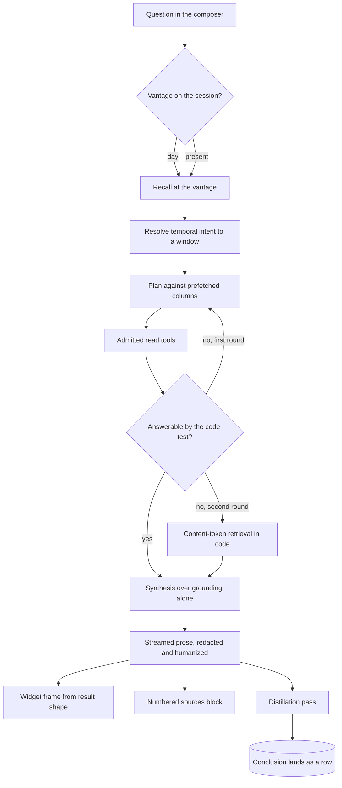
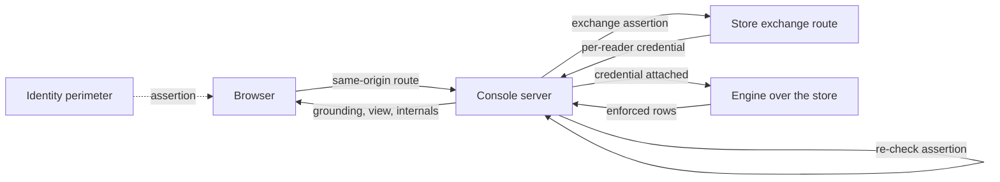

# The analyst console

The console is the surface a non-technical reader reaches a store through: one composer, one
transcript, and the widgets a turn draws beside its prose. It holds no data, no reader and no
path under the tables. Everything it shows arrives as the result of a governed read, and
everything it says arrives in the reader's own language.

## Parties

| Party | Obligation |
| --- | --- |
| **The visitor** | Arrives with a verified identity, holds no store credential in the browser, and reaches a store over same-origin routes. |
| **The console server** | Injects the store's credential outbound, re-checks the identity assertion it forwards, dispatches a closed read subset of tool names, and authors the one write a turn makes. |
| **The analyst** | Picks which admitted tool to call, builds every sentence from what those calls returned, declines a request for machinery in one sentence and returns to the data. |
| **The store** | Supplies its catalogue, its published output routes, its lexicon and an optional persona overlay. What it supplies is subordinate to the generic contract. |
| **The engine** | Answers each read under the caller's grants, humanizes temporal text in the channel the model reads, and lands a turn's distilled conclusion like any other row. |
| **The client** | Resolves a component name against the registry it ships, persists a turn's payload as JSON, draws nothing for a name it does not hold, and keys browser state to one identity and one store. |

## Operations

| Operation | What it governs |
| --- | --- |
| `speak` | The language every visitor-visible string carries, answer hygiene as a persona and audience contract, the deterministic backstops beneath it, and what a gated surface publishes about itself. |
| `ground` | Where an answer's material comes from: the closed tool set, the two trust layers, the per-reader credential, the web supplement, and the sources block. |
| `plan-turn` | The shape of one turn: planner scaffolding, the replanning round, the answerability test, the code path under a failed search, and the store's prompt overlay. |
| `set-vantage` | A session's time basis: one vantage, its statement to the reader, the bound each leg carries, the snapshot timeline, and the arrivals strip. |
| `browse` | What a store advertises before a question is asked: discovered chips, humanized labels, soft discovery, the file gallery, and the insights panel. |
| `learn` | The reading loop's memory: recall ahead of planning, the per-turn distillation, an anchored conclusion at a vantage, and the commit a write runs. |
| `render` | The render contract: three channels, the component union, deterministic component choice, view hints, and the sanitizer walk. |
| `brief` | The proactive card: its derivation, its payload, its matching tiers, the client-side clock, and the absence it earns. |

## Clauses — speak

Product language is the whole register of this surface. The rule binds the visitor-facing
build and stops at the operator plane, whose vocabulary belongs to an operator.

| Clause | Statement | decided-by |
| --- | --- | --- |
| `console.speak.invariant.product-language` | Every string a visitor sees or receives — store names and blurbs, placeholders, empty and error states, page titles, suggestion text, and the answers themselves — carries product language, with no engineering vocabulary, no infrastructure names and no protocol or runtime terms. The identity line reads as a signed-in address and names no perimeter. | |
| `console.speak.invariant.audience-contract` | The analyst's system text carries a persona and an audience contract: the reader learns what the data says about their question, and nothing about how the answer was assembled. | |
| `console.speak.workflow.intent-first` | An answer leads with the finding in plain business language, spells dates the way a person reads them, and attaches to each figure the day it belongs to. | |
| `console.speak.workflow.decline-and-pivot` | A question reaching for machinery — the statement that ran, the engine underneath, the name of a table — earns one friendly sentence declining, followed immediately by what the data says on the subject. | |
| `console.speak.invariant.hygiene-is-a-principle` | The persona and the audience contract are the primary mechanism, and the deterministic checks beneath them are a backstop rather than the steering. A list of forbidden spellings anticipates one leak; a contract over the whole register generalizes. | |
| `console.speak.invariant.identifier-redaction` | A deterministic redactor passes over the streamed prose, and the same rule walks every rendered object, so relation names, column identifiers and infrastructure vocabulary do not reach the page. | |
| `console.speak.invariant.temporal-humanizer` | Engine debug spellings of an instant are rewritten into readable prose over the grounding channel before the model reads it, and again over the streamed answer. | |
| `console.speak.invariant.backstops-are-silent` | A backstop corrects in place and emits no notice, so a corrected span reads as ordinary prose rather than as a visible removal. | |
| `console.speak.invariant.error-copy` | An unreachable store, a refused read and an empty result render as sentences a reader can act on, carrying no status code, no identifier and no vendor name. | |
| `console.speak.refusal.unanswerable-suggestion` | A suggested prompt whose answer under these rules would be a decline raises `ConsoleSuggestionUnanswerable` when the suggestion set is built, rather than offering a question the analyst turns away. | `0306` |
| `console.speak.invariant.no-discovery-metadata` | A surface behind an identity perimeter is unreachable by a crawler, human or agent, and publishes no machine-readable index, no sitemap and no crawler policy. Per-page titles and descriptions stay accurate for a reader's own browser tabs, and carry nothing further. | |

## Clauses — ground

An answer is assembled from what governed reads returned, over a credential that lives on
the server side of this surface.

The tools a turn calls and the projection each answer carries are
[`spec/20-read.md` § Respond](20-read.md); a turn composes those answers and adds no read of
its own. An answer leaving for a place other people read is governed by
[`spec/42-visibility.md` § Publish-answer](42-visibility.md), where a reader's own reach is a
floor under the decision rather than a ceiling over it. The mint a store performs for one
reader, and the lifetime that credential is clamped to, are
[`spec/40-authority.md` § Exchange](40-authority.md); this surface presents an assertion and
carries what comes back.

| Clause | Statement | decided-by |
| --- | --- | --- |
| `console.ground.invariant.tool-results-only` | Every sentence of an answer is built from what a tool call returned. The model's own knowledge grounds nothing, and each round-trip renders as a step a reader can open. | |
| `console.ground.refusal.ungrounded-answer` | A turn holding no tool result answers that the store carries nothing on the question, and any path that would compose prose from the model alone raises `ConsoleUngroundedAnswer`. | `0307` |
| `console.ground.invariant.server-authored-calls` | A tool name and its arguments are chosen on the server from the turn's admitted set, and neither is read out of the request body. | |
| `console.ground.refusal.unadmitted-tool` | A call naming a tool the turn's packs do not admit raises `ConsoleToolNotAdmitted` and dispatches nothing. | `0308` |
| `console.ground.refusal.mutating-tool` | The visitor-facing endpoint admits a read subset. A client-reachable path naming a write raises `ConsoleMutatingToolRequested`; the single write a turn performs is authored on the server. | `0308` |
| `console.ground.refusal.direct-file-read` | A table function resolving a path straight against stored bytes raises `ConsoleFileAccessDirect` on this surface. | `0309` |
| `console.ground.invariant.caller-not-owner` | The surface is a caller over a store rather than the owner of one: it holds no privileged relation, and the file preview returns its rows through the same enforced relation an ordinary query reads. | |
| `console.ground.invariant.two-trust-layers` | Two independent layers decide what a reader receives: the identity perimeter decides who reaches the page, and the presented capability decides what the engine returns. The browser holds neither. | |
| `console.ground.invariant.same-origin-only` | The page calls same-origin routes, and the server attaches the store credential outbound, so no upstream secret reaches a browser and no cross-origin configuration governs this surface. | |
| `console.ground.invariant.perimeter-reverified` | The server re-checks the perimeter's assertion rather than trusting the hop that set it, and takes the reader's verified address from that check for display and for the audit record. | |
| `console.ground.workflow.per-reader-credential` | A store on exchange authentication receives a credential per reader: the server posts that reader's verified assertion to the store's exchange route and carries what is minted through the session's reads. | |
| `console.ground.invariant.mint-cache` | A minted credential caches against the pair of reader and assertion, under its own lifetime, so a session exchanges once rather than once per call. | |
| `console.ground.refusal.mint-refused` | A refused mint raises `ConsoleTokenExchangeRefused`. A store carrying a shared credential falls back to it; a store carrying none surfaces the refusal to the reader rather than reading as empty. | `0310` |
| `console.ground.interface.web-supplement` | A public-web tool exists for a store whose operator configured a search key, and is absent from the tool listing otherwise. The store's own read subset stays the default and primary grounding surface. | |
| `console.ground.invariant.web-attribution` | A fact drawn from the public web is attributed inside the sentence carrying it and labelled as a web source in the citation list. | |
| `console.ground.workflow.sources-block` | An answered turn closes with a numbered source list of linked title, publisher host and publication day. Entries derive from that turn's own grounding: rows cite through their title, link and date columns, web results cite themselves, and a free-text hit takes one vantage-bounded lookup to recover a link and a day. | |
| `console.ground.invariant.source-dedup` | Candidates fold on the link, a title-only duplicate merging into the entry that carries one, ordered by lexical overlap with the streamed answer, with an aggregator's click-through link unwrapped to the publisher. | |
| `console.ground.limit.sources-per-turn` | A source list carries at most 8 entries. | |
| `console.ground.invariant.structural-reads-do-not-cite` | A schema listing, a catalogue call and the store's own conclusions contribute no source entry. Derivation is additive and runs after the prose has streamed, so a failure there leaves the answer standing. | |

## Clauses — plan-turn

One turn runs recall, planning, retrieval rounds and synthesis. Planning is where the
question meets the store's real columns.

| Clause | Statement | decided-by |
| --- | --- | --- |
| `console.plan-turn.workflow.turn-legs` | A turn runs recall, then planning, then its retrieval rounds, then synthesis, and each leg renders as its own step in the transcript. | |
| `console.plan-turn.invariant.planner-scaffolding` | The planner receives each data table's real columns, prefetched from the schema call, and writes its statements against those names rather than against guesses. | |
| `console.plan-turn.refusal.planner-reached-memory` | Planner scaffolding and every deterministic fallback cover data tables. Scaffolding naming a memory relation raises `ConsolePlannerReachedMemory`. | `0311` |
| `console.plan-turn.limit.replan-rounds` | A first round returning nothing usable earns 1 attempts of further planning. | |
| `console.plan-turn.invariant.answerability-is-code` | Whether a round answered is decided by code rather than by the model's judgement, so the verdict is reproducible over one result set. | |
| `console.plan-turn.shape.answerability-test` | A structured query counts as answering once it returns rows; a free-text search counts when its rows lexically share a term with the query that produced them; a structural listing counts never. | |
| `console.plan-turn.workflow.code-path-fallback` | Two rounds producing nothing usable hand the turn to retrieval written in code: the question's content tokens matched against the whole rows of each data table, assuming no schema. | |
| `console.plan-turn.invariant.plain-emptiness` | A store genuinely holding nothing on a subject yields that answer plainly. The code path removes a degraded search from the set of explanations behind it. | |
| `console.plan-turn.interface.overlay-route` | A store serves its analyst persona as a markdown document behind the same admission its other published routes carry. | |
| `console.plan-turn.limit.overlay-cache` | The overlay caches for 5 min, a miss included, so a store carrying none costs one probe per interval. | |
| `console.plan-turn.limit.overlay-length` | An overlay is truncated at 8000 chars. | |
| `console.plan-turn.invariant.overlay-carries-register` | The overlay carries domain register — persona, citation vocabulary, background. Grounding, the internals split, time handling and answer hygiene sit outside what it reaches. | |
| `console.plan-turn.shape.overlay-envelope` | The overlay sits inside a delimited block closed by an explicit subordination sentence, with a forged delimiter neutralized and control characters stripped. The generic text follows it verbatim and last. | |
| `console.plan-turn.invariant.overlay-absent` | With no overlay the composed text is byte-identical to the generic text, and a loader failure yields the generic text rather than a visible error. | |
| `console.plan-turn.invariant.lexicon-shapes-interpretation` | A store's declared lexicon reaches the engine's heuristics — which column carries a title, a link, a day, a source, an entity, a topic, a sampled label — rather than the browser's rendering, so one declaration steers retrieval, sampling and citation alike. | |
| `console.plan-turn.invariant.timeframe-phrases-are-additive` | Timeframe phrasing is the one additive part of that declaration: a store adds vocabulary for a window the engine defines and mints no window of its own, and the window's label is reused verbatim in the analyst's text. | |

Which stores a surface offers, and the fields each entry carries, are
[`spec/50-control-plane.md` § Register-store](50-control-plane.md); this surface reads that
list and authors none of it.

unsettled: Does a store's overlay reach the planner's text as well as the analyst's, or the analyst's alone? owner: console affects: console.plan-turn

## Clauses — set-vantage

A session reads one day. Every leg of a turn carries that day, and the reader is told which
day they are reading.

What a vantage bounds on the store's own clock is
[`spec/10-store.md` § Time and bitemporality](10-store.md); a session carries the vantage and
the store applies it beneath enforcement.

| Clause | Statement | decided-by |
| --- | --- | --- |
| `console.set-vantage.invariant.one-vantage-per-conversation` | A conversation holds exactly one historical vantage, so a transcript carries no two answers grounded on different days. | |
| `console.set-vantage.workflow.hop-forks` | A conversation with no turns adopts a vantage in place. A conversation carrying turns forks a fresh session at the new vantage, in either direction, a return to the latest data included. | |
| `console.set-vantage.invariant.vantage-is-session-state` | The vantage lives on the session, so two sessions over one store hold two different ones side by side. | |
| `console.set-vantage.invariant.every-leg-carries-it` | The chat, the browse templates and a store's published output routes all read at the session's vantage. | |
| `console.set-vantage.refusal.unparseable-vantage` | A vantage that is neither a calendar day nor an instant answers `400` and raises `ConsoleVantageUnparseable`, rather than dropping to the latest data under a turn whose text asserts a bound. | `0312` |
| `console.set-vantage.interface.time-basis-pill` | A pill opens both the empty state and the transcript, stating either that the answer stands as of a named day with later arrivals set aside, or that it reads the latest data, dated from the newest stop on the timeline. | |
| `console.set-vantage.invariant.friendly-dates` | A date renders as prose wherever a reader sees it; a raw machine spelling stays out of reader-visible text. | |
| `console.set-vantage.invariant.one-frame-per-turn` | The analyst is told its frame in a single direction per turn: a rewound turn answers in the past tense as of the snapshot, a present turn is told its frame is now, and each fact still carries the day it happened. | |
| `console.set-vantage.workflow.temporal-intent` | Temporal phrasing resolves to a window before the model runs — phrasings for the current day, the day before, the current week, a span of recent days, the current month, the recent past — matched as whole words where a script writes with spaces and by containment where it writes without them, across the languages a store declares. | |
| `console.set-vantage.invariant.window-binds-the-turn` | A resolved window binds the whole turn: the current date is anchored in the analyst's text, retrieval is ordered fresh-first, a lexically related row dated before the window counts as not answering, and synthesis holds each key fact to carrying its date. | |
| `console.set-vantage.invariant.pre-window-source-is-not-an-explanation` | A source predating the window is barred from being presented as explaining what happened inside it. | |
| `console.set-vantage.invariant.web-leg-bounds-on-publication` | The public web exposes publication date and no ingestion clock, so a rewound turn sends an end-published bound at the vantage and additionally drops every returned result dated after that instant locally. An index ignoring its own filter therefore reopens nothing. | |
| `console.set-vantage.workflow.empty-window-retry` | An empty dated window retries once with the start bound relaxed. The vantage bound holds through that retry, and an empty result under it is the truthful answer that nothing was published by then. | |
| `console.set-vantage.refusal.unbounded-web-leg` | A web leg whose bound fails to parse fails that leg and raises `ConsoleWebBoundUnparseable`. | `0312` |
| `console.set-vantage.invariant.undated-sources-kept` | A result an upstream returns with no publication date, or with one no parser accepts, is kept rather than dropped — the coverage it carries matters most on the questions a historical vantage is asked. | |
| `console.set-vantage.workflow.undated-disclosure` | Both channels disclose it. The analyst is instructed to state that such a source's date is unknown and to avoid presenting it as established on or before the vantage day, and the transcript carries a notice counting the undated sources the answer rests on, drawn as a caution beneath the pill. | |
| `console.set-vantage.workflow.snapshot-timeline` | A store's timeline derives from its own catalogue with no bespoke route: list the data tables, then run one query over their union grouped by ingestion day with a row count and a distinct-run count. Any store yields its own timeline, and a fixture store yields the same shape with no secrets. | |
| `console.set-vantage.workflow.arrivals-strip` | Selecting a stop reveals what entered since the previous one: the same union windowed between the two instants, broken out per table, with a few sample labels drawn from the arrived rows. | |
| `console.set-vantage.shape.label-sampler` | The sampler prefers a declared label column, and otherwise picks the column whose sampled values read most like human text, unwrapping a JSON payload cell first. A table whose arrived rows carry nothing text-like shows its count with no samples. | |
| `console.set-vantage.limit.sample-labels` | A table's arrivals contribute at most 3 entries of sampled label. | |
| `console.set-vantage.invariant.strip-races` | A hop clears the previous window at once and shows a checking state, an out-of-order response drops, and a failed fetch draws an empty window rather than leaving the strip checking. | |

## Clauses — browse

A store advertises what it can answer before anyone asks. The advertisement is read off the
store rather than written into the product.

| Clause | Statement | decided-by |
| --- | --- | --- |
| `console.browse.workflow.chip-discovery` | Suggestion chips derive at load from the store's own catalogue: list the tables, read each content table's schema, and turn column kinds into business-language labels. | |
| `console.browse.shape.chip-kinds` | A time column earns a latest-of chip, a categorical column a by-facet chip, a numeric column a top-by-measure chip. | |
| `console.browse.invariant.chip-determinism` | One schema yields one chip set in one order, so two loads over an unchanged store offer the same suggestions. | |
| `console.browse.invariant.no-domain-assumption` | The surface assumes no domain table. A store added to a deployment earns its chips with no change to the product. | |
| `console.browse.invariant.humanized-labels` | A generated label reads as language rather than as an identifier: an underscore survives into none of them, and a bucketing suffix describes storage rather than subject. | |
| `console.browse.invariant.machinery-is-not-subject-matter` | A table whose subject is the engine's own machinery — the memory substrate, the prediction and outcome ledger, the reserved access-mirror namespace — yields no chip rather than one naming it. A reader reaches conclusions through the recall step and not by being invited to query them. | |
| `console.browse.invariant.discovery-fails-soft` | An unreachable store, a refused catalogue call, and a store holding engine tables alone each yield an empty chip set rather than an error. The composer keeps working and the file gallery keeps opening. | |
| `console.browse.invariant.advertising-tracks-service` | A table a store stops serving loses its chip at the next load, so what a store cannot answer it stops advertising. | |
| `console.browse.invariant.published-routes-stay-authored` | A store's published output route is absent from its catalogue, so what those routes offer is authored rather than discovered. | |
| `console.browse.workflow.insights-panel` | Selecting a store loads its published output routes straight away: rows render by their own column kinds like any other result, and a document renders as markdown, so a reader sees what is interesting ahead of asking anything. | |
| `console.browse.invariant.insights-names-no-columns` | The payload passes through unparsed and the panel names no column of it. A fixed projection would draw one store's vocabulary over every store's output. | |
| `console.browse.interface.file-gallery` | Two tools carry the data-file view: one lists committed files with the run that wrote each and its size, one previews a single file's rows. Both answer under the reader's grants. | |

## Clauses — learn

A reading session accumulates conclusions the next session reads. The surface distils; the
engine decides standing and lands the row.

The shapes a conclusion lands in, the instruction that rides with a recalled one, and the
ordering recall returns them under, are [`spec/21-memory.md` § Recall](21-memory.md); this
surface hands over a conclusion and reads back what recall serves.

| Clause | Statement | decided-by |
| --- | --- | --- |
| `console.learn.workflow.recall-before-planning` | A turn opens by recalling the store's standing conclusions at the session's vantage, ahead of the planner, so what the workspace already believes shapes the plan the turn produces. | |
| `console.learn.interface.recall-bounds` | The recall a turn issues carries the session's vantage and no second time argument; the pair of clocks that bound what comes back is {{memory.recall.invariant.two-clocks}} | |
| `console.learn.interface.recalled-block` | Recalled conclusions enter the system text and the synthesis grounding as their own labelled block, and both legs of the loop render as steps a reader can open. | |
| `console.learn.invariant.recall-is-the-only-door` | A conclusion reaches an answer through the recall step. No free-text path over the conclusion mirror exists on this surface. | |
| `console.learn.workflow.distillation-pass` | Once the answer has streamed, a second pass distils the exchange into durable, plain-business-language conclusions shaped `{subject, key, learning}`, each carrying the asking question as its evidence. | |
| `console.learn.limit.learnings-per-turn` | A distillation writes at most 3 entries, zero included. | |
| `console.learn.refusal.unscoped-learning` | A distilled conclusion landing without the reading-session scope raises `ConsoleLearningUnscoped`, so what a session concluded stays separable from what a synthesis pass over landed rows concluded. | `0313` |
| `console.learn.invariant.engine-decides-standing` | The surface hands over the conclusion and the engine consolidates it and stamps its provenance. The surface asserts no standing of its own. | |
| `console.learn.invariant.learning-lands-like-a-row` | A landed conclusion carries the same ingestion instant and run identity as an ingested row, and appears on the timeline and in the arrivals strip the moment it lands. | |
| `console.learn.invariant.write-is-a-visible-step` | The write renders as a step in the transcript rather than as a silent side effect. | |
| `console.learn.workflow.anchored-at-a-vantage` | A turn at a historical vantage still learns, anchored: its write carries an observation time at the vantage and evidence qualified by the snapshot, so it takes a deduplication key of its own. | |
| `console.learn.invariant.anchored-coexists` | An anchored conclusion sits beside a present one rather than retiring it, while the ingestion clock stamps the present — a rewound conclusion is recorded as reached now, about then. | |
| `console.learn.invariant.tombstone-commits` | A forget commits alongside the conclusions it retires, so a pull cannot resurrect what a reader asked to drop. | |
| `console.learn.invariant.subjects-belong-to-the-store` | A distilled subject belongs to the store rather than to the reader who produced it, so a colleague's question shapes what the next reader recalls. | |
| `console.learn.invariant.greeting-never-learns` | The proactive card sits outside the session's turns, so the distiller draws nothing from it. | |

unsettled: Does a subject normalize during distillation, or resolve through entity matching at recall? owner: console affects: console.learn

## Clauses — render

The model picks a tool; code picks the picture. Everything a reader sees beyond prose is a
name from a closed union plus properties inferred from a result.

| Clause | Statement | decided-by |
| --- | --- | --- |
| `console.render.shape.three-channels` | A tool return splits three ways: `grounding`, the text the model reads and the answer is built from; `view`, what the reader sees; `internals`, what the trace panel shows. | |
| `console.render.invariant.model-reads-one-channel` | The model receives `grounding` and nothing else. It cannot paraphrase a view, leak a view's field names into prose, or invent a view's contents, and a precise value is carried once rather than paid for twice. | |
| `console.render.interface.internals-off-by-default` | The trace channel arrives when a call asks for it, and the verbatim protocol round-trip shows beside it on this surface. The engine-side split is {{read.respond.interface.internals-opt-in}} | |
| `console.render.shape.component-union` | A rendered output is a component name drawn from a closed, per-component versioned union, plus typed properties. It is never code, never markup, never a URL. | |
| `console.render.invariant.client-owns-the-registry` | The client resolves a name against the registry it ships. An unknown name and an unknown version draw nothing rather than raising. | |
| `console.render.refusal.client-authored-view` | A view specification arriving from a client, or composed by the model rather than inferred from a result, raises `ConsoleViewNotServerBuilt`. | `0314` |
| `console.render.invariant.names-are-shapes` | A component is named for the shape it draws rather than the domain it came from, so a banded range with start and end markers and an optional magnitude panel serves every domain whose numbers take that shape, and no domain's word appears in a component name. | |
| `console.render.invariant.union-is-a-compatibility-surface` | A component name persists inside a saved transcript, so the union is a compatibility surface rather than an internal enumeration, and a name is expensive to withdraw. | |
| `console.render.invariant.payload-is-json` | A view payload is JSON-serializable and survives a reload out of browser storage. A saved turn naming a component the running client does not hold draws nothing and stays harmless. | |
| `console.render.invariant.model-picks-the-tool` | Choosing which tool to call is the model's whole presentational power. Properties come from the result's shape and the store's declared bindings, and neither path consults the model or invents a value. | |
| `console.render.workflow.component-choice` | Column kinds decide the component: a single row carrying one measure draws a metric; a date column with a measure over rows on distinct days draws a line; anything else draws a table whose client offers a bar view beside it. | |
| `console.render.limit.line-chart-floor` | A line requires 3 rows on distinct days. | |
| `console.render.invariant.provenance-drops-before-inference` | Provenance columns leave the result ahead of shape inference, and a repeated x value disqualifies a line: rows sharing a day are keyed by something other than time, and a line through them asserts a trend the data does not carry. | |
| `console.render.shape.view-hint` | A table declares a view block in the store's manifest — a component name plus column bindings for x, a measure, a low and high band, start and end markers, a secondary magnitude, a series split and a unit — surfaced verbatim on the schema call. | |
| `console.render.invariant.hints-bind-columns` | Every hint field names a column and none carries a value, so a wrong or hostile hint yields a wrong-looking picture and never a fabricated number. A name resolves against the columns the query actually returned, so a hint reaches no column the caller did not read. | |
| `console.render.invariant.hints-are-advisory` | A hint applies when the result carries every column it binds, and otherwise the turn falls through to shape inference. Matching is by satisfiability rather than by table name, so nothing parses the statement, and an unknown component or an absent view key means inference rather than an error. | |
| `console.render.invariant.unit-is-authored-text` | The unit is the single free-text field a hint carries, and it takes the authored-string path of identifier redaction plus a length cap. | |
| `console.render.limit.unit-length` | A unit string holds at most 12 chars. | |
| `console.render.invariant.sanitizer-walks-the-object` | A view is an object, so it is walked rather than streamed through the prose redactor, and the rule applied follows where each string came from. | |
| `console.render.shape.string-provenance` | An authored string — a caption, a label, a series name — takes the identifier redactor. A cell, and an axis tick which is a cell, takes temporal rewriting, a length cap and exact-match redaction, so a headline carrying a keyword survives verbatim. | |
| `console.render.invariant.headers-humanize` | A column header humanizes into a display label, while a provenance or engine identifier drops entirely. The filter over headers is narrower than the chip generator's: a dropped chip costs a suggestion, a dropped column costs the reader the answer. | |
| `console.render.limit.view-table` | A view carries at most 50 rows and 12 entries of column. | |
| `console.render.limit.view-cell` | A cell holds at most 300 chars and an axis label at most 40 chars. | |
| `console.render.limit.view-series` | A view carries at most 6 entries of series over at most 200 entries of point. | |
| `console.render.limit.resolver-scan` | The property resolver scans at most 1000 rows of a result. | |
| `console.render.invariant.failed-validation-costs-nothing` | A view failing validation yields no widget rather than an error, the way a citation and a chip fail soft. | |
| `console.render.invariant.answer-stands-without-its-widget` | A widget rides its own frame emitted after the prose, and the synthesis text is never told a widget exists, so the written answer is complete standing alone. | |
| `console.render.workflow.widget-dedup` | A turn shows one widget per tool result that yields one, deduplicated by rendered shape, the last leading. | |
| `console.render.limit.earlier-widgets` | At most 2 entries of earlier widget sit behind a disclosure. | |
| `console.render.interface.capability-packs` | Tools group into packs, each carrying an admission predicate over the request context. One declaration decides what the model is offered, what the server dispatches, and what may render. | |

unsettled: What governs adding a member to the component union once transcripts saved under an older client exist? owner: console affects: console.render

## Clauses — brief

A returning reader is greeted with what arrived while they were away, crossed with what the
store has concluded. It is a view over the same index a question reads.

| Clause | Statement | decided-by |
| --- | --- | --- |
| `console.brief.invariant.view-over-the-same-index` | The greeting is one derivation over two governed reads plus one component, introducing no storage, no engine change and no model call on its path. | |
| `console.brief.invariant.no-model-on-the-path` | With no model on the path the greeting cannot fabricate, it renders inside the first second of a session, and it costs nothing while nobody is reading. | |
| `console.brief.refusal.absence-is-earned` | Five conditions carry the card: a session with no turns, a session at present time, a store holding a live conclusion, an arrived row matching an interest, and a derivation that answered inside its budget. Any error or timeout raises `ConsoleBriefUnavailable` and the card silently does not exist. | `0315` |
| `console.brief.invariant.never-delays-the-composer` | The card never blocks or delays the composer, and a reader who types immediately wins that race. | |
| `console.brief.shape.catchup-payload` | The route answers `{since, clamped, totalNew, items}`, where `since` is the window start actually used, `clamped` says the request exceeded the cap, and `totalNew` counts every row that entered the window, matched or not. | |
| `console.brief.shape.catchup-item` | An item carries a subject slug, a product-language display name, the newest live conclusion text for that subject, its standing, its matched articles newest-first with title, source, link and publication day, and the follow-up question a click fills in. | |
| `console.brief.workflow.four-step-derivation` | The derivation runs four steps over a handful of bounded queries: read live conclusions at present time under the reading-session scope and fold to distinct subjects keeping each subject's newest text; window every data table by ingestion time, excluding engine tables, sampling label, source, link, date and the row's entity-id column; match in two tiers; render in product language with a humanized slug and a templated question. | |
| `console.brief.invariant.interests-are-conclusions` | A store's interests are its reading-session conclusions, so no separate interest list exists to maintain beside them. | |
| `console.brief.invariant.entity-tier` | The entity tier requires the conclusion's subject slug to appear among the row's ingest-time entity ids as an exact string match, with no alias folding. | |
| `console.brief.limit.topic-tier-tokens` | The topic tier requires at least 2 tokens shared between the conclusion's subject and text and the row's label and topics, of which at least one names the subject. | |
| `console.brief.invariant.ranking` | An entity hit outranks a topic hit. Inside one tier more matched rows win, and a fresher publication day breaks the remaining tie. | |
| `console.brief.limit.card-subjects` | A card carries at most 3 subjects. | |
| `console.brief.limit.articles-per-subject` | A subject carries at most 3 entries of article. | |
| `console.brief.limit.catchup-window` | The backend caps the requested window at 7 d. | |
| `console.brief.shape.entity-ids` | An entity-id column lands from a tagging transform over the deployment's own entity pack, carrying the matcher's script folding, so a headline in one language tags the entity a headline in another tags. | |
| `console.brief.invariant.slug-case` | The join compares lowercase on both sides: every parsed entity id is lowercased and the conclusion's subject is lowercased before comparison, so a case-bearing pack still fires the entity tier. | |
| `console.brief.workflow.last-visit-clock` | The derivation's backend holds no state, so the last-visit clock lives in the client: each question stamps a timestamp keyed by verified identity and store, falling back to a device key where no identity exists, and the client sends it as the window start. | |
| `console.brief.invariant.browser-state-scoping` | The last-visit clock, the session list and the card seed are keyed to one identity and one store inside one browser, so a shared browser carries no reader's questions, transcripts or first card into another identity's sidebar. A named identity inherits no state held before it signed in. | |
| `console.brief.invariant.two-browsers-two-clocks` | Two browsers hold two last visits, clearing local storage resets all of it, and persistence across devices rests on state the server holds. | |
| `console.brief.invariant.presentational-until-touched` | The card lives outside the session's turns and stops rendering once the first real turn lands, so title derivation, the distiller and a vantage fork need no exclusion written for it. | |
| `console.brief.workflow.click-prefills` | A click fills the composer and focuses it. It sends nothing, leaving the question visibly editable. | |
| `console.brief.invariant.copy-claims-no-tailoring` | The card's copy claims no personal tailoring: the conclusions behind it are the store's, and a colleague's questions shape what a reader is greeted with. | |
| `console.brief.invariant.scheduled-delivery-has-no-asker` | The payload is plain JSON over two governed reads, so a delivery step renders it as mail or chat markdown from the store's own scheduled run. Such a delivery has no asker and therefore no reachable set: its corpus is keyed to the destination's floor and narrowed in the reviewed manifest rather than by a filter on the delivery side. | |
| `console.brief.invariant.card-is-not-the-published-brief` | A store's published brief route answers what is interesting across the whole store; the card answers what arrived crossed with what the store has concluded. The two answer different questions and both stand. | |

## Shapes

One turn, from question to rendered answer:



The two trust layers, and where each is checked:



A tool return, split three ways:

```json
{
  "grounding": "3 filings landed on 2 Mar, the newest from Northwind at 09:14.",
  "view": {
    "component": "table.v1",
    "props": {
      "columns": ["Filed on", "Publisher", "Headline"],
      "rows": [["2 Mar", "Northwind", "Quarterly update"]]
    }
  },
  "internals": {
    "tool": "context.query",
    "engine": "duckdb",
    "sql": "SELECT ...",
    "limit": 50,
    "rows": 3,
    "elapsed_ms": 41
  }
}
```

A table's view hint, as the manifest declares it and the schema call echoes it:

```toml
[tables.daily_levels.view]
component = "band.v1"
x         = "observed_on"
measure   = "midpoint"
low       = "band_low"
high      = "band_high"
start     = "window_open"
end       = "window_close"
magnitude = "volume"
series    = "instrument"
unit      = "index pts"
```

The catch-up payload one greeting renders from:

```json
{
  "since": "2026-03-02T08:11:04Z",
  "clamped": false,
  "totalNew": 214,
  "items": [
    {
      "subject": "northwind",
      "display": "Northwind",
      "learning": "Northwind's filings lead the sector by about a week.",
      "tier": "derived",
      "articles": [
        {
          "title": "Northwind files early again",
          "source": "example-press.com",
          "url": "https://example-press.com/northwind-files-early",
          "published_on": "2026-03-04"
        }
      ],
      "followUp": "What changed for Northwind this week?"
    }
  ]
}
```

A store's lexicon, as this surface's heuristics read it:

```json
{
  "roles": {
    "title": ["headline", "subject_line"],
    "url": ["link"],
    "date": ["published_on"],
    "source": ["publisher"],
    "entity": ["entity_ids"],
    "topic": ["topics"],
    "label": ["headline"]
  },
  "identifier_numerics": ["filing_no"],
  "badges": { "status": { "cleared": "positive", "held": "caution" } },
  "aliases": [["northwind", "northwind holdings"]],
  "timeframes": { "this-week": ["cette semaine", "本周"] }
}
```

## Unsettled

unsettled: Does a greeting leave a trace a later turn can cite, given that a read accreting state is barred elsewhere? owner: console affects: console.brief

unsettled: Does the card rank derived rows alongside source rows, given the derivation already windows every table? owner: console affects: console.brief

unsettled: Does a reading surface hold a short result cache of its own, keyed on the full policy subject? owner: console affects: console.ground
