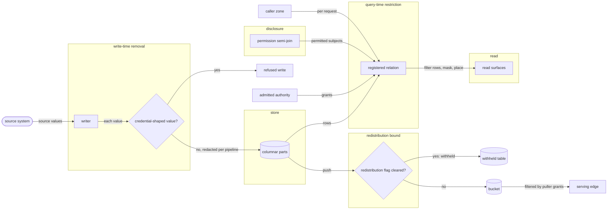
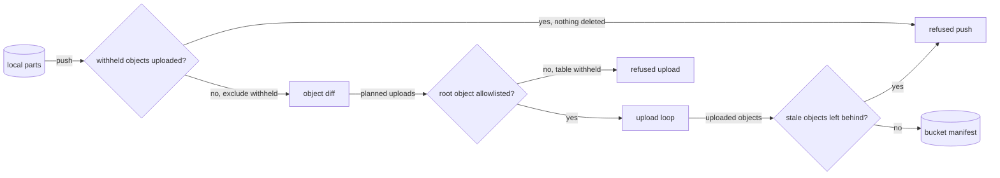
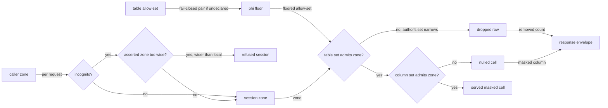

# Enforcement and inference placement

Three layers stand between a stored row and a caller: removal at write time, a
redistribution bound at push, and a compiled relation at query time. Together they form
the reference monitor. This file states what each layer does, the order the compiled
relation applies, column classification and masking, and the grammar of an inference zone.

The three layers of the reference monitor and the contracts feeding each:



## redact

Removal and transformation inside the writer, ahead of columnar bytes and the run path's durable record.

- `write-time` — Redaction runs inside the writer before columnar encoding. Each rule drops its value or transforms it into a policy-defined substitute: keyed digest, token, prefix or generalized band.
  *A-authority*
- `rule` — A rule names a table, a column, one operation and that operation's argument.
  *A-authority*
- `pipeline-wide` — A rule set declared on a pipeline binds every table the pipeline lands, child tables included.
  *A-authority*
- `after-normalization` — Redaction runs after relational normalization; a rule naming a parent column reaches values shredded into child tables.
  *A-authority*
- `before-the-record` — A canonical source writer shapes, normalizes and removes values before recording an opaque admitted payload; neither its inline record nor its blob contains the removed source value.
  *A-authority*
- `refetch` — A fresh pipeline execution over a table under removal rules reads the source again.
  *A-authority*
- `at-rest-scope` — Stored bytes lack only write-time-removed values. A column protected at query time alone is cleartext in storage and readable with the object-store credential.
  *A-authority*
- `summarize-only` — A `summarize_only` column stores its text whole; the flag lands at write time and travels with the column, binding every surface through {{authority.mask.verbatim-quote}}.
  *A-authority*
- `rules-per-pipeline` — A pipeline carries at most 256 entries in its removal rule set.
  *because a longer rule set is a policy the operator cannot review*
- `pattern-bytes` — One removal pattern carries at most 4 KiB of source text.
  *because pattern compilation cost must remain bounded before a writer starts*
- `compiled-pattern-size` — Each Thompson NFA compiled for one removal pattern occupies at most 1 MiB.
  *because expanded repetitions must not allocate unbounded matcher state*
- `pattern-refusal` — Unsupported syntax, Unicode word boundaries, empty matches or a pattern past {{authority.redact.pattern-bytes}} or {{authority.redact.compiled-pattern-size}} raises `EnforceRedactionInvalid` at declaration.
  *because a failed matcher cannot silently leave a declared sensitive value intact*
- `in-value` — Pattern removal rewrites the union of all matches in one linear pass, merging overlapping matches into one span; whole-value removal rewrites one cell. JSON paths select object keys, array indices or every array item; unselected values remain unchanged.
  *A-authority*
- `every-land-entry` — A canonical project declaration binds direct and staged writers even when their callers omit its rules.
  *A-authority*
- `combined-authority` — A destination's ordered canonical rule union obeys {{authority.redact.rules-per-pipeline}}; conflicting declared types, classes or policies and duplicate rules refuse before writing parts.
  *because an additional declaration cannot replace an earlier rule or its type and class authority*
- `normalized-authority` — Projects declaring protected relational normalization require canonical table bindings for ordinary writes; an undeclared destination enters through a declared root's complete normalization lineage or refuses before durable bytes.
  *because a child name cannot prove which source column its values descend from*
- `rewritten-identities` — Relational parent and child identities derive from rewritten source values; removed values contribute no retained identity digest.
  *A-authority*
- `child-selector-lineage` — A normalized child mask selecting a sibling class requires typed sibling-row lineage; a group lacking that lineage refuses before writing any part.
  *because a source-row index cannot distinguish sibling values from different child rows*
- `pinned-plan` — A source plan's explicit removal list equals its complete canonical destination rules; an unbound or mismatched list refuses before source execution. Canonical removal still binds an omitted list.
  *because a content-hashed plan cannot promise rules that its writer ignores*
- `canonical-journal` — Canonical writer rules require {{authority.redact.before-the-record}} even when a caller's source plan omits its removal list; {{run.journal.redacting-source}} governs absent admission.
  *because caller omission cannot weaken a durable declaration's recording boundary*
- `relational-journal` — A protected relational source records its concrete rewritten root and child group, preserving declared root types, child lineage and {{authority.redact.rewritten-identities}} through {{run.journal.prepared-replay}}.
  *A-authority*
- `prepared-payload` — A protected source cannot supply an admitted recording envelope; modified rows, types, destination or normalization fail canonical payload admission before staged parts.
  *because connector-controlled bytes cannot claim a writer's recording authority*
- `prepared-continuation` — Protected source continuations refuse before recording unless absent, exact terminal `{ next: null }` without more pages, or text unchanged by every canonical pattern; any canonical whole-value or JSON-path rule refuses text continuations.
  *because a source-controlled continuation can otherwise retain a removed value beside its rewritten rows*
- `prepared-clock` — A protected monotonic source proves complete clock-output lineage before execution opens; lineage reaching removed columns, including JSON-path targets, refuses. Protected relational clocks refuse without complete descendant lineage; independent clocks retain {{run.advance.watermark-shape}}.
  *because progress bytes cannot retain a value that its row removes*
- `recorded-body` — A store-driven job targeting canonical removal rules refuses before body execution without typed effect-result removal lineage; body calls record results before output landing.
  *because later row rewriting cannot remove earlier recorded effect results*
- `prepared-effects` — Canonical effect preparation produces opaque rewritten root and child groups; the paid record and staged group carry the same rewritten values and {{authority.redact.rewritten-identities}}.
  *A-authority*
- `effect-scope` — A prepared effect binds canonical authority to its execution, row and effect entry key and composite projection identity; replay and staging require the independently issued scope, never authority inferred from decoded bytes.
  *A-authority*

## compose

The three layers as one reference monitor, and the order a registered relation applies.

- `three-layers` — The reference monitor is three layers: write-time removal, the redistribution bound at push, and row-and-column restriction at query time. A request is authorized at each.
  *P5*
- `complete-mediation` — Every read of stored rows traverses the layers. A path reaching stored rows outside a registered relation is a defect, never a documented limitation.
  *P5*
- `protection-is-a-rewrite` — Protection is a rewrite in the data plane: predicates compiled into the statement, rewritten projections, a per-credential filter at the sync edge, zone floors. Admission decides entry alone.
  *P5*
- `registered-relation` — The compiler emits one relation per granted table, bound to the table's bare name for the session's lifetime. Every retrieval arm reads through it.
  *P5*
- `relation-order` — A registered relation applies, in order: mirrored permission semi-join, tenant equality, credential predicate, table policy, project default, table zone, then the column projection carrying masks and zone nulls.
  *P5*
- `conjunctive-narrowing` — Steps conjoin: a surviving row survives each step alone, and appending a step removes rows and adds none.
  *P5*
- `before-the-cut` — Every step, zone exclusion included, completes before a ranked result is cut to its requested size; visible positions carry no trace of a withheld row.
  *P5*
- `vector-arm` — A sidecar vector index returns candidate identifiers, which re-join through the registered relation before contributing to a result.
  *P5*
- `replica-again` — A caller holding a filtered replica is constrained again per query, the replica's bytes unchanged.
  *P5*
- `session-build` — A session builds its relations at admission and rebuilds them when a revocation or a manifest change invalidates a grant it holds.
  *P5*
- `relations-per-session` — A session carries at most 1024 entries in its relation set.
  *because a larger grant set is a mis-scoped credential*

## filter-rows

The typed row-predicate grammar, subject binding, the tenant equality and the project default.

- `grammar` — A row predicate is the typed boolean subset of SQL in Shapes: column references, comparisons, conjunction, disjunction, negation, membership lists, pattern matching, null tests and declared-safe scalar functions.
  *P1*
- `outside-grammar` — Predicates parse at manifest load; a node outside the grammar raises `EnforcePredicateOutsideGrammar`, naming the node.
  *P1*
- `subject-relation` — Subject claims reach a predicate as prepared-statement parameters through a session-scoped subject relation. A claim value carrying SQL syntax occupies a parameter slot and reaches no parser.
  *P1*
- `exception` — An exception condition is a boolean expression over subject fields in the same grammar, bound the same way.
  *P1*
- `override` — A table-policy predicate overriding for a matching subject condition replaces that one predicate; it reaches neither the tenant equality, the mirrored join nor the credential predicate.
  *P5*
- `default-deny` — A table reached with no matching grant yields no rows.
  *P5*
- `tenant-equality` — A tenant-scoped grant compiles a bound-parameter byte equality on the tenant column, conjoined by the engine; no consumer statement carries it.
  *P5*
- `predicate-size` — A declared predicate holds at most 4 KiB of source text.
  *because a longer predicate is unreviewable policy*
- `membership-list` — A membership list inside a predicate holds at most 512 entries.
  *because a longer list belongs in a mirrored table*

## mask

Column classes, strategies and combines, guardrails over an exhaustible value space, the pepper, and masked behavior under caller SQL.

- `column-policy` — A column declares `class` and `strategy`, optionally `combine`, `crowd` and `summarize_only`, under `[pipeline.tables.policy.columns]`. An undeclared column carries no class.
  *A-authority*
- `class-registry` — `class` takes a value from the class registry in Shapes. `phi` marks protected health data; `ssn`, `phone`, `email` and `mrn` are exhaustible, each carrying a registered domain size.
  *A-authority*
- `row-class` — A column declares `class = { from = ... }`, a `strategies` map naming registered classes, and `fallback = "drop"`; each row's sibling text selects its strategy, independently of other rows.
  *A-authority*
- `row-class-selector` — `from_column` aliases `from` in {{authority.mask.row-class}}; declaring both names or any unknown selector field refuses before reading rows.
  *because ambiguous selector declarations cannot choose which class controls a row*
- `row-class-dependency` — A row-class selector names another Utf8 column in the same table; {{authority.mask.absent-column}} checks its presence, and every mapped strategy retains {{authority.mask.typed-strategy}} and {{authority.mask.digest-alone}}.
  *A-authority*
- `row-class-fallback` — Unknown and null row-class values receive strict drop; no unspecified branch yields the original column value.
  *because an unrecognized class cannot grant weaker protection than any declared branch*
- `unknown-class` — A `class` outside the registry raises `EnforceUnknownClass` at manifest check.
  *A-authority*
- `class-reach` — A column's class reaches write-time removal, query-time masking, zone floors and the protections a release applies to a key it joins on.
  *A-authority*
- `strategies` — The strategies are `drop`, `hash` (keyed), `tokenize` (format-preserving), `truncate`, `bucket` and `range`.
  *A-authority*
- `drop` — `drop` nulls the cell, or yields an empty string for a string column.
  *A-authority*
- `one-value` — A column mask is one value whose primary and combine halves are private; it drives both the write-time and query-time layers, and no consumer applies the primary alone.
  *A-authority*
- `digest-alone` — `hash` or `tokenize` standing alone over an exhaustible class raises `EnforceDigestAloneOnExhaustibleClass`.
  *A-authority*
- `high-entropy` — A column of random identifiers or opaque tokens carries `hash` with no combine.
  *A-authority*
- `combine-generalizes` — A `bucket` or `range` combine behind `hash` or `tokenize` raises `EnforceCombineWithoutGeneralization`; `truncate` is the one combine that generalizes a digest.
  *A-authority*
- `hash-width` — `hash` emits 32 chars of hexadecimal.
  *A-authority*
- `token-width` — `tokenize` emits 20 chars.
  *A-authority*
- `cuts-nothing` — A `truncate` combine at or past its primary's output width raises `EnforceTruncationCutsNothing`.
  *A-authority*
- `crowd` — A column's `crowd`, the fewest inputs one masked output covers, is at least 1000 values and defaults to that floor.
  *A-authority*
- `truncation-ceiling` — Behind a keyed digest over an exhaustible class, a `truncate` width above floor(log_b(domain ÷ `crowd`)), b being 16 for `hash` and 36 for `tokenize`, with domain from the class registry, raises `EnforceTruncationTooWide`.
  *A-authority*
- `pepper` — One environment variable supplies the key for `hash` and `tokenize`, read by both layers as one resolved value.
  *A-authority*
- `development-pepper` — Left unset, the pepper resolves to a constant in the source tree and the process emits one signal per run.
  *A-authority*
- `pseudonymous` — `hash` output is an HMAC-SHA-256 under the pepper and is pseudonymous; no surface labels a masked value anonymous.
  *A-authority*
- `native-digest` — Both layers compute the keyed digest natively; the query layer calls a scalar function holding the pepper in process memory, and a value masked at either layer joins the other.
  *A-authority*
- `key-material` — A compiled relation, query plan or session catalog entry carrying pepper-derived key state raises `EnforceKeyMaterialInRelation`.
  *A-authority*
- `subject-exception` — A mask carries exceptions, each a subject condition in the row-predicate grammar bound through the subject relation.
  *P1*
- `in-place` — The masked projection substitutes named columns where they stand; the caller receives the column set and order the unmasked statement produces, and `*` expands to it.
  *A-authority*
- `equality` — An equality filter on a `drop` column matches nothing; on a `hash` column it matches equal digests.
  *A-authority*
- `aggregates` — Aggregation reads the masked column.
  *A-authority*
- `summarize-only` — `summarize_only` is a flag, not a strategy: the value stays legible to grounding and citation.
  *A-authority*
- `verbatim-quote` — One citation releases at most 280 chars of a `summarize_only` value verbatim, on every surface.
  *A-authority*
- `typed-strategy` — A binary column masks by `drop` or by `hash` over its bytes, a vector or nested column by `drop` alone over the whole column; another strategy on either raises `EnforceStrategyOutsideType` at manifest load.
  *A-store*
- `absent-column` — A mask naming a column the table's schema omits raises `EnforceMaskOnAbsentColumn` at manifest load, refusing the whole manifest.
  *because a skipped declaration serves reads under a policy its author believed covered a column*
- `masks-per-table` — A table carries at most 128 entries in its column mask set.
  *because a table beyond it needs a drop, not a mask per column*

## refuse

The two shapes an unauthorized read takes, the scope guard, and what a refusal discloses.

- `scope-denied` — A tenant-scoped credential reading another tenant's rows on a granted table raises `EnforceScopeDenied`, as wire code `scope_denied`, HTTP `403` or an in-band tool error, naming the table and both scopes.
  *P2*
- `not-empty` — A scope refusal is a typed error, never an empty result.
  *P2*
- `echo` — The requested scope in a refusal echoes the statement's value, never a stored value.
  *P2*
- `ungranted-table` — A relation the caller holds no grant on, whether or not a table of that name exists, raises `EnforceUnknownRelation` and is absent from listings and descriptions.
  *P2*
- `payload` — A refusal payload carries at most 512 B.
  *P2*
- `scope-guard` — The scope guard walks the engine's parse once, deciding literal equalities and membership lists over the tenant column and bound template parameters destined for it.
  *P2*
- `top-level` — The guard reads top-level conjuncts of a statement whose own FROM names a scoped table.
  *P2*
- `guard-walk` — The guard visits at most 4096 entries of one parse tree.
  *P2*
- `undecidable` — A constraint the guard cannot settle composes as an ordinary conjunct; the engine-applied equality isolates.
  *P5*
- `drifted-scope` — A tenant value matching no partition reads empty, like a tenant that wrote nothing; the read path repairs no transformed scope value.
  *A-authority*

## bound-redistribution

The per-table licence bound applied at push, the root-object allowlist, and the per-credential edge filter.

- `withhold` — A cleared redistribution flag withholds every object of the table at push and omits the table's name from the bucket manifest.
  *A-authority*
- `before-diff` — The exclusion applies before the object diff is computed.
  *A-authority*
- `outranks-grants` — The bound holds against a credential granted everything.
  *A-authority*
- `envelopes` — The bound covers the table's columnar files and each pull's verbatim record.
  *A-authority*
- `root-allowlist` — While any table is withheld, a root-level object ships only when the allowlist in Shapes names it.
  *A-authority*
- `root-not-allowlisted` — A root-level object absent from the allowlist raises `EnforceRootObjectNotAllowlisted` at push.
  *A-authority*
- `left-behind` — Clearing the flag over a table an earlier push uploaded raises `EnforceStaleRedistributedObjects`, naming each object and the remedy, deleting none.
  *A-authority*
- `manifest-is-an-index` — An object stays fetchable by its key after the manifest stops naming it; a manifest authorizes nothing.
  *A-authority*
- `report` — A left-behind report names at most 100 files and states the total found.
  *A-authority*
- `two-checks` — The left-behind check runs before and after the upload loop; the guarantee holds for one bucket under one pushing configuration.
  *A-authority*
- `edge-filter` — A serving edge in front of the bucket filters a materialized replica by the pulling credential's grants.
  *A-authority*

One push under the bound:



## place

Inference zones: grammar, composition across grains, floors, incognito, and the serve-time outcome.

- `zone-string` — A zone string parses, after trimming, as `local:device`, `on-prem:<id>`, `private-cloud:<id>` or `public-cloud:<id>`; any other text is undeclared. The identifier is part of the value.
  *A-authority*
- `allow-set-entry` — An allow-set entry is `*`, `local:device`, `on-prem:*`, `private-cloud:*`, `public-cloud:*`, or a category carrying a concrete identifier.
  *A-authority*
- `unparsed-pattern` — An allow-set entry matching no entry form raises `EnforceZonePatternUnparsed`, naming the entry.
  *because an unparsed entry matching nothing hides a policy error; a new zone category updates the grammar first*
- `disjunctive` — A zone is admitted when any entry matches. A bare category matches every identifier in it; an entry carrying an identifier matches that identifier alone.
  *A-authority*
- `undeclared` — Only `*` admits an undeclared zone.
  *A-authority*
- `caller-zone` — The calling process declares its zone per request; the store carries none.
  *A-authority*
- `asserted-zone` — A zone a request asserts stands only where it equals the zone its credential signs; any other assertion raises `EnforceZoneAssertionWidens`, naming both.
  *because an unsigned argument able to widen placement makes the signed zone decorative*
- `picks-no-model` — Placement selects no model and dispatches no inference; the engine's one invocation point is an operator-configured endpoint capability for synthesis.
  *A-authority*
- `fail-closed` — A table declaring no zone policy resolves to the fail-closed pair `local:device` and `on-prem:*`, declared and discovered tables alike.
  *A-authority*
- `permissive-default` — A default resolving an unlabeled table to `*` raises `EnforcePermissiveZoneDefault` where more than one principal owns the store.
  *A-authority*
- `protected-floor` — A `phi` column or table carries a floor at the fail-closed pair; a wider declared set resolves down to it at serve time unless the override names that class or column.
  *A-authority*
- `floor-widened` — A manifest widening a protected-class surface past its floor without an override naming that class raises `EnforceProtectedFloorWidened`.
  *A-authority*
- `removal-with-public-cloud` — A surface declaring write-time removal on a column and an allow-set admitting a public cloud raises `EnforceRemovalWithPublicCloud`.
  *P1*
- `narrowest-grain` — A column's set narrows its table's; a principal's set narrows both.
  *A-authority*
- `excluded-row` — Where the table's effective set omits the session's zone, the row leaves the result.
  *A-authority*
- `excluded-cell` — A cell whose effective set omits the session's zone arrives null, a mask exception notwithstanding.
  *A-authority*
- `per-principal` — A principal's allow-set pins every row it authors wherever the row lands. A row with no verified author resolves as an undeclared zone.
  *A-authority*
- `evidence-floor` — A synthesized row declaring a set wider than the intersection of its evidence tables' sets raises `EnforceEvidenceFloorExceeded` and resolves to that intersection.
  *A-authority*
- `empty-evidence` — A synthesized row naming no evidence table raises `EnforceEvidenceListEmpty` and resolves to the fail-closed pair of {{authority.place.fail-closed}}.
  *because an empty list intersects to every zone, and a row citing nothing then resolves to the widest set*
- `incognito` — Incognito pins the session to the fail-closed pair, the uncredentialed local owner's reads included.
  *A-authority*
- `incognito-widening` — A session asserting a zone wider than the incognito pin raises `EnforceIncognitoWidening`.
  *A-authority*
- `team-default` — A project declares a default zone, whether users widen it, and whether incognito is on by default.
  *A-authority*
- `serve-outcome` — Serving one row yields a drop flag and the list of zone-masked columns.
  *A-authority*
- `envelope` — A response envelope carries the zone's removals, the asserted zone and the incognito flag in {{read.respond.restriction-block}}, and no removed value.
  *A-authority*
- `excluded-disclosed` — `rows_dropped` counts the rows the zone step removes from the whole relation, every earlier step applied; the caller's statement, filter and requested size never enter it, and no removed value crosses.
  *A-read*
- `symbolic-inclusion` — Inclusion against a floor is decided over every constructor and identifier, never by probing sample zones.
  *A-authority*
- `proxy-boundary` — A proxy replica resolves zones at the proxy boundary.
  *A-authority*
- `allow-set-entries` — An allow-set holds at most 32 entries.
  *A-authority*
- `identifier-length` — A zone identifier holds at most 128 chars.
  *A-authority*

Resolving one served row against the session's zone:



unsettled: Does the restriction block also carry the rows a row predicate removes and the column names a mask policy nulls, given both disclose how much of a table the caller's scope withholds? owner: authority affects: authority.place

## resist

The paths that stay closed to an injected instruction.

- `credential-shaped-value` — The write path raises `EnforceCredentialShapedValue` on a value matching a credential shape, before it reaches storage.
  *A-read*
- `read-only-face` — An organization-wide face serves the read subset of the tool surface; conversational writes are server-authored.
  *A-surface*
- `write-tool` — Registering a write tool on an organization-wide face raises `EnforceWriteOnReadOnlyFace`.
  *A-surface*

## Shapes

The order a registered relation applies, one table, one session:

```mermaid
flowchart LR
  T[("table")] -- "mirrored permission semi-join" --> M["permitted rows"]
  M -- "tenant byte equality" --> TEN["tenant rows"]
  TEN -- "credential predicate" --> RP["subject rows"]
  RP -- "table policy override" --> TP["policy rows"]
  TP -- "project default" --> DEF["default-filtered rows"]
  DEF -- "drop rows by zone" --> ZR["zone-admitted rows"]
  ZR -- "project columns, null, mask" --> V[["registered relation"]]
```



The class registry. The width ceiling assumes the default `crowd`:

```text
class   exhaustible   domain   hash truncate ceiling
phi     no            -        -
ssn     yes           1e9      4
phone   yes           1e10     5
email   yes           1e10     5
mrn     yes           1e8      4
prompt  no            -        -
completion no         -        -
```

A column policy and a zone declaration:

```toml
[pipeline.tables.policy.columns]
patient_mrn   = { class = "mrn",   strategy = "hash", combine = "truncate:4" }
contact_email = { class = "email", strategy = "tokenize", combine = "truncate:4" }
case_notes    = { class = "phi",   summarize_only = true }
salary_band   = { strategy = "bucket:10000" }
internal_id   = { strategy = "hash" }

[pipeline.tables.policy.zone]
allow = ["local:device", "on-prem:*"]
protected_class_override = []

[pipeline.tables.policy.rows]
predicate = "region = subject.region AND classification <= subject.clearance"

  [[pipeline.tables.policy.rows.exception]]
  when      = "subject.role = 'auditor'"
  predicate = "true"

[pipeline.tables.policy.redistribution]
replicate = false

[[principal]]
id   = "analyst-loop"
zone = { allow = ["local:device"] }

[project.zone]
default = "on-prem:hq"
users_may_widen = false
incognito_default = true
```

The row-predicate grammar:

```ebnf
predicate     = disjunction ;
disjunction   = conjunction , { "OR" , conjunction } ;
conjunction   = negation , { "AND" , negation } ;
negation      = [ "NOT" ] , primary ;
primary       = comparison | membership | pattern | null-test | "(" predicate ")" ;
comparison    = operand , ( "=" | "<>" | "<" | "<=" | ">" | ">=" ) , operand ;
membership    = column , [ "NOT" ] , "IN" , "(" , literal , { "," , literal } , ")" ;
pattern       = column , [ "NOT" ] , "LIKE" , string ;
null-test     = column , "IS" , [ "NOT" ] , "NULL" ;
operand       = column | subject-field | literal | safe-call ;
subject-field = "subject" , "." , identifier ;
safe-call     = declared-function , "(" , [ operand , { "," , operand } ] , ")" ;
```

The root-object allowlist while a table is withheld:

```text
tables/<withheld>/    withheld: no object, no manifest entry
access/               ships: mirrored permission tables
stale_memory.idx      ships
manifest.json         ships, naming no withheld table
catalog.db            withheld
records/              withheld: verbatim pull records
memory.db             withheld
```

The serve-time outcome and the response envelope:

```json
{
  "row": { "drop": false, "masked_columns": ["case_notes"] },
  "envelope": {
    "rows_removed_by_predicate": 41,
    "rows_removed_by_zone": 7,
    "columns_masked_by_policy": ["patient_mrn", "contact_email"],
    "columns_masked_by_zone": ["case_notes"],
    "asserted_zone": "on-prem:ward-3",
    "incognito": true
  }
}
```

The two refusals on the wire:

```json
{ "error": { "code": "scope_denied", "http": 403, "table": "patient_visits", "granted_scope": "ward-3", "requested_scope": "ward-7" } }
{ "error": { "code": "unknown_relation", "http": 404, "relation": "payroll" } }
```
