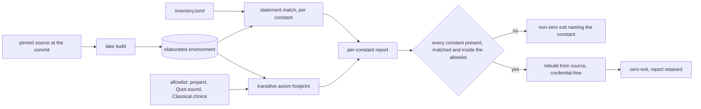

# The formal model

A mechanized model stands beside the policy core: a small Lean 4 library, a set of theorems
over it, a gate that reads axiom dependencies off elaborated proofs, a claim scoped to what
those theorems reach, and a harness that ties the model to the decision functions the engine
runs.

The order a registered relation applies is [`41-enforcement.md` § Compose](41-enforcement.md);
a theorem here ranges over a list taken in that order. The placement constructors, the
allow-set patterns and the floors these theorems range over are [`41-enforcement.md` §
Place](41-enforcement.md); this file decides inclusion over them and defines none of them.
The delegation profile whose mapping to effective authority the model specifies is
[`40-authority.md` § Profile](40-authority.md); a proof target here names that mapping. The
gate stage that runs the check below is [`61-engineering.md` § Gate](61-engineering.md); a
change lands with its proof report attached.

## Parties

| Party | Obligation |
| --- | --- |
| **The model author** | Writes each definition from the specification text rather than from the engine's source, and publishes beside every theorem the statement it leaves unproven. |
| **The package** | Carries its own toolchain pin and an empty dependency set, elaborating from a bare checkout with nothing fetched. |
| **The gate** | Decides on the elaborated environment: every required constant present with its expected statement, every transitive axiom inside the allowlist. Reports per constant rather than in aggregate. |
| **The inventory** | Holds the required constants and their expected statements separately from the declarations satisfying them. Weakening a definition moves the inventory too. |
| **The claimant** | States the claim as named decisions satisfying named specifications under named assumptions, and names every trusted dependency inside it. |
| **The differential harness** | Drives the reference model and the engine's decision functions over the same generated case, minimizes a disagreement, and keeps it. |
| **The reader** | Reads a theorem together with its negative space, and reads the claim's assumption list before relying on any of it. |

## Operations

| Operation | What it governs |
| --- | --- |
| `model` | The Lean package, its toolchain pin, its single library target, and the definitions the theorems range over. |
| `prove` | The theorem inventory itself: layer composition, the placement theorems, the evidence floor, and the five targets over the authority mapping. |
| `audit-axioms` | The axiom footprint, the exact allowlist, the transitive audit over elaborated proofs, and the shapes of check refused as verdicts. |
| `recheck` | Rebuilding and re-auditing from pinned source in a credential-free environment, and the cost model that keeps the check per-change. |
| `scope-claim` | The sentence the assurance claim is allowed to be: its named decisions, its trusted dependencies, its translation chain, and the reach of refinement. |
| `differential-test` | The executable reference model, the case generator, the minimized counterexample corpus, and the standing link to the engine's decision functions. |

## Clauses — model

The package is small and self-contained. Everything a theorem ranges over is defined inside
it, from the specification text.

| Clause | Statement | decided-by |
| --- | --- | --- |
| `formal.model.shape.package` | The model is a Lean 4 package rooted at `formal/`, carrying `lakefile.toml` with no `require` stanza and one `lean_lib` target whose source root is the package directory. | |
| `formal.model.limit.library-targets` | The package's target list holds exactly 1 entries, a single `lean_lib`. A second target doubles what a per-change elaboration covers. | |
| `formal.model.limit.declared-dependencies` | The package manifest declares 0 entries under `require`. | |
| `formal.model.refusal.declared-dependency` | A `require` stanza reaching any external library raises `FormalPackageDependency`, naming the library. | `0316` |
| `formal.model.shape.toolchain-pin` | A `lean-toolchain` file at the package root names one exact toolchain release string. The version manager resolves the toolchain from that file rather than from whatever the build image carries. | |
| `formal.model.refusal.toolchain-drift` | A build whose resolved release string differs from the pinned one raises `ProofToolchainDrift`, printing both strings. | `0316` |
| `formal.model.limit.build-wall-time` | A full elaboration of the package from cold completes within 60 s. | |
| `formal.model.limit.build-artifacts` | The artifacts a full elaboration writes occupy at most 512 KiB. | |
| `formal.model.shape.layer-predicate` | A [[layer-predicate]] is a total function from a row identifier to `Bool`. Nothing in the type distinguishes a row rule from a placement rule; both inhabit it. | |
| `formal.model.shape.composed` | `composed : List Layer → RowId → Bool` folds a list by conjunction. A row is admitted by the fold when every member of the list admits it. | |
| `formal.model.shape.allow-set` | An allow-set is modelled as a decidable predicate over the placement value, and the pattern forms it is built from are parsed outside the model. | |
| `formal.model.shape.floor` | `floor : List AllowSet → AllowSet` intersects its argument list pointwise. A caller is admitted by the result when every member admits that caller. | |
| `formal.model.invariant.empty-evidence-list` | `floor []` admits every caller. That is the unit of the intersection fold, not a permission anybody declared, and the model says so where the definition sits. | |
| `formal.model.invariant.definitions-are-total` | Every definition in the package is total and computable; nothing is marked `partial`, `noncomputable` or `opaque`. Decidable equality on each finite enumeration derives rather than being assumed. | |
| `formal.model.shape.placement-inductive` | The caller's declared placement is an inductive type carrying its identifier inside the constructor, with one case per category the manifest admits and one case for an absent declaration. | |
| `formal.model.refusal.unmodelled-constructor` | A category the manifest admits with no case in that inductive raises `UnmodelledConstructor` at elaboration, naming the category. | `0317` |
| `formal.model.invariant.independent-of-the-source` | A definition is written from the specification text and not derived from the engine's source, so a theorem over it states something about the specification rather than restating the code. | |
| `formal.model.invariant.model-is-smaller-than-the-system` | The package holds no definition of credential bytes, signature verification, SQL semantics, journal writes, process state transitions or an attacker's observations. No theorem in it reaches any of those. | |
| `formal.model.shape.module-layout` | Three modules carry the package: one for the layer algebra, one for placement and the floor, one for the authority mapping. The library root re-exports all three. | |
| `formal.model.interface.build-command` | `lake build` at the package root elaborates every declaration and writes the environment the audit reads. | |

## Clauses — prove

Each theorem is published with the statement it does not make. A theorem read without its
negative space reads as a guarantee wider than the one proved.

| Clause | Statement | decided-by |
| --- | --- | --- |
| `formal.prove.invariant.composition-soundness` | `composed_sound`: a row admitted by the fold over a list is admitted by every individual member of that list. A credential compromised at one member gains nothing from the others. | |
| `formal.prove.invariant.monotone-narrowing` | `composed_narrows`: a row admitted by `l :: ls` is admitted by `ls`. Extending a list removes rows and adds none. | |
| `formal.prove.invariant.empty-composition-identity` | `composed_nil`: the empty list admits every row, as the unit of a conjunctive fold. | |
| `formal.prove.shape.negative-space` | The [[negative-space]] beside a theorem states three things it leaves open: that the required members were present in the list, that a member performs removal rather than a test, and that an execution reaches the fold ahead of an effect. | |
| `formal.prove.refusal.theorem-without-negative-space` | A theorem published with no accompanying statement of what it leaves open raises `TheoremWithoutNegativeSpace`, naming the constant. | `0318` |
| `formal.prove.invariant.order-is-specified` | The composition theorem ranges over the single order the engine applies and establishes that order's security and result semantics. Filtering on a value and then masking it yields a different relation from masking and then filtering. | |
| `formal.prove.refusal.commutation-claim` | A claim that the stages commute raises `CommutationClaimed`. Order-independence is not among the statements this file proves. | `0318` |
| `formal.prove.invariant.placement-composes-as-a-layer` | `zone_layer_sound`: taking the placement check as one more member of the list, a row admitted by the whole list was admitted by that check. The two halves of the model join with no bridging hypothesis. | |
| `formal.prove.invariant.floor-admits-nothing-its-evidence-denies` | `floor_no_downgrade`: the floor over an evidence list admitting a caller forces every member of that list to admit the same caller. | |
| `formal.prove.invariant.fail-closed-member-denies-public` | `floor_with_failclosed_denies_public`: an evidence list holding one fail-closed member yields a floor admitting no public-cloud caller, whatever the other members carry. | |
| `formal.prove.invariant.fail-closed-denies-both-cloud-categories` | `failClosed_denies_public` and `failClosed_denies_private` each show the fail-closed allow-set rejecting one cloud category. Together they fix the default's reach. | |
| `formal.prove.invariant.symbolic-inclusion` | [[zone-inclusion]] is decided by subsumption over patterns, quantified over every constructor and every identifier, including a named provider and the undeclared case. | |
| `formal.prove.refusal.sampled-inclusion` | Inclusion decided by evaluating a fixed collection of example values raises `ZoneInclusionSampled`. A finite probe set decides nothing about an unbounded identifier space. | `0317` |
| `formal.prove.invariant.effective-policy-within-its-inputs` | An effective policy computed from two allow-sets is included in both of them. Composition of two declarations produces no caller neither declaration admitted. | |
| `formal.prove.limit.proof-targets` | The authority mapping carries exactly 5 entries of proof target: profile meaning, restriction preservation, narrowing, inclusion, and execution through the scoped session. | |
| `formal.prove.invariant.target-profile-meaning` | Every element the profile accepts carries defined authority semantics, and an element outside the profile maps to a refusal rather than to an absence of constraint. | |
| `formal.prove.invariant.target-restriction-preservation` | Mapping a verified credential to effective authority retains every inherited restriction and every per-grant association. One grant's action stays paired with that grant's own tenant, and the pairing survives the mapping rather than dissolving into a pair of unrelated allowlists. | |
| `formal.prove.invariant.target-narrowing` | For a fixed trusted environment, permission under an attenuated child implies permission under its parent. | |
| `formal.prove.invariant.target-scoped-session` | Every read and every release runs through the scoped session, respects the row, column and placement bounds that session carries, and satisfies the chosen expiry and revocation instant. | |
| `formal.prove.workflow.target-bound-to-a-path` | A [[proof-target]] is tied to one authenticated query path in the tree before the product names it. The binding is recorded beside the target as a module path and a test. | |
| `formal.prove.refusal.unbound-target` | A target named in the claim with no such binding raises `ProofTargetUnbound`, naming the target. | `0317` |
| `formal.prove.shape.mediation-theorem` | A [[mediation-theorem]] ranges over an [[execution-relation]] and proceeds by induction over reachable transitions, concluding that no reachable state reaches stored rows outside the fold. | |
| `formal.prove.refusal.mediation-from-composition` | A filter-composition theorem offered as a mediation theorem raises `MediationClaimedFromComposition`. The two statements quantify over different objects. | `0318` |
| `formal.prove.invariant.theorem-names-carry-their-reach` | A constant's name states the object it ranges over rather than the property a reader hopes for, so a name alone never widens the statement. | |

## Clauses — audit-axioms

The gate decides on the elaborated proof. What the file's characters spell is not an input to
any verdict.

| Clause | Statement | decided-by |
| --- | --- | --- |
| `formal.audit-axioms.invariant.axiom-footprint` | Every theorem in the package depends on `propext` and `Quot.sound`, or on no axiom at all. | |
| `formal.audit-axioms.limit.allowlist-entries` | The [[axiom-allowlist]] holds exactly 3 entries: `propext`, `Quot.sound` and `Classical.choice`. | |
| `formal.audit-axioms.invariant.reviewed-addition` | `Classical.choice` sits in the allowlist as an explicit reviewed addition, recorded together with the constant that draws on it. An entry with no such record is an entry nobody reviewed. | |
| `formal.audit-axioms.interface.transitive-audit` | The [[axiom-footprint]] of each required constant is read transitively off the elaborated environment, one report per constant, naming every axiom reached. | |
| `formal.audit-axioms.refusal.axiom-outside-the-allowlist` | An axiom in a footprint absent from the allowlist raises `AxiomOutsideAllowlist`, printing the constant and the axiom. | `0319` |
| `formal.audit-axioms.invariant.elaborated-not-source` | The audit's input is the [[elaborated-proof]]. A pattern over characters in a file is a fact about the file rather than about what was proved. | |
| `formal.audit-axioms.refusal.source-text-verdict` | A verdict derived from a search over source characters raises `SourceTextVerdict`. A proof of `False` closed inside parentheses defeats a pattern anchored at a line end, and a native-evaluation tactic spelled with a leading plus defeats a pattern spelling the older tactic name. | `0319` |
| `formal.audit-axioms.refusal.hole-axiom` | A footprint containing the hole axiom raises `ProofHoleAxiom`, whatever the surrounding syntax spells. | `0319` |
| `formal.audit-axioms.refusal.native-evaluation-axiom` | A footprint containing a per-declaration native-evaluation axiom raises `NativeEvaluationAxiom`, naming the declaration that minted it. | `0319` |
| `formal.audit-axioms.invariant.build-status-is-not-a-verdict` | Elaboration reports a hole as a warning and exits zero. The exit status of a build therefore carries no information about holes, and the gate reads the footprint instead. | |
| `formal.audit-axioms.shape.inventory` | The [[theorem-inventory]] is a file of rows, one per required constant: its name, the module it elaborates in, its expected statement rendered as text, and the axioms it is admitted to reach. | |
| `formal.audit-axioms.invariant.inventory-is-independent` | The inventory is maintained apart from every declaration that satisfies it. Editing a definition edits no inventory row, so weakening a statement to make a proof close is a visible second edit. | |
| `formal.audit-axioms.refusal.missing-constant` | A required constant absent from the elaborated environment raises `TheoremConstantMissing`. Deleting a theorem removes the proof and keeps the requirement. | `0319` |
| `formal.audit-axioms.refusal.statement-drift` | A required constant whose elaborated statement differs from its expected text raises `TheoremStatementDrift`, printing both. | `0319` |
| `formal.audit-axioms.interface.per-constant-report` | The audit's output names each required constant, whether its statement matched, and the axioms it depends on. An operator reads a row rather than a total. | |
| `formal.audit-axioms.refusal.declaration-count-verdict` | A count of theorem or lemma declarations offered as a pass condition raises `DeclarationCountVerdict`. Such a count measures that a file holds declarations. | `0319` |
| `formal.audit-axioms.invariant.inventory-change-travels-with-the-proof` | A change to a required statement lands in the same commit as the proof it admits, and the report prints the old text beside the new one. | |
| `formal.audit-axioms.interface.check-command` | `contextful formal check` elaborates the package, matches every inventory row, audits every footprint, and exits non-zero naming the first constant that fails any of the three. | |

## Clauses — recheck

The gate runs a second time over the same commit, from source, holding nothing it could
authenticate with.

| Clause | Statement | decided-by |
| --- | --- | --- |
| `formal.recheck.workflow.two-phase` | A [[recheck]] rebuilds the package from the source at the commit under check and re-runs the footprint audit against the rebuilt environment, discarding any environment the first phase left behind. | |
| `formal.recheck.invariant.pinned-source` | The rebuild reads the commit's own source tree and the toolchain its pin names, fetching neither a floating reference nor a cached artifact from another commit. | |
| `formal.recheck.limit.credentials` | The recheck environment holds 0 entries of credential: no token, no signing key, no registry login. | |
| `formal.recheck.refusal.credentialed-environment` | A recheck environment exposing a credential raises `RecheckEnvironmentCredentialed`, naming the variable or the file that carried it. | `0319` |
| `formal.recheck.refusal.artifact-mismatch` | A rebuilt artifact differing from the committed one raises `ArtifactSourceMismatch`, naming the module whose output diverged. | `0319` |
| `formal.recheck.limit.wall-time` | A recheck completes within 600 s from an empty artifact directory. | |
| `formal.recheck.invariant.network-reach` | The recheck opens no outbound connection. A package with nothing to fetch makes that a property of the environment rather than a policy applied to it. | |
| `formal.recheck.invariant.cost-model` | The proof check runs on every change while the package declares no dependency of its own, which is what keeps a full elaboration inside a per-change budget. | |
| `formal.recheck.invariant.a-dependency-relocates-the-check` | Declaring a dependency changes the elaboration cost and moves the check to a cadence of its own rather than keeping it per-change. | |
| `formal.recheck.interface.report-artifact` | Each run writes one report naming the commit, the resolved toolchain string, every constant with its verdict, and every axiom reached. The report is the artifact a later reader cites. | |
| `formal.recheck.invariant.report-is-self-describing` | A report states the allowlist it applied and the inventory revision it matched against, so a verdict read later resolves without the environment that produced it. | |

## Clauses — scope-claim

The claim is one sentence with named parts. Everything outside those parts is a trusted
dependency, named inside the claim rather than proved by it.

| Clause | Statement | decided-by |
| --- | --- | --- |
| `formal.scope-claim.shape.claim-sentence` | The [[assurance-claim]] reads: these named authorization decisions satisfy these named Lean specifications, under these stated translation and runtime assumptions. Each of the three lists resolves to constants and sections a reader opens in the tree. | |
| `formal.scope-claim.refusal.claim-beyond-named-decisions` | A claim asserting that the enforcement engine is verified, or that any object wider than the named decisions is, raises `ClaimBeyondNamedDecisions`. | `0320` |
| `formal.scope-claim.invariant.trusted-dependencies-are-named` | The delegation library, its cryptography and its parser are named inside the claim as [[trusted-dependency]] entries rather than as objects of it. | |
| `formal.scope-claim.refusal.unnamed-trusted-dependency` | A claim resting on a component absent from its dependency list raises `TrustedDependencyUnnamed`, naming the component. | `0320` |
| `formal.scope-claim.invariant.holds-given-their-correctness` | A theorem about the authority mapping holds given the correctness of those named dependencies, and carries that condition wherever it is quoted. | |
| `formal.scope-claim.shape.translation-chain` | The [[translation-chain]] has four links: the compiler's lowering, the translator, the hand-written models standing in for external definitions, and the production build configuration. A statement about translated code inherits all four. | |
| `formal.scope-claim.refusal.unstated-chain` | A theorem claimed over translated code without its chain raises `TranslationChainUnstated`. | `0320` |
| `formal.scope-claim.invariant.translator-is-trusted` | The translator is a trusted dependency and not an object of proof. Its version and its own correctness are assumptions the chain names. | |
| `formal.scope-claim.limit.refinement-first-functions` | [[refinement]] opens on exactly 2 entries of decision function: inclusion, and grant narrowing. | |
| `formal.scope-claim.invariant.refinement-scope` | Translation covers the pure decision functions, whose inputs are values and whose outputs are decisions. | |
| `formal.scope-claim.refusal.refinement` | Translation reaching cryptography, a parsing adapter, a database call or concurrency raises `RefinementScopeExceeded`, naming the module. | `0321` |
| `formal.scope-claim.invariant.assumptions-travel-with-the-theorem` | Wherever a theorem appears — a report, a document, an auditor's packet — its assumption list appears with it, and a quotation that drops the list is a quotation of a different statement. | |
| `formal.scope-claim.invariant.claim-is-checkable` | Every noun in the claim resolves: a decision to a code path, a specification to a constant, an assumption to a named component. A reader checks the claim without asking its author anything. | |

## Clauses — differential-test

An executable model and the engine's decision functions answer the same generated case. A
disagreement is minimized and kept.

| Clause | Statement | decided-by |
| --- | --- | --- |
| `formal.differential-test.shape.reference-model` | The [[reference-model]] is an executable rendering of the same decision functions in Lean, built to a binary that reads one case on standard input and prints one decision. | |
| `formal.differential-test.workflow.harness` | The [[differential-harness]] generates a case, drives both the reference binary and the engine's decision function over it, and compares the two decisions field by field. | |
| `formal.differential-test.invariant.three-case-classes` | The generator emits malformed inputs, boundary values and well-formed successful requests in the same run. A generator producing successes alone exercises one third of the surface. | |
| `formal.differential-test.invariant.counterexample-is-minimized` | A disagreement is shrunk to a case where removing any further field makes the two agree, and the minimized case is what the run records. | |
| `formal.differential-test.invariant.corpus-is-replayed` | Every minimized case in the [[counterexample-corpus]] runs first on each later invocation, ahead of any freshly generated case. | |
| `formal.differential-test.limit.corpus-entries` | The corpus retains at most 256 entries, evicting the oldest case that a later run reproduces from a fresh seed. | |
| `formal.differential-test.limit.run-budget` | One invocation, corpus replay included, completes within 300 s. | |
| `formal.differential-test.refusal.disagreement` | A case on which the two decisions differ raises `ReferenceModelDrift`, printing the minimized case and both decisions. | `0321` |
| `formal.differential-test.refusal.discarded-counterexample` | A run that reports a disagreement and writes no corpus entry raises `CounterexampleDiscarded`. | `0321` |
| `formal.differential-test.invariant.evidence-not-equivalence` | The harness produces evidence about running code, not an equivalence proof. A case the generator does not emit falls outside what any green run covers, and the report states the case classes it drew from. | |
| `formal.differential-test.invariant.stands-on-its-own` | The harness depends on no external translation toolchain. Its evidence holds independently of whether the pure decision functions are translated. | |
| `formal.differential-test.invariant.two-artifacts-in-step` | The reference model and the engine's decision functions change together. A change to one alone surfaces as a disagreement on the next run rather than as a silent divergence. | |
| `formal.differential-test.invariant.seed-is-recorded` | Each run records the generator seed it used, and re-running with that seed reproduces the same case sequence. | |
| `formal.differential-test.interface.differential-command` | `contextful formal differential --seed <n> --cases <n>` runs the corpus and then the generated cases, exiting non-zero on the first disagreement. | |

## Shapes

The package on disk:

```
formal/
  lakefile.toml            one `lean_lib`, no `require` stanza
  lean-toolchain           one exact release string
  Contextful.lean          library root, re-exports the three modules
  Contextful/
    Layer.lean             Layer, composed, composed_sound, composed_narrows, composed_nil
    Placement.lean         the placement inductive, allow-set predicates, floor, zone_layer_sound
    Authority.lean         profile elements, effective authority, narrowing
  inventory.toml           required constants and their expected statements
  reference/               the executable model the differential harness drives
```

The layer algebra and one theorem over it:

```lean
abbrev RowId := Nat
abbrev Layer := RowId → Bool

def composed : List Layer → RowId → Bool
  | [],      _ => true
  | l :: ls, r => l r && composed ls r

theorem composed_sound {ls : List Layer} {r : RowId}
    (h : composed ls r = true) : ∀ l ∈ ls, l r = true := by
  induction ls with
  | nil => intro l hl; cases hl
  | cons a as ih =>
      intro l hl
      rw [composed, Bool.and_eq_true] at h
      rcases List.mem_cons.mp hl with rfl | hl'
      · exact h.1
      · exact ih h.2 l hl'
```

One inventory row:

```toml
[constant.composed_sound]
module    = "Contextful.Layer"
statement = "∀ {ls : List Layer} {r : RowId}, composed ls r = true → ∀ l ∈ ls, l r = true"
axioms    = ["propext", "Quot.sound"]
binding   = "engine/policy/src/relation.rs::compose_layers"
negative  = """
Leaves open: that the required members were present in the list; that a member
performs removal rather than a test; that an execution reaches the fold ahead of
an effect.
"""
```

One line of the per-constant report:

```json
{
  "constant": "zone_layer_sound",
  "module": "Contextful.Placement",
  "statement_matches": true,
  "axioms": ["propext", "Quot.sound"],
  "outside_allowlist": [],
  "binding": "engine/policy/src/placement.rs::admits"
}
```

One minimized counterexample:

```json
{
  "seed": 8113,
  "case": {
    "caller": "<undeclared>",
    "allow": ["public-cloud:*"],
    "evidence": [["on-prem:*"], ["*"]]
  },
  "reference": { "admitted": false, "masked": [] },
  "engine": { "admitted": true, "masked": [] },
  "shrunk_from": 41
}
```

The check, end to end:



The claim, with its parts resolved:

```
claim
  decisions       engine/policy/src/placement.rs::admits
                  engine/policy/src/grant.rs::narrow
  specifications  Contextful.Placement.zone_layer_sound
                  Contextful.Authority.narrowing_implies_parent
  assumptions     delegation library, its cryptography, its parser
                  compiler lowering · translator · external-definition models
                  production build configuration
```

## Unsettled

unsettled: Which review admits a new axiom to the allowlist, and where does that review land so a later reader finds it beside the constant? owner: formal affects: formal.audit-axioms

unsettled: What transition set formalizes execution here, and what is the induction over reachable states that closes the mediation statement? owner: formal affects: formal.prove

unsettled: Is inclusion decided by subsumption over patterns or by a normal form on allow-sets, given a category pattern that subsumes every identifier under it without enumeration? owner: formal affects: formal.prove

unsettled: What discharges the completeness of an evidence list backing a floor, given that an empty list folds to the admit-everything element? owner: formal affects: formal.prove

unsettled: Which translation toolchain reaches Lean from the engine's source, and does it resolve against the pinned release string? owner: formal affects: formal.scope-claim

unsettled: What case does the harness generate to separate a native build of a decision function from its WebAssembly build on malformed input? owner: formal affects: formal.differential-test
