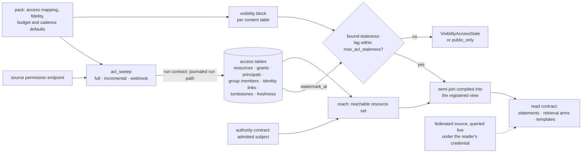
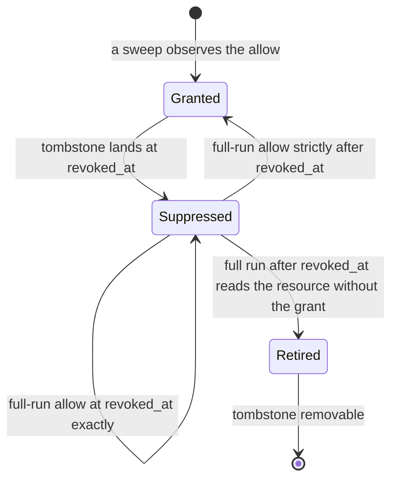
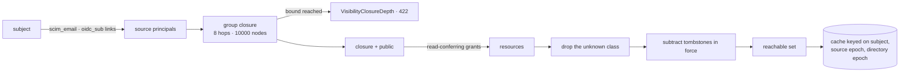
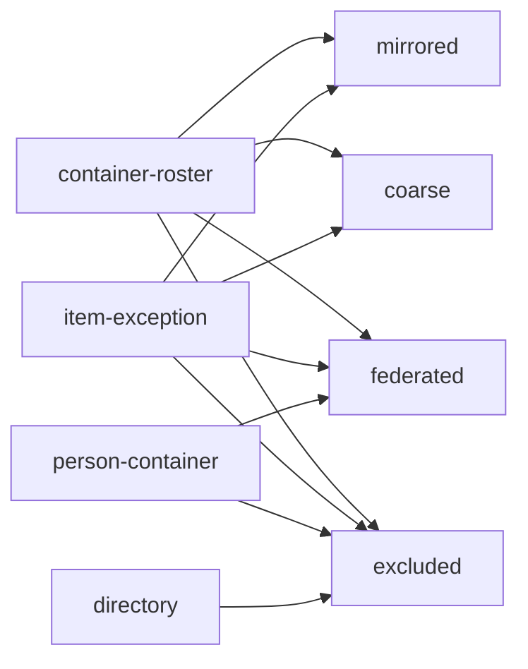

# Source-faithful visibility

A workspace serving a whole organization answers each reader inside the audience the
originating source drew. This file holds the mirrored permission state, its observation
clock, the resolution of a subject to the resources it reaches, the age budget on that
state, the fidelity a table claims, and the pack that lands a source.

Mirrored permission state, from the source's permission endpoint to the reader's view:



## mirror

| Clause | Statement | Why |
| --- | --- | --- |
| `disclosure.mirror.unbound-table` | On an organization-wide face, a table with no visibility block raises `VisibilityUnboundTable` from diagnose and from the serving guardrail at start, naming the table. | P5 |
| `disclosure.mirror.incomplete-binding` | A binding at a servable level lacking a declared sweep for its source or a `max_acl_staleness` raises `VisibilityBindingIncomplete`. | P5 |

unsettled: What opens a resource whose access list could not be mirrored, who may open it, and does the opening land as an expiring grant row or as manifest policy? owner: disclosure affects: disclosure.mirror

## sweep

| Clause | Statement | Why |
| --- | --- | --- |
| `disclosure.sweep.ungapped-stream` | Advancing `watermark_at` from an event stream the mapping has not declared gap-detectable raises `VisibilityUngappedStream`. | A-disclosure |
| `disclosure.sweep.orphan-grant` | A grant landing with no resource row, or on a resource of the unknown class, raises `VisibilityOrphanGrant` at commit and joins no reachable set. | P5 |

One grant under deny-outranks-allow, every instant an engine UTC instant:



## reach

| Clause | Statement | Why |
| --- | --- | --- |
| `disclosure.reach.closure-walk` | The closure walks the group graph with a visited set, ending any cycle, to a depth of `max_group_depth`, default 8 hops, and a breadth of 10000 nodes. | |
| `disclosure.reach.closure-overflow` | A closure reaching its depth or node bound raises `VisibilityClosureDepth` with the non-retryable HTTP status 422 and returns no set. | A-disclosure |
| `disclosure.reach.cache-capacity` | The reachable-set cache holds at most 100000 entries and evicts the least recently used. | |
| `disclosure.reach.degraded-uncached` | Retaining a reachable set or result produced past a budget, or under the narrowing posture, raises `VisibilityDegradedCached`. | A-disclosure |

The per-request resolution of a subject to its reachable set:



unsettled: Do the epochs keying the reachable-set cache scope per source rather than per access table, and does a materialized closure live in a rebuildable projection or in files a replica opens offline? owner: disclosure affects: disclosure.reach

## bound-staleness

| Clause | Statement | Why |
| --- | --- | --- |
| `disclosure.bound-staleness.budget-grammar` | `max_acl_staleness` is a positive integer with one suffix from `s`, `m`, `h`, `d`. A compound form, a bare number or another suffix raises `VisibilityBudgetMalformed`, naming the table and the text read. | A-disclosure |
| `disclosure.bound-staleness.access-stale` | A read raises `VisibilityAccessStale` (HTTP 503, carrying source, lag, budget and last observation) when a touched table's source lag exceeds its budget, the source has no completed full run, or the public-status watermark is past budget. | A-disclosure |
| `disclosure.bound-staleness.budget-below-cadence` | A budget tighter than the sweep cadence its source sustains raises `VisibilityBudgetUnreachable` at diagnose, naming both figures. | A-disclosure |

## declare-fidelity

| Clause | Statement | Why |
| --- | --- | --- |
| `disclosure.declare-fidelity.family-bound` | A `person-container` table at a servable level, or a `directory` table above `excluded`, raises `VisibilityFamilyBound` and the table does not load. | A-disclosure |
| `disclosure.declare-fidelity.family-undeclared` | A mapping landing a table without naming its `family` raises `VisibilityFamilyUndeclared`. | A-disclosure |
| `disclosure.declare-fidelity.federated-registered` | Registering a `federated` table on a read face raises `VisibilityFederatedRegistered`. | A-disclosure |
| `disclosure.declare-fidelity.federated-cache` | Retaining a federated result under a key omitting the subject raises `VisibilityFederatedCacheShared`. | A-disclosure |
| `disclosure.declare-fidelity.computed-inputs` | A source that computes access with a sharing engine is queried live. A mapping projecting that engine's inputs into `access_grants` raises `VisibilityComputedInputsMirrored`, naming the source. | A-disclosure |
| `disclosure.declare-fidelity.roster-from-payload` | A mapping deriving grants from a people list inside content — attendees, invitees, recipients, contacts — rather than from the source's permission endpoint raises `VisibilityRosterFromPayload`. | A-disclosure |

unsettled: Where does the per-reader delegated credential a federated leg runs under come from, and how does a federated result with no store row carry a citation? owner: disclosure affects: disclosure.declare-fidelity

## pack

| Clause | Statement | Why |
| --- | --- | --- |
| `disclosure.pack.mapping-absent` | A pack landing a table with neither an access mapping nor `excluded` raises `VisibilityMappingAbsent` at diagnose, naming the pack and the table. | A-disclosure |
| `disclosure.pack.asserts-access` | An access-shaped key the mapping schema does not define raises `VisibilityPackAssertsAccess` by name. Fields outside the mapping are fetch inputs and reach no authorization decision. | A-disclosure |
| `disclosure.pack.any-of-allowlist` | An allowlist evaluated as any-of raises `VisibilityAllowlistAnyOf` at load. | P1 |
| `disclosure.pack.unsupported-coarse` | Declaring `coarse` where the source emits no container or workspace signal raises `VisibilityUnsupportedCoarse`. | A-disclosure |

## Shapes

The access tables. Every instant is an engine UTC instant taken when the sweep read the source.

```sql
CREATE TABLE access_resources (
  resource_id       VARCHAR NOT NULL,
  source            VARCHAR NOT NULL,
  resource_kind     VARCHAR NOT NULL,
  container_id      VARCHAR,
  visibility_class  VARCHAR NOT NULL,   -- mirrored | coarse | federated | unknown
  _acl_observed_at  TIMESTAMP NOT NULL,
  _acl_sweep_kind   VARCHAR NOT NULL,   -- full | incremental | webhook
  _acl_sweep_id     VARCHAR NOT NULL
);

CREATE TABLE access_grants (
  resource_id       VARCHAR NOT NULL,
  principal         VARCHAR NOT NULL,
  principal_kind    VARCHAR NOT NULL,   -- user | group | team | channel | org | public
  level             VARCHAR NOT NULL,   -- source spelling, projected by the mapping
  _acl_observed_at  TIMESTAMP NOT NULL,
  _acl_sweep_kind   VARCHAR NOT NULL,
  _acl_sweep_id     VARCHAR NOT NULL
);

CREATE TABLE access_principals (
  principal         VARCHAR NOT NULL,
  principal_kind    VARCHAR NOT NULL,
  source_label      VARCHAR
);

CREATE TABLE access_group_members (
  "group"           VARCHAR NOT NULL,
  member            VARCHAR NOT NULL,
  member_kind       VARCHAR NOT NULL,
  _acl_observed_at  TIMESTAMP NOT NULL
);

CREATE TABLE access_identity_links (
  source_principal  VARCHAR NOT NULL,
  subject           VARCHAR NOT NULL,
  method            VARCHAR NOT NULL,   -- scim_email | oidc_sub | operator_asserted
  confidence        DOUBLE
);

CREATE TABLE access_tombstones (
  scope             VARCHAR NOT NULL,   -- resource | grant | principal
  resource_id       VARCHAR,
  principal         VARCHAR,
  level             VARCHAR,
  revoked_at        TIMESTAMP NOT NULL
);

CREATE TABLE access_freshness (
  source              VARCHAR NOT NULL,
  sweep_kind          VARCHAR NOT NULL,
  watermark_at        TIMESTAMP NOT NULL,
  last_full_sweep_at  TIMESTAMP,
  last_incremental_at TIMESTAMP,
  lag_seconds         BIGINT,
  budget_seconds      BIGINT
);
```

A bound content table, the sweep feeding it, and a pack's mapping:

```toml
[pipeline.tables.pages.visibility]
source             = "wiki"
resource_key       = "page_id"
resource_kind      = "page"
fidelity           = "mirrored"
family             = "item-exception"
max_acl_staleness  = "15m"
on_stale           = "refuse"

[[acl_sweep]]
source        = "wiki"
credential    = "secret://wiki/permission-reader"
enumerate     = "pages"
full          = { every = "1h" }
incremental   = { every = "5m" }
events        = { stream = "wiki.permissions", gap_detectable = true }

[pack.wiki.access.pages]
resource_key   = "page_id"
resource_kind  = "page"
family         = "item-exception"
principal_kind = { user = "user", group = "group", workspace = "org", anyone = "public" }
level          = { viewer = "read", commenter = "read", editor = "write", owner = "admin" }
```

The levels each source family permits:



The envelope a bound read returns:

```json
{
  "rows": 42,
  "visibility": {
    "fidelity": "coarse",
    "grain": "teamspace",
    "acl_lag_seconds": 212,
    "acl_budget_seconds": 900,
    "degraded": false,
    "group_closure_depth": 3,
    "federated_legs": [{ "source": "drive", "outcome": "timeout", "citations": 0 }]
  }
}
```
