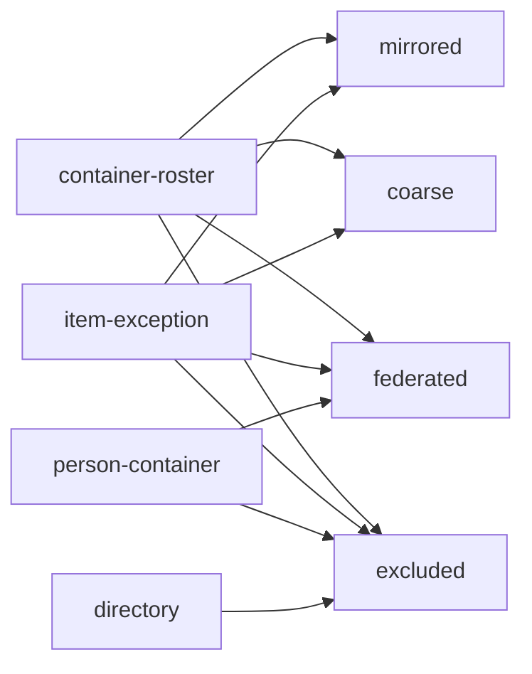

# Source-faithful visibility

A workspace serving a whole organization answers each reader inside the audience the
originating source drew. This file holds the mirrored permission state, its observation
clock, the resolution of a subject to the resources it reaches, the age budget on that
state, the fidelity a table claims, and the pack that lands a source.

## mirror

| Clause | Statement | Why |
| --- | --- | --- |
| `disclosure.mirror.two-key-rule` | A row reaches a subject exactly when the mirrored source access list, manifest policy and the caller's credential each grant it. No layer unions, and no administrative override widens. | |
| `disclosure.mirror.source-faithful` | The mirror reproduces the audience the source drew, oversharing included. Manifest policy, read as a diff, is the one place need-to-know narrows further. | |
| `disclosure.mirror.unknown-class` | A resource whose access list failed to mirror carries `visibility_class = 'unknown'` and reaches no subject, a deployment-wide operator credential included, until manifest policy names it. | |
| `disclosure.mirror.access-tables` | The mirror is seven store tables — `access_resources`, `access_grants`, `access_principals`, `access_group_members`, `access_identity_links`, `access_tombstones`, `access_freshness` — with the columns in Shapes. | |
| `disclosure.mirror.principal-kind` | `principal_kind` takes one of `user`, `group`, `team`, `channel`, `org`, `public`. A mapping normalizes a source vocabulary onto that set and writes organization membership as a group edge. | |
| `disclosure.mirror.public-principal` | The principal `public` is an ordinary grant row, and every request carries it beside the subject's own principals. | |
| `disclosure.mirror.grant-level` | `level` is a source-defined string the mapping projects onto engine actions. A level conferring no read appears in the explanation trace and adds nothing to a reachable set. | |
| `disclosure.mirror.visibility-class` | `visibility_class` takes one of `mirrored`, `coarse`, `federated`, `unknown`, recorded per resource. | |
| `disclosure.mirror.watermark-decides` | Of the `access_freshness` columns, `watermark_at` alone decides a read; the others inform an operator. | |
| `disclosure.mirror.visibility-block` | A content table declares `[pipeline.tables.visibility]` with `source`, `resource_key`, `resource_kind`, `fidelity`, an optional `family`, `max_acl_staleness` and `on_stale`. A table carries one binding, arriving with the pack that lands it. | |
| `disclosure.mirror.semi-join` | The engine compiles a semi-join against the caller's reachable resource set into the caller's registered view; statements, retrieval arms, previews, templates and embedded surfaces inherit it. | P5 |
| `disclosure.mirror.org-wide-face` | A deployment is an organization-wide face once any table declares a visibility block or any source has a permission sweep. | |
| `disclosure.mirror.unbound-table` | On an organization-wide face, a table with no visibility block raises `VisibilityUnboundTable` from diagnose and from the serving guardrail at start, naming the table. | P5 |
| `disclosure.mirror.incomplete-binding` | A binding at a servable level lacking a declared sweep for its source or a `max_acl_staleness` raises `VisibilityBindingIncomplete`. | P5 |
| `disclosure.mirror.excluded` | `fidelity = "excluded"` is the one way a table sits on an organization-wide face without a servable binding. The table is neither ingested nor queried live, and no surface offers it. | |

unsettled: What opens a resource whose access list could not be mirrored, who may open it, and does the opening land as an expiring grant row or as manifest policy? owner: disclosure affects: disclosure.mirror

## sweep

| Clause | Statement | Why |
| --- | --- | --- |
| `disclosure.sweep.observation-columns` | Every access row carries `_acl_sweep_kind` (full, incremental or webhook), the writing run's `_acl_sweep_id`, and `_acl_observed_at`, held apart from the instant the row landed. | |
| `disclosure.sweep.clocks` | `_acl_observed_at`, `revoked_at` and `watermark_at` are engine UTC instants taken when the sweep read the source. A source's own event time is carried as data and decides nothing. | because ordering a revocation against an allow across two clocks orders them by skew |
| `disclosure.sweep.watermark` | `watermark_at` advances only on a sweep run that finished having read every governed resource in the source. A failed or partial run advances nothing. | D35 |
| `disclosure.sweep.deny-outranks-allow` | A tombstone suppresses its resource, grant or principal on every read after `revoked_at` until a full run observes an allow at an instant strictly later than `revoked_at`. Equal instants keep the tombstone. | D35 |
| `disclosure.sweep.incremental-never-restores` | An incremental or webhook observation adds only grants no tombstone covers, lifts no suppression, and narrows the rows it touches the moment it lands. | |
| `disclosure.sweep.tombstone-match` | The tombstone scope — resource, grant or principal — decides which of `resource_id`, `principal` and `level` participate; suppression is equality over those typed columns. | |
| `disclosure.sweep.tombstone-retirement` | A tombstone is removable once a full run, observed after its `revoked_at`, has read the resource without the revoked grant. | |
| `disclosure.sweep.revocation-is-a-join` | A withdrawn share takes effect on the first read after its sweep commits, with no re-ingestion and no content row deleted. | |
| `disclosure.sweep.ungapped-stream` | Advancing `watermark_at` from an event stream the mapping has not declared gap-detectable raises `VisibilityUngappedStream`. | D35 |
| `disclosure.sweep.gap-reconciliation` | A gap-detectable stream numbers its deliveries, detects a missing number, and reconciles the affected resources against the source before the watermark passes the gap. | |
| `disclosure.sweep.sweep-block` | An `[[acl_sweep]]` block declares one source's sweep: the source key, the credential reference, the resource enumeration, a cadence per sweep kind, and the event stream where one exists. | |
| `disclosure.sweep.orphan-grant` | A grant landing with no resource row, or on a resource of the unknown class, raises `VisibilityOrphanGrant` at commit and joins no reachable set. | P5 |
| `disclosure.sweep.run-path` | Access rows land through the journaled run path content uses; an observation is replayable and attributable. | |

## reach

| Clause | Statement | Why |
| --- | --- | --- |
| `disclosure.reach.resolution-order` | Per request the engine resolves the subject to source principals through links admitted by {{authority.identify.unverified-link}}, then to a group closure, then with `public` to resources through read-conferring grants, dropping the unknown class and subtracting tombstones in force. | |
| `disclosure.reach.closure-walk` | The closure walks the group graph with a visited set, ending any cycle, to a depth of `max_group_depth`, default 8 hops, and a breadth of 10000 nodes. | |
| `disclosure.reach.closure-overflow` | A closure reaching its depth or node bound raises `VisibilityClosureDepth` with the non-retryable HTTP status 422 and returns no set. | D35 |
| `disclosure.reach.late-expansion` | The closure runs at read time over the mirrored graph, never folded into the content index at write time. A materialized closure keys on the epochs the request-time walk keys on. | |
| `disclosure.reach.cache-key` | The reachable-set cache keys on the subject, a source epoch over grants, resources, tombstones and freshness, and a directory epoch over the group graph and identity links. A revocation rotates the key. | D35 |
| `disclosure.reach.cache-capacity` | The reachable-set cache holds at most 100000 entries and evicts the least recently used. | |
| `disclosure.reach.degraded-uncached` | Retaining a reachable set or result produced past a budget, or under the narrowing posture, raises `VisibilityDegradedCached`. | D35 |

unsettled: Do the epochs keying the reachable-set cache scope per source rather than per access table, and does a materialized closure live in a rebuildable projection or in files a replica opens offline? owner: disclosure affects: disclosure.reach

## bound-staleness

| Clause | Statement | Why |
| --- | --- | --- |
| `disclosure.bound-staleness.budget-grammar` | `max_acl_staleness` is a positive integer with one suffix from `s`, `m`, `h`, `d`. A compound form, a bare number or another suffix raises `VisibilityBudgetMalformed`, naming the table and the text read. | D35 |
| `disclosure.bound-staleness.per-table` | Each table declares its own budget, posture and sweep cadence. A pack ships defaults per table, and the operator's manifest value replaces a default wherever both exist. | |
| `disclosure.bound-staleness.lag` | Lag is the distance from the source's `watermark_at` to the request instant, one figure per source. A statement touching several bound tables is checked against each table's budget. | |
| `disclosure.bound-staleness.access-stale` | A read raises `VisibilityAccessStale` (HTTP 503, carrying source, lag, budget and last observation) when a touched table's source lag exceeds its budget, the source has no completed full run, or the public-status watermark is past budget. | D35 |
| `disclosure.bound-staleness.stale-posture` | `on_stale` takes `refuse`, the default, or `public_only`, declared per table beside the budget. | |
| `disclosure.bound-staleness.public-only` | Past the budget, `public_only` serves rows whose public status comes from a public-status sweep with its own watermark inside the budget, makes no source call on the read path, and marks the envelope and audit entry degraded. | D35 |
| `disclosure.bound-staleness.narrowing-only` | The narrowing posture removes rows from what a fresh read returns and adds none; a resource made private after the last full run is absent. | |
| `disclosure.bound-staleness.budget-below-cadence` | A budget tighter than the sweep cadence its source sustains raises `VisibilityBudgetUnreachable` at diagnose, naming both figures. | D35 |

## declare-fidelity

| Clause | Statement | Why |
| --- | --- | --- |
| `disclosure.declare-fidelity.levels` | `fidelity` takes `mirrored` (per-principal lists at the source's grain), `coarse` (a container or workspace signal), `federated` (queried live under the reader's delegated credential) or `excluded`. The store serves rows at the first two alone. | |
| `disclosure.declare-fidelity.distinct-from-class` | The declared level and the observed `visibility_class` are separate types and are never compared as one. | |
| `disclosure.declare-fidelity.coarse-grain` | A `coarse` binding puts the source's own grain name into the response envelope. | |
| `disclosure.declare-fidelity.families` | `family` takes `container-roster`, `item-exception`, `person-container` or `directory`, each permitting the levels the Shapes diagram draws. | |
| `disclosure.declare-fidelity.family-bound` | A `person-container` table at a servable level, or a `directory` table above `excluded`, raises `VisibilityFamilyBound` and the table does not load. | D36 |
| `disclosure.declare-fidelity.family-undeclared` | A mapping landing a table without naming its `family` raises `VisibilityFamilyUndeclared`. | D36 |
| `disclosure.declare-fidelity.federated-outside` | A `federated` resource sits in `access_resources` with zero grants, and its content enters no store table. | |
| `disclosure.declare-fidelity.federated-registered` | Registering a `federated` table on a read face raises `VisibilityFederatedRegistered`. | D36 |
| `disclosure.declare-fidelity.federated-cache` | Retaining a federated result under a key omitting the subject raises `VisibilityFederatedCacheShared`. | D36 |
| `disclosure.declare-fidelity.hybrid-legs` | An answer drawing on the mirror and a live query marks the leg on each citation, lists the federated sources consulted, and names those that failed or timed out. | |
| `disclosure.declare-fidelity.computed-inputs` | A source that computes access with a sharing engine is queried live. A mapping projecting that engine's inputs into `access_grants` raises `VisibilityComputedInputsMirrored`, naming the source. | D36 |
| `disclosure.declare-fidelity.roster-from-payload` | A mapping deriving grants from a people list inside content — attendees, invitees, recipients, contacts — rather than from the source's permission endpoint raises `VisibilityRosterFromPayload`. | D36 |

unsettled: Where does the per-reader delegated credential a federated leg runs under come from, and how does a federated result with no store row carry a citation? owner: disclosure affects: disclosure.declare-fidelity

## pack

| Clause | Statement | Why |
| --- | --- | --- |
| `disclosure.pack.contents` | A pack is a manifest fragment plus a connector pin declaring content tables with cursors and transforms, an access mapping, per-table fidelity, budget and cadence defaults, sweep jobs and surface templates. It carries no executable logic. | |
| `disclosure.pack.access-mapping` | An access mapping declares per table the governed-object column, the source grain name, the projection of source principals onto `principal_kind` and of source roles onto `level`, and the family. It states no audience. | |
| `disclosure.pack.mapping-absent` | A pack landing a table with neither an access mapping nor `excluded` raises `VisibilityMappingAbsent` at diagnose, naming the pack and the table. | D36 |
| `disclosure.pack.asserts-access` | An access-shaped key the mapping schema does not define raises `VisibilityPackAssertsAccess` by name. Fields outside the mapping are fetch inputs and reach no authorization decision. | D36 |
| `disclosure.pack.inclusion` | A source in a reviewed diff settles what is ingested. The credential grant, and on an organization-wide face the mirror join, settle who reads it. | |
| `disclosure.pack.container-allowlist` | Where a source exposes container membership and no permission data, the manifest carries a default-deny container allowlist. A row survives only when its membership set is non-empty and every member is listed. | |
| `disclosure.pack.any-of-allowlist` | An allowlist evaluated as any-of raises `VisibilityAllowlistAnyOf` at load. | P1 |
| `disclosure.pack.no-permission-data` | A source returning no permission data takes no visibility block, stays off an organization-wide face, lands as an ordinary table admitted by credential grant alone, and puts no fidelity claim on the envelope. | |
| `disclosure.pack.unsupported-coarse` | Declaring `coarse` where the source emits no container or workspace signal raises `VisibilityUnsupportedCoarse`. | D36 |

## Shapes

The access tables. Every instant is an engine UTC instant taken when the sweep read the source.

```sql
CREATE TABLE access_resources (
  resource_id       VARCHAR NOT NULL,
  source            VARCHAR NOT NULL,
  resource_kind     VARCHAR NOT NULL,
  container_id      VARCHAR,
  visibility_class  VARCHAR NOT NULL,   -- mirrored | coarse | federated | unknown
  _acl_observed_at  TIMESTAMP NOT NULL,
  _acl_sweep_kind   VARCHAR NOT NULL,   -- full | incremental | webhook
  _acl_sweep_id     VARCHAR NOT NULL
);

CREATE TABLE access_grants (
  resource_id       VARCHAR NOT NULL,
  principal         VARCHAR NOT NULL,
  principal_kind    VARCHAR NOT NULL,   -- user | group | team | channel | org | public
  level             VARCHAR NOT NULL,   -- source spelling, projected by the mapping
  _acl_observed_at  TIMESTAMP NOT NULL,
  _acl_sweep_kind   VARCHAR NOT NULL,
  _acl_sweep_id     VARCHAR NOT NULL
);

CREATE TABLE access_principals (
  principal         VARCHAR NOT NULL,
  principal_kind    VARCHAR NOT NULL,
  source_label      VARCHAR
);

CREATE TABLE access_group_members (
  "group"           VARCHAR NOT NULL,
  member            VARCHAR NOT NULL,
  member_kind       VARCHAR NOT NULL,
  _acl_observed_at  TIMESTAMP NOT NULL
);

CREATE TABLE access_identity_links (
  source_principal  VARCHAR NOT NULL,
  subject           VARCHAR NOT NULL,
  method            VARCHAR NOT NULL,   -- scim_email | oidc_sub | operator_asserted
  confidence        DOUBLE
);

CREATE TABLE access_tombstones (
  scope             VARCHAR NOT NULL,   -- resource | grant | principal
  resource_id       VARCHAR,
  principal         VARCHAR,
  level             VARCHAR,
  revoked_at        TIMESTAMP NOT NULL
);

CREATE TABLE access_freshness (
  source              VARCHAR NOT NULL,
  sweep_kind          VARCHAR NOT NULL,
  watermark_at        TIMESTAMP NOT NULL,
  last_full_sweep_at  TIMESTAMP,
  last_incremental_at TIMESTAMP,
  lag_seconds         BIGINT,
  budget_seconds      BIGINT
);
```

A bound content table, the sweep feeding it, and a pack's mapping:

```toml
[pipeline.tables.pages.visibility]
source             = "wiki"
resource_key       = "page_id"
resource_kind      = "page"
fidelity           = "mirrored"
family             = "item-exception"
max_acl_staleness  = "15m"
on_stale           = "refuse"

[[acl_sweep]]
source        = "wiki"
credential    = "secret://wiki/permission-reader"
enumerate     = "pages"
full          = { every = "1h" }
incremental   = { every = "5m" }
events        = { stream = "wiki.permissions", gap_detectable = true }

[pack.wiki.access.pages]
resource_key   = "page_id"
resource_kind  = "page"
family         = "item-exception"
principal_kind = { user = "user", group = "group", workspace = "org", anyone = "public" }
level          = { viewer = "read", commenter = "read", editor = "write", owner = "admin" }
```

The levels each source family permits:



The envelope a bound read returns:

```json
{
  "rows": 42,
  "visibility": {
    "fidelity": "coarse",
    "grain": "teamspace",
    "acl_lag_seconds": 212,
    "acl_budget_seconds": 900,
    "degraded": false,
    "group_closure_depth": 3,
    "federated_legs": [{ "source": "drive", "outcome": "timeout", "citations": 0 }]
  }
}
```
