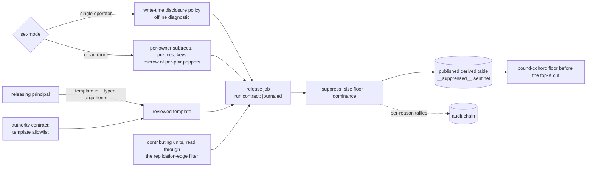
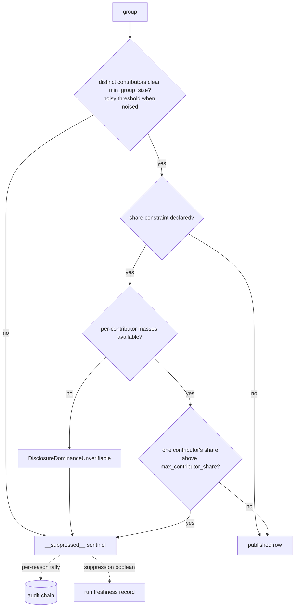
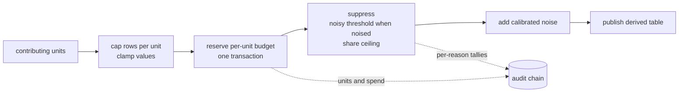

# Aggregate disclosure

A derived result answers a question over many contributors without handing any
contributor's rows to the party asking. This file fixes the setting a result is derived
in, the ordered release, the suppression signal a consumer sees, the reviewed templates a
releasing principal executes, and the line between a per-person table and a cohort table.

A derived result, from the deployment's setting to the published rows:



## set-mode

| Clause | Statement | Why |
| --- | --- | --- |
| `disclosure.set-mode.two-settings` | A deployment declares one setting at project open: single-operator output privacy, where one operator holds every contributor's rows, or a clean room across distinct data owners. The diagnostic, manifest shape and token narrowing follow from it. | |
| `disclosure.set-mode.single-operator` | In the single-operator setting the write-time disclosure policy governs, and a published aggregate carries cohort keys and no subject or tenant identifier column. No per-owner subtree, key, prefix, hashed join or escrow exists. | |
| `disclosure.set-mode.offline-diagnostic` | The single-operator diagnostic reads the manifest and each published model's statement text from local disk and issues 0 requests to the object store. | |
| `disclosure.set-mode.policy-absent` | A published aggregate-shaped model carrying neither a disclosure policy nor a recorded opt-out fails the diagnostic with `DisclosurePolicyAbsent`. | A-disclosure |
| `disclosure.set-mode.model-unreadable` | A published model whose referenced statement text does not read raises `DisclosureModelUnreadable`. | A-disclosure |
| `disclosure.set-mode.warnings` | A table declaring no subject column, and a subject column carrying no row-level rule, each warn and leave the diagnostic passing. | |
| `disclosure.set-mode.aggregate-shape` | A model is aggregate-shaped when its statement, stripped of comments and string literals, holds a grouping clause. A per-model declaration silences that finding and leaves an attached policy governing. | |
| `disclosure.set-mode.clean-room-preconditions` | A cross-owner store carries per-owner signed manifest subtrees, per-owner write prefixes enforced by the object store's access policy, and per-owner signing keys; one missing, checked before any cross-prefix write, raises `DisclosureCleanRoomPreconditionUnmet`. | A-disclosure |
| `disclosure.set-mode.subtree-and-escrow` | A reader verifies its subtree's path to the manifest root before trusting an entry. The escrow carries per-pair peppers, holds no signing material, and sees each owner's files as ciphertext. | A-disclosure |
| `disclosure.set-mode.hashed-join` | Two owners match on a key each hashes at write time under a per-pair pepper re-randomized per join; matched rows leave as an aggregate under a group-size floor. A static pepper raises `DisclosureStaticPepper`. | A-disclosure |

unsettled: How does a pepper rotate when rows already written keep the prior pepper, and at what risk does private set intersection replace the per-pair pepper? owner: disclosure affects: disclosure.set-mode

## release

| Clause | Statement | Why |
| --- | --- | --- |
| `disclosure.release.privacy-unit` | The privacy unit is a tenant or the individual a row is about, never the row, and every release primitive is scoped to the unit. | |
| `disclosure.release.pipeline` | A statistics release runs in order: cap rows per unit and clamp per-row values into a declared range; reserve each unit's budget; suppress groups; add noise calibrated to the bounded sensitivity; publish. | A-disclosure |
| `disclosure.release.budget-reservation` | Before computing, a release reserves each contributing unit's declared per-run spend against its lifetime cap in one catalog transaction. A failed reservation raises `DisclosureUnitBudgetExhausted`, and the release publishes nothing. | A-disclosure |
| `disclosure.release.noisy-threshold` | A release carrying noise decides whether a group appears by a noisy threshold on its bounded distinct-unit count, never by the exact floor or the exact dominance share. | A-disclosure |
| `disclosure.release.guarantee-strength` | A release with contribution capping, suppression and reviewed templates is described as bounded. The differential-privacy description attaches only with a noisy threshold, calibrated noise and a reserved per-unit budget. | A-disclosure |
| `disclosure.release.release-job` | A release runs as one journaled run-path job that reads each unit through the replication-edge filter and applies the cap at read. The raw read lasts that run and belongs to the engine, not a person. | |
| `disclosure.release.provenance` | Each release records, journaled and hash-linked, which units contributed and what each was charged; a unit audits its own inclusion and spend from it. | |
| `disclosure.release.no-central-copy` | Each unit keeps its own write-time redaction and encryption key. A deriving job reads materialized aggregates and embeddings, and no operator holds a decryptable copy of every unit's raw rows. | |
| `disclosure.release.policy` | A model's disclosure policy declares permitted grouping columns, `min_group_size`, the contributor key, `max_contributor_share`, whether a sentinel is emitted, and forbidden columns. It binds unpublished models too, and a breaching cell is never staged. | A-disclosure |
| `disclosure.release.contributor-breakdown` | A governed statement emits one row per group and contributor with that contributor's measures. After suppression the engine sums each numeric measure per group and casts it back to its declared type. | |
| `disclosure.release.published-shape` | Attaching a policy moves no published column: an identical statement and contract yield identical columns and schema fingerprint, governed or not. | |
| `disclosure.release.duplicate-grain` | A non-numeric, non-grain column rides the grouping, and one not constant within its group raises `DisclosureDuplicateGrain`. | A-disclosure |
| `disclosure.release.group-key` | A group key not a subset of the permitted grouping columns raises `DisclosureGroupKeyNotPermitted`. | A-disclosure |
| `disclosure.release.contributor-key` | A governed statement omitting the contributor key raises `DisclosureContributorKeyAbsent`. | A-disclosure |
| `disclosure.release.forbidden-column` | A contract declaring a forbidden column, or a materialization producing one, raises `DisclosureForbiddenColumnPublished`. The check runs after the contributor key leaves the published columns. | A-disclosure |
| `disclosure.release.policy-hash` | Every run records a hash over the declared policy fields, set-valued fields sorted first, on the freshness record and on the append-only build log, which outlives the materialization. | |
| `disclosure.release.template-only` | A releasing principal runs a reviewed template with typed parameters and issues no free-form statement and no scoring pass over the unit set. | A-authority |

unsettled: Does the engine release lookalike segments — identifier, size, coarse composition and an activation handle, never members — and under which audience floor, readback rule and cross-party consent contract? owner: disclosure affects: disclosure.release

unsettled: Does a policy hash sort a grouping allowlist nested inside a sub-table, or only top-level sets? owner: disclosure affects: disclosure.release

## suppress

| Clause | Statement | Why |
| --- | --- | --- |
| `disclosure.suppress.min-group-size` | `min_group_size` counts distinct contributors and is at least 2 subjects. A group under it is suppressed, and a smaller declared value raises `DisclosureMinGroupSizeBelowFloor`. | A-disclosure |
| `disclosure.suppress.contributor-share` | `max_contributor_share` lies above 0 percent and at most 100 percent of a group's sign-insensitive metric mass; a value outside raises `DisclosureShareOutOfRange`. | A-disclosure |
| `disclosure.suppress.dominance` | A group where one contributor's share of the metric mass exceeds `max_contributor_share` is suppressed even after clearing the size floor. | |
| `disclosure.suppress.dominance-unverifiable` | A group under a share constraint whose per-contributor masses are unavailable raises `DisclosureDominanceUnverifiable` and is suppressed. | A-disclosure |
| `disclosure.suppress.empty-policy` | A policy setting neither threshold raises `DisclosurePolicySuppressesNothing`. | A-disclosure |
| `disclosure.suppress.grouping-allowlist` | An empty permitted-grouping list, or a permitted name that is not column-shaped, raises `DisclosureGroupingAllowlistEmpty`. | A-disclosure |
| `disclosure.suppress.sentinel` | Withheld groups collapse into one field-free sentinel under the group key `__suppressed__`, naming no rule and no count. No other marker rides the published rows. | |
| `disclosure.suppress.tally` | Per-reason tallies reach the audit chain alone. The run's freshness record carries one boolean stating that suppression occurred, identical for one group or a thousand. | |

The decision over one group:



## template

| Clause | Statement | Why |
| --- | --- | --- |
| `disclosure.template.call-by-name` | A caller submits a template identifier and arguments by name and writes no statement text. | |
| `disclosure.template.checks` | A template's arguments are checked by {{read.guard.template-binding}}, its relations by {{read.guard.template-relation-shape}}, and its invocation by {{authority.grant.template-not-allowed}} | A-authority |
| `disclosure.template.single-statement` | A declaration holding more than one statement raises `DisclosureTemplateMultiStatement`. | A-authority |
| `disclosure.template.overfetch` | A capped result sets the envelope's truncation flag by reading exactly 1 rows past the effective ceiling. | |
| `disclosure.template.ceiling-advertised` | The projected tool advertises the template's declared ceiling ahead of the first call. | |

## bound-cohort

| Clause | Statement | Why |
| --- | --- | --- |
| `disclosure.bound-cohort.governance` | A table's policy block declares `governance` as one of `per-person` or `cohort`, and a table declaring neither is per-person. | because a floor on every undeclared table binds access, memory and per-person tables alike |
| `disclosure.bound-cohort.cohort-floor` | On a cohort table the table's `min_group_size` applies after candidate generation and before the top-K cut; an under-floor group collapses into the sentinel with no partial figure. | A-disclosure |
| `disclosure.bound-cohort.cohort-widening` | A read recovering an under-floor group by merging it into a coarser key raises `DisclosureCohortWidening`. | A-disclosure |
| `disclosure.bound-cohort.per-individual-row` | Reading a per-individual row from a cohort table without an explicit grant on the reader's token raises `DisclosurePerIndividualUngranted`. | A-disclosure |
| `disclosure.bound-cohort.no-person-measurement` | No release, template or cohort read yields a ranking of people, an aggregate computed over one person, or a count of one person's activity. | A-disclosure |
| `disclosure.bound-cohort.singleton-cohort` | A cohort key whose grain resolves to one person raises `DisclosureSingletonCohort` at declaration, before any row lands under it. | A-disclosure |

## Shapes

A disclosure policy on a governed model:

```toml
[pipeline.models.revenue_by_industry.disclosure]
grouping_allowlist    = ["industry", "region", "quarter"]
contributor_key       = "tenant_id"
min_group_size        = 5
max_contributor_share = 0.4
emit_sentinel         = true
forbidden_columns     = ["tenant_id", "subject_id", "account_email"]
```

The breakdown a governed statement emits, and the rows published from it:

```
-- emitted: one row per (group, contributor)
industry   region  quarter  tenant_id  revenue
retail     emea    2        t-0191     412000
retail     emea    2        t-0044      98000
retail     emea    2        t-0332      61000
logistics  emea    2        t-0044      55000

-- published after suppression and roll-up
industry      region  quarter  revenue
retail        emea    2        571000
__suppressed__
```

The envelope a capped template read returns:

```json
{
  "rows": [{ "quarter": 2, "revenue": 571000 }],
  "truncated": true,
  "row_ceiling": 500,
  "suppression_present": true,
  "disclosure_policy_hash": "sha256:4f1c…"
}
```

The release order:


