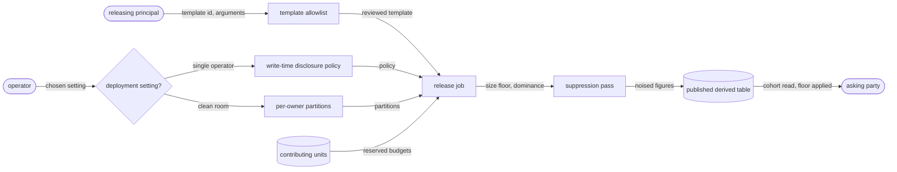
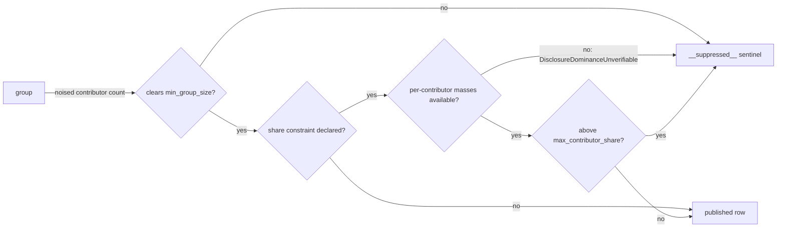

# Aggregate disclosure

A derived result answers a question over many contributors without handing any
contributor's rows to the party asking. This file fixes the setting a result is derived
in, the ordered release, the suppression signal a consumer sees, the reviewed templates a
releasing principal executes, and the line between a per-person table and a cohort table.

A derived result, from the deployment's setting to the published rows:



## set-mode

The two deployment settings a derived result is computed in, the offline diagnostic, and the cross-owner hashed join.

- `check-verb` — `contextful disclosure check --config <path>` diagnoses each published model's disclosure policy and statement from local files and reports every refusal by model name.
  *A-disclosure*
- `offline-diagnostic` — The single-operator diagnostic reads the manifest and each published model's statement text from local disk and issues 0 requests to the object store.
- `policy-absent` — A published aggregate-shaped model carrying neither a disclosure policy nor a recorded opt-out fails the diagnostic with `DisclosurePolicyAbsent`.
  *A-disclosure*
- `model-unreadable` — A published model whose referenced statement text does not read raises `DisclosureModelUnreadable`.
  *A-disclosure*
- `clean-room-preconditions` — A cross-owner store carries per-owner signed manifest subtrees, per-owner write prefixes enforced by the object store's access policy, and per-owner signing keys; one missing, checked before any cross-prefix write, raises `DisclosureCleanRoomPreconditionUnmet`.
  *A-disclosure*
- `hashed-join` — Two owners match on a key each hashes at write time under a per-pair pepper re-randomized per join; matched rows leave as an aggregate under a group-size floor. A static pepper raises `DisclosureStaticPepper`.
  *A-disclosure*
- `pepper-version` — A cross-owner join accepts only rows carrying its pair's current pepper version; rotation re-lands both owners' join keys before the next release.
  *A-disclosure*

## release

The ordered statistics release, the write-time disclosure policy, and the per-unit budget reservation.

- `release-verb` — `contextful disclosure release <model> --project <project>` builds the named model from its declared statement, applies its disclosure policy, and publishes one derived table.
  *A-disclosure*
- `budget-reservation` — Before computing, a release reserves each contributing unit's declared per-run spend against its lifetime cap in one catalog transaction. A failed reservation raises `DisclosureUnitBudgetExhausted`, and the release publishes nothing.
  *A-disclosure*
- `noise-mechanism` — A noised release draws exact two-sided geometric noise scaled to each statistic's sensitivity for distinct-contributor counts and fixed-point sums; the per-run epsilon is divided among released statistics.
  *A-disclosure*
- `metric-bounds` — A noised sum folds each contributor to one value, clips that total to declared finite bounds and rounds it to a positive quantum; absent bounds or quantum raise `DisclosureMetricBoundsAbsent`.
  *A-disclosure*
- `release-envelope` — A release reports its published table, policy hash, reserved per-run spend, suppressed-group presence and row count without carrying a contributor key.
  *A-disclosure*
- `lookalike-refusal` — A release requesting an activation handle or lookalike segment raises `DisclosureLookalikeUnsupported` and publishes nothing.
  *A-disclosure*
- `duplicate-grain` — A non-numeric, non-grain column rides the grouping, and one not constant within its group raises `DisclosureDuplicateGrain`.
  *A-disclosure*
- `group-key` — A group key not a subset of the permitted grouping columns raises `DisclosureGroupKeyNotPermitted`.
  *A-disclosure*
- `contributor-key` — A governed statement omitting the contributor key raises `DisclosureContributorKeyAbsent`.
  *A-disclosure*
- `forbidden-column` — A contract declaring a forbidden column, or a materialization producing one, raises `DisclosureForbiddenColumnPublished`. The check runs after the contributor key leaves the published columns.
  *A-disclosure*

## suppress

The group-size floor, the contributor-share ceiling, and the single signal a withheld group leaves.

- `min-group-size` — `min_group_size` counts distinct contributors and is at least 2 subjects. A group whose noised distinct-contributor count falls under it is suppressed, and a smaller declared value raises `DisclosureMinGroupSizeBelowFloor`.
  *A-disclosure*
- `contributor-share` — `max_contributor_share` lies above 0 percent and at most 100 percent of a group's sign-insensitive metric mass; a value outside raises `DisclosureShareOutOfRange`.
  *A-disclosure*
- `dominance-unverifiable` — A group under a share constraint whose per-contributor masses are unavailable raises `DisclosureDominanceUnverifiable` and is suppressed.
  *A-disclosure*
- `empty-policy` — A policy setting neither threshold, or only a share ceiling at a whole group's mass, raises `DisclosurePolicySuppressesNothing`.
  *A-disclosure*
- `grouping-allowlist` — An empty permitted-grouping list, or a permitted name that is not column-shaped, raises `DisclosureGroupingAllowlistEmpty`.
  *A-disclosure*
- `sentinel-row` — A release with `emit_sentinel = true` represents every suppressed group together as one `__suppressed__` row carrying no group key or exact figure.
  *A-disclosure*

The decision over one group:



## template

Query templates a releasing principal calls by name: the single-statement rule, the checks they pass, and the truncation flag a capped read carries.

- `single-statement` — A declaration holding more than one statement raises `DisclosureTemplateMultiStatement`.
  *A-authority*
- `overfetch` — A capped result sets the envelope's truncation flag by reading exactly 1 rows past the effective ceiling.
- `read-envelope` — A template read returns rows, truncation, row ceiling, suppression presence and the disclosure policy hash; set-valued policy fields follow {{run.publish.disclosure-digest}} at every nesting depth.
  *A-disclosure*

## bound-cohort

The line between a per-person table and a cohort table, and the floor a cohort read carries.

- `cohort-widening` — A read recovering an under-floor group by merging it into a coarser key raises `DisclosureCohortWidening`.
  *A-disclosure*
- `per-individual-row` — Reading a per-individual row from a cohort table without an explicit grant on the reader's token raises `DisclosurePerIndividualUngranted`.
  *A-disclosure*
- `singleton-cohort` — A cohort key whose grain resolves to one person raises `DisclosureSingletonCohort` at declaration, before any row lands under it.
  *A-disclosure*
- `exact-figures` — A policy declaring `figures = "exact"` on a `per-person` table raises `DisclosureExactPerPerson`. `figures` defaults to `"noised"`, and exact figures publish only from a `cohort` table.
  *A-disclosure*

## Shapes

A disclosure policy on a governed model:

```toml
[pipeline.models.revenue_by_industry.disclosure]
grouping_allowlist    = ["industry", "region", "quarter"]
contributor_key       = "tenant_id"
min_group_size        = 5
max_contributor_share = 0.4
emit_sentinel         = true
figures               = "noised"   # the default; "exact" only on a cohort table
forbidden_columns     = ["tenant_id", "subject_id", "account_email"]

[pipeline.models.revenue_by_industry.disclosure.metric_bounds]
revenue = { lower = 0, upper = 1000000, quantum = 1 }
```

The breakdown a governed statement emits, and the rows published from it:

```
-- emitted: one row per (group, contributor)
industry   region  quarter  tenant_id  revenue
retail     emea    2        t-0191     412000
retail     emea    2        t-0044      98000
retail     emea    2        t-0332      61000
logistics  emea    2        t-0044      55000

-- published after noisy partition selection, suppression and roll-up;
-- the figure is noised, not the exact sum 571000
industry      region  quarter  revenue
retail        emea    2        568940
__suppressed__
```

The envelope a capped template read returns:

```json
{
  "rows": [{ "quarter": 2, "revenue": 568940 }],
  "truncated": true,
  "row_ceiling": 500,
  "suppression_present": true,
  "disclosure_policy_hash": "sha256:4f1c…"
}
```
