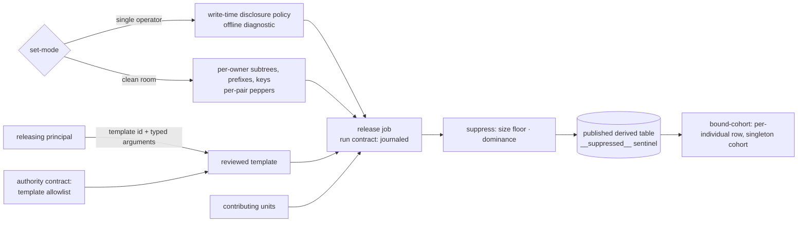
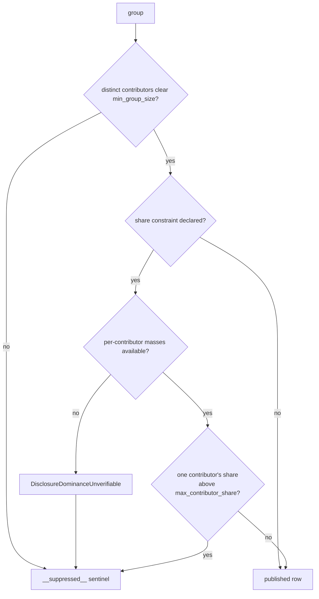

# Aggregate disclosure

A derived result answers a question over many contributors without handing any
contributor's rows to the party asking. This file fixes the setting a result is derived
in, the ordered release, the suppression signal a consumer sees, the reviewed templates a
releasing principal executes, and the line between a per-person table and a cohort table.

A derived result, from the deployment's setting to the published rows:



## set-mode

| Clause | Statement | Why |
| --- | --- | --- |
| `disclosure.set-mode.offline-diagnostic` | The single-operator diagnostic reads the manifest and each published model's statement text from local disk and issues 0 requests to the object store. | |
| `disclosure.set-mode.policy-absent` | A published aggregate-shaped model carrying neither a disclosure policy nor a recorded opt-out fails the diagnostic with `DisclosurePolicyAbsent`. | A-disclosure |
| `disclosure.set-mode.model-unreadable` | A published model whose referenced statement text does not read raises `DisclosureModelUnreadable`. | A-disclosure |
| `disclosure.set-mode.clean-room-preconditions` | A cross-owner store carries per-owner signed manifest subtrees, per-owner write prefixes enforced by the object store's access policy, and per-owner signing keys; one missing, checked before any cross-prefix write, raises `DisclosureCleanRoomPreconditionUnmet`. | A-disclosure |
| `disclosure.set-mode.hashed-join` | Two owners match on a key each hashes at write time under a per-pair pepper re-randomized per join; matched rows leave as an aggregate under a group-size floor. A static pepper raises `DisclosureStaticPepper`. | A-disclosure |

unsettled: How does a pepper rotate when rows already written keep the prior pepper, and at what risk does private set intersection replace the per-pair pepper? owner: disclosure affects: disclosure.set-mode

## release

| Clause | Statement | Why |
| --- | --- | --- |
| `disclosure.release.budget-reservation` | Before computing, a release reserves each contributing unit's declared per-run spend against its lifetime cap in one catalog transaction. A failed reservation raises `DisclosureUnitBudgetExhausted`, and the release publishes nothing. | A-disclosure |
| `disclosure.release.duplicate-grain` | A non-numeric, non-grain column rides the grouping, and one not constant within its group raises `DisclosureDuplicateGrain`. | A-disclosure |
| `disclosure.release.group-key` | A group key not a subset of the permitted grouping columns raises `DisclosureGroupKeyNotPermitted`. | A-disclosure |
| `disclosure.release.contributor-key` | A governed statement omitting the contributor key raises `DisclosureContributorKeyAbsent`. | A-disclosure |
| `disclosure.release.forbidden-column` | A contract declaring a forbidden column, or a materialization producing one, raises `DisclosureForbiddenColumnPublished`. The check runs after the contributor key leaves the published columns. | A-disclosure |

unsettled: Does the engine release lookalike segments — identifier, size, coarse composition and an activation handle, never members — and under which audience floor, readback rule and cross-party consent contract? owner: disclosure affects: disclosure.release

unsettled: Does a policy hash sort a grouping allowlist nested inside a sub-table, or only top-level sets? owner: disclosure affects: disclosure.release

## suppress

| Clause | Statement | Why |
| --- | --- | --- |
| `disclosure.suppress.min-group-size` | `min_group_size` counts distinct contributors and is at least 2 subjects. A group under it is suppressed, and a smaller declared value raises `DisclosureMinGroupSizeBelowFloor`. | A-disclosure |
| `disclosure.suppress.contributor-share` | `max_contributor_share` lies above 0 percent and at most 100 percent of a group's sign-insensitive metric mass; a value outside raises `DisclosureShareOutOfRange`. | A-disclosure |
| `disclosure.suppress.dominance-unverifiable` | A group under a share constraint whose per-contributor masses are unavailable raises `DisclosureDominanceUnverifiable` and is suppressed. | A-disclosure |
| `disclosure.suppress.empty-policy` | A policy setting neither threshold raises `DisclosurePolicySuppressesNothing`. | A-disclosure |
| `disclosure.suppress.grouping-allowlist` | An empty permitted-grouping list, or a permitted name that is not column-shaped, raises `DisclosureGroupingAllowlistEmpty`. | A-disclosure |

The decision over one group:



## template

| Clause | Statement | Why |
| --- | --- | --- |
| `disclosure.template.single-statement` | A declaration holding more than one statement raises `DisclosureTemplateMultiStatement`. | A-authority |
| `disclosure.template.overfetch` | A capped result sets the envelope's truncation flag by reading exactly 1 rows past the effective ceiling. | |

## bound-cohort

| Clause | Statement | Why |
| --- | --- | --- |
| `disclosure.bound-cohort.cohort-widening` | A read recovering an under-floor group by merging it into a coarser key raises `DisclosureCohortWidening`. | A-disclosure |
| `disclosure.bound-cohort.per-individual-row` | Reading a per-individual row from a cohort table without an explicit grant on the reader's token raises `DisclosurePerIndividualUngranted`. | A-disclosure |
| `disclosure.bound-cohort.singleton-cohort` | A cohort key whose grain resolves to one person raises `DisclosureSingletonCohort` at declaration, before any row lands under it. | A-disclosure |

## Shapes

A disclosure policy on a governed model:

```toml
[pipeline.models.revenue_by_industry.disclosure]
grouping_allowlist    = ["industry", "region", "quarter"]
contributor_key       = "tenant_id"
min_group_size        = 5
max_contributor_share = 0.4
emit_sentinel         = true
forbidden_columns     = ["tenant_id", "subject_id", "account_email"]
```

The breakdown a governed statement emits, and the rows published from it:

```
-- emitted: one row per (group, contributor)
industry   region  quarter  tenant_id  revenue
retail     emea    2        t-0191     412000
retail     emea    2        t-0044      98000
retail     emea    2        t-0332      61000
logistics  emea    2        t-0044      55000

-- published after suppression and roll-up
industry      region  quarter  revenue
retail        emea    2        571000
__suppressed__
```

The envelope a capped template read returns:

```json
{
  "rows": [{ "quarter": 2, "revenue": 571000 }],
  "truncated": true,
  "row_ceiling": 500,
  "suppression_present": true,
  "disclosure_policy_hash": "sha256:4f1c…"
}
```
