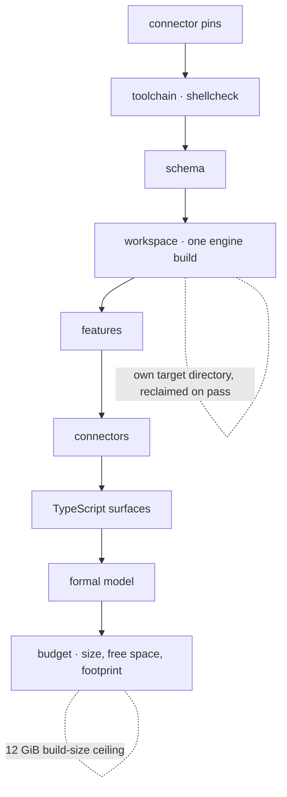
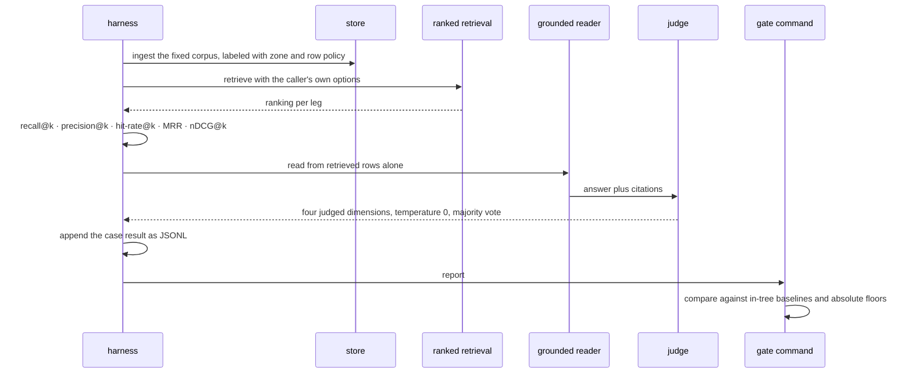
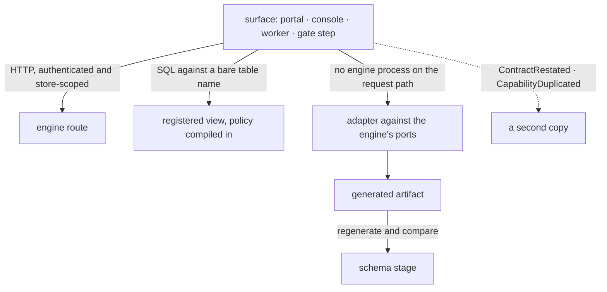

# Engineering conventions, gates and the quality harness

This contract governs how the tree is written, checked and measured. It places every
capability at one address, keeps automation typed, bounds what a container spends, and
defines the harness that turns read-path quality into a red or green verdict.

## Parties

| Party | Obligation |
| --- | --- |
| **The surface author** | Calls the engine for a capability the engine holds, writes an adapter against the engine's ports where no engine process sits on the request path, and gives any derived artifact a staleness check that reds the gate. |
| **The engine** | Holds the control-plane state model, assigns each version, materializes each manifest, and surfaces an explicit failure where a credential or an initialized store is absent. |
| **The automation author** | Expresses a step carrying control flow as a typed subcommand over compiled binaries, keeps that toolchain out of every build profile, and records an operator-held credential in the tree with the surface that consumes it. |
| **The test author** | Constructs the condition an absence assertion names before asserting, validates a guard by firing it both ways, and places a suite in the crate's single integration binary. |
| **The gate** | Runs its stages in a fixed order inside a container with four ceilings, prints the environment and the memory picture after each stage, and reports a failure before propagating its exit code. |
| **The harness** | Exercises the production read path over a fixed corpus, scores a canonical case, appends a result per case, and reaches a model through the operator's configured endpoint. |
| **The judge** | Runs one pinned open-weights instance at a fixed temperature under majority vote, and takes a full re-baseline on a swap. |
| **The golden-set curator** | Keeps ground truth in the tree behind one ingestion door, keeps an answer key out of the store it measures, and passes a generated case through redaction before commit. |

## Operations

| Operation | What it governs |
| --- | --- |
| `structure-tree` | Where a capability lives, what a surface calls, when an adapter stands in for a call, and who owns control-plane state. |
| `automate` | Typed subcommands over compiled binaries, the boundary shell keeps, and the tree's record of an operator credential. |
| `test` | Assertion construction, guard validation, and where a suite compiles and runs. |
| `build` | Target directories, engine-linked invocations, linked query functions, and debug information. |
| `gate` | Stage order, the container's four resources, the disk and footprint steps, and the proof and surface stages. |
| `evaluate` | The read-path quality harness: the case format, the deterministic metrics, the judged dimensions and the reader. |
| `baseline` | Holding a run against committed thresholds, golden custody, case generation, and the rules that hold a gate to its own numbers. |

## Clauses — structure-tree

One capability, one address. A second copy of a capability written against its observable
behavior inherits none of the refusals, audit records and fail-closed defaults that accrued
at the original, and it drifts while its own suite stays green.

| Clause | Statement | decided-by |
| --- | --- | --- |
| `build.structure-tree.invariant.one-home` | Enforcement, control-plane state, credential resolution, statement guarding and visibility each resolve to one implementation inside the engine. A surface reaches one of them by calling the engine route, or by querying the registered view that has the policy compiled into it. | |
| `build.structure-tree.refusal.duplicated-capability` | A surface carrying its own copy of a capability the engine holds raises `CapabilityDuplicated` at review, naming the surface and the engine route that answers the same question. | `0322` |
| `build.structure-tree.workflow.review-questions` | Four questions gate a change adding behavior to a surface: whether the engine performs it; whether the surface restates a policy the registered view compiles in; whether a second state model mirrors an engine-owned one; whether this surface would disagree silently after the engine's behavior moved. A yes on any one returns the change. | |
| `build.structure-tree.invariant.adapter-not-restatement` | A surface genuinely unable to call the engine — a worker holding the sole handle to a storage binding, with no engine process on the request path — implements an adapter against the engine's ports rather than restating the contract. | |
| `build.structure-tree.refusal.mirrored-constant` | A hand-written constant mirroring an engine constant raises `ContractRestated`, naming both sites. | `0323` |
| `build.structure-tree.invariant.derivation-carries-a-check` | Derivation without an enforced staleness check is a copy with extra steps. A generated artifact declares the check that fails once its source moves, and that check runs inside the gate. | |
| `build.structure-tree.invariant.narrow-exemption` | One duplicate stands: a review-time check over committed text mirroring a build-time verb, catching the same mistake at an earlier moment. It states at its own site which verb it mirrors. | |
| `build.structure-tree.invariant.control-plane-state` | The engine holds the control-plane state model — persisted collaborative documents, their validation, immutable version claims, and the pointer to the current version. A surface adapter reaches it through the authenticated, store-scoped API. | |
| `build.structure-tree.workflow.independent-writers` | Two independent owners serialize their edits with object-store conditional replacement, and a loser retries from the document that won rather than from the one it read. | |
| `build.structure-tree.refusal.weak-conditional-backend` | Scoped service mode over a backend lacking strong conditional replacement raises `ConditionalWriteUnsupported` at startup. | `0324` |
| `build.structure-tree.refusal.silent-local-writer` | An absent credential or an uninitialized store raises `ControlStateUnreachable`. A local writer is never substituted for the store-scoped API. | `0324` |
| `build.structure-tree.invariant.version-assignment` | The engine assigns every version and materializes every manifest. No adapter writes control-plane state by another path. | |
| `build.structure-tree.invariant.two-doors` | A surface has two doors onto a capability: the engine route and the registered view. A third path into the same behavior is the shape this operation names. | |
| `build.structure-tree.invariant.second-state-model` | A surface holding its own model of state the engine owns re-derives that state on every read rather than storing a copy, so the engine's version stays the one answer. | |

unsettled: Does a derived artifact prove currency by a schema-hash comparison, by regeneration and diff, or by a build-time export? owner: build affects: build.structure-tree

unsettled: Where does the boundary sit between a surface adapter and a restated contract in a case carrying neither a generated artifact nor a callable route? owner: build affects: build.structure-tree

## Clauses — automate

Automation is code with types, not text with quoting rules. The same entry point serves a
contributor's laptop and a gate container.

| Clause | Statement | decided-by |
| --- | --- | --- |
| `build.automate.invariant.typed-subcommand` | Automation carrying judgment — a gate step, infrastructure provisioning, a deploy, parity tooling, a development script — is a typed subcommand that shells out to compiled binaries. The subcommand parses arguments, branches, retries and handles errors; the heavy work stays in compiled code. | |
| `build.automate.invariant.shell-boundary` | Straight-line glue of a few commands stays shell. A step carrying a branch, a loop, a retry, or running past a few lines becomes a subcommand. | |
| `build.automate.invariant.one-path-two-places` | The gate invokes the subcommand a contributor invokes, so a local reproduction and a gate run execute one code path. | |
| `build.automate.refusal.unchecked-shell` | Shell surviving in the tree passes `shellcheck`, and a file it rejects raises `ShellCheckFailed` in the toolchain stage. | `0325` |
| `build.automate.invariant.toolchain-is-build-time` | The automation toolchain exists at build time and links into no build profile. | |
| `build.automate.interface.subcommand-surface` | A subcommand exposes typed options, generated help and an entry point a test calls directly, so its branches are exercised without a shell around them. | |
| `build.automate.invariant.records-are-committed` | An operator credential for a deployed surface lives as an encrypted entry in a file the tree carries. The decryption keys live outside the tree, so the file diffs and reviews as ordinary text. | |
| `build.automate.invariant.surface-of-consumption` | An entry names the deployed surface consuming the credential, together with the deployed secret name the same value takes there, so one value living in two places reads from a single place. | |
| `build.automate.invariant.platform-only-credential` | A credential existing as a deployed platform secret alone holds no value in the tree, and its entry lands in the change that sets or rotates it. | |

The grants, covered scope, dates and rotation door an entry's comment carries are
[`spec/33-secrets.md` § Clauses — record](33-secrets.md); the engineering obligation here is
that the entry exists in the tree and names where its value is consumed.

## Clauses — test

A test earns its green. The construction below is what separates a passing assertion from
an assertion that cannot fail.

| Clause | Statement | decided-by |
| --- | --- | --- |
| `build.test.invariant.presence-before-absence` | A test whose central claim is an absence carries a presence check ahead of it: construct the condition the test names, verify that condition obtains, then assert over it. | |
| `build.test.refusal.vacuous-exclusion` | An exclusion assertion evaluated over an empty collection raises `VacuousAssertion`. It holds with no evidence behind it, and it keeps holding after the behavior it names breaks. | `0326` |
| `build.test.invariant.able-to-fail` | A test is able to fail on the condition its name states. | |
| `build.test.workflow.guard-fires-both-ways` | A guard is validated by watching it fire: run it against the fixture that motivated it and against the state it stands against, confirming a pass on the first and a failure on the second. | |
| `build.test.invariant.one-integration-binary` | Integration tests for a crate live in one target, `tests/integration/main.rs`, which declares its suites as modules. A suite is selected by module path rather than by target name. | |
| `build.test.limit.binary-link-cost` | A binary compiled from a file directly under `tests/` statically links everything it touches, reaching 290 MiB a copy for a crate that links the bundled SQL engine. | |
| `build.test.shape.feature-gated-suite` | A feature-gated suite carries a module-level `cfg` attribute at the head of its own module file and compiles to nothing while its feature is off. | |
| `build.test.invariant.own-process-is-the-exception` | A test genuinely needing its own process gets a top-level file and states at its site why. Capturing a run's logs through a thread-scoped subscriber is such a case: it passes alone and under single-threaded execution and comes up empty beside siblings, so isolation is that assertion's precondition. | |
| `build.test.invariant.shared-target-is-the-default` | The shared target is the default placement. Suites sharing one process make process-global state contended, and a suite that touches such state declares what it touches. | |

## Clauses — build

Disk is the resource a cargo build spends fastest. Each rule below holds the high-water
mark down rather than the total.

| Clause | Statement | decided-by |
| --- | --- | --- |
| `build.build.invariant.target-dir-per-stage` | Each cargo stage builds into a target directory of its own, reclaimed once that stage passes, which puts peak build size at one stage rather than at the sum of stages. | |
| `build.build.invariant.stages-do-not-share` | Two stages resolving the same crates under different feature unifications re-emit artifacts under a second set of unit hashes rather than reusing the first stage's, so a shared directory buys no reuse. | |
| `build.build.invariant.new-stage-is-cheap` | Adding a stage costs one more directory and no more peak; widening an existing stage raises peak directly. | |
| `build.build.limit.engine-build-dir` | Each cargo invocation that rebuilds the bundled SQL engine spends 2.2 GiB of build directory. | |
| `build.build.limit.engine-library` | Each such invocation emits a 1.1 GiB static library. | |
| `build.build.invariant.one-engine-build-per-run` | The engine-linked packages fold into a single cargo invocation naming all of them and the union of their features, so one gate run compiles the bundled SQL engine once. | |
| `build.build.invariant.union-feature-compilation` | Under that fold, a crate's suites compile against the union rather than in isolation. A defect appearing under one feature combination and not another is reached by staged runs, one command per container, rather than by a second invocation inside one sandbox. | |
| `build.build.invariant.linked-query-functions` | The functions every read needs — columnar file reading and statement serialization — link into each build that links the SQL engine. The read path loads no extension while serving a query. | |
| `build.build.refusal.runtime-extension-load` | Loading an extension into a binary that statically links the SQL engine places two copies of a type's runtime type information in one process, the extension's at hidden visibility, so no cast between them succeeds and the process aborts. A read path reaching for one raises `ExtensionAutoloadRefused`. The check catching the mismatch compiles out on Apple platforms, where the same undefined behavior stays silent. | `0327` |
| `build.build.limit.query-function-link-cost` | Linking those functions adds 55 MiB to each engine-linked binary. | |
| `build.build.shape.debug-info` | Development and test profiles carry line-tables-only debug information, so a panic backtrace keeps its file and line without full debug data on every dependency. Stepping through a dependency takes a one-off full-debug build. | |

## Clauses — gate

The gate is a sequence of named stages inside one container. Its resources are finite and
its diagnostics print whether or not a stage passes.

| Clause | Statement | decided-by |
| --- | --- | --- |
| `build.gate.workflow.gate-stage-sequence` | The gate runs ordered stages: connector pins, toolchain, schema, workspace, features, connectors, TypeScript surfaces, formal model, budget. Each stage prints the environment it leaves behind. | |
| `build.gate.invariant.failing-stage-reports-first` | A failing stage emits its diagnostics before propagating its own exit code, so a red run carries context rather than a bare status. | |
| `build.gate.workflow.stage-subset` | A subset of stages is selectable by name, so one stage reproduces locally without the stages ahead of it. | |
| `build.gate.workflow.pins-stage` | The first stage resolves every pinned artifact identity a run depends on, ahead of any compilation, so an unresolvable pin costs no build time. | |
| `build.gate.workflow.schema-stage` | The schema stage regenerates each derived artifact into a scratch location and compares it byte for byte against the committed copy, which is where a staleness check lands. | |
| `build.gate.invariant.four-ceilings` | The container carries four ceilings — processor count, memory, usable disk, and a per-stage wall clock — and a run dies on any one of them. | |
| `build.gate.limit.container-memory` | The container holds 12 GiB of memory. | |
| `build.gate.limit.container-disk` | The container holds 18 GiB of usable disk. | |
| `build.gate.invariant.processor-ceiling` | Processor count is the one ceiling nothing inside the container relieves. More capacity arrives as more containers, which is a change on the dispatching side. | |
| `build.gate.limit.parallel-job-memory` | Parallel build jobs derive from the memory ceiling at 3 GiB per job. | |
| `build.gate.invariant.memory-is-a-number` | Disk exhaustion names itself. Memory exhaustion is silent and resurfaces as a link error, a killed container, or nothing at all, so every stage prints its memory limit, its peak and its event counts, and a kill reads as a number in the log rather than as a hypothesis. | |
| `build.gate.limit.stage-free-disk` | A stage begins work with 2 GiB of free disk available to it. | |
| `build.gate.refusal.free-disk-precondition` | A stage starting below that floor raises `BuildDiskPrecondition` and exits 28 before doing work. | `0328` |
| `build.gate.limit.build-size-ceiling` | The budget stage holds total build size to 12 GiB, printing that size, the free space remaining and the largest artifacts on every run, so a near miss reads from the log without a local reproduction. | |
| `build.gate.refusal.build-size-exceeded` | Build size past that ceiling raises `BuildSizeCeilingExceeded`, naming the artifacts at the head of the list. | `0328` |
| `build.gate.workflow.footprint` | Per change and per profile, the footprint step builds for the static-linked Linux target, compresses the artifact, holds its byte size at or under that profile's declared budget, and holds its dynamic dependency set to the platform C library. The read-replica profile additionally holds a function-class cold-start bound. | |
| `build.gate.refusal.footprint-over-budget` | An artifact over its profile's budget, or carrying a dynamic dependency beyond the platform C library, raises `FootprintBudgetExceeded` and names the profile. | `0329` |
| `build.gate.limit.residency-soak` | A soak holds the resident set on the seventh day within 5 percent of the first day's. | |
| `build.gate.refusal.formal-hole` | The proof stage type-checks the formal package and raises `ProofHolePresent` ahead of the build, naming the declaration that carries the hole. A hole is a fact about the source rather than a fact about the run, and successful elaboration is no evidence a theorem is proved. | `0330` |
| `build.gate.workflow.typescript-surfaces` | The TypeScript surfaces — the shared component package, the deploy emitter, the consoles, the headless client and the shared infrastructure module — run typecheck, unit tests and their framework build in one stage of their own, so a change to a shared component reds review rather than surfacing at deploy. | |
| `build.gate.invariant.optional-by-presence` | Each surface's checks are optional by presence: a surface declaring no script for a given check is skipped rather than failing the stage. | |
| `build.gate.refusal.surface-check-failed` | A surface whose typecheck, unit tests or framework build fails raises `SurfaceCheckFailed`, naming the surface and the script. | `0331` |

The theorem inventory this stage type-checks, and the audit over the axioms an elaborated
proof reaches, are [`spec/60-formal.md` § Clauses — audit-axioms](60-formal.md); the gate
contributes the placement, ahead of the build.

The per-profile compressed and resident budgets the footprint step holds an artifact to are
[`spec/01-topology.md` § Clauses — package](01-topology.md); a budget change lands there and
the step reads it.

The corpus checks — addressing, registration, reference and generated-tree equality — run
beside these stages and are [`spec/00-corpus.md` § Parties](00-corpus.md); a corpus failure
reds the same run a compile failure does.

## Clauses — evaluate

The harness measures the read path by using it. Everything below runs over a fixed corpus
against the surfaces a caller reaches.

| Clause | Statement | decided-by |
| --- | --- | --- |
| `build.evaluate.invariant.real-read-path` | An evaluation run is ingest, index, retrieve, read, judge, plus a scoring pass, each stage exercising the same surfaces a caller exercises. The harness adds no storage primitive and no runtime primitive of its own. | |
| `build.evaluate.invariant.corpus-loads-through-the-store` | The corpus loads through the real store rather than a fixture database, and the retriever under test calls the production ranked-retrieval surface with the options a caller passes. A harness retriever issuing an unordered full scan cannot go red when the ranked path goes wrong. | |
| `build.evaluate.shape.case-format` | A case carries an id, a corpus reference, a question, and an expected block holding answer, artifacts, edges, entities, must-cite, must-abstain and a time anchor, plus its tags. | |
| `build.evaluate.invariant.converter-not-scoring-path` | Every benchmark and every application's ground truth converts once into that one format, and the runner sees nothing else. A new source arrives as a new converter. | |
| `build.evaluate.invariant.deterministic-tier-calls-no-model` | Recall@k, precision@k, hit-rate@k, reciprocal rank and nDCG@k gate at near-zero cost with no model call. Each is reported per leg — lexical, vector, hybrid — and per slice, so a regression attributes to a leg rather than to the reader. | |
| `build.evaluate.invariant.distinct-top-k` | Membership in the top k is distinct, so a repeated id counts once. | |
| `build.evaluate.invariant.absent-truth-is-nan` | All five ranked metrics are undefined where no relevant set exists and answer NaN there, and a NaN drops out of an aggregate, so a case holding no retrieval truth cannot deflate a mean. An empty ranking against a non-empty relevant set is a real failure and scores zero. | |
| `build.evaluate.invariant.rank-metrics-miss-noise` | Recall and nDCG say nothing about wrong rows arriving, and a surface answering with exactly the requested count scores alike whether two of its rows matched or none did. The four metrics below close that gap. | |
| `build.evaluate.limit.forbidden-row-rate` | A row named in a must-not-retrieve set holds at 0 percent of a regression case's returned rows. | |
| `build.evaluate.limit.duplicate-row-rate` | A repeated table-and-row-key pair holds at 0 percent, measured over the ranking rather than over its intersection with the truth set. | |
| `build.evaluate.limit.in-window-rate` | A case declaring a recency bound holds an in-window rate at or above 95 percent. | |
| `build.evaluate.invariant.abstention-returns-nothing` | A must-abstain case returns zero rows. | |
| `build.evaluate.limit.precision-floor` | Precision@k holds at or above 60 percent. | |
| `build.evaluate.invariant.truth-is-scored-per-surface` | Expected artifacts score the artifact retriever and expected edges score a second retriever over the edge table, each against its own truth set and each reported apart from the other. | |
| `build.evaluate.invariant.unscored-tally` | Edge truth with no edge surface configured is skipped and counted under an unscored tally of its own rather than folded into the artifact figures. | |
| `build.evaluate.interface.judged-dimensions` | The reading stage adds four judged dimensions: answer accuracy; abstention, carrying correct-refusal rate on out-of-corpus questions beside hallucination-on-unknown rate; citation faithfulness, which fails a plausible answer pointing at an unrelated row and catches the case where retrieval was perfect and the synthesized answer was wrong; and temporal correctness, whose ground truth is the bitemporal columns on facts and edges. | |
| `build.evaluate.interface.grounded-reader` | The harness supplies its own reader: a loop answering from retrieved rows alone. The deterministic tier substitutes a stub reader, so the ranked metrics run with no model call whatsoever. | |
| `build.evaluate.interface.judge` | The judge is a judge-agnostic interface holding a pinned open-weights instruct instance, run at temperature 0 with a majority vote behind a dead band. A judge swap is an explicit full re-baseline. | |
| `build.evaluate.shape.systems-metrics` | Tokens per query, latency and cost travel beside the quality figures, bucketed by corpus size in tokens relative to the reader's context window rather than by a fixed item count, so the crossover between whole-context reading and retrieval is measured per model. | |
| `build.evaluate.invariant.per-case-checkpoint` | A run appends its per-case results as JSONL, so a crash inside the judged tier re-runs the in-flight case rather than the suite. | |
| `build.evaluate.shape.run-report` | A run's report carries one field per metric the gate reads, the sample count standing behind each mean, the run block describing the configuration, the per-slice breakdown, and the tally of cases left unscored. | |
| `build.evaluate.invariant.corpus-carries-policy-labels` | An evaluation corpus carries zone and row-policy labels, so a run exercises the access-control path rather than stepping around it, and an over-restrictive policy surfaces as a recall regression. | |
| `build.evaluate.refusal.unlabeled-corpus` | An unlabeled corpus meets the fail-closed default and reads empty, driving recall to zero. The harness raises `EvalCorpusUnlabeled` rather than reporting that zero as a quality figure; a label, or an explicit local zone, is the precondition for a run that answers anything. | `0332` |

The judge and the grounded reader reach a model through the endpoint an operator configures,
which is [`spec/32-connector.md` § Clauses — infer](32-connector.md); the harness holds no
credential of its own.

The surfaces a case exercises are the retrieval tools in
[`spec/20-read.md` § Clauses — retrieve](20-read.md); a case is written against those calls
and against no harness-local stand-in.

unsettled: What majority-vote sample count and dead-band width hold a judged dimension steady across two runs of one configuration? owner: build affects: build.evaluate

## Clauses — baseline

A gate is a comparison against committed numbers plus absolute floors. What follows keeps
the comparison truthful and keeps the answer key out of the corpus.

| Clause | Statement | decided-by |
| --- | --- | --- |
| `build.baseline.shape.baseline-file` | A baseline file carries a reserved run block — `{k, tier, model, samples}` — and one entry per gated metric. An entry is a bare number gated at the run's dead band, or an object overriding the band for that metric alone. | |
| `build.baseline.limit.default-dead-band` | A rate-valued entry with no override gates at a 2 percent dead band. | |
| `build.baseline.limit.rank-quality-dead-band` | The ranked-quality entry gates at a 3 percent dead band against its committed value. | |
| `build.baseline.invariant.bands-carry-their-units` | A band is expressed in its metric's own units, so a duration entry carries a duration band. A count entry is pinned at zero and takes no band. | |
| `build.baseline.shape.metric-path` | A baseline names a metric by the report's own field path: `retrieval.<modality>.<metric>`, `edge_retrieval.<modality>.<metric>`, `judge.<dimension>`, `slices.<tag>.<metric>`, `latency_ms`, `n_cases`. A renamed report field therefore surfaces as a refusal rather than as a gate that quietly stopped measuring. | |
| `build.baseline.invariant.sample-count-suffix` | Every mean-valued path takes a `.n` suffix naming the sample count behind it. A case count is the golden file's line count while a mean runs over a NaN-filtered subset, so blanking one case's truth lifts the mean without moving the case count. | |
| `build.baseline.refusal.unresolvable-path` | A path resolving to nothing, a metric measured over an empty sample, a malformed entry, or a non-finite dead band raises `BaselinePathUnresolved` and fails the command. | `0333` |
| `build.baseline.refusal.run-stamp-drift` | A run block differing from the run's own configuration raises `BaselineRunStampMismatch`. Recall@k is monotone non-decreasing in k, and a rule-based judge fills the accuracy field a model judge fills, so two such runs are not comparable. | `0333` |
| `build.baseline.invariant.refuse-before-the-suite` | Everything checkable without the report is refused ahead of the suite, so a typo in a baseline costs nothing in the judged tier. | |
| `build.baseline.workflow.raise-is-one-directional` | A baseline update moves each improved entry to its measured value and moves no entry in the worse direction, and it runs after every gate including the absolute floors passed. | |
| `build.baseline.invariant.update-adds-no-path` | The update introduces no path. A new gate is a hand edit. Seeding an absent file writes the headline set and normalizes the file on that first write. | |
| `build.baseline.invariant.gate-runs-offline` | The gate is a local command comparing the run's report against in-tree baselines and against absolute floors, reporting both verdicts, and it runs with or without a trace store reachable. | |
| `build.baseline.invariant.floors-are-absolute` | An absolute floor gates independently of any committed value, so editing a baseline moves no floor and a run below a floor goes red whatever its history says. | |
| `build.baseline.invariant.trace-store-is-a-recorder` | A trace store holds run history, progression, slice drill-down and curation staging. It offers no score-threshold mechanism and decides no verdict. | |
| `build.baseline.refusal.answer-key-in-the-corpus` | A golden set ingested into the store it measures raises `GoldenSetIngested`. Two guards hold it: a manifest lint rejecting an artifact path that normalizes under the evaluation directory, and a connector-side refusal of those same normalized paths, which is the stronger guard over third-party content. The engine's native set lives outside every ingestion root. | `0334` |
| `build.baseline.invariant.golden-custody` | Version-controlled JSONL in the tree is canonical, and one loader is the single ingestion door. A labeling queue or a hosted dataset is a staging area that syncs back into the tree, never a second source of truth. | |
| `build.baseline.workflow.curation-is-one-directional` | A reviewer's edit reaches the gate through a change to the tree. A periodic drift check between a staging dataset and the tree belongs to the operator running that staging area. | |
| `build.baseline.refusal.raw-production-text` | A golden mined from a live query or promoted from a labeled outcome passes the store's write-time redaction and zone policy before commit, defaulting to redacted or referenced-by-id. The conversion step is fail-closed and raises `GoldenRedactionFailed` where it cannot redact. | `0335` |
| `build.baseline.invariant.promotion-source` | Only an adjudicated outcome label promotes into a golden set. A self-rated row is excluded, so the store's own confidence cannot enter its ground truth wearing full provenance. | |
| `build.baseline.workflow.three-generators` | Three generators bootstrap a golden set from the deployment's own store: walking entities through facts into edges to produce candidate questions, composing edge chains into multi-hop questions, and fabricating questions about entities absent from the corpus to produce an abstention split. Their output is a candidate set routed through human approval before commit. | |
| `build.baseline.invariant.gate-inputs-stay-held-out` | Retrieval and synthesis are tuned on no gate input, and a gate set stays held out of every tuning loop. | |
| `build.baseline.invariant.native-set-rotates` | The native set rotates on a cadence, so a visible in-tree gate cannot be memorized. A sample of its truth is reviewed on each rotation. | |
| `build.baseline.invariant.rotation-pins-a-stamp` | Rotation makes runs incomparable across generations unless the run stamp is pinned, and a comparison across two generations resolves through that stamp. | |
| `build.baseline.invariant.sampling-is-logged` | Whatever a run sampled or dropped is logged, so a partial run does not read as full coverage. | |
| `build.baseline.invariant.intervals-are-reported` | A confidence interval is reported alongside each judged figure, over enough samples that a two-point delta carries meaning. | |
| `build.baseline.invariant.native-benchmark-is-the-gate` | A native benchmark generated from a real corpus — exercising synthesis, entity resolution and the hybrid path end to end — is the red or green gate. Public benchmark sets run beside it as strictly held-out comparability and decide nothing. | |
| `build.baseline.refusal.hosted-trace-export` | An evaluation or observation run touching a deployed store exports its traces to a self-hosted collector inside the operator's own perimeter, and a hosted endpoint configured against such a store raises `TraceExportOutOfPerimeter`. Hosted collection reaches a run whose store is built from public or synthetic fixtures alone. | `0336` |
| `build.baseline.invariant.export-hygiene` | The collector endpoint is named per environment, so one variable flip cannot redirect a deployed store's traffic. Spans pass the redaction pass ahead of export, and their retention follows the store's zone policy rather than the collection tool's default. | |

The redaction and zone policy a generated case passes before it is committed are
[`spec/41-enforcement.md` § Clauses — redact](41-enforcement.md); the harness runs the
store's own pass rather than a second one written for goldens.

unsettled: Which public benchmark corpora are admissible gate inputs under restrictive research and non-commercial licensing — fetched under the dataset's terms, transformed into a synthetic subset, or pinned by a content-hashed fetch manifest? owner: build affects: build.baseline

unsettled: Does a single-user local golden-review affordance belong on the engine command line, or in the team surface alone? owner: build affects: build.baseline

## Shapes

The gate's stages, in order, with the resource each one spends:



An evaluation run, from corpus to verdict:



Where a surface reaches a capability:



A baseline file:

```json
{
  "_run": { "k": 10, "tier": "judged", "model": "pinned-open-weights", "samples": 3 },
  "retrieval.hybrid.recall_at_k": 0.71,
  "retrieval.hybrid.recall_at_k.n": 184,
  "retrieval.hybrid.ndcg_at_k": { "value": 0.63, "band": 0.03 },
  "retrieval.hybrid.ndcg_at_k.n": 184,
  "retrieval.lexical.precision_at_k": 0.66,
  "retrieval.lexical.precision_at_k.n": 184,
  "edge_retrieval.hybrid.recall_at_k": 0.58,
  "edge_retrieval.hybrid.recall_at_k.n": 92,
  "judge.citation_faithfulness": 0.82,
  "judge.citation_faithfulness.n": 184,
  "judge.abstention": 0.90,
  "judge.abstention.n": 40,
  "slices.multi_hop.recall_at_k": 0.49,
  "slices.multi_hop.recall_at_k.n": 61,
  "latency_ms": { "value": 480, "band": 60 },
  "n_cases": 184
}
```

A canonical case:

```json
{
  "id": "edge-chain-0117",
  "corpus": "native/2026-r3",
  "question": "Which supplier does the northern plant share with the coastal plant?",
  "expected": {
    "answer": "Meridian Castings",
    "artifacts": [["supplier_notes", "b7f1c2"], ["plant_registry", "0a44de"]],
    "edges": [["plant:north", "supplied_by", "supplier:meridian"]],
    "entities": ["supplier:meridian"],
    "must_cite": ["supplier_notes"],
    "must_abstain": false,
    "time_anchor": "2026-03-01"
  },
  "tags": ["multi_hop", "entity_resolution"]
}
```

Where the tree's build-time material sits:

```
tools/
  ci/                     typed subcommands the gate invokes
  spec/                   the corpus checker
evals/
  cases/                  version-controlled JSONL, one canonical case per line
  baselines/              one file per gated configuration
  generators/             graph walk, edge chain, absent-entity
  converters/             one per external ground-truth source
crates/<name>/
  tests/
    integration/
      main.rs             the crate's one integration binary
      <suite>.rs          a module, selected by path
    <isolated>.rs         its own process, with a comment saying why
```

## Unsettled

unsettled: Does the residency soak run on the same cadence as the footprint step, or on a slower one whose drift window the budget stage names? owner: build affects: build.gate

unsettled: What ordering holds when a stage subset selected for local reproduction omits a stage a later stage reads output from? owner: build affects: build.gate

unsettled: Does a suite that contends process-global state declare that state in its module, or acquire a named lock the integration binary owns? owner: build affects: build.test
