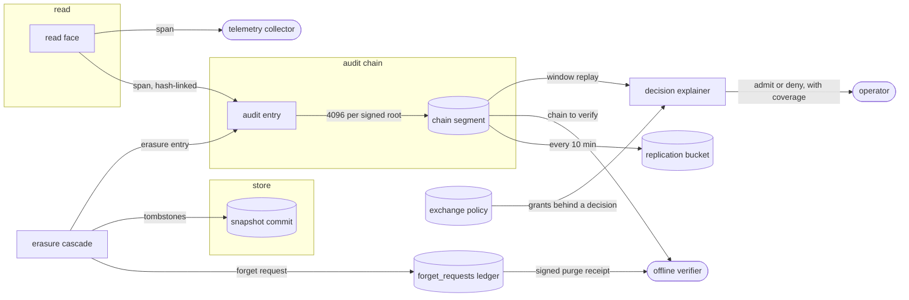
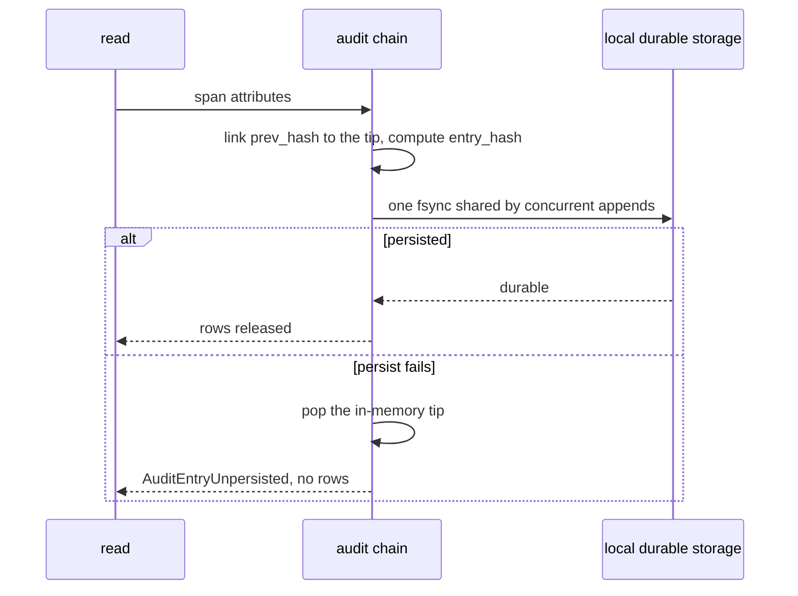
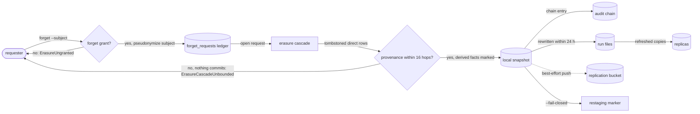
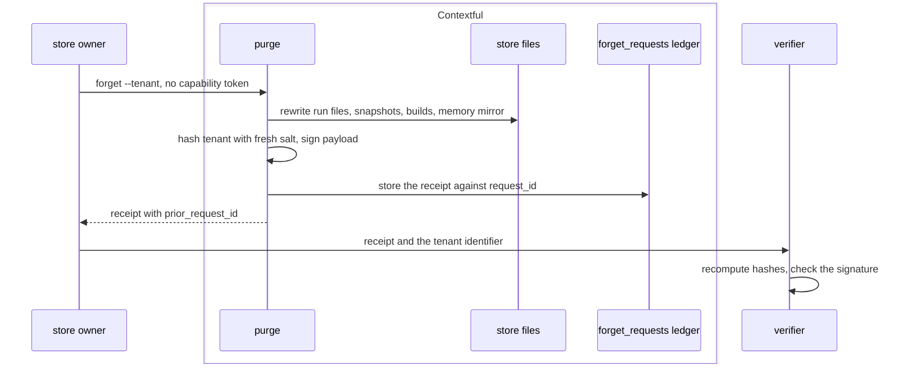
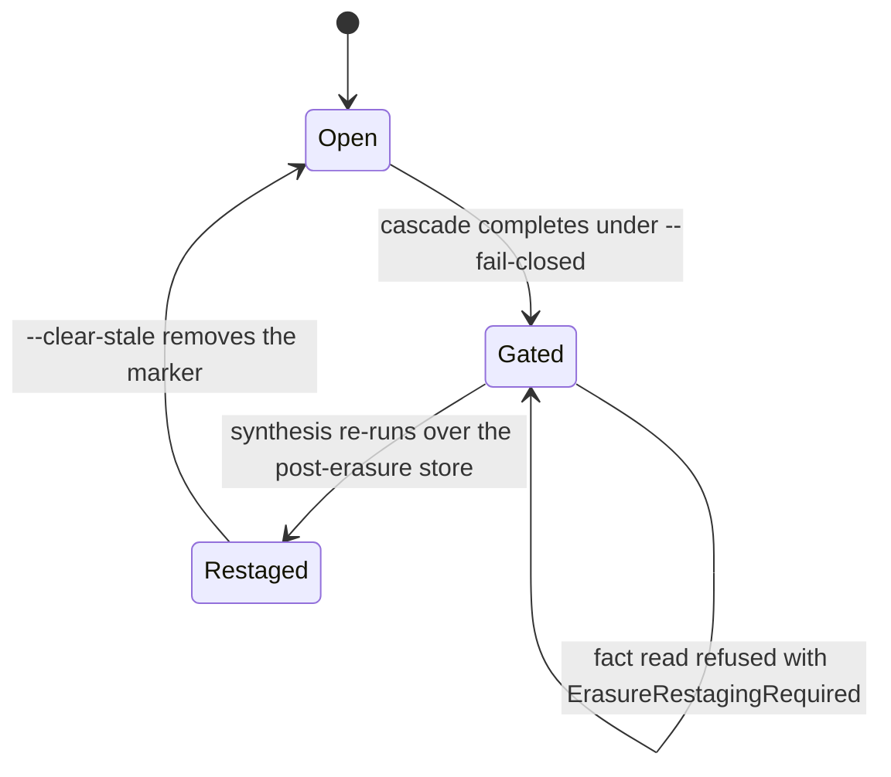

# Audit, erasure and the receipt

`record` is what a read leaves behind. `explain` answers why a person does or does not
reach a resource. `attest` turns the record into evidence a third party checks offline.
`erase` removes a subject or a tenant from the store, and `receipt` is the signed artifact a
tenant purge hands back. Every digest over a low-entropy identifier here is keyed or salted,
and the result is pseudonymous.

The chain, what appends to it, and what reads it back:



## record

What a read leaves behind: the span, the hash-linked audit entry, where telemetry lands, and the key custody a log opens under.

- `segment` — Entries append to a numbered segment file in ascending `seq`, and a segment closes under one signed root once it holds its chain header's segment size, 4096 entries by default.
- `chain-header` — `header.json`, written before a new chain's first entry, fixes the chain's format, its digest, `sha256` or `blake3`, and a segment size of at most 65536 entries; the first v1 entry's `prev_hash` is the canonical header's digest.
  *A-disclosure*
- `header-unsupported` — Opening or verifying a chain whose header names another format or digest, a segment size outside {{disclosure.record.chain-header}}, or any field beyond `format`, `digest` and `segment_entries` raises `AuditHeaderUnsupported`.
  *because a verifier guessing at a digest it does not implement checks nothing*
- `entry-format` — A v1 entry carries `format: 1`, and its `entry_hash` is the chain header's digest over the RFC 8785 canonical JSON of the entry's `format`, `seq`, `prev_hash` and `attributes`.
  *A-disclosure*
- `entry-fields` — Verifying a chain holding an entry with any field beyond `format`, `seq`, `prev_hash`, `attributes` and `entry_hash` raises {{disclosure.attest.broken-chain}} at that entry.
  *because the entry digest covers only `format`, `seq`, `prev_hash` and `attributes`, so without this an injected field verifies clean*
- `inexact-integer` — Appending a v1 entry whose attributes hold an integer beyond ±(2^53 − 1) raises `AuditAttributeInexact` and appends nothing; verifying a chain holding such an entry raises {{disclosure.attest.broken-chain}}.
  *because RFC 8785 writes every number as an IEEE 754 double, so integers past 2^53 share a digest and an edit between two of them verifies*
- `v0-chain` — A chain holding entries without `header.json` is a v0 chain: it verifies and appends under v0 rules, each entry digest over `seq`, `prev_hash` and attributes and each root its segment's last entry digest.
  *A-disclosure*
- `group-commit` — Concurrent appends form one append group, which issues 1 sync of its segment file between segment opens; every member returns after that sync, or every member raises {{disclosure.record.unpersisted-entry}}.
  *A-disclosure*
- `segment-open` — An append group that creates a segment file adds 1 sync of the segments directory.
  *A-disclosure*
- `tip-signing` — The signed tip writes at segment close, once the log sees no append for 1 s, and at export; an append group closing no segment writes no tip.
  *A-disclosure*
- `unpersisted-entry` — A read whose entry fails to reach local durable storage raises `AuditEntryUnpersisted` and returns no rows.
  *A-disclosure*
- `unpersisted-wire` — The read face answers {{disclosure.record.unpersisted-entry}} in-band as wire code `audit_entry_unpersisted`, HTTP `503`, with no `rows` in the result.
  *because a storage fault is the server's and passes, so a client retries it rather than rewording the read*
- `read-entry` — Each read tool call the face answers with a result, over stdio or HTTP, appends one entry, and the result leaves only after that entry's append group syncs; `initialize`, `ping` and `tools/list` append none.
  *A-disclosure*
- `read-attributes` — A read's entry carries `contextful.tool`, `contextful.credential`, `contextful.subject.<member>` and `contextful.subject.attestation.<member>` per present subject member, `contextful.result.rows`, `contextful.read.at`, `contextful.read.outcome` and `contextful.tables`, the relations the read names.
  *because the chain answers who read how much under which credential, and the attestation keeps an asserted member from reading as identity*
- `read-chain` — `contextful serve`, `contextful mcp` and {{read.reference.call}} open `.contextful/audit/` before answering; without an explicit startup signing port they use unanchored custody. A chain that does not open stops the process before any row reads.
  *A-disclosure*
- `read-signer` — An explicit startup read signing port matches independently configured current public pins before opening and before each append; missing, wrong or retired signing authority refuses held-chain reads through {{disclosure.record.unpersisted-entry}} without inferring keys from requests or receipts.
  *A-disclosure*
- `single-writer` — One append group holds a directory's audit log at a time: it takes `audit.lock`, links after the chain end, syncs, then releases the lock, so several processes append to one linear chain.
  *A-disclosure*
- `audit-key` — Explicit erasure resolves one independently random, durable 32-byte project audit key at `.contextful/audit.key`; concurrent creation preserves one key. Malformed, substituted or unreadable key files follow {{disclosure.erase.recovery}}; Unix creation excludes group and other permissions.
  *A-disclosure*
- `audit-key-loss` — A published erasure frontier with no persisted project audit key follows {{disclosure.erase.recovery}} before key creation; erasure never regenerates a lost pseudonym key.
  *A-disclosure*
- `foreign-tail` — An append group finding the last segment file changed since its handle's last write reads that segment's last entry before linking, and issues no sync beyond {{disclosure.record.group-commit}}.
  *A-disclosure*
- `read-only` — A read-only audit handle verifies the chain without the writer lock; an append through it raises `AuditLogReadOnly`.
  *A-disclosure*
- `unanchored-over-signed` — An unanchored handle links entries under an unsigned tip and writes no root; opening one over a signed tip, a signed root or the signed `chain.held` a held open writes raises `AuditLogAnchored`.
  *A-disclosure*
- `held-under-append` — An unanchored handle's append group or tip write finding `chain.held` written since its open raises {{disclosure.record.unanchored-over-signed}} and writes nothing, so a held open never meets an unsigned tip or an unrooted segment.
  *because the lock is held per append group, so a held open can land between two groups of a running unanchored handle*
- `unsigned-tip` — A held open or signed check over a chain carrying no `chain.held` or signed root, whose tip is unsigned, raises `AuditLogUnanchored`; anchoring through the signing port signs that chain's missing roots and its tip.
  *A-disclosure*
- `reads-view` — `audit query` runs one statement over `audit_reads`, one row per table a read entry names — `read_at`, `on_behalf_of`, `agent`, `table_name`, `policy`, `outcome`, `row_count` — computed from the chain's segments on each call.
  *A-disclosure*
- `erasures-view` — `audit query` exposes `audit_erasures` from canonical erasure entries: `transaction_id`, `subject_hash`, `affected_counts` and `executed_at`; the projection retains no state and exposes no selector or row payload.
  *A-disclosure*
- `refused-read` — A read enforcement refuses appends one entry with `outcome` `refused`, naming the relations the guard parsed, and releases no rows.
  *A-disclosure*
- `projection` — The projection answers which agent read which table under which policy across a rolling 24 h window, within 1 s.

One read's entry under group commit:



## explain

The access decision and its path, replay over a window with its coverage, and the audience report.

- `decision` — `audit explain --table <t> --subject <principal>` answers `admit` when a grant the exchange policy issues for the `--role` names, else its `default_grants`, carries `read` over a pattern covering the table, and `deny` otherwise.
  *A-disclosure*
- `path` — A decision's path names the role or default set, the covering grant, then each step the table declares in {{authority.compose.relation-order}}; a deny's path ends at {{authority.filter-rows.default-deny}}.
  *A-disclosure*
- `replay` — `--window <from>..<to>` replays each chain entry naming the subject and the table whose read instant falls in the window: its seq, instant, outcome, agent and recorded `contextful.*` attributes.
  *A-disclosure*
- `coverage` — An explanation carries a coverage block: segments and entries verified, entries carrying no read instant, window spans the chain does not reach, and each visibility binding's source with its sweep watermark.
  *A-disclosure*
- `audience` — `audit explain --audience <t>` lists by name the roles whose grants read the table, whether `default_grants` do, and per `on_behalf_of` scheme the count of principals and served reads.
  *A-disclosure*
- `no-row` — An explanation returning a row, field value or excerpt from the resource it decides about, a replayed `contextful.result.*` attribute beyond `contextful.result.rows` included, raises `VisibilityDiagnosticRow`.
  *P2*
- `empty-window` — A window holding no observations raises `VisibilityNoObservations` and states that no claim is available.
  *P2*
- `unqualified-assurance` — A negative assurance answer emitted without its coverage block raises `VisibilityUnqualifiedAssurance`.
  *P2*
- `groups-not-members` — A reader-facing explanation rendering the member identities of a group on the path raises `VisibilityIndividualNamed`.
  *P2*

## attest

Chain verification, signed segment roots, lineage attestations, and the reach of each guarantee.

- `broken-chain` — A disagreeing digest, entry format or Merkle root, a sequence gap, a failing signature, or, beside `chain.tip`, `chain.held` or a signed root, an absent chain or a missing or unsigned tip raises `AuditChainBroken` at the earliest failing index.
  *A-disclosure*
- `merkle-root` — A v1 segment root is the RFC 6962 Merkle tree hash, under the header's digest, over the segment's raw entry digests in `seq` order.
  *A-disclosure*
- `root-tag` — A v1 signed root carries its signing algorithm, `Ed25519` or `ES256`, and signs it with the header digest, segment number, entry count and root.
  *A-disclosure*
- `inclusion-proof` — `prove` returns one entry, its chain header, its RFC 6962 audit path and its segment's signed root; the proof verifies offline under the signer's public key alone.
  *A-disclosure*
- `proof-invalid` — A proof whose entry, audit path, header, root or root signature disagrees raises `AuditProofInvalid`.
  *A-disclosure*
- `proof-unavailable` — Proving an entry of a v0 chain, of a segment carrying no signed root, or outside the chain raises `AuditProofUnavailable`.
  *because an open segment has no signed root yet, and a v0 root commits to no tree*
- `root-replication` — `audit anchor` once it signs, and a held chain's replicator at start and every 10 min, copy each signed root the `[sync]` bucket lacks to `<prefix>/<project>/audit/roots/<segment>.json`; a failed copy waits for the next and fails no anchor, append or read.
  *A-disclosure*
- `replica-verify` — `audit verify --bucket` also holds the chain to each replicated root: a root failing its signature, closing a segment the chain does not reach, or absent or different locally breaks the chain as {{disclosure.attest.broken-chain}} does.
  *because deleting the roots, `chain.held` and the tip's signature leaves a chain no local check tells from an unanchored one*
- `replicate-verb` — `audit replicate` copies the roots {{disclosure.attest.root-replication}} copies, once, and prints the segments it sent.
- `lineage-elision` — A lineage attestation counts a claim's evidence references into tables the caller's session does not register as `withheld` in the `contextful.recall` block, and names no such table.
  *A-disclosure*
- `verify-verb` — `audit verify` opens the chain read-only and prints its end when every check of {{disclosure.attest.broken-chain}} passes, each signature included under `--public-key`.
- `anchor-verb` — `audit anchor --issuer-key <seed>` signs the chain's missing roots and its tip as {{disclosure.record.unsigned-tip}} anchors them, and prints the chain end.
- `prove-verb` — `audit prove --seq <n>` prints the proof {{disclosure.attest.inclusion-proof}} returns, and `audit check-proof` verifies one under a public key, reading no store.
- `owner-only` — An audit verb reading a chain, presented with a capability credential, raises `AuditRequiresOwner` before it reads an audit file.
  *because the chain names every person's reads, and a credential scoped to some tables reaches no record of others*

## erase

The one erasure verb: subject tombstones, the bounded provenance cascade, the restaging gate, and the tenant rewrite.

- `privilege` — Erasure sits outside the default grant set, and a caller without the forget grant raises `ErasureUngranted`.
  *A-read*
- `unsupported-scope` — An empty target set or erasure admitted only by narrowed grants raises `ErasureScopeUnsupported` before store access; supported erasure admits every requested table explicitly.
  *because ignoring a grant constraint widens destructive authority*
- `subject-column` — A table names its subject column as `subject_id = "<column>"` under `[[pipeline.tables]]`. A subject erasure against a table without one raises `ErasureSubjectUndeclared`, naming the table.
  *A-disclosure*
- `key-set` — A key-set request binds its selectors to the declared keys of {{store.declare.erasure-metadata}} and carries an opaque subject hash instead of a raw subject identity.
  *A-disclosure*
- `atomic-publication` — Subject and key-set erasure select one committed frontier across every affected table; a failed transaction exposes none of its staged replacements.
  *A-disclosure*
- `reader-frontier` — Query, file, retrieval and cache responses resolve one erasure frontier and revalidate it before releasing bytes; an obsolete frontier releases no rows or files.
  *A-disclosure*
- `shared-references` — A shared digest survives while any surviving declared reference names it; erasure collects a digest only after its last surviving reference disappears.
  *A-disclosure*
- `surviving-citations` — A citing table carrying the survival declaration of {{store.declare.erasure-metadata}} retains its rows; its references resolve through {{read.reference.erased-verdict}}.
  *A-disclosure*
- `subject-pseudonym` — Subject erasure computes its subject hash as a domain-separated HMAC-SHA-256 under the configured project audit key; no transaction or audit artifact carries raw subject identities or erased key values.
  *A-disclosure*
- `signer-binding` — Erasure signs through the configured issuer or node's {{authority.issue.signing-port}}; readers verify the canonical audit chain under configured public-key pins, independently of transaction artifacts. Missing signing or verifier configuration follows {{disclosure.erase.recovery}}.
  *A-disclosure*
- `row-free-audit` — The signed audit chain binds the committed transaction, {{disclosure.erase.subject-pseudonym}} and affected counts to the exact replacement-file inventory.
  *A-disclosure*
- `store-binding` — The signed erasure entry binds {{store.init.store-identity}}; readers reject a frontier whose signed store identity differs from the receiving store, following {{disclosure.erase.recovery}}.
  *A-disclosure*
- `working-publication` — Erasure preserves an immutable signed survivor baseline and selects independent working copies under the ordinary table layout; normal append and fold advance working publication without changing the baseline or requiring another erasure signature.
  *A-disclosure*
- `recovery` — Recovery completes collection for a committed frontier and discards uncommitted replacements; an incomplete or disagreeing transaction record raises `ErasureTransactionIncomplete` before releasing store content.
  *A-disclosure*
- `recovery-verb` — `context erase --recover --project <project>` resumes {{disclosure.erase.recovery}} under {{disclosure.erase.privilege}} and {{authority.verify.effect-boundary}} before collection; selectors and signing ports are absent.
  *A-disclosure*
- `unsigned-recovery` — Uncommitted staging origins resolve against canonical stored tables and require Forget over the complete store scope; signed-only recovery admits the complete authenticated frontier. Uncommitted recovery returns no transaction identity.
  *A-disclosure*
- `retirement-inventory` — Signed retirement inventories bind regular paths through domain-separated HMAC under {{disclosure.record.audit-key}} and their file digests; recovery admits missing files as completed collection, validates all remaining files before deletion, and rejects changes through {{disclosure.erase.recovery}}.
  *A-disclosure*
- `canonical-audit-key` — Erasure and keyed retirement recovery require the persisted canonical {{disclosure.record.audit-key}}; caller-supplied keys equal it, and absent or mismatched keys follow {{disclosure.erase.recovery}} before content access, signed intent, staging or collection.
  *A-disclosure*
- `survivor-names` — Erasure survivor snapshots use row-independent part names, preserve admitted surviving rows, record rewritten part key versions, and rebuild declared indexes through {{store.index.vector-by-fold}} and {{store.index.fulltext-by-fold}}.
  *A-disclosure*
- `cascade` — In the same operation the cascade invalidates every derived fact whose provenance reaches the subject key or a tombstoned identifier within 16 hops.
  *A-disclosure*
- `cascade-unbounded` — A provenance chain deeper than the cascade bound raises `ErasureCascadeUnbounded`, and the erasure commits nothing.
  *A-disclosure*
- `physical-removal` — Every file holding an erased row, a superseded snapshot still inside {{store.fold.retention}} included, is rewritten or collected within 24 h of the erasure's commit.
  *A-disclosure*
- `restaging-gate` — `--fail-closed` writes a row-free `{subject_hash, executed_at}` marker at the store root after the cascade. While it stands, every fact read raises `ErasureRestagingRequired`, naming the owed re-synthesis and the clearing verb.
  *A-disclosure*
- `tenant-column-type` — A tenant column of a non-string type raises `PurgeTenantColumnType`.
  *A-disclosure*
- `tenant-undeclared` — A purge finding no model declaring an outermost partition key raises `PurgeTenantUndeclared`.
  *A-disclosure*
- `owner-only` — A purge presented with a capability token raises `PurgeRequiresOwner`, evaluated before anything reveals store contents.
  *A-disclosure*

A subject erasure:



unsettled: Is request-to-last-replica erasure within 72 h an engine bound or an operator objective, given the engine schedules no replica refresh? owner: disclosure affects: disclosure.erase

unsettled: Does the free-form statement face fall under the restaging gate as a fact read does? owner: disclosure affects: disclosure.erase

## receipt

The signed artifact a tenant purge returns: its claim, its coverage block, its pseudonym and its idempotence.

- `pseudonym` — `tenant_hash` is SHA-256 over a random per-receipt `salt` and the tenant identifier. A receipt carrying the identifier in cleartext raises `ReceiptIdentifierLeak` before signing.
  *A-disclosure*
- `widened-claim` — A coverage block naming a scope broader than its `receipt_version` declares raises `ReceiptClaimWidened`.
  *A-disclosure*
- `replayed` — Returning the byte-identical earlier artifact in place of a freshly signed one raises `ReceiptReplayed`.
  *A-disclosure*
- `no-rewrite-engine` — A purge where the columnar rewrite engine is unavailable raises `ReceiptWithoutRewrite` and signs nothing.
  *because a receipt over a rewrite that did not run states a false claim*

A tenant purge, its receipt, and an offline check of it:



unsettled: Does the replication bucket fall inside the receipt claim once the object interface gains a delete? owner: disclosure affects: disclosure.receipt

## Shapes

The audit segment and the ledger:

```
.contextful/
  audit/
    header.json             {format, digest, segment_entries}; absent on a v0 chain
    segments/
      000001.jsonl          one entry per line, seq ascending
      000001.root.json      the signed Merkle root closing the segment
    chain.tip               last accepted {seq, entry_hash}
    chain.held              signed {seq, entry_hash} where the issuer first held the log
    audit.lock              held by the one append group writing
  forget/
    <subject_hash>.stale    {subject_hash, executed_at}
  catalog.db
    forget_requests         request_id, tenant_hash, subject_hash,
                            requested_at, completed_at
```

A chain header:

```json
{ "format": 1, "digest": "sha256", "segment_entries": 4096 }
```

One v1 entry, its `prev_hash` the header's digest:

```json
{
  "format": 1,
  "seq": 1,
  "prev_hash": "sha256:a36fc99c...",
  "attributes": {
    "contextful.query.hash": "hmac-sha256:9f2c...",
    "contextful.subject.on_behalf_of": "user://ada",
    "contextful.subject.attestation.on_behalf_of": "verified",
    "contextful.tables": ["orders", "customers"],
    "contextful.row.phi_columns_returned": 0,
    "contextful.result.rows": 42
  },
  "entry_hash": "sha256:1b7e..."
}
```

A v1 root, and an inclusion proof of one entry:

```json
{
  "format": 1,
  "alg": "Ed25519",
  "header": "sha256:a36fc99c...",
  "segment": 1,
  "root": "sha256:a4f0...",
  "count": 4096,
  "signature": "9e41..."
}
```

```json
{ "header": { "format": 1, "digest": "sha256", "segment_entries": 4096 },
  "entry": { "format": 1, "seq": 1, "...": "..." },
  "path": ["3f9c...", "..."],
  "root": { "format": 1, "segment": 1, "...": "..." } }
```

A purge receipt:

```json
{
  "receipt_version": 1,
  "coverage": {
    "claim": "rewrite-and-exclude",
    "includes": ["run-files", "snapshots", "model-builds", "memory-mirror"],
    "excludes": ["replication-bucket", "replicas", "physical-destruction"]
  },
  "salt": "b64:Qm9n...",
  "tenant_hash": "sha256:4d1a...",
  "request_id": "prg_01HQ8F3K2M",
  "completed_at": "<rfc3339-utc>",
  "tables": [{ "name": "orders", "rows_removed": 118422, "files_rewritten": 37, "builds_rewritten": ["bld_7a21"] }],
  "cascade": [{ "name": "memory_facts", "rows_removed": 903 }],
  "prior_request_id": null,
  "signature": { "payload_hash": "sha256:c0ff...", "signature": "3045a1...", "public_key": "ed25519:9a7d..." }
}
```

The restaging gate:


