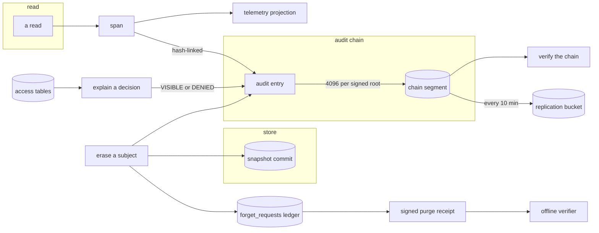
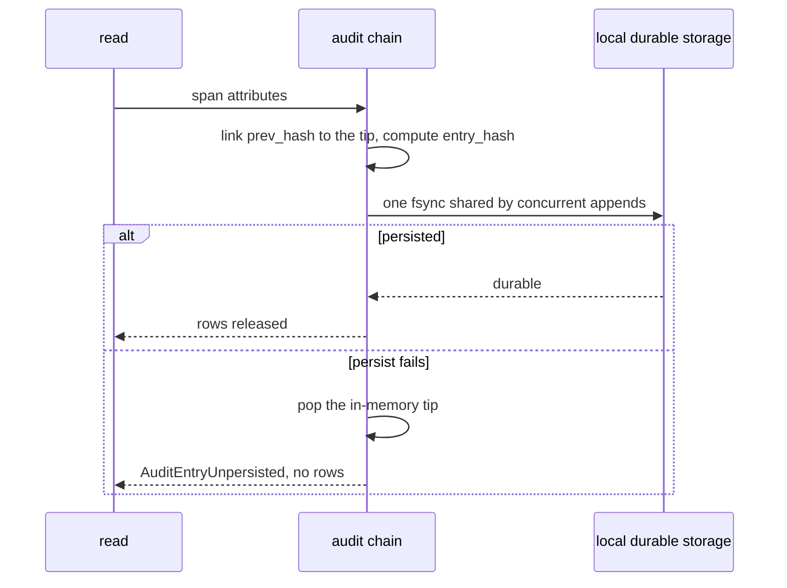
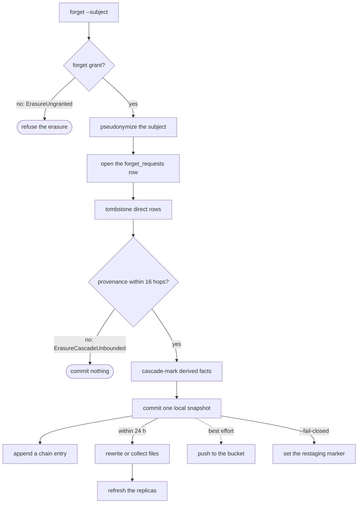
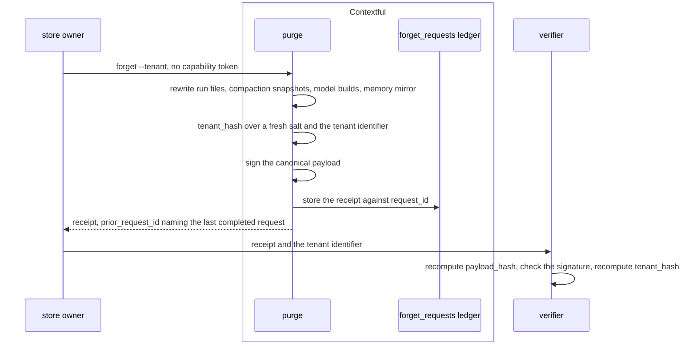
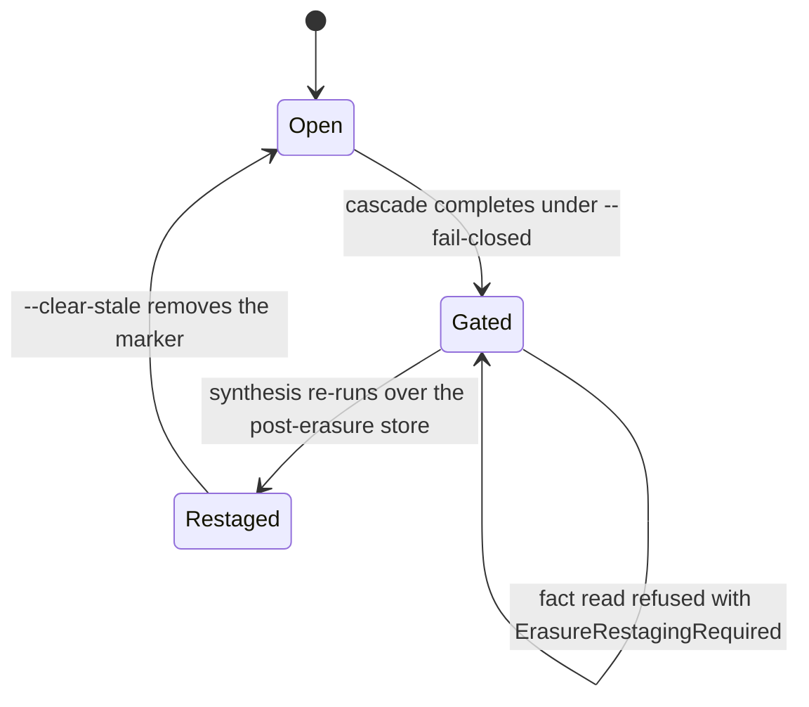

# Audit, erasure and the receipt

`record` is what a read leaves behind. `explain` answers why a person does or does not
reach a resource. `attest` turns the record into evidence a third party checks offline.
`erase` removes a subject or a tenant from the store, and `receipt` is the signed artifact a
tenant purge hands back. Every digest over a low-entropy identifier here is keyed or salted,
and the result is pseudonymous.

The chain, what appends to it, and what reads it back:



## record

What a read leaves behind: the span, the hash-linked audit entry, and where telemetry lands.

- `segment` — Entries append to a numbered segment file in ascending `seq`, and a segment closes at 4096 entries under one signed root.
- `unpersisted-entry` — A read whose entry fails to reach local durable storage raises `AuditEntryUnpersisted` and returns no rows.
  *A-disclosure*
- `projection` — The projection answers which agent read which table under which policy across a rolling 24 h window, within 1 s.

One read's entry under group commit:



unsettled: What append throughput does group commit sustain on the reference target, and at what read rate does the chain become the read path's bottleneck? owner: disclosure affects: disclosure.record

unsettled: Does a read refused by enforcement append an entry, and what does that entry carry about the relations the caller named? owner: disclosure affects: disclosure.record

## explain

The access decision and its path, replay over a window with its coverage, and the audience report.

- `no-row` — An explanation returning a row, field value or excerpt from the resource it decides about raises `VisibilityDiagnosticRow`.
  *P2*
- `empty-window` — A window holding no observations raises `VisibilityNoObservations` and states that no claim is available.
  *P2*
- `unqualified-assurance` — A negative assurance answer emitted without its coverage block raises `VisibilityUnqualifiedAssurance`.
  *P2*
- `groups-not-members` — A reader-facing explanation rendering the member identities of a group on the path raises `VisibilityIndividualNamed`.
  *P2*

## attest

Chain verification, signed segment roots, lineage attestations, and the reach of each guarantee.

- `broken-chain` — A disagreeing digest, a sequence gap, or an absent chain while `chain.tip` or a signed root exists raises `AuditChainBroken` with the index of the earliest failure.
  *A-disclosure*
- `root-replication` — Signed roots reach the replication bucket asynchronously every 10 min.

unsettled: Does a lineage attestation over evidence spanning a withheld table name that table or elide it? owner: disclosure affects: disclosure.attest

## erase

The one erasure verb: subject tombstones, the bounded provenance cascade, the restaging gate, and the tenant rewrite.

- `privilege` — Erasure sits outside the default grant set, and a caller without the forget grant raises `ErasureUngranted`.
  *A-read*
- `subject-column` — A table names its subject column as `subject_id = "<column>"` under `[[pipeline.tables]]`. A subject erasure against a table without one raises `ErasureSubjectUndeclared`, naming the table.
  *A-disclosure*
- `cascade` — In the same operation the cascade invalidates every derived fact whose provenance reaches the subject key or a tombstoned identifier within 16 hops.
  *A-disclosure*
- `cascade-unbounded` — A provenance chain deeper than the cascade bound raises `ErasureCascadeUnbounded`, and the erasure commits nothing.
  *A-disclosure*
- `physical-removal` — Every file holding an erased row, a superseded snapshot still inside {{store.fold.retention}} included, is rewritten or collected within 24 h of the erasure's commit.
  *A-disclosure*
- `restaging-gate` — `--fail-closed` writes a row-free `{subject_hash, executed_at}` marker at the store root after the cascade. While it stands, every fact read raises `ErasureRestagingRequired`, naming the owed re-synthesis and the clearing verb.
  *A-disclosure*
- `tenant-column-type` — A tenant column of a non-string type raises `PurgeTenantColumnType`.
  *A-disclosure*
- `tenant-undeclared` — A purge finding no model declaring an outermost partition key raises `PurgeTenantUndeclared`.
  *A-disclosure*
- `owner-only` — A purge presented with a capability token raises `PurgeRequiresOwner`, evaluated before anything reveals store contents.
  *A-disclosure*

A subject erasure:



unsettled: Is request-to-last-replica erasure within 72 h an engine bound or an operator objective, given the engine schedules no replica refresh? owner: disclosure affects: disclosure.erase

unsettled: Does the free-form statement face fall under the restaging gate as a fact read does? owner: disclosure affects: disclosure.erase

## receipt

The signed artifact a tenant purge returns: its claim, its coverage block, its pseudonym and its idempotence.

- `pseudonym` — `tenant_hash` is SHA-256 over a random per-receipt `salt` and the tenant identifier. A receipt carrying the identifier in cleartext raises `ReceiptIdentifierLeak` before signing.
  *A-disclosure*
- `widened-claim` — A coverage block naming a scope broader than its `receipt_version` declares raises `ReceiptClaimWidened`.
  *A-disclosure*
- `replayed` — Returning the byte-identical earlier artifact in place of a freshly signed one raises `ReceiptReplayed`.
  *A-disclosure*
- `no-rewrite-engine` — A purge where the columnar rewrite engine is unavailable raises `ReceiptWithoutRewrite` and signs nothing.
  *because a receipt over a rewrite that did not run states a false claim*

A tenant purge, its receipt, and an offline check of it:



unsettled: Does the replication bucket fall inside the receipt claim once the object interface gains a delete? owner: disclosure affects: disclosure.receipt

## Shapes

The audit segment and the ledger:

```
.contextful/
  audit/
    segments/
      000001.jsonl          one entry per line, seq ascending
      000001.root.json      {root, count, signature} closing the segment
    chain.tip               last accepted {seq, entry_hash}
  forget/
    <subject_hash>.stale    {subject_hash, executed_at}
  catalog.db
    forget_requests         request_id, tenant_hash, subject_hash,
                            requested_at, completed_at
```

One entry:

```json
{
  "seq": 1,
  "prev_hash": "sha256:0000000000000000000000000000000000000000000000000000000000000000",
  "attributes": {
    "contextful.query.hash": "hmac-sha256:9f2c...",
    "contextful.subject.on_behalf_of": "user://ada",
    "contextful.subject.attestation.on_behalf_of": "verified",
    "contextful.tables": ["orders", "customers"],
    "contextful.row.phi_columns_returned": 0,
    "contextful.result.rows": 42
  },
  "entry_hash": "sha256:1b7e..."
}
```

A purge receipt:

```json
{
  "receipt_version": 1,
  "coverage": {
    "claim": "rewrite-and-exclude",
    "includes": ["run-files", "snapshots", "model-builds", "memory-mirror"],
    "excludes": ["replication-bucket", "replicas", "physical-destruction"]
  },
  "salt": "b64:Qm9n...",
  "tenant_hash": "sha256:4d1a...",
  "request_id": "prg_01HQ8F3K2M",
  "completed_at": "<rfc3339-utc>",
  "tables": [{ "name": "orders", "rows_removed": 118422, "files_rewritten": 37, "builds_rewritten": ["bld_7a21"] }],
  "cascade": [{ "name": "memory_facts", "rows_removed": 903 }],
  "prior_request_id": null,
  "signature": { "payload_hash": "sha256:c0ff...", "signature": "3045a1...", "public_key": "ed25519:9a7d..." }
}
```

The restaging gate:


