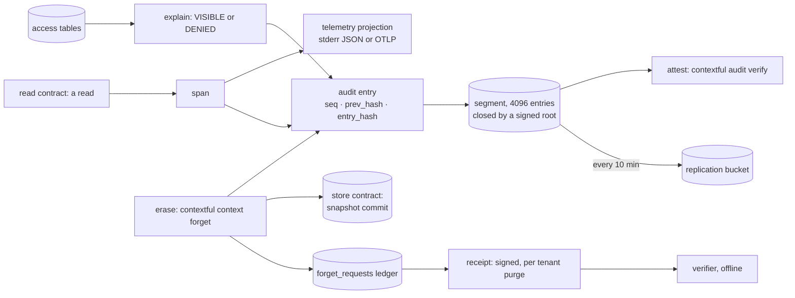
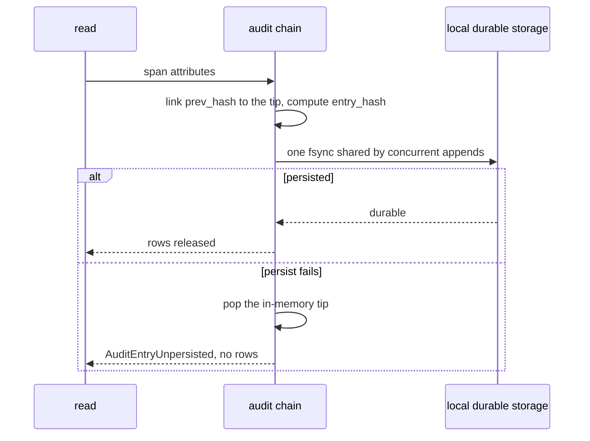
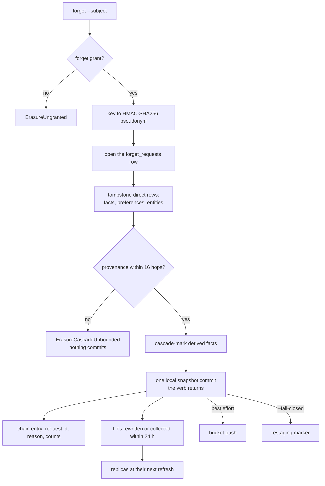
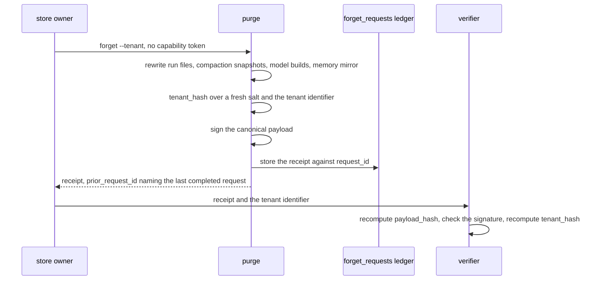
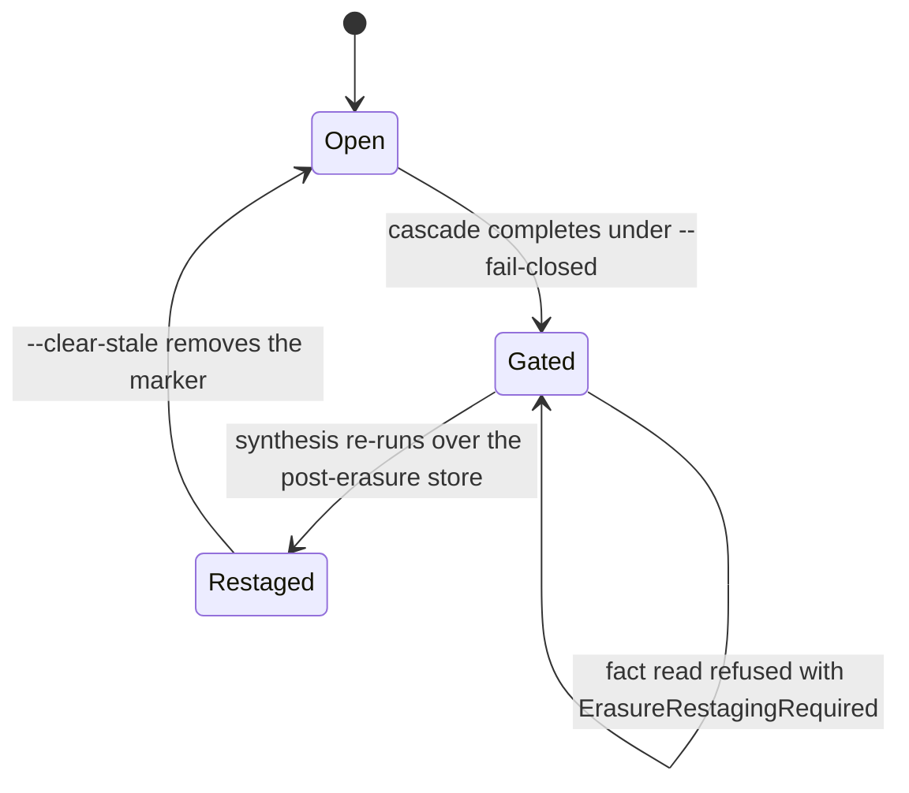

# Audit, erasure and the receipt

`record` is what a read leaves behind. `explain` answers why a person does or does not
reach a resource. `attest` turns the record into evidence a third party checks offline.
`erase` removes a subject or a tenant from the store, and `receipt` is the signed artifact a
tenant purge hands back. Every digest over a low-entropy identifier here is keyed or salted,
and the result is pseudonymous.

The chain, what appends to it, and what reads it back:



## record

| Clause | Statement | Why |
| --- | --- | --- |
| `disclosure.record.span` | Each read emits a span with the subject tuple and attestation labels, token identifier and issue time, query digest, tables touched, row rules and masks applied, zone counters, and row, byte and suppressed-group counts. | |
| `disclosure.record.entry` | An audit entry is one JSON line carrying `seq`, `prev_hash`, the span's attributes, and `entry_hash`, the SHA-256 over those three. One read produces one span and one entry. | A-disclosure |
| `disclosure.record.attribute-namespace` | Every attribute key sits under `contextful.subject.*`, `contextful.query.*`, `contextful.row.*`, `contextful.result.*` or `contextful.erasure.*`. | |
| `disclosure.record.query-digest` | `contextful.query.hash` is HMAC-SHA256 under the project audit key over the statement after registration and rewriting, plus its resolved relations. No statement text and no literal reaches the chain. | A-disclosure |
| `disclosure.record.bound-read-fields` | A read of a bound table records fidelity level, grain, lag, degraded flag, closure depth walked and whether a federated leg ran; a read returning health-tagged columns records `contextful.row.phi_columns_returned`. | |
| `disclosure.record.segment` | Entries append to a numbered segment file in ascending `seq`, and a segment closes at 4096 entries under one signed root. | |
| `disclosure.record.genesis` | The genesis entry's `prev_hash` is `sha256:` followed by sixty-four zeros, and genesis is written only at project init. | A-disclosure |
| `disclosure.record.tip-continuity` | Startup loads the persisted chain and links fresh entries onto its tail. An absent chain beside a `chain.tip` or a signed root is {{disclosure.attest.broken-chain}}. | A-disclosure |
| `disclosure.record.group-commit` | Concurrent appends share one fsync, and a read returns rows only after the fsync covering its entry. A failed persist pops the in-memory tip, so process and disk agree on the last `seq`. | |
| `disclosure.record.unpersisted-entry` | A read whose entry fails to reach local durable storage raises `AuditEntryUnpersisted` and returns no rows. | A-disclosure |
| `disclosure.record.two-surfaces` | Telemetry is the queryable projection an operator searches; the chain is the attestable record. An unreachable sink leaves the chain growing, and spans dropped at a collector leave entries intact. | A-disclosure |
| `disclosure.record.projection` | The projection answers which agent read which table under which policy across a rolling 24 h window, within 1 s. | |
| `disclosure.record.telemetry-sink` | Traces and logs default to line-delimited JSON on stderr, and stdout carries only query tables and protocol framing. With an endpoint configured, an OTLP collector receives them over HTTP with protobuf. | |
| `disclosure.record.telemetry-config` | The telemetry environment is the endpoint, collector headers as `k=v` pairs, a service name and resource attributes. Filtering applies to both sinks, and exporters flush and shut down on every process return. | |
| `disclosure.record.index-build-span` | An index build emits `contextful.index.*` spans carrying rows indexed, builder duration and embedding request count. | |
| `disclosure.record.update-check` | An update check is opt-in through `[update] check = true`, fetches a release manifest, and transmits nothing about the deployment. | |

One read's entry under group commit:



unsettled: What append throughput does group commit sustain on the reference target, and at what read rate does the chain become the read path's bottleneck? owner: disclosure affects: disclosure.record

unsettled: Does a read refused by enforcement append an entry, and what does that entry carry about the relations the caller named? owner: disclosure affects: disclosure.record

## explain

| Clause | Statement | Why |
| --- | --- | --- |
| `disclosure.explain.decision` | `contextful audit explain --subject <s> --resource <r>` returns `VISIBLE` or `DENIED` with its path: principals and link methods, the closure walked with depths, the observed class, grant paths, and the watermark with lag and `CURRENT` or `STALE`. | |
| `disclosure.explain.no-row` | An explanation returning a row, field value or excerpt from the resource it decides about raises `VisibilityDiagnosticRow`. | P2 |
| `disclosure.explain.never-observed` | A resource with no observation prints `NEVER OBSERVED` in place of a denial. A source with no completed full run prints that its reads refuse under every budget. | P2 |
| `disclosure.explain.denial-cause` | A denial beside a live grant path names what overrode it: a tombstone in force with its `revoked_at`, or an observation of the unknown class. | |
| `disclosure.explain.window` | With `--window`, explain evaluates the decision at every recorded observation inside it, then prints observation count, run count, widest interval and intervals over budget above `VISIBLE AT SOME OBSERVED POINT` or `NOT VISIBLE AT ANY OBSERVED POINT`. | |
| `disclosure.explain.empty-window` | A window holding no observations raises `VisibilityNoObservations` and states that no claim is available. | P2 |
| `disclosure.explain.unqualified-assurance` | A negative assurance answer emitted without its coverage block raises `VisibilityUnqualifiedAssurance`. | P2 |
| `disclosure.explain.groups-not-members` | A reader-facing explanation rendering the member identities of a group on the path raises `VisibilityIndividualNamed`. | P2 |
| `disclosure.explain.private-delivery` | An explanation reaches the person who asked and no audience, and appends its own chain entry. | |
| `disclosure.explain.audience-report` | The audience report inverts the reachable-set function of {{disclosure.reach.resolution-order}} and lists resources whose subject count exceeds a threshold the query takes and prints beside its rows. | |
| `disclosure.explain.report-matches-verdict` | A subject the audience report counts for a resource is exactly a subject explain rates `VISIBLE` for that resource. | |
| `disclosure.explain.report-only` | The engine narrows reads and reports audiences; it repairs no sharing inside a source. | |

## attest

| Clause | Statement | Why |
| --- | --- | --- |
| `disclosure.attest.verify` | `contextful audit verify` walks the persisted chain checking each entry's `seq`, `prev_hash` link and recomputed `entry_hash`, and exits non-zero naming the first failing index. | |
| `disclosure.attest.broken-chain` | A disagreeing digest, a sequence gap, or an absent chain while `chain.tip` or a signed root exists raises `AuditChainBroken` with the index of the earliest failure. | A-disclosure |
| `disclosure.attest.partial-history` | A chain whose earliest segments are absent while the rest verify against their signed roots reports the lowest `seq` held and checks forward from it. | |
| `disclosure.attest.signed-root` | A signed root is `{root, count, signature}` over the tip hash of the segment it closes, carrying no algorithm field; the pinned public key's scheme, Ed25519 or ES256, decides verification. | |
| `disclosure.attest.root-replication` | Signed roots reach the replication bucket asynchronously every 10 min. | |
| `disclosure.attest.attestation` | A signed attestation carries `payload_hash` over the canonical payload bytes, a hex signature over that digest, and the issuer public key in tagged form. An auditor checks both with no network call and no credential. | |
| `disclosure.attest.lineage-summary` | `contextful audit explain --fact <id>` returns the synthesis stage, model identity and endpoint, prompt digest, contributing run, an evidence band of `0`, `1-9`, `10-99` or `100+`, and the distinct source tables. | |
| `disclosure.attest.no-evidence-ids` | A lineage attestation carries no row identifier of contributing evidence. | |
| `disclosure.attest.policy-digest` | An attestation names the disclosure-policy digest its evidence tables published under: one value when they agree, the array when they differ, null when none declares one. | |
| `disclosure.attest.substrate` | The engine supplies erasure, residency-aware placement, sensitive-column tagging and a tamper-evident chain, and certifies no regime. Classification, process and audit sit with the deploying organization. | A-assurance |
| `disclosure.attest.transparency-log` | An external append-only transparency log accepts signed roots when configured and is off by default. | |

unsettled: Does a lineage attestation over evidence spanning a withheld table name that table or elide it? owner: disclosure affects: disclosure.attest

## erase

| Clause | Statement | Why |
| --- | --- | --- |
| `disclosure.erase.verb` | One audited verb erases: `contextful context forget` with `--subject <key>` or `--tenant <id>`, and its tool form `memory.forget(shape, selector, reason, cascade)`. `--no-cascade` narrows to direct rows, and the chain records the narrowing. | |
| `disclosure.erase.privilege` | Erasure sits outside the default grant set, and a caller without the forget grant raises `ErasureUngranted`. | A-read |
| `disclosure.erase.dry-run` | A dry run returns the tombstone and cascade lists and writes nothing. | |
| `disclosure.erase.subject-column` | A table names its subject column as `subject_id = "<column>"` under `[[pipeline.tables]]`. A subject erasure against a table without one raises `ErasureSubjectUndeclared`, naming the table. | A-disclosure |
| `disclosure.erase.ledger` | `forget_requests(request_id, tenant_hash, subject_hash, requested_at, completed_at)` holds one row per request, opened before the first tombstone and completed after the last commit. A catalog rebuild keeps it. | A-disclosure |
| `disclosure.erase.pseudonymous-keys` | The verb turns a cleartext subject or tenant key into HMAC-SHA256 under the project audit key at its boundary. The ledger and chain carry only that pseudonym, the other of the pair null. | A-disclosure |
| `disclosure.erase.direct-tombstones` | The subject path tombstones every row about the person in subject-keyed shapes — facts and preferences on `subject_id`, entities on their entity key — each tombstone carrying selector, reason and acting subject tuple. | |
| `disclosure.erase.cascade` | In the same operation the cascade invalidates every derived fact whose provenance reaches the subject key or a tombstoned identifier within 16 hops. | A-disclosure |
| `disclosure.erase.cascade-unbounded` | A provenance chain deeper than the cascade bound raises `ErasureCascadeUnbounded`, and the erasure commits nothing. | A-disclosure |
| `disclosure.erase.tombstone-filter` | Every read, time-travel and pinned reads included, drops tombstoned and cascade-marked rows ahead of ranking. | A-disclosure |
| `disclosure.erase.local-commit` | Tombstones and cascade markers commit in one local snapshot, and the verb returns after that commit. The bucket push is best effort: a failure warns and reconciles at the next successful push. | P4 |
| `disclosure.erase.physical-removal` | Every file holding an erased row, a superseded snapshot still inside {{store.fold.retention}} included, is rewritten or collected within 24 h of the erasure's commit. | A-disclosure |
| `disclosure.erase.restaging-gate` | `--fail-closed` writes a row-free `{subject_hash, executed_at}` marker at the store root after the cascade. While it stands, every fact read raises `ErasureRestagingRequired`, naming the owed re-synthesis and the clearing verb. | A-disclosure |
| `disclosure.erase.clear-stale` | `--clear-stale` removes the marker after synthesis has run over the post-erasure store and records the operator's attestation. The marker replicates as a root object a replica receives while a table is withheld. | |
| `disclosure.erase.tenant-rewrite` | A purge rewrites every reachable file in order — committed run files, compaction snapshots, each model build, the memory mirror — keeping rows outside the tenant and recording a per-stage count. | A-disclosure |
| `disclosure.erase.purge-predicate` | The rewrite keeps `NOT (<tenant_col> IS NOT DISTINCT FROM $1)` with the tenant bound as a parameter, built by the function compiling the tenant-scoped grant filter; the two partition every row. | A-disclosure |
| `disclosure.erase.tenant-column-type` | A tenant column of a non-string type raises `PurgeTenantColumnType`. | A-disclosure |
| `disclosure.erase.tenant-undeclared` | A purge finding no model declaring an outermost partition key raises `PurgeTenantUndeclared`. | A-disclosure |
| `disclosure.erase.holds-and-lock` | A held build is rewritten like any other file and stays pinnable. The rewrite holds the per-model write lock across a table's whole sweep. | |
| `disclosure.erase.owner-only` | A purge presented with a capability token raises `PurgeRequiresOwner`, evaluated before anything reveals store contents. | A-disclosure |
| `disclosure.erase.chain-entry` | Each erasure appends a chain entry carrying `contextful.erasure.subject_hash` or `contextful.erasure.tenant_hash`, the request identifier, its stated reason, and the direct and cascaded counts. | |
| `disclosure.erase.replica-lag` | A replica holds erased rows until its next refresh brings the rewritten files. | |

A subject erasure:



unsettled: Is request-to-last-replica erasure within 72 h an engine bound or an operator objective, given the engine schedules no replica refresh? owner: disclosure affects: disclosure.erase

unsettled: Does the free-form statement face fall under the restaging gate as a fact read does? owner: disclosure affects: disclosure.erase

## receipt

| Clause | Statement | Why |
| --- | --- | --- |
| `disclosure.receipt.body` | A receipt carries `receipt_version`, a coverage block, `salt`, `tenant_hash`, a `prg_`-prefixed `request_id`, `completed_at`, per-table rows removed, files and builds rewritten, the derived-table cascade, and `prior_request_id`. | |
| `disclosure.receipt.signature` | The signature block is `{payload_hash, signature, public_key}` over the canonical payload, under Ed25519 or ES256 as the pinned key's scheme dictates. | |
| `disclosure.receipt.pseudonym` | `tenant_hash` is SHA-256 over a random per-receipt `salt` and the tenant identifier. A receipt carrying the identifier in cleartext raises `ReceiptIdentifierLeak` before signing. | A-disclosure |
| `disclosure.receipt.verification` | A verifier re-canonicalizes the payload, recomputes `payload_hash`, checks the signature against the pinned or published issuer key, and recomputes `tenant_hash` from `salt` and an identifier it holds, touching no store. | |
| `disclosure.receipt.claim` | Version one claims rewrite-and-exclude over run files, snapshots, model builds and the memory mirror. The coverage block names the replication bucket, replicas and media destruction as excluded. | |
| `disclosure.receipt.widened-claim` | A coverage block naming a scope broader than its `receipt_version` declares raises `ReceiptClaimWidened`. | A-disclosure |
| `disclosure.receipt.idempotent-rerun` | A re-run over a purged tenant walks every reachable file, removes nothing, and returns a freshly signed artifact with zero measured counts and `prior_request_id` naming the last completed request. No deduplication cache intervenes. | |
| `disclosure.receipt.replayed` | Returning the byte-identical earlier artifact in place of a freshly signed one raises `ReceiptReplayed`. | A-disclosure |
| `disclosure.receipt.delivery` | The artifact returns to the caller and is stored against its ledger row, recoverable by `request_id`; `prior_request_id` links a tenant's receipts into one line. | |
| `disclosure.receipt.no-rewrite-engine` | A purge where the columnar rewrite engine is unavailable raises `ReceiptWithoutRewrite` and signs nothing. | because a receipt over a rewrite that did not run states a false claim |

A tenant purge, its receipt, and an offline check of it:



unsettled: Does the replication bucket fall inside the receipt claim once the object interface gains a delete? owner: disclosure affects: disclosure.receipt

## Shapes

The audit segment and the ledger:

```
.contextful/
  audit/
    segments/
      000001.jsonl          one entry per line, seq ascending
      000001.root.json      {root, count, signature} closing the segment
    chain.tip               last accepted {seq, entry_hash}
  forget/
    <subject_hash>.stale    {subject_hash, executed_at}
  catalog.db
    forget_requests         request_id, tenant_hash, subject_hash,
                            requested_at, completed_at
```

One entry:

```json
{
  "seq": 1,
  "prev_hash": "sha256:0000000000000000000000000000000000000000000000000000000000000000",
  "attributes": {
    "contextful.query.hash": "hmac-sha256:9f2c...",
    "contextful.subject.on_behalf_of": "user://ada",
    "contextful.subject.attestation.on_behalf_of": "verified",
    "contextful.tables": ["orders", "customers"],
    "contextful.row.phi_columns_returned": 0,
    "contextful.result.rows": 42
  },
  "entry_hash": "sha256:1b7e..."
}
```

A purge receipt:

```json
{
  "receipt_version": 1,
  "coverage": {
    "claim": "rewrite-and-exclude",
    "includes": ["run-files", "snapshots", "model-builds", "memory-mirror"],
    "excludes": ["replication-bucket", "replicas", "physical-destruction"]
  },
  "salt": "b64:Qm9n...",
  "tenant_hash": "sha256:4d1a...",
  "request_id": "prg_01HQ8F3K2M",
  "completed_at": "<rfc3339-utc>",
  "tables": [{ "name": "orders", "rows_removed": 118422, "files_rewritten": 37, "builds_rewritten": ["bld_7a21"] }],
  "cascade": [{ "name": "memory_facts", "rows_removed": 903 }],
  "prior_request_id": null,
  "signature": { "payload_hash": "sha256:c0ff...", "signature": "3045a1...", "public_key": "ed25519:9a7d..." }
}
```

The restaging gate:


