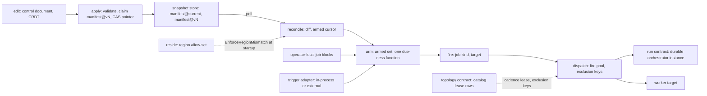
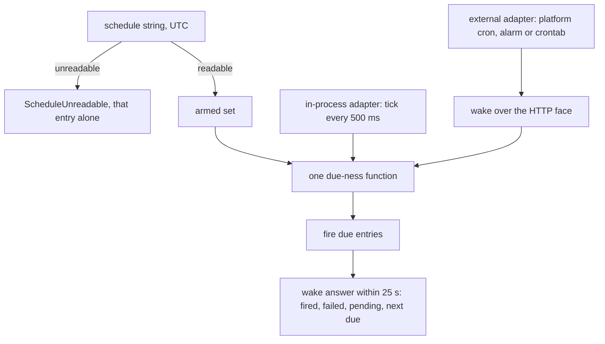
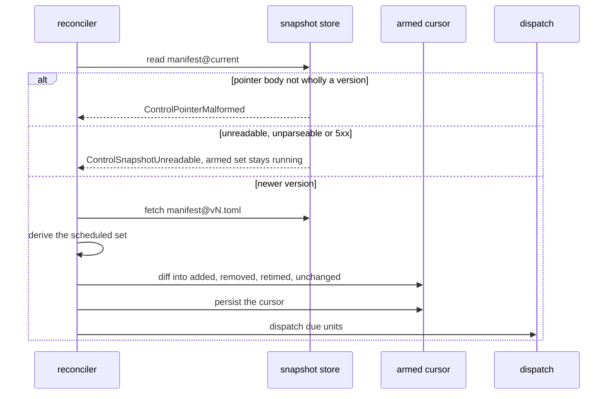
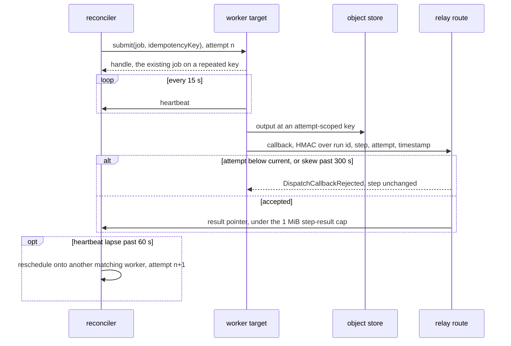

# Cadence, dispatch and the operator plane

The control plane decides when work runs and where. It holds the schedule grammar and its
trigger, the reconciler that turns an applied snapshot into an armed set, the fire stage,
the bounded dispatch pool and its worker adapter, the operator's edit and apply path over
the control document, and the region a data plane resides in. The published hostname and
the read path's two hops belong to the topology contract.

The path from an operator's edit to a dispatched unit, and where it meets topology and the run path:



## arm

The schedule grammar and cron dialect, the trigger adapter and its durability, the wake route, and how an entry computes its next fire.

- `unreadable-schedule` — A schedule string the grammar cannot read, including `L`, `W`, `?`, `#` and `@` macros, raises `ScheduleUnreadable` for that entry alone, naming the diagnostic; every other entry of the document arms.
  *A-surface*
- `unknown-trigger` — An unrecognized trigger value raises `TriggerAdapterUnknown` at startup and downgrades onto no adapter.
  *P3*
- `trigger-face-missing` — `external` selected on a deployment serving no HTTP face raises `TriggerFaceMissing` at startup.
  *P3*
- `wake-answer` — A wake answers within 25 s with what fired, what failed, what stays armed and the next due instant, naming each fire still in flight as pending.
  *because a platform request timeout otherwise ends the call before the caller learns anything*
- `tick-interval` — The in-process adapter evaluates the armed set every 500 ms.

Both trigger adapters reach one due-ness function:



## reconcile

The control source, the snapshot pointer and its versions, the pure schedule diff, and what a failed poll leaves running.

- `poll-cadence` — `poll` takes a schedule string, and a `[control]` block declaring none polls every 30 s.
- `pointer-malformed` — A pointer body that is not wholly a version raises `ControlPointerMalformed`.
  *because an integer read out of leading bytes arms a version nobody applied*
- `fail-static` — An unreadable pointer, an unparseable snapshot or a control plane answering `5xx` raises `ControlSnapshotUnreadable`, logs a diagnostic, and leaves the armed set in place running.
  *A-surface*
- `loopback-only` — A control URL whose host is not a loopback address raises `ControlSourceNotLoopback` and arms nothing.
  *A-surface*

One reconciler beat, polled every 30 s by default:



unsettled: Does a daemon reach a non-loopback control source, carrying bearer authentication, TLS and producer signing over version and content hash, and does it learn of a new snapshot by poll or by push? owner: control affects: surface.reconcile

## fire

Job declaration, the closed kind union, same-tick order, the fire watermark, and one-shot evaluation.

- `job-kind-unknown` — A block naming a kind outside the union, an argument vector or a host command raises `JobKindUnknown` at validation.
  *A-surface*
- `target-unbound` — A `fold` target naming no produced table, or a `build` target naming no declared model, raises `JobTargetUnbound` at validation.
  *P1*
- `cycle-control-source` — A configured control source that does not resolve under `cycle` raises `CycleControlSourceUnresolved`.
  *P3*

## dispatch

The bounded fire pool and its exclusion keys, the reconciler's hold on the cadence lease, step results, and the worker adapter with its attempt-fenced callback.

- `not-a-head` — Where entries are landing steps of one dependent run, the run is the unit and cadence rides its head entry. A due id that is a step raises `DispatchUnitNotAHead` and starts nothing.
  *A-surface*
- `step-result` — A checkpointed step returns a pointer, an object-store key or a catalog row id, under a 1 MiB step-result cap.
- `in-band-tool-error` — A step driving the engine over the tool protocol judges the tool result, not transport status: a `200` carrying a protocol error or a result flagged `isError` raises `StepToolError`.
  *P2*
- `callback-skew` — The relay accepts a callback timestamp within 300 s of its own clock.
- `callback-rejected` — A callback whose attempt is below the step's current attempt, or whose timestamp falls outside {{surface.dispatch.callback-skew}}, raises `DispatchCallbackRejected` and changes no step.
  *because a partitioned worker's late result otherwise overwrites its successor's, and a captured callback replays indefinitely*
- `heartbeat-beat` — A worker heartbeat runs every 15 s.
- `heartbeat-lapse` — A heartbeat lapse past 60 s reschedules that worker's in-flight work onto another matching worker under the next attempt number.

One step on a worker target, from submit to an accepted or rejected callback:



unsettled: Is the fire pool's bound one number per deployment or one per exclusion key? owner: control affects: surface.dispatch

## edit

The configuration document, the records it presents read-only, the structured schedule specification, and connector configuration.

- `secret-in-document` — A credential value typed into a configuration field raises `SecretMaterialInDocument`; the document holds references and the backend holds material.
  *because a value in the document reaches every daemon and replica that reads a snapshot*
- `connector-upload` — An artifact uploaded through the operator surface raises `ConnectorUploadRefused`; the surface references registered connectors by id and version.
  *because publishing into the registry runs a separate signed path*

## apply

Validation, the immutable version claim, the pointer advance, the owner's storage, and the authority an apply carries.

- `version-race` — An apply whose compare-and-swap loses raises `ManifestVersionConflict`, reloads the winning version and reapplies its pending edits onto it, overwriting no applied version.
  *A-surface*
- `validation` — A document failing engine validation raises `ApplyValidationRefused` and claims no version.
  *because a snapshot store holding a version daemons refuse to arm stalls every daemon reading it*
- `owner-unconfigured` — An owner with no storage configured or no credential raises `ConfigOwnerUnconfigured`, answered `503`; no local writer substitutes for the store-scoped API.
  *P3*
- `weak-conditional-backend` — A configuration owner or catalog backend whose conditional replacement is not linearizable raises `ConditionalWriteUnsupported` at startup or open.
  *A-surface*
- `uninitialized-store` — An edit or apply against a store that has taken no explicit guarded import, an empty store included, raises `StoreNotInitialized`, answered `409`.
  *P3*

One apply through the engine's store-scoped API:

```mermaid
sequenceDiagram
  participant O as operator surface
  participant E as engine store-scoped API
  participant S as snapshot store
  participant A as audit log
  O->>E: apply under the admin capability
  alt store took no guarded import
    E-->>O: StoreNotInitialized, 409
  else document fails validation
    E-->>O: ApplyValidationRefused, no version claimed
  else valid
    E->>S: write manifest@vN.toml
    E->>S: compare-and-swap manifest@current
    alt swap lost
      E-->>O: ManifestVersionConflict
      O->>E: reload the winner, reapply pending edits
    else swap won
      E->>A: attributed to the verified identity
      E-->>O: version N
    end
  end
```



unsettled: Can a local control plane validate and claim a version on its own, or does every apply route through a hosted one? owner: control affects: surface.apply

## reside

Where the data plane runs, the region allow-set gating placement, and operation with no external reach.

- `region-entries` — A residency allow-set holds at most 16 entries.
- `region-mismatch` — A configured resource resolving to a region the policy omits raises `EnforceRegionMismatch` at startup, and the runtime serves nothing.
  *P3*

unsettled: How is a residency region declared differently by two sites detected, given that each resolves its own configuration? owner: control affects: surface.reside

## Shapes

A daemon's own configuration, the control wiring and its operator-local jobs:

```toml
[control]
snapshot_dir = "./.contextful/control"   # or url = "http://127.0.0.1:8787/control"
poll         = "every 30s"

[[job]]
name     = "nightly-fold"
schedule = "0 3 * * *"
kind     = "fold"
target   = "meta_ads_insights"

[[job]]
name     = "hourly-push"
schedule = "every 1h"
kind     = "sync-push"
```

The wake route's answer:

```json
{
  "fired": ["field-notes", "nightly-fold"],
  "failed": [],
  "pending": ["hourly-push"],
  "armed": 14,
  "next_due": "<instant, RFC 3339 UTC>"
}
```
