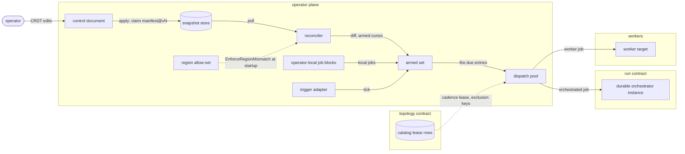
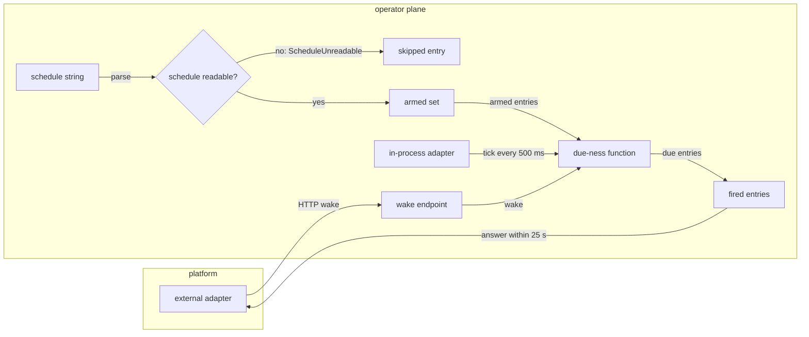
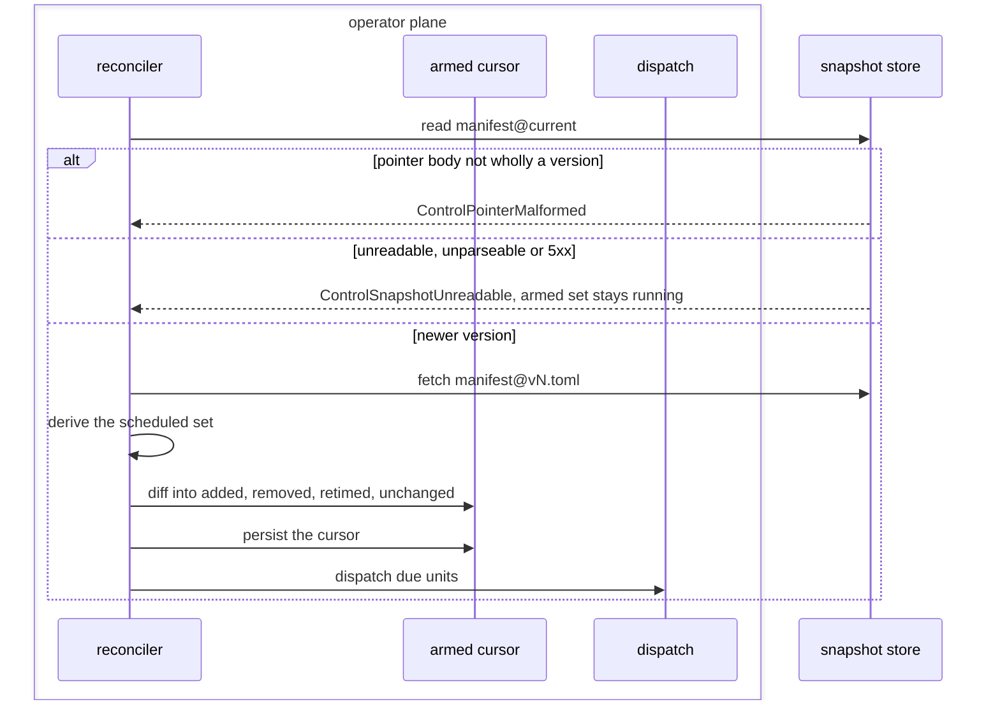
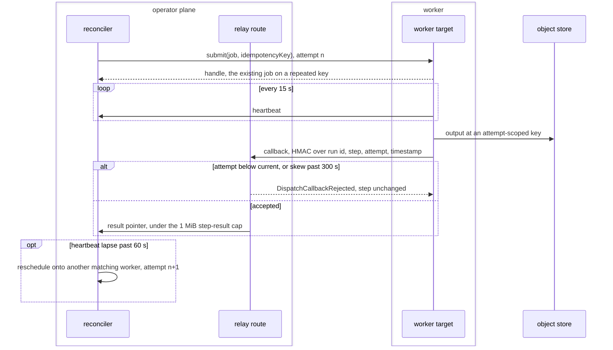
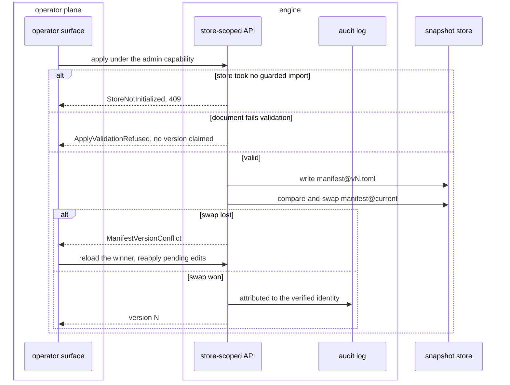

# Cadence, dispatch and the operator plane

The control plane decides when work runs and where. It holds the schedule grammar and its
trigger, the reconciler that turns an applied snapshot into an armed set, the fire stage,
the bounded dispatch pool and its worker adapter, the operator's edit and apply path over
the control document, and the region a data plane resides in. The published hostname and
the read path's two hops belong to the topology contract.

The path from an operator's edit to a dispatched unit, and where it meets topology and the run path:



## arm

The schedule grammar and cron dialect, the trigger adapter and its durability, the wake route, and how an entry computes its next fire.

- `unreadable-schedule` — A schedule string the grammar cannot read, including `L`, `W`, `?`, `#` and `@` macros, raises `ScheduleUnreadable` for that entry alone, naming the diagnostic; every other entry of the document arms.
  *A-surface*
- `unknown-trigger` — An unrecognized trigger value raises `TriggerAdapterUnknown` at startup and downgrades onto no adapter.
  *P3*
- `trigger-face-missing` — `external` selected on a deployment serving no HTTP face raises `TriggerFaceMissing` at startup.
  *P3*
- `wake-answer` — A wake answers within 25 s with what fired, what failed, what stays armed and the next due instant, naming each fire still in flight as pending.
  *because a platform request timeout otherwise ends the call before the caller learns anything*
- `tick-interval` — The in-process adapter evaluates the armed set every 500 ms.
- `trigger-select` — `[control] trigger` selects `in-process`, the default, or `external`, under which `pipeline serve --http <address>` answers `POST /wake` and runs no tick of its own.
- `grammar` — A schedule is `every <n><unit>` with unit `s`, `m`, `h` or `d`, or a UTC cron expression of five fields, minute, hour, day of month, month and day of week, each `*`, a value, range, list or `/` step.
- `next-fire-from-history` — An armed entry's next fire is the first instant its schedule admits after the later of its pipeline's last journaled run start and its last dispatch; an entry with neither is due when armed.
  *because a restarted daemon then keeps the cadence its run history shows instead of restarting every interval from boot*
- `catch-up` — A daemon arming an entry whose next fire has passed fires it once, whatever count of intervals elapsed, and arms the following fire from that run.
  *because replaying each missed interval against an incremental source pulls the same delta once per interval*
- `pulled-history` — A pipeline's last journaled run start is the latest start across this node's catalog and every run state {{store.push.run-state}} carries that records the pipeline.
  *because a cold node's empty catalog otherwise finds every scheduled entry due at once*
- `pulled-future` — A pulled run start later than the scheduler's current instant counts as no start for {{surface.arm.pulled-history}}.
  *because one node's fast clock or one bucket writer otherwise defers every replica's cadence until that instant*
- `unarmed-named` — An applied pipeline declaring no schedule, or held back by {{surface.arm.unreadable-schedule}}, arms no entry; serve names each such pipeline with its reason once per applied version, and `--cycle` lists them under `unarmed`.
  *because a pipeline silently left out of the armed set reads as armed until its data goes stale*

Both trigger adapters reach one due-ness function:



## reconcile

The control source, the snapshot pointer and its versions, the pure schedule diff, and what a failed poll leaves running.

- `poll-cadence` — `poll` takes a schedule string, and a `[control]` block declaring none polls every 30 s.
- `pointer-malformed` — A pointer body that is not wholly a version raises `ControlPointerMalformed`.
  *because an integer read out of leading bytes arms a version nobody applied*
- `fail-static` — An unreadable pointer, an unparseable snapshot or a control plane answering `5xx` raises `ControlSnapshotUnreadable`, logs a diagnostic, and leaves the armed set in place running.
  *A-surface*
- `loopback-only` — A control URL whose host is not a loopback address raises `ControlSourceNotLoopback` and arms nothing; a poll follows no redirect and routes through no proxy.
  *A-surface*
- `url-layout` — A control URL serves `manifest@current` and each `manifest@v<N>.toml` directly beneath its path; a pointer answered `404` reads as no applied version, and any other status besides `200` is unreadable.
  *because one layout serves a snapshot directory unchanged over loopback HTTP*
- `learns-by-reading` — A daemon learns of a new snapshot only by reading its control source, on each poll and on each wake; nothing pushes a snapshot to it.
  *A-surface*

One reconciler beat, polled every 30 s by default:



## fire

Job declaration, the closed kind union, same-tick order, the fire watermark, and one-shot evaluation.

- `job-kind-unknown` — A block naming a kind outside the union, an argument vector or a host command raises `JobKindUnknown` at validation.
  *A-surface*
- `target-unbound` — A `fold` target naming no produced table, or a `build` target naming no produced table declaring its `columns`, raises `JobTargetUnbound` at validation.
  *P1*
- `cycle-control-source` — A configured control source that does not resolve under `cycle` raises `CycleControlSourceUnresolved`.
  *P3*
- `store-driven-concurrency` — A `store-driven` block declaring no positive integer `max_in_flight` raises `JobConcurrencyUnset` at validation; no default applies.
  *A-surface*
- `store-driven-body` — A `store-driven` block whose `body` names no body the embedding binary registers raises `JobBodyUnregistered` at validation.
  *A-surface*
- `cycle` — `serve --cycle` arms the applied snapshot, evaluates due-ness once, waits for every unit it dispatched, and prints what fired, what failed, what stays pending, the armed count and the next due instant.
- `cycle-exit` — `serve --cycle` exits non-zero when any unit it dispatched failed, after printing its answer; a cycle with no failed unit, or one finding the cadence lease held, exits zero.
  *because a scheduler running the cycle reads the exit status, and a zero over a failed fire reports success*

## dispatch

The bounded fire pool and its exclusion keys, the reconciler's hold on the cadence lease, step results, and the worker adapter with its attempt-fenced callback.

- `not-a-head` — A `[[pipeline]]` block naming `after = "<id>"` is a landing step of that entry's dependent run; the run is the unit and cadence rides its head entry. A due id that is a step raises `DispatchUnitNotAHead` and starts nothing.
  *A-surface*
- `step-result` — A completion callback carries a pointer, an object-store key or a catalog row id, or the failed step's last error line, as JSON of at most 1 MiB; any other callback body raises `StepResultRefused` and records nothing.
  *because a step result rides one journal row, and bulk output belongs in the object store it points into*
- `in-band-tool-error` — A step driving the engine over the tool protocol judges the tool result, not transport status: a `200` carrying a protocol error or a result flagged `isError` raises `StepToolError`.
  *P2*
- `callback-skew` — The relay accepts a callback timestamp within 300 s of its own clock.
- `callback-rejected` — A heartbeat or callback whose signature fails, whose attempt is not the step's current attempt, whose timestamp falls outside {{surface.dispatch.callback-skew}}, or whose step has closed, raises `DispatchCallbackRejected` and changes no step.
  *because a partitioned worker's late result otherwise overwrites its successor's, and a captured callback replays indefinitely*
- `heartbeat-beat` — A worker heartbeats every 15 s with a signed `GET` on its step's awakeable route, and posts its outcome to that route with a signed `POST`.
  *A-surface*
- `worker-target` — `[control] workers` lists worker URLs and `[control] relay` the URL whose `/awake/:token` route `serve` binds; with workers listed, each landing step posts to a worker's `POST /submit`, keyed by run, step and attempt.
  *A-surface*
- `worker-key` — Heartbeats and callbacks sign under the key `CONTEXTFUL_WORKER_KEY` holds; `serve` listing workers without a relay or without that key refuses at startup and binds nothing.
- `submit-signed` — A worker admits a `POST /submit` only when it carries an HMAC under the worker key over its timestamp and body, within {{surface.dispatch.callback-skew}}, naming a callback under its own `[control] relay`; any other submission raises `DispatchSubmitRejected` and starts nothing.
  *because an unsigned submission lets any caller start a step and have the worker sign heartbeats and callbacks for a route of its choosing*
- `submit-exhausted` — A step every listed worker refuses in turn at `POST /submit` fails its unit naming the last refusal, each worker tried once.
  *because a step bouncing between refusing workers holds its pool slot and exclusion key while never running*
- `heartbeat-lapse` — A heartbeat lapse past 60 s reschedules that worker's in-flight work onto another matching worker under the next attempt number.
- `pool-bound` — A deployment's fire pool runs at most 4 units at once, `[control] pool` replacing the bound; a due unit past the bound stays armed and reports pending.
  *because one bound per deployment caps the process's concurrent pulls, where a bound per exclusion key caps nothing as pipelines are added*
- `exclusion-key` — A unit's exclusion key is its pipeline id: a unit due while another under its key is in flight starts no second instance, and its next fire recomputes once the first ends.
  *because two fires of one pipeline race for one cursor*
- `lease-gated` — A serve process dispatches only while it holds its deployment's cadence lease; a process finding the lease held arms nothing and, under `--cycle`, exits naming the holder.
  *because two daemons reading one snapshot otherwise fire every due unit twice*
- `children-reaped` — A serve process starts each child run in its own process group; on `SIGTERM`, `SIGINT`, a `--cycle` exit or an unwind it signals each live group `SIGTERM`, `SIGKILL`s the remainder after 10 s, and exits once every child has.
  *because a child outliving its serve also outlives the cadence lease, and a second scheduler then fires the same pipeline concurrently*

One step on a worker target, from submit to an accepted or rejected callback:



## edit

The configuration document, the records it presents read-only, the structured schedule specification, and connector configuration.

- `secret-in-document` — A credential value typed into a configuration field raises `SecretMaterialInDocument`; the document holds references and the backend holds material.
  *because a value in the document reaches every daemon and replica that reads a snapshot*
- `connector-upload` — An artifact uploaded through the operator surface raises `ConnectorUploadRefused`; the surface references registered connectors by id and version.
  *because publishing into the registry runs a separate signed path*
- `store-draft` — An Admin edit validates a complete control document and saves one store-scoped draft bound to its applied version, verified operator and random nonce, leaving the applied pointer unchanged.
  *A-surface*

## apply

Validation, the immutable version claim, the pointer advance, the owner's storage, and the authority an apply carries.

- `version-race` — An apply whose compare-and-swap loses raises `ManifestVersionConflict`, reloads the winning version and reapplies its pending edits onto it, overwriting no applied version.
  *A-surface*
- `validation` — A document failing engine validation raises `ApplyValidationRefused` and claims no version.
  *because a snapshot store holding a version daemons refuse to arm stalls every daemon reading it*
- `owner-unconfigured` — An owner with no storage configured or no credential raises `ConfigOwnerUnconfigured`, answered `503`; no local writer substitutes for the store-scoped API.
  *P3*
- `weak-conditional-backend` — A configuration owner or catalog backend whose conditional replacement is not linearizable raises `ConditionalWriteUnsupported` at startup or open.
  *A-surface*
- `uninitialized-store` — An edit or apply against a store that has taken no explicit guarded import, an empty store included, raises `StoreNotInitialized`, answered `409`.
  *P3*
- `local-claim` — A local control plane validates and claims `manifest@v<N>.toml` in its snapshot directory, `.contextful/control/<project>/` unless `[control] snapshot_dir` names one, on its own; `contextful pipeline apply` is that apply, and no hosted plane sits on its path.
  *because {{topology.coordinate.air-gap}} holds a single-node deployment to reach no process outside itself*
- `guarded-import` — `contextful pipeline import` claims v1 from the declared pipelines while the snapshot directory holds no version; a second import claims nothing.
- `draft-claim` — An Admin apply rechecks the configured store owner, validates its saved draft again, and claims that draft through the owner's version compare-and-swap.
  *A-surface*
- `operator-attestation` — An Admin mutation lacking a fresh, single-use console signature over its verified operator, route and body raises `ControlOperatorAttestationInvalid` before changing the control document.
  *because a shared store capability cannot identify the person who used the console*
- `draft-absent` — An Admin apply finding no validated store draft raises `ControlDraftAbsent` and changes no applied version.
  *because an absent draft supplies no document for the version claim*

One apply through the engine's store-scoped API:



## reside

Where the data plane runs, the region allow-set gating placement, and operation with no external reach.

- `region-entries` — A residency allow-set holds at most 16 entries.
- `region-mismatch` — A configured resource resolving to a region the policy omits raises `EnforceRegionMismatch` at startup, and the runtime serves nothing.
  *P3*
- `site-regions` — A push records the pushing site's residency allow-set in the bucket manifest; a push finding a differing set another site recorded, an absent one included, raises `ResidencySitesDiverge` and commits nothing.
  *A-surface*

## Shapes

A daemon's own configuration, the control wiring and its operator-local jobs:

```toml
[control]
snapshot_dir = "./.contextful/control/research"   # or url = "http://127.0.0.1:8787/control"
poll         = "every 30s"
pool         = 4
trigger      = "in-process"                         # or "external", with `pipeline serve --http`

[residency]
regions = ["eu-west-1", "eu-central-1"]

[[job]]
name     = "nightly-fold"
schedule = "0 3 * * *"
kind     = "fold"
target   = "meta_ads_insights"

[[job]]
name     = "hourly-push"
schedule = "every 1h"
kind     = "sync-push"

[[job]]
name          = "score-documents"
kind          = "store-driven"
body          = "score"               # compiled code the embedding binary registers
statement     = "SELECT doc_id, body FROM documents ORDER BY doc_id"
as_of         = "2030-01-01T00:00:00Z" # absent, the instant the execution opens
max_in_flight = 4
tables        = ["scores"]
```

The wake route's answer:

```json
{
  "fired": ["field-notes", "nightly-fold"],
  "failed": [],
  "pending": ["hourly-push"],
  "armed": 14,
  "next_due": "<instant, RFC 3339 UTC>"
}
```
