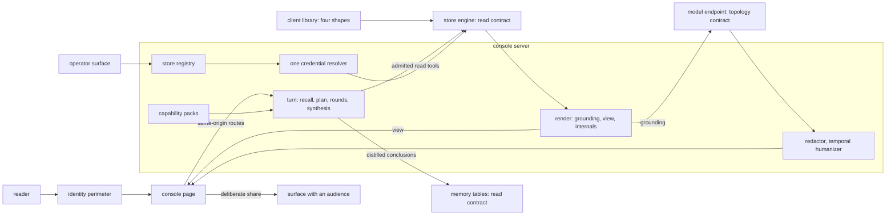
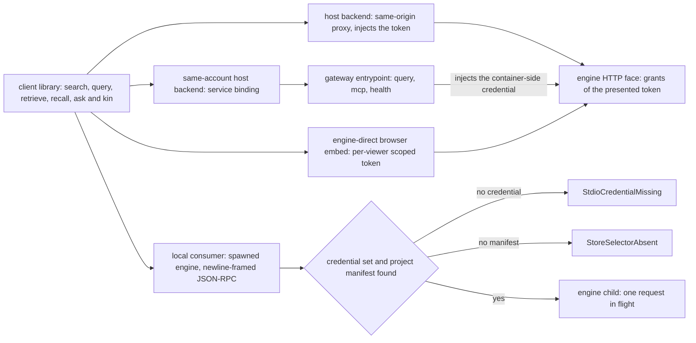
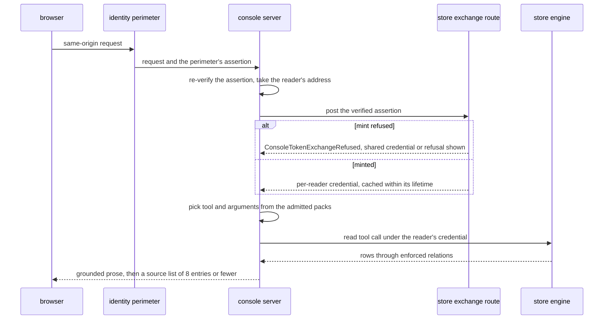
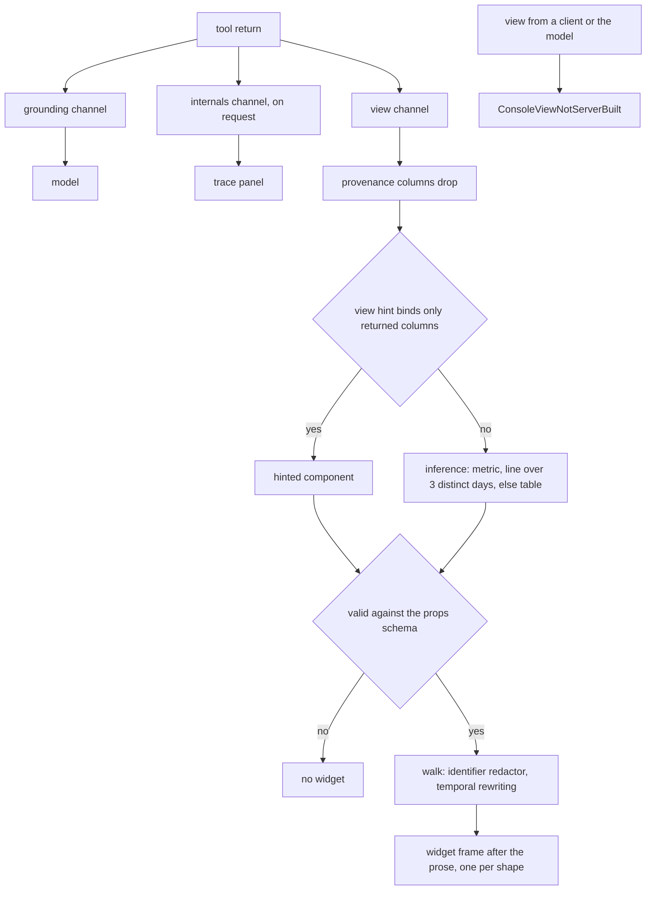
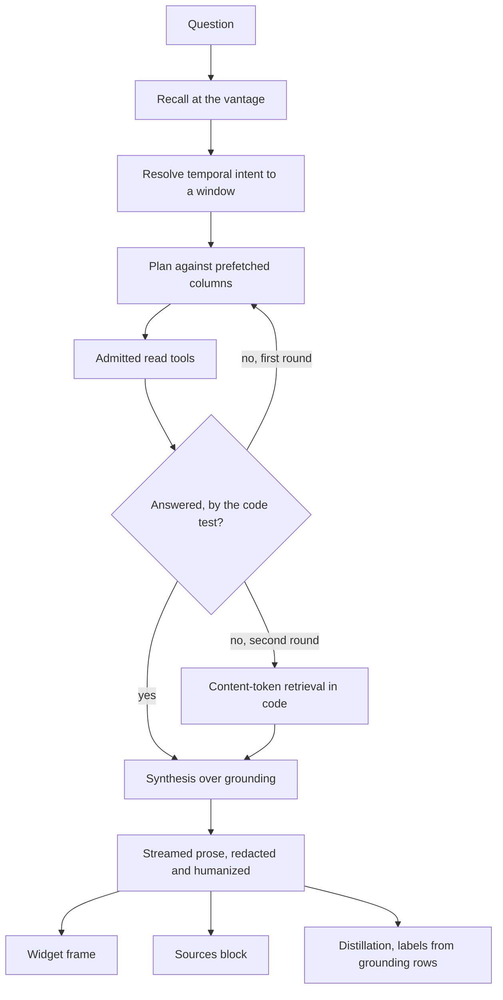

# The analyst console

The console is the surface a non-technical reader reaches a store through: one composer, one
transcript, and the widgets a turn draws beside its prose. It holds no data and no privileged
path under the tables; everything it shows arrives from a governed read, in the reader's own
language. The same store registry feeds the operator's views and the client library that
embeds search and ask in a third-party page.

The console between a reader and a store, and where it meets the read contract and the model endpoint:



## register-store

| Clause | Statement | Why |
| --- | --- | --- |
| `surface.register-store.registry-variables` | The served store set resolves per request from `CONTEXTFUL_STORES_JSON`, a JSON array of entries, and an optional `CONTEXTFUL_STORE_IDS` allowlist that filters and orders it. A store appears with no rebuild. | — |
| `surface.register-store.registry-unreadable` | A `CONTEXTFUL_STORES_JSON` value that does not parse raises `StoreRegistryUnreadable` at startup; the built-in stores substitute for no configured set. | P3 |
| `surface.register-store.malformed-entry` | One entry that does not decode raises `StoreEntryMalformed` naming it, and is dropped while its siblings are served. | A-surface |
| `surface.register-store.unset-serves-built-ins` | Both variables unset serve the two built-in stores alone. | — |
| `surface.register-store.built-ins` | Two stores ship in the product: a bundled fixture with no upstream that renders the whole surface with no secrets, and a loopback store marked development-only. The fixture is recognized by its absent upstream, not its id. | — |
| `surface.register-store.reserved-id` | A configured entry claiming either built-in id raises `StoreIdReserved`. | because the entry otherwise reads the fixture's rows under its own name |
| `surface.register-store.ids-are-kebab` | A store id is lower kebab-case, mapping injectively onto a legal environment-variable name and onto no object key of its choosing. | — |
| `surface.register-store.derived-names` | A store's bearer lives in the secret named by its id in upper snake-case suffixed `_QUERY_TOKEN`, and its service binding is the id in upper snake-case. Neither spelling is an entry field. | — |
| `surface.register-store.authored-name` | An entry carrying its own credential or binding name raises `StoreNameAuthored`. | A-surface |
| `surface.register-store.auth-mode` | An entry authors `auth`: `token`, the default, reads the derived secret; `exchange` mints a credential per visitor at the store's exchange route; `none` sends no bearer. The mode is never inferred from a secret's presence. | — |
| `surface.register-store.perimeter-binding` | A store whose origin sits behind its own identity perimeter is reached over the service binding the deployment declares, and the target still enforces its bearer. A binding name resolving to no fetcher degrades to a public fetch. | — |
| `surface.register-store.one-credential-resolver` | Every path needing a store's credential — tool calls, published output routes, the prompt overlay — passes one resolver. | — |
| `surface.register-store.lexicon` | An entry may declare a lexicon that one shared normalizer validates, filtering malformed fields. A declared list replaces the defaults, an empty list means none, and declared time-window phrases add to the entry's languages. | — |
| `surface.register-store.one-endpoint` | An entry is exactly one endpoint. Combining two stores' rows is the engine's modeling layer's concern. | — |
| `surface.register-store.portal-fields` | The operator surface reads the same registry with the same derived names; a portal entry adds exactly two fields, a pack prefix and a canvas annotation. | — |

## visualize

| Clause | Statement | Why |
| --- | --- | --- |
| `surface.visualize.canvas-sources` | The operations canvas renders from the engine's entry listing, else a store's published run records, else its annotation, and states which answered. The records path withholds the run-now control and draws no cadence for a never-run entry. | — |
| `surface.visualize.file-surface` | A read-only route serves one object from a store's pack, prefix-scoped per store with traversal-safe keys and a size cap. Its listing is confined to the pack prefix by construction, and a store declaring no prefix has no file surface. | — |
| `surface.visualize.listing-page` | One listing call answers at most 1000 entries, flags truncation, and counts the keys the read route declines to serve. | — |
| `surface.visualize.published-mirror` | A store that cannot be queried publishes its learnings record: each fact's subject, predicate, object, scope, supersession marker, provenance, ingestion instant, run id and deduplication key, upserted on store, key and ingestion instant, stamped with node and report instant. | — |
| `surface.visualize.engine-answer-wins` | The learnings view prefers the engine and states which source answered; an engine answering that no such table exists stands over anything published. Both sources derive events and live counts through one pair of functions. | — |
| `surface.visualize.daemon-outlives-the-ui` | Closing the hosted or desktop shell stops no ingestion; cadence lives in the materialized configuration a daemon reconciles, and the desktop shell installs the engine as a system service. | — |

## package

| Clause | Statement | Why |
| --- | --- | --- |
| `surface.package.headless-client` | The client library is a headless, zero-dependency, zero-build ES module exposing `search()`, `query()`, `tables()`, `describe()`, `retrieve()`, `recall()`, `remember()`, `predict()` and `ask()`. Each read is one tool call, unchanged across transports. | — |
| `surface.package.four-shapes` | Four shapes share the client: a host backend proxying same-origin and injecting the token; a same-account host backend over a service binding; an engine-direct browser embed holding a scoped token; a local consumer spawning the engine over newline-framed JSON-RPC. | — |
| `surface.package.typed-entrypoint` | The gateway exports a typed entrypoint with `query(sql)`, `mcp(message)` and `health()` for an account-internal binding. The entrypoint injects the container-side credential, and the host holds no secret. | — |
| `surface.package.per-request-token` | A per-request capability token runs the read under that token's grants, identically to the HTTP face. A transport changes who injects the credential and not what it is worth. | — |
| `surface.package.cross-origin` | Cross-origin access is off by default and opt-in. Authentication is a bearer header and not a cookie, and a wildcard origin is non-credentialed. | — |
| `surface.package.per-viewer-token` | A browser-held credential is minted per viewer: the host exchanges the visitor's verified assertion for a least-privilege token audience-bound to one store, expiring in minutes and verified at both hops over the same bytes. | — |
| `surface.package.ask-event-stream` | The ask experience streams typed events — `tool`, `tool_result`, text, `citations`, `notice`, `console.render`, `done`, `error` — from a backend running the model. `citations` follows the text; the engine-direct shape serves no ask. | — |
| `surface.package.stdio-credential` | Over the process transport a credential is mandatory, a capability token or an explicit owner flag; an unset one raises `StdioCredentialMissing` and does not resolve to the owner context. | A-read |
| `surface.package.child-environment` | An explicit passthrough list, defaulting to the executable search path and the home directory, is all that crosses into the spawned engine's environment. | because the engine's secret resolver reads vendor credentials from its environment |
| `surface.package.store-selector` | The child's working directory selects the store by walking up to the project manifest; finding none raises `StoreSelectorAbsent` and exits before writing any protocol framing. | A-topology |
| `surface.package.serial-dispatch` | The process transport keeps exactly one request in flight, and an aborted call resynchronizes by discarding exactly one reply. | — |
| `surface.package.process-subpath` | The process transport lives on its own import subpath, and the root entry an isolate bundles imports no child-process module. | — |

The client library's four shapes, and who holds the credential in each:



## speak

| Clause | Statement | Why |
| --- | --- | --- |
| `surface.speak.product-language` | Every visitor-visible string — store names, placeholders, empty and error states, titles, suggestions, answers — carries product language, with no engineering vocabulary, infrastructure name or protocol term. The identity line names a signed-in address and no perimeter. | — |
| `surface.speak.audience-contract` | The analyst's system text carries a persona and an audience contract: an answer leads with the finding in business language, dates each figure, and says nothing of how it was assembled. | — |
| `surface.speak.decline-and-pivot` | A question reaching for machinery — the statement that ran, the engine, a table name — earns one sentence declining, followed by what the data says on the subject. | — |
| `surface.speak.redactor` | A deterministic redactor, its denylist held as data, passes over the streamed prose, and the same rule walks every rendered object. | — |
| `surface.speak.redactor-lookahead` | The streaming redactor buffers 128 chars across each chunk boundary, and no denylist entry is longer than the buffer. | because an identifier split between two chunks otherwise passes unredacted |
| `surface.speak.temporal-humanizer` | Engine spellings of an instant are rewritten into readable prose over the grounding channel before the model reads it, and again over the streamed answer. | — |
| `surface.speak.silent-backstops` | A backstop corrects in place with no notice to the reader, and the internals channel counts every redaction and rewrite. | — |
| `surface.speak.error-copy` | An unreachable store, a refused read and an empty result render as sentences a reader can act on, with no status code, identifier or vendor name. | — |
| `surface.speak.unanswerable-suggestion` | A suggested prompt whose answer under these rules is a decline raises `ConsoleSuggestionUnanswerable` when the suggestion set is built. | A-surface |
| `surface.speak.eval-floors` | Identifier leak rate and citation faithfulness are judged evaluation dimensions, gated by the floors the retrieval baseline carries. | — |
| `surface.speak.no-discovery-metadata` | A surface behind an identity perimeter publishes no machine-readable index, sitemap or crawler policy. Page titles and descriptions stay accurate for the reader's own tabs. | — |

## ground

| Clause | Statement | Why |
| --- | --- | --- |
| `surface.ground.empty-template` | A turn whose tool calls returned nothing answers with a fixed template stating that the store carries nothing on the question. | — |
| `surface.ground.ungrounded-answer` | A path composing answer prose in a turn holding no tool result raises `ConsoleUngroundedAnswer`. | P2 |
| `surface.ground.steps-are-visible` | Each tool round-trip renders as a transcript step a reader can open. | — |
| `surface.ground.server-authored-calls` | A tool name and its arguments are chosen on the server from the turn's admitted set; neither is read from the request body. | — |
| `surface.ground.unadmitted-tool` | A call naming a tool the turn's packs do not admit raises `ConsoleToolNotAdmitted` and dispatches nothing. | A-surface |
| `surface.ground.mutating-tool` | The visitor-facing endpoint admits a read subset: a client-reachable path naming a write raises `ConsoleMutatingToolRequested`. The one write a turn performs is authored on the server. | A-surface |
| `surface.ground.direct-file-read` | A table function resolving a path straight against stored bytes raises `ConsoleFileAccessDirect` on this surface. | P5 |
| `surface.ground.caller-not-owner` | The surface is a caller over a store: it holds no privileged relation, and a file preview returns rows through the same enforced relation an ordinary query reads. | — |
| `surface.ground.two-trust-layers` | The identity perimeter decides who reaches the page, and the presented capability decides what the engine returns. The browser holds neither, and the page calls same-origin routes only. | — |
| `surface.ground.perimeter-reverified` | The server re-checks the perimeter's assertion and takes the reader's verified address from that check for display and for the audit record. | — |
| `surface.ground.per-reader-credential` | A store on `exchange` authentication receives a credential per reader: the server posts that reader's verified assertion to the store's exchange route and carries what is minted through the session. | — |
| `surface.ground.mint-cache` | A minted credential caches per reader and assertion for no longer than its own clamped lifetime. | — |
| `surface.ground.mint-refused` | A refused mint raises `ConsoleTokenExchangeRefused`. A store carrying a shared credential falls back to it; one carrying none surfaces the refusal to the reader. | P2 |
| `surface.ground.web-supplement` | A public-web tool exists only for a store whose operator configured a search key. A web fact is attributed inside its sentence and labelled as a web source in the citation list. | — |
| `surface.ground.sources-block` | An answered turn closes with a numbered source list of linked title, publisher host and publication day, derived after the prose streams from that turn's own grounding. A failed derivation leaves the answer standing. | — |
| `surface.ground.source-dedup` | Candidates fold on the link, a title-only duplicate merging into the entry carrying one, ordered by lexical overlap with the answer, with an aggregator's click-through unwrapped to the publisher. | — |
| `surface.ground.sources-per-turn` | A source list carries at most 8 entries. | — |
| `surface.ground.structural-reads-do-not-cite` | A schema listing, a catalogue call and the store's own conclusions contribute no source entry. | — |

The two trust layers on one grounded turn, for a store on `exchange` authentication:



## plan-turn

| Clause | Statement | Why |
| --- | --- | --- |
| `surface.plan-turn.turn-legs` | A turn runs recall, planning, its retrieval rounds, then synthesis, each leg rendering as its own transcript step. | — |
| `surface.plan-turn.planner-scaffolding` | The planner receives each data table's real columns, prefetched from the schema call, and writes its statements against those names. | — |
| `surface.plan-turn.planner-reached-memory` | Scaffolding and every deterministic fallback cover data tables; scaffolding naming a memory relation raises `ConsolePlannerReachedMemory`. | A-surface |
| `surface.plan-turn.replan` | A first round returning nothing usable earns one further planning round. | — |
| `surface.plan-turn.answerability` | Code decides whether a round answered: a structured query once it returns rows, a free-text search when a row shares a non-stopword term with its query, a structural listing never. | — |
| `surface.plan-turn.code-path` | Two rounds producing nothing usable hand the turn to retrieval in code, matching the question's content tokens against each data table's rows through the ranked lexical path, assuming no schema. | — |
| `surface.plan-turn.code-path-bounds` | The code path reads at most 5000 rows per data table and stops after 10 s. | — |
| `surface.plan-turn.overlay-route` | A store serves its analyst persona as a markdown document behind the admission its other published routes carry. | — |
| `surface.plan-turn.overlay-cache` | The overlay caches for 5 min, a miss included. | — |
| `surface.plan-turn.overlay-length` | An overlay is truncated at 8000 chars. | — |
| `surface.plan-turn.overlay-reach` | The overlay carries persona, citation vocabulary and background. Grounding, the internals split, time handling and answer hygiene lie outside its reach. | — |
| `surface.plan-turn.overlay-envelope` | The overlay sits inside a delimited block closed by an explicit subordination sentence, a forged delimiter neutralized and control characters stripped; the generic text follows verbatim and last. | — |
| `surface.plan-turn.overlay-absent` | With no overlay, or a loader failure, the composed text is byte-identical to the generic text. | — |
| `surface.plan-turn.lexicon-steers` | A store's declared lexicon reaches the engine's heuristics — which column carries a title, link, day, source, entity, topic or sampled label — and steers retrieval, sampling and citation alike. | — |
| `surface.plan-turn.timeframe-phrases` | Declared timeframe phrases add vocabulary for a window the engine defines and mint no window; the window's label appears verbatim in the analyst's text. | — |

unsettled: Does a store's overlay reach the planner's text as well as the analyst's? owner: console affects: surface.plan-turn

## set-vantage

| Clause | Statement | Why |
| --- | --- | --- |
| `surface.set-vantage.one-vantage` | A conversation holds one vantage, stored on its session. The chat, the browse templates and published output routes all read at it. | — |
| `surface.set-vantage.hop-forks` | A conversation with no turns adopts a new vantage in place; one carrying turns forks a fresh session at the new vantage, a return to the latest data included. | — |
| `surface.set-vantage.unparseable` | A vantage that is neither a calendar day nor an instant raises `ConsoleVantageUnparseable`, answered `400`. | P2 |
| `surface.set-vantage.time-basis-pill` | A pill heads the empty state and the transcript, stating either that the answer stands as of a named day with later arrivals set aside, or that it reads the latest data, dated from the newest timeline stop. | — |
| `surface.set-vantage.one-frame-per-turn` | A rewound turn answers in the past tense as of the snapshot, a present turn is told its frame is now, and each fact carries the day it happened. | — |
| `surface.set-vantage.temporal-intent` | Temporal phrasing — the current day, the day before, this week, recent days, this month — resolves to a window before the model runs, matched as whole words or by containment per script, in the store's declared languages. | — |
| `surface.set-vantage.window-binds-the-turn` | A resolved window anchors the current date in the analyst's text, orders retrieval fresh-first, counts a related row dated before the window as not answering, and holds each key fact to its date. | — |
| `surface.set-vantage.web-leg-bound` | A rewound turn sends the web leg an end-published bound at the vantage, then drops every returned result dated after it locally. | — |
| `surface.set-vantage.web-bound-unparseable` | A web leg whose bound fails to parse fails that leg and raises `ConsoleWebBoundUnparseable`. | P2 |
| `surface.set-vantage.empty-window-retry` | An empty dated window retries once with the start bound relaxed, the vantage bound holding through the retry. | — |
| `surface.set-vantage.undated-sources` | A result with no parseable publication date is kept. The analyst states its date is unknown, and the transcript counts the undated sources the answer rests on beneath the pill. | — |
| `surface.set-vantage.snapshot-timeline` | A store's timeline is one query over the union of its data tables grouped by ingestion day, with row and distinct-run counts, and needs no bespoke route. | — |
| `surface.set-vantage.arrivals-strip` | Selecting a stop shows what entered since the previous one, per table, with sampled labels from a declared label column or else the most text-like column, a JSON payload unwrapped first. | — |
| `surface.set-vantage.sample-labels` | A table's arrivals contribute at most 3 entries of sampled label. | — |

## browse

| Clause | Statement | Why |
| --- | --- | --- |
| `surface.browse.chip-discovery` | Suggestion chips derive at load from the store's catalogue: a time column earns a latest-of chip, a categorical column a by-facet chip, a numeric column a top-by-measure chip. | — |
| `surface.browse.chip-determinism` | One schema yields one chip set in one order, and a table the store stops serving loses its chip at the next load. | — |
| `surface.browse.no-domain-assumption` | The surface assumes no domain table; a store added to a deployment earns chips with no product change. | — |
| `surface.browse.humanized-labels` | A generated label contains no underscore, and a bucketing suffix yields no label. | — |
| `surface.browse.machinery-excluded` | A table whose subject is engine machinery — the memory substrate, the prediction and outcome ledger, the reserved access-mirror namespace — yields no chip. | — |
| `surface.browse.fails-soft` | An unreachable store, a refused catalogue call and a store holding engine tables alone each yield an empty chip set, and the composer and file gallery keep working. | — |
| `surface.browse.insights-panel` | Selecting a store loads its published output routes, which its catalogue omits: rows render by their own column kinds, a document as markdown, and the panel names no column of the payload. | — |
| `surface.browse.file-gallery` | Two tools carry the data-file view, one listing committed files with their writing run and size, one previewing a file's rows, both under the reader's grants. | — |

## learn

| Clause | Statement | Why |
| --- | --- | --- |
| `surface.learn.recall-first` | A turn opens by recalling the store's standing conclusions at the session's vantage, ahead of planning, with no second time argument; {{read.recall.recall-clocks}} | — |
| `surface.learn.recalled-block` | Recalled conclusions enter the system text and synthesis grounding as their own labelled block. | — |
| `surface.learn.distillation` | After the answer streams, a second pass distils the exchange into at most 3 entries shaped `{subject, key, learning}`, zero included. | — |
| `surface.learn.evidence-rows` | A distilled conclusion's evidence lists the asking question and the ids of every row that grounded the turn, and its zone and row labels are the meet of those rows' labels. | because a conclusion drawn from one reader's rows otherwise reaches a colleague who cannot read them |
| `surface.learn.label-gated` | The recalled block and the greeting card show a distilled conclusion only to a reader whose grants reach every label it carries. | — |
| `surface.learn.unscoped` | A distilled conclusion landing without the reading-session scope raises `ConsoleLearningUnscoped`. | A-surface |
| `surface.learn.lands-like-a-row` | A landed conclusion carries an ingested row's ingestion instant and run identity, appears on the timeline at once, and its write renders as a transcript step. | — |
| `surface.learn.anchored` | A turn at a historical vantage learns with an observation time at the vantage and snapshot-qualified evidence, taking its own deduplication key. | — |
| `surface.learn.store-subjects` | A distilled subject belongs to the store, not the reader who produced it. | — |
| `surface.learn.memory-rules` | Standing, revision and forgetting of a landed conclusion follow {{read.revise.validity-line}} and {{disclosure.erase.local-commit}}, and recall is its one path, {{read.recall.only-door}} | — |

unsettled: Does a subject normalize during distillation, or resolve through entity matching at recall? owner: console affects: surface.learn

## render

| Clause | Statement | Why |
| --- | --- | --- |
| `surface.render.three-channels` | A tool return splits into a grounding channel, the text the answer is built from; a view channel, what the reader sees; and an internals channel for the trace panel. The model receives grounding alone. | — |
| `surface.render.internals-on-request` | The trace channel arrives when a call asks for it, with the verbatim protocol round-trip beside it; {{read.respond.internals-opt-in}} | — |
| `surface.render.component-union` | A rendered output is a component name from a closed, per-component versioned union plus typed properties, and not code, markup or a URL. A name describes the drawn shape and carries no domain word. | — |
| `surface.render.persisted-union` | A view payload is JSON, persists in saved transcripts, and resolves against the registry the client ships; an unknown name or version draws nothing. | — |
| `surface.render.client-authored-view` | A view specification arriving from a client, or composed by the model, raises `ConsoleViewNotServerBuilt`. | A-surface |
| `surface.render.model-picks-the-tool` | The model's presentational choice is which tool to call. Properties come from the result's shape and the store's declared bindings. | — |
| `surface.render.component-choice` | One row with one measure draws a metric; a date column with a measure over 3 rows on distinct days draws a line; anything else draws a table offering a bar view. | — |
| `surface.render.provenance-drops-first` | Provenance columns leave the result before shape inference, and a repeated x value disqualifies a line. | — |
| `surface.render.view-hint` | A table's manifest may declare a view block — a component name plus bindings for x, measure, low and high band, start and end markers, magnitude, series and unit — echoed verbatim on the schema call. | — |
| `surface.render.hints-bind-columns` | Every hint field except `unit` names a column the query returned and carries no value; a hint applies when the result carries every column it binds, and otherwise inference applies. | — |
| `surface.render.unit-is-authored` | A hint's `unit` is free text taking the authored-string redaction path. | — |
| `surface.render.props-schema` | Component properties validate against one generated props schema carrying the row, column, cell, axis-label, series, point and unit caps and the resolver's scan cap under Shapes. | — |
| `surface.render.string-provenance` | A view is walked, not streamed: an authored caption, label or series name takes the identifier redactor; a cell or axis tick takes temporal rewriting, its length cap and exact-match redaction. | — |
| `surface.render.headers-humanize` | A column header humanizes into a display label, and a provenance or engine identifier column drops. | — |
| `surface.render.fails-soft` | A view failing validation yields no widget. A widget rides its own frame after the prose, and synthesis is told no widget exists. | — |
| `surface.render.widget-dedup` | A turn shows one widget per tool result yielding one, deduplicated by rendered shape with the last leading, and earlier ones behind a disclosure. | — |
| `surface.render.capability-packs` | Tools group into packs, each carrying an admission predicate over the request context; one declaration decides what the model is offered, what the server dispatches, and what renders. | — |

A tool return split into three channels, and the view channel's path to a widget:



unsettled: What governs adding a member to the component union once transcripts saved under an older client exist? owner: console affects: surface.render

## brief

| Clause | Statement | Why |
| --- | --- | --- |
| `surface.brief.one-derivation` | The greeting card is one derivation over two governed reads plus one component, with no storage, engine change or model call on its path. | — |
| `surface.brief.absence-is-earned` | The card needs a session with no turns, at present time, a live conclusion, an arrived row matching an interest, and a derivation inside its budget. An error or timeout raises `ConsoleBriefUnavailable`, and no card renders. | A-surface |
| `surface.brief.composer-first` | The card delays no composer input, and a reader typing first wins. | — |
| `surface.brief.payload` | The route answers `{since, clamped, totalNew, items}`: `since` is the window start used, `clamped` marks a request past the cap, and `totalNew` counts every row entering the window, matched or not. | — |
| `surface.brief.item` | An item carries a subject slug, a display name, the newest live conclusion for that subject with its standing, matched articles newest-first with title, source, link and day, and a follow-up question. | — |
| `surface.brief.derivation` | Read live reading-session conclusions at present time, one per subject keeping the newest; window every data table by ingestion time, excluding engine tables; match in two tiers; render with a humanized slug and templated question. | — |
| `surface.brief.interests-are-conclusions` | A store's interests are its reading-session conclusions; no separate interest list exists. | — |
| `surface.brief.entity-tier` | The entity tier matches when the lowercased conclusion subject equals one of the row's lowercased ingest-time entity ids exactly, with no alias folding. | — |
| `surface.brief.topic-tier` | The topic tier needs at least 2 tokens shared between the conclusion's subject and text and the row's label and topics, one of them naming the subject. | — |
| `surface.brief.ranking` | An entity hit outranks a topic hit; within a tier more matched rows win, then the fresher publication day. | — |
| `surface.brief.card-subjects` | A card carries at most 3 subjects. | — |
| `surface.brief.articles-per-subject` | A subject carries at most 3 entries of matched article. | — |
| `surface.brief.catchup-window` | The backend caps the requested window at 7 d. | — |
| `surface.brief.entity-ids` | An entity-id column lands from a tagging transform over the deployment's entity pack, with script folding, and a headline in one language tags the entity its translation tags. | — |
| `surface.brief.last-visit-clock` | The client stamps a last-visit timestamp on each question, keyed by verified identity and store or else a device key, and sends it as the window start. | — |
| `surface.brief.browser-state-scoping` | The last-visit clock, the session list and the card seed are keyed to one identity and one store. A named identity inherits no state held before it signed in. | — |
| `surface.brief.presentational` | The card lives outside the session's turns, stops rendering once the first turn lands, and feeds no distillation. | — |
| `surface.brief.click-prefills` | A click fills and focuses the composer and sends nothing. | — |
| `surface.brief.scheduled-delivery` | A scheduled delivery of the payload as mail or chat markdown runs from the store's own run under {{surface.publish-answer.askerless-audience}} | — |

## publish-answer

| Clause | Statement | Why |
| --- | --- | --- |
| `surface.publish-answer.link-at-askers-scope` | A resource link a colleague pasted resolves against the asker's reachable set; one outside it is absent from the answer and disclosed as absent. | — |
| `surface.publish-answer.single-reader-default` | On a surface with an audience, the default reply reaches the asker alone, and an answer of substance lands in a direct message or private thread. | — |
| `surface.publish-answer.deliberate-act` | Posting an answer where others read it is a separate act the asker takes after reading it, and not a flag, a per-room default or an inferred mode. | — |
| `surface.publish-answer.provenance-line` | A posted answer carries a line stating that it was drawn from the sharer's own access and may hold material others present do not reach. | — |
| `surface.publish-answer.share-affordance` | A surface offering a share control on access-explanation output raises `VisibilityShareAffordance`. | A-surface |
| `surface.publish-answer.askerless-audience` | A scheduled job posting to an audience under a service identity raises `VisibilityAskerlessAudience`, naming the destination; a scheduled post's corpus is narrowed in the reviewed manifest to what the destination reaches. | A-surface |
| `surface.publish-answer.outbound-release` | An answer bound outside the organization is assembled from sourced prior answers with their provenance and released by a person; what the reader reaches settles nothing about what an outside recipient may receive. | — |
| `surface.publish-answer.recency-disclosed` | An answer in the present tense states when the newest row it touched landed. | — |

unsettled: Is there a principal shape for an answer computed at a room's intersection rather than one reader's scope? owner: console affects: surface.publish-answer

## Shapes

A store registry entry, and the names derived from it:

```json
[
  {
    "id": "field-notes",
    "label": "Field notes",
    "endpoint": "https://field-notes.example.net",
    "auth": "exchange",
    "exchangeRoute": "/auth/exchange",
    "packPrefix": "packs/field-notes/"
  }
]
```

```
secret   FIELD_NOTES_QUERY_TOKEN
binding  FIELD_NOTES
```

A tool return, split three ways:

```json
{
  "grounding": "3 filings landed on 2 Mar, the newest from Northwind at 09:14.",
  "view": {
    "component": "table.v1",
    "props": { "columns": ["Filed on", "Publisher"], "rows": [["2 Mar", "Northwind"]] }
  },
  "internals": { "tool": "context.query", "rows": 3, "elapsed_ms": 41, "redactions": 0 }
}
```

The caps the generated props schema carries:

| Property | Cap |
| --- | --- |
| rows per view | 50 |
| columns per view | 12 |
| characters per cell | 300 |
| characters per axis label | 40 |
| series per view | 6 |
| points across series | 200 |
| characters in a hint unit | 12 |
| result rows the resolver scans | 1000 |
| earlier widgets behind the disclosure | 2 |

A table's view hint:

```toml
[tables.daily_levels.view]
component = "band.v1"
x         = "observed_on"
measure   = "midpoint"
low       = "band_low"
high      = "band_high"
series    = "instrument"
unit      = "index pts"
```

The catch-up payload one greeting renders from:

```json
{
  "since": "<instant>",
  "clamped": false,
  "totalNew": 214,
  "items": [
    {
      "subject": "northwind",
      "display": "Northwind",
      "learning": "Northwind's filings lead the sector by about a week.",
      "tier": "derived",
      "articles": [
        { "title": "Northwind files early again", "source": "example-press.com",
          "url": "https://example-press.com/northwind-files-early", "published_on": "<day>" }
      ],
      "followUp": "What changed for Northwind this week?"
    }
  ]
}
```

One turn, from question to rendered answer:


