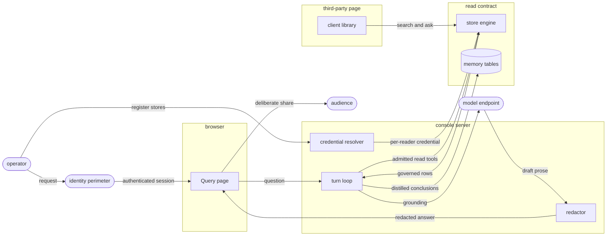
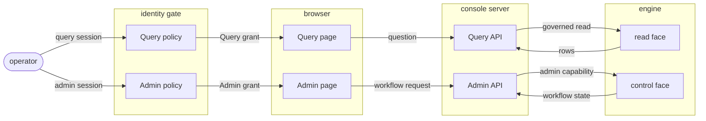
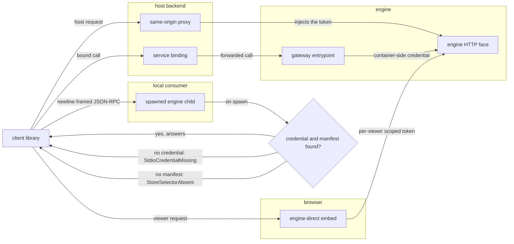
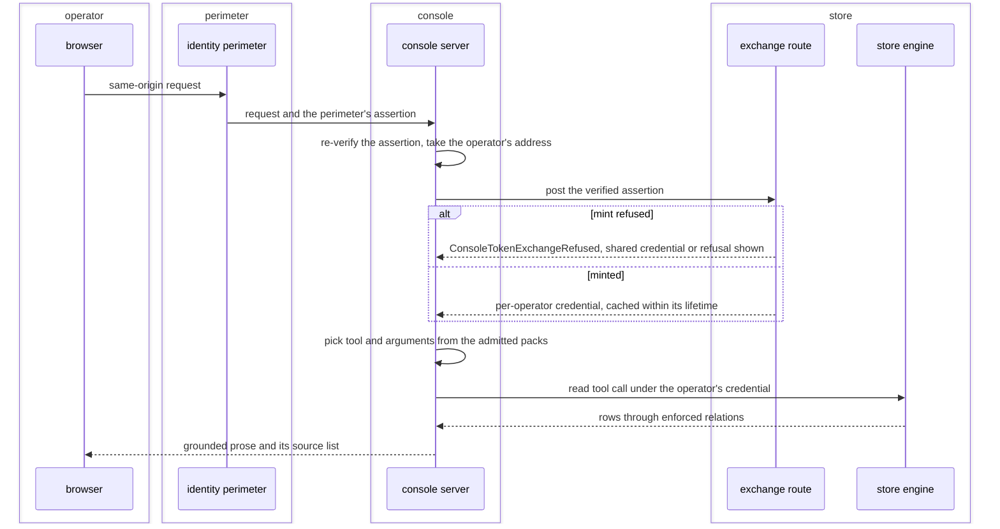
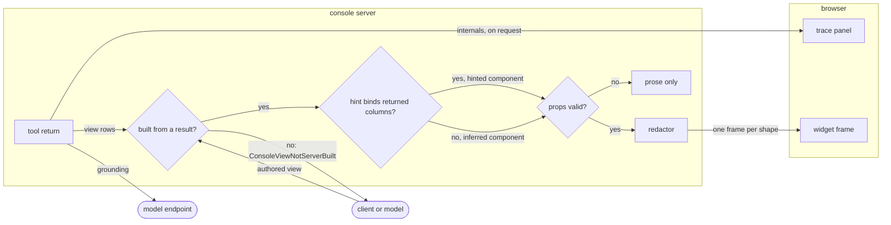
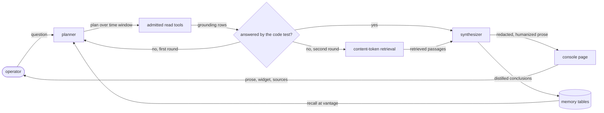

# The operator console

The operator console turns governed store reads into answers and store-published state
into administrative views. Its hosted server and embeddable client library expose those
paths to operators and third-party pages.

The Query page between an operator and a store, and where it meets the read contract and the model endpoint:



## open-console

The hosted console's two pages, their API routes, identity gates, page grants and engine capabilities.

- `page-routes` — The console serves Query at `/query` with `/query/api/*` and Admin at `/admin` with `/admin/api/*`.
  *A-surface*
- `identity-gate` — Cloudflare Access gates hosted pages by default; a deployment without Access uses Cognito managed password login and first-party sessions.
  *A-surface*
- `page-grants` — The server maps each verified Access application audience or Cognito group to Query and Admin grants and verifies the matching grant on every page and API request.
  *A-surface*
- `query-surface` — Query presents one composer, one transcript and widgets for returned rows.
  *A-surface*
- `engine-faces` — Query reaches the governed read face; Admin reaches workflow state and sends edit or apply through a server-held control capability.
  *A-surface*
- `ungated-route` — An anonymous hosted console route serving page or API content instead of the declared identity gate raises `ConsoleRouteUngated` at deploy probe.
  *A-surface*
- `wrong-page` — A page or API request without a verified Access assertion or Cognito session granting that page raises `ConsolePageForbidden` and dispatches nothing.
  *A-surface*
- `admin-grant` — An Admin edit or apply without a server-held admin capability raises `ConsoleAdminGrantMissing` and reaches no control call.
  *A-surface*

#### Scenarios

- `surface.open-console.ungated-route`: WHEN an anonymous deploy probe receives `/query` or `/admin/api/workflows` content, THEN it raises `ConsoleRouteUngated`.
- `surface.open-console.wrong-page`: WHEN a Query-only operator requests `/admin/api/workflows`, THEN it raises `ConsolePageForbidden` without dispatching.
- `surface.open-console.admin-grant`: WHEN an Admin operator applies a document without the server-held admin capability, THEN it raises `ConsoleAdminGrantMissing` without a control call.
- `surface.open-console.page-grants`: WHEN a verified operator holds only a Query grant, THEN Query admits the session and Admin refuses its page and API requests.
- `surface.open-console.query-surface`: WHEN an operator asks on Query, THEN the question and grounded answer occupy one transcript beside its widgets.



## register-store

Which stores a deployment serves, how each store's credential and binding names derive, and how a request reaches a store's origin.

- `registry-unreadable` — A `CONTEXTFUL_STORES_JSON` value that does not parse raises `StoreRegistryUnreadable` at startup, and no built-in store stands in for the configured set.
  *P3*
- `malformed-entry` — One entry that does not decode raises `StoreEntryMalformed` naming it, and is dropped while its siblings are served.
  *A-surface*
- `reserved-id` — A configured entry claiming either built-in id raises `StoreIdReserved`.
  *because the entry otherwise reads the fixture's rows under its own name*
- `authored-name` — An entry carrying its own credential or binding name raises `StoreNameAuthored`.
  *A-surface*
- `shared-registry` — Query, Admin and the embeddable client library resolve store identities from the same deployment registry.
  *A-surface*

## visualize

The Admin page's operational views.

- `workflow-canvas` — Admin projects store-published pipelines, schedules, steps, dataflow and run outcomes, and shows store-owned annotations for surrounding work.
  *A-surface*
- `operational-record` — Admin's inspector, pack file surface and learnings view present the store-published operational record.
  *A-surface*
- `listing-page` — One listing call answers at most 1000 entries, flags truncation, and counts the keys the read route declines to serve.

## package

The client library, its four deployment shapes and transports, and the credential each shape carries.

- `stdio-credential` — Over the process transport a credential is mandatory, a capability token or an explicit owner flag; an unset one raises `StdioCredentialMissing` and does not resolve to the owner context.
  *A-read*
- `store-selector` — The child's working directory selects the store by walking up to the project manifest; finding none raises `StoreSelectorAbsent` and exits before writing any protocol framing.
  *A-topology*
- `owner-flag` — An explicit owner flag over the process transport admits the local owner context only with the store's owner credential.
  *A-surface*

The client library's four shapes, and who holds the credential in each:



## speak

The language every Query-visible string carries, the audience contract, and the deterministic backstops beneath it.

- `redactor-lookahead` — The streaming redactor buffers 128 chars across each chunk boundary, and no denylist entry is longer than the buffer.
  *because an identifier split between two chunks otherwise passes unredacted*
- `unanswerable-suggestion` — A suggested prompt whose answer under these rules is a decline raises `ConsoleSuggestionUnanswerable` when the suggestion set is built.
  *A-surface*
- `stream-redaction` — The server redacts each streamed model chunk before Query emits prose to the operator.
  *A-surface*

## ground

Where an answer's material comes from: the closed tool set, the two trust layers, the per-reader credential, the web supplement and the sources block.

- `ungrounded-answer` — A path composing answer prose in a turn holding no tool result raises `ConsoleUngroundedAnswer`.
  *P2*
- `unadmitted-tool` — A call naming a tool the turn's packs do not admit raises `ConsoleToolNotAdmitted` and dispatches nothing.
  *A-surface*
- `mutating-tool` — The console's query endpoint admits a read subset: a client-reachable path naming a write raises `ConsoleMutatingToolRequested`. The one write a turn performs is authored on the server.
  *A-surface*
- `org-face-read-only` — A pack registering a write tool on an organization-wide face raises `ConsoleWriteToolOnOrgFace` at startup, naming the pack and the tool, and the face serves nothing.
  *A-surface*
- `direct-file-read` — A table function resolving a path straight against stored bytes raises `ConsoleFileAccessDirect` on this surface.
  *P5*
- `mint-refused` — A refused mint raises `ConsoleTokenExchangeRefused`. A store carrying a shared credential falls back to it; one carrying none surfaces the refusal to the reader.
  *P2*
- `sources-per-turn` — A source list carries at most 8 entries.
- `sources-block` — Every grounded answer includes a sources block citing only the governed results its admitted read tools returned.
  *A-surface*

The two trust layers on one grounded turn, for a store on `exchange` authentication:



## plan-turn

The shape of one turn: planner scaffolding, the replanning round, the answerability test, the code path, and the store's prompt overlay.

- `planner-reached-memory` — Scaffolding and every deterministic fallback cover data tables; scaffolding naming a memory relation raises `ConsolePlannerReachedMemory`.
  *A-surface*
- `code-path-bounds` — The code path reads at most 5000 rows per data table and stops after 10 s.
- `overlay-cache` — The overlay caches for 5 min, a miss included.
- `overlay-length` — An overlay is truncated at 8000 chars.
- `turn-flow` — A Query turn plans over admitted read tools, replans once after an unanswered first round, and synthesizes from the resulting governed rows.
  *A-surface*
- `overlay-audience` — A store's prompt overlay reaches the operator-facing synthesis text and stays outside the planner's text.
  *A-surface*

## set-vantage

A session's time basis: its vantage, the bound each leg carries, the snapshot timeline and the arrivals strip.

- `unparseable` — A vantage that is neither a calendar day nor an instant raises `ConsoleVantageUnparseable`, answered `400`.
  *P2*
- `web-bound-unparseable` — A web leg whose bound fails to parse fails that leg and raises `ConsoleWebBoundUnparseable`.
  *P2*
- `sample-labels` — A table's arrivals contribute at most 3 entries of sampled label.

## browse

What a store advertises before a question: discovered chips, humanized labels, the insights panel and the file gallery.

## learn

The reading loop's memory: recall ahead of planning, the per-turn distillation and the labels its conclusions inherit.

- `distillation` — After the answer streams, a second pass distils the exchange into at most 3 entries shaped `{subject, key, learning}`, zero included.
- `unscoped` — A distilled conclusion landing without the reading-session scope raises `ConsoleLearningUnscoped`.
  *A-surface*
- `write-refused` — A served claim write that refuses or returns no scope-bound receipt raises `ConsoleLearningWriteRefused` to Query before answer publication.
  *because a failed write cannot count as a durable learning*
- `subject-resolution` — Distillation preserves the subject it observes; recall resolves that subject through entity matching.
  *A-surface*

## render

The three channels, the component union, deterministic component choice, view hints and the sanitizer walk.

- `client-authored-view` — A view specification arriving from a client, or composed by the model, raises `ConsoleViewNotServerBuilt`.
  *A-surface*
- `component-choice` — One row with one measure draws a metric; a date column with a measure over 3 rows on distinct days draws a line; anything else draws a table offering a bar view.
- `older-transcript` — A client reading a transcript with an unknown component-union member renders its view as a table.
  *A-surface*

A tool return split into three channels, and the view channel's path to a widget:



## brief

The proactive greeting card: its derivation, payload, matching tiers, client-side clock and the absence it earns.

- `absence-is-earned` — The card needs a session with no turns, at present time, a live conclusion, an arrived row matching an interest, and a derivation inside its budget. An error or timeout raises `ConsoleBriefUnavailable`, and no card renders.
  *A-surface*
- `topic-tier` — The topic tier needs at least 2 tokens shared between the conclusion's subject and text and the row's label and topics, one of them naming the subject.
- `card-subjects` — A card carries at most 3 subjects.
- `articles-per-subject` — A subject carries at most 3 entries of matched article.
- `catchup-window` — The backend caps the requested window at 7 d.
- `greeting` — Query derives a greeting card from arrived rows matching live conclusions in a turnless present-time session.
  *A-surface*

## publish-answer

The moment an answer computed for one operator reaches a place other people read.

- `share-affordance` — A surface offering a share control on access-explanation output raises `VisibilityShareAffordance`.
  *A-surface*
- `askerless-audience` — A scheduled job posting to an audience under a service identity raises `VisibilityAskerlessAudience`, naming the destination; a scheduled post's corpus is narrowed in the reviewed manifest to what the destination reaches.
  *A-surface*
- `one-operator-principal` — An answer uses one operator's credential; the console offers no room-intersection principal.
  *A-surface*

## Shapes

A store registry entry, and the names derived from it:

```json
[
  {
    "id": "field-notes",
    "label": "Field notes",
    "endpoint": "https://field-notes.example.net",
    "auth": "exchange",
    "exchangeRoute": "/auth/exchange",
    "packPrefix": "packs/field-notes/"
  }
]
```

```
secret   FIELD_NOTES_QUERY_TOKEN
binding  FIELD_NOTES
```

A tool return, split three ways:

```json
{
  "grounding": "3 filings landed on 2 Mar, the newest from Northwind at 09:14.",
  "view": {
    "component": "table.v1",
    "props": { "columns": ["Filed on", "Publisher"], "rows": [["2 Mar", "Northwind"]] }
  },
  "internals": { "tool": "context.query", "rows": 3, "elapsed_ms": 41, "redactions": 0 }
}
```

A table's view hint:

```toml
[tables.daily_levels.view]
component = "band.v1"
x         = "observed_on"
measure   = "midpoint"
low       = "band_low"
high      = "band_high"
series    = "instrument"
unit      = "index pts"
```

The catch-up payload one greeting renders from:

```json
{
  "since": "<instant>",
  "clamped": false,
  "totalNew": 214,
  "items": [
    {
      "subject": "northwind",
      "display": "Northwind",
      "learning": "Northwind's filings lead the sector by about a week.",
      "tier": "derived",
      "articles": [
        { "title": "Northwind files early again", "source": "example-press.com",
          "url": "https://example-press.com/northwind-files-early", "published_on": "<day>" }
      ],
      "followUp": "What changed for Northwind this week?"
    }
  ]
}
```

One turn, from question to rendered answer:


