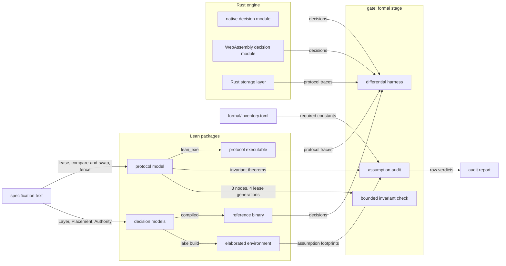
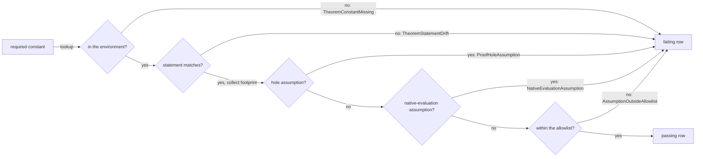
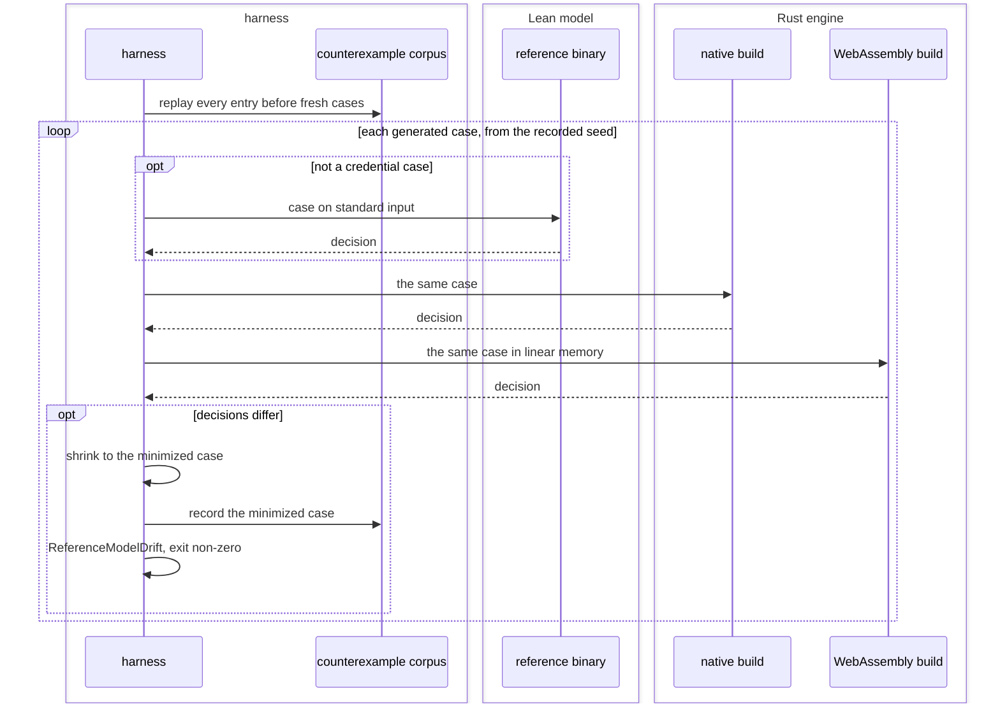

# The formal model

Two Lean 4 packages stand beside the engine: one specifying the policy core, and one holding
an executable state machine of the store's lease, compare-and-swap and fence protocol, its
invariants stated as theorems. The gate checks both on every change, and one differential
harness ties each model to the code it describes: the policy model to both builds of the
decision module, the protocol model to the Rust store.

The two models, the checks over them, and where each meets the engine:



## model

The Lean policy package and the Lean protocol state machine, their pins, and the definitions theorems and checks range over.

- `package` — The policy model is a Lean package rooted at `formal/`: `lakefile.toml` declares one `lean_lib` target and no `require` stanza, and `lean-toolchain` names one exact release string.
  *A-assurance*
- `declared-dependency` — A `require` stanza in the policy package's `lakefile.toml` reaching any external library raises `FormalPackageDependency`, naming the library.
  *A-assurance*
- `toolchain-drift` — A build whose resolved toolchain string differs from the pinned one raises `ProofToolchainDrift`, printing both strings.
  *A-assurance*
- `build-cost` — A cold elaboration of the package completes within 60 s and writes at most 512 KiB of artifacts.
  *because the check runs on every change*
- `build-command` — `lake build` at the package root elaborates every declaration and writes the environment the audit reads.
- `module-layout` — Three modules carry the package — the layer algebra, placement with the floor, and the authority mapping — and the library root re-exports all three.
- `layer` — A layer is a total function from a row identifier to `Bool`; `composed` folds a list of layers by conjunction, admitting a row when every member admits it.
- `floor` — An allow-set is a decidable predicate over a placement value; `floor` intersects a list of allow-sets pointwise, and `floor []` admits every caller as the unit of that fold.
- `placement-inductive` — The declared placement is an inductive type carrying its identifier inside the constructor, with one case per category the manifest admits and one case for an absent declaration.
- `unmodelled-constructor` — A category the manifest admits with no case in the placement inductive raises `UnmodelledConstructor` at elaboration, naming the category.
  *A-assurance*
- `total-definitions` — Every definition is total and computable: none is marked `partial`, `noncomputable` or `opaque`, and decidable equality on each finite enumeration is derived.
- `from-the-spec` — Each definition is written from the specification text and derived from no engine source.
  *because a definition copied from code makes every theorem restate the code instead of checking the specification*
- `out-of-model` — The policy package defines no credential bytes, signature verification, SQL semantics, journal write, process state or attacker observation, and no theorem reaches one.
- `protocol-package` — The protocol model is a second Lean 4 package rooted at `formal/protocol/`, beside the policy package, pinned to the same `lean-toolchain` string, with one `lean_lib` and one `lean_exe` target; its `lakefile.toml` may `require` a pinned proof-automation library.
  *A-assurance*
- `protocol-model` — The protocol model is a total, computable step function over lease acquisition, renewal, expiry and release, the fenced compare-and-swap on the catalog row and the cursor object, holder pause, message delay and crash.
  *A-assurance*
- `protocol-safety` — Four invariants are Lean theorems over every reachable state: one lease holder per fence, fences only increase, no commit lands carrying a fence below the highest granted, and release keeps the lease object and its fence.
- `protocol-theorems` — Each protocol invariant theorem is a required constant in the protocol package's inventory, audited by {{assurance.audit-assumptions.check-command}} against the same allowlist.
- `protocol-check` — The gate evaluates every invariant on each state reached by every step sequence over three nodes and four lease generations; a breaking state raises `ProtocolInvariantViolated`, printing the shortest sequence reaching it.
  *P7*
- `protocol-pins` — {{store.lease.stale-fence}} and {{store.fold.partial-snapshot}} pin to the protocol model's invariant theorems.

unsettled: Is the Veil framework mature enough for its bounded and SMT checking to discharge the protocol invariant theorems within the formal stage's budget? owner: build affects: assurance.model

## prove

The theorem inventory: layer composition, placement, the evidence floor, and the proof targets over the authority mapping.

- `composition-sound` — `composed_sound`: a row the fold over a list admits is admitted by every member of that list.
- `narrowing` — `composed_narrows`: a row admitted by `l :: ls` is admitted by `ls`.
  *because appending a layer then removes rows and adds none*
- `order-is-specified` — The composition theorem ranges over the single order {{authority.compose.relation-order}} fixes, and filtering then masking is a different relation from masking then filtering.
- `commutation-claim` — A claim that the enforcement stages commute raises `CommutationClaimed`.
  *A-assurance*
- `placement-is-a-layer` — `zone_layer_sound`: with the placement check as one more list member, a row the whole list admits was admitted by that check, with no bridging hypothesis.
- `floor-no-downgrade` — `floor_no_downgrade`: a floor admitting a caller forces every member of its evidence list to admit that caller.
- `fail-closed` — An evidence list holding one fail-closed member yields a floor admitting no public-cloud caller, and the fail-closed allow-set rejects both cloud categories.
- `symbolic-inclusion` — Zone inclusion is decided by subsumption over patterns, quantified over every constructor and every identifier, the named provider and the undeclared case included.
- `sampled-inclusion` — Inclusion decided by evaluating a fixed set of example values raises `ZoneInclusionSampled`.
  *A-assurance*
- `effective-policy` — An effective policy computed from two allow-sets is included in both.
- `proof-targets` — The authority mapping of {{authority.profile.delegation-profile}} carries two proof targets: inclusion, and narrowing — for a fixed trusted environment, permission under an attenuated child implies permission under its parent.
  *because both are pure decision functions; the other candidate targets need an execution relation no clause specifies*
- `target-binding` — A proof target is bound to one authenticated query path, recorded beside it as a module path and a test, before the claim names it.
- `unbound-target` — A target the claim names with no binding raises `ProofTargetUnbound`, naming the target.
  *A-assurance*
- `negative-space` — Beside each theorem, its negative space states what it leaves open: that the required members were in the list, that a member removes rather than tests, and that execution reaches the fold before an effect.
- `no-negative-space` — A theorem published without its negative space raises `TheoremWithoutNegativeSpace`, naming the constant.
  *A-assurance*
- `mediation-from-composition` — A filter-composition theorem offered as a mediation theorem raises `MediationClaimedFromComposition`.
  *because mediation quantifies over the reachable states of an execution; composition quantifies over a list*
- `names-carry-reach` — A constant's name states the object it ranges over, not the property a reader hopes for.

unsettled: Do profile meaning, restriction preservation and scoped-session execution become proof targets, and which execution relation does the mediation induction range over? owner: formal affects: assurance.prove

unsettled: Is inclusion decided by subsumption over patterns or by a normal form on allow-sets, given a category pattern subsuming every identifier under it? owner: formal affects: assurance.prove

unsettled: What discharges the completeness of an evidence list backing a floor, given that the empty list folds to admit-everything? owner: formal affects: assurance.prove

## audit-assumptions

The assumption allowlist, the transitive footprint audit over the elaborated environment, the inventory and the report.

- `assumption` — An assumption is a declaration the Lean kernel accepts without proof: the set `#print axioms` reports for a constant, which the audit reads through `collectAxioms`.
- `allowlist` — The assumption allowlist holds 2 entries, `propext` and `Quot.sound`, and every theorem's footprint is a subset of it.
  *because no required constant draws on `Classical.choice`*
- `transitive-audit` — Each required constant's assumption footprint is read transitively off the elaborated environment, naming every assumption reached.
- `verdict-input` — A verdict is a function of the elaborated environment and the inventory alone; source text, declaration counts and the build's exit status decide nothing.
  *because elaboration reports a hole as a warning and exits zero, and a character pattern misses a hole spelled in parentheses*
- `assumption-outside-allowlist` — An assumption in a footprint and absent from the allowlist raises `AssumptionOutsideAllowlist`, printing the constant and the assumption.
  *A-assurance*
- `hole-assumption` — A footprint containing the hole assumption raises `ProofHoleAssumption`, naming the declaration, whatever its syntax spells.
  *A-assurance*
- `native-evaluation-assumption` — A footprint containing a per-declaration native-evaluation assumption raises `NativeEvaluationAssumption`, naming the declaration that minted it.
  *A-assurance*
- `inventory` — `formal/inventory.toml` holds one row per required constant — name, module, expected statement text, admitted assumptions, binding, negative space — edited apart from the declarations satisfying it.
- `missing-constant` — A required constant absent from the elaborated environment raises `TheoremConstantMissing`.
  *A-assurance*
- `statement-drift` — A required constant whose elaborated statement differs from its expected text raises `TheoremStatementDrift`, printing both.
  *A-assurance*
- `inventory-change` — A change to a required statement lands in the commit carrying the proof it admits.
- `report` — The report names the commit, the resolved toolchain, the allowlist and inventory revision applied, and for each required constant its statement match and the assumptions it reaches.
- `check-command` — `contextful formal check` elaborates the package, matches every inventory row, audits every footprint, writes the report, and exits non-zero naming the first failing constant.

The verdict over one inventory row:



unsettled: Which review admits a new assumption to the allowlist, and where is it recorded beside the constant that draws on it? owner: formal affects: assurance.audit-assumptions

## recheck

Rebuilding and re-auditing from pinned source in a credential-free environment.

- `two-phase` — A recheck rebuilds the package from the commit's own source and pinned toolchain into an empty artifact directory, fetching nothing, and re-runs the audit against the rebuilt environment.
- `credential-free` — A recheck environment exposing a token, a signing key or a registry login raises `RecheckEnvironmentCredentialed`, naming the variable or file carrying it.
  *A-assurance*
- `report-mismatch` — A recheck whose per-constant statement text or assumption set differs from the first phase's raises `RecheckReportMismatch`, naming the constant.
  *because `.olean` output is not byte-reproducible across hosts and paths, while the per-constant report is the fact under check*
- `wall-time` — A recheck completes within 600 s.

## scope-claim

The sentence the assurance claim is allowed to be: named decisions, trusted dependencies, translation chain, refinement reach.

- `claim-sentence` — The assurance claim reads: these named decisions satisfy these named Lean specifications under these stated translation and runtime assumptions; each list resolves to code paths, constants and components in the tree.
- `beyond-named-decisions` — A claim that the enforcement engine, or any object wider than the named decisions, is verified raises `ClaimBeyondNamedDecisions`.
  *A-assurance*
- `trusted-dependencies` — The claim names the delegation library, its cryptography, its parser and the translator as trusted dependencies, and proves none of them.
- `unnamed-dependency` — A claim resting on a component absent from its trusted-dependency list raises `TrustedDependencyUnnamed`, naming the component.
  *A-assurance*
- `translation-chain` — A statement about translated code inherits four links: the compiler's lowering, the translator, hand-written models of external definitions, and the production build configuration.
- `unstated-chain` — A theorem claimed over translated code without its translation chain raises `TranslationChainUnstated`.
  *A-assurance*
- `refinement-scope` — Refinement covers the decision functions behind the two proof targets, whose inputs are values and whose outputs are decisions.
- `refinement-exceeded` — Translation reaching cryptography, a parsing adapter, a database call or concurrency raises `RefinementScopeExceeded`, naming the module.
  *A-assurance*

unsettled: Which translation toolchain reaches Lean from the engine's source, and does it resolve against the pinned release string? owner: formal affects: assurance.scope-claim

## differential-test

The executable reference models, the case generators, the minimized counterexample corpus and the command running them.

- `reference-model` — The reference model is an executable Lean rendering of the decision functions, built to a binary that reads one case on standard input and prints one decision.
- `harness` — The harness drives the reference binary and the decision module's native and WebAssembly builds over each generated case and compares their decisions field by field.
  *A-assurance*
- `builds` — The native build decides in process and the `wasm32-unknown-unknown` build under the decision-module host; absent `--wasm`, the command compiles the module from the working tree, and the report names the builds compared.
  *A-assurance*
- `decision-cases` — A case names one decision: table-pattern coverage, grant narrowing, zone admission against an allow-set, session-zone resolution, or credential admission; a placement decision also carries the zone it resolved.
- `credential-cases` — A `verify` case admits one credential against pinned keys as a network checkpoint does; both builds decide it and are compared, the reference model decides none, and the report counts each credential verdict.
  *because the reference model carries no signature scheme, and a gateway admits the credential before it places the request*
- `case-classes` — Each run generates malformed inputs, boundary values and well-formed requests, and its report names the classes it drew from.
  *because a green run is evidence over the generated classes, not an equivalence proof*
- `malformed-bytes` — The malformed class draws case texts carrying invalid UTF-8 or an integer literal outside the unsigned 64-bit range, handed as bytes to every decider, and each decides such a text malformed.
  *because a 32-bit WebAssembly build and a 64-bit native build part ways first at byte decoding and integer width*
- `minimized` — A disagreement is shrunk until no single field removal, string shortening or byte removal keeps any two of the three decisions apart, and the minimized case is recorded.
- `corpus-replay` — Every counterexample-corpus case replays before any freshly generated case.
- `corpus-entries` — The counterexample corpus retains at most 256 entries, evicting the oldest case a fresh seed reproduces.
- `run-budget` — One invocation, corpus replay included, completes within 300 s.
- `disagreement` — A case on which any two of the three decisions differ raises `ReferenceModelDrift`, printing the minimized case and every decision.
  *A-assurance*
- `discarded-counterexample` — A run reporting a disagreement and writing no corpus entry raises `CounterexampleDiscarded`.
  *A-assurance*
- `seed` — Each run records its generator seed, and re-running with that seed reproduces the same case sequence.
- `protocol-cases` — Protocol cases are operation sequences and node interleavings a `proptest-state-machine` generator draws over acquire, renew, release, expire, commit, pause, delay and crash steps across three nodes.
- `protocol-harness` — The harness drives the protocol package's compiled executable and the Rust store through each protocol case, comparing lease holder, fence, pointer ETag and commit outcome after every step.
  *A-assurance*
- `protocol-drift` — A step after which the model's state and the store's projected state differ raises `ProtocolConformanceDrift`, printing the minimized operation sequence and both states.
  *A-assurance*
- `command` — `contextful formal differential --seed <n> --cases <n>` replays the corpus, then runs the generated cases, exiting non-zero on the first disagreement.

One differential run:



## Shapes

The package on disk:

```
formal/
  lakefile.toml            one lean_lib, no require stanza
  lean-toolchain           one exact release string
  Contextful.lean          library root, re-exports the three modules
  Contextful/
    Layer.lean             Layer, composed, composed_sound, composed_narrows
    Placement.lean         placement inductive, allow-sets, floor, zone_layer_sound
    Authority.lean         profile elements, effective authority, narrowing
  inventory.toml           required constants and their expected statements
  reference/               the executable model the differential harness drives
  protocol/                second Lean package: lease, compare-and-swap and fence
    lakefile.toml          one lean_lib, one lean_exe
    lean-toolchain         the release string the policy package pins
    Protocol/
      Step.lean            state, steps, the total step function
      Invariants.lean      the four invariant theorems
    Main.lean              executable: one step sequence in, one state per step out
    inventory.toml         the invariant theorems and their expected statements
```

One inventory row:

```toml
[constant.composed_sound]
module    = "Contextful.Layer"
statement = "∀ {ls : List Layer} {r : RowId}, composed ls r = true → ∀ l ∈ ls, l r = true"
assumptions    = ["propext", "Quot.sound"]
binding   = "engine/policy/src/relation.rs::compose_layers"
negative  = """
Leaves open: that the required members were present in the list; that a member
performs removal rather than a test; that an execution reaches the fold ahead of
an effect.
"""
```
