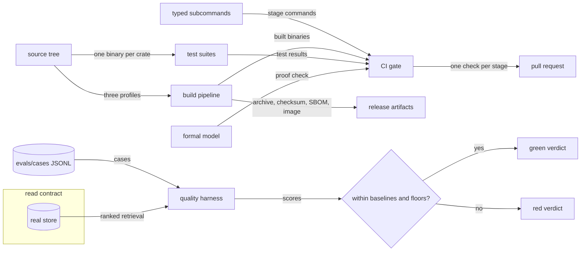
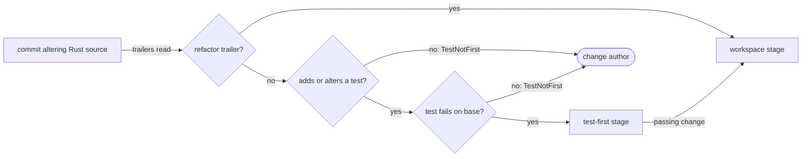
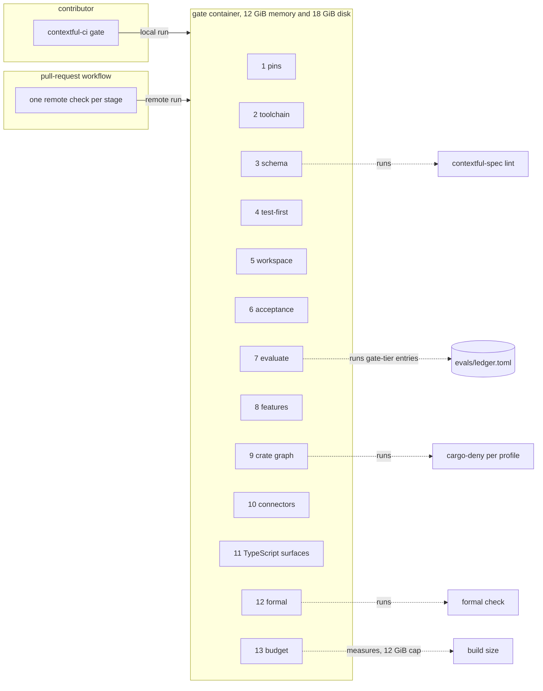
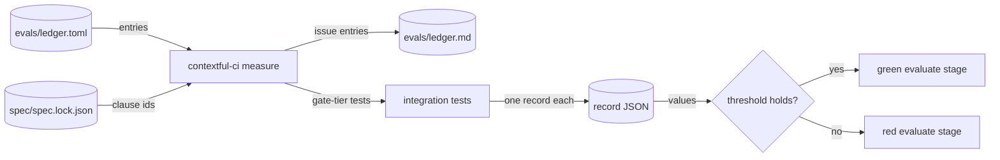

# Engineering gates and the quality harness

How the tree is written, built and checked: one home per capability, typed automation, test
placement, build targets and artifacts, the gate's stages and ceilings, and the harness that
turns read-path quality into a red or green verdict.

The tree, the checks over it, and the two verdicts they produce:



## structure-tree

One home per capability, the one enforcement decision module, adapters, mirror annotations and derived-artifact checks.

- `one-home` — Enforcement, control-plane state, credential resolution, statement guarding and visibility each resolve to one implementation in the engine; a surface reaches one through the engine route or the registered view compiling it in.
  *P5*
- `duplicated-capability` — A surface or crate carrying a second implementation of an engine capability, in any language, or a hand-written copy of an engine constant, raises `CapabilityDuplicated`, naming both sites.
  *P5*
- `decision-module` — One module owns the enforcement decision; a gateway and the engine reaching the same verdict execute it, compiled native and to WebAssembly from one pinned source.
  *P5, A-assurance*
- `adapter` — A surface with no engine process on its request path implements an adapter against the engine's ports.
  *P5*
- `derivation-check` — A generated artifact declares the check that fails once its source moves, and the gate's schema stage runs that check.
  *P5*
- `mirror-exemption` — A review-time restatement of a build-time rule is admitted where its site carries a `mirrors: <clause id>` comment naming the clause it restates; an unannotated restatement stays {{assurance.structure-tree.duplicated-capability}}.
  *because a reviewer-facing check sometimes restates a rule, and the annotation keeps the engine its one home and the copy traceable to it*
- `mirror-unresolved` — A `mirrors:` comment in a tracked file under `crates/`, `tools/` or `apps/` naming no clause of `spec/spec.lock.json` raises `MirrorUnresolved` in the schema stage, naming the file and line.
  *because an annotation naming nothing exempts a copy while tying it to no rule it could drift from*

unsettled: Does a derived artifact prove currency by a schema-hash comparison, by regeneration and diff, or by a build-time export? owner: build affects: assurance.structure-tree

## automate

Typed subcommands over compiled binaries, and the boundary shell keeps.

- `typed-subcommand` — An automation step carrying a branch, a loop or a retry, or running past 5 lines, is a typed subcommand shelling out to compiled binaries.
  *P7*
- `subcommand-surface` — A subcommand exposes typed options, generated help and an entry point a test calls directly.
- `one-path` — The gate invokes the subcommand a contributor invokes.
  *because a local reproduction and a gate run then execute one code path*
- `unchecked-shell` — A shell file in the tree that `shellcheck` rejects raises `ShellCheckFailed` in the toolchain stage.
  *P7*
- `build-time-toolchain` — The automation toolchain links into no build profile and enters no release artifact.

## test

Assertion construction, guard validation, suite placement, test-first and acceptance tests, and the connector test kit.

- `presence-before-absence` — A test whose central claim is an absence first constructs the condition it names and verifies that condition obtains.
  *P7*
- `vacuous-exclusion` — An exclusion assertion evaluated over an empty collection raises `VacuousAssertion`.
  *P7*
- `guard-fires-both-ways` — A guard is validated against the fixture that motivated it and against the state it stands against, passing on the first and failing on the second.
- `one-integration-binary` — A crate's integration tests compile in one target, `tests/integration/main.rs`, which declares each suite as a module selected by path.
  *because each file directly under `tests/` links its own static binary, hundreds of MiB for an engine-linked crate*
- `feature-gated-suite` — A feature-gated suite carries a module-level `cfg` attribute at the head of its module file and compiles to nothing while its feature is off.
- `own-process` — A test needing its own process sits in a top-level file stating why at its site; a thread-scoped log capture is such a test.
- `connector-kit` — The connector authoring toolkit ships a conformance suite — discovery returns valid schemas, an opened table yields a finite stream, a position round-trips — plus recorded-HTTP fixture replay and property tests over position monotonicity.
- `test-first` — A change altering Rust source under `crates/` or `tools/` adds or alters a test under a package's `tests/` that fails against the base commit's source; a change without one raises `TestNotFirst`.
  *A-assurance*
- `test-first-scope` — The test-first stage builds each changed test file's target against the base source, then runs exactly the tests under that file's top-level module; a target failing to compile there counts as failing.
- `base-run-bound` — One test-first execution against the base, its build excluded, runs for at most 300 s; a run past the bound is killed with its process group and counts as failing.
- `base-unrunnable` — A base invocation whose output reports a full disk, an unloadable manifest or an unfetchable dependency raises `TestFirstBaseUnrunnable` instead of a verdict.
  *because such a fault fails at base whatever the tests assert, and reading it as red admits an untested change*
- `refactor-trailer` — A commit carrying the trailer `Test-First: refactor` exempts the source it alters from {{assurance.test.test-first}}; the rest of the range stays held, and the workspace stage alone holds that commit.
  *because a behavior-preserving change has no failing test to write, and the existing suite is its specification*
- `acceptance-surface` — An acceptance test drives a built binary through its command line, MCP or HTTP surface; a workspace package among the acceptance package's dependencies raises `AcceptanceLinksEngine`.
  *A-assurance*

The test-first check over one commit in a change's range:



unsettled: Does a suite contending process-global state declare that state in its module, or acquire a named lock the integration binary owns? owner: build affects: assurance.test

## build

Target directories, the engine-linked invocation, linked query functions, build targets, release artifacts and the dependency allowlist.

- `target-dir-per-stage` — Each cargo stage builds into a target directory of its own, reclaimed once the stage passes.
  *because stages under different feature unification share no artifacts, and peak disk is then one stage*
- `one-engine-build` — The engine-linked packages build in one cargo invocation over the union of their features, compiling the bundled SQL engine once per gate run.
  *A-assurance*
- `staged-feature-runs` — A defect appearing under one feature combination alone is reached by a staged run, one command per container.
- `linked-query-functions` — Columnar file reading and statement serialization link into every build linking the SQL engine, and the read path loads no extension while serving.
  *A-assurance*
- `runtime-extension-load` — A read path loading an extension into a binary that statically links the SQL engine raises `ExtensionAutoloadRefused`.
  *A-assurance*
- `debug-info` — Development and test profiles carry line-tables-only debug information.
- `release-profile` — Release builds compile with thin link-time optimization, one codegen unit per crate and symbols stripped, and unwind on panic.
  *because the run keeper survives a panicking job only by unwinding to its guard*
- `profile-build` — The features stage builds the binary under each profile bundle alone and tests each package under every feature set its manifest lists in `feature-runs`; a failing build or test reds the stage.
  *because a bundle compiles a feature set no other stage resolves, so a defect it alone reaches ships unseen*
- `container-image` — The repository's `Dockerfile` builds one profile, `contextful-full` unless `PROFILE` names another, as a static `linux/amd64` binary, and ships it in a shell-free runtime image as a non-root user over a declared store volume.
- `targets` — All three profiles cross-compile to `x86_64-unknown-linux-musl` and `aarch64-unknown-linux-musl`; edge and full also build for `aarch64-apple-darwin`, `x86_64-apple-darwin` and `x86_64-pc-windows-msvc`; edge also targets `wasm32-wasip2`.
- `release-artifact` — Each profile ships a release archive with a SHA-256 checksum and an SBOM, a package-manager formula and an independently tagged container image; the bare formula name and the install script resolve to the full profile.
- `licence-field` — Every workspace package under `crates/` or `tools/` declares `license = "Apache-2.0"`, inherited from `[workspace.package]`; a package declaring another value or none raises `PackageLicenceMissing`, naming its manifest.
  *because cargo-deny, cargo-about and SBOM generators read the manifest field, not the `LICENSE` file, so an unlicensed package fails a consumer's licence check*
- `dependency-allowlist` — The connector authoring dependency allowlist carries a linear-time regular-expression engine and bounded-depth deserialization, and admits no backtracking regex engine and no unbounded recursive parser.

unsettled: Does the edge profile build for `wasm32-wasip2` with the SQL engine inside its footprint budget? owner: build affects: assurance.build

unsettled: Do the store adapter's write suites assert without the SQL engine, so the features stage compiles no second copy of it? owner: build affects: assurance.build

## gate

Stage order, secrets of record, the crate-graph, row-token, egress and dependency rules, the formal stage, the container's ceilings, disk, footprint budgets and surface checks.

- `stage-sequence` — The gate runs its stages in order — pins, toolchain, schema, test-first, workspace, acceptance, evaluate, features, crate graph, connectors, TypeScript surfaces, formal, budget — and a subset is selectable by name.
- `remote-check` — The pull-request workflow dispatches every stage the gate subcommand defines to a remote runner, each as one status check labelled with the stage's name.
  *A-assurance*
- `fork-dispatch` — The pull-request workflow dispatches only a head commit pushed to the repository itself; a pull request from a fork dispatches no stage and so carries none of the required checks.
  *because a dispatch carries the org's signing secret and runs the commit on the org's runner, and an absent required check fails closed*
- `stage-reports` — Each stage prints the environment it leaves and its memory limit, peak and event counts, and a failing stage prints its diagnostics before propagating its exit code.
  *because memory exhaustion is silent, and a kill then reads as a number in the log*
- `pins-stage` — The pins stage resolves every pinned artifact identity a run depends on before any compilation.
- `evaluate-stage` — The evaluate stage runs every gate-tier ledger entry and the native case set in the deterministic tier, and reports the floor and baseline verdicts.
- `schema-stage` — The schema stage regenerates each derived artifact into a scratch location, compares it byte for byte against the committed copy, and runs `contextful-spec lint`.
- `secret-ciphertext` — In the schema stage, a key other than `DOTENV_PUBLIC_KEY*` in a git-tracked `.env*` file other than `.env.example` holding a value without the `encrypted:` prefix, or a tracked `.env.keys`, raises `SecretPlaintext`, naming file and key.
  *because a tracked file reaches every clone, and only dotenvx ciphertext is safe there while its private key stays untracked*
- `secret-scope` — In the schema stage, a key other than `DOTENV_PUBLIC_KEY*` in a git-tracked `.env*` file whose block — the assignments above it, up to the first blank line — opens with no comment carrying text raises `SecretScopeMissing`, naming file and key.
  *because a provider token cannot report its own grants, so the comment above it is the one record of what it reaches*
- `crate-graph` — The crate-graph stage holds run-path crates to reaching read-path crates through the three crossing crates alone; another edge raises `CrateGraphViolation`, naming both crates.
  *P5*
- `locked-resolve` — The crate-graph stage resolves every graph `--locked` against the committed `Cargo.lock`, so a lock behind its manifests, or one rewritten before the stage starts, fails the stage before any rule runs; the stage never rewrites it.
  *because a rule held over a graph the lock file does not record passes a build that resolves another*
- `row-token` — Every row-returning function of the store crate takes the enforcement token type, whose constructor is private to the enforcement module; a row path outside a registered relation raises `EnforceUnmediatedPath`, naming the function.
  *P5*
- `dependency-deny` — The crate-graph stage runs cargo-deny over each profile's resolved graph, with a deny list holding every crate a dependency refusal of another contract names; a hit raises that clause's error.
  *P7*
- `unconfigured-egress` — An outbound call reachable under the default configuration — usage ping, license check, update probe — raises `UnconfiguredEgress` in the crate-graph stage, naming the call site.
  *because some deployments run with no external reach, and a call nobody configured moves data outside every grant, zone and audit record*
- `interpolated-claim` — A source lint over the runtime crates finding a subject claim formatted into SQL text raises `EnforceInterpolatedSubjectClaim`, naming the file and line.
  *P1*
- `formal-stage` — The formal stage runs {{assurance.audit-assumptions.check-command}}, {{assurance.differential-test.command}} and {{assurance.model.protocol-check}}; a non-zero exit from any reds the run.
  *P7*
- `container` — The gate container carries four ceilings — processor count, 12 GiB of memory, 18 GiB of usable disk, and a 30 min per-stage wall clock — and a run dies on any one.
- `parallel-jobs` — Parallel build jobs number the memory ceiling divided by 3 GiB.
- `free-disk` — A stage starting with less than 2 GiB of free disk raises `BuildDiskPrecondition` and exits 28 before doing work.
  *P7*
- `build-size` — The budget stage holds total build size to 12 GiB, printing that size, the free space and the largest artifacts; a larger build raises `BuildSizeCeilingExceeded`, naming the head of that list.
  *P7*
- `edge-budget` — The edge profile holds to 50 MiB compressed and 60 MiB idle resident set.
- `full-budget` — The full profile holds to 150 MiB compressed and 180 MiB idle resident set.
- `control-budget` — The control profile holds to 60 MiB compressed and 80 MiB idle resident set.
- `footprint` — Per change and per profile, the footprint step builds the static-linked Linux target, compresses it, and holds its size to the profile's budget and its dynamic dependencies to the platform C library.
  *P7*
- `budget-stage` — The budget stage runs {{assurance.gate.footprint}} over every profile, and the evaluate stage builds no profile.
  *because three link-time-optimized release builds beside the gate-tier ledger outlast one stage's wall clock*
- `footprint-exceeded` — An artifact over its profile's budget, or carrying a dynamic dependency beyond the platform C library, raises `FootprintBudgetExceeded`, naming the profile.
  *P7*
- `typescript-surfaces` — The TypeScript surfaces run typecheck, unit tests and framework build in one stage, and a surface declaring no script for a check skips that check.
- `surface-check-failed` — A surface whose typecheck, unit tests or framework build fails raises `SurfaceCheckFailed`, naming the surface and the script.
  *P7*

The stages, numbered in run order, under the container's ceilings:



unsettled: Which workload, cadence and drift bound does the idle-resident soak run under, given that a multi-day soak fits no per-change gate? owner: build affects: assurance.gate

unsettled: Which cache hit rate holds `test-first` and `workspace` under the per-stage wall clock once the `Cargo.lock`-keyed build cache serves the gate container (issue 31)? owner: build affects: assurance.gate

unsettled: What ordering holds when a selected stage subset omits a stage a later stage reads output from? owner: build affects: assurance.gate

## evaluate

The read-path quality harness: case format, deterministic metrics and floors, judged dimensions, the reader and the judge.

- `real-read-path` — An evaluation run ingests, indexes, retrieves, reads, judges and scores through the surfaces a caller uses, and the harness adds no storage or runtime primitive.
- `through-the-store` — The corpus loads through the real store, and the retriever under test calls {{read.retrieve.ranked-call}} with the options a caller passes.
  *because an unordered full-scan retriever cannot go red when ranking breaks*
- `policy-labels` — An evaluation corpus carries zone and row-policy labels in its table declarations, and a run reads it through the access-control path under one admitted credential.
  *A-assurance*
- `unlabeled-corpus` — A run over a corpus whose tables declare no zone or row policy, with no `local:` zone passed as `--zone`, raises `EvalCorpusUnlabeled` before any row lands.
  *A-assurance*
- `case-format` — A case carries an id, a corpus path relative to its case file, a question, tags, and an expected block of answer, artifacts, edges, entities, must-cite, must-abstain, must-not-retrieve, time anchor and recency bound.
- `row-reference` — A case names a row as `<table>#<key>`, the key joining the row's declared primary-key values with commas, and the runner keys each returned row the same way.
- `regression-case` — A case tagged `regression` is a regression case, and its must-not-retrieve set scores {{assurance.evaluate.forbidden-row-rate}}.
- `corpus-layout` — A corpus is a directory holding `contextful.toml`, its table declarations and policy labels, and one `rows/<table>.jsonl` per table.
- `run-command` — `contextful eval run --goldens <file>` loads the case file, lands and folds each referenced corpus into a scratch store at `--landed-at`, the Unix epoch by default, reads every case, and writes the run report.
  *because an undated row landed at the epoch predates every question's window, so a replay scores alike on any day*
- `legs` — Each case calls {{read.retrieve.ranked-call}} three times at limit k: the lexical leg with the question alone, the vector leg with an embedding and an empty query, the hybrid leg with both.
- `stub-embedder` — The deterministic tier embeds every row and question with a seeded feature-hashing stub embedder; a corpus row or a case carrying its own embedding keeps it.
- `run-verdict` — A run holds its report to the floors and, given `--baseline`, to that file; either red verdict exits non-zero, and `--update-baseline` applies {{assurance.baseline.raise-only}} on green alone.
- `converter` — Each benchmark and application ground truth converts once into the case format through its own converter, and the runner reads nothing else.
- `deterministic-tier` — Recall@k, R-precision, hit-rate@k, reciprocal rank and nDCG@k run with no model call, reported per leg — lexical, vector, hybrid — and per slice.
- `distinct-top-k` — Membership in the top k is distinct, and a repeated id counts once.
- `absent-truth` — A ranked metric over a case with no relevant set is NaN and drops out of every aggregate; an empty ranking against a non-empty relevant set scores zero.
- `precision-floor` — Precision at rank min(k, R), R being the relevant-set size, holds at or above 60 percent.
  *because precision@k caps at R/k, below the floor whenever R is small*
- `forbidden-row-rate` — A row named in a must-not-retrieve set holds at 0 percent of a regression case's returned rows.
- `duplicate-row-rate` — A repeated table-and-row-key pair holds at 0 percent of the ranking.
- `in-window-rate` — A case declaring a recency bound holds its in-window rate at or above 95 percent.
- `abstention` — A must-abstain case returns zero rows.
- `truth-per-surface` — Expected artifacts score the artifact retriever and expected edges score the edge retriever, reported apart; edge truth with no edge surface configured counts in an unscored tally.
- `judged-dimensions` — The reading stage adds four judged dimensions: answer accuracy; abstention, as correct-refusal and hallucination-on-unknown rates; citation faithfulness; and temporal correctness against the bitemporal columns.
- `grounded-reader` — The harness reader answers from retrieved rows alone, and the deterministic tier substitutes a stub reader.
- `model-endpoint` — The judge and the reader reach a model through {{connector.infer.model-endpoint}}, and the harness holds no credential.
- `judge` — The judge is one pinned open-weights instruct model, called once per judged item at temperature zero; a judge swap is a full re-baseline.
  *because a majority vote at temperature zero samples one mode and adds cost without reducing variance*
- `systems-metrics` — Tokens per query, latency and cost report beside the quality figures, bucketed by corpus size in tokens relative to the reader's context window.
- `checkpoint` — A run appends each case's result as JSONL, and a crash re-runs the in-flight case.
- `run-report` — A run report carries one field per gated metric, the sample count behind each mean, the run block, the per-slice breakdown, and the tally of cases sampled, dropped and unscored.

#### Scenarios

- `assurance.evaluate.unlabeled-corpus`: WHEN a corpus's tables declare no policy and the run passes no `--zone`, THEN the run raises `EvalCorpusUnlabeled` and lands no row.
- `assurance.evaluate.policy-labels`: WHEN a regression case names a row another agent owns under `owner = subject.agent`, THEN no leg returns it and the hybrid forbidden-row rate reads 0.

## baseline

Holding a run against committed baselines and absolute floors, intervals, golden custody and case generation.

- `file` — A baseline file carries a reserved run block `{k, tier, model, samples}` and one entry per gated metric: a bare number at the run's dead band, or an object overriding the band.
- `default-dead-band` — A rate-valued entry with no override gates at a 2 percent dead band.
- `rank-quality-dead-band` — The ranked-quality entry gates at a 3 percent dead band.
- `band-units` — A band carries its metric's own units, and a count entry is pinned at zero with no band.
- `metric-path` — An entry names a metric by the report's field path: `retrieval.<modality>.<metric>`, `edge_retrieval.<modality>.<metric>`, `judge.<dimension>`, `latency_ms`, `n_cases`, or `slices.<tag>.` before a bare `<metric>` or any of these but `latency_ms`.
- `sample-count` — Every mean-valued path takes a `.n` suffix naming its sample count.
  *because blanking one case's truth lifts a NaN-filtered mean without moving the case count*
- `unresolvable-path` — A path resolving to nothing, a mean over fewer than 30 cases, a malformed entry or a non-finite band raises `BaselinePathUnresolved` before the suite runs.
  *P7*
- `run-stamp-drift` — A run block differing from the run's own configuration raises `BaselineRunStampMismatch` before the suite runs.
  *P7*
- `interval` — Each judged figure reports a 95 percent percentile-bootstrap interval over cases from 1000 resamples.
- `raise-only` — A baseline update runs after every gate and floor passes, moves each improved entry to its measured value, moves none in the worse direction, and adds no path.
- `floors-are-absolute` — An absolute floor gates independently of every committed value.
- `floor-coverage` — A report lacking a floor's figure on any leg of its `retrieval` surface breaches that floor; only a forbidden-row or in-window rate over no case holds.
- `offline` — The gate is a local command comparing the report against in-tree baselines and floors, reporting both verdicts, with or without a trace store reachable.
- `trace-store` — A trace store records run history and curation staging, and decides no verdict.
- `golden-custody` — Version-controlled JSONL under `evals/cases/` is the canonical golden set, one loader is its only ingestion door, and a reviewer's edit reaches the gate as a change to the tree.
  *A-assurance*
- `answer-key-in-the-store` — An artifact path normalizing under the evaluation directory, reached by a manifest lint or a connector, raises `GoldenSetIngested`.
  *A-assurance*
- `generated-redaction` — A golden mined from a live query or promoted from a labeled outcome passes {{authority.redact.write-time}} before commit; a case it cannot redact raises `GoldenRedactionFailed`.
  *A-assurance*
- `promotion-source` — Only an adjudicated outcome label promotes into a golden set; a self-rated row does not.
- `generators` — Three generators draft candidate cases from the deployment's store — entity-to-fact-to-edge walks, composed edge chains, and questions about absent entities — and a human approves each before commit.
- `held-out` — Retrieval and synthesis are tuned on no gate input.
- `rotation` — The native set rotates on a cadence, a sample of its truth is reviewed on each rotation, and a comparison across generations resolves through the pinned run stamp.
- `native-gate` — A native benchmark generated from a real corpus is the red or green gate; public benchmark sets run beside it as held-out comparison and decide nothing.
- `trace-export` — A run touching a deployed store with a hosted trace endpoint configured raises `TraceExportOutOfPerimeter`; hosted collection serves runs over public or synthetic fixtures alone.
  *A-assurance*

unsettled: Which public benchmark corpora are admissible gate inputs under research and non-commercial licences: fetched under the dataset's terms, transformed into a synthetic subset, or pinned by a content-hashed fetch manifest? owner: build affects: assurance.baseline

## measure

The target ledger: each tracked target, the clause it serves, how it is measured and its record per commit.

- `ledger` — `evals/ledger.toml` holds one entry per tracked target: an id, an owning clause id, a run-report metric path, a tier, a method naming one integration test, case set or probe, and a threshold.
- `unresolved-entry` — An entry whose owning clause, method or metric path resolves to nothing raises `MeasureEntryUnresolved` before any measure runs.
  *P7*
- `open-entry` — An entry naming an issue in place of a method reports open and gates nothing, and `evals/ledger.md` carries every entry's computed status.
- `tier` — A gate-tier entry decides the evaluate stage, a trend-tier entry records on every run and decides nothing, and a scheduled-tier entry runs on the scheduled job alone.
- `count-first` — A gate-tier entry measures a count, a ratio within one run or a size under a locked resolve; a wall-clock or resident-memory figure is trend-tier.
  *because a shared container moves wall-clock figures past any band narrow enough to catch a regression*
- `record` — A measure writes one JSON record carrying its entry id, value, sample count, seed and run stamp; a gate-tier method finishing without one raises `MeasureRecordMissing`.
  *P7*
- `seeded` — Every generated fixture and randomized schedule derives from the record's seed, and replaying that seed reproduces a count-valued entry's value.
  *because a failure that cannot replay cannot be fixed*
- `seed-mismatch` — A record whose seed differs from its entry's declared seed raises `MeasureSeedMismatch`, and the entry counts as red.
  *because a figure measured under another seed replays nothing the ledger names*
- `timing-iterations` — A timed batch reports p50 and p95 over 200 repeats of its operation, each after warm-up.
- `timing-batches` — A timed figure is the median of 5 repeats of its timed batch.
- `trend-band` — A trend figure more than 25 percent worse than its baseline annotates the run report and fails no stage.
- `runner-stamp` — The run block carries the runner's processor model, processor count and memory limit, and a trend figure compares only against a baseline with the same stamp.
- `absolute-threshold` — A threshold is an absolute figure of this system's own measure, and it tightens only through {{assurance.baseline.raise-only}}.
- `history` — A run on the default branch attaches its run report to the measured commit under `refs/notes/measures`, and no verdict reads a note.
  *A-assurance*
- `scheduled` — A nightly job runs every tier against the default-branch head and reports one check per run.
- `measured-basis` — A bound with a measured basis names a trend-tier or scheduled-tier ledger entry id as its benchmark.

A ledger entry's path from the tree to a verdict:



unsettled: Which credential pushes `refs/notes/measures` from the scheduled dispatch? owner: build affects: assurance.measure

#### Scenarios

- `assurance.measure.unresolved-entry`: WHEN an entry names `run.journal.entry-keys`, THEN the run raises `MeasureEntryUnresolved` and no test runs.
- `assurance.measure.trend-band`: WHEN a trend p95 moves from 40 ms to 52 ms on a matching runner stamp, THEN the report carries a +30 percent annotation and the stage passes.
- `assurance.measure.open-entry`: WHEN an entry's method is `{ issue = 43 }`, THEN `evals/ledger.md` lists it open and the evaluate stage ignores it.

## release

The version a release tag carries, the refusals guarding it, and the signed annotated tag `contextful-ci tag` creates.

- `version` — A release tag is `v0.<closed>.<patch>`: `<closed>` counts the milestones computing `closed` in the tagged commit's `spec/status.md`, and `<patch>` counts the existing tags `v0.<closed>.*`.
  *A-assurance*
- `annotated` — `contextful-ci tag` creates a signed annotated tag on `HEAD` naming the closed milestones once every refusal of this operation clears, and never moves or replaces an existing tag.
  *A-assurance*
- `dirty-tree` — A working tree or index differing from `HEAD` raises `TagTreeDirty`.
  *because the gate then judges files the tagged commit does not hold*
- `off-branch` — A `HEAD` unreachable from the default branch, `origin/HEAD` unless `--branch` names another, raises `TagOffDefaultBranch`.
  *A-assurance*
- `version-regressed` — A computed version below the highest existing `v<major>.<minor>.<patch>` tag raises `TagVersionRegressed`, naming both.
  *A-assurance*
- `workspace-version` — A `[workspace.package]` version in `HEAD`'s `Cargo.toml` that is absent or differs from the computed version raises `TagWorkspaceVersionMismatch`, naming both.
  *A-assurance*
- `gate-failed` — Once the other refusals clear, every gate stage runs against `HEAD` with `HEAD~1` as base; a failing stage raises `TagGateFailed`, naming the stage's refusal, and no tag is created.
  *A-assurance*

#### Scenarios

- `assurance.release.version`: WHEN milestones 0 to 7 and 11 compute `closed` and `v0.9.0` exists, THEN the computed version is `v0.9.1`.
- `assurance.release.version-regressed`: WHEN milestone 11 reopens after `v0.9.0`, THEN the computed `v0.8.0` raises `TagVersionRegressed`.

## Shapes

Where the build-time material sits:

```
tools/
  ci/                     typed subcommands the gate invokes
  spec/                   the corpus checker
  eval/                   the quality harness's metrics, floors, baseline gate, ledger, records and trends
crates/acceptance/
  tests/integration/mNN.rs  one milestone's acceptance test, driving a built binary
evals/
  cases/                  version-controlled JSONL, one case per line
  baselines/              one file per gated configuration
  ledger.toml             one entry per tracked target, keyed to its clause
  ledger.md               every entry's computed status, generated
  generators/             graph walk, edge chain, absent entity
  converters/             one per external ground-truth source
crates/<name>/tests/
  integration/main.rs     the crate's one integration binary
  integration/<suite>.rs  a module, selected by path
  <isolated>.rs           its own process, with a comment saying why
```

A baseline file:

```json
{
  "_run": { "k": 10, "tier": "judged", "model": "pinned-open-weights", "samples": 1 },
  "retrieval.hybrid.recall_at_k": 0.71,
  "retrieval.hybrid.recall_at_k.n": 184,
  "retrieval.hybrid.ndcg_at_k": { "value": 0.63, "band": 0.03 },
  "retrieval.hybrid.ndcg_at_k.n": 184,
  "judge.citation_faithfulness": 0.82,
  "judge.citation_faithfulness.n": 184,
  "latency_ms": { "value": 480, "band": 60 },
  "n_cases": 184
}
```

A case:

```json
{
  "id": "edge-chain-0117",
  "corpus": "native/r3",
  "question": "Which supplier does the northern plant share with the coastal plant?",
  "expected": {
    "answer": "Meridian Castings",
    "artifacts": [["supplier_notes", "b7f1c2"], ["plant_registry", "0a44de"]],
    "edges": [["plant:north", "supplied_by", "supplier:meridian"]],
    "entities": ["supplier:meridian"],
    "must_cite": ["supplier_notes"],
    "must_abstain": false,
    "time_anchor": "<RFC 3339 instant>"
  },
  "tags": ["multi_hop", "entity_resolution"]
}
```
